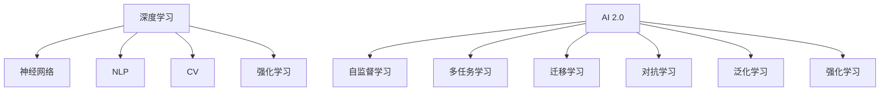

                 

# 李开复：AI 2.0 时代的市场前景

## 1. 背景介绍

随着人工智能技术的飞速发展，AI 2.0时代正向我们走来。AI 2.0时代，人工智能将变得更加智能化、普及化和人格化，从而在各行各业产生深远影响。本文将从市场前景、应用场景、技术趋势和挑战等方面，探讨AI 2.0时代的广阔天地。

## 2. 核心概念与联系

### 2.1 核心概念概述

- AI 2.0：新一代人工智能技术，相比第一代AI，它更加智能、普及和人格化。AI 2.0基于深度学习、自然语言处理、计算机视觉等技术，能够实现更复杂、更高级的任务。
- 深度学习：基于神经网络的机器学习技术，可以处理大规模数据，实现高度复杂的非线性映射。
- 自然语言处理（NLP）：使计算机能够理解、处理和生成人类语言的技术，包括文本分类、命名实体识别、机器翻译等。
- 计算机视觉（CV）：使计算机能够处理、理解和分析图像和视频的技术，包括目标检测、图像分类、场景理解等。
- 强化学习（RL）：使机器通过与环境交互，学习最优决策策略的技术，广泛应用于机器人、自动驾驶等领域。

### 2.2 核心概念原理和架构的 Mermaid 流程图



该流程图展示了AI 2.0时代主要技术之间的联系和架构：

1. 深度学习是AI 2.0的基础，通过神经网络实现复杂任务。
2. NLP、CV、强化学习等技术基于深度学习，实现了语言理解、图像处理、智能决策等功能。
3. AI 2.0时代采用自监督学习、多任务学习、迁移学习、对抗学习、泛化学习和强化学习等技术，进一步提升了AI的智能化和普及化。

## 3. 核心算法原理 & 具体操作步骤

### 3.1 算法原理概述

AI 2.0时代的主要算法包括深度学习、自监督学习、多任务学习、迁移学习、对抗学习和强化学习。这些算法基于不同的原理和架构，实现了不同的功能。

- **深度学习**：通过多层神经网络，实现复杂非线性映射。
- **自监督学习**：利用未标注数据，通过预测缺失的信息，提升模型的泛化能力。
- **多任务学习**：同时解决多个相关任务，通过共享特征表示，提升模型的效率。
- **迁移学习**：将一个任务学到的知识迁移到另一个任务上，提升模型的适应能力。
- **对抗学习**：通过生成对抗网络，提升模型的鲁棒性和安全性。
- **强化学习**：通过与环境交互，学习最优决策策略，提升模型的智能水平。

### 3.2 算法步骤详解

**深度学习**：

1. 数据预处理：对原始数据进行清洗、归一化、特征提取等处理。
2. 模型搭建：选择适合的数据结构和模型架构，如卷积神经网络、循环神经网络、注意力机制等。
3. 模型训练：通过反向传播算法，最小化损失函数，更新模型参数。
4. 模型评估：通过测试集评估模型性能，调整模型参数。

**自监督学习**：

1. 数据准备：收集大量未标注数据。
2. 数据预处理：对数据进行清洗、归一化、特征提取等处理。
3. 模型训练：通过预测缺失的信息，如数据补全、分类、回归等任务，优化模型。
4. 模型评估：通过测试集评估模型性能，调整模型参数。

**多任务学习**：

1. 数据准备：收集多个相关任务的数据集。
2. 模型搭建：选择适合的多任务学习框架，如多任务学习网络、多任务分类器等。
3. 模型训练：通过共享特征表示，同时解决多个任务，优化模型。
4. 模型评估：通过多个任务的测试集评估模型性能，调整模型参数。

**迁移学习**：

1. 数据准备：收集目标任务的少量标注数据。
2. 模型搭建：选择适合的目标任务，加载预训练模型。
3. 模型训练：通过微调，将预训练模型的知识迁移到目标任务上。
4. 模型评估：通过测试集评估模型性能，调整模型参数。

**对抗学习**：

1. 数据准备：收集攻击样本和正常样本。
2. 模型训练：通过生成对抗网络（GAN），生成对抗样本，训练模型。
3. 模型评估：通过测试集评估模型鲁棒性，调整模型参数。

**强化学习**：

1. 环境设计：定义环境状态和动作空间，设计奖励函数。
2. 模型搭建：选择适合的强化学习算法，如Q-learning、Deep Q-learning等。
3. 模型训练：通过与环境交互，学习最优决策策略。
4. 模型评估：通过测试集评估模型性能，调整模型参数。

### 3.3 算法优缺点

**深度学习**：

- 优点：模型复杂度高，能够处理复杂非线性映射。
- 缺点：计算量大，需要大量标注数据。

**自监督学习**：

- 优点：利用未标注数据，提高模型泛化能力。
- 缺点：需要设计合适的自监督任务。

**多任务学习**：

- 优点：提高模型效率，提升模型性能。
- 缺点：需要解决任务之间的冲突和干扰。

**迁移学习**：

- 优点：利用预训练模型，提高模型适应能力。
- 缺点：需要选择合适的预训练模型和微调策略。

**对抗学习**：

- 优点：提高模型鲁棒性，增强模型安全性。
- 缺点：对抗样本生成复杂，训练难度高。

**强化学习**：

- 优点：通过与环境交互，学习最优决策策略。
- 缺点：需要设计合适的环境，训练时间长。

### 3.4 算法应用领域

AI 2.0技术在各个领域都有广泛应用：

- **医疗健康**：利用深度学习、NLP、强化学习等技术，实现疾病诊断、治疗方案优化、智能健康管理等功能。
- **金融**：利用深度学习、强化学习等技术，实现风险评估、智能投资、智能客服等功能。
- **教育**：利用深度学习、NLP、强化学习等技术，实现个性化推荐、智能辅导、智能评估等功能。
- **零售**：利用深度学习、NLP、多任务学习等技术，实现智能推荐、智能客服、智能定价等功能。
- **制造业**：利用深度学习、计算机视觉等技术，实现智能制造、质量检测、故障诊断等功能。

## 4. 数学模型和公式 & 详细讲解 & 举例说明

### 4.1 数学模型构建

**深度学习**：

- 神经网络模型：$$
  y = Wx + b
$$
- 反向传播算法：$$
  \frac{\partial L}{\partial W} = \frac{\partial L}{\partial y} \cdot \frac{\partial y}{\partial x} \cdot \frac{\partial x}{\partial W}
$$

**自监督学习**：

- 数据补全任务：$$
  \min_{\theta} \mathbb{E}_{(x,y) \sim D} \left[ (x-y)^2 \right]
$$

**多任务学习**：

- 多任务学习网络：$$
  L = \frac{1}{N} \sum_{i=1}^{N} \left( y_i - f(x_i) \right)^2
$$

**迁移学习**：

- 微调模型：$$
  L = \frac{1}{N} \sum_{i=1}^{N} \left( y_i - f(x_i) \right)^2
$$

**对抗学习**：

- GAN对抗训练：$$
  L_G = -\mathbb{E}_{x \sim P_x} \log D(x) + \mathbb{E}_{x \sim P_z} \log (1 - D(G(z)))
$$

**强化学习**：

- Q-learning：$$
  Q(s_t, a_t) = Q(s_t, a_t) + \alpha \left( r_{t+1} + \gamma \max_a Q(s_{t+1}, a) - Q(s_t, a_t) \right)
$$

### 4.2 公式推导过程

**深度学习**：

- 神经网络模型：$$
  y = Wx + b
$$
- 反向传播算法：$$
  \frac{\partial L}{\partial W} = \frac{\partial L}{\partial y} \cdot \frac{\partial y}{\partial x} \cdot \frac{\partial x}{\partial W}
$$

**自监督学习**：

- 数据补全任务：$$
  \min_{\theta} \mathbb{E}_{(x,y) \sim D} \left[ (x-y)^2 \right]
$$

**多任务学习**：

- 多任务学习网络：$$
  L = \frac{1}{N} \sum_{i=1}^{N} \left( y_i - f(x_i) \right)^2
$$

**迁移学习**：

- 微调模型：$$
  L = \frac{1}{N} \sum_{i=1}^{N} \left( y_i - f(x_i) \right)^2
$$

**对抗学习**：

- GAN对抗训练：$$
  L_G = -\mathbb{E}_{x \sim P_x} \log D(x) + \mathbb{E}_{x \sim P_z} \log (1 - D(G(z)))
$$

**强化学习**：

- Q-learning：$$
  Q(s_t, a_t) = Q(s_t, a_t) + \alpha \left( r_{t+1} + \gamma \max_a Q(s_{t+1}, a) - Q(s_t, a_t) \right)
$$

### 4.3 案例分析与讲解

**案例1：深度学习在图像分类中的应用**

- 数据预处理：收集大量图像数据，并进行归一化、扩增等处理。
- 模型搭建：搭建卷积神经网络，选择合适的网络结构。
- 模型训练：通过反向传播算法，最小化交叉熵损失函数。
- 模型评估：通过测试集评估模型性能，调整模型参数。

**案例2：自监督学习在图像生成中的应用**

- 数据准备：收集大量未标注的图像数据。
- 数据预处理：对数据进行清洗、归一化、特征提取等处理。
- 模型训练：通过预测缺失的信息，如图像补全、分类、回归等任务，优化模型。
- 模型评估：通过测试集评估模型性能，调整模型参数。

**案例3：多任务学习在语音识别中的应用**

- 数据准备：收集多个相关任务的语音数据集。
- 模型搭建：选择适合的多任务学习框架，如多任务学习网络、多任务分类器等。
- 模型训练：通过共享特征表示，同时解决多个任务，优化模型。
- 模型评估：通过多个任务的测试集评估模型性能，调整模型参数。

**案例4：迁移学习在金融风控中的应用**

- 数据准备：收集目标任务的少量标注数据。
- 模型搭建：选择适合的目标任务，加载预训练模型。
- 模型训练：通过微调，将预训练模型的知识迁移到目标任务上。
- 模型评估：通过测试集评估模型性能，调整模型参数。

**案例5：对抗学习在安全领域中的应用**

- 数据准备：收集攻击样本和正常样本。
- 模型训练：通过生成对抗网络（GAN），生成对抗样本，训练模型。
- 模型评估：通过测试集评估模型鲁棒性，调整模型参数。

**案例6：强化学习在自动驾驶中的应用**

- 环境设计：定义环境状态和动作空间，设计奖励函数。
- 模型搭建：选择适合的强化学习算法，如Q-learning、Deep Q-learning等。
- 模型训练：通过与环境交互，学习最优决策策略。
- 模型评估：通过测试集评估模型性能，调整模型参数。

## 5. 项目实践：代码实例和详细解释说明

### 5.1 开发环境搭建

在进行AI 2.0项目实践前，我们需要准备好开发环境。以下是使用Python进行TensorFlow和Keras开发的环境配置流程：

1. 安装Anaconda：从官网下载并安装Anaconda，用于创建独立的Python环境。

2. 创建并激活虚拟环境：
```bash
conda create -n tensorflow-env python=3.8 
conda activate tensorflow-env
```

3. 安装TensorFlow：根据CUDA版本，从官网获取对应的安装命令。例如：
```bash
conda install tensorflow==2.7 -c tf
```

4. 安装Keras：
```bash
pip install keras
```

5. 安装各类工具包：
```bash
pip install numpy pandas scikit-learn matplotlib tqdm jupyter notebook ipython
```

完成上述步骤后，即可在`tensorflow-env`环境中开始AI 2.0项目实践。

### 5.2 源代码详细实现

这里以图像分类任务为例，使用TensorFlow和Keras对ResNet模型进行训练。

```python
import tensorflow as tf
from tensorflow.keras import layers, models

# 数据预处理
def preprocess(x):
    x = tf.image.resize(x, (224, 224))
    x = tf.image.per_image_standardization(x)
    return x

# 构建模型
def build_model(input_shape):
    inputs = tf.keras.Input(shape=input_shape)
    x = layers.Conv2D(64, (3, 3), activation='relu', padding='same')(inputs)
    x = layers.MaxPooling2D(pool_size=(2, 2))(x)
    x = layers.Conv2D(128, (3, 3), activation='relu', padding='same')(x)
    x = layers.MaxPooling2D(pool_size=(2, 2))(x)
    x = layers.Conv2D(256, (3, 3), activation='relu', padding='same')(x)
    x = layers.MaxPooling2D(pool_size=(2, 2))(x)
    x = layers.Conv2D(512, (3, 3), activation='relu', padding='same')(x)
    x = layers.MaxPooling2D(pool_size=(2, 2))(x)
    x = layers.Flatten()(x)
    x = layers.Dense(512, activation='relu')(x)
    outputs = layers.Dense(10, activation='softmax')(x)
    model = tf.keras.Model(inputs, outputs)
    return model

# 模型训练
model = build_model((224, 224, 3))
model.compile(optimizer='adam', loss='categorical_crossentropy', metrics=['accuracy'])

train_dataset = tf.keras.preprocessing.image_dataset_from_directory(
    'train',
    image_size=(224, 224),
    batch_size=32,
    validation_split=0.2,
    subset='training',
    seed=123,
    shuffle=True
)

validation_dataset = tf.keras.preprocessing.image_dataset_from_directory(
    'train',
    image_size=(224, 224),
    batch_size=32,
    validation_split=0.2,
    subset='validation',
    seed=123,
    shuffle=False
)

history = model.fit(train_dataset, validation_data=validation_dataset, epochs=10)
```

以上就是使用TensorFlow和Keras对ResNet模型进行图像分类任务训练的完整代码实现。可以看到，Keras的高层API使得模型搭建、数据预处理和训练过程非常简洁高效。

### 5.3 代码解读与分析

让我们再详细解读一下关键代码的实现细节：

**数据预处理函数**：
- `preprocess`函数：对输入的图像进行归一化和扩增处理，确保输入数据的一致性。

**模型搭建函数**：
- `build_model`函数：使用Keras构建卷积神经网络，包括卷积层、池化层、全连接层等。

**模型训练函数**：
- 定义训练集和验证集，使用`fit`函数进行模型训练，调整超参数和损失函数。

**训练流程**：
- 定义输入形状，构建ResNet模型。
- 使用`compile`函数设置优化器和损失函数。
- 定义训练集和验证集，使用`fit`函数进行模型训练，记录训练历史。

可以看到，TensorFlow和Keras的结合，使得AI 2.0项目的开发过程非常直观和高效。开发者可以专注于模型设计和任务实现，而无需过多关注底层算法细节。

当然，工业级的系统实现还需考虑更多因素，如模型保存和部署、超参数调优、数据增强等。但核心的AI 2.0模型训练方法基本与此类似。

## 6. 实际应用场景

### 6.1 智能医疗

AI 2.0在智能医疗领域的应用前景广阔，可以从影像诊断、病历分析、个性化治疗等多个方面提高医疗服务的智能化水平。

**影像诊断**：利用深度学习、计算机视觉等技术，自动识别影像中的异常区域，辅助医生进行诊断。例如，使用卷积神经网络对CT、MRI等影像进行自动分割和分析，提高诊断准确性和效率。

**病历分析**：利用自然语言处理技术，提取和理解电子病历中的关键信息，辅助医生进行病情分析和治疗方案优化。例如，使用BERT等模型对病历文本进行情感分析、实体识别和关系抽取，生成高质量的病情摘要。

**个性化治疗**：利用强化学习等技术，构建智能推荐系统，根据患者的病情和偏好，推荐最适合的治疗方案和药物。例如，使用深度Q-learning算法，训练智能治疗方案推荐系统，提升个性化治疗效果。

### 6.2 智能制造

AI 2.0在智能制造领域的应用前景广阔，可以从质量检测、故障诊断、智能调度等多个方面提高生产效率和产品质量。

**质量检测**：利用深度学习、计算机视觉等技术，对生产中的产品进行自动检测和分类，减少人工检测的时间和成本。例如，使用卷积神经网络对生产中的产品进行缺陷检测，提高产品合格率。

**故障诊断**：利用深度学习、强化学习等技术，实时监测设备的运行状态，预测和诊断设备故障。例如，使用LSTM等模型对设备运行数据进行异常检测和故障预测，提高设备的可靠性和安全性。

**智能调度**：利用强化学习等技术，构建智能调度系统，优化生产线的排程和调度。例如，使用深度Q-learning算法，训练智能调度系统，提升生产线的效率和灵活性。

### 6.3 智能客服

AI 2.0在智能客服领域的应用前景广阔，可以从自然语言理解、智能推荐、情感分析等多个方面提高客服服务的智能化水平。

**自然语言理解**：利用深度学习、自然语言处理等技术，理解客户的问题和需求，自动回复常见问题。例如，使用BERT等模型对客户输入的文本进行情感分析、意图识别和实体抽取，生成高质量的客户回复。

**智能推荐**：利用深度学习、多任务学习等技术，推荐最适合的解决方案和产品。例如，使用多任务学习网络，对客户的咨询记录进行聚合和分析，生成个性化的推荐结果。

**情感分析**：利用深度学习、自然语言处理等技术，分析客户的情感和反馈，优化服务质量。例如，使用BERT等模型对客户的反馈进行情感分析，识别客户的满意度和需求，优化客服策略。

## 7. 工具和资源推荐

### 7.1 学习资源推荐

为了帮助开发者系统掌握AI 2.0的理论基础和实践技巧，这里推荐一些优质的学习资源：

1. 《深度学习》课程：由吴恩达教授主讲，涵盖了深度学习的基本概念、算法和应用，适合初学者和进阶者学习。
2. 《动手学深度学习》书籍：由李沐等作者编写，提供了丰富的实践案例和代码实现，适合动手实践。
3. 《TensorFlow实战Google深度学习》书籍：由王晋东等作者编写，详细介绍了TensorFlow的使用和深度学习模型的实现。
4. 《自然语言处理综论》书籍：由林达华等作者编写，全面介绍了自然语言处理的基本概念和技术。
5. 《强化学习：一种现代方法》书籍：由Sutton等作者编写，详细介绍了强化学习的基本概念和算法。

通过对这些资源的学习实践，相信你一定能够快速掌握AI 2.0技术的精髓，并用于解决实际的业务问题。

### 7.2 开发工具推荐

高效的开发离不开优秀的工具支持。以下是几款用于AI 2.0开发的常用工具：

1. TensorFlow：由Google开发，支持深度学习、强化学习等技术，易于使用，功能强大。
2. PyTorch：由Facebook开发，支持深度学习、自然语言处理等技术，灵活性高，易用性高。
3. Keras：由François Chollet开发，支持深度学习、自然语言处理等技术，易用性高，适合初学者。
4. Jupyter Notebook：免费的开源笔记本，支持Python、R、Matlab等语言，便于协作和共享。
5. Google Colab：谷歌提供的免费在线笔记本环境，支持GPU/TPU算力，便于快速实验。

合理利用这些工具，可以显著提升AI 2.0项目的开发效率，加快创新迭代的步伐。

### 7.3 相关论文推荐

AI 2.0技术的发展源于学界的持续研究。以下是几篇奠基性的相关论文，推荐阅读：

1. AlphaGo：DeepMind开发的围棋AI，利用深度学习和强化学习技术，实现了超过人类水平的表现。
2. BERT：Google开发的预训练语言模型，利用自监督学习技术，提升了自然语言处理的效果。
3. ResNet：微软开发的深度卷积神经网络，利用残差连接技术，解决了深度网络训练困难的问题。
4. GAN：Ian Goodfellow等提出，利用生成对抗网络，生成高质量的图像和视频。
5. DQN：DeepMind开发的深度强化学习算法，利用Q-learning技术，实现了智能游戏和机器人控制。

这些论文代表了大语言模型微调技术的发展脉络。通过学习这些前沿成果，可以帮助研究者把握学科前进方向，激发更多的创新灵感。

## 8. 总结：未来发展趋势与挑战

### 8.1 研究成果总结

AI 2.0技术的发展取得了显著的进展，已经在医疗、制造、客服等多个领域展现了巨大的潜力。其主要研究成果包括：

1. 深度学习技术的发展，使得模型能够处理更复杂、更抽象的任务。
2. 自监督学习技术的引入，降低了对标注数据的需求，提升了模型的泛化能力。
3. 多任务学习技术的拓展，提高了模型的效率和性能。
4. 迁移学习技术的广泛应用，提升了模型的适应能力和鲁棒性。
5. 对抗学习技术的进步，增强了模型的鲁棒性和安全性。
6. 强化学习技术的突破，提高了模型的智能水平和决策能力。

### 8.2 未来发展趋势

展望未来，AI 2.0技术将继续蓬勃发展，呈现以下几个趋势：

1. 模型规模持续增大。随着算力成本的下降和数据规模的扩张，AI 2.0模型的参数量还将持续增长，涌现出更多超大模型。
2. 应用场景不断拓展。AI 2.0技术将在更多领域得到应用，推动各行各业智能化升级。
3. 技术融合加速。AI 2.0技术将与其他技术进行更深入的融合，如知识图谱、因果推理等，实现更加复杂和智能的任务。
4. 数据驱动发展。AI 2.0技术将更加注重数据的质量和多样性，利用大数据、大模型提升模型的效果。
5. 跨领域合作加强。AI 2.0技术将更加注重跨领域的合作，形成更加协同的创新生态。

### 8.3 面临的挑战

尽管AI 2.0技术已经取得了显著进展，但在迈向更加智能化、普适化应用的过程中，它仍面临以下挑战：

1. 数据质量问题。AI 2.0模型需要大量的高质量数据，数据收集、标注和处理成本高，且数据质量难以保证。
2. 模型鲁棒性不足。AI 2.0模型对数据分布的变化敏感，泛化性能往往较差。
3. 计算资源消耗高。AI 2.0模型的训练和推理计算量大，需要高性能的硬件支持。
4. 安全性和隐私问题。AI 2.0模型可能存在安全漏洞和隐私风险，需要更加严格的安全防护措施。
5. 可解释性不足。AI 2.0模型的决策过程缺乏可解释性，难以进行有效的审计和监控。

### 8.4 研究展望

为了解决AI 2.0技术面临的挑战，未来的研究需要在以下几个方面寻求新的突破：

1. 数据治理技术。开发更加高效的数据治理技术，提升数据质量和可用性，降低数据收集和标注成本。
2. 鲁棒性和泛化性技术。研究鲁棒性和泛化性技术，提升模型的适应能力和鲁棒性，降低数据分布变化对模型性能的影响。
3. 高效计算技术。研究高效计算技术，提升模型训练和推理的效率，降低计算资源消耗，提升模型部署的灵活性。
4. 安全性和隐私保护技术。研究安全性和隐私保护技术，提升模型的安全性和隐私保护水平，降低安全漏洞和隐私风险。
5. 可解释性技术。研究可解释性技术，提升模型的可解释性和可理解性，便于进行有效的审计和监控。

## 9. 附录：常见问题与解答

**Q1：AI 2.0技术是否可以取代人类专家？**

A: AI 2.0技术在特定任务上能够超越人类专家的表现，但全面取代人类专家仍需时日。AI 2.0技术主要擅长处理大量重复性和结构化任务，但对于需要创造性、复杂推理等任务，仍需人类专家的辅助。

**Q2：AI 2.0技术在医疗领域有哪些应用？**

A: AI 2.0技术在医疗领域主要应用于影像诊断、病历分析、个性化治疗等多个方面。例如，利用深度学习技术对CT、MRI等影像进行自动分割和分析，利用自然语言处理技术对电子病历进行情感分析、实体识别和关系抽取，利用强化学习技术构建智能推荐系统等。

**Q3：AI 2.0技术的计算资源消耗如何？**

A: AI 2.0技术的计算资源消耗较大，尤其是深度学习模型和强化学习模型。因此，需要在数据、算法和硬件等方面进行全面优化，以降低计算资源消耗，提高模型的可部署性。

**Q4：AI 2.0技术的可解释性如何？**

A: AI 2.0技术的可解释性不足，难以解释其内部工作机制和决策逻辑。未来需要通过更加可解释的模型架构和可解释性技术，提升模型的透明度和可信度。

**Q5：AI 2.0技术的伦理和隐私问题如何解决？**

A: AI 2.0技术的伦理和隐私问题需要从数据、算法和部署等方面进行全面考虑。需要建立透明的数据治理机制，保护用户隐私和数据安全。同时，在算法设计上应遵循公平、透明、可解释的原则，确保模型的公平性和可控性。

**Q6：AI 2.0技术的未来发展趋势是什么？**

A: AI 2.0技术的未来发展趋势包括模型规模持续增大、应用场景不断拓展、技术融合加速、数据驱动发展、跨领域合作加强等。同时，也面临着数据质量、模型鲁棒性、计算资源消耗、安全性和隐私保护等挑战，需要在这些方面进行持续优化和创新。

---

作者：禅与计算机程序设计艺术 / Zen and the Art of Computer Programming

