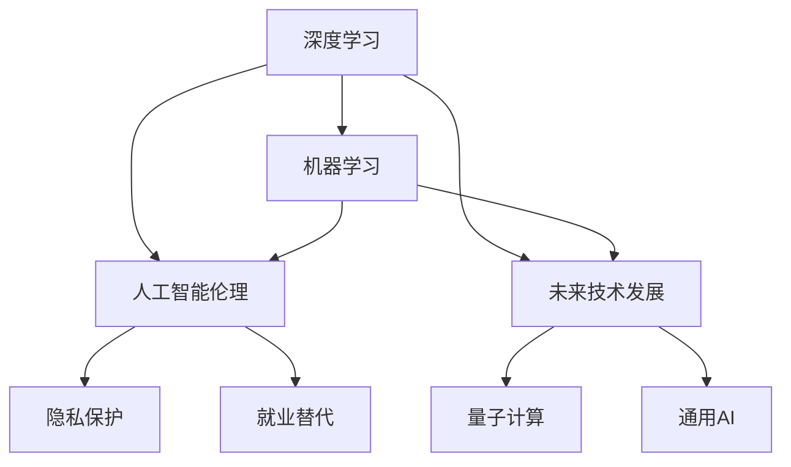

                 

# 李开复：AI 2.0 时代的意义

> 关键词：人工智能(AI) 2.0, 深度学习(Deep Learning), 机器学习(Machine Learning), 人工智能伦理(Ethics of AI), 未来技术发展(Future of Technology)

## 1. 背景介绍

### 1.1 人工智能的诞生与演变

人工智能(AI)的起源可以追溯到1950年代，当时计算机科学家提出了构建能够模拟人类智能的计算机程序的概念。自那时起，AI经历了多个阶段的发展，从专家系统到机器学习，再到深度学习。

- **专家系统**：20世纪70-80年代，专家系统通过规则和逻辑推理解决特定领域的问题。
- **机器学习**：20世纪90年代，机器学习算法如决策树、支持向量机(SVM)等被引入，AI开始具备自适应能力。
- **深度学习**：自2012年起，深度神经网络在图像识别、语音识别等任务中取得了突破性进展。

### 1.2 当前AI技术的发展

目前，AI技术已经进入AI 2.0时代。与早期的AI不同，AI 2.0更加注重数据的深度理解和模型的复杂性。AI 2.0的核心是深度学习和机器学习，通过海量数据的训练和优化，AI模型能够模拟复杂的非线性关系，从而实现高级的图像识别、语音处理、自然语言理解等任务。

## 2. 核心概念与联系

### 2.1 核心概念概述

为了更好地理解AI 2.0技术，我们将涉及以下几个核心概念：

- **深度学习(Deep Learning)**：一种使用多层神经网络进行特征提取和模型训练的技术，能够自动从数据中学习到复杂的多层次表示。
- **机器学习(Machine Learning)**：通过数据驱动的模型训练，使AI系统具备自适应和改进能力。
- **人工智能伦理(Ethics of AI)**：探讨AI技术在应用过程中可能带来的伦理和社会问题，如隐私保护、就业替代等。
- **未来技术发展(Future of Technology)**：研究AI技术的未来走向，如量子计算、通用AI等。

这些概念之间的关系可以通过以下Mermaid流程图来展示：



这个流程图展示了深度学习和机器学习在AI中的基础地位，以及伦理和未来技术发展对AI应用的影响。

### 2.2 核心概念原理和架构

深度学习的核心原理是通过多层神经网络对数据进行自动特征提取和表示学习。以图像识别为例，深度学习模型通过多层卷积和池化操作提取图像的特征，再通过全连接层进行分类。

架构上，典型的深度学习模型包括卷积神经网络(CNN)、循环神经网络(RNN)、变分自编码器(VAE)等。其中，卷积神经网络常用于图像处理，循环神经网络常用于序列数据处理，变分自编码器则用于生成新的数据样本。

机器学习则强调数据驱动的模型训练。通过收集大量标注数据，使用监督、无监督或半监督学习算法，机器学习模型能够自动学习数据中的规律，并在新数据上进行泛化。

人工智能伦理关注AI技术在实际应用中可能带来的负面影响，如隐私侵犯、算法偏见、自动化导致的就业问题等。通过制定伦理规范和标准，AI应用可以更好地符合社会价值观和法律要求。

未来技术发展则着眼于AI技术的长期演进，如量子计算、通用AI等，这些技术有望进一步提升AI的能力和应用范围。

## 3. 核心算法原理 & 具体操作步骤

### 3.1 算法原理概述

AI 2.0的核心算法是深度学习和机器学习。以下是两种典型的算法原理概述：

- **深度学习**：
  - **前向传播**：将输入数据通过神经网络逐层传递，每层将输入转化为高层次的特征表示。
  - **反向传播**：根据输出误差计算梯度，更新网络权重，以最小化损失函数。
  - **损失函数**：衡量模型预测结果与真实结果之间的差距，常见的有交叉熵、均方误差等。

- **机器学习**：
  - **监督学习**：使用有标签的数据进行模型训练，学习输入和输出之间的映射关系。
  - **无监督学习**：使用无标签的数据进行模型训练，发现数据中的隐含结构。
  - **半监督学习**：结合少量标签数据和大量无标签数据进行训练，提高模型的泛化能力。

### 3.2 算法步骤详解

AI 2.0的算法训练步骤主要包括以下几个关键步骤：

1. **数据准备**：收集和预处理数据集，确保数据的多样性和代表性。
2. **模型选择**：选择合适的深度学习或机器学习模型，如CNN、RNN、VAE等。
3. **模型训练**：使用训练集对模型进行迭代训练，最小化损失函数。
4. **模型评估**：使用验证集或测试集对训练好的模型进行评估，选择合适的超参数。
5. **模型应用**：将训练好的模型应用于实际场景，进行图像识别、语音识别、自然语言处理等任务。

### 3.3 算法优缺点

深度学习的主要优点包括：
- **自动特征提取**：能够从数据中自动学习到高层次的特征表示。
- **泛化能力强**：通过大量数据的训练，深度学习模型能够很好地泛化到新数据上。

缺点包括：
- **计算资源消耗大**：需要大量的计算资源进行训练和推理。
- **模型可解释性差**：深度学习模型往往是“黑盒”系统，难以解释其内部机制。

机器学习的主要优点包括：
- **灵活性高**：适用于各种类型的数据和任务。
- **模型可解释性强**：通过特征工程和规则分析，机器学习模型易于解释和调试。

缺点包括：
- **对数据质量依赖高**：模型性能很大程度上依赖于数据的质量和标注精度。
- **复杂度难以控制**：模型复杂度过高时，容易出现过拟合问题。

### 3.4 算法应用领域

AI 2.0技术在多个领域得到了广泛应用：

- **图像识别**：深度学习模型如卷积神经网络在图像分类、目标检测、人脸识别等任务中取得了显著效果。
- **自然语言处理**：机器学习模型如循环神经网络在语言模型、情感分析、机器翻译等任务中展现了强大的能力。
- **语音识别**：深度学习模型如卷积神经网络、递归神经网络在语音识别、语音合成、语音情感分析等任务中表现出色。
- **医疗诊断**：机器学习模型和深度学习模型在医学影像分析、疾病预测、基因分析等医疗领域得到了广泛应用。
- **金融分析**：机器学习模型在风险管理、投资预测、欺诈检测等金融任务中发挥了重要作用。

## 4. 数学模型和公式 & 详细讲解 & 举例说明

### 4.1 数学模型构建

AI 2.0的数学模型主要基于深度学习和机器学习的理论。以下是两个典型模型的数学模型构建：

- **卷积神经网络(CNN)**：
  - **输入层**：将输入图像转换为向量表示。
  - **卷积层**：通过卷积操作提取图像特征。
  - **池化层**：对特征图进行下采样，减小计算复杂度。
  - **全连接层**：将特征图转换为类别概率。

- **循环神经网络(RNN)**：
  - **输入层**：将序列数据转换为向量表示。
  - **循环层**：通过循环操作处理序列数据。
  - **输出层**：输出预测结果。

### 4.2 公式推导过程

以卷积神经网络为例，其数学公式推导如下：

设输入图像为 $X$，输出类别为 $Y$，卷积层中第 $i$ 层的特征图为 $Z_i$，卷积核为 $W$。卷积操作的公式为：

$$
Z_i = W_i * X
$$

其中 $*$ 表示卷积运算。

池化操作的公式为：

$$
Z_{i'} = MaxPooling(Z_i)
$$

其中 $MaxPooling$ 表示最大池化操作。

全连接层的公式为：

$$
Y = W_{FC} * Z_L
$$

其中 $W_{FC}$ 为全连接层的权重矩阵，$Z_L$ 为最后一个卷积层的输出特征图。

### 4.3 案例分析与讲解

以手写数字识别为例，CNN模型通过对输入图像的卷积和池化操作提取特征，再通过全连接层输出数字概率。训练过程中，通过反向传播算法更新卷积核和全连接层的权重，最小化交叉熵损失函数。

## 5. 项目实践：代码实例和详细解释说明

### 5.1 开发环境搭建

为了进行AI 2.0的深度学习和机器学习项目开发，需要准备如下开发环境：

1. **安装Python**：安装Python 3.x版本，建议使用Anaconda或Miniconda。
2. **安装深度学习库**：安装TensorFlow、PyTorch、Keras等深度学习库。
3. **安装机器学习库**：安装scikit-learn、pandas、numpy等机器学习库。
4. **安装GPU驱动**：安装NVIDIA CUDA驱动和cuDNN库，以便在GPU上进行深度学习计算。

### 5.2 源代码详细实现

以下是一个简单的手写数字识别项目，使用Keras框架实现：

```python
import keras
from keras.datasets import mnist
from keras.models import Sequential
from keras.layers import Dense, Dropout, Flatten
from keras.layers import Conv2D, MaxPooling2D
from keras.utils import to_categorical

# 加载MNIST数据集
(x_train, y_train), (x_test, y_test) = mnist.load_data()

# 数据预处理
x_train = x_train.reshape(x_train.shape[0], 28, 28, 1).astype('float32') / 255
x_test = x_test.reshape(x_test.shape[0], 28, 28, 1).astype('float32') / 255
y_train = to_categorical(y_train, 10)
y_test = to_categorical(y_test, 10)

# 定义模型
model = Sequential()
model.add(Conv2D(32, kernel_size=(3, 3), activation='relu', input_shape=(28, 28, 1)))
model.add(Conv2D(64, kernel_size=(3, 3), activation='relu'))
model.add(MaxPooling2D(pool_size=(2, 2)))
model.add(Dropout(0.25))
model.add(Flatten())
model.add(Dense(128, activation='relu'))
model.add(Dropout(0.5))
model.add(Dense(10, activation='softmax'))

# 编译模型
model.compile(loss=keras.losses.categorical_crossentropy, optimizer=keras.optimizers.Adadelta(), metrics=['accuracy'])

# 训练模型
model.fit(x_train, y_train, batch_size=128, epochs=10, verbose=1, validation_data=(x_test, y_test))

# 评估模型
score = model.evaluate(x_test, y_test, verbose=0)
print('Test loss:', score[0])
print('Test accuracy:', score[1])
```

### 5.3 代码解读与分析

上述代码中，我们使用了Keras框架搭建了一个简单的卷积神经网络，用于手写数字识别任务。关键代码解读如下：

- `mnist.load_data()`：加载MNIST数据集。
- `x_train = x_train.reshape(...)`：将输入数据从二维数组转换为三维张量，以便进行卷积操作。
- `y_train = to_categorical(y_train, 10)`：将标签转换为one-hot编码，方便模型的训练。
- `model.add(Conv2D(...))`：添加卷积层，通过卷积操作提取特征。
- `model.add(MaxPooling2D(pool_size=(2, 2)))`：添加池化层，对特征图进行下采样。
- `model.add(Dropout(0.25))`：添加Dropout层，防止过拟合。
- `model.add(Dense(...))`：添加全连接层，进行分类。
- `model.compile(...)`：编译模型，定义优化器和损失函数。
- `model.fit(...)`：训练模型，使用验证集评估模型性能。
- `model.evaluate(...)`：评估模型，输出测试集上的损失和准确率。

## 6. 实际应用场景

### 6.1 自动驾驶

AI 2.0技术在自动驾驶领域的应用前景广阔。通过深度学习和计算机视觉技术，自动驾驶系统能够实现实时感知、路径规划和决策控制等功能。

- **感知模块**：使用卷积神经网络处理摄像头和激光雷达等传感器数据，实现对周围环境的精准感知。
- **决策模块**：使用循环神经网络处理历史驾驶数据，学习驾驶行为和决策策略。
- **控制模块**：使用控制器进行车辆控制，实现自动转向、加速和刹车等操作。

### 6.2 医疗影像分析

AI 2.0技术在医疗影像分析中具有重要应用。通过深度学习模型，医生可以自动分析X光片、CT扫描等医学影像，快速发现病变区域和异常情况。

- **图像分割**：使用卷积神经网络对医学影像进行分割，提取病灶区域。
- **分类诊断**：使用卷积神经网络对医学影像进行分类，判断是否存在疾病。
- **影像增强**：使用深度学习模型对低质量影像进行增强，提高诊断准确率。

### 6.3 个性化推荐系统

AI 2.0技术在个性化推荐系统中也发挥了重要作用。通过深度学习和自然语言处理技术，推荐系统能够根据用户行为和偏好，提供个性化的商品、文章、视频等内容。

- **用户画像**：使用深度学习模型对用户行为进行分析，建立用户画像。
- **内容推荐**：使用卷积神经网络对商品、文章、视频等进行特征提取，学习用户偏好。
- **实时推荐**：使用循环神经网络对用户行为进行实时预测，动态调整推荐策略。

### 6.4 未来应用展望

未来，AI 2.0技术将在更多领域得到广泛应用，为人类生产生活带来深刻变革：

- **医疗健康**：通过AI 2.0技术，可以实现精准医疗、智能诊断和治疗规划，提升医疗服务的质量和效率。
- **教育培训**：通过AI 2.0技术，可以实现智能辅导、个性化学习推荐和自适应教学，提升教育效果和效率。
- **金融服务**：通过AI 2.0技术，可以实现风险管理、投资预测和欺诈检测，提升金融服务的精准性和安全性。
- **环境保护**：通过AI 2.0技术，可以实现环境监测、资源管理和灾害预测，推动可持续发展。
- **智能交通**：通过AI 2.0技术，可以实现智能交通管理、自动驾驶和智能物流，提升交通效率和安全性。

## 7. 工具和资源推荐

### 7.1 学习资源推荐

为了帮助开发者系统掌握AI 2.0技术的理论基础和实践技巧，这里推荐一些优质的学习资源：

1. **深度学习课程**：如斯坦福大学的CS231n课程、MIT的6.S191课程、Coursera上的Deep Learning Specialization课程等。
2. **机器学习课程**：如斯坦福大学的CS229课程、Coursera上的Machine Learning课程等。
3. **AI伦理课程**：如Coursera上的Ethics in AI课程、The Stanford AI Lab的AI伦理学研究等。
4. **未来技术发展研究**：如谷歌的DeepMind报告、OpenAI的AI未来报告等。
5. **开源框架文档**：如TensorFlow、PyTorch、Keras等框架的官方文档和用户手册。

### 7.2 开发工具推荐

AI 2.0技术的开发离不开优秀的工具支持。以下是几款用于AI 2.0开发的常用工具：

1. **深度学习框架**：如TensorFlow、PyTorch、Keras等，提供强大的模型构建和训练能力。
2. **机器学习库**：如scikit-learn、pandas、numpy等，提供便捷的数据处理和分析工具。
3. **可视化工具**：如TensorBoard、Weights & Biases等，用于监控模型训练和调试。
4. **云计算平台**：如AWS、Google Cloud、Azure等，提供强大的计算资源和分布式训练能力。
5. **Jupyter Notebook**：提供交互式编程环境，方便开发和实验。

### 7.3 相关论文推荐

AI 2.0技术的发展离不开学界的持续研究。以下是几篇奠基性的相关论文，推荐阅读：

1. **深度学习框架的发展**：如TensorFlow、PyTorch等框架的源代码和论文。
2. **机器学习算法的突破**：如卷积神经网络、循环神经网络、自编码器等算法的理论和应用。
3. **AI伦理和法律**：如《人工智能伦理：原则、问题和案例研究》等书籍。
4. **未来技术研究**：如量子计算、通用AI等前沿领域的研究论文。

## 8. 总结：未来发展趋势与挑战

### 8.1 研究成果总结

AI 2.0技术在多个领域得到了广泛应用，取得了显著的成效。以下是一些关键的成果和进展：

- **图像识别**：卷积神经网络在图像分类、目标检测、人脸识别等任务中取得了突破性进展。
- **自然语言处理**：循环神经网络和Transformer模型在语言模型、情感分析、机器翻译等任务中表现出色。
- **自动驾驶**：通过深度学习和计算机视觉技术，自动驾驶系统实现了实时感知、路径规划和决策控制等功能。
- **医疗影像分析**：卷积神经网络在医学影像分割和分类中展现了强大的能力。

### 8.2 未来发展趋势

AI 2.0技术的发展前景广阔，未来将呈现以下几个趋势：

- **模型规模不断增大**：随着计算资源的提升和数据量的增加，模型的参数量将不断增大，性能也将持续提升。
- **多模态融合**：AI 2.0技术将实现视觉、语音、文本等多模态数据的融合，提升系统的综合能力。
- **联邦学习**：通过分布式训练和边缘计算，AI 2.0技术将实现跨设备和跨系统的数据共享和模型协同。
- **自监督学习**：通过无监督学习方式，AI 2.0技术将实现数据驱动的模型训练，减少对标注数据的依赖。
- **零样本学习**：通过迁移学习和多模态数据融合，AI 2.0技术将实现零样本学习和泛化能力的提升。

### 8.3 面临的挑战

尽管AI 2.0技术在多个领域得到了广泛应用，但仍面临一些挑战：

- **计算资源需求高**：AI 2.0技术的训练和推理需要大量的计算资源，如何提升算法的计算效率是重要的研究方向。
- **数据质量不稳定**：AI 2.0技术对数据质量的要求很高，如何确保数据的多样性和代表性是关键问题。
- **模型可解释性差**：AI 2.0技术往往是“黑盒”系统，难以解释其内部机制，如何提高模型的可解释性是重要的研究方向。
- **伦理和安全问题**：AI 2.0技术在应用过程中可能带来隐私侵犯、算法偏见等伦理和安全问题，如何制定伦理规范和标准是重要的研究方向。
- **未来技术的不确定性**：AI 2.0技术在未来的发展方向不确定，如何确保技术的长期稳定性和可持续发展是重要的研究方向。

### 8.4 研究展望

未来，AI 2.0技术将在更多领域得到广泛应用，为人类生产生活带来深刻变革。以下是一些重要的研究方向：

- **知识表示和推理**：通过知识图谱和符号化语言，AI 2.0技术将实现更全面的知识表示和推理。
- **因果推理**：通过因果推断和因果分析，AI 2.0技术将实现更精确的决策和预测。
- **模型集成和协同**：通过模型集成和协同计算，AI 2.0技术将实现更高效和稳定的系统运行。
- **隐私保护和安全**：通过差分隐私和联邦学习等技术，AI 2.0技术将实现更强的隐私保护和安全保障。
- **伦理和法律**：通过制定伦理规范和法律框架，AI 2.0技术将实现更合规和可持续的应用。

## 9. 附录：常见问题与解答

**Q1: AI 2.0技术是否会替代人类工作？**

A: AI 2.0技术在许多领域展现出强大的能力，但不会完全替代人类工作。AI 2.0技术在处理重复性、高危性、高精度的工作中表现出色，但需要人类进行监督和干预。AI 2.0技术的优势在于提升工作效率和质量，而不是替代人类。

**Q2: 如何避免AI 2.0技术的偏见？**

A: 避免AI 2.0技术的偏见需要从多个方面进行努力：
- **数据多样性**：确保训练数据的多样性和代表性，避免数据偏见。
- **模型公平性**：设计公平的损失函数和评估指标，避免模型偏见。
- **算法透明性**：提高算法的可解释性，便于发现和修正偏见。
- **伦理审查**：建立伦理审查机制，定期评估AI系统的公平性和透明性。

**Q3: AI 2.0技术的未来方向是什么？**

A: AI 2.0技术的未来方向包括：
- **通用AI**：实现具有通用智能的AI系统，能够处理复杂的逻辑和推理任务。
- **量子计算**：通过量子计算提升AI算法的计算效率，实现更强大的AI能力。
- **跨模态融合**：实现视觉、语音、文本等多模态数据的融合，提升系统的综合能力。
- **自监督学习**：通过无监督学习方式，减少对标注数据的依赖。
- **联邦学习**：通过分布式训练和边缘计算，实现跨设备和跨系统的数据共享和模型协同。

**Q4: AI 2.0技术的优势是什么？**

A: AI 2.0技术的优势包括：
- **高效处理复杂任务**：AI 2.0技术能够高效处理复杂的非线性任务，如图像识别、语音识别、自然语言处理等。
- **自我学习和适应**：AI 2.0技术能够自动学习和适应新数据和新任务，提升系统的泛化能力。
- **集成多模态数据**：AI 2.0技术能够集成视觉、语音、文本等多模态数据，提升系统的综合能力。
- **提高工作效率**：AI 2.0技术能够自动化处理大量数据和任务，提升工作效率和质量。
- **减少人工干预**：AI 2.0技术能够自动进行决策和推理，减少人工干预和错误。

**Q5: 如何评估AI 2.0技术的效果？**

A: 评估AI 2.0技术的效果需要从多个方面进行：
- **模型精度**：通过测试集上的准确率、召回率、F1-score等指标评估模型的性能。
- **模型可解释性**：通过特征分析、可视化等方式评估模型的可解释性和透明性。
- **模型鲁棒性**：通过对抗样本、数据增强等方式评估模型的鲁棒性和泛化能力。
- **应用效果**：通过实际应用场景中的表现评估模型的效果，如推荐系统的个性化推荐能力、医疗影像分析的诊断准确率等。

---

作者：禅与计算机程序设计艺术 / Zen and the Art of Computer Programming

