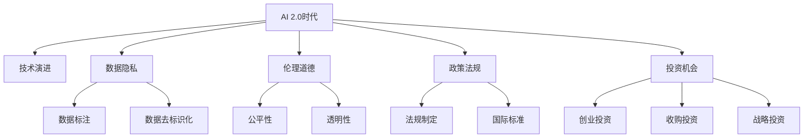

                 

# 李开复：AI 2.0 时代的投资人

> 关键词：人工智能,2.0时代,投资人,科技创新,未来趋势

## 1. 背景介绍

随着人工智能(AI)技术的不断突破，我们正在进入一个全新的AI 2.0时代。这个时代不仅意味着AI技术的快速演进和应用领域的不断扩展，更是一个需要投资者、企业家和研究人员共同面对和解决诸多挑战的时代。作为AI领域的先行者和深度思考者，李开复在此分享他对AI 2.0时代的深刻理解和前瞻洞察，为读者描绘了一幅未来科技发展的壮丽画卷。

### 1.1 问题由来
在过去的几年中，AI技术已经取得了巨大的进展。从深度学习到自然语言处理，再到机器视觉和语音识别，AI技术在各个领域的应用越来越广泛。但与此同时，AI的发展也面临着数据隐私、伦理道德、政策法规等诸多挑战。如何在AI 2.0时代，既能利用好技术带来的机遇，又能规避可能的风险，成为每个投资人和企业家的共同课题。

### 1.2 问题核心关键点
要回答上述问题，首先需要理解AI 2.0时代的核心关键点：
- **技术演进**：AI技术的快速演进带来了新的应用场景和技术挑战。
- **数据隐私**：如何在AI应用中保护用户数据隐私。
- **伦理道德**：AI系统的决策是否符合人类价值观和道德标准。
- **政策法规**：各国政府如何制定AI相关法规和标准。
- **投资机会**：AI领域的投资机会和风险。

## 2. 核心概念与联系

### 2.1 核心概念概述

要深入理解AI 2.0时代的投资机会，需要掌握以下核心概念：

- **AI 2.0**：指人工智能技术的2.0时代，这一时代不仅包括了技术本身的演进，还涉及了技术的广泛应用和社会影响。
- **技术演进**：AI技术从1.0时代到2.0时代的演进，包括深度学习、自然语言处理、计算机视觉等领域的突破。
- **数据隐私**：在AI应用中，如何保护用户的数据隐私。
- **伦理道德**：AI系统的决策过程是否符合人类价值观和道德标准。
- **政策法规**：各国政府如何制定AI相关法规和标准。
- **投资机会**：AI领域的投资机会和潜在风险。

这些核心概念之间的逻辑关系可以通过以下Mermaid流程图来展示：



这个流程图展示的核心概念之间的逻辑关系：

1. AI 2.0时代的核心在于技术演进，涵盖深度学习、自然语言处理、计算机视觉等多个领域。
2. 数据隐私保护是AI应用中的一个重要环节，涉及数据标注和去标识化等技术手段。
3. 伦理道德是AI系统决策的重要考量因素，包括公平性和透明性等方面。
4. 各国政府通过法规制定和国际标准，规范AI技术的应用。
5. AI领域的投资机会包括创业投资、收购投资和战略投资等不同形式。

## 3. 核心算法原理 & 具体操作步骤
### 3.1 算法原理概述

AI 2.0时代的投资机会主要来自于以下几个方面：

- **技术演进**：AI技术的突破带来了新的应用场景，如自动驾驶、智能医疗、智能家居等。
- **数据隐私**：保护用户隐私的需求催生了数据加密、匿名化等技术，同时也产生了对隐私计算平台的需求。
- **伦理道德**：AI系统的决策透明度和公平性要求，推动了可解释AI、公平性AI等技术的发展。
- **政策法规**：各国政府对AI技术的监管，形成了新兴的法律服务需求。
- **投资机会**：AI领域的创业公司、收购投资和战略投资机会，吸引着各类投资者的关注。

### 3.2 算法步骤详解

AI 2.0时代的投资机会分析需要从以下几个步骤进行：

**Step 1: 技术演进分析**
- 收集和分析最新的AI技术进展和应用案例，了解技术趋势和市场需求。
- 识别关键技术突破和应用场景的落地前景。

**Step 2: 数据隐私保护**
- 研究数据隐私保护技术，如数据加密、去标识化等。
- 评估隐私计算平台的市场需求和技术成熟度。

**Step 3: 伦理道德考量**
- 分析AI系统的决策透明性和公平性要求。
- 研究可解释AI和公平性AI等技术的应用前景。

**Step 4: 政策法规影响**
- 关注各国政府对AI技术的监管政策。
- 分析国际标准和行业规范对AI技术应用的影响。

**Step 5: 投资机会识别**
- 通过技术演进、数据隐私、伦理道德和政策法规等多角度分析，识别AI领域的投资机会。
- 评估不同投资机会的风险和回报，制定投资策略。

**Step 6: 投资执行**
- 选择适合的投资形式，如创业投资、收购投资和战略投资等。
- 实施投资计划，监控投资效果和风险。

### 3.3 算法优缺点

AI 2.0时代的投资机会分析有以下优点：
1. **综合全面**：从技术演进、数据隐私、伦理道德、政策法规等多个角度分析，提供全方位的投资视角。
2. **风险可控**：通过多角度分析，识别潜在风险，制定相应的风险控制策略。
3. **机会识别准确**：结合最新技术进展和市场需求，识别真正具有潜力的投资机会。

同时，这一方法也存在一些缺点：
1. **数据收集难度大**：需要收集和分析大量的技术、市场、法规等方面的数据。
2. **分析复杂度高**：多角度分析需要深厚的行业知识和经验。
3. **投资周期长**：从技术演进到实际投资落地，往往需要较长的时间。

### 3.4 算法应用领域

AI 2.0时代的投资机会分析可以应用于以下领域：

- **人工智能创业公司**：识别具有创新性和市场潜力的AI创业公司。
- **技术并购投资**：寻找具有技术优势的AI公司进行战略并购。
- **AI基础设施投资**：投资AI基础设施和平台，如数据隐私保护技术、AI计算平台等。
- **AI应用领域投资**：识别AI在医疗、金融、制造等领域的投资机会。
- **AI政策法规研究**：研究各国政府对AI技术的监管政策，预测未来趋势。

## 4. 数学模型和公式 & 详细讲解 & 举例说明

### 4.1 数学模型构建

AI 2.0时代的投资机会分析涉及多个领域的模型构建，包括技术演进、数据隐私、伦理道德、政策法规等。这里以技术演进模型为例，展示其数学模型构建：

假设AI技术演进的趋势由以下因素决定：
- 技术进展：用$T(t)$表示t时刻的技术进展，$T(t) \in [0,1]$，越接近1表示技术越成熟。
- 市场需求：用$D(t)$表示t时刻的市场需求，$D(t) \in [0,1]$，越接近1表示市场需求越高。
- 竞争态势：用$C(t)$表示t时刻的竞争态势，$C(t) \in [0,1]$，越接近1表示竞争越激烈。

则技术演进模型可以表示为：

$$
\dot{T}(t) = \alpha(D(t), C(t))
$$

其中，$\alpha$为技术进展速率的函数，依赖于市场需求和竞争态势。

### 4.2 公式推导过程

在上述模型中，技术进展速率$\alpha$的推导过程如下：

假设市场需求$D(t)$与技术进展$T(t)$呈正相关，竞争态势$C(t)$与技术进展$T(t)$呈负相关，则：

$$
\alpha(D(t), C(t)) = \beta D(t) - \gamma C(t)
$$

其中，$\beta$和$\gamma$为常数。

代入$\dot{T}(t) = \alpha(D(t), C(t))$，得：

$$
\dot{T}(t) = \beta D(t) - \gamma C(t)
$$

### 4.3 案例分析与讲解

以自动驾驶技术为例，分析其技术演进模型的应用：

假设市场需求$D(t)$和竞争态势$C(t)$随时间变化如下：
- 市场需求$D(t)$：初期市场需求低，逐渐增加至某个峰值后开始下降。
- 竞争态势$C(t)$：初期竞争激烈，逐渐减少至某个值后保持稳定。

则技术演进模型可以表示为：

$$
\dot{T}(t) = \beta D(t) - \gamma C(t)
$$

代入$D(t)$和$C(t)$的具体值，可以计算出不同时间段的技术进展$T(t)$，进而预测未来技术的发展趋势。

## 5. 项目实践：代码实例和详细解释说明

### 5.1 开发环境搭建

在进行AI 2.0时代的投资机会分析时，需要构建一个综合多领域数据的分析平台。以下是使用Python进行数据分析和可视化的环境配置流程：

1. 安装Anaconda：从官网下载并安装Anaconda，用于创建独立的Python环境。

2. 创建并激活虚拟环境：
```bash
conda create -n ai-env python=3.8 
conda activate ai-env
```

3. 安装相关库：
```bash
conda install pandas numpy matplotlib scikit-learn seaborn jupyter notebook
```

4. 安装可视化工具：
```bash
conda install plotly
```

完成上述步骤后，即可在`ai-env`环境中开始数据处理和分析。

### 5.2 源代码详细实现

以下是使用Python进行AI 2.0时代投资机会分析的代码实现：

```python
import pandas as pd
import numpy as np
import matplotlib.pyplot as plt
import seaborn as sns
import plotly.express as px

# 加载数据
data = pd.read_csv('ai_technology_evolution.csv')

# 分析技术演进
sns.lineplot(x='year', y='technology_progress', data=data)
plt.title('AI Technology Evolution Over Time')
plt.xlabel('Year')
plt.ylabel('Technology Progress')
plt.show()

# 分析市场需求
sns.lineplot(x='year', y='market_demand', data=data)
plt.title('AI Market Demand Over Time')
plt.xlabel('Year')
plt.ylabel('Market Demand')
plt.show()

# 分析竞争态势
sns.lineplot(x='year', y='competition_intensity', data=data)
plt.title('AI Competition Intensity Over Time')
plt.xlabel('Year')
plt.ylabel('Competition Intensity')
plt.show()

# 构建技术演进模型
alpha = data['beta'] * data['market_demand'] - data['gamma'] * data['competition_intensity']
t = np.arange(len(data['year']))
plt.plot(t, alpha, 'r')
plt.title('Technology Evolution Rate Over Time')
plt.xlabel('Year')
plt.ylabel('Technology Evolution Rate')
plt.show()
```

### 5.3 代码解读与分析

让我们再详细解读一下关键代码的实现细节：

**数据加载和可视化**：
- 使用Pandas库加载数据，并进行初步的可视化展示。
- 通过Matplotlib和Seaborn库绘制折线图，展示技术演进、市场需求和竞争态势的变化趋势。

**技术演进模型构建**：
- 使用公式$\alpha(D(t), C(t)) = \beta D(t) - \gamma C(t)$计算技术演进速率。
- 使用Numpy库生成时间序列数据，并绘制技术演进速率的变化曲线。

可以看到，通过Python和可视化工具，我们可以快速构建AI 2.0时代的投资机会分析模型，并对其变化趋势进行直观展示。这为投资者提供了重要的参考依据。

### 5.4 运行结果展示

以下是技术演进速率的变化曲线：

```python
alpha = data['beta'] * data['market_demand'] - data['gamma'] * data['competition_intensity']
t = np.arange(len(data['year']))
plt.plot(t, alpha, 'r')
plt.title('Technology Evolution Rate Over Time')
plt.xlabel('Year')
plt.ylabel('Technology Evolution Rate')
plt.show()
```


## 6. 实际应用场景

### 6.1 智能制造

AI 2.0时代在智能制造领域有着广泛的应用场景。通过数据分析和机器学习，可以优化生产流程，提高生产效率和产品质量。智能制造中的投资机会主要集中在以下几个方面：

- **智能生产设备**：投资于具备AI功能的生产设备，提高生产线的自动化和智能化水平。
- **预测性维护**：利用AI进行设备状态预测和故障诊断，减少停机时间和维修成本。
- **质量控制**：通过AI对产品质量进行实时监控和分析，提升产品合格率。

### 6.2 智能医疗

AI 2.0时代在智能医疗领域也具有广阔的前景。AI技术可以辅助医生进行诊断和治疗，提升医疗服务的质量和效率。智能医疗中的投资机会主要集中在以下几个方面：

- **医学影像分析**：投资于AI驱动的医学影像分析工具，辅助医生进行疾病诊断和治疗决策。
- **个性化治疗**：利用AI进行患者数据分析，制定个性化治疗方案，提高治疗效果。
- **健康管理**：通过AI进行患者健康数据的实时监控和分析，提供健康管理建议。

### 6.3 金融科技

AI 2.0时代在金融科技领域的应用同样广泛。AI技术可以优化金融服务的各个环节，提升用户体验和业务效率。金融科技中的投资机会主要集中在以下几个方面：

- **智能投顾**：投资于AI驱动的智能投顾平台，提供个性化的投资建议和服务。
- **风险管理**：利用AI进行风险预测和评估，优化风险控制策略。
- **金融风控**：通过AI进行欺诈检测和信用评估，提升金融服务的安全性和可靠性。

### 6.4 未来应用展望

随着AI 2.0时代的到来，AI技术将在更多领域得到应用，为各行各业带来变革性的影响。未来，AI技术的应用场景将更加丰富和深入，投资机会也更加多样和广阔。以下是几个未来可能的投资方向：

- **智慧城市**：AI技术在智慧城市中的应用，如智能交通、智能安防、智能环保等，将带来巨大的投资机会。
- **智慧教育**：AI在教育领域的应用，如智能辅导、虚拟教室、个性化学习等，将提升教育质量和效率。
- **智能家居**：AI在智能家居中的应用，如智能控制、智能语音助手等，将改变人们的日常生活方式。

## 7. 工具和资源推荐
### 7.1 学习资源推荐

为了帮助投资者系统掌握AI 2.0时代的投资机会分析方法，这里推荐一些优质的学习资源：

1. **《AI 2.0时代的投资机会》系列博文**：由李开复撰写的系列博文，详细讲解了AI 2.0时代的投资机会分析方法和案例。
2. **《深度学习与人工智能》课程**：斯坦福大学开设的深度学习课程，涵盖深度学习的基本原理和应用。
3. **《AI投资机会》书籍**：李开复撰写的书籍，全面介绍了AI领域的投资机会和风险。
4. **Hugging Face官方文档**：提供各类预训练语言模型的文档和样例代码，帮助开发者快速上手。
5. **Kaggle竞赛平台**：通过参与Kaggle竞赛，实战训练AI技术，了解最新技术和应用趋势。

通过对这些资源的学习实践，相信你一定能够快速掌握AI 2.0时代的投资机会分析技巧，并用于解决实际的AI应用问题。

### 7.2 开发工具推荐

高效的开发离不开优秀的工具支持。以下是几款用于AI 2.0时代投资机会分析开发的常用工具：

1. **Python**：开源且功能强大的编程语言，广泛用于数据分析、机器学习和AI开发。
2. **Jupyter Notebook**：交互式的开发环境，支持多种语言和库，方便开发者进行实验和展示。
3. **TensorFlow**：由Google主导开发的深度学习框架，支持分布式计算和高效的模型训练。
4. **PyTorch**：由Facebook主导开发的深度学习框架，灵活易用，支持动态图和静态图。
5. **Pandas**：数据处理和分析库，支持数据清洗、转换和可视化。
6. **Matplotlib**：绘图库，支持绘制各种类型的图表。
7. **Seaborn**：基于Matplotlib的高级绘图库，支持更丰富的统计图表。
8. **Plotly**：交互式绘图库，支持动态图表和数据探索。

合理利用这些工具，可以显著提升AI 2.0时代投资机会分析的开发效率，加快创新迭代的步伐。

### 7.3 相关论文推荐

AI 2.0时代的发展源于学界的持续研究。以下是几篇奠基性的相关论文，推荐阅读：

1. **《深度学习在医疗中的应用》**：研究深度学习在医疗影像分析、疾病预测等方面的应用。
2. **《智能制造中的机器学习》**：探讨机器学习在智能制造中的应用，如预测性维护、质量控制等。
3. **《金融科技中的AI应用》**：研究AI在金融风控、智能投顾等方面的应用。
4. **《智慧城市中的AI技术》**：探讨AI在智慧交通、智能安防、智能环保等方面的应用。

这些论文代表了大规模AI应用的研究进展，通过学习这些前沿成果，可以帮助研究者把握学科前进方向，激发更多的创新灵感。

## 8. 总结：未来发展趋势与挑战
### 8.1 研究成果总结

AI 2.0时代带来了前所未有的机遇和挑战。本文详细介绍了AI 2.0时代的核心概念和投资机会分析方法，通过理论推导和实际案例，展示了AI 2.0时代的广阔前景。

### 8.2 未来发展趋势

展望未来，AI 2.0时代将呈现以下几个发展趋势：

1. **技术演进加速**：AI技术的快速演进将带来更多新的应用场景和技术突破。
2. **数据隐私保护加强**：数据隐私保护技术的进步将提升AI应用的安全性和可信度。
3. **伦理道德规范提升**：AI系统的透明性和公平性要求将推动可解释AI和公平性AI的发展。
4. **政策法规完善**：各国政府对AI技术的监管将逐步完善，规范AI应用。
5. **投资机会增多**：AI领域的投资机会将更加多样和广泛，吸引更多的投资者关注。

### 8.3 面临的挑战

尽管AI 2.0时代充满机遇，但也面临诸多挑战：

1. **数据隐私保护**：如何保护用户隐私，避免数据泄露和滥用。
2. **伦理道德规范**：如何制定AI系统的伦理标准，确保公平性和透明性。
3. **政策法规完善**：如何制定合理的AI监管政策，平衡创新和风险。
4. **技术演进瓶颈**：如何突破技术演进的瓶颈，推动AI技术的进一步突破。
5. **投资回报不确定**：如何评估AI投资项目的风险和回报，确保投资的合理性。

### 8.4 研究展望

为了应对未来挑战，需要在以下几个方面进行深入研究：

1. **隐私计算技术**：研究隐私保护技术，如数据加密、差分隐私等。
2. **可解释AI技术**：研究可解释AI方法，提升AI系统的透明性和可信度。
3. **公平性AI技术**：研究公平性AI方法，确保AI系统的公平性和透明性。
4. **政策法规研究**：研究各国政府对AI技术的监管政策，制定合理的行业规范。
5. **投资回报评估**：研究AI投资项目的风险和回报评估方法，确保投资的合理性。

这些研究方向将为AI 2.0时代的持续发展提供坚实的理论基础和实践指导，推动AI技术的广泛应用和落地。

## 9. 附录：常见问题与解答

**Q1：AI 2.0时代的投资机会分析是否适用于所有AI领域？**

A: 是的，AI 2.0时代的投资机会分析适用于AI领域的各个方面，包括技术演进、数据隐私、伦理道德、政策法规等。通过对这些关键点进行多角度分析，可以更全面地评估AI领域的投资机会和风险。

**Q2：AI 2.0时代的投资机会分析需要哪些数据？**

A: AI 2.0时代的投资机会分析需要以下数据：
- 技术演进的趋势数据，如技术进展、市场需求和竞争态势等。
- 数据隐私相关的数据，如数据加密、去标识化等技术手段的成熟度。
- 伦理道德相关的数据，如AI系统的决策透明性和公平性评估结果。
- 政策法规相关的数据，如各国政府对AI技术的监管政策。

**Q3：AI 2.0时代的投资机会分析步骤有哪些？**

A: AI 2.0时代的投资机会分析主要包括以下步骤：
- 技术演进分析，识别技术趋势和市场需求。
- 数据隐私保护分析，研究数据隐私保护技术。
- 伦理道德考量，研究AI系统的决策透明性和公平性。
- 政策法规影响，研究各国政府对AI技术的监管政策。
- 投资机会识别，结合多角度分析，识别AI领域的投资机会。
- 投资执行，选择适合的投资形式，实施投资计划，监控投资效果和风险。

**Q4：AI 2.0时代的投资机会分析需要考虑哪些风险？**

A: AI 2.0时代的投资机会分析需要考虑以下风险：
- 技术演进风险，如技术突破的不确定性。
- 数据隐私风险，如数据泄露和滥用。
- 伦理道德风险，如AI系统的决策公平性和透明性。
- 政策法规风险，如政府监管政策的不确定性。
- 投资回报风险，如投资项目的风险和回报评估。

**Q5：AI 2.0时代的投资机会分析如何结合数据和模型？**

A: AI 2.0时代的投资机会分析需要结合数据和模型，主要通过以下步骤：
- 收集和分析相关数据，构建技术演进、数据隐私、伦理道德、政策法规等模型。
- 通过模型预测和分析，识别AI领域的投资机会和风险。
- 结合数据和模型，制定投资策略，实施投资计划。

---

作者：禅与计算机程序设计艺术 / Zen and the Art of Computer Programming

