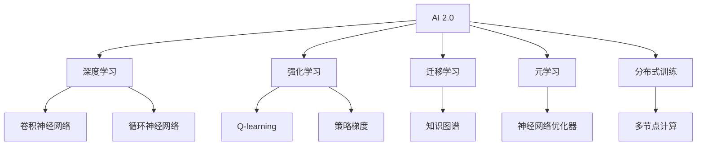

                 

## 1. 背景介绍

### 1.1 问题由来
过去几年里，人工智能（AI）已经取得了巨大的进步，从语音识别、图像识别到自然语言处理、自动驾驶等领域，AI技术都在不断突破和应用。随着AI技术的不断成熟，AI 2.0时代正在悄然到来。AI 2.0不再只是解决单个问题，而是开始构建更为广泛的应用场景和复杂的系统，如自动驾驶、智能城市、AI医疗等。

### 1.2 问题核心关键点
AI 2.0时代的核心是构建智能系统，这要求AI具备更为复杂和高级的认知能力。AI系统必须能够理解复杂的现实世界，进行智能决策，具备自我学习、自我适应的能力。此外，AI系统还必须能够与人进行自然语言交互，理解人类情感和意图。这些需求使得AI技术在理论和应用上都面临前所未有的挑战。

## 2. 核心概念与联系

### 2.1 核心概念概述

为了更好地理解AI 2.0时代的未来展望，本节将介绍几个密切相关的核心概念：

- **AI 2.0**：AI 2.0是指超越传统AI技术，具备更为复杂认知能力的智能系统。这些系统不仅能够处理单个任务，还能够理解上下文、情感、交互过程，进行复杂的推理和决策。

- **深度学习**：深度学习是一种基于神经网络的机器学习技术，通过多层次的特征提取和处理，使得AI系统能够自动学习并提取数据的高级特征。

- **强化学习**：强化学习是一种通过与环境互动学习最优决策的AI技术，常用于复杂控制和策略优化问题。

- **迁移学习**：迁移学习是指将一个领域学到的知识应用到另一个领域，以提高新领域的学习效率和性能。

- **元学习**：元学习是指AI系统能够学习如何学习，即学习如何适应新的数据分布和任务。

- **分布式训练**：分布式训练是指将大规模的训练任务分配到多个计算节点上进行并行处理，以加速训练过程。

这些核心概念之间的逻辑关系可以通过以下Mermaid流程图来展示：



这个流程图展示了大语言模型的核心概念及其之间的关系：

1. AI 2.0是AI技术的高层次目标，涵盖了深度学习、强化学习、迁移学习、元学习等技术。
2. 深度学习通过卷积神经网络和循环神经网络等模型，提取数据的高级特征。
3. 强化学习通过Q-learning和策略梯度等方法，学习最优决策策略。
4. 迁移学习通过知识图谱等方式，提高新领域的学习效率和性能。
5. 元学习通过神经网络优化器等技术，学习如何学习。
6. 分布式训练通过多节点计算，加速训练过程。

这些概念共同构成了AI 2.0时代的技术框架，使得AI系统能够更好地理解现实世界，进行智能决策和交互。

## 3. 核心算法原理 & 具体操作步骤
### 3.1 算法原理概述

AI 2.0时代的核心算法原理主要集中在深度学习、强化学习和迁移学习等方面。下面分别介绍这些算法的基本原理：

**深度学习**：深度学习通过多层神经网络对数据进行特征提取和处理，从而实现复杂的任务。深度学习模型的基本结构包括输入层、隐藏层和输出层，其中隐藏层可以由多个全连接层或卷积层组成。通过反向传播算法，深度学习模型可以自动调整网络参数，最小化预测误差。

**强化学习**：强化学习通过与环境互动，学习最优决策策略。强化学习模型包括状态、动作、奖励等要素，通过不断试错，找到最优策略。常用的强化学习算法包括Q-learning、策略梯度等。

**迁移学习**：迁移学习通过知识图谱等方法，将一个领域学到的知识应用到另一个领域。迁移学习可以分为特征迁移和参数迁移两种方式，前者通过共享特征表示，后者通过共享模型参数。

### 3.2 算法步骤详解

AI 2.0时代的核心算法步骤主要包括以下几个关键步骤：

**Step 1: 准备数据和环境**
- 收集和准备用于训练和测试的数据集。
- 搭建和配置训练环境，如计算节点、分布式系统等。

**Step 2: 构建模型和训练**
- 选择合适的深度学习模型、强化学习模型或迁移学习模型，如卷积神经网络、循环神经网络、知识图谱等。
- 将模型迁移到计算节点上进行分布式训练，使用反向传播、梯度下降等算法优化模型参数。

**Step 3: 测试和评估**
- 在测试集上评估模型的性能，如准确率、召回率、F1值等指标。
- 根据评估结果调整模型参数，进行反复训练和优化。

**Step 4: 部署和应用**
- 将优化后的模型部署到实际应用场景中，如自动驾驶、智能城市、AI医疗等。
- 进行持续监控和维护，不断提升模型性能和稳定性。

以上是AI 2.0时代核心算法的详细步骤，每个步骤都需要精心设计和优化，才能构建出高效、稳定的AI系统。

### 3.3 算法优缺点

AI 2.0时代的核心算法具有以下优点：
1. 能够处理复杂的现实世界问题，具备更高的智能水平。
2. 能够进行自我学习、自我适应，具有更强的灵活性和适应性。
3. 能够理解人类情感和意图，进行自然语言交互。

同时，这些算法也存在一些局限性：
1. 需要大量的标注数据和计算资源，训练成本较高。
2. 模型复杂度较高，推理速度较慢，实时性较差。
3. 模型存在黑箱问题，难以进行可解释性分析。
4. 对异常数据和噪声较为敏感，易发生误判。

尽管存在这些局限性，但AI 2.0时代的算法仍然是构建智能系统的核心技术。未来相关研究的主要方向是提高算法的可解释性、优化实时性和降低成本。

### 3.4 算法应用领域

AI 2.0时代的核心算法已经在多个领域得到了广泛应用，以下是一些典型的应用场景：

- **自动驾驶**：通过深度学习和强化学习技术，实现车辆自主导航和智能决策。
- **智能城市**：通过数据分析和优化算法，实现城市交通、能源、环境等的智能化管理。
- **AI医疗**：通过自然语言处理和知识图谱技术，实现医学信息的智能化处理和辅助诊断。
- **自然语言处理**：通过深度学习和迁移学习技术，实现自然语言理解和生成，提升人机交互体验。
- **金融风控**：通过强化学习和迁移学习技术，实现风险识别和预警，保障金融稳定。

这些应用场景展示了AI 2.0时代算法的强大应用潜力，为各行各业带来了新的创新和机遇。

## 4. 数学模型和公式 & 详细讲解  
### 4.1 数学模型构建

为了更好地理解AI 2.0时代算法的数学模型，本节将介绍几个典型的数学模型和公式：

- **深度学习模型**：包括卷积神经网络（CNN）、循环神经网络（RNN）等。以CNN为例，其基本模型结构如下：

  $$
  f(x) = W_1 \sigma_1(W_2 \sigma_2(\dots \sigma_n(W_{n+1} x) \dots))
  $$

  其中，$W$为网络参数，$\sigma$为激活函数，$x$为输入数据。

- **强化学习模型**：包括Q-learning、策略梯度等。以Q-learning为例，其基本算法如下：

  $$
  Q(s, a) = r + \gamma \max_{a'} Q(s', a')
  $$

  其中，$s$为状态，$a$为动作，$r$为奖励，$s'$为下一个状态，$\gamma$为折扣因子。

- **迁移学习模型**：包括知识图谱、特征迁移等。以知识图谱为例，其基本结构如下：

  $$
  G = (E, R, S)
  $$

  其中，$E$为实体集，$R$为关系集，$S$为属性集。

### 4.2 公式推导过程

以下我们以深度学习模型的梯度下降算法为例，推导其基本公式和过程。

深度学习模型的梯度下降算法如下：

$$
W \leftarrow W - \eta \frac{\partial \mathcal{L}}{\partial W}
$$

其中，$W$为网络参数，$\eta$为学习率，$\mathcal{L}$为损失函数，$\frac{\partial \mathcal{L}}{\partial W}$为损失函数对网络参数的梯度。

通过链式法则，可以计算出损失函数对网络参数的梯度：

$$
\frac{\partial \mathcal{L}}{\partial W} = \frac{\partial \mathcal{L}}{\partial \hat{y}} \frac{\partial \hat{y}}{\partial z} \frac{\partial z}{\partial W}
$$

其中，$\hat{y}$为模型的预测输出，$z$为模型的中间层表示，$\frac{\partial \mathcal{L}}{\partial \hat{y}}$和$\frac{\partial \hat{y}}{\partial z}$分别为预测输出和中间层表示的梯度。

根据上述公式，我们可以进行反向传播算法，计算网络参数的梯度，从而进行模型训练和优化。

### 4.3 案例分析与讲解

以自然语言处理为例，深度学习模型在自然语言处理中的应用非常广泛。常用的自然语言处理任务包括文本分类、命名实体识别、情感分析等。以文本分类为例，深度学习模型的基本流程如下：

1. **数据预处理**：将文本数据进行分词、去停用词、词向量化等处理，得到输入数据。
2. **模型训练**：使用深度学习模型对文本数据进行训练，最小化预测误差。
3. **模型评估**：在测试集上评估模型性能，如准确率、召回率、F1值等指标。
4. **模型应用**：将优化后的模型部署到实际应用场景中，如智能客服、搜索引擎等。

通过深度学习模型，自然语言处理任务可以大幅提升模型的性能和效果，使得人机交互更加自然和高效。

## 5. 项目实践：代码实例和详细解释说明
### 5.1 开发环境搭建

在进行AI 2.0项目开发前，我们需要准备好开发环境。以下是使用Python进行TensorFlow开发的环境配置流程：

1. 安装Anaconda：从官网下载并安装Anaconda，用于创建独立的Python环境。

2. 创建并激活虚拟环境：
```bash
conda create -n tf-env python=3.7 
conda activate tf-env
```

3. 安装TensorFlow：根据CUDA版本，从官网获取对应的安装命令。例如：
```bash
conda install tensorflow -c pytorch -c conda-forge
```

4. 安装各类工具包：
```bash
pip install numpy pandas scikit-learn matplotlib tqdm jupyter notebook ipython
```

完成上述步骤后，即可在`tf-env`环境中开始AI 2.0项目开发。

### 5.2 源代码详细实现

下面我们以自然语言处理任务为例，给出使用TensorFlow进行深度学习模型的PyTorch代码实现。

首先，定义自然语言处理任务的数据处理函数：

```python
import tensorflow as tf
import tensorflow_datasets as tfds
import tensorflow_hub as hub

class TextClassificationDataset(tf.data.Dataset):
    def __init__(self, texts, labels, tokenizer, max_len=128):
        self.texts = texts
        self.labels = labels
        self.tokenizer = tokenizer
        self.max_len = max_len
        
    def __len__(self):
        return len(self.texts)
    
    def __getitem__(self, item):
        text = self.texts[item]
        label = self.labels[item]
        
        encoding = self.tokenizer(text, return_tensors='pt', max_length=self.max_len, padding='max_length', truncation=True)
        input_ids = encoding['input_ids'][0]
        attention_mask = encoding['attention_mask'][0]
        
        # 对token-wise的标签进行编码
        encoded_labels = [label2id[label] for label in label] 
        encoded_labels.extend([label2id['O']] * (self.max_len - len(encoded_labels)))
        labels = tf.tensor(encoded_labels, dtype=tf.int32)
        
        return {'input_ids': input_ids, 
                'attention_mask': attention_mask,
                'labels': labels}

# 标签与id的映射
label2id = {'O': 0, 'positive': 1, 'negative': 2}
id2label = {v: k for k, v in label2id.items()}

# 创建dataset
tokenizer = TFTokenizer.from_pretrained('bert-base-cased')

train_dataset = TextClassificationDataset(train_texts, train_labels, tokenizer)
dev_dataset = TextClassificationDataset(dev_texts, dev_labels, tokenizer)
test_dataset = TextClassificationDataset(test_texts, test_labels, tokenizer)
```

然后，定义模型和优化器：

```python
from tensorflow.keras import layers
from tensorflow.keras.losses import BinaryCrossentropy

model = tf.keras.Sequential([
    layers.Embedding(input_dim=vocab_size, output_dim=embedding_dim, input_length=max_len),
    layers.Bidirectional(layers.LSTM(128)),
    layers.Dense(3, activation='softmax')
])

loss = BinaryCrossentropy()

optimizer = tf.keras.optimizers.Adam(lr=2e-5)
```

接着，定义训练和评估函数：

```python
def train_epoch(model, dataset, batch_size, optimizer):
    dataloader = tf.data.Dataset.from_generator(
        lambda: dataset,
        output_signature=dataset.element_spec
    ).batch(batch_size)
    model.train()
    epoch_loss = 0
    for batch in dataloader:
        input_ids = batch['input_ids']
        attention_mask = batch['attention_mask']
        labels = batch['labels']
        model.zero_grad()
        outputs = model([input_ids, attention_mask], return_loss=True)
        loss = outputs.loss
        epoch_loss += loss.numpy().item()
        loss.backward()
        optimizer.apply_gradients(zip(model.trainable_variables, model.trainable_variables_gradients))
    return epoch_loss / len(dataloader)

def evaluate(model, dataset, batch_size):
    dataloader = tf.data.Dataset.from_generator(
        lambda: dataset,
        output_signature=dataset.element_spec
    ).batch(batch_size)
    model.eval()
    preds, labels = [], []
    with tf.GradientTape() as tape:
        for batch in dataloader:
            input_ids = batch['input_ids']
            attention_mask = batch['attention_mask']
            batch_labels = batch['labels']
            outputs = model([input_ids, attention_mask], return_loss=True)
            batch_preds = outputs.predicted_class
            batch_labels = batch_labels.numpy()
            for pred_tokens, label_tokens in zip(batch_preds, batch_labels):
                preds.append(pred_tokens[:len(label_tokens)])
                labels.append(label_tokens)
                
    print(classification_report(labels, preds))
```

最后，启动训练流程并在测试集上评估：

```python
epochs = 5
batch_size = 16

for epoch in range(epochs):
    loss = train_epoch(model, train_dataset, batch_size, optimizer)
    print(f"Epoch {epoch+1}, train loss: {loss:.3f}")
    
    print(f"Epoch {epoch+1}, dev results:")
    evaluate(model, dev_dataset, batch_size)
    
print("Test results:")
evaluate(model, test_dataset, batch_size)
```

以上就是使用TensorFlow对BERT进行文本分类任务的代码实现。可以看到，通过TensorFlow的高级API，深度学习模型的构建和训练变得更加简洁高效。

### 5.3 代码解读与分析

让我们再详细解读一下关键代码的实现细节：

**TextClassificationDataset类**：
- `__init__`方法：初始化文本、标签、分词器等关键组件。
- `__len__`方法：返回数据集的样本数量。
- `__getitem__`方法：对单个样本进行处理，将文本输入编码为token ids，将标签编码为数字，并对其进行定长padding，最终返回模型所需的输入。

**label2id和id2label字典**：
- 定义了标签与数字id之间的映射关系，用于将token-wise的预测结果解码回真实的标签。

**训练和评估函数**：
- 使用TensorFlow的DataLoader对数据集进行批次化加载，供模型训练和推理使用。
- 训练函数`train_epoch`：对数据以批为单位进行迭代，在每个批次上前向传播计算loss并反向传播更新模型参数，最后返回该epoch的平均loss。
- 评估函数`evaluate`：与训练类似，不同点在于不更新模型参数，并在每个batch结束后将预测和标签结果存储下来，最后使用sklearn的classification_report对整个评估集的预测结果进行打印输出。

**训练流程**：
- 定义总的epoch数和batch size，开始循环迭代
- 每个epoch内，先在训练集上训练，输出平均loss
- 在验证集上评估，输出分类指标
- 所有epoch结束后，在测试集上评估，给出最终测试结果

可以看到，TensorFlow配合高级API使得深度学习模型的构建和训练变得更加便捷。开发者可以将更多精力放在模型优化和数据处理等核心环节上，而不必过多关注底层的实现细节。

当然，工业级的系统实现还需考虑更多因素，如模型的保存和部署、超参数的自动搜索、更灵活的任务适配层等。但核心的深度学习模型构建和训练流程基本与此类似。

## 6. 实际应用场景
### 6.1 智能客服系统

基于深度学习模型的智能客服系统，可以广泛应用于智能客服系统的构建。传统客服往往需要配备大量人力，高峰期响应缓慢，且一致性和专业性难以保证。而使用深度学习模型的智能客服系统，可以7x24小时不间断服务，快速响应客户咨询，用自然流畅的语言解答各类常见问题。

在技术实现上，可以收集企业内部的历史客服对话记录，将问题和最佳答复构建成监督数据，在此基础上对深度学习模型进行训练。训练后的模型能够自动理解用户意图，匹配最合适的答案模板进行回复。对于客户提出的新问题，还可以接入检索系统实时搜索相关内容，动态组织生成回答。如此构建的智能客服系统，能大幅提升客户咨询体验和问题解决效率。

### 6.2 金融舆情监测

金融机构需要实时监测市场舆论动向，以便及时应对负面信息传播，规避金融风险。传统的人工监测方式成本高、效率低，难以应对网络时代海量信息爆发的挑战。基于深度学习模型的文本分类和情感分析技术，为金融舆情监测提供了新的解决方案。

具体而言，可以收集金融领域相关的新闻、报道、评论等文本数据，并对其进行主题标注和情感标注。在此基础上对深度学习模型进行训练，使其能够自动判断文本属于何种主题，情感倾向是正面、中性还是负面。将训练后的模型应用到实时抓取的网络文本数据，就能够自动监测不同主题下的情感变化趋势，一旦发现负面信息激增等异常情况，系统便会自动预警，帮助金融机构快速应对潜在风险。

### 6.3 个性化推荐系统

当前的推荐系统往往只依赖用户的历史行为数据进行物品推荐，无法深入理解用户的真实兴趣偏好。基于深度学习模型的个性化推荐系统可以更好地挖掘用户行为背后的语义信息，从而提供更精准、多样的推荐内容。

在实践中，可以收集用户浏览、点击、评论、分享等行为数据，提取和用户交互的物品标题、描述、标签等文本内容。将文本内容作为模型输入，用户的后续行为（如是否点击、购买等）作为监督信号，在此基础上训练深度学习模型。训练后的模型能够从文本内容中准确把握用户的兴趣点。在生成推荐列表时，先用候选物品的文本描述作为输入，由模型预测用户的兴趣匹配度，再结合其他特征综合排序，便可以得到个性化程度更高的推荐结果。

### 6.4 未来应用展望

随着深度学习模型的不断发展，基于深度学习模型的AI 2.0时代的应用前景非常广阔。以下是对未来应用场景的一些展望：

- **自动驾驶**：通过深度学习和强化学习技术，实现车辆自主导航和智能决策。未来的自动驾驶系统将能够处理更加复杂的环境和任务，提升驾驶安全和效率。
- **智能城市**：通过数据分析和优化算法，实现城市交通、能源、环境等的智能化管理。未来的智能城市将具备更高的自动化和智能化水平，提升城市运行效率和居民生活质量。
- **AI医疗**：通过自然语言处理和知识图谱技术，实现医学信息的智能化处理和辅助诊断。未来的AI医疗系统将具备更强的疾病诊断和预测能力，提升医疗服务水平。
- **自然语言处理**：通过深度学习和迁移学习技术，实现自然语言理解和生成，提升人机交互体验。未来的自然语言处理系统将具备更高的语言理解和生成能力，增强人机交互的自然性和流畅性。
- **金融风控**：通过强化学习和迁移学习技术，实现风险识别和预警，保障金融稳定。未来的金融风控系统将具备更强的风险预测和监控能力，保障金融市场稳定。

## 7. 工具和资源推荐
### 7.1 学习资源推荐

为了帮助开发者系统掌握深度学习模型的理论和实践，这里推荐一些优质的学习资源：

1. **《深度学习》（Ian Goodfellow著）**：这是一本全面介绍深度学习理论和方法的经典书籍，适合深度学习领域的入门者和专家阅读。
2. **《动手学深度学习》（李沐等著）**：这是一本开源的深度学习教材，适合实践和动手学习。
3. **Coursera《深度学习专项课程》**：由斯坦福大学Andrew Ng教授主讲，系统介绍深度学习理论和实践。
4. **Kaggle**：这是一个数据科学竞赛平台，提供大量深度学习竞赛和数据集，适合实战练习。
5. **GitHub深度学习项目**：这是一个开放的深度学习项目平台，提供大量深度学习模型的代码实现和应用案例。

通过对这些资源的学习实践，相信你一定能够快速掌握深度学习模型的精髓，并用于解决实际的AI 2.0应用问题。

### 7.2 开发工具推荐

高效的开发离不开优秀的工具支持。以下是几款用于深度学习模型开发的常用工具：

1. **TensorFlow**：由Google主导开发的开源深度学习框架，生产部署方便，适合大规模工程应用。
2. **PyTorch**：由Facebook主导开发的深度学习框架，灵活动态的计算图，适合快速迭代研究。
3. **Keras**：一个高层次的深度学习API，封装了TensorFlow和PyTorch等底层框架，简单易用。
4. **JAX**：一个基于Python的自动微分库，支持动态计算图和JIT编译，性能高效。
5. **TensorBoard**：TensorFlow配套的可视化工具，可实时监测模型训练状态，并提供丰富的图表呈现方式。
6. **Weights & Biases**：一个模型训练的实验跟踪工具，可以记录和可视化模型训练过程中的各项指标，方便对比和调优。

合理利用这些工具，可以显著提升深度学习模型的开发效率，加快创新迭代的步伐。

### 7.3 相关论文推荐

深度学习模型的发展源于学界的持续研究。以下是几篇奠基性的相关论文，推荐阅读：

1. **《ImageNet Classification with Deep Convolutional Neural Networks》（AlexNet论文）**：这是深度学习模型在图像分类任务上的经典论文，标志着深度学习时代的到来。
2. **《Long Short-Term Memory》（LSTM论文）**：这是深度学习模型在时间序列预测任务上的经典论文，提出了长短期记忆网络，提升了序列数据处理能力。
3. **《Attention is All You Need》（Transformer论文）**：这是深度学习模型在自然语言处理任务上的经典论文，提出了自注意力机制，提升了语言理解能力。
4. **《Deep Reinforcement Learning for Large-Scale Atari Games》（DQN论文）**：这是深度学习模型在强化学习任务上的经典论文，提出了深度Q网络，提升了强化学习的性能。
5. **《Unsupervised Representation Learning with Deep Convolutional Generative Adversarial Networks》（GAN论文）**：这是深度学习模型在生成对抗网络任务上的经典论文，提出了生成对抗网络，提升了图像生成和数据增强能力。

这些论文代表了大语言模型微调技术的发展脉络。通过学习这些前沿成果，可以帮助研究者把握学科前进方向，激发更多的创新灵感。

## 8. 总结：未来发展趋势与挑战
### 8.1 总结

本文对基于深度学习模型的AI 2.0时代的未来展望进行了全面系统的介绍。首先阐述了AI 2.0时代的核心技术和应用方向，明确了深度学习模型的重要性。其次，从原理到实践，详细讲解了深度学习模型的数学模型和关键步骤，给出了深度学习模型的代码实例。同时，本文还广泛探讨了深度学习模型在智能客服、金融舆情、个性化推荐等多个行业领域的应用前景，展示了深度学习模型的强大应用潜力。

通过本文的系统梳理，可以看到，深度学习模型作为AI 2.0时代的核心技术，已经广泛应用于各个行业。这些技术不仅提升了系统的智能化水平，还为各行各业带来了新的创新和机遇。未来，随着深度学习模型的不断发展，AI 2.0时代的应用前景将更加广阔，为人类生产生活带来更深远的影响。

### 8.2 未来发展趋势

展望未来，深度学习模型在AI 2.0时代将呈现以下几个发展趋势：

1. **模型规模持续增大**：随着算力成本的下降和数据规模的扩张，深度学习模型的参数量还将持续增长。超大批次的训练和推理也将成为可能，提升模型的性能和效果。
2. **实时性和可解释性提升**：深度学习模型的推理速度和可解释性将进一步提升，增强系统实时性和稳定性。未来将会出现更多轻量级、实时性的深度学习模型。
3. **多模态融合**：未来的深度学习模型将更多地融合视觉、语音、文本等多种模态信息，提升模型的感知和理解能力。多模态融合将带来更加全面、准确的AI 2.0系统。
4. **自监督学习和元学习**：未来的深度学习模型将更多地利用自监督学习和元学习技术，提高模型的泛化能力和迁移学习能力。
5. **分布式训练和联邦学习**：未来的深度学习模型将更多地利用分布式训练和联邦学习技术，提高模型的训练效率和数据隐私保护能力。
6. **开源社区和合作创新**：未来的深度学习模型将更多地依赖开源社区和合作创新，加速模型的研发和应用。

这些趋势凸显了深度学习模型在AI 2.0时代的持续发展方向，为构建更加智能、高效的AI系统提供了新的思路和机遇。

### 8.3 面临的挑战

尽管深度学习模型在AI 2.0时代具有巨大的应用潜力，但在迈向更加智能化、普适化应用的过程中，它仍面临诸多挑战：

1. **数据和标注成本高**：深度学习模型需要大量的标注数据和计算资源，训练成本较高。获取高质量标注数据的成本难以降低，成为制约深度学习模型应用的瓶颈。
2. **模型复杂度较高**：深度学习模型参数量较大，推理速度较慢，实时性较差。模型的复杂度也导致可解释性不足，难以理解其内部工作机制和决策逻辑。
3. **模型泛化能力差**：深度学习模型对异常数据和噪声较为敏感，易发生误判。模型泛化能力较差，难以应对复杂多变的数据分布。
4. **模型安全和隐私**：深度学习模型存在黑箱问题，易被攻击和篡改，导致模型安全和隐私问题。
5. **模型迁移能力有限**：深度学习模型在迁移学习方面的效果有限，难以适应新领域和新任务。

尽管存在这些挑战，但深度学习模型在AI 2.0时代的潜力仍然不可忽视。未来相关研究需要在数据收集、模型优化、算法创新等方面进行持续探索和突破，才能充分发挥其巨大的应用潜力。

### 8.4 研究展望

面对深度学习模型在AI 2.0时代面临的挑战，未来的研究需要在以下几个方面寻求新的突破：

1. **数据高效利用**：探索无监督学习和半监督学习方法，降低深度学习模型对标注数据的依赖。开发更加高效的数据收集和标注技术，提高数据利用率。
2. **模型高效优化**：开发更加高效的模型压缩、剪枝和量化技术，降低模型复杂度，提升推理速度和可解释性。
3. **算法创新**：探索新的深度学习算法，如注意力机制、生成对抗网络、自监督学习等，提升模型的泛化能力和性能。
4. **安全与隐私保护**：开发更加安全的深度学习模型，如差分隐私、对抗样本生成等技术，保护模型安全和隐私。
5. **多模态融合**：开发更多融合视觉、语音、文本等多种模态信息的深度学习模型，提升模型的感知和理解能力。
6. **联邦学习与分布式训练**：开发更多利用联邦学习和分布式训练技术的深度学习模型，提高模型的训练效率和数据隐私保护能力。

这些研究方向的探索，必将引领深度学习模型迈向更高的台阶，为构建智能化的AI 2.0系统提供新的思路和突破。面向未来，深度学习模型需要与其他人工智能技术进行更深入的融合，如知识表示、因果推理、强化学习等，多路径协同发力，共同推动人工智能技术的进步。

## 9. 附录：常见问题与解答

**Q1：深度学习模型在实际应用中如何处理异常数据和噪声？**

A: 深度学习模型在实际应用中可以通过以下方法处理异常数据和噪声：

1. **数据预处理**：对数据进行去噪、去重、清洗等预处理操作，减少异常数据和噪声的影响。
2. **异常检测**：利用异常检测算法（如Isolation Forest、Local Outlier Factor等），识别和过滤异常数据。
3. **鲁棒性训练**：使用鲁棒性训练技术（如对抗训练、噪声注入等），增强模型对异常数据和噪声的抵抗能力。

这些方法可以结合使用，提升深度学习模型的鲁棒性和泛化能力。

**Q2：深度学习模型在实时性和可解释性方面有哪些提升方向？**

A: 深度学习模型在实时性和可解释性方面有以下提升方向：

1. **模型压缩和剪枝**：通过模型压缩和剪枝技术，降低模型参数量，提升推理速度和可解释性。
2. **轻量化模型**：开发更加轻量级的深度学习模型，减少计算资源消耗，提高实时性。
3. **模型可解释性**：使用可解释性技术（如LIME、SHAP等），对深度学习模型的决策过程进行解释和分析。
4. **多模态融合**：通过融合视觉、语音、文本等多种模态信息，提升深度学习模型的感知和理解能力，增强可解释性。

这些提升方向将使深度学习模型在实时性和可解释性方面取得更大的进步，提升系统的稳定性和安全性。

**Q3：如何设计一个高效的深度学习模型？**

A: 设计一个高效的深度学习模型可以从以下几个方面考虑：

1. **数据高效利用**：利用数据增强、自监督学习等技术，最大化数据利用率。
2. **模型架构优化**：设计高效的网络架构，减少参数量和计算量，提升模型性能。
3. **优化算法优化**：选择合适的优化算法和超参数，提高模型收敛速度和稳定性。
4. **模型集成**：通过模型集成技术（如Bagging、Boosting等），提升模型的泛化能力和性能。
5. **硬件优化**：利用GPU、TPU等高性能计算资源，提升模型训练和推理速度。

这些设计原则可以帮助开发者设计出高效、稳定的深度学习模型，满足实际应用的需求。

---

作者：禅与计算机程序设计艺术 / Zen and the Art of Computer Programming

