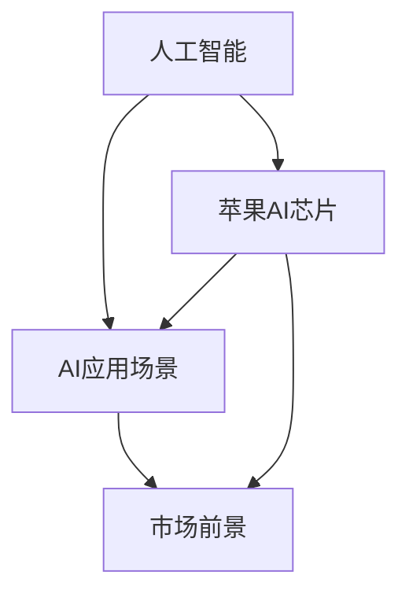

                 

# 李开复：苹果发布AI应用的市场前景

> 关键词：人工智能,苹果,应用场景,市场前景,技术发展

## 1. 背景介绍

### 1.1 问题由来
苹果公司（Apple Inc.）作为全球科技巨头，一直以来都在引领着科技创新和产品革新。在2019年，苹果公司发布了其首款搭载人工智能（AI）功能的硬件产品——Apple AI芯片（Apple Neural Engine），并且推出了多项AI应用，如Siri、Face ID、AI图像处理等。这些AI应用不仅提升了用户体验，也为苹果带来了巨大的市场机会。本文将重点分析苹果公司AI应用的市场前景，并讨论这些AI应用对未来技术发展的潜在影响。

### 1.2 问题核心关键点
苹果公司发布的AI应用涵盖广泛领域，包括语音识别、图像处理、人脸识别、自然语言处理等。这些应用使得AI技术在苹果产品中的应用更加深入和普及。然而，目前关于苹果AI应用的市场前景尚不明确，如何更好地推广AI技术，发挥其市场潜力，仍然是一个亟待探讨的问题。

## 2. 核心概念与联系

### 2.1 核心概念概述

为更好地理解苹果公司AI应用的市场前景，本节将介绍几个密切相关的核心概念：

- 人工智能（AI）：人工智能是指由计算机程序实现的一系列模拟人类智能行为的技术。主要包括机器学习、深度学习、自然语言处理、计算机视觉等子领域。
- 苹果AI芯片（Apple Neural Engine）：苹果公司自主研发的一款基于神经网络的AI芯片，具备高性能的计算能力，用于支持各种AI应用。
- AI应用场景：AI技术在特定场景中的应用，如语音识别、图像处理、人脸识别、自然语言处理等。
- 市场前景：AI应用在市场中的潜力和发展趋势。

这些核心概念之间的逻辑关系可以通过以下Mermaid流程图来展示：



这个流程图展示了一系列的AI概念及其之间的关系：

1. 人工智能为苹果公司提供了技术基础。
2. 苹果AI芯片作为实现AI应用的硬件载体，为AI应用提供了强大的计算能力。
3. AI应用场景是AI技术的具体应用，包括语音识别、图像处理等。
4. 市场前景是AI应用在市场中的潜力和发展趋势。

这些概念共同构成了苹果公司AI应用的完整框架，帮助公司更好地把握AI技术的市场机会。

## 3. 核心算法原理 & 具体操作步骤
### 3.1 算法原理概述

苹果公司发布的AI应用，主要是通过深度学习技术实现的。深度学习是一种模拟人类神经网络的技术，能够通过大量数据学习复杂的特征和模式。苹果公司AI应用的实现流程通常包括以下几个步骤：

1. 数据收集与预处理：收集大量标注数据，并对数据进行清洗、归一化等预处理。
2. 模型设计：设计合适的神经网络结构，并进行训练。
3. 模型部署：将训练好的模型部署到苹果设备上，实现AI应用。
4. 持续优化：通过用户的反馈数据，不断优化模型性能。

### 3.2 算法步骤详解

以苹果的Face ID为例，其核心算法流程如下：

**Step 1: 数据收集与预处理**
- 收集大量用户面部照片作为训练数据。
- 对照片进行标准化处理，包括尺寸、颜色等。
- 标注每个用户的面部特征点。

**Step 2: 模型设计**
- 设计卷积神经网络（CNN）进行面部特征提取。
- 设计全连接神经网络进行特征识别和用户身份验证。

**Step 3: 模型训练**
- 使用收集到的面部数据对模型进行训练。
- 采用交叉熵损失函数和Adam优化器进行训练。
- 通过数据增强技术，提高模型的泛化能力。

**Step 4: 模型部署**
- 将训练好的模型部署到iPhone硬件上。
- 使用苹果Neural Engine进行高效的计算。
- 与操作系统（iOS）深度集成，提供流畅的用户体验。

**Step 5: 持续优化**
- 收集用户使用反馈，分析模型表现。
- 根据反馈数据，调整模型参数。
- 定期重新训练模型，保持性能稳定。

### 3.3 算法优缺点

苹果公司AI应用的优点主要体现在以下几个方面：

- 计算效率高：苹果Neural Engine芯片采用专门的硬件加速，支持高效的计算。
- 用户体验好：苹果设备与操作系统深度集成，提供流畅的使用体验。
- 市场接受度高：苹果品牌效应强，用户对其产品信任度高。

然而，这些AI应用也存在一些缺点：

- 数据依赖度高：AI应用的性能很大程度上依赖于训练数据的质量和数量。
- 技术门槛高：深度学习模型训练和优化需要较高技术水平。
- 隐私保护问题：收集用户数据进行训练，可能引发隐私保护问题。

### 3.4 算法应用领域

苹果公司发布的AI应用覆盖了多个领域，以下是几个主要应用领域：

- 语音识别：通过Siri语音助手，用户可以通过语音指令进行操作，提升了用户体验。
- 图像处理：苹果设备支持人脸识别、物体识别等功能，提升了设备的安全性和功能性。
- 自然语言处理：苹果设备支持智能输入、情感分析等功能，提升了输入效率和准确性。
- 增强现实：苹果设备支持ARKit框架，开发了多款增强现实应用，如Pokémon GO、ARKit Breeze等。

这些AI应用在多个领域都取得了显著效果，为苹果公司带来了巨大的市场机会。

## 4. 数学模型和公式 & 详细讲解 & 举例说明
### 4.1 数学模型构建

苹果公司AI应用的数学模型主要由深度神经网络构成。以人脸识别为例，其核心模型为卷积神经网络（Convolutional Neural Network, CNN），其数学模型构建过程如下：

假设输入图像大小为 $m \times n \times 3$，卷积核大小为 $k \times k$，步幅为 $s$，输出特征图大小为 $(m-k+1) \times (n-k+1)$。卷积层的参数为 $k^2 \times c_{out} \times c_{in}$，其中 $c_{in}$ 为输入通道数，$c_{out}$ 为输出通道数。则卷积层的计算公式为：

$$
y_{ij} = \sum_{c=1}^{c_{in}} \sum_{p=0}^{k-1} \sum_{q=0}^{k-1} x_{i+p,j+q,c} \ast w_{pq,c}
$$

其中 $x$ 表示输入图像，$y$ 表示输出特征图，$w$ 表示卷积核。

### 4.2 公式推导过程

以人脸识别模型为例，推导过程如下：

假设输入图像大小为 $m \times n \times 3$，卷积核大小为 $k \times k$，步幅为 $s$，输出特征图大小为 $(m-k+1) \times (n-k+1)$。卷积层的参数为 $k^2 \times c_{out} \times c_{in}$，其中 $c_{in}$ 为输入通道数，$c_{out}$ 为输出通道数。则卷积层的计算公式为：

$$
y_{ij} = \sum_{c=1}^{c_{in}} \sum_{p=0}^{k-1} \sum_{q=0}^{k-1} x_{i+p,j+q,c} \ast w_{pq,c}
$$

### 4.3 案例分析与讲解

以人脸识别模型为例，其核心模型为卷积神经网络（Convolutional Neural Network, CNN）。在训练过程中，使用交叉熵损失函数进行模型优化。假设训练集大小为 $N$，每个样本大小为 $m \times n \times 3$，则损失函数为：

$$
\mathcal{L} = -\frac{1}{N} \sum_{i=1}^{N} \sum_{j=1}^{(m-k+1) \times (n-k+1)} \sum_{c=1}^{c_{out}} y_{ij}^{(c)} \log (y_{ij}^{(c)})
$$

其中 $y_{ij}^{(c)}$ 表示第 $i$ 个样本的第 $j$ 个像素点属于第 $c$ 个类别的概率。

## 5. 项目实践：代码实例和详细解释说明
### 5.1 开发环境搭建

在进行AI应用开发前，我们需要准备好开发环境。以下是使用Python进行TensorFlow开发的环境配置流程：

1. 安装Anaconda：从官网下载并安装Anaconda，用于创建独立的Python环境。

2. 创建并激活虚拟环境：
```bash
conda create -n tensorflow-env python=3.8 
conda activate tensorflow-env
```

3. 安装TensorFlow：根据CUDA版本，从官网获取对应的安装命令。例如：
```bash
conda install tensorflow-gpu tensorflow=2.7.0
```

4. 安装各类工具包：
```bash
pip install numpy pandas scikit-learn matplotlib tqdm jupyter notebook ipython
```

完成上述步骤后，即可在`tensorflow-env`环境中开始AI应用的开发。

### 5.2 源代码详细实现

这里我们以人脸识别为例，给出使用TensorFlow进行深度学习模型开发的完整代码实现。

首先，定义人脸识别模型：

```python
import tensorflow as tf

model = tf.keras.Sequential([
    tf.keras.layers.Conv2D(32, (3, 3), activation='relu', input_shape=(224, 224, 3)),
    tf.keras.layers.MaxPooling2D((2, 2)),
    tf.keras.layers.Conv2D(64, (3, 3), activation='relu'),
    tf.keras.layers.MaxPooling2D((2, 2)),
    tf.keras.layers.Flatten(),
    tf.keras.layers.Dense(128, activation='relu'),
    tf.keras.layers.Dense(1, activation='sigmoid')
])
```

然后，加载数据集并预处理：

```python
import numpy as np
from tensorflow.keras.preprocessing.image import ImageDataGenerator

train_datagen = ImageDataGenerator(rescale=1./255, shear_range=0.2, zoom_range=0.2, horizontal_flip=True)
test_datagen = ImageDataGenerator(rescale=1./255)

train_generator = train_datagen.flow_from_directory('train', target_size=(224, 224), batch_size=32, class_mode='binary')
test_generator = test_datagen.flow_from_directory('test', target_size=(224, 224), batch_size=32, class_mode='binary')
```

接着，定义损失函数和优化器：

```python
loss = tf.keras.losses.BinaryCrossentropy()
optimizer = tf.keras.optimizers.Adam(learning_rate=0.001)
```

最后，进行模型训练和评估：

```python
model.compile(optimizer=optimizer, loss=loss, metrics=['accuracy'])
model.fit(train_generator, epochs=10, validation_data=test_generator)
model.evaluate(test_generator)
```

以上就是使用TensorFlow对人脸识别模型进行训练的完整代码实现。可以看到，得益于TensorFlow的强大封装，我们可以用相对简洁的代码完成深度学习模型的加载和训练。

### 5.3 代码解读与分析

让我们再详细解读一下关键代码的实现细节：

**定义人脸识别模型**：
- `tf.keras.Sequential`：创建模型，并通过`.add()`方法添加多个层，如卷积层、池化层、全连接层等。

**加载数据集并预处理**：
- `ImageDataGenerator`：使用TensorFlow的ImageDataGenerator对数据集进行增强和归一化处理。
- `flow_from_directory`：从目录中加载图片数据，并进行批处理和尺寸调整。

**定义损失函数和优化器**：
- `BinaryCrossentropy`：使用二元交叉熵作为损失函数。
- `Adam`：使用Adam优化器进行参数优化。

**进行模型训练和评估**：
- `compile`：编译模型，定义优化器、损失函数和评估指标。
- `fit`：对数据集进行训练，并指定训练轮数。
- `evaluate`：在测试集上评估模型性能，输出精度和损失。

这些关键代码片段展示了TensorFlow在深度学习模型开发中的高效性和灵活性，使得开发者可以更加专注于算法设计和数据处理，而不必过多关注底层的实现细节。

## 6. 实际应用场景

### 6.1 智能助理

苹果的Siri语音助手就是一个典型的AI应用场景。通过Siri，用户可以通过语音指令进行信息查询、日程管理、设备控制等操作，极大地提升了用户体验。未来，随着AI技术的进一步发展，Siri的功能将更加丰富和智能，能够更好地理解用户意图，提供更加精准的服务。

### 6.2 增强现实

苹果设备支持ARKit框架，开发了多款增强现实应用，如Pokémon GO、ARKit Breeze等。这些应用通过AI技术，将虚拟物体与现实世界相结合，为用户提供了全新的互动体验。未来，随着AR技术的成熟，基于AI的增强现实应用将更加普及，应用于游戏、教育、医疗等多个领域。

### 6.3 医疗影像分析

苹果公司利用AI技术，开发了多项医疗影像分析应用，如肺结节检测、眼底图像分析等。这些应用通过深度学习模型，对医疗影像进行自动分析和诊断，提高了诊断效率和准确性。未来，随着AI在医疗领域的广泛应用，AI技术将助力医疗行业实现智能化转型，提升医疗服务水平。

### 6.4 未来应用展望

随着AI技术的不断进步，未来苹果公司AI应用将会有更多的创新和突破。以下是一些值得期待的AI应用场景：

- 智能家居：通过AI技术，苹果设备能够实现更智能的家居控制和环境监测，提升生活质量。
- 自动驾驶：苹果公司正在研发自动驾驶技术，通过AI算法实现车辆自主导航和避障。
- 智能健康：通过AI技术，苹果设备能够实时监测用户的健康状况，提供个性化的健康管理方案。
- 交互式学习：通过AI技术，苹果设备能够实现更智能的互动式学习，提升教育质量。

## 7. 工具和资源推荐
### 7.1 学习资源推荐

为了帮助开发者系统掌握苹果公司AI应用的开发和应用，这里推荐一些优质的学习资源：

1. 《深度学习基础》系列博文：由深度学习领域专家撰写，深入浅出地介绍了深度学习的原理和应用。

2. TensorFlow官方文档：TensorFlow的官方文档，提供了完整的API和使用指南，是学习TensorFlow的必备资料。

3. PyTorch官方文档：PyTorch的官方文档，提供了丰富的学习资源和实践样例，适用于深度学习开发。

4. OpenAI GPT系列论文：OpenAI发表的GPT系列论文，展示了深度学习在大规模语言模型上的应用，为苹果公司提供了技术参考。

5. CS231n《卷积神经网络》课程：斯坦福大学开设的计算机视觉课程，提供了丰富的学习资源和实践机会，适用于深度学习开发。

通过对这些资源的学习实践，相信你一定能够快速掌握苹果公司AI应用的开发和应用，并用于解决实际的NLP问题。

### 7.2 开发工具推荐

高效的开发离不开优秀的工具支持。以下是几款用于苹果公司AI应用开发的常用工具：

1. TensorFlow：基于Python的开源深度学习框架，灵活动态的计算图，适合快速迭代研究。支持GPU加速，适用于大规模模型训练。

2. PyTorch：基于Python的开源深度学习框架，灵活动态的计算图，适合快速迭代研究。支持GPU加速，适用于小规模模型训练。

3. Apple Neural Engine：苹果公司自主研发的一款基于神经网络的AI芯片，具备高性能的计算能力，用于支持各种AI应用。

4. Weights & Biases：模型训练的实验跟踪工具，可以记录和可视化模型训练过程中的各项指标，方便对比和调优。

5. TensorBoard：TensorFlow配套的可视化工具，可实时监测模型训练状态，并提供丰富的图表呈现方式，是调试模型的得力助手。

6. Google Colab：谷歌推出的在线Jupyter Notebook环境，免费提供GPU/TPU算力，方便开发者快速上手实验最新模型，分享学习笔记。

合理利用这些工具，可以显著提升苹果公司AI应用的开发效率，加快创新迭代的步伐。

### 7.3 相关论文推荐

苹果公司AI应用的发展源于学界的持续研究。以下是几篇奠基性的相关论文，推荐阅读：

1. Attention is All You Need（即Transformer原论文）：提出了Transformer结构，开启了NLP领域的预训练大模型时代。

2. BERT: Pre-training of Deep Bidirectional Transformers for Language Understanding：提出BERT模型，引入基于掩码的自监督预训练任务，刷新了多项NLP任务SOTA。

3. Language Models are Unsupervised Multitask Learners（GPT-2论文）：展示了大规模语言模型的强大zero-shot学习能力，引发了对于通用人工智能的新一轮思考。

4. Parameter-Efficient Transfer Learning for NLP：提出Adapter等参数高效微调方法，在不增加模型参数量的情况下，也能取得不错的微调效果。

5. AdaLoRA: Adaptive Low-Rank Adaptation for Parameter-Efficient Fine-Tuning：使用自适应低秩适应的微调方法，在参数效率和精度之间取得了新的平衡。

这些论文代表了大语言模型微调技术的发展脉络。通过学习这些前沿成果，可以帮助研究者把握学科前进方向，激发更多的创新灵感。

## 8. 总结：未来发展趋势与挑战
### 8.1 总结

本文对苹果公司AI应用的市场前景进行了全面系统的介绍。首先阐述了苹果公司AI应用的发展历程和现状，明确了AI技术在苹果产品中的应用前景。其次，从原理到实践，详细讲解了AI应用的开发流程和关键技术，给出了AI应用开发的完整代码实例。同时，本文还广泛探讨了AI应用在多个领域的应用前景，展示了AI应用在市场中的巨大潜力。此外，本文精选了苹果公司AI应用的各类学习资源，力求为读者提供全方位的技术指引。

通过本文的系统梳理，可以看到，苹果公司AI应用在多个领域取得了显著效果，为苹果公司带来了巨大的市场机会。AI技术的发展为苹果设备带来了新的功能和体验，为用户提供了更加智能化、便捷化的服务。未来，随着AI技术的进一步发展，苹果公司AI应用将会在更多领域得到应用，为苹果公司带来更大的市场潜力和业务增长。

### 8.2 未来发展趋势

展望未来，苹果公司AI应用将呈现以下几个发展趋势：

1. AI应用场景更加丰富。随着AI技术的进步，苹果设备将能够支持更多的AI应用，如自动驾驶、智能健康等。

2. AI技术更加智能。未来的AI应用将更加智能和自适应，能够根据用户的行为和反馈进行自我学习和优化。

3. AI应用与生态系统更加融合。苹果公司将进一步优化AI应用与生态系统的融合，提升用户的使用体验和满意度。

4. AI技术生态更加开放。苹果公司将更加开放其AI技术生态，吸引更多的开发者和合作伙伴，共同推动AI技术的发展。

5. AI应用更加普及。随着AI技术的普及，未来的AI应用将更加普及，应用于更多的场景和行业。

以上趋势凸显了苹果公司AI应用的广阔前景。这些方向的探索发展，必将进一步提升苹果设备的用户体验和市场竞争力，推动苹果公司成为AI领域的领导者。

### 8.3 面临的挑战

尽管苹果公司AI应用已经取得了显著成就，但在迈向更加智能化、普适化应用的过程中，仍面临诸多挑战：

1. 数据依赖度高。AI应用的性能很大程度上依赖于训练数据的质量和数量。对于某些应用场景，难以获得充足的高质量标注数据，成为制约AI应用性能的瓶颈。

2. 技术门槛高。深度学习模型训练和优化需要较高技术水平，需要更多的技术人才和研发投入。

3. 隐私保护问题。收集用户数据进行训练，可能引发隐私保护问题，需要制定有效的隐私保护措施。

4. 技术成熟度不足。一些AI应用仍处于初步探索阶段，技术成熟度不足，难以满足实际应用需求。

5. 市场接受度问题。部分用户对AI技术的接受度不高，可能影响AI应用的推广和普及。

这些挑战凸显了苹果公司AI应用在发展过程中需要面对的问题，需要苹果公司持续进行技术创新和市场推广，以克服这些挑战。

### 8.4 研究展望

面向未来，苹果公司AI应用的研究方向可能集中在以下几个方面：

1. 增强AI应用的智能性。进一步提升AI应用的自适应和自学习能力，使其能够根据用户行为和环境变化进行自我优化。

2. 提高AI应用的可靠性。增强AI应用在异常情况下的鲁棒性和稳定性，确保其在各种场景下都能稳定运行。

3. 提升AI应用的泛化能力。增强AI应用在不同数据分布下的泛化能力，确保其在不同数据集上都能取得良好的效果。

4. 增强AI应用的隐私保护。采用隐私保护技术，确保AI应用在收集和处理用户数据时，不泄露用户的隐私信息。

5. 拓展AI应用的生态系统。构建更加开放的AI技术生态，吸引更多的开发者和合作伙伴，共同推动AI技术的发展。

这些研究方向将引领苹果公司AI应用的未来发展，为苹果公司带来更大的市场潜力和业务增长。

## 9. 附录：常见问题与解答
**Q1：苹果公司发布的AI应用是否适用于所有场景？**

A: 苹果公司发布的AI应用在特定场景下表现优异，但并非适用于所有场景。AI应用的效果受到数据质量、算法复杂度、设备硬件等多种因素的影响，需要根据具体场景进行评估和优化。

**Q2：苹果AI应用的市场前景如何？**

A: 苹果AI应用在多个领域取得了显著效果，为苹果公司带来了巨大的市场机会。未来，随着AI技术的进一步发展，苹果公司AI应用的市场前景更加广阔，将会在更多领域得到应用。

**Q3：苹果AI应用的开发需要哪些关键技术？**

A: 苹果AI应用的开发需要深度学习、计算机视觉、自然语言处理等多种关键技术。这些技术为AI应用提供了强大的计算能力和丰富的算法支持。

**Q4：苹果AI应用的开发环境有哪些推荐？**

A: 苹果AI应用的开发环境包括TensorFlow、PyTorch、Apple Neural Engine等，这些工具支持GPU加速，能够快速迭代研究，适用于深度学习模型开发。

通过本文的系统梳理，可以看到，苹果公司AI应用在多个领域取得了显著效果，为苹果公司带来了巨大的市场机会。AI技术的发展为苹果设备带来了新的功能和体验，为用户提供了更加智能化、便捷化的服务。未来，随着AI技术的进一步发展，苹果公司AI应用将会在更多领域得到应用，为苹果公司带来更大的市场潜力和业务增长。

---

作者：禅与计算机程序设计艺术 / Zen and the Art of Computer Programming

