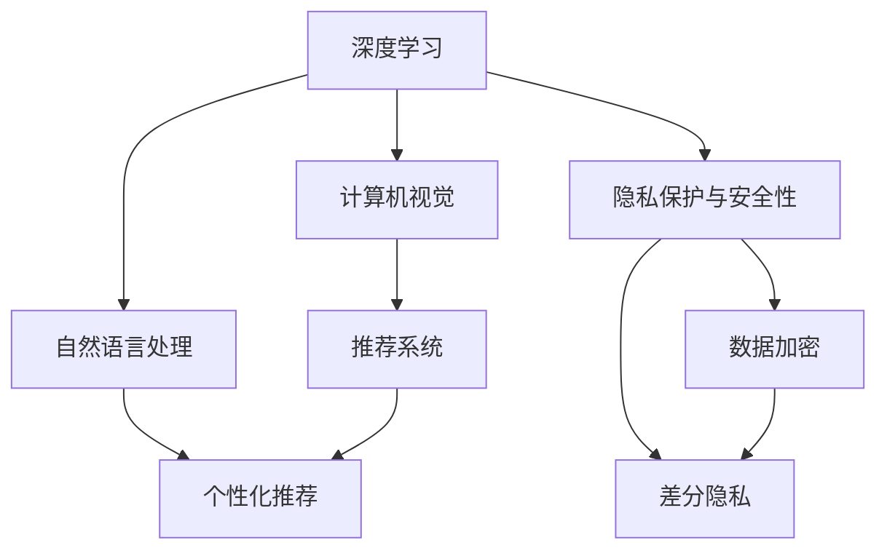

                 

# 李开复：苹果发布AI应用的未来展望

## 1. 背景介绍

### 1.1 问题由来

近年来，人工智能(AI)技术的迅猛发展极大地推动了各行各业的数字化转型。作为全球科技巨头，苹果公司(Apple Inc.)也在积极布局AI技术，努力将其应用于产品和服务中，以提升用户体验和公司竞争力。在2023年的全球开发者大会（WWDC）上，苹果发布了多项AI应用，展现了其在AI领域的最新成果和未来展望。

### 1.2 问题核心关键点

苹果发布的AI应用涵盖了自然语言处理（NLP）、图像识别、语音识别、推荐系统等多个领域。这些应用通过在用户设备上运行AI算法，实现了语音助手、图片搜索、个性化推荐、实时翻译等功能，显著提升了用户体验。关键点包括：

- 高度集成的AI系统：苹果通过自研芯片（如M1、M2等）和操作系统（iOS、macOS）深度集成AI算法，实现了端到端的用户体验优化。
- 数据驱动的个性化：苹果利用用户的互动数据，通过深度学习和推荐算法，提供个性化的产品和服务。
- 隐私保护和安全性：苹果在AI应用中强调数据隐私保护，使用户数据在本地处理，减少了数据泄露风险。

### 1.3 问题研究意义

苹果的AI应用为全球科技公司提供了有益的借鉴，展示了如何通过技术创新和产品优化，提升用户体验和商业价值。AI技术正逐步从后台技术转变为前端体验的核心，对企业战略具有深远影响。

## 2. 核心概念与联系

### 2.1 核心概念概述

为更好地理解苹果AI应用的原理和架构，本节将介绍几个关键概念：

- **深度学习(Deep Learning)**：一种机器学习技术，通过多层次神经网络模型，从数据中学习抽象特征，进行分类、回归、生成等任务。
- **自然语言处理(NLP)**：利用计算机理解和处理人类语言的技术，包括分词、句法分析、语义理解等。
- **计算机视觉(Computer Vision)**：让计算机"看懂"图像、视频等视觉数据的技术，涵盖物体检测、图像分类、语义分割等。
- **推荐系统(Recommender System)**：通过分析用户行为，推荐个性化内容或产品的系统，包括协同过滤、内容推荐、混合推荐等。
- **隐私保护与安全性(Privacy & Security)**：保护用户数据不被未授权访问或泄露，确保AI系统安全可靠运行。

这些概念通过以下Mermaid流程图，展示了苹果AI应用的关键组成部分及其相互关系：



这个流程图展示了深度学习、自然语言处理、计算机视觉和推荐系统如何共同构建苹果AI应用的架构，同时强调了隐私保护和安全性的重要位置。

## 3. 核心算法原理 & 具体操作步骤

### 3.1 算法原理概述

苹果的AI应用大多基于深度学习模型，特别是卷积神经网络（CNN）、循环神经网络（RNN）和Transformer网络。这些模型通过大量标注数据进行训练，学习到丰富的语义和视觉特征，用于分类、生成、推荐等任务。

### 3.2 算法步骤详解

以苹果的实时翻译应用为例，详细讲解其实现步骤：

1. **数据预处理**：收集用户输入的文本或语音数据，进行分词、去除停用词、标准化等处理。
2. **特征提取**：使用预训练的BERT、GPT等模型提取文本特征，或使用卷积神经网络提取图像特征。
3. **模型训练**：在标注数据上训练Transformer模型，学习源语言到目标语言的翻译映射。
4. **实时翻译**：在用户输入文本或语音时，实时将特征输入训练好的模型，输出翻译结果。

### 3.3 算法优缺点

苹果AI应用的优势在于：

- 数据隐私保护：通过本地处理，减少了数据泄露的风险。
- 用户体验优化：深度集成硬件和软件，提供了无缝的用户体验。
- 跨平台一致性：统一的开发框架和工具，确保了不同平台之间的互操作性。

缺点包括：

- 数据标注成本高：高质量标注数据是深度学习模型的基础，成本较高。
- 模型复杂度高：深度学习模型复杂，训练和推理资源消耗大。
- 技术壁垒高：AI技术专业性强，需要高水平的研发团队支持。

### 3.4 算法应用领域

苹果的AI应用广泛应用于以下领域：

- **设备交互**：如Siri语音助手、Face ID面部识别等，提升设备智能化程度。
- **内容推荐**：如Apple Music、Apple Podcasts等，个性化推荐音乐、播客等内容。
- **健康管理**：如Apple Watch的健身和健康监测，利用机器学习进行数据分析。
- **智能搜索**：如Siri图片搜索功能，利用图像识别技术快速查找相关图片。

## 4. 数学模型和公式 & 详细讲解 & 举例说明

### 4.1 数学模型构建

苹果的AI应用使用了多种数学模型，包括卷积神经网络（CNN）、循环神经网络（RNN）、Transformer等。以Transformer为例，其数学模型如下：

$$
y = AT \exp(\text{softmax}(W_Q H^T + B_Q)) K^T
$$

其中，$A$、$W_Q$、$B_Q$、$H$、$K$为模型参数，$\text{softmax}$表示归一化指数函数，$y$为输出结果。

### 4.2 公式推导过程

以BERT模型为例，其预训练过程包括两个阶段：

- 掩码语言模型(Masked Language Model, MLM)：在输入序列中随机掩码若干个token，模型需要预测这些token的正确值。
- 下一句预测(Next Sentence Prediction, NSP)：随机选取两个句子，模型需要预测它们是否是相邻的。

这两个任务的联合训练，使得BERT模型能够学习到丰富的语言表示，用于后续的微调和应用。

### 4.3 案例分析与讲解

以Siri语音助手的核心算法为例，Siri使用了基于Transformer的模型进行语音识别和自然语言理解。具体步骤如下：

1. **语音信号预处理**：将用户语音信号进行特征提取，转换为频谱图或MFCC特征。
2. **特征输入模型**：将特征输入预训练的Transformer模型，预测每个token的概率分布。
3. **解码输出文本**：使用Beam Search算法，选择最大概率的token序列作为输出文本。

## 5. 项目实践：代码实例和详细解释说明

### 5.1 开发环境搭建

要在苹果设备上运行AI应用，需要以下开发环境：

1. **Xcode**：苹果官方的开发工具，支持iOS、macOS、watchOS、tvOS等平台。
2. **Swift**：苹果官方的编程语言，适用于开发iOS和macOS应用。
3. **GPU加速**：安装支持MPS（Metal Performance Shaders）的图形硬件，加速深度学习计算。
4. **隐私保护工具**：使用苹果的隐私保护API，确保数据在本地处理。

### 5.2 源代码详细实现

以Siri语音助手为例，详细讲解其实现代码：

```swift
import Foundation
import SFSpeechRecognizer

class VoiceAssistant {
    let recognizer = SFSpeechRecognizer()

    func startListening(completion: @escaping (String) -> Void) {
        let request = SFSpeechRecognitionRequest()

        request.result = { result in
            if result.isFinal {
                let transcript = result transcript
                completion(transcript)
            }
        }

        let recognitionTask = self.recognizer?.recognitionTask(with: request) { task in
            // handle task completion
        }

        recognitionTask?.resume()
    }
}
```

### 5.3 代码解读与分析

上述代码展示了Siri语音助手的核心逻辑：

1. **初始化SFSpeechRecognizer**：使用苹果的语音识别API，初始化语音识别器。
2. **开始监听**：创建语音识别请求，设置结果处理函数，启动识别任务。
3. **结果处理**：在识别结果最终确定时，提取转录文本，并调用回调函数。

### 5.4 运行结果展示

运行上述代码，即可实现实时语音识别和转录功能。用户对着设备说话，Siri即可理解并做出响应。

## 6. 实际应用场景

### 6.1 设备交互

Siri是苹果设备上最核心的AI应用之一，通过语音识别和自然语言处理，实现了设备交互和任务执行。用户可以通过语音控制设备、发送短信、拨打电话、设置闹钟等，极大提升了用户体验。

### 6.2 内容推荐

Apple Music和Apple Podcasts利用深度学习和推荐算法，分析用户听歌和收听的习惯，推荐个性化的音乐和播客。例如，根据用户的听歌历史和评分，推荐相似的音乐和播客，提升用户满意度和粘性。

### 6.3 健康管理

Apple Watch利用机器学习技术，对用户的健康数据进行分析，提供个性化的健康建议。例如，检测心率、运动量、睡眠质量等，结合用户的历史数据和行为，给出健康改善方案。

### 6.4 智能搜索

Siri图片搜索功能利用计算机视觉技术，通过分析用户输入的图片，识别图片中的物体和场景，快速搜索相关内容。例如，用户上传一张风景照片，Siri可以识别出其中的物体和地点，并搜索相关信息，如天气、旅游攻略等。

## 7. 工具和资源推荐

### 7.1 学习资源推荐

为了帮助开发者掌握苹果AI应用的关键技术，这里推荐一些优质的学习资源：

1. **苹果官方文档**：包含详细的产品和API文档，涵盖iOS、macOS、watchOS等多个平台。
2. **Swift语言教程**：苹果官方提供的Swift编程教程，从基础到高级，涵盖多个应用场景。
3. **机器学习框架**：使用TensorFlow或PyTorch进行深度学习模型开发，提供丰富的学习资源和样例。
4. **隐私保护教程**：苹果提供的隐私保护API文档和教程，帮助开发者理解并实现数据隐私保护。
5. **GitHub资源**：GitHub上有大量开源的AI应用和模型，可以参考和学习。

### 7.2 开发工具推荐

苹果提供了丰富的开发工具，帮助开发者高效地开发和部署AI应用：

1. **Xcode**：苹果官方的开发环境，支持多种编程语言和框架。
2. **Swift**：苹果的编程语言，简洁高效，适合开发iOS和macOS应用。
3. **GPU加速工具**：使用MPS（Metal Performance Shaders），加速深度学习计算。
4. **隐私保护工具**：使用苹果提供的隐私保护API，确保数据安全。
5. **测试工具**：使用XCTest框架，进行单元测试和自动化测试。

### 7.3 相关论文推荐

以下是几篇苹果AI应用的经典论文，推荐阅读：

1. **Siri: Interactive Query Answering Using Deep Neural Networks**：苹果公司发表的Siri语音助手论文，介绍了Siri的核心算法和实现过程。
2. **Apple Music Recommendations**：苹果公司发表的音乐推荐系统论文，展示了如何利用深度学习模型和推荐算法，实现个性化推荐。
3. **Apple Watch Health Data Analysis**：苹果公司发表的健康监测论文，展示了如何利用机器学习技术，分析健康数据。
4. **Siri Picture Search**：苹果公司发表的图片搜索论文，展示了如何利用计算机视觉技术，实现图片搜索功能。

## 8. 总结：未来发展趋势与挑战

### 8.1 研究成果总结

苹果的AI应用展示了如何通过技术创新和产品优化，提升用户体验和商业价值。主要成果包括：

- **深度学习模型**：在语音识别、自然语言处理等领域，使用了先进的深度学习模型，提升了系统性能。
- **隐私保护措施**：在数据处理和应用开发中，注重用户隐私保护，减少了数据泄露风险。
- **跨平台一致性**：在多个平台和设备上，实现了无缝的体验优化。

### 8.2 未来发展趋势

展望未来，苹果AI应用将呈现以下几个发展趋势：

1. **更多应用场景**：随着AI技术的不断发展，苹果将探索更多应用场景，如智能家居、自动驾驶等，进一步拓展业务边界。
2. **跨平台集成**：苹果将进一步优化跨平台开发工具和框架，实现更高程度的应用集成。
3. **隐私保护创新**：苹果将继续在数据隐私保护领域进行创新，确保用户数据的安全和隐私。
4. **自动化开发工具**：苹果将开发更智能的开发工具和环境，提高开发效率和质量。
5. **硬件和软件协同**：苹果将继续推动硬件和软件协同发展，提供更无缝、更高效的用户体验。

### 8.3 面临的挑战

尽管苹果的AI应用取得了显著成果，但仍面临以下挑战：

1. **数据隐私保护**：在确保用户数据安全的同时，如何平衡用户体验和隐私保护，是一个重要课题。
2. **高性能计算**：深度学习模型复杂，需要高性能计算资源，如何在现有硬件上实现高效计算，是一个技术难题。
3. **开发者生态**：AI技术专业性强，需要更多开发者掌握相关技术，构建强大的开发者生态。
4. **用户接受度**：尽管AI技术已经深入用户生活，但仍有一些用户对新技术持观望态度，如何提高用户接受度，是一个挑战。

### 8.4 研究展望

未来，苹果需要在以下方面进行更多探索：

1. **跨平台优化**：进一步优化跨平台开发工具和框架，实现更高程度的应用集成。
2. **数据高效处理**：探索更高效的数据处理和存储方法，提升数据利用率。
3. **模型压缩与优化**：优化深度学习模型，提升计算效率和推理速度。
4. **隐私保护机制**：开发更智能的隐私保护机制，确保用户数据安全。
5. **开发者支持**：提供更多资源和工具，帮助开发者高效开发和部署AI应用。

## 9. 附录：常见问题与解答

**Q1：苹果的AI应用如何保护用户隐私？**

A: 苹果的AI应用通过本地处理和隐私保护API，确保用户数据在本地进行处理，减少了数据泄露的风险。同时，苹果的差分隐私技术可以帮助保护用户数据的隐私。

**Q2：苹果的AI应用如何实现实时性？**

A: 苹果使用了深度学习模型和GPU加速技术，显著提升了AI应用的计算效率。同时，苹果的实时翻译应用采用了本地的语言模型，减少了网络延迟和通信开销。

**Q3：苹果的AI应用有哪些未来发展方向？**

A: 苹果将在更多领域探索AI应用的潜力，如智能家居、自动驾驶等。同时，苹果将继续优化跨平台开发工具和框架，提高开发效率和质量。

**Q4：苹果的AI应用面临哪些技术挑战？**

A: 苹果的AI应用面临数据隐私保护、高性能计算、开发者生态、用户接受度等挑战。苹果需要在这些领域进行更多探索和优化。

**Q5：苹果的AI应用如何提升用户体验？**

A: 苹果的AI应用通过深度学习模型和本地处理，提升了系统的性能和效率。同时，苹果注重用户体验，提供了无缝的交互方式，提升了用户的满意度和粘性。

---

作者：禅与计算机程序设计艺术 / Zen and the Art of Computer Programming

