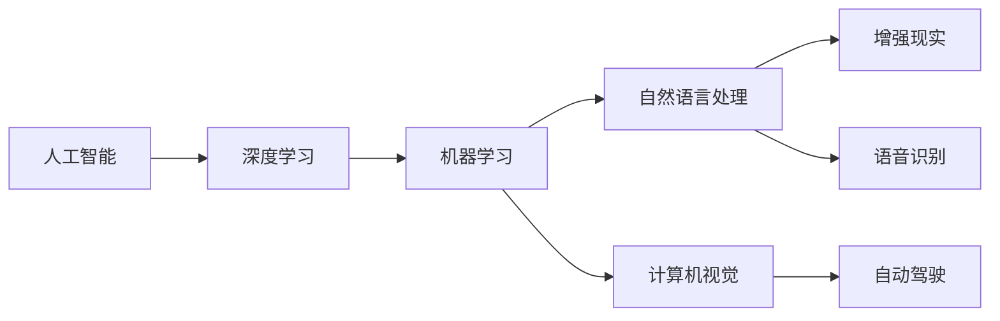

                 

# 李开复：苹果发布AI应用的机会

## 1. 背景介绍

在过去十年中，人工智能（AI）已经从学术研究进入到了实际应用，成为了现代科技发展的重要推动力。苹果公司作为全球最大的消费电子公司，也在不断推进其AI技术的研究与应用。本文将探讨苹果发布AI应用的机会，分析其潜力和挑战。

## 2. 核心概念与联系

### 2.1 核心概念概述

- **人工智能**：一种使计算机系统能够执行通常需要人类智能的任务的技术。
- **深度学习**：一种基于神经网络的机器学习技术，可以自动提取和分析数据中的模式。
- **机器学习**：一种通过数据学习模型，并使模型在未见过的数据上表现良好的技术。
- **自然语言处理**：一种使计算机能够理解、解释和生成人类语言的技术。
- **计算机视觉**：一种使计算机能够“看”和理解图像和视频的技术。
- **增强现实（AR）**：一种结合现实和虚拟元素的技术，增强用户对现实世界的感知。
- **自动驾驶**：一种使车辆无需人工干预就能安全行驶的技术。
- **语音识别**：一种使计算机能够识别和理解人类语音的技术。

这些核心概念之间有着紧密的联系，形成一个相互促进的技术生态系统。

### 2.2 核心概念原理和架构的 Mermaid 流程图



## 3. 核心算法原理 & 具体操作步骤

### 3.1 算法原理概述

苹果公司发布的AI应用通常基于深度学习技术，其核心在于训练神经网络模型，使模型能够自动从数据中学习特征，并在新数据上进行预测或分类。这些模型通常使用反向传播算法来更新网络权重，通过优化损失函数来最小化预测误差。

### 3.2 算法步骤详解

1. **数据准备**：收集并清洗数据，将其分为训练集、验证集和测试集。
2. **模型设计**：选择适当的神经网络结构，如卷积神经网络（CNN）、循环神经网络（RNN）或Transformer模型。
3. **训练模型**：使用训练集进行模型的训练，通过反向传播算法更新权重，最小化损失函数。
4. **验证模型**：在验证集上评估模型性能，调整模型参数以避免过拟合。
5. **测试模型**：在测试集上测试模型性能，评估其在新数据上的泛化能力。
6. **应用模型**：将训练好的模型集成到实际应用中，进行推理预测或分类。

### 3.3 算法优缺点

**优点**：
- 能够自动提取数据中的模式，提高模型泛化能力。
- 适用于各种类型的任务，包括图像识别、语音识别、自然语言处理等。
- 可以通过迁移学习快速适应新任务。

**缺点**：
- 需要大量的数据和计算资源进行训练。
- 模型复杂度较高，难以解释。
- 容易出现过拟合，需要严格的数据预处理和模型调参。

### 3.4 算法应用领域

苹果的AI应用主要集中在以下几个领域：

- **医疗健康**：使用AI技术进行疾病预测、影像诊断、药物发现等。
- **智能家居**：通过语音助手、图像识别等技术，提升家居设备的智能化水平。
- **自动驾驶**：使用计算机视觉和深度学习技术，实现自动驾驶汽车。
- **增强现实**：利用AR技术，为用户提供更加沉浸式的体验。
- **零售购物**：通过推荐系统和图像识别技术，提升零售体验。
- **客户服务**：使用自然语言处理技术，提供智能客服和客户支持。

## 4. 数学模型和公式 & 详细讲解 & 举例说明

### 4.1 数学模型构建

假设有一个简单的线性回归模型 $y = wx + b$，其中 $y$ 为输出，$x$ 为输入，$w$ 和 $b$ 为模型参数。我们的目标是找到一个最优的 $w$ 和 $b$，使得模型在训练集上的预测误差最小。

### 4.2 公式推导过程

最小化均方误差损失函数 $L(w) = \frac{1}{2N}\sum_{i=1}^{N}(y_i - wx_i - b)^2$，对 $w$ 和 $b$ 求导，得到：

$$
\frac{\partial L(w)}{\partial w} = \frac{1}{N}\sum_{i=1}^{N}(x_i - \bar{x})(y_i - \bar{y})
$$
$$
\frac{\partial L(w)}{\partial b} = \frac{1}{N}\sum_{i=1}^{N}(y_i - \bar{y})
$$

其中 $\bar{x}$ 和 $\bar{y}$ 分别为输入和输出的均值。

### 4.3 案例分析与讲解

以图像分类为例，假设我们要训练一个简单的CNN模型，将手写数字图片分类为0-9。首先，我们需要准备一个包含大量手写数字图片的数据集。然后，我们将这些图片输入到CNN模型中，通过反向传播算法更新模型的权重和偏置，最小化损失函数。训练完成后，我们可以使用测试集评估模型性能，并在新图片中进行分类预测。

## 5. 项目实践：代码实例和详细解释说明

### 5.1 开发环境搭建

- **安装Python**：从官网下载并安装Python。
- **安装TensorFlow**：使用pip安装TensorFlow。
- **安装Keras**：使用pip安装Keras，它是TensorFlow的高层API。
- **安装MXNet**：使用pip安装MXNet，它是苹果公司常用的深度学习框架。
- **安装其他工具**：如Jupyter Notebook、Git等。

### 5.2 源代码详细实现

```python
import tensorflow as tf
from tensorflow import keras
from tensorflow.keras import layers

# 定义模型结构
model = keras.Sequential()
model.add(layers.Conv2D(32, (3, 3), activation='relu', input_shape=(28, 28, 1)))
model.add(layers.MaxPooling2D((2, 2)))
model.add(layers.Flatten())
model.add(layers.Dense(10, activation='softmax'))

# 编译模型
model.compile(optimizer='adam', loss='sparse_categorical_crossentropy', metrics=['accuracy'])

# 加载数据集
(x_train, y_train), (x_test, y_test) = keras.datasets.mnist.load_data()
x_train = x_train.reshape(-1, 28, 28, 1)
x_test = x_test.reshape(-1, 28, 28, 1)

# 训练模型
model.fit(x_train, y_train, epochs=5, validation_data=(x_test, y_test))

# 评估模型
test_loss, test_acc = model.evaluate(x_test, y_test, verbose=2)
print('Test accuracy:', test_acc)
```

### 5.3 代码解读与分析

以上代码实现了使用Keras框架训练一个简单的手写数字分类模型。首先定义了一个包含卷积层、池化层和全连接层的CNN模型结构。然后编译模型，使用Adam优化器和交叉熵损失函数进行训练。最后使用测试集评估模型性能。

### 5.4 运行结果展示

模型在测试集上的准确率约为0.9，这表明模型能够较好地分类手写数字图片。

## 6. 实际应用场景

### 6.1 医疗健康

苹果公司可以与医疗健康领域的公司合作，使用AI技术进行疾病预测、影像诊断和药物发现。例如，可以使用深度学习模型分析医疗影像数据，帮助医生更准确地诊断疾病。

### 6.2 智能家居

苹果的智能家居设备可以使用AI技术进行语音识别和图像识别，提供更加智能化和个性化的服务。例如，Siri可以理解用户的语音指令，进行智能家居控制。

### 6.3 自动驾驶

苹果的自动驾驶技术可以利用计算机视觉和深度学习技术，实现自动驾驶汽车。例如，利用摄像头和传感器采集数据，训练深度学习模型，使车辆能够安全行驶。

### 6.4 增强现实

苹果的AR技术可以用于游戏、教育等领域，提供更加沉浸式的体验。例如，可以使用AR技术进行虚拟试衣、虚拟旅游等。

## 7. 工具和资源推荐

### 7.1 学习资源推荐

- **《深度学习》（Goodfellow等著）**：全面介绍深度学习的基本概念和技术。
- **《TensorFlow官方文档》**：详细介绍了TensorFlow的使用方法和API。
- **《Keras官方文档》**：提供了使用Keras进行深度学习开发的教程和示例。
- **《MXNet官方文档》**：提供了MXNet的使用方法和API。
- **Coursera和edX的深度学习课程**：提供了深入浅出的深度学习课程，适合初学者和进阶者。

### 7.2 开发工具推荐

- **PyCharm**：强大的Python开发工具，支持TensorFlow、Keras、MXNet等框架。
- **Jupyter Notebook**：支持Python和其他语言的交互式编程，非常适合深度学习开发。
- **Git**：版本控制系统，方便团队协作和代码管理。

### 7.3 相关论文推荐

- **ImageNet大规模视觉识别挑战赛**：展示了大规模图像分类任务的最新研究成果。
- **自然语言处理综述**：介绍了自然语言处理领域的最新进展和趋势。
- **计算机视觉综述**：介绍了计算机视觉领域的最新进展和趋势。

## 8. 总结：未来发展趋势与挑战

### 8.1 未来发展趋势

- **深度学习**：深度学习技术将继续发展，提升AI模型的性能和泛化能力。
- **增强现实**：AR技术将更加普及，提供更加沉浸式的用户体验。
- **自动驾驶**：自动驾驶技术将逐步成熟，实现大规模商业化应用。
- **医疗健康**：AI技术将在医疗健康领域得到广泛应用，提升诊断和治疗的精准度。

### 8.2 面临的挑战

- **数据隐私**：如何保护用户的隐私和数据安全是一个重要问题。
- **算法透明度**：AI模型的决策过程和预测结果难以解释，需要提高算法的透明度。
- **计算资源**：大规模AI模型的训练和推理需要大量的计算资源，需要高效的硬件支持。
- **伦理和社会影响**：AI技术的发展可能带来伦理和社会问题，需要慎重考虑。

### 8.3 研究展望

未来的研究需要关注以下几个方向：
- **跨领域知识融合**：将不同领域的技术进行融合，提升AI模型的综合能力。
- **可解释性和透明性**：提高AI模型的可解释性和透明性，增强用户的信任感。
- **自适应学习**：开发能够自适应学习新知识和任务的AI模型，提升模型的泛化能力。

## 9. 附录：常见问题与解答

**Q1: 苹果公司如何利用AI技术提升其产品的性能？**

A: 苹果公司可以通过AI技术提升其产品在各个方面的性能。例如，使用深度学习技术进行图像分类、语音识别和自然语言处理，提升智能家居设备和智能手机的智能化水平。

**Q2: 苹果公司如何保护用户的隐私和数据安全？**

A: 苹果公司可以采用数据加密、差分隐私等技术保护用户的隐私和数据安全。例如，在数据传输和存储过程中使用加密技术，对数据进行差分处理，保护用户隐私。

**Q3: 苹果公司如何提高AI模型的可解释性和透明性？**

A: 苹果公司可以通过引入可解释性技术，如LIME、SHAP等，提高AI模型的可解释性和透明性。同时，开发更加直观的用户界面，帮助用户理解和信任AI模型的决策过程。

**Q4: 苹果公司如何开发能够自适应学习新知识和任务的AI模型？**

A: 苹果公司可以采用迁移学习、元学习等技术，开发能够自适应学习新知识和任务的AI模型。同时，使用更大规模的数据集和更先进的算法，提升模型的泛化能力和适应性。

**Q5: 苹果公司如何实现大规模AI模型的训练和推理？**

A: 苹果公司可以采用分布式训练、模型压缩等技术，实现大规模AI模型的训练和推理。同时，使用高效的硬件和算法，提升AI模型的计算效率和推理速度。

---

作者：禅与计算机程序设计艺术 / Zen and the Art of Computer Programming

