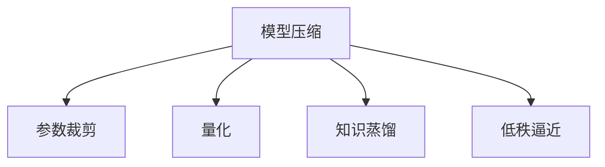

                 

## 1. 背景介绍

### 1.1 问题由来
随着软件开发的复杂度持续增加，对于运行在现代高性能服务器和云计算环境中的大型软件系统，如高性能计算集群、分布式数据库系统、实时数据分析平台等，如何提升它们的性能、降低其资源消耗，已成为非常紧迫的需求。许多先进的算法和系统，如深度神经网络、优化器等，虽然可以显著提升系统的性能，但也带来了高昂的计算、存储成本。因此，模型压缩（Model Compression）技术应运而生，成为了软件2.0时代的重要支撑。

### 1.2 问题核心关键点
模型压缩（Model Compression）技术的核心目标在于，通过多种技术手段降低模型的参数量、减少计算量和存储量，同时在保证性能的基础上尽可能地降低资源消耗。该技术主要包括以下几个关键点：

- **参数裁剪（Pruning）**：减少模型的参数量，去掉冗余且对模型输出影响不大的神经元或权重。
- **量化（Quantization）**：降低模型的计算精度，使用更少的位数来表示数值，从而减少计算量。
- **权重剪枝（Weight Pruning）**：减少模型的权重数量，保留主要权值。
- **知识蒸馏（Knowledge Distillation）**：通过大模型训练小模型，实现模型的参数共享，降低计算量和存储量。
- **低秩逼近（Low-Rank Approximation）**：使用低秩分解来近似模型的权重矩阵，减少矩阵的秩，降低存储量。

这些技术手段不仅能减少模型的资源消耗，还能在不牺牲性能的前提下，提升模型的部署速度和响应速度，使得大模型也能在有限资源的环境下运行。

### 1.3 问题研究意义
研究模型压缩技术，对于提升大型软件系统的性能、降低其资源消耗、优化计算与存储资源具有重要意义：

1. **性能提升**：模型压缩技术可以显著减少计算量，从而加快模型的训练与推理速度，提升系统的实时响应能力。
2. **资源优化**：通过裁剪冗余参数和剪枝低效计算，可以大幅度降低系统的存储和内存消耗，优化系统资源分配。
3. **成本节约**：降低计算与存储成本，从而降低企业的运行和维护成本。
4. **高效部署**：压缩后的模型在资源受限的设备上也能快速部署和运行，提升软件的可移植性和兼容性。
5. **环境适应性**：模型压缩技术使得模型可以在更广泛的环境和设备上运行，提高系统的适应性和稳定性。

## 2. 核心概念与联系

### 2.1 核心概念概述

为更好地理解模型压缩技术的原理和应用，本节将介绍几个核心概念：

- **模型压缩（Model Compression）**：通过多种技术手段，减少模型的参数量和计算量，同时保持模型的性能和精度。
- **参数裁剪（Pruning）**：减少模型中的冗余参数，提升模型的计算效率和性能。
- **量化（Quantization）**：将模型的数值精度降低，减少计算量，提升模型的推理速度。
- **知识蒸馏（Knowledge Distillation）**：通过大模型训练小模型，实现模型的知识转移，提高模型的泛化能力和性能。
- **低秩逼近（Low-Rank Approximation）**：将模型参数矩阵用低秩分解表示，减少模型的存储量。

这些概念之间的逻辑关系可以通过以下Mermaid流程图来展示：



这个流程图展示出模型压缩的各个子技术和它们之间的关系：

1. 模型压缩技术包含参数裁剪、量化、知识蒸馏和低秩逼近等多种手段。
2. 参数裁剪可以进一步细分为结构化裁剪和非结构化裁剪。
3. 量化包括对称量化和不对称量化。
4. 知识蒸馏是一种通过教师模型训练学生模型的技术。
5. 低秩逼近利用矩阵分解将参数表示为低秩矩阵。

## 3. 核心算法原理 & 具体操作步骤

### 3.1 算法原理概述

模型压缩的总体目标是减少模型的参数量和计算量，同时保持或提升模型的性能和精度。其主要算法原理如下：

- **参数裁剪**：通过剪枝等手段去除冗余参数，保留对模型输出有显著贡献的参数，从而减少计算量和存储量。
- **量化**：将模型的数值精度降低，减少计算量，提升模型的推理速度。
- **知识蒸馏**：通过将大模型的知识传递给小模型，实现参数共享，减少计算量和存储量。
- **低秩逼近**：使用低秩分解来近似模型的权重矩阵，减少存储量。

在具体操作上，模型压缩通常分为以下几个步骤：

1. **模型评估**：使用预设的性能指标对模型进行评估，确定其计算量、存储量和性能表现。
2. **参数裁剪**：选择特定的裁剪策略，如结构化裁剪、非结构化裁剪等，对模型参数进行裁剪。
3. **量化**：选择对称量化或不对称量化等策略，对模型参数进行量化处理。
4. **知识蒸馏**：通过将大模型的知识传递给小模型，实现参数共享。
5. **低秩逼近**：使用奇异值分解等方法对模型参数进行低秩逼近。
6. **验证与优化**：对压缩后的模型进行验证，并根据验证结果进行优化。

### 3.2 算法步骤详解

**Step 1: 模型评估**
- 使用预设的性能指标（如精度、召回率、F1分数等）对模型进行评估，确定其计算量、存储量和性能表现。
- 收集模型在不同计算资源和存储资源下的性能数据。

**Step 2: 参数裁剪**
- 根据评估结果，选择参数裁剪策略。常用的策略包括结构化裁剪、非结构化裁剪、基于冗余度（Redundancy）的裁剪等。
- 通过剪枝等手段，去除冗余参数。

**Step 3: 量化**
- 选择量化策略，如对称量化、不对称量化等。
- 将模型的数值精度降低，减少计算量。

**Step 4: 知识蒸馏**
- 选择知识蒸馏策略，如单任务蒸馏、多任务蒸馏、协作蒸馏等。
- 通过将大模型的知识传递给小模型，实现参数共享，减少计算量和存储量。

**Step 5: 低秩逼近**
- 选择低秩逼近方法，如奇异值分解（SVD）、奇异值截断（Truncated SVD）等。
- 将模型参数矩阵用低秩分解表示，减少存储量。

**Step 6: 验证与优化**
- 对压缩后的模型进行验证，使用评估指标确定其性能。
- 根据验证结果进行进一步的参数裁剪、量化、知识蒸馏和低秩逼近优化。

### 3.3 算法优缺点

模型压缩技术具有以下优点：
1. 减少计算量和存储量，降低资源消耗。
2. 提升模型的推理速度，加快模型部署。
3. 优化模型结构，提高模型的可解释性和可维护性。
4. 提高模型的泛化能力，减少过拟合风险。

同时，该技术也存在一些缺点：
1. 压缩过程中可能会丢失部分模型信息，影响模型性能。
2. 压缩过程需要额外的计算资源和时间，增加了实现成本。
3. 压缩后的模型可能难以调试和优化。

尽管存在这些局限性，但就目前而言，模型压缩技术在大规模软件系统中的应用，已经成为一种提高系统性能和降低成本的有效手段。未来相关研究的重点在于如何进一步提升压缩效果，降低实现成本，同时保证模型性能。

### 3.4 算法应用领域

模型压缩技术已经在多个领域得到了广泛应用，包括但不限于：

- **高性能计算集群**：减少模型参数量和计算量，提升集群计算速度和资源利用率。
- **分布式数据库系统**：通过模型压缩技术，优化数据查询和索引的计算和存储。
- **实时数据分析平台**：提升数据分析的实时性，减少计算和存储资源的消耗。
- **图像处理系统**：优化神经网络模型，减少图像处理计算和存储成本。
- **自然语言处理系统**：优化语言模型，提升系统响应速度和资源利用率。

## 4. 数学模型和公式 & 详细讲解 & 举例说明

### 4.1 数学模型构建

本节将使用数学语言对模型压缩技术进行更加严格的刻画。

假设原模型为 $M(\theta)$，其中 $\theta$ 为模型参数。模型压缩的目标是找到一个压缩后的模型 $M_{c}(\theta_{c})$，使得 $M_{c}(\theta_{c}) \approx M(\theta)$ 同时满足：

- 参数量减少
- 计算量减少
- 存储量减少
- 性能不变或接近

定义压缩率（Compression Ratio）为压缩前后模型参数量的比值，即：

$$
\text{Compression Ratio} = \frac{|\theta|}{|{\theta}_{c}|}
$$

其中 $|\theta|$ 和 $|{\theta}_{c}|$ 分别为原模型和压缩后模型的参数量。

### 4.2 公式推导过程

以参数裁剪为例，假设原模型为全连接神经网络，结构为 $M(\theta) = W \cdot X + b$，其中 $W$ 为权重矩阵，$X$ 为输入，$b$ 为偏置。参数裁剪的目标是去除矩阵 $W$ 中的冗余行，保留对模型输出有显著贡献的行。

假设 $W$ 矩阵中每一行的元素权重均为 $1/N$，即 $W_{ij} = 1/N$。参数裁剪的过程可以看作是选择保留 $k$ 行，使得：

$$
\max_{i=1,\cdots,N} \frac{|\langle W_{i}^\top X, b \rangle}{||W_{i}||_1 ||X||_1}
$$

最大值对应的是对模型输出有显著贡献的行。参数裁剪后的权重矩阵 $W_c$ 为：

$$
W_c = [W_{i_1}, \cdots, W_{i_k}]
$$

其中 $i_1, \cdots, i_k$ 为保留行的索引。

### 4.3 案例分析与讲解

**案例分析**：假设有一个简单的全连接神经网络，结构为 $M(\theta) = W \cdot X + b$，其中 $W$ 为 $n \times m$ 的权重矩阵，$X$ 为 $n$ 维的输入向量，$b$ 为偏置向量。若 $W$ 矩阵中每一行的元素权重均为 $1/N$，即 $W_{ij} = 1/N$，则原模型的参数量为 $n \times m$。

**讲解**：

1. 假设 $W$ 矩阵中有 $p$ 行权重均为 $0$，即冗余行。参数裁剪的第一步是选择保留 $k$ 行，使得每一行的元素权重和最大。
2. 假设选择保留的行中，元素权重和最大的行索引为 $i_1, \cdots, i_k$，则保留行的权重矩阵 $W_c$ 为 $W_c = [W_{i_1}, \cdots, W_{i_k}]$。
3. 参数裁剪后的模型为 $M_c(W_c, b)$。
4. 为了验证压缩效果，可以对比压缩前后的计算量和存储量，并使用预设的性能指标进行评估。

## 5. 项目实践：代码实例和详细解释说明

### 5.1 开发环境搭建

在进行模型压缩实践前，我们需要准备好开发环境。以下是使用Python进行TensorFlow开发的环境配置流程：

1. 安装Anaconda：从官网下载并安装Anaconda，用于创建独立的Python环境。

2. 创建并激活虚拟环境：
```bash
conda create -n tf-env python=3.8 
conda activate tf-env
```

3. 安装TensorFlow：从官网获取对应的安装命令。例如：
```bash
conda install tensorflow=2.6.0
```

4. 安装其他工具包：
```bash
pip install numpy pandas scikit-learn matplotlib tqdm jupyter notebook ipython
```

完成上述步骤后，即可在`tf-env`环境中开始模型压缩实践。

### 5.2 源代码详细实现

这里我们以TensorFlow库中的TensorFlow Lite进行模型压缩的代码实现为例，展示如何使用TensorFlow Lite进行模型量化和优化。

首先，定义模型的输入和输出：

```python
import tensorflow as tf

# 定义输入
input_tensor = tf.keras.Input(shape=(784,))

# 定义输出
output_tensor = tf.keras.layers.Dense(10, activation='softmax')(input_tensor)

# 定义模型
model = tf.keras.Model(inputs=input_tensor, outputs=output_tensor)
```

然后，定义模型评估和训练的函数：

```python
def train_model(model, dataset, batch_size, epochs):
    model.compile(optimizer=tf.keras.optimizers.Adam(learning_rate=0.001), loss=tf.keras.losses.SparseCategoricalCrossentropy(), metrics=['accuracy'])
    model.fit(dataset, batch_size=batch_size, epochs=epochs, validation_split=0.2)

def evaluate_model(model, dataset, batch_size):
    loss, accuracy = model.evaluate(dataset, batch_size=batch_size)
    print(f"Loss: {loss}, Accuracy: {accuracy}")
```

接着，使用TensorFlow Lite进行模型压缩：

```python
converter = tf.lite.TFLiteConverter.from_keras_model(model)
converter.optimizations = [tf.lite.Optimize.DEFAULT]

# 量化模型
tflite_model = converter.convert()

# 优化模型
tflite_model = optimize_model(tflite_model)

# 保存模型
tf.lite.TFLiteModel.save(tflite_model, 'optimized_model.tflite')
```

最后，加载压缩后的模型进行测试：

```python
interpreter = tf.lite.Interpreter(model_content=tflite_model)
interpreter.allocate_tensors()

# 加载输入数据
input_data = np.random.rand(1, 784)

# 运行模型
interpreter.set_tensor(input_details[0]['index'], input_data)
interpreter.invoke()

# 获取输出结果
output_data = interpreter.get_tensor(output_details[0]['index'])
print(output_data)
```

### 5.3 代码解读与分析

让我们再详细解读一下关键代码的实现细节：

**模型定义**：
- 定义输入和输出张量。
- 定义模型结构，包括输入层、输出层和中间层。

**训练和评估**：
- 使用训练数据集对模型进行训练，使用验证集进行评估。
- 在训练过程中，设置学习率、损失函数和评估指标。

**模型压缩**：
- 使用TensorFlow Lite进行模型压缩。
- 设置优化策略，如默认的优化策略。
- 量化模型，减少计算量。
- 优化模型，提升推理速度。
- 保存压缩后的模型。

**测试和加载**：
- 加载压缩后的模型，使用测试数据进行推理。
- 输出模型的推理结果。

可以看到，TensorFlow Lite提供了完整的模型压缩工具链，包括量化、优化、保存和加载等步骤，大大简化了模型压缩的实现过程。

## 6. 实际应用场景

### 6.1 高性能计算集群

在构建高性能计算集群时，模型压缩技术可以显著提升计算速度和资源利用率。通过压缩计算密集型模型的参数量，集群可以在有限的时间内完成更多计算任务，提高集群整体效率。

### 6.2 分布式数据库系统

在分布式数据库系统中，模型压缩技术可以优化数据查询和索引的计算和存储，减少数据传输量和存储需求，提升系统的响应速度和资源利用率。

### 6.3 实时数据分析平台

在实时数据分析平台中，模型压缩技术可以优化数据分析的计算和存储，减少数据传输量和存储需求，提升系统的实时响应能力，支持更复杂的查询和分析任务。

### 6.4 图像处理系统

在图像处理系统中，模型压缩技术可以优化神经网络模型的计算和存储，减少图像处理计算和存储成本，提升系统的实时响应能力和资源利用率。

### 6.5 自然语言处理系统

在自然语言处理系统中，模型压缩技术可以优化语言模型的计算和存储，提升系统响应速度和资源利用率，支持更复杂的自然语言处理任务。

### 6.6 未来应用展望

随着模型压缩技术的发展，未来的应用前景将更加广阔。例如：

- **边缘计算**：在资源受限的设备上运行压缩后的模型，提高设备的计算和存储效率，提升设备的实时响应能力。
- **移动应用**：优化移动应用的模型，提升用户体验和设备的性能。
- **嵌入式系统**：在嵌入式系统中运行压缩后的模型，提高系统的计算和存储效率，提升系统的实时响应能力。
- **IoT设备**：优化IoT设备的模型，提升设备的计算和存储效率，支持更多的智能功能。

## 7. 工具和资源推荐

### 7.1 学习资源推荐

为了帮助开发者系统掌握模型压缩技术的理论基础和实践技巧，这里推荐一些优质的学习资源：

1. 《深度学习模型压缩技术》系列博文：由大模型技术专家撰写，深入浅出地介绍了深度学习模型的压缩技术。

2. CS231n《深度学习计算机视觉》课程：斯坦福大学开设的计算机视觉明星课程，涵盖深度学习模型的压缩技术。

3. 《深度学习模型压缩与优化》书籍：全面介绍了深度学习模型的压缩和优化技术，包括量化、裁剪、蒸馏等。

4. TensorFlow官方文档：提供了完整的模型压缩工具链和样例代码，是上手实践的必备资料。

5. ONNX优化器：提供了多种模型压缩工具，支持量化、裁剪、蒸馏等技术。

通过对这些资源的学习实践，相信你一定能够快速掌握模型压缩技术的精髓，并用于解决实际的模型压缩问题。

### 7.2 开发工具推荐

高效的开发离不开优秀的工具支持。以下是几款用于模型压缩开发的常用工具：

1. TensorFlow：基于Python的开源深度学习框架，灵活动态的计算图，适合快速迭代研究。TensorFlow Lite提供了完整的模型压缩工具链。

2. PyTorch：基于Python的开源深度学习框架，支持动态图和静态图，适用于复杂的模型研究和优化。

3. ONNX：开源机器学习模型表示标准，支持多种模型转换和优化。

4. TfLite Micro：优化后的TensorFlow Lite模型，支持在资源受限的设备上运行。

5. TVM：开源机器学习编译器，支持多种计算设备的优化。

6. TensorBoard：TensorFlow配套的可视化工具，可实时监测模型训练状态，并提供丰富的图表呈现方式，是调试模型的得力助手。

合理利用这些工具，可以显著提升模型压缩任务的开发效率，加快创新迭代的步伐。

### 7.3 相关论文推荐

模型压缩技术的发展源于学界的持续研究。以下是几篇奠基性的相关论文，推荐阅读：

1. Network Quantization and Pruning by Convolutional Neural Networks（即 quantization原论文）：提出了基于卷积神经网络的模型量化方法，奠定了模型量化技术的基础。

2. Knowledge Distillation：介绍了一种通过大模型训练小模型的知识转移方法，提升了小模型的性能。

3. Pruning Convolutional Neural Networks for Computational Efficiency（即 pruning原论文）：提出了结构化裁剪和非结构化裁剪等方法，降低了模型的计算量。

4. Low-Rank Matrix Approximation by Tensor Trains（即 low-rank逼近原论文）：介绍了基于张量树分解的低秩逼近方法，适用于大规模矩阵的压缩。

这些论文代表了大模型压缩技术的发展脉络。通过学习这些前沿成果，可以帮助研究者把握学科前进方向，激发更多的创新灵感。

## 8. 总结：未来发展趋势与挑战

### 8.1 总结

本文对模型压缩技术进行了全面系统的介绍。首先阐述了模型压缩技术的研究背景和意义，明确了压缩技术在提升系统性能、降低资源消耗方面的独特价值。其次，从原理到实践，详细讲解了模型压缩的数学原理和关键步骤，给出了模型压缩任务开发的完整代码实例。同时，本文还广泛探讨了模型压缩技术在多个领域的应用前景，展示了压缩范式的巨大潜力。

通过本文的系统梳理，可以看到，模型压缩技术已经成为提升大型软件系统性能的重要手段，极大地降低了系统的资源消耗，带来了显著的经济效益。未来，随着压缩技术的持续演进，将会有更多的应用场景涌现，为软件2.0时代的系统优化提供新的技术路径。

### 8.2 未来发展趋势

展望未来，模型压缩技术将呈现以下几个发展趋势：

1. **压缩率提升**：通过更先进的算法和工具，进一步提升模型的压缩率，使得模型在更小的存储空间内运行。
2. **计算效率提升**：通过优化算法和硬件，进一步提升模型的计算效率，支持更复杂的模型和任务。
3. **分布式压缩**：利用分布式计算资源，实现模型的并行压缩和优化，支持更大规模的模型。
4. **边缘压缩**：在资源受限的设备上运行压缩后的模型，提升设备的计算和存储效率。
5. **跨平台兼容性**：优化模型在不同平台上的兼容性，支持多种计算设备和操作系统。
6. **自动化压缩**：开发自动化工具，帮助开发者快速进行模型压缩和优化，降低人工干预成本。

以上趋势凸显了模型压缩技术的广阔前景。这些方向的探索发展，必将进一步提升模型压缩技术的效果和应用范围，为软件2.0时代的系统优化提供新的技术路径。

### 8.3 面临的挑战

尽管模型压缩技术已经取得了瞩目成就，但在迈向更加智能化、普适化应用的过程中，它仍面临着诸多挑战：

1. **性能损失**：压缩过程中可能会丢失部分模型信息，影响模型性能。
2. **实现成本高**：压缩过程需要额外的计算资源和时间，增加了实现成本。
3. **难以调试**：压缩后的模型可能难以调试和优化。
4. **兼容性问题**：压缩后的模型在不同平台和设备上的兼容性可能存在问题。
5. **模型退化**：压缩后的模型可能会因为过度压缩而出现性能退化。

尽管存在这些局限性，但就目前而言，模型压缩技术在大规模软件系统中的应用，已经成为一种提高系统性能和降低成本的有效手段。未来相关研究的重点在于如何进一步提升压缩效果，降低实现成本，同时保证模型性能。

### 8.4 研究展望

面对模型压缩技术所面临的挑战，未来的研究需要在以下几个方面寻求新的突破：

1. **自动化压缩技术**：开发自动化工具，帮助开发者快速进行模型压缩和优化，降低人工干预成本。
2. **模型参数压缩**：研究更加高效的参数压缩技术，如深度可分（Depthwise Separable）卷积、稠密核卷积（Dense Core）等，进一步提升压缩率。
3. **模型结构优化**：研究更加高效的模型结构，如轻量级网络结构、层次化网络结构等，进一步提升模型的计算效率和性能。
4. **硬件加速**：利用专用硬件加速器，如GPU、TPU等，进一步提升模型的计算效率和性能。
5. **跨平台优化**：优化模型在不同平台上的兼容性，支持多种计算设备和操作系统。

这些研究方向的探索，必将引领模型压缩技术迈向更高的台阶，为软件2.0时代的系统优化提供新的技术路径。面向未来，模型压缩技术还需要与其他人工智能技术进行更深入的融合，如知识表示、因果推理、强化学习等，多路径协同发力，共同推动人工智能技术在垂直行业的规模化落地。只有勇于创新、敢于突破，才能不断拓展模型压缩技术的边界，让智能技术更好地造福人类社会。

## 9. 附录：常见问题与解答

**Q1：模型压缩是否会影响模型的精度？**

A: 压缩过程中可能会丢失部分模型信息，影响模型精度。因此，压缩前需要进行充分的评估，选择合适的压缩策略，以最小化精度损失。

**Q2：如何选择模型压缩策略？**

A: 选择模型压缩策略需要考虑多个因素，如模型的复杂度、任务的重要性、数据的分布等。常见的策略包括参数裁剪、量化、知识蒸馏和低秩逼近等。

**Q3：模型压缩过程中如何优化计算量？**

A: 优化计算量可以通过多种方法，如使用卷积核优化、层次化网络结构、深度可分卷积等技术。同时，可以使用硬件加速器如GPU、TPU等提升计算效率。

**Q4：模型压缩如何保持模型性能？**

A: 保持模型性能可以通过多种方法，如选择合适的压缩策略、优化计算量和存储量、使用硬件加速器等。同时，可以在压缩前后进行对比评估，确保模型性能不显著下降。

**Q5：如何评估模型压缩的效果？**

A: 评估模型压缩的效果可以从多个方面入手，如模型参数量、计算量、存储量、模型精度等。可以使用预设的性能指标进行评估，确保压缩效果符合预期。

总之，模型压缩技术在大规模软件系统中的应用前景广阔，能够有效提升系统的性能和资源利用率。随着技术的发展，压缩效果和应用范围将不断扩大，为软件2.0时代的系统优化提供新的技术路径。

