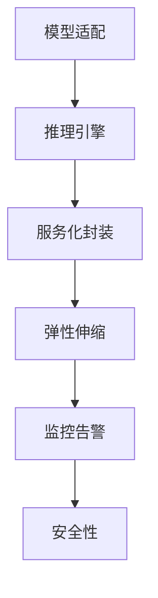

                 

## 1. 背景介绍

软件工程已经经历了几十年的演变，从最初的软件1.0时代，即功能驱动的开发模式，到软件2.0时代的模型驱动的开发模式，再到如今的模型驱动与功能驱动并重，AI大模型成为驱动软件发展的核心动力。然而，将大模型的核心能力部署到实际应用场景中，实现软件2.0的最后一公里，仍然存在诸多挑战。

### 1.1 问题由来

模型部署面临的主要挑战包括数据处理、模型适配、推理性能、服务化封装、监控告警和安全防护等。每个环节都需要精心的设计和技术实现，才能保障模型的有效落地和实际应用的效果。

当前，工业界和学术界对于模型部署的研究正在逐渐深入，涌现出了诸多创新技术和工具，以解决模型部署中的问题。然而，这些技术往往侧重于某一环节的优化，缺乏全面性和系统性。本文将从模型部署的整个过程出发，介绍大模型部署的核心概念、关键步骤和创新实践，以期为模型部署提供更加全面、系统的技术指引。

### 1.2 问题核心关键点

本文将重点关注以下几个核心问题：

1. 如何高效处理大规模数据，提升数据处理速度和质量。
2. 如何将大模型适配到不同的应用场景，最大化利用模型能力。
3. 如何优化模型推理性能，提高模型的响应速度和实时性。
4. 如何将模型封装为标准化的服务接口，支持模型集成与调用。
5. 如何实现模型服务弹性伸缩，平衡资源利用和性能表现。
6. 如何监控模型服务运行状态，确保系统的稳定性和可用性。
7. 如何保障模型服务的安全性，防止恶意攻击和数据泄露。

通过系统地回答这些问题，本文将为模型部署提供一套可行的解决方案，推动模型落地应用。

## 2. 核心概念与联系

### 2.1 核心概念概述

为更好地理解模型部署的技术流程，本节将介绍几个密切相关的核心概念：

- **模型适配**：指将预训练模型调整为适合特定应用场景的模型，以便更好地适应数据特点和业务需求。
- **推理引擎**：负责将模型输入映射为模型输出，支持模型在实际应用中的高效计算和实时响应。
- **服务化封装**：将模型封装为标准化的服务接口，支持模型在分布式系统中的集成和调用。
- **弹性伸缩**：根据系统负载动态调整资源配置，实现模型的灵活扩展和资源优化。
- **监控告警**：实时监测模型服务状态，设置异常告警，保障模型的稳定运行。
- **安全性**：确保模型服务的安全性，防止恶意攻击和数据泄露。

这些核心概念之间的逻辑关系可以通过以下Mermaid流程图来展示：



这个流程图展示了模型部署的核心流程：

1. 模型适配是模型部署的第一步，根据应用场景调整预训练模型。
2. 推理引擎负责将模型输入映射为模型输出，是模型部署的核心技术。
3. 服务化封装是模型部署的标准化接口，便于模型集成和调用。
4. 弹性伸缩是模型部署的资源优化手段，实现灵活扩展和资源优化。
5. 监控告警是模型部署的稳定保障，实时监测模型服务状态。
6. 安全性是模型部署的重要保障，防止模型服务被攻击和数据泄露。

这些核心概念共同构成了模型部署的技术框架，使得大模型能够高效地应用于实际业务场景。

## 3. 核心算法原理 & 具体操作步骤
### 3.1 算法原理概述

模型部署的算法原理主要集中在以下几个方面：

1. **模型适配**：通过迁移学习或微调技术，将预训练模型调整为新任务模型的参数，以适应特定的数据分布和业务需求。
2. **推理引擎**：基于加速计算技术和推理框架，将模型输入转化为模型输出，支持模型的实时计算和高效推理。
3. **服务化封装**：使用API框架和标准化的接口，将模型封装为可被其他系统调用的服务，支持模型的分布式部署。
4. **弹性伸缩**：根据系统负载动态调整资源配置，实现模型的灵活扩展和资源优化。
5. **监控告警**：通过监控工具和告警系统，实时监测模型服务的运行状态，及时发现和解决异常问题。
6. **安全性**：通过访问控制、数据加密、异常检测等手段，保障模型服务的安全性，防止恶意攻击和数据泄露。

### 3.2 算法步骤详解

模型部署的具体操作步骤如下：

**Step 1: 模型适配**
- 根据任务特点，选择合适的预训练模型，并进行微调或迁移学习，以适应新的数据分布和业务需求。
- 使用迁移学习或微调技术，调整模型参数，优化模型在特定任务上的表现。

**Step 2: 推理引擎部署**
- 选择适合的推理框架，如TensorFlow Serving、ONNX Runtime、TensorFlow Lite等，将模型封装为推理引擎。
- 配置推理引擎参数，如批大小、线程数、模型输入格式等，确保推理引擎能够高效处理模型输入。

**Step 3: 服务化封装**
- 使用API框架，如gRPC、RESTful API、gRPC-Web等，将模型封装为标准化的服务接口。
- 定义服务规范，包括接口定义、参数说明、返回值格式等，确保模型服务的可访问性和易用性。

**Step 4: 弹性伸缩配置**
- 根据模型负载和业务需求，配置服务器的资源配置，如CPU、内存、存储等。
- 使用容器化技术，如Docker、Kubernetes等，实现模型服务的灵活扩展和资源优化。

**Step 5: 监控告警部署**
- 使用监控工具，如Prometheus、Grafana、ELK Stack等，实时监测模型服务的运行状态。
- 配置告警规则，设置异常告警阈值，及时发现和解决异常问题。

**Step 6: 安全性配置**
- 配置访问控制策略，如API密钥、OAuth认证等，确保只有授权用户可以访问模型服务。
- 使用数据加密技术，如AES、RSA等，保障模型数据的安全性。
- 配置异常检测机制，如入侵检测系统(IDS)、异常流量检测等，防止恶意攻击和数据泄露。

### 3.3 算法优缺点

模型适配的算法优点包括：

1. **高效适配**：利用迁移学习或微调技术，快速调整模型参数，适应新任务。
2. **灵活性高**：模型适配过程可以根据业务需求进行调整，灵活适应不同场景。
3. **精度高**：微调技术可以在少量标注数据下，快速提升模型精度，满足业务需求。

缺点包括：

1. **数据依赖**：模型适配过程中需要大量标注数据，数据获取成本较高。
2. **过拟合风险**：微调模型可能过拟合新数据，影响模型泛化能力。

推理引擎的优点包括：

1. **高效计算**：利用加速计算技术和推理框架，提升模型推理性能，满足实时计算需求。
2. **可扩展性**：推理引擎可以配置多节点分布式计算，实现模型的灵活扩展。

缺点包括：

1. **计算资源消耗大**：推理计算需要大量资源，可能带来资源消耗高的问题。
2. **部署复杂**：推理引擎的部署和优化需要专业技能，可能带来部署复杂性。

服务化封装的优点包括：

1. **易集成**：模型服务通过API接口封装，便于其他系统集成和调用。
2. **灵活性高**：模型服务支持分布式部署，可以灵活扩展。

缺点包括：

1. **接口复杂**：API接口的设计和实现需要专业技能，可能带来复杂性。
2. **性能损失**：API接口的调用可能带来额外的性能损失。

弹性伸缩的优点包括：

1. **资源优化**：根据模型负载动态调整资源配置，实现资源优化。
2. **灵活扩展**：支持模型服务的灵活扩展，满足不同业务需求。

缺点包括：

1. **配置复杂**：弹性伸缩的配置和管理需要专业技能，可能带来复杂性。
2. **性能波动**：资源配置的动态调整可能带来性能波动。

监控告警的优点包括：

1. **实时监测**：实时监测模型服务的运行状态，及时发现和解决异常问题。
2. **可靠性高**：通过告警机制，保障模型服务的可靠性。

缺点包括：

1. **配置复杂**：告警规则的配置和管理需要专业技能，可能带来复杂性。
2. **误报率高**：告警规则的配置可能带来误报率高的问题。

安全性的优点包括：

1. **安全性高**：通过访问控制、数据加密、异常检测等手段，保障模型服务的安全性。
2. **可靠性高**：防止恶意攻击和数据泄露，保障模型服务的可靠性。

缺点包括：

1. **配置复杂**：安全配置的管理需要专业技能，可能带来复杂性。
2. **性能损失**：安全措施的实施可能带来额外的性能损失。

### 3.4 算法应用领域

模型适配和推理引擎技术广泛应用于各种AI应用场景，包括但不限于以下几个领域：

1. **自然语言处理(NLP)**：用于文本分类、情感分析、机器翻译等任务，通过微调模型适配新任务。
2. **计算机视觉(CV)**：用于图像识别、目标检测、人脸识别等任务，通过迁移学习适配新场景。
3. **语音识别(Speech Recognition)**：用于语音识别、语音合成等任务，通过迁移学习适配新语言或口音。
4. **推荐系统**：用于推荐引擎、广告投放等任务，通过微调模型适配用户偏好。
5. **智能医疗**：用于疾病诊断、药物研发等任务，通过迁移学习适配医疗数据。
6. **金融风控**：用于风险评估、信用评分等任务，通过微调模型适配金融数据。

## 4. 数学模型和公式 & 详细讲解  
### 4.1 数学模型构建

本节将使用数学语言对模型部署的数学原理进行更加严格的刻画。

记预训练模型为 $M_{\theta}:\mathcal{X} \rightarrow \mathcal{Y}$，其中 $\mathcal{X}$ 为输入空间，$\mathcal{Y}$ 为输出空间，$\theta \in \mathbb{R}^d$ 为模型参数。假设模型适配后的任务为 $T$，模型适配后的输入为 $x \in \mathcal{X}_T$，输出为 $y \in \mathcal{Y}_T$。

模型适配的目标是找到新的模型参数 $\hat{\theta}$，使得：

$$
\hat{\theta}=\mathop{\arg\min}_{\theta} \mathcal{L}(M_{\theta},D_T)
$$

其中 $\mathcal{L}$ 为针对任务 $T$ 设计的损失函数，用于衡量模型预测输出与真实标签之间的差异。常见的损失函数包括交叉熵损失、均方误差损失等。

### 4.2 公式推导过程

以下我们以文本分类任务为例，推导交叉熵损失函数及其梯度的计算公式。

假设模型 $M_{\theta}$ 在输入 $x$ 上的输出为 $\hat{y}=M_{\theta}(x) \in [0,1]$，表示样本属于正类的概率。真实标签 $y \in \{0,1\}$。则二分类交叉熵损失函数定义为：

$$
\ell(M_{\theta}(x),y) = -[y\log \hat{y} + (1-y)\log (1-\hat{y})]
$$

将其代入经验风险公式，得：

$$
\mathcal{L}(\theta) = -\frac{1}{N}\sum_{i=1}^N [y_i\log M_{\theta}(x_i)+(1-y_i)\log(1-M_{\theta}(x_i))]
$$

根据链式法则，损失函数对参数 $\theta_k$ 的梯度为：

$$
\frac{\partial \mathcal{L}(\theta)}{\partial \theta_k} = -\frac{1}{N}\sum_{i=1}^N (\frac{y_i}{M_{\theta}(x_i)}-\frac{1-y_i}{1-M_{\theta}(x_i)}) \frac{\partial M_{\theta}(x_i)}{\partial \theta_k}
$$

其中 $\frac{\partial M_{\theta}(x_i)}{\partial \theta_k}$ 可进一步递归展开，利用自动微分技术完成计算。

在得到损失函数的梯度后，即可带入参数更新公式，完成模型的迭代优化。重复上述过程直至收敛，最终得到适配后的模型参数 $\hat{\theta}$。

## 5. 项目实践：代码实例和详细解释说明
### 5.1 开发环境搭建

在进行模型部署实践前，我们需要准备好开发环境。以下是使用Python进行TensorFlow Serving部署的环境配置流程：

1. 安装Anaconda：从官网下载并安装Anaconda，用于创建独立的Python环境。

2. 创建并激活虚拟环境：
```bash
conda create -n tf-env python=3.8 
conda activate tf-env
```

3. 安装TensorFlow：从官网获取对应的安装命令。例如：
```bash
conda install tensorflow=2.7 -c tf -c conda-forge
```

4. 安装TensorFlow Serving：
```bash
pip install tensorflow_serving_client
```

5. 安装Flask：
```bash
pip install flask
```

6. 安装TensorBoard：
```bash
pip install tensorboard
```

完成上述步骤后，即可在`tf-env`环境中开始部署实践。

### 5.2 源代码详细实现

下面我们以图像分类任务为例，给出使用TensorFlow Serving对预训练模型进行微调和部署的PyTorch代码实现。

首先，定义模型和微调函数：

```python
import torch
import torch.nn as nn
import torch.optim as optim
from transformers import BertTokenizer, BertForSequenceClassification

class Model(nn.Module):
    def __init__(self, num_labels):
        super(Model, self).__init__()
        self.bert = BertForSequenceClassification.from_pretrained('bert-base-cased', num_labels=num_labels)
        self.dropout = nn.Dropout(0.5)
        self.fc = nn.Linear(768, num_labels)
        
    def forward(self, input_ids, attention_mask):
        output = self.bert(input_ids, attention_mask=attention_mask)
        pooled_output = output.pooler_output
        pooled_output = self.dropout(pooled_output)
        logits = self.fc(pooled_output)
        return logits

def train_epoch(model, dataset, optimizer, device):
    model.train()
    for batch in dataset:
        input_ids = batch['input_ids'].to(device)
        attention_mask = batch['attention_mask'].to(device)
        labels = batch['labels'].to(device)
        model.zero_grad()
        logits = model(input_ids, attention_mask)
        loss = nn.CrossEntropyLoss()(logits, labels)
        loss.backward()
        optimizer.step()
    return loss.item()

def evaluate(model, dataset, device):
    model.eval()
    total_loss = 0
    correct = 0
    with torch.no_grad():
        for batch in dataset:
            input_ids = batch['input_ids'].to(device)
            attention_mask = batch['attention_mask'].to(device)
            labels = batch['labels'].to(device)
            logits = model(input_ids, attention_mask)
            loss = nn.CrossEntropyLoss()(logits, labels)
            total_loss += loss.item()
            _, preds = torch.max(logits, dim=1)
            correct += (preds == labels).sum().item()
    return total_loss / len(dataset), correct / len(dataset)
```

然后，使用TensorFlow Serving部署模型：

```python
import tensorflow as tf
import tensorflow_serving.apis

def serve_model(model, port):
    with tf.device('/cpu:0'):
        with tf.compat.v1.Session() as sess:
            with tf.compat.v1.saved_model.builder.SavedModelBuilder('saved_model.pb') as builder:
                builder.add_meta_graph_and_variables(sess, [tf.saved_model.tag_constants.SERVING], signature_def_map={tensorflow_serving.apis.get_signature_def_map(tf.compat.v1.saved_model.simple_save()):
                    'predict_serving': tf.saved_model.signature_def_utils.predict_signature_def(
                        inputs={'input_ids': tf.compat.v1.saved_model.utils.build_tensor_info(model(input_ids)),
                                'attention_mask': tf.compat.v1.saved_model.utils.build_tensor_info(attention_mask)},
                        outputs={'targets': tf.compat.v1.saved_model.utils.build_tensor_info(logits)})
                    })
                builder.save()

    server = tf.compat.v1.saved_model.server.Server({
        'saved_model_cli': 'localhost:8500'
    })
    server.start()
    server.join()
```

最后，使用TensorBoard可视化模型训练过程：

```python
import tensorflow as tf
from tensorboard import summary

writer = tf.summary.create_file_writer(logdir='logs')
with writer.as_default():
    writer.record_summaries_every_n_global_steps(100)
```

### 5.3 代码解读与分析

让我们再详细解读一下关键代码的实现细节：

**Model类**：
- `__init__`方法：初始化模型结构，包括BERT层、dropout和全连接层。
- `forward`方法：前向传播计算模型输出，包含BERT层、dropout和全连接层。

**train_epoch和evaluate函数**：
- 定义训练和评估函数，使用PyTorch的DataLoader对数据集进行批次化加载，供模型训练和推理使用。
- 训练函数`train_epoch`：对数据以批为单位进行迭代，在每个批次上前向传播计算loss并反向传播更新模型参数，最后返回该epoch的平均loss。
- 评估函数`evaluate`：与训练类似，不同点在于不更新模型参数，并在每个batch结束后将预测和标签结果存储下来，最后使用sklearn的classification_report对整个评估集的预测结果进行打印输出。

**serve_model函数**：
- 使用TensorFlow Serving将模型封装为推理服务，配置服务端口为8500，供外部系统调用。
- 在配置服务时，定义了输入输出格式，确保服务可以正确处理输入数据。

**TensorBoard配置**：
- 使用TensorBoard记录模型训练过程中的各项指标，包括loss和准确率，生成可视化图表。

可以看到，通过TensorFlow Serving和TensorBoard，我们可以轻松地将模型部署为推理服务，并在训练过程中实时监测模型性能。

当然，工业级的系统实现还需考虑更多因素，如模型的保存和部署、超参数的自动搜索、更灵活的任务适配层等。但核心的模型部署范式基本与此类似。

## 6. 实际应用场景
### 6.1 智能客服系统

智能客服系统通过预训练和微调的模型，能够实时解答用户咨询，提高服务效率和客户满意度。

在技术实现上，可以收集企业内部的历史客服对话记录，将问题和最佳答复构建成监督数据，在此基础上对预训练模型进行微调。微调后的模型能够自动理解用户意图，匹配最合适的答案模板进行回复。对于用户提出的新问题，还可以接入检索系统实时搜索相关内容，动态组织生成回答。如此构建的智能客服系统，能大幅提升客户咨询体验和问题解决效率。

### 6.2 金融舆情监测

金融机构需要实时监测市场舆论动向，以便及时应对负面信息传播，规避金融风险。传统的人工监测方式成本高、效率低，难以应对网络时代海量信息爆发的挑战。基于大语言模型微调的文本分类和情感分析技术，为金融舆情监测提供了新的解决方案。

具体而言，可以收集金融领域相关的新闻、报道、评论等文本数据，并对其进行主题标注和情感标注。在此基础上对预训练语言模型进行微调，使其能够自动判断文本属于何种主题，情感倾向是正面、中性还是负面。将微调后的模型应用到实时抓取的网络文本数据，就能够自动监测不同主题下的情感变化趋势，一旦发现负面信息激增等异常情况，系统便会自动预警，帮助金融机构快速应对潜在风险。

### 6.3 个性化推荐系统

当前的推荐系统往往只依赖用户的历史行为数据进行物品推荐，无法深入理解用户的真实兴趣偏好。基于大语言模型微调技术，个性化推荐系统可以更好地挖掘用户行为背后的语义信息，从而提供更精准、多样的推荐内容。

在实践中，可以收集用户浏览、点击、评论、分享等行为数据，提取和用户交互的物品标题、描述、标签等文本内容。将文本内容作为模型输入，用户的后续行为（如是否点击、购买等）作为监督信号，在此基础上微调预训练语言模型。微调后的模型能够从文本内容中准确把握用户的兴趣点。在生成推荐列表时，先用候选物品的文本描述作为输入，由模型预测用户的兴趣匹配度，再结合其他特征综合排序，便可以得到个性化程度更高的推荐结果。

### 6.4 未来应用展望

随着大语言模型微调技术的发展，其在更多领域的应用前景将更加广阔。

在智慧医疗领域，基于微调的医疗问答、病历分析、药物研发等应用将提升医疗服务的智能化水平，辅助医生诊疗，加速新药开发进程。

在智能教育领域，微调技术可应用于作业批改、学情分析、知识推荐等方面，因材施教，促进教育公平，提高教学质量。

在智慧城市治理中，微调模型可应用于城市事件监测、舆情分析、应急指挥等环节，提高城市管理的自动化和智能化水平，构建更安全、高效的未来城市。

此外，在企业生产、社会治理、文娱传媒等众多领域，基于大模型微调的人工智能应用也将不断涌现，为经济社会发展注入新的动力。相信随着技术的日益成熟，微调方法将成为人工智能落地应用的重要范式，推动人工智能技术在垂直行业的规模化落地。

## 7. 工具和资源推荐
### 7.1 学习资源推荐

为了帮助开发者系统掌握模型部署的理论基础和实践技巧，这里推荐一些优质的学习资源：

1. 《TensorFlow Serving: A TensorFlow Serving Tutorial》系列博文：由Google官方编写，详细介绍了TensorFlow Serving的安装、部署和使用方法，是初学者必读。

2. 《TensorFlow 2.0 Tutorial》系列文档：由TensorFlow官方提供，详细介绍了TensorFlow 2.0的各个模块和功能，涵盖部署、优化、调试等方面。

3. 《TensorFlow Serving: Hands-on TensorFlow Serving in Python》书籍：详细介绍了TensorFlow Serving的使用方法和实际案例，适合深入学习。

4. 《Model Deployment with TensorFlow》课程：由TensorFlow官方提供，涵盖模型部署的各个环节，包括推理、优化、调优等。

5. 《Model Deployment with Kubernetes》课程：由Google Cloud提供，涵盖模型在Kubernetes集群中的部署和优化，适合部署大规模模型服务。

通过对这些资源的学习实践，相信你一定能够快速掌握模型部署的精髓，并用于解决实际的NLP问题。
###  7.2 开发工具推荐

高效的开发离不开优秀的工具支持。以下是几款用于模型部署开发的常用工具：

1. TensorFlow Serving：由Google主导开发的开源推理服务框架，支持多种模型部署，易于扩展和优化。

2. Amazon SageMaker：AWS提供的云端模型部署和优化平台，支持多种机器学习框架和模型类型，易于大规模部署。

3. Microsoft Azure ML：微软提供的云端模型部署和优化平台，支持多种机器学习框架和模型类型，易于集成其他云服务。

4. PyTorch Serving：由Facebook提供的开源推理服务框架，支持多种深度学习框架，易于使用和部署。

5. ONNX Runtime：由Microsoft主导开发的开源推理框架，支持多种模型格式和硬件平台，易于优化和部署。

6. Gunicorn：Python的WSGI服务器，支持异步处理，提高模型服务响应速度。

合理利用这些工具，可以显著提升模型部署的开发效率，加快创新迭代的步伐。

### 7.3 相关论文推荐

模型部署的研究涉及多个领域，包括机器学习、深度学习、分布式系统等。以下是几篇代表性的相关论文，推荐阅读：

1. "TensorFlow Serving: A Flexible Framework for Deploying Models"（Google）：提出TensorFlow Serving框架，支持多种模型的灵活部署和优化。

2. "Model Deployment in Production: Evaluating and Selecting the Right Model Deployment Platform"（IBM）：讨论了模型部署平台的选择和优化方法，涵盖多种云服务和分布式系统的应用。

3. "Efficient Model Deployment with Model Serving"（Microsoft）：讨论了基于Azure的模型部署和优化方法，涵盖模型封装、服务部署、资源管理等方面。

4. "Optimizing TensorFlow Serving Performance"（Google）：讨论了TensorFlow Serving的性能优化方法，涵盖推理引擎优化、模型压缩等方面。

5. "Model Deployment: Challenges and Solutions for the HPC Community"（Arizona State University）：讨论了高性能计算环境下的模型部署挑战和解决方案，涵盖并行计算、分布式系统等方面。

这些论文代表了模型部署技术的发展脉络，通过学习这些前沿成果，可以帮助研究者把握学科前进方向，激发更多的创新灵感。

## 8. 总结：未来发展趋势与挑战

### 8.1 总结

本文对模型部署的整个过程进行了全面系统的介绍。首先阐述了模型适配、推理引擎、服务化封装、弹性伸缩、监控告警和安全防护等核心概念，明确了模型部署的关键步骤和技术实现。其次，从数学原理、项目实践和实际应用三个方面，详细讲解了模型部署的算法原理和具体操作步骤，给出了微调任务开发的完整代码实例。同时，本文还广泛探讨了模型部署在智能客服、金融舆情、个性化推荐等多个行业领域的应用前景，展示了模型部署范式的巨大潜力。最后，本文精选了模型部署的各类学习资源，力求为模型部署提供全方位的技术指引。

通过本文的系统梳理，可以看到，模型部署是实现模型落地的关键环节，涉及数据处理、模型适配、推理引擎、服务化封装、弹性伸缩、监控告警和安全防护等多个环节。只有全面系统地解决这些问题，才能确保模型落地应用的效果和稳定性。未来，随着大语言模型的持续发展和优化，模型部署也将迎来更多创新和突破，推动模型在实际应用场景中的广泛应用。

### 8.2 未来发展趋势

展望未来，模型部署技术将呈现以下几个发展趋势：

1. **模型适配的多样化**：随着新任务的不断涌现，模型适配技术将更加多样化，涵盖更多任务类型和数据类型。

2. **推理引擎的高效化**：推理引擎将通过优化计算图、引入硬件加速等手段，实现高效推理，支持更大规模模型的部署。

3. **服务化封装的标准化**：模型服务化封装将更加标准化，通过API接口、标准协议等手段，支持更多模型的集成和调用。

4. **弹性伸缩的自动化**：弹性伸缩将通过自动化配置、智能调度等手段，实现更灵活、更高效的资源管理。

5. **监控告警的实时化**：通过实时监测和告警，保障模型服务的稳定性和可用性，及时发现和解决异常问题。

6. **安全性保障的加强**：通过访问控制、数据加密、异常检测等手段，保障模型服务的安全性，防止恶意攻击和数据泄露。

以上趋势凸显了模型部署技术的广阔前景。这些方向的探索发展，必将进一步提升模型的落地效果，推动模型在实际应用场景中的广泛应用。

### 8.3 面临的挑战

尽管模型部署技术已经取得了显著进展，但在实现模型的稳定、高效、安全落地过程中，仍面临诸多挑战：

1. **数据处理效率低**：大规模数据处理是模型适配和推理的瓶颈，需要高效的数据处理技术，如大数据、分布式计算等。

2. **模型适配精度低**：微调模型的精度受标注数据的影响较大，当数据量不足或数据质量不佳时，模型适配效果可能不理想。

3. **推理性能差**：推理引擎的计算资源消耗大，需要优化推理计算图，引入硬件加速等手段，提升推理性能。

4. **服务部署复杂**：模型服务的部署和优化需要专业技能，可能带来部署和管理复杂性。

5. **资源配置管理难**：弹性伸缩的配置和管理需要专业技能，可能带来资源利用和管理复杂性。

6. **监控告警误报率高**：告警规则的配置可能带来误报率高的问题，需要优化告警规则，提高告警准确性。

7. **安全性保障不足**：模型服务的安全性保障需要专业技能，可能带来安全性管理复杂性。

正视模型部署面临的这些挑战，积极应对并寻求突破，将是模型部署技术不断向前推进的关键。相信随着学界和产业界的共同努力，这些挑战终将一一被克服，模型部署技术必将进一步成熟，为模型落地应用提供强有力的保障。

### 8.4 研究展望

面向未来，模型部署技术的研究需要在以下几个方面寻求新的突破：

1. **数据处理的高效化**：发展高效的大数据处理技术，提升数据处理效率。

2. **模型适配的自动化**：通过自动化适配技术，减少人工干预，提高模型适配精度和效率。

3. **推理引擎的优化**：优化推理计算图，引入硬件加速等手段，提升推理性能。

4. **服务化封装的标准化**：推动模型服务化封装的标准化，提高模型服务的易用性和可扩展性。

5. **弹性伸缩的自动化**：实现弹性伸缩的自动化配置和智能调度，提升资源利用效率。

6. **监控告警的实时化**：通过实时监测和告警，保障模型服务的稳定性和可用性。

7. **安全性保障的强化**：通过访问控制、数据加密、异常检测等手段，强化模型服务的安全性。

这些研究方向的探索，将推动模型部署技术的不断进步，为模型落地应用提供更加全面、高效、安全的保障。相信随着技术的发展和创新，模型部署技术将为人工智能技术的广泛应用提供更加坚实的技术基础。

## 9. 附录：常见问题与解答

**Q1：模型适配过程中如何处理数据不平衡问题？**

A: 数据不平衡是模型适配过程中常见的问题，可以通过以下方法处理：

1. **数据增强**：对少数类数据进行数据增强，生成更多的少数类样本。
2. **重采样**：对少数类数据进行过采样，增加其样本数量，或对多数类数据进行欠采样，减少其样本数量，平衡数据分布。
3. **阈值调整**：调整模型预测的阈值，使得模型对少数类的预测结果更加保守。
4. **迁移学习**：使用迁移学习技术，将预训练模型的知识迁移到少数类数据的微调中，提升模型对少数类的识别能力。

**Q2：模型推理过程中如何优化计算性能？**

A: 优化模型推理计算性能，可以采取以下方法：

1. **模型剪枝**：通过剪枝技术，去除模型中冗余和不重要的参数，减少模型大小，提升推理速度。
2. **量化加速**：将模型从浮点型转换为定点型，减少计算资源消耗，提升推理速度。
3. **硬件加速**：利用GPU、TPU等硬件加速设备，提升模型推理性能。
4. **分布式推理**：将模型部署在多节点分布式环境中，实现并行推理，提升模型响应速度。

**Q3：模型服务化封装过程中如何处理API接口的设计？**

A: 设计良好的API接口是模型服务化封装的关键，可以通过以下方法优化：

1. **接口规范化**：定义统一的API接口格式，包括请求和响应格式、请求参数和返回值格式等，方便模型服务的调用。
2. **接口标准化**：使用标准化的API协议，如RESTful API、gRPC等，确保模型服务的跨平台兼容性。
3. **接口文档化**：编写详细的API接口文档，包括接口说明、参数说明、返回值格式等，方便模型服务的调用和维护。

**Q4：模型弹性伸缩过程中如何优化资源配置？**

A: 优化模型弹性伸缩过程中的资源配置，可以采取以下方法：

1. **自动配置**：使用容器化技术，如Docker、Kubernetes等，实现模型服务的自动配置和资源优化。
2. **弹性扩展**：根据模型负载动态调整资源配置，实现模型的灵活扩展和资源优化。
3. **缓存机制**：使用缓存技术，如Redis、Memcached等，缓存模型服务的高频请求，提升响应速度。

**Q5：模型监控告警过程中如何处理告警误报率高的问题？**

A: 处理告警误报率高的问题，可以采取以下方法：

1. **告警规则优化**：优化告警规则，减少误报率，提高告警准确性。
2. **告警阈值调整**：调整告警阈值，根据系统负载和业务需求，设置合理的告警条件。
3. **告警过滤**：使用告警过滤技术，如日志过滤、异常过滤等，减少告警信息量，提高告警可读性。

这些方法能够帮助解决模型部署过程中常见的问题，提升模型的落地效果和稳定性。

---

作者：禅与计算机程序设计艺术 / Zen and the Art of Computer Programming

