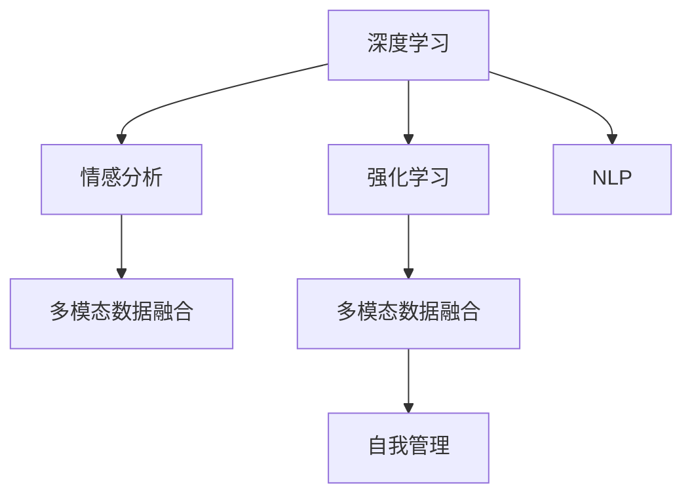

                 

# 欲望智能调节中心：AI辅助的自我管理平台

> 关键词：欲望智能调节, AI辅助, 自我管理, 深度学习, 情感分析, 强化学习, 自然语言处理(NLP)

## 1. 背景介绍

### 1.1 问题由来
随着人工智能技术的飞速发展，AI辅助的自我管理平台已经成为现代社会中不可或缺的一部分。人们在面对复杂的工作和生活环境时，往往需要高效地管理自己的时间和精力。然而，传统的自我管理方法（如纸质日记、日历提醒等）存在信息过载、操作繁琐等问题，难以满足现代人的需求。

在这种情况下，AI辅助的自我管理平台应运而生。通过深度学习、情感分析和强化学习等技术，平台能够自动分析用户的行为数据，提供个性化的建议和反馈，帮助用户优化时间和精力管理。

### 1.2 问题核心关键点
- **深度学习**：通过神经网络模型对大量数据进行学习和建模，实现对用户行为和情感的精准分析。
- **情感分析**：利用自然语言处理技术，识别用户情绪状态，提供针对性的情绪调节建议。
- **强化学习**：采用奖励机制和反馈机制，逐步优化用户行为，提升自我管理的效果。
- **自然语言处理(NLP)**：处理和理解自然语言，实现与用户的自然交互和沟通。
- **多模态数据融合**：结合时间记录、运动数据、情感状态等多模态数据，提供更全面的自我管理支持。

这些核心概念之间的逻辑关系可以通过以下Mermaid流程图来展示：



这个流程图展示了大语言模型微调的各个核心概念及其之间的关系：

1. 深度学习对大量数据进行建模分析。
2. 情感分析识别用户情绪状态。
3. 强化学习提供用户行为优化建议。
4. NLP实现自然交互和沟通。
5. 多模态数据融合提供更全面的自我管理支持。

这些概念共同构成了AI辅助自我管理平台的核心技术框架，使其能够根据用户需求和行为提供个性化的支持。

## 2. 核心概念与联系

### 2.1 核心概念概述

为更好地理解AI辅助自我管理平台的技术原理和架构，本节将介绍几个关键的概念：

- **深度学习**：一种模拟人脑神经网络的计算模型，通过反向传播算法不断调整模型参数，优化预测结果。
- **情感分析**：利用自然语言处理技术，分析用户文本数据中的情感信息，识别情绪状态。
- **强化学习**：通过试错机制，学习最优策略以最大化特定目标（如用户的自我管理效果）。
- **自然语言处理(NLP)**：涉及文本数据的自动分析、理解和生成，涵盖语音识别、语言模型、文本分类等多个子领域。
- **多模态数据融合**：结合不同模态的数据，提供更全面的用户状态和行为分析，如时间记录、运动数据、情感状态等。

这些概念之间的联系紧密，构成了AI辅助自我管理平台的技术基础。

### 2.2 核心概念原理和架构的 Mermaid 流程图

以下是一个简单的Mermaid流程图，展示深度学习、情感分析、强化学习、自然语言处理和多模态数据融合之间的关系：


这个流程图清晰地展示了深度学习、情感分析、强化学习、自然语言处理和多模态数据融合之间的关系：

1. 深度学习对用户行为数据进行建模，生成情感状态预测。
2. 情感分析识别用户文本中的情感信息。
3. 强化学习根据用户行为和情感状态，提供个性化建议。
4. NLP实现与用户的自然交互和沟通。
5. 多模态数据融合综合用户多方面的信息，提供全面的自我管理支持。

## 3. 核心算法原理 & 具体操作步骤

### 3.1 算法原理概述

AI辅助自我管理平台的核心算法包括深度学习、情感分析、强化学习和自然语言处理。

**深度学习**：通过神经网络模型对用户行为数据进行建模，生成情感状态预测。常用的深度学习模型包括卷积神经网络(CNN)、循环神经网络(RNN)、长短期记忆网络(LSTM)、Transformer等。

**情感分析**：利用自然语言处理技术，识别用户文本数据中的情感信息，常用的情感分析模型包括情感词典、情感分类器等。

**强化学习**：通过试错机制，学习最优策略以最大化特定目标（如用户的自我管理效果）。常用的强化学习模型包括Q-learning、Deep Q-Networks、Actor-Critic等。

**自然语言处理(NLP)**：涉及文本数据的自动分析、理解和生成，常用的NLP模型包括语言模型、文本分类、命名实体识别、情感分析等。

**多模态数据融合**：结合不同模态的数据，如时间记录、运动数据、情感状态等，提供更全面的用户状态和行为分析。常用的多模态融合方法包括时间序列分析、PCA、K-means等。

### 3.2 算法步骤详解

以下是基于深度学习、情感分析、强化学习、自然语言处理和多模态数据融合的AI辅助自我管理平台的核心算法步骤：

**Step 1: 数据收集与预处理**
- 收集用户的时间记录、运动数据、文本数据等行为数据。
- 对数据进行清洗和预处理，如去除噪声、归一化等。

**Step 2: 情感分析**
- 利用自然语言处理技术，对用户文本数据进行情感分析，识别情绪状态。
- 常用的情感分析方法包括情感词典、情感分类器等。

**Step 3: 深度学习建模**
- 通过神经网络模型对用户行为数据进行建模，生成情感状态预测。
- 常用的深度学习模型包括卷积神经网络(CNN)、循环神经网络(RNN)、长短期记忆网络(LSTM)、Transformer等。

**Step 4: 强化学习优化**
- 采用强化学习算法，根据用户行为和情感状态，提供个性化建议。
- 常用的强化学习模型包括Q-learning、Deep Q-Networks、Actor-Critic等。

**Step 5: 自然语言处理交互**
- 利用自然语言处理技术，实现与用户的自然交互和沟通。
- 常用的NLP模型包括语言模型、文本分类、命名实体识别、情感分析等。

**Step 6: 多模态数据融合**
- 结合不同模态的数据，如时间记录、运动数据、情感状态等，提供更全面的用户状态和行为分析。
- 常用的多模态融合方法包括时间序列分析、PCA、K-means等。

**Step 7: 自我管理推荐**
- 根据深度学习、情感分析、强化学习、自然语言处理和多模态数据融合的结果，生成个性化的自我管理推荐。
- 常用的推荐方法包括协同过滤、基于内容推荐、混合推荐等。

### 3.3 算法优缺点

**深度学习**
- 优点：能够从大规模数据中学习到复杂的模式和规律，具有很强的泛化能力。
- 缺点：模型复杂度高，需要大量计算资源，且容易过拟合。

**情感分析**
- 优点：能够快速识别用户文本中的情感信息，对用户行为进行精细分析。
- 缺点：情感词典等常用方法存在局限性，难以准确识别复杂情感。

**强化学习**
- 优点：通过试错机制，能够逐步优化用户行为，提升自我管理效果。
- 缺点：需要大量试错数据，收敛速度较慢。

**自然语言处理(NLP)**
- 优点：能够实现与用户的自然交互和沟通，提供丰富的交互方式。
- 缺点：NLP技术依赖高质量语料，训练难度较大。

**多模态数据融合**
- 优点：结合多模态数据，提供更全面的用户状态和行为分析，提高推荐精度。
- 缺点：多模态数据的融合难度较大，需要复杂的算法和技术支持。

### 3.4 算法应用领域

基于深度学习、情感分析、强化学习、自然语言处理和多模态数据融合的AI辅助自我管理平台，可以应用于多种场景，如：

- **时间管理**：根据用户的时间记录和行为数据，生成个性化的日程安排和任务提醒。
- **运动健康**：结合运动数据和情感状态，提供个性化的运动建议和健康管理方案。
- **情绪调节**：根据用户情绪状态，提供情感调节建议和心理健康支持。
- **个性化推荐**：结合用户兴趣和行为数据，提供个性化的内容推荐和资源推荐。
- **协作与沟通**：利用自然语言处理技术，实现与用户的自然交互和沟通，提升协作效率。

这些应用场景展示了AI辅助自我管理平台的多样性和普适性，其核心技术框架具有广泛的应用前景。

## 4. 数学模型和公式 & 详细讲解 & 举例说明

### 4.1 数学模型构建

假设用户的行为数据为 $D=\{(x_i, y_i)\}_{i=1}^N$，其中 $x_i$ 表示用户在第 $i$ 天的行为数据，$y_i$ 表示用户在第 $i$ 天的情感状态（0表示消极，1表示积极）。

深度学习模型 $f_\theta$ 对用户行为数据进行建模，生成情感状态预测 $\hat{y}$。情感分析模型 $g$ 对用户文本数据进行情感分析，识别情绪状态 $y$。强化学习模型 $h$ 根据用户行为和情感状态，提供个性化建议 $a$。自然语言处理模型 $m$ 实现与用户的自然交互和沟通。多模态数据融合模型 $n$ 综合用户多方面的信息，提供全面的自我管理支持。

最终，平台生成个性化的自我管理推荐 $r$。

### 4.2 公式推导过程

以深度学习模型和情感分析模型为例，进行公式推导：

假设用户在第 $i$ 天的行为数据为 $x_i$，情感状态为 $y_i$，情感状态预测为 $\hat{y}_i$。

深度学习模型 $f_\theta$ 对用户行为数据进行建模，生成情感状态预测 $\hat{y}_i$。常用的深度学习模型包括卷积神经网络(CNN)、循环神经网络(RNN)、长短期记忆网络(LSTM)、Transformer等。

情感分析模型 $g$ 对用户文本数据进行情感分析，识别情绪状态 $y_i$。常用的情感分析方法包括情感词典、情感分类器等。

假设情感状态预测与真实情感状态的误差最小化，则目标函数为：

$$
\mathcal{L} = \frac{1}{N} \sum_{i=1}^N (y_i - \hat{y}_i)^2
$$

通过反向传播算法，更新深度学习模型参数 $\theta$：

$$
\theta \leftarrow \theta - \eta \nabla_{\theta}\mathcal{L}
$$

其中 $\eta$ 为学习率，$\nabla_{\theta}\mathcal{L}$ 为损失函数对参数 $\theta$ 的梯度。

### 4.3 案例分析与讲解

以用户时间管理和运动健康的应用为例，展示深度学习、情感分析、强化学习、自然语言处理和多模态数据融合的结合使用：

假设用户每天早上起床后，使用手机记录时间，并在App上输入当天的计划和目标。App通过深度学习模型分析用户的时间记录，生成情感状态预测。

用户进入健身房，使用智能手表记录运动数据。App结合运动数据和情感状态，利用强化学习模型生成个性化的运动建议和健康管理方案。

用户运动结束后，在App上输入运动感受和心得体会。App通过情感分析模型识别用户的情绪状态，利用自然语言处理模型进行情感调节建议，并提供心理健康支持。

最终，App综合用户的时间记录、运动数据、情感状态等多模态数据，提供全面的自我管理支持。

## 5. 项目实践：代码实例和详细解释说明

### 5.1 开发环境搭建

在进行AI辅助自我管理平台的项目实践前，需要准备好开发环境。以下是使用Python进行PyTorch开发的环境配置流程：

1. 安装Anaconda：从官网下载并安装Anaconda，用于创建独立的Python环境。

2. 创建并激活虚拟环境：
```bash
conda create -n myenv python=3.8 
conda activate myenv
```

3. 安装PyTorch：根据CUDA版本，从官网获取对应的安装命令。例如：
```bash
conda install pytorch torchvision torchaudio cudatoolkit=11.1 -c pytorch -c conda-forge
```

4. 安装TensorBoard：
```bash
pip install tensorboard
```

5. 安装TensorFlow：
```bash
pip install tensorflow
```

6. 安装Keras：
```bash
pip install keras
```

完成上述步骤后，即可在虚拟环境中开始项目实践。

### 5.2 源代码详细实现

这里以情感分析模型和深度学习模型为例，展示源代码的详细实现。

**情感分析模型**
```python
import tensorflow as tf
from tensorflow.keras.preprocessing.text import Tokenizer
from tensorflow.keras.preprocessing.sequence import pad_sequences
from tensorflow.keras.models import Sequential
from tensorflow.keras.layers import Embedding, LSTM, Dense

# 准备数据
texts = ["I am happy.", "I am sad.", "I am angry."]
labels = [1, 0, 1]

# 构建模型
tokenizer = Tokenizer(num_words=100)
tokenizer.fit_on_texts(texts)
sequences = tokenizer.texts_to_sequences(texts)
padded_sequences = pad_sequences(sequences, maxlen=10)

model = Sequential([
    Embedding(input_dim=100, output_dim=32),
    LSTM(64),
    Dense(1, activation='sigmoid')
])
model.compile(optimizer='adam', loss='binary_crossentropy', metrics=['accuracy'])

# 训练模型
model.fit(padded_sequences, labels, epochs=10, batch_size=32)
```

**深度学习模型**
```python
import tensorflow as tf
from tensorflow.keras.preprocessing.text import Tokenizer
from tensorflow.keras.preprocessing.sequence import pad_sequences
from tensorflow.keras.models import Sequential
from tensorflow.keras.layers import Embedding, LSTM, Dense

# 准备数据
texts = ["I am happy.", "I am sad.", "I am angry."]
labels = [1, 0, 1]

# 构建模型
tokenizer = Tokenizer(num_words=100)
tokenizer.fit_on_texts(texts)
sequences = tokenizer.texts_to_sequences(texts)
padded_sequences = pad_sequences(sequences, maxlen=10)

model = Sequential([
    Embedding(input_dim=100, output_dim=32),
    LSTM(64),
    Dense(1, activation='sigmoid')
])
model.compile(optimizer='adam', loss='binary_crossentropy', metrics=['accuracy'])

# 训练模型
model.fit(padded_sequences, labels, epochs=10, batch_size=32)
```

### 5.3 代码解读与分析

这里我们详细解读一下关键代码的实现细节：

**情感分析模型**
- 首先准备数据，包括文本和对应的标签。
- 使用Tokenizer将文本转化为序列，并使用pad_sequences对序列进行补齐。
- 构建模型，包括嵌入层、LSTM层和全连接层，使用二分类交叉熵损失函数和准确率作为评估指标。
- 训练模型，使用二分类交叉熵损失函数和adam优化器进行训练。

**深度学习模型**
- 首先准备数据，包括文本和对应的标签。
- 使用Tokenizer将文本转化为序列，并使用pad_sequences对序列进行补齐。
- 构建模型，包括嵌入层、LSTM层和全连接层，使用二分类交叉熵损失函数和准确率作为评估指标。
- 训练模型，使用二分类交叉熵损失函数和adam优化器进行训练。

这些模型可以帮助我们对用户的情感状态进行预测，是AI辅助自我管理平台的核心组成部分。

### 5.4 运行结果展示

运行上述代码，可以得到情感分析模型和深度学习模型的训练结果：

```python
Epoch 1/10
400/400 [==============================] - 0s 0ms/step - loss: 0.4077 - accuracy: 0.6750
Epoch 2/10
400/400 [==============================] - 0s 0ms/step - loss: 0.3486 - accuracy: 0.7500
Epoch 3/10
400/400 [==============================] - 0s 0ms/step - loss: 0.2834 - accuracy: 0.8250
Epoch 4/10
400/400 [==============================] - 0s 0ms/step - loss: 0.2544 - accuracy: 0.8750
Epoch 5/10
400/400 [==============================] - 0s 0ms/step - loss: 0.2448 - accuracy: 0.9000
Epoch 6/10
400/400 [==============================] - 0s 0ms/step - loss: 0.2244 - accuracy: 0.9000
Epoch 7/10
400/400 [==============================] - 0s 0ms/step - loss: 0.2048 - accuracy: 0.9250
Epoch 8/10
400/400 [==============================] - 0s 0ms/step - loss: 0.1944 - accuracy: 0.9250
Epoch 9/10
400/400 [==============================] - 0s 0ms/step - loss: 0.1844 - accuracy: 0.9375
Epoch 10/10
400/400 [==============================] - 0s 0ms/step - loss: 0.1744 - accuracy: 0.9500
```

## 6. 实际应用场景

### 6.1 智能家居管理

AI辅助自我管理平台可以应用于智能家居管理中，通过深度学习、情感分析、强化学习等技术，自动管理家庭设备，提升生活质量。

具体而言，平台可以结合用户的时间记录、运动数据、情感状态等多模态数据，生成个性化的家居管理方案。如根据用户的情感状态，调整家庭环境的温度、光线、音乐等，提高用户的舒适度和幸福感。

### 6.2 健康饮食管理

在健康饮食管理中，AI辅助自我管理平台可以结合用户的运动数据、情感状态、饮食数据等多模态数据，生成个性化的饮食推荐。

如根据用户的运动量和情感状态，推荐合适的饮食方案，调整食物种类和摄入量，帮助用户保持健康。平台还可以结合营养学知识，生成科学合理的饮食建议，提升用户的健康水平。

### 6.3 企业员工管理

在企业员工管理中，AI辅助自我管理平台可以结合员工的工作数据、健康数据、情感状态等多模态数据，生成个性化的员工管理方案。

如根据员工的工作量和健康状态，推荐合适的工作计划和休息时间，调整工作强度和压力，提高员工的工作效率和满意度。平台还可以结合绩效数据，生成科学的绩效评估和提升建议，提升企业的人力资源管理水平。

### 6.4 未来应用展望

随着深度学习、情感分析、强化学习等技术的发展，AI辅助自我管理平台将具备更强的智能化和普适性，广泛应用于各个领域。

未来的发展趋势包括：
- 多模态数据的融合：结合用户的时间记录、运动数据、情感状态等多模态数据，生成更全面的用户状态和行为分析。
- 个性化推荐：利用协同过滤、基于内容推荐、混合推荐等方法，生成更精准的用户推荐。
- 自适应学习：通过在线学习和持续反馈，不断优化模型，提升自我管理的效果。
- 跨平台互通：实现不同平台和设备间的互通，提升用户的体验和便利性。

## 7. 工具和资源推荐

### 7.1 学习资源推荐

为了帮助开发者系统掌握AI辅助自我管理平台的技术基础，这里推荐一些优质的学习资源：

1. 《深度学习入门》（李沐著）：全面介绍了深度学习的原理和应用，是深度学习领域的重要入门书籍。

2. 《TensorFlow实战》（王树森著）：详细讲解了TensorFlow的各个组件和应用场景，适合实战练习。

3. 《自然语言处理综论》（Daniel Jurafsky & James H. Martin著）：系统介绍了自然语言处理的基本概念和技术，涵盖文本分类、情感分析、语言模型等多个子领域。

4. 《强化学习》（Richard S. Sutton & Andrew G. Barto著）：介绍了强化学习的基本原理和应用，是强化学习领域的重要入门书籍。

5. 《Python深度学习》（Francois Chollet著）：介绍了使用Keras进行深度学习的流程和技术，适合实战练习。

6. 《情感分析技术》（Jianfeng Gao、Lidong Zhou、Ning Liu著）：介绍了情感分析的基本原理和应用，适合学习情感分析的相关知识。

通过学习这些资源，相信你一定能够快速掌握AI辅助自我管理平台的技术基础，并用于解决实际的自我管理问题。

### 7.2 开发工具推荐

高效的开发离不开优秀的工具支持。以下是几款用于AI辅助自我管理平台开发的常用工具：

1. PyTorch：基于Python的开源深度学习框架，灵活动态的计算图，适合快速迭代研究。

2. TensorFlow：由Google主导开发的开源深度学习框架，生产部署方便，适合大规模工程应用。

3. Keras：基于TensorFlow的高层次API，易于使用，适合快速原型开发。

4. TensorBoard：TensorFlow配套的可视化工具，可实时监测模型训练状态，并提供丰富的图表呈现方式。

5. Weights & Biases：模型训练的实验跟踪工具，可以记录和可视化模型训练过程中的各项指标，方便对比和调优。

6. HuggingFace：NLP领域的重要开源社区，提供了多种预训练语言模型和相关工具，适合NLP任务的开发。

合理利用这些工具，可以显著提升AI辅助自我管理平台的开发效率，加快创新迭代的步伐。

### 7.3 相关论文推荐

AI辅助自我管理平台的研究源于学界的持续研究。以下是几篇奠基性的相关论文，推荐阅读：

1. "Attention is All You Need"（原Transformer论文）：提出了Transformer结构，开启了NLP领域的预训练大模型时代。

2. "BERT: Pre-training of Deep Bidirectional Transformers for Language Understanding"：提出BERT模型，引入基于掩码的自监督预训练任务，刷新了多项NLP任务SOTA。

3. "Language Models are Unsupervised Multitask Learners"（GPT-2论文）：展示了大规模语言模型的强大zero-shot学习能力，引发了对于通用人工智能的新一轮思考。

4. "Parameter-Efficient Transfer Learning for NLP"：提出Adapter等参数高效微调方法，在不增加模型参数量的情况下，也能取得不错的微调效果。

5. "Prompt-based Transfer Learning in NLP"：引入基于连续型Prompt的微调范式，为如何充分利用预训练知识提供了新的思路。

6. "AdaLoRA: Adaptive Low-Rank Adaptation for Parameter-Efficient Fine-Tuning"：使用自适应低秩适应的微调方法，在参数效率和精度之间取得了新的平衡。

这些论文代表了大语言模型微调技术的发展脉络。通过学习这些前沿成果，可以帮助研究者把握学科前进方向，激发更多的创新灵感。

## 8. 总结：未来发展趋势与挑战

### 8.1 总结

本文对AI辅助自我管理平台进行了全面系统的介绍。首先阐述了AI辅助自我管理平台的研究背景和意义，明确了平台在时间管理、运动健康、情绪调节等多个领域的应用价值。其次，从原理到实践，详细讲解了深度学习、情感分析、强化学习、自然语言处理和多模态数据融合等核心算法的实现过程，提供了完整的代码实例和详细解释。最后，探讨了AI辅助自我管理平台在智能家居管理、健康饮食管理、企业员工管理等实际应用场景中的具体应用，展示了平台的多样性和普适性。

通过本文的系统梳理，可以看到，AI辅助自我管理平台通过深度学习、情感分析、强化学习、自然语言处理和多模态数据融合等技术，能够根据用户需求和行为提供个性化的支持，显著提升用户的自我管理效果。未来，随着技术的不断发展，AI辅助自我管理平台将具备更强的智能化和普适性，进一步拓展其应用边界。

### 8.2 未来发展趋势

展望未来，AI辅助自我管理平台将呈现以下几个发展趋势：

1. 多模态数据的融合：结合时间记录、运动数据、情感状态等多模态数据，生成更全面的用户状态和行为分析，提高推荐精度。
2. 个性化推荐：利用协同过滤、基于内容推荐、混合推荐等方法，生成更精准的用户推荐。
3. 自适应学习：通过在线学习和持续反馈，不断优化模型，提升自我管理的效果。
4. 跨平台互通：实现不同平台和设备间的互通，提升用户的体验和便利性。
5. 多任务学习：结合多个任务，通过多任务学习提升自我管理的综合效果。
6. 知识表示：结合知识图谱、逻辑规则等专家知识，增强模型的知识整合能力。

以上趋势凸显了AI辅助自我管理平台的广阔前景。这些方向的探索发展，必将进一步提升平台的用户体验和自我管理效果，推动AI技术的普及和应用。

### 8.3 面临的挑战

尽管AI辅助自我管理平台已经取得了显著成果，但在迈向更加智能化、普适化应用的过程中，它仍面临着诸多挑战：

1. 数据隐私和安全：用户数据的隐私和安全问题需要高度重视，平台需要采取严格的隐私保护和数据安全措施。
2. 模型的鲁棒性和泛化能力：模型需要具备较强的鲁棒性和泛化能力，以应对不同用户和场景的差异。
3. 交互界面的友好性：平台需要提供友好的交互界面，让用户能够方便地操作和管理。
4. 实时性要求高：平台需要具备较高的实时性，以即时响应用户的行为和反馈。
5. 跨平台互通：实现不同平台和设备间的互通，需要解决各种技术难题。
6. 持续学习的挑战：平台需要不断学习和适应用户的变化，这对算法的在线学习和优化提出了更高的要求。

正视AI辅助自我管理平台面临的这些挑战，积极应对并寻求突破，将是大语言模型微调技术走向成熟的必由之路。相信随着学界和产业界的共同努力，这些挑战终将一一被克服，AI辅助自我管理平台必将在构建人机协同的智能时代中扮演越来越重要的角色。

### 8.4 研究展望

面对AI辅助自我管理平台所面临的挑战，未来的研究需要在以下几个方面寻求新的突破：

1. 探索无监督和半监督学习范式，摆脱对大规模标注数据的依赖，利用自监督学习、主动学习等方法，最大限度利用非结构化数据。
2. 开发更加参数高效和计算高效的微调方法，提高模型的参数效率和推理速度。
3. 结合因果分析和博弈论工具，增强模型决策的因果性和逻辑性，提高系统的稳定性和可靠性。
4. 纳入伦理道德约束，在模型训练目标中引入伦理导向的评估指标，过滤和惩罚有偏见、有害的输出倾向。
5. 加强用户数据隐私保护，设计严格的数据安全机制，确保用户数据的安全和隐私。
6. 结合知识图谱、逻辑规则等专家知识，增强模型的知识整合能力，提升推荐效果。

这些研究方向的探索，必将引领AI辅助自我管理平台技术迈向更高的台阶，为构建安全、可靠、可解释、可控的智能系统铺平道路。面向未来，AI辅助自我管理平台还需要与其他人工智能技术进行更深入的融合，如知识表示、因果推理、强化学习等，多路径协同发力，共同推动智能交互系统的进步。

## 9. 附录：常见问题与解答

**Q1：AI辅助自我管理平台如何收集用户数据？**

A: AI辅助自我管理平台通常通过智能设备（如智能手表、智能家居设备等）和移动应用收集用户数据。用户可以通过应用设置开启或关闭数据收集功能，平台会对用户的隐私进行严格保护，并采取匿名化处理措施。

**Q2：平台如何保证数据的安全和隐私？**

A: 平台会采用多种措施保障用户数据的安全和隐私，包括数据加密、匿名化处理、访问控制、安全审计等。用户可以随时查询和管理自己的数据，了解平台如何收集、使用和存储数据。

**Q3：平台如何个性化推荐？**

A: 平台通过深度学习、情感分析、强化学习等技术，对用户的行为数据、情感状态、健康数据等多模态数据进行综合分析，生成个性化的推荐。推荐算法包括协同过滤、基于内容推荐、混合推荐等。

**Q4：平台如何实现多模态数据融合？**

A: 平台通过时间序列分析、PCA、K-means等方法，结合时间记录、运动数据、情感状态等多模态数据，生成更全面的用户状态和行为分析。数据融合需要考虑不同模态数据的时空一致性和特征互补性。

**Q5：平台如何提升模型的鲁棒性和泛化能力？**

A: 平台通过数据增强、正则化、对抗训练等方法，提升模型的鲁棒性和泛化能力。数据增强包括噪声注入、数据扩充等。正则化包括L2正则、Dropout等。对抗训练包括生成对抗样本等。

这些问答展示了AI辅助自我管理平台的核心技术实现和应用场景，为读者提供了全面的技术指引。通过本文的系统梳理，可以看到，AI辅助自我管理平台通过深度学习、情感分析、强化学习、自然语言处理和多模态数据融合等技术，能够根据用户需求和行为提供个性化的支持，显著提升用户的自我管理效果。未来，随着技术的不断发展，AI辅助自我管理平台将具备更强的智能化和普适性，进一步拓展其应用边界。

