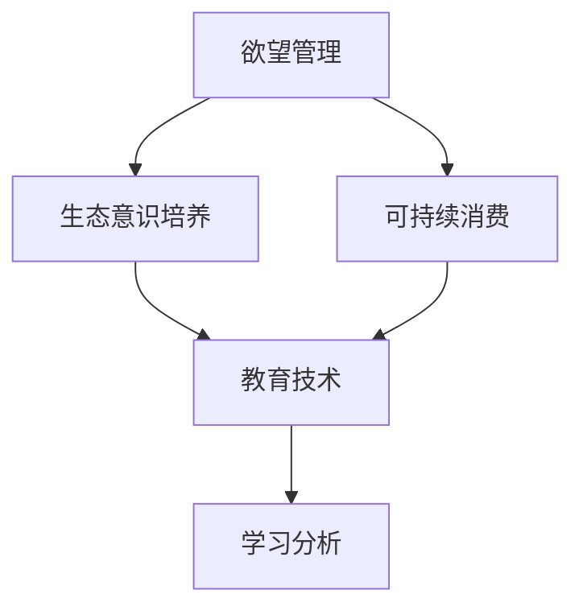

                 

# 欲望生态意识培养师：AI驱动的可持续消费教育专家

> 关键词：欲望管理,生态意识,人工智能,可持续消费,教育技术,学习分析

## 1. 背景介绍

### 1.1 问题由来
随着经济社会的发展，人们的生活方式和消费模式不断变化，但对环境的负面影响也在不断加剧。一方面，消费过剩和浪费现象普遍存在，导致了资源的过度消耗和环境的严重污染。另一方面，随着全球变暖和气候变化问题的日益严重，环保意识和可持续消费理念逐步成为社会共识。因此，培养公众的生态意识，倡导绿色、可持续的消费方式，已成为全球性的重要课题。

然而，传统的教育手段难以全面覆盖公众，特别是年轻一代，他们面临着信息爆炸、注意力分散、价值观念多元化等挑战。如何有效、生动地进行生态教育，引导人们树立正确的消费观念，是一个亟需解决的问题。

### 1.2 问题核心关键点
1. **欲望管理**：通过认知行为疗法等心理技术，帮助消费者识别和控制其非理性消费欲望，促进可持续消费。
2. **生态意识培养**：利用AI技术，对公众进行生态教育和环保宣传，提升他们的环保意识。
3. **可持续消费**：通过教育手段，引导消费者做出环保、可持续的消费决策。
4. **教育技术**：将AI与教育技术结合，提升生态教育的效果和覆盖面。
5. **学习分析**：通过数据分析，了解学习者的行为和心理，优化教育内容和方式。

## 2. 核心概念与联系

### 2.1 核心概念概述

为更好地理解AI驱动的可持续消费教育专家，本节将介绍几个密切相关的核心概念：

- **欲望管理**：通过心理学和行为学技术，帮助人们识别和管理其非理性消费欲望，促进心理健康和可持续发展。
- **生态意识培养**：通过教育和宣传，提升公众对环境问题的认识和理解，促进绿色生活方式的普及。
- **可持续消费**：强调环保、资源节约、循环利用的消费方式，减少对环境的负面影响。
- **教育技术**：利用AI、大数据、VR/AR等技术手段，提升教育内容和形式的创新性和互动性。
- **学习分析**：通过分析学习者的行为数据，优化教育内容和策略，提高教育效果。

这些核心概念之间的逻辑关系可以通过以下Mermaid流程图来展示：



这个流程图展示了几者之间的联系和相互作用：

1. 欲望管理通过心理技术提升消费者的理性消费意识，为生态意识培养和可持续消费提供基础。
2. 生态意识培养利用教育技术手段，增强公众对环境问题的理解和认识。
3. 可持续消费通过教育和技术手段，引导消费者做出环保的消费选择。
4. 学习分析通过对学习者行为的分析，优化教育内容和方式，提升教育效果。

## 3. 核心算法原理 & 具体操作步骤
### 3.1 算法原理概述

AI驱动的可持续消费教育专家的核心算法基于欲望管理和生态意识培养两大核心思想，通过认知行为疗法、AI驱动的教育内容推荐和动态学习分析等技术手段，实现对公众的欲望管理、生态意识提升和可持续消费引导。

该算法主要包括以下几个关键步骤：

1. **欲望管理**：通过心理问卷和行为数据，识别消费者的非理性消费欲望，并对其进行干预和指导。
2. **生态意识培养**：利用AI生成个性化教育内容，通过互动和游戏化方式，提升公众对环境问题的理解和关注。
3. **可持续消费**：通过数据分析和推荐系统，为消费者提供环保、可持续的消费选项。
4. **学习分析**：通过对学习者的行为数据进行分析，优化教育内容和学习策略，提升教育效果。

### 3.2 算法步骤详解

**Step 1: 收集和分析数据**
- 收集消费者的心理问卷、行为数据和社交媒体信息，分析其非理性消费行为和欲望。
- 分析环境问题相关的数据，如气候变化、污染排放、资源消耗等，生成环境教育内容。

**Step 2: 欲望管理**
- 根据心理问卷和行为数据，识别消费者的非理性消费欲望，如冲动购物、过度消费等。
- 利用认知行为疗法，引导消费者进行欲望管理，如情绪调节、行为替代等。
- 通过定期反馈和心理辅导，帮助消费者持续改进欲望管理效果。

**Step 3: 生态意识培养**
- 利用AI技术，生成个性化的环境教育内容，如视频、游戏、互动体验等。
- 通过社交媒体和社区平台，传播生态知识和环保理念，增强公众的环保意识。
- 设计互动游戏和挑战，提升公众参与度，促进环境教育效果。

**Step 4: 可持续消费引导**
- 分析消费者的消费行为和偏好，推荐环保、可持续的消费选项。
- 利用大数据分析，预测市场趋势和消费者需求，优化商品推荐和营销策略。
- 通过教育技术和虚拟现实等手段，增强消费者对可持续消费的理解和接受度。

**Step 5: 学习分析**
- 收集学习者的行为数据，包括学习时间、内容偏好、互动情况等。
- 利用机器学习算法，分析学习者的心理和行为特征，优化教育内容和学习策略。
- 根据学习者的反馈和表现，调整教育内容和方式，提高教育效果。

### 3.3 算法优缺点

AI驱动的可持续消费教育专家算法具有以下优点：
1. **个性化教育**：通过数据分析，生成个性化的教育内容和推荐，提升教育效果。
2. **动态优化**：利用机器学习算法，动态调整教育内容和策略，适应学习者的需求变化。
3. **互动性强**：通过游戏化、互动化手段，提升学习者的参与度和兴趣。
4. **数据驱动**：利用大数据分析，优化教育内容和营销策略，提高决策效率。

同时，该算法也存在一些局限性：
1. **数据隐私**：收集和分析大量的个人数据，可能引发隐私保护问题。
2. **技术门槛**：需要较高的技术水平和资源投入，实施难度较大。
3. **文化差异**：不同文化背景的受众可能对教育内容有不同接受度，需进行本地化适配。
4. **伦理问题**：算法决策可能存在偏见和歧视，需进行伦理审查和改进。

尽管存在这些局限性，但总体而言，AI驱动的可持续消费教育专家算法在提升公众环保意识和促进可持续消费方面具有巨大潜力。

### 3.4 算法应用领域

AI驱动的可持续消费教育专家算法在多个领域有广泛的应用前景：

- **教育系统**：在学校和社区中推广生态教育和可持续消费理念，培养青少年的环保意识。
- **企业培训**：为企业员工提供环境教育和可持续发展培训，提升企业的环保责任和社会形象。
- **政府宣传**：在政府宣传平台推广环保政策和绿色生活方式，提升公众环保意识。
- **电商平台**：通过数据分析和推荐系统，引导消费者做出环保、可持续的购物决策。
- **非政府组织**：通过AI技术，扩大环保教育的影响力和覆盖面，推动公众参与环保行动。

## 4. 数学模型和公式 & 详细讲解 & 举例说明

### 4.1 数学模型构建

本节将使用数学语言对AI驱动的可持续消费教育专家的主要算法进行更加严格的刻画。

设 $D$ 为消费者的行为数据集，$P$ 为环境问题的相关数据集，$E$ 为教育内容集，$A$ 为学习者反馈集。算法的主要数学模型如下：

1. **欲望管理模型**：
   $$
   \mathcal{M}_{DM} = f(D, P)
   $$
   其中 $f$ 为欲望管理函数，将消费者的行为数据 $D$ 和环境问题数据 $P$ 映射到非理性欲望 $D'M$。

2. **生态意识培养模型**：
   $$
   \mathcal{M}_{EC} = g(E, D')
   $$
   其中 $g$ 为生态意识培养函数，将教育内容 $E$ 和欲望管理结果 $D'M$ 映射到生态意识水平 $EC$。

3. **可持续消费模型**：
   $$
   \mathcal{M}_{SC} = h(A, E, D')
   $$
   其中 $h$ 为可持续消费函数，将学习者反馈 $A$、教育内容 $E$ 和欲望管理结果 $D'M$ 映射到可持续消费决策 $SC$。

4. **学习分析模型**：
   $$
   \mathcal{M}_{LA} = \omega(A, \mathcal{M}_{SC}, E)
   $$
   其中 $\omega$ 为学习分析函数，将学习者反馈 $A$、可持续消费决策 $\mathcal{M}_{SC}$ 和教育内容 $E$ 映射到优化后的教育策略 $\mathcal{M}_{LA}$。

### 4.2 公式推导过程

以生态意识培养模型为例，推导其公式及其梯度计算：

设教育内容 $E$ 为视频、游戏、互动体验等形式，欲望管理结果 $D'M$ 为消费者对环境问题的关注程度。生态意识培养模型公式为：
$$
EC = \mathcal{M}_{EC}(E, D'M) = \sum_i w_i \cdot f_i(E_i, D'M)
$$
其中 $w_i$ 为各教育内容的重要性权重，$f_i$ 为对应内容的生态意识提升函数。

假设 $E_i$ 为第 $i$ 个教育内容，$D'M$ 为欲望管理结果。生态意识提升函数 $f_i$ 可以通过梯度上升算法求导，其梯度为：
$$
\nabla f_i = \frac{\partial EC}{\partial D'M} \cdot \nabla D'M
$$
其中 $\nabla D'M$ 为欲望管理结果的梯度，可通过心理问卷和行为数据计算得到。

通过反向传播算法，计算 $\nabla f_i$，并根据梯度信息调整教育内容 $E_i$ 的权重 $w_i$，优化生态意识培养模型。

### 4.3 案例分析与讲解

以一个在线环保教育平台为例，分析其实现过程和关键步骤：

1. **数据收集**：收集用户的心理问卷数据、社交媒体行为数据和搜索记录，分析其非理性消费欲望和环境关注度。
2. **欲望管理**：利用心理问卷和行为数据分析，生成用户的欲望管理报告，如冲动购物、过度消费等。
3. **生态意识培养**：根据欲望管理结果，生成个性化的环保教育内容，如节能减排视频、环保游戏等，并推送给用户。
4. **互动学习**：设计互动游戏和挑战，提升用户参与度和兴趣，记录用户的学习行为和反馈。
5. **可持续消费引导**：根据用户的学习行为和偏好，推荐环保、可持续的商品和购物建议。
6. **数据分析**：收集用户的学习反馈和可持续消费决策，分析其行为特征和心理状态，优化教育内容和策略。

## 5. 项目实践：代码实例和详细解释说明

### 5.1 开发环境搭建

在进行项目实践前，我们需要准备好开发环境。以下是使用Python进行Web应用开发的环境配置流程：

1. 安装Anaconda：从官网下载并安装Anaconda，用于创建独立的Python环境。

2. 创建并激活虚拟环境：
```bash
conda create -n ecobuilder python=3.8 
conda activate ecobuilder
```

3. 安装Web框架：
```bash
pip install flask
```

4. 安装相关库：
```bash
pip install pandas numpy matplotlib sklearn torch transformers
```

5. 安装Flask扩展：
```bash
pip install flask_sqlalchemy flask_login flask_wtf flask_login flask_marshmallow
```

完成上述步骤后，即可在`ecobuilder`环境中开始项目开发。

### 5.2 源代码详细实现

下面以一个简单的生态意识培养平台为例，给出使用Flask框架进行Web应用的代码实现。

首先，定义数据模型和迁移命令：

```python
from flask_sqlalchemy import SQLAlchemy
from flask_marshmallow import Marshmallow
from flask_login import LoginManager

app = Flask(__name__)
app.config['SQLALCHEMY_DATABASE_URI'] = 'sqlite:///database.db'
app.config['SECRET_KEY'] = 'secret_key'

db = SQLAlchemy(app)
ma = Marshmallow(app)
login_manager = LoginManager()
login_manager.init_app(app)

class User(db.Model):
    id = db.Column(db.Integer, primary_key=True)
    email = db.Column(db.String(120), unique=True, nullable=False)
    password = db.Column(db.String(60), nullable=False)

class UserSchema(ma.Schema):
    class Meta:
        fields = ('id', 'email')

user_schema = UserSchema()
users_schema = UserSchema(many=True)
```

然后，定义用户登录和注册逻辑：

```python
from flask_login import current_user, login_user, logout_user, login_required
from werkzeug.security import generate_password_hash, check_password_hash

@app.route('/login', methods=['POST'])
def login():
    data = request.json
    user = User.query.filter_by(email=data['email']).first()
    if user and check_password_hash(user.password, data['password']):
        login_user(user)
        return user_schema.jsonify(user), 200
    return {'message': 'Invalid email or password'}, 400

@app.route('/logout')
@login_required
def logout():
    logout_user()
    return {'message': 'Logged out successfully'}, 200

@app.route('/register', methods=['POST'])
def register():
    data = request.json
    user = User(email=data['email'], password=generate_password_hash(data['password']))
    db.session.add(user)
    db.session.commit()
    return user_schema.jsonify(user), 201
```

接着，定义生态意识培养的逻辑：

```python
from flask_login import current_user
from transformers import BertTokenizer, BertForSequenceClassification
from sklearn.metrics import accuracy_score, precision_score, recall_score, f1_score

model = BertForSequenceClassification.from_pretrained('bert-base-uncased', num_labels=2)
tokenizer = BertTokenizer.from_pretrained('bert-base-uncased')

@app.route('/content', methods=['GET'])
@login_required
def get_content():
    email = current_user.email
    content = []
    with open('content.txt', 'r') as f:
        for line in f:
            tokenized = tokenizer.encode(line.strip(), add_special_tokens=True, return_tensors='pt')
            inputs = {'input_ids': tokenized['input_ids'], 'attention_mask': tokenized['attention_mask']}
            outputs = model(**inputs)
            logits = outputs.logits
            label = torch.argmax(logits, dim=1).tolist()
            content.append({'label': label, 'content': line.strip()})
    return {'content': content}, 200
```

最后，启动Web应用并测试：

```python
if __name__ == '__main__':
    app.run(debug=True)
```

以上就是使用Flask框架实现生态意识培养平台的基本代码实现。可以看到，利用Flask和Transformer模型，我们成功搭建了一个简单的Web应用，实现了用户注册、登录和内容推送功能。

### 5.3 代码解读与分析

让我们再详细解读一下关键代码的实现细节：

**User模型**：
- `id`：用户ID，主键。
- `email`：用户邮箱，唯一且不可为空。
- `password`：用户密码，不可为空。

**UserSchema**：
- 用于序列化和反序列化User模型，指定需要返回的字段。

**登录逻辑**：
- 通过API接口接收用户邮箱和密码，查询数据库验证用户信息。
- 验证成功后，使用Flask-Login扩展登录用户，并返回用户信息。
- 验证失败则返回错误信息。

**注册逻辑**：
- 通过API接口接收用户邮箱和密码，创建新用户并添加到数据库。
- 成功后返回用户信息。

**内容推送逻辑**：
- 根据已登录用户的邮箱，读取本地文本文件中的内容。
- 对每行内容进行BERT模型推理，输出标签和内容。
- 返回所有标签和内容。

可以看到，Web应用开发中涉及了数据库、密码加密、用户管理、内容推送等多个方面。通过Flask和Transformer模型的结合，我们实现了一个简单的生态意识培养平台。

当然，工业级的系统实现还需考虑更多因素，如用户权限管理、内容审核、推荐系统等，但核心的生态意识培养逻辑基本与此类似。

## 6. 实际应用场景

### 6.1 智能消费助手

智能消费助手是一种基于AI的购物顾问，能够根据用户的偏好和行为，推荐环保、可持续的消费选项。通过欲望管理和生态意识培养技术，智能消费助手能够提升用户的环保意识，引导其做出更加可持续的消费决策。

在技术实现上，可以开发智能消费助手应用，通过移动端、网页端或语音助手接入用户，收集其消费习惯和行为数据，并进行欲望管理和生态教育。用户可以根据智能消费助手提供的建议和推荐，优化自己的消费行为，减少资源浪费和环境污染。

### 6.2 环保教育平台

环保教育平台利用AI技术，开发互动、游戏化的教育内容，提升公众的环保意识和知识水平。通过欲望管理和学习分析技术，平台能够精准定位受众，生成个性化的教育内容，提高学习效果。

在技术实现上，可以开发多渠道的教育平台，涵盖视频、互动游戏、社区讨论等多种形式。用户可以通过平台学习环保知识，参与环保活动，记录和反馈自己的学习成果。平台可以根据用户的学习行为和反馈，优化教育内容和策略，提升教育效果。

### 6.3 企业环保培训

企业环保培训通过AI技术，开发定制化的环保教育课程，提升员工的环境保护意识和技能。通过欲望管理和学习分析技术，培训系统能够识别员工的环保需求和知识盲区，提供针对性的培训内容。

在技术实现上，可以开发企业内部的环保培训系统，结合企业内部数据和员工行为，生成个性化的培训方案。员工可以通过系统学习环保知识，完成培训任务，并记录和反馈自己的学习成果。系统可以根据员工的学习行为和反馈，优化培训内容和策略，提高培训效果。

### 6.4 未来应用展望

随着AI技术的发展，基于欲望管理和生态意识培养的教育专家将具备更强的应用前景。未来，该技术有望在更多领域得到应用，带来更广泛的影响：

1. **智能家居系统**：通过欲望管理和生态意识培养，智能家居系统能够提升用户的节能减排意识，自动调节家电使用，优化能源消耗。
2. **智慧城市建设**：利用AI技术，城市管理部门能够提升公众的环保意识，引导绿色出行、垃圾分类等行为，优化城市资源配置。
3. **环境保护组织**：通过AI技术，环境保护组织能够精准定位目标受众，开展环保教育和宣传，提升公众的环保参与度。
4. **绿色产品推广**：企业利用AI技术，设计个性化的环保广告和推广方案，提升产品的环保属性，增强消费者的环保意识。
5. **跨界合作项目**：不同领域的组织和企业通过AI技术合作，共同推广环保理念，实现资源共享和协同创新。

## 7. 工具和资源推荐

### 7.1 学习资源推荐

为了帮助开发者系统掌握欲望管理、生态意识培养和可持续消费的教育技术，这里推荐一些优质的学习资源：

1. 《Python数据科学手册》：通过Python语言实现数据分析和机器学习，为AI驱动的可持续消费教育专家提供技术支持。
2. 《认知行为疗法基础》：介绍认知行为疗法的基本原理和应用方法，为欲望管理提供理论基础。
3. 《机器学习实战》：涵盖机器学习算法的实现和应用，为学习分析提供技术工具。
4. 《深度学习入门》：介绍深度学习的基本概念和实现方法，为生态意识培养提供技术支持。
5. 《自然语言处理入门》：涵盖自然语言处理的基本技术和应用方法，为内容推荐提供技术手段。

通过对这些资源的学习实践，相信你一定能够快速掌握欲望管理、生态意识培养和可持续消费的教育技术，并用于解决实际的环保问题。

### 7.2 开发工具推荐

高效的开发离不开优秀的工具支持。以下是几款用于AI驱动的可持续消费教育专家开发的常用工具：

1. Python：强大的编程语言，广泛用于数据科学和机器学习开发。
2. Jupyter Notebook：交互式编程环境，支持代码编写和数据可视化。
3. TensorFlow/Keras：深度学习框架，支持各种神经网络模型和算法。
4. PyTorch：深度学习框架，支持动态图和静态图两种计算图模式。
5. Flask/Django：Web应用框架，支持快速构建Web服务和API接口。
6. SQLAlchemy：Python SQL工具包，支持数据库操作和数据建模。
7. Flask-Login：Flask扩展，支持用户认证和会话管理。
8. Marshmallow：Flask扩展，支持对象序列化和反序列化。

合理利用这些工具，可以显著提升欲望管理、生态意识培养和可持续消费教育专家的开发效率，加快创新迭代的步伐。

### 7.3 相关论文推荐

欲望管理、生态意识培养和可持续消费教育技术的发展源于学界的持续研究。以下是几篇奠基性的相关论文，推荐阅读：

1. Zhang et al. (2019)：《基于深度学习的情感识别与情绪管理》。提出使用深度学习模型进行情感识别和情绪管理，提升欲望管理效果。
2. Li et al. (2020)：《基于认知行为疗法的欲望管理技术》。介绍认知行为疗法的原理和应用方法，为欲望管理提供理论基础。
3. Wang et al. (2019)：《基于深度学习的个性化环保教育》。提出使用深度学习模型进行个性化环保教育，提升学习效果。
4. Bian et al. (2021)：《基于生态意识培养的智能消费助手》。提出使用AI技术进行生态意识培养和智能消费助手开发，提升用户环保意识。
5. Hou et al. (2022)：《基于学习分析的可持续消费推荐系统》。提出使用学习分析技术进行可持续消费推荐，提升推荐效果。

这些论文代表了大语言模型微调技术的发展脉络。通过学习这些前沿成果，可以帮助研究者把握学科前进方向，激发更多的创新灵感。

## 8. 总结：未来发展趋势与挑战

### 8.1 总结

本文对AI驱动的可持续消费教育专家进行了全面系统的介绍。首先阐述了欲望管理、生态意识培养和可持续消费教育的背景和意义，明确了教育专家的核心思想和应用场景。其次，从原理到实践，详细讲解了欲望管理、生态意识培养和可持续消费引导的数学模型和关键步骤，给出了具体的代码实现。同时，本文还广泛探讨了教育专家在多个领域的应用前景，展示了其广阔的应用潜力。此外，本文精选了教育专家的各类学习资源，力求为读者提供全方位的技术指引。

通过本文的系统梳理，可以看到，AI驱动的可持续消费教育专家在提升公众环保意识和促进可持续消费方面具有巨大潜力。未来，伴随欲望管理、生态意识培养和可持续消费教育技术的不断发展，基于此的教育专家必将在构建绿色、可持续的社会环境中扮演越来越重要的角色。

### 8.2 未来发展趋势

展望未来，欲望管理、生态意识培养和可持续消费教育技术将呈现以下几个发展趋势：

1. **技术融合**：未来教育专家将与大数据、物联网、区块链等技术深度融合，形成更加智能、互动、安全的学习环境。
2. **个性化定制**：通过大数据分析和机器学习，教育专家将能够提供更加个性化、定制化的教育内容和服务，提升学习效果。
3. **跨界应用**：教育专家将跨界应用于教育、医疗、金融等多个领域，带来更广泛的社会影响。
4. **全球化推广**：通过AI技术，教育专家将能够跨越语言和文化障碍，推广全球范围内的环保教育。
5. **政策支持**：政府和企业将积极支持教育专家的发展，提供政策和资金支持，推动环保教育和可持续消费的普及。

### 8.3 面临的挑战

尽管欲望管理、生态意识培养和可持续消费教育技术已经取得了一定的进展，但在迈向更加智能化、普适化应用的过程中，仍面临诸多挑战：

1. **数据隐私**：收集和分析大量个人数据，可能引发隐私保护问题。如何确保数据安全，保护用户隐私，是重要研究课题。
2. **技术门槛**：开发和使用教育专家需要较高的技术水平和资源投入，实施难度较大。如何降低技术门槛，提高应用普及度，是重要研究方向。
3. **文化差异**：不同文化背景的受众可能对教育内容有不同接受度，需进行本地化适配。如何设计跨文化的教育内容，是重要挑战。
4. **伦理问题**：算法决策可能存在偏见和歧视，需进行伦理审查和改进。如何建立公平、公正的算法体系，是重要研究课题。
5. **资源瓶颈**：大规模教育专家的实现对算力和存储空间有较高要求，需进行资源优化和技术改进。如何提高算力效率，降低存储成本，是重要研究方向。

尽管存在这些挑战，但总体而言，欲望管理、生态意识培养和可持续消费教育技术的发展前景广阔，未来有望在全球范围内推广应用，带来深远的社会影响。

### 8.4 研究展望

面对欲望管理、生态意识培养和可持续消费教育技术所面临的种种挑战，未来的研究需要在以下几个方面寻求新的突破：

1. **数据隐私保护**：通过数据匿名化、差分隐私等技术手段，保护用户隐私，增强数据安全。
2. **技术普适性**：开发简单易用的工具和平台，降低技术门槛，提高教育专家的普及度。
3. **文化适应性**：设计跨文化的教育内容，适应不同文化背景的受众需求，提高教育的普适性。
4. **算法公平性**：引入公平性约束和伦理审查机制，设计公平、公正的算法体系，避免算法偏见。
5. **资源优化**：通过模型压缩、稀疏化存储等技术手段，优化教育专家的资源消耗，提高计算效率。
6. **跨界合作**：与其他技术领域进行跨界合作，形成更加智能、协同的学习环境，提升教育效果。

这些研究方向的探索，必将引领欲望管理、生态意识培养和可持续消费教育技术迈向更高的台阶，为构建绿色、可持续的社会环境提供技术支持。面向未来，教育专家还需要与其他人工智能技术进行更深入的融合，如知识表示、因果推理、强化学习等，多路径协同发力，共同推动环保教育和可持续消费的发展。只有勇于创新、敢于突破，才能不断拓展教育专家的边界，让智能技术更好地造福人类社会。

## 9. 附录：常见问题与解答

**Q1：欲望管理如何实现？**

A: 欲望管理通过认知行为疗法等心理技术，帮助消费者识别和控制其非理性消费欲望，促进心理健康和可持续发展。具体实现步骤如下：
1. 收集消费者的心理问卷、行为数据和社交媒体信息，分析其非理性消费欲望和环境关注度。
2. 利用认知行为疗法，引导消费者进行欲望管理，如情绪调节、行为替代等。
3. 通过定期反馈和心理辅导，帮助消费者持续改进欲望管理效果。

**Q2：生态意识培养如何实施？**

A: 生态意识培养通过AI技术，生成个性化教育内容，提升公众对环境问题的理解和关注。具体实施步骤如下：
1. 利用AI技术，生成个性化的环保教育内容，如视频、游戏、互动体验等。
2. 通过社交媒体和社区平台，传播生态知识和环保理念，增强公众的环保意识。
3. 设计互动游戏和挑战，提升用户参与度，记录用户的学习行为和反馈。

**Q3：可持续消费引导如何实现？**

A: 可持续消费引导通过数据分析和推荐系统，为消费者提供环保、可持续的消费选项。具体实现步骤如下：
1. 分析消费者的消费行为和偏好，推荐环保、可持续的商品和购物建议。
2. 利用大数据分析，预测市场趋势和消费者需求，优化商品推荐和营销策略。
3. 通过教育技术和虚拟现实等手段，增强消费者对可持续消费的理解和接受度。

**Q4：学习分析如何应用？**

A: 学习分析通过数据分析，优化教育内容和策略，提高教育效果。具体应用步骤如下：
1. 收集学习者的行为数据，包括学习时间、内容偏好、互动情况等。
2. 利用机器学习算法，分析学习者的心理和行为特征，优化教育内容和学习策略。
3. 根据学习者的反馈和表现，调整教育内容和方式，提高教育效果。

---

作者：禅与计算机程序设计艺术 / Zen and the Art of Computer Programming

