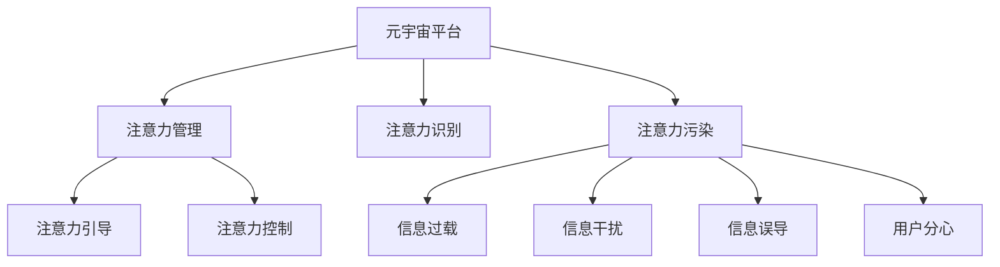

                 

# 注意力污染：元宇宙时代的新型环境问题

## 1. 背景介绍

### 1.1 问题由来

元宇宙时代正快速到来，数以亿计的现实用户将深度浸入虚拟世界中，构造出一个高度融合现实与虚拟的新型社会空间。在这个虚拟世界里，人们可以实时交互、创造，如同现实世界中的社交、工作、娱乐活动。然而，与此同时，也带来了一系列全新的挑战，其中，注意力污染(Attention Pollution)现象已成为元宇宙时代的一大环境问题。

### 1.2 问题核心关键点

注意力污染主要是指用户在使用元宇宙平台时，所受到的不必要或冗余的注意力分散、过度信息干扰、误导性内容影响等问题。这些问题不仅导致用户效率下降、体验恶化，甚至可能引发心理健康问题，影响整体社会的和谐与稳定。

为了有效应对和解决这一新型环境问题，本文将深入探讨注意力污染的产生机制、表现形式及应对策略。通过系统性地分析，旨在为元宇宙平台的设计、运营及用户行为引导提供有价值的指导和参考。

## 2. 核心概念与联系

### 2.1 核心概念概述

在探讨注意力污染之前，我们需要先了解几个核心概念：

- **元宇宙 (Metaverse)**：由分布式虚拟世界和实时互动网络所构成的三维数字化空间，是当前互联网和现实世界的融合和延伸。
- **注意力 (Attention)**：用户在使用元宇宙平台时所分配给不同内容或活动上的关注度或精神投入。
- **注意力污染 (Attention Pollution)**：指用户在元宇宙平台上受到的信息过载、干扰或误导性内容，对正常注意力资源的侵占和损害。
- **注意力管理 (Attention Management)**：通过系统设计或用户教育等手段，对用户注意力进行管理和优化，以提升元宇宙平台的整体体验和用户满意度。
- **注意力识别与控制 (Attention Recognition and Control)**：识别用户的注意力状态，并采取相应措施对其进行引导和控制。

### 2.2 核心概念原理和架构的 Mermaid 流程图



## 3. 核心算法原理 & 具体操作步骤

### 3.1 算法原理概述

注意力污染的应对需要结合元宇宙平台的设计和用户的注意力管理。基于认知行为学、人机交互和数据科学，通过以下算法原理进行分析和干预：

1. **注意力模型 (Attention Model)**：建立用户注意力行为模式，识别用户在不同场景下的注意力分配和变化规律。
2. **信息过滤与推荐 (Information Filtering and Recommendation)**：基于用户的注意力模型，对元宇宙平台上的信息进行筛选和推荐，避免用户注意力被不必要或误导性信息所干扰。
3. **注意力反馈与调整 (Attention Feedback and Adjustment)**：通过用户的注意力反馈，动态调整信息内容和交互设计，提升用户注意力资源的利用效率。

### 3.2 算法步骤详解

以下将详细阐述注意力污染的识别、控制和优化步骤：

**Step 1: 注意力模型建立与监测**

- 收集用户的使用行为数据，如点击、浏览、停留时间等，建立用户的注意力行为模型。
- 使用机器学习算法对用户行为数据进行建模和分析，识别出不同场景下的注意力特征。
- 部署注意力监测系统，实时监测用户的注意力状态，并提供可视化反馈。

**Step 2: 信息过滤与推荐**

- 根据用户的注意力模型，分析元宇宙平台上的信息内容和呈现形式，识别出可能引起注意力分散或干扰的内容。
- 引入信息过滤技术，如基于内容的过滤、基于规则的过滤等，筛除或降权这些内容。
- 设计个性化推荐算法，将用户感兴趣的信息优先推荐，减少信息干扰。

**Step 3: 注意力反馈与调整**

- 设计用户反馈机制，收集用户对信息内容和交互设计的满意度反馈。
- 利用反馈数据进行模型调整，优化信息内容和交互设计，提升用户体验。
- 持续迭代优化，动态调整注意力管理策略，适应不同用户和场景需求。

### 3.3 算法优缺点

**优点：**
1. **提升用户体验**：通过有效过滤和管理信息，减少注意力分散，提升用户的整体体验和满意度。
2. **减少信息过载**：利用个性化推荐，将重要信息推送给用户，降低信息过载风险。
3. **提升注意力效率**：通过用户反馈和调整，优化信息呈现方式，提升用户注意力资源的使用效率。

**缺点：**
1. **算法复杂性高**：需要建立复杂的用户注意力模型，并实时监测和调整，实现难度较大。
2. **用户隐私问题**：在数据收集和分析过程中，可能涉及用户隐私问题，需要谨慎处理。
3. **过度干预风险**：过度控制可能导致用户体验降低，需要找到平衡点。

### 3.4 算法应用领域

注意力污染的应对策略不仅适用于元宇宙平台，在各种数字化平台上都有广泛应用。例如：

- **社交媒体**：通过信息过滤和个性化推荐，提升用户关注度和平台黏性。
- **电商平台**：通过优化搜索结果和商品推荐，提高用户购买决策效率和满意度。
- **新闻和信息聚合应用**：通过内容筛选和用户画像，提升信息内容的可读性和吸引力。
- **在线教育平台**：通过注意力管理，提高学习内容的专注度和互动性。

## 4. 数学模型和公式 & 详细讲解

### 4.1 数学模型构建

我们可以用数学模型来表示用户的注意力分配和行为。假设用户的注意力状态可以用向量 $a=(a_1, a_2, ..., a_n)$ 表示，其中 $a_i$ 表示用户对第 $i$ 个内容的关注度。用户在不同内容间的注意力转移可以表示为：

$$
a_{i+1} = f(a_i, r_{i+1})
$$

其中 $r_{i+1}$ 表示第 $i+1$ 个内容的吸引力，$f$ 表示注意力转移函数。

### 4.2 公式推导过程

对于一个具体的元宇宙平台，用户在不同场景（如社交、工作、娱乐）中的注意力转移可以表示为：

$$
a_{t+1} = \alpha a_t + \beta r_t
$$

其中 $t$ 表示时间步长，$\alpha$ 和 $\beta$ 为调节参数，分别表示注意力转移的比例和内容吸引力对注意力的影响。

通过上述模型，我们可以对用户在不同场景下的注意力变化进行预测和分析，进而指导信息的呈现和推荐。

### 4.3 案例分析与讲解

假设用户在工作场景中，对电子邮件的关注度为 $a_e$，对即时通讯的关注度为 $a_m$。根据注意力模型，我们可以建立如下关系：

$$
a_e(t+1) = \alpha a_e(t) + \beta r_e(t)
$$
$$
a_m(t+1) = \alpha a_m(t) + \beta r_m(t)
$$

其中 $r_e(t)$ 和 $r_m(t)$ 分别表示电子邮件和即时通讯在时刻 $t$ 的吸引力。我们可以利用上述模型，实时监测和预测用户的注意力变化，调整不同内容的呈现策略。

## 5. 项目实践：代码实例和详细解释说明

### 5.1 开发环境搭建

以下是在Python环境下搭建注意力污染监测与控制的开发环境：

1. 安装必要的Python库，如numpy、pandas、scikit-learn、matplotlib等。
2. 配置数据收集和存储系统，如使用MySQL或MongoDB存储用户行为数据。
3. 部署注意力监测系统，如使用Apache Kafka或Apache Flink进行实时数据流处理。
4. 搭建信息过滤和推荐系统，如使用Elasticsearch进行全文搜索和推荐算法开发。

### 5.2 源代码详细实现

以下是一个简单的注意力模型建立与监测的代码实现：

```python
import numpy as np
from sklearn.linear_model import LinearRegression
from sklearn.metrics import mean_squared_error

# 假设用户在不同内容间的注意力转移模型
def attention_transfer(a, r):
    alpha = 0.8  # 注意力转移比例
    beta = 0.2   # 内容吸引力对注意力的影响
    a_next = alpha * a + beta * r
    return a_next

# 构建用户注意力模型
class AttentionModel:
    def __init__(self):
        self.a = np.zeros(10)  # 初始化用户对10个内容的关注度
        self.r = np.zeros(10)  # 初始化用户对10个内容的吸引力
        self.alpha = 0.8  # 注意力转移比例
        self.beta = 0.2   # 内容吸引力对注意力的影响

    def update_attention(self, t):
        # 根据当前时间和内容吸引力更新用户注意力
        a_next = self.attention_transfer(self.a, self.r)
        self.a = a_next

    def predict_attention(self, t):
        # 预测用户在时刻t的注意力状态
        a_next = self.attention_transfer(self.a, self.r)
        return a_next

# 模拟元宇宙平台的用户行为数据
class UserBehavior:
    def __init__(self):
        self.time = 0
        self.content = [1, 2, 3, 4, 5, 6, 7, 8, 9, 10]  # 用户关注的10个内容

    def set_content_attraction(self, content):
        self.r = np.random.rand(len(content))  # 随机生成内容的吸引力

    def update_user_attention(self, model):
        # 更新用户注意力
        model.update_attention(self.time)
        self.time += 1

# 测试代码
user = UserBehavior()
model = AttentionModel()
for i in range(20):
    user.set_content_attraction(user.content)
    user.update_user_attention(model)
    print(f"Time {i}: Attention {model.a}")
```

### 5.3 代码解读与分析

- `attention_transfer` 函数：根据注意力模型更新用户对不同内容的关注度。
- `AttentionModel` 类：实现用户注意力模型的建立和更新。
- `UserBehavior` 类：模拟元宇宙平台上的用户行为数据。
- 在测试代码中，每轮模拟用户在不同内容间的注意力转移，并输出当前用户对每个内容的关注度。

## 6. 实际应用场景

### 6.1 社交媒体

在社交媒体平台上，用户往往同时关注多个好友或内容，导致注意力分散。利用注意力污染监测系统，可以实时识别和过滤那些可能引起注意力干扰的内容，如广告、垃圾信息等。同时，根据用户的注意力模型，进行个性化推荐，提升用户体验和平台黏性。

### 6.2 电商平台

电商平台需要用户快速做出购买决策，信息过载会降低用户效率。通过构建用户注意力模型，分析用户在不同商品间的注意力转移，推荐用户最感兴趣的商品，减少信息干扰，提高购买转化率。

### 6.3 新闻和信息聚合应用

新闻和信息聚合应用旨在提供高质量的信息内容，但用户注意力容易被低质量或误导性信息干扰。利用注意力污染监测系统，过滤掉无关或误导性内容，提升信息内容的可读性和吸引力。

### 6.4 在线教育平台

在线教育平台需要用户长时间集中注意力学习，注意力分散会降低学习效果。通过实时监测和调整注意力状态，设计个性化学习路径和推荐内容，提升学习效率和体验。

## 7. 工具和资源推荐

### 7.1 学习资源推荐

1. **《认知心理学概论》**：了解人类注意力机制的基础理论。
2. **《人机交互工程学》**：掌握人机交互设计的方法和技术。
3. **《深度学习与自然语言处理》**：学习深度学习算法在注意力管理中的应用。
4. **《数据科学与机器学习》**：掌握数据收集、分析和建模的技能。
5. **《元宇宙技术与应用》**：了解元宇宙技术的前沿和发展趋势。

### 7.2 开发工具推荐

1. **TensorFlow**：强大的深度学习框架，支持分布式计算和模型训练。
2. **PyTorch**：灵活的深度学习框架，适合快速原型开发和实验。
3. **Kafka**：实时数据流处理系统，适合构建注意力监测系统。
4. **Elasticsearch**：全文搜索和推荐系统，适合信息过滤和个性化推荐。
5. **Flask**：轻量级Web框架，适合构建注意力管理系统的后端服务。

### 7.3 相关论文推荐

1. **Attention is All You Need**：Transformer论文，奠定了自注意力机制在深度学习中的应用基础。
2. **A Survey on Attention Mechanisms in Deep Learning**：综述文章，系统回顾了注意力机制的研究进展和应用。
3. **Filtering Spam in Social Media with Attention Mechanisms**：应用注意力机制过滤社交媒体垃圾信息。
4. **Personalized Recommendation Systems in E-commerce**：利用注意力模型进行电商推荐。
5. **Attention-Based Natural Language Processing**：利用注意力机制提高NLP任务的性能。

## 8. 总结：未来发展趋势与挑战

### 8.1 研究成果总结

本文从注意力污染的原理、监测和控制策略等多个角度，系统探讨了元宇宙时代新型环境问题的应对方法。通过深入分析注意力污染的产生机制和表现形式，提供了有价值的指导和参考。

### 8.2 未来发展趋势

1. **智能化水平提升**：随着AI技术的发展，注意力污染监测和控制将更加智能化，能够实现实时动态调整和优化。
2. **跨领域应用扩展**：注意力污染的应对策略将不仅限于元宇宙平台，在更多数字化平台上都有广泛应用前景。
3. **用户隐私保护加强**：在数据收集和分析过程中，将更加注重用户隐私保护，采用隐私保护技术，如差分隐私、联邦学习等。
4. **多模态融合增强**：结合视觉、听觉等多模态数据，提升注意力管理的准确性和全面性。
5. **个性化服务深化**：通过深度学习和大数据分析，提供更加个性化和定制化的服务体验。

### 8.3 面临的挑战

1. **技术难度高**：注意力污染的监测和控制需要构建复杂的数学模型和算法，实现难度较大。
2. **用户隐私保护**：在数据收集和分析过程中，如何保护用户隐私，防止数据泄露，是一个重要的挑战。
3. **技术标准缺失**：目前对注意力污染的监测和控制还没有统一的标准和规范，需要行业标准的制定和推广。
4. **算法复杂度提升**：随着用户需求的多样化和复杂化，算法需要不断优化和迭代，以适应新的应用场景。

### 8.4 研究展望

1. **多模态注意力管理**：结合视觉、听觉等多模态数据，提升注意力管理的准确性和全面性。
2. **个性化推荐算法**：利用深度学习和大数据分析，提供更加个性化和定制化的服务体验。
3. **用户隐私保护技术**：采用隐私保护技术，如差分隐私、联邦学习等，保护用户隐私。
4. **多领域应用推广**：将注意力污染的监测和控制策略推广到更多数字化平台上，实现跨领域应用。

## 9. 附录：常见问题与解答

### Q1: 注意力污染和信息过载有什么不同？

**A**：注意力污染和信息过载都是用户在使用数字平台时面临的问题，但两者有本质的区别。信息过载是指用户所接收的信息量超过了其处理能力，导致效率降低；而注意力污染则是指用户注意力资源被不必要或误导性内容所侵占，导致注意力分散和干扰。

### Q2: 注意力污染对用户体验有什么影响？

**A**：注意力污染会对用户体验产生多方面的负面影响，包括：
1. **降低工作效率**：注意力被干扰后，用户无法集中精力处理工作，导致工作效率下降。
2. **影响决策质量**：注意力分散时，用户可能做出错误决策，影响任务完成质量。
3. **引发心理压力**：频繁的信息干扰和注意力分散，会导致用户心理压力增加，影响心理健康。

### Q3: 如何设计有效的信息过滤机制？

**A**：设计有效的信息过滤机制需要考虑以下几点：
1. **内容质量评估**：构建内容质量评估模型，识别和过滤低质量或误导性内容。
2. **用户画像分析**：根据用户画像，过滤用户不感兴趣的内容，提升个性化体验。
3. **实时动态调整**：根据用户反馈和行为数据，实时动态调整信息过滤策略，提升过滤效果。

### Q4: 注意力污染有哪些具体的应对措施？

**A**：具体的注意力污染应对措施包括：
1. **内容筛选与推荐**：利用个性化推荐算法，将重要内容优先推荐，减少信息干扰。
2. **信息分类与过滤**：通过内容分类和筛选技术，过滤不必要的信息，提升用户体验。
3. **用户反馈机制**：设计用户反馈机制，收集用户对信息内容和交互设计的满意度反馈，动态调整策略。

### Q5: 注意力污染的研究难点有哪些？

**A**：注意力污染的研究难点包括：
1. **用户行为数据获取**：获取准确、全面的用户行为数据，建立可靠的注意力模型。
2. **模型复杂度**：构建复杂的多模态注意力模型，实现实时动态调整和优化。
3. **隐私保护**：在数据收集和分析过程中，如何保护用户隐私，防止数据泄露。
4. **算法优化**：针对不同应用场景，优化信息过滤和推荐算法，提升效果。

---

作者：禅与计算机程序设计艺术 / Zen and the Art of Computer Programming

