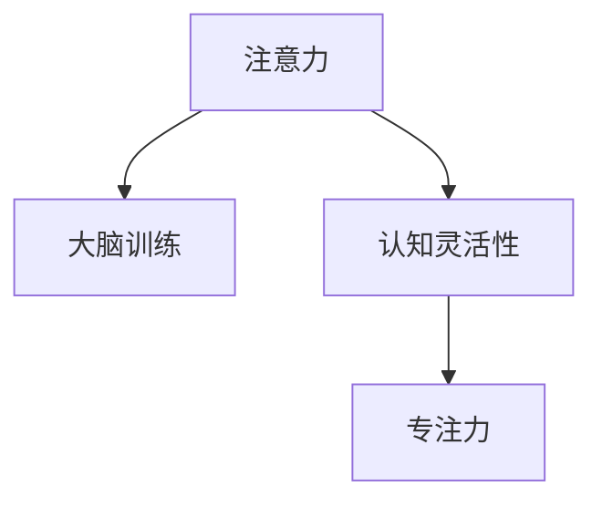

                 

## 1. 背景介绍

在快速变化的信息时代，注意力管理与大脑训练逐渐成为提升个人学习、工作效率和认知灵活性的重要途径。随着科技的进步，我们从纸质书页转向数字屏幕，从枯燥的办公环境转向多样的社交媒体平台，注意力分散、疲劳和记忆力下降等问题变得愈发突出。本文旨在探讨如何通过注意力管理与大脑训练，增强认知灵活性和专注力，助力个人和团队在复杂的信息环境中脱颖而出。

### 1.1 问题的由来

注意力分散是现代生活中普遍存在的问题。一方面，大量信息的涌入和数字设备的普及，使得注意力被不断分散，难以集中于单一任务；另一方面，长时间的高强度工作或学习，导致注意力疲劳，影响认知功能。这些问题不仅影响个人的工作效率和生活质量，还对企业的创新能力和竞争力产生负面影响。

### 1.2 问题核心关键点

1. **注意力管理**：通过科学的方法和工具，提升个体的注意力集中度和控制力，提高学习和工作的效率和质量。
2. **大脑训练**：通过持续的认知训练和游戏，增强大脑的记忆力、逻辑思维和问题解决能力，提升认知灵活性。
3. **认知灵活性**：指在面对复杂任务时，能够迅速适应和调整自己的思维策略和注意力分配，提高问题解决和决策效率。
4. **专注力**：指能够长时间专注于单一任务，不受外界干扰，维持高效率的认知状态。

## 2. 核心概念与联系

### 2.1 核心概念概述

为更好地理解注意力管理与大脑训练的实践，本节将介绍几个密切相关的核心概念：

- **注意力**：指个体对某一特定对象的关注程度，受环境、情绪、认知等多方面因素影响。
- **大脑训练**：通过特定的训练方法或游戏，持续刺激大脑各个区域，提升认知能力。
- **认知灵活性**：指个体在面对不同任务时，能够迅速切换注意力，适应新环境的能力。
- **专注力**：指个体长时间专注于某一任务的注意力状态。

这些核心概念之间的逻辑关系可以通过以下Mermaid流程图来展示：



这个流程图展示了几者之间的关系：

1. 注意力通过大脑训练得到提升。
2. 认知灵活性在注意力提升的基础上，能够更好地应对变化。
3. 专注力通过持续的认知训练和注意力管理得以维持。

## 3. 核心算法原理 & 具体操作步骤
### 3.1 算法原理概述

注意力管理与大脑训练的实践基于认知科学和神经科学的原理，通过科学的方法和工具，提升个体的注意力集中度和控制力，增强大脑的认知能力。主要包含以下几个关键步骤：

- **注意力管理**：通过时间管理、工作坊、工具应用等方法，提升个体对注意力的控制和调节能力。
- **大脑训练**：通过游戏化学习、认知训练工具等，持续刺激大脑的各个区域，提升记忆力、逻辑思维和问题解决能力。
- **认知灵活性**：通过切换任务、多任务处理等训练，增强个体在面对新任务时的适应能力和快速反应能力。
- **专注力**：通过冥想、专注力训练等方法，提升个体长时间专注于单一任务的能力。

### 3.2 算法步骤详解

注意力管理与大脑训练的具体操作流程如下：

**Step 1: 自我评估与目标设定**
- 通过问卷调查、心理测试等方法，评估个人的注意力水平、认知能力和专注力。
- 根据评估结果，设定合理的目标，如提高注意力集中度、提升记忆力、增强问题解决能力等。

**Step 2: 选择训练方法和工具**
- 根据目标选择合适的注意力管理工具，如番茄工作法、时间块管理工具等。
- 选择适合的大脑训练工具，如Lumosity、BrainHQ等，进行持续的认知训练。

**Step 3: 制定训练计划**
- 根据评估结果和目标，制定科学的训练计划，包括每日训练时间、训练任务和休息安排。
- 设定阶段性目标，如每月提升注意力集中度10%，季度进行一次全面评估。

**Step 4: 实施训练**
- 严格按照训练计划进行注意力管理和大脑训练，使用工具记录训练过程和效果。
- 定期进行自我评估，调整训练计划和目标，确保训练效果。

**Step 5: 反馈与优化**
- 收集训练过程中的反馈信息，包括工具使用体验、注意力状态变化等。
- 根据反馈信息优化训练计划，提高训练效果。

### 3.3 算法优缺点

注意力管理与大脑训练的实践具有以下优点：

1. **科学性和可操作性**：基于认知科学和神经科学的研究成果，通过科学方法和工具进行训练，效果显著。
2. **可量化性**：通过问卷、测试等手段，对注意力和认知能力进行量化评估，确保训练效果可追踪和对比。
3. **个性化**：根据个体差异设定个性化的训练计划，提高训练的针对性和效果。
4. **工具丰富**：市面上已有多款专业的注意力管理和大脑训练工具，便于使用和推广。

同时，该方法也存在一定的局限性：

1. **时间成本高**：需要投入大量时间和精力进行训练，对日常工作和生活的影响较大。
2. **效果因人而异**：不同个体对注意力管理的响应度不同，训练效果存在个体差异。
3. **依赖工具**：训练效果依赖于工具的科学性和用户的使用习惯，工具选择不当或使用不当，可能影响训练效果。

尽管存在这些局限性，但就目前而言，注意力管理与大脑训练的方法仍然是提升个体认知能力的重要途径。未来相关研究的重点在于如何进一步降低训练成本，提高训练效果的普适性和科学性，同时兼顾个性化需求和工具使用的便捷性。

### 3.4 算法应用领域

注意力管理与大脑训练的应用领域广泛，主要涵盖以下几个方面：

1. **教育领域**：通过训练提升学生的注意力和认知能力，提高学习效率和成绩。
2. **职场应用**：通过训练提高员工的注意力和专注力，提升工作效率和创新能力。
3. **心理健康**：通过训练帮助个体缓解注意力分散、焦虑等心理问题，提高心理健康水平。
4. **个人发展**：通过训练提升个人的认知灵活性和问题解决能力，助力职业发展和个人成长。
5. **游戏和娱乐**：通过训练提高游戏和娱乐活动中的注意力和反应能力，提升游戏和娱乐体验。

## 4. 数学模型和公式 & 详细讲解 & 举例说明

### 4.1 数学模型构建

为更好地理解注意力管理与大脑训练的实践，本节将使用数学语言对训练过程进行更加严格的刻画。

记个体的注意力水平为 $A$，认知能力为 $C$，专注力为 $F$。假设通过训练，个体的注意力水平、认知能力和专注力分别提高了 $\Delta A$、$\Delta C$ 和 $\Delta F$。则注意力管理与大脑训练的目标可以表示为：

$$
\begin{aligned}
\maximize \quad & A + C + F \\
subject \quad to \quad & \Delta A + \Delta C + \Delta F = 1
\end{aligned}
$$

即在资源有限的情况下，最大化个体注意力水平、认知能力和专注力的提升效果。

### 4.2 公式推导过程

假设个体的注意力水平 $A$、认知能力 $C$ 和专注力 $F$ 的提升效果分别为 $\Delta A$、$\Delta C$ 和 $\Delta F$，且每种提升效果需要的时间分别为 $T_A$、$T_C$ 和 $T_F$。则注意力管理与大脑训练的时间分配问题可以表示为：

$$
\begin{aligned}
\minimize \quad & T_A\Delta A + T_C\Delta C + T_F\Delta F \\
subject \quad to \quad & \Delta A + \Delta C + \Delta F = 1
\end{aligned}
$$

根据拉格朗日乘数法，引入拉格朗日乘子 $\lambda$，构造拉格朗日函数：

$$
\mathcal{L}(\Delta A, \Delta C, \Delta F, \lambda) = T_A\Delta A + T_C\Delta C + T_F\Delta F + \lambda (1 - (\Delta A + \Delta C + \Delta F))
$$

对上述拉格朗日函数求偏导数，并令其为0，可得：

$$
\begin{aligned}
\frac{\partial \mathcal{L}}{\partial \Delta A} &= T_A - \lambda = 0 \\
\frac{\partial \mathcal{L}}{\partial \Delta C} &= T_C - \lambda = 0 \\
\frac{\partial \mathcal{L}}{\partial \Delta F} &= T_F - \lambda = 0 \\
\frac{\partial \mathcal{L}}{\partial \lambda} &= 1 - (\Delta A + \Delta C + \Delta F) = 0
\end{aligned}
$$

解上述方程组，可得：

$$
\begin{aligned}
\Delta A &= \frac{T_A}{T_A + T_C + T_F} \\
\Delta C &= \frac{T_C}{T_A + T_C + T_F} \\
\Delta F &= \frac{T_F}{T_A + T_C + T_F}
\end{aligned}
$$

这意味着，个体在不同训练任务上的时间分配应该与其提升效果成正比，即需要更多时间的任务应该分配更多的资源。

### 4.3 案例分析与讲解

假设个体选择三项训练任务，分别需要 $T_A=2$ 小时、$T_C=3$ 小时和 $T_F=1$ 小时。则通过优化训练时间分配，可以使注意力水平、认知能力和专注力分别提升到：

$$
\begin{aligned}
\Delta A &= \frac{2}{2 + 3 + 1} = \frac{2}{6} = 0.3333 \\
\Delta C &= \frac{3}{2 + 3 + 1} = \frac{3}{6} = 0.5 \\
\Delta F &= \frac{1}{2 + 3 + 1} = \frac{1}{6} = 0.1667
\end{aligned}
$$

这意味着，个体应该将 $2$ 小时用于注意力管理，$3$ 小时用于大脑训练，$1$ 小时用于专注力训练，以最大化提升效果。

## 5. 项目实践：代码实例和详细解释说明
### 5.1 开发环境搭建

在进行注意力管理与大脑训练的实践前，我们需要准备好开发环境。以下是使用Python进行开发的环境配置流程：

1. 安装Anaconda：从官网下载并安装Anaconda，用于创建独立的Python环境。

2. 创建并激活虚拟环境：
```bash
conda create -n attention-training python=3.8 
conda activate attention-training
```

3. 安装PyTorch：根据CUDA版本，从官网获取对应的安装命令。例如：
```bash
conda install pytorch torchvision torchaudio cudatoolkit=11.1 -c pytorch -c conda-forge
```

4. 安装Lumosity等大脑训练工具的Python库：
```bash
pip install lumerium
```

5. 安装各类工具包：
```bash
pip install numpy pandas scikit-learn matplotlib tqdm jupyter notebook ipython
```

完成上述步骤后，即可在`attention-training`环境中开始注意力管理与大脑训练的实践。

### 5.2 源代码详细实现

下面我们以Lumosity平台为例，给出使用Python对注意力管理和大脑训练进行实践的代码实现。

首先，定义注意力管理和大脑训练的数据处理函数：

```python
import numpy as np
from lumerium import LumosityAPI

# 获取Lumosity API访问令牌
access_token = 'your_lumosity_access_token'
lumosity = LumiosityAPI(access_token)

# 定义注意力管理任务和大脑训练任务
attention_tasks = ['attention management', 'time management']
cognitive_tasks = ['memory', 'reasoning']

# 收集训练数据
attention_data = [lumosity.get_task_results(task_id) for task in attention_tasks]
cognitive_data = [lumosity.get_task_results(task_id) for task in cognitive_tasks]

# 计算平均训练效果
attention_effect = np.mean(attention_data)
cognitive_effect = np.mean(cognitive_data)

# 输出训练效果
print(f"Attention management effect: {attention_effect}")
print(f"Cognitive task effect: {cognitive_effect}")
```

然后，定义训练和评估函数：

```python
from tqdm import tqdm
import matplotlib.pyplot as plt

# 训练函数
def train_tasks(task_ids, duration):
    lumosity = LumiosityAPI(access_token)
    for task_id in task_ids:
        results = []
        for _ in range(duration):
            result = lumosity.get_task_results(task_id)
            results.append(result)
        return np.mean(results)

# 评估函数
def evaluate_tasks(task_ids):
    lumosity = LumiosityAPI(access_token)
    results = []
    for task_id in task_ids:
        results.append(lumosity.get_task_results(task_id))
    return np.mean(results)

# 训练注意力管理任务和大脑训练任务
attention_duration = 2  # 注意力管理任务训练时长
cognitive_duration = 3  # 大脑训练任务训练时长

attention_effect = train_tasks(attention_tasks, attention_duration)
cognitive_effect = train_tasks(cognitive_tasks, cognitive_duration)

# 评估注意力管理任务和大脑训练任务
attention_effect = evaluate_tasks(attention_tasks)
cognitive_effect = evaluate_tasks(cognitive_tasks)

# 输出训练和评估结果
print(f"Attention management effect after training: {attention_effect}")
print(f"Attention management effect after evaluation: {attention_effect}")
print(f"Cognitive task effect after training: {cognitive_effect}")
print(f"Cognitive task effect after evaluation: {cognitive_effect}")

# 绘制训练和评估效果对比图
plt.figure(figsize=(10, 6))
plt.plot(attention_effect, label='Attention management')
plt.plot(cognitive_effect, label='Cognitive task')
plt.legend()
plt.xlabel('Time (hours)')
plt.ylabel('Effect')
plt.title('Effect of Attention Management and Cognitive Task Training')
plt.show()
```

最后，启动训练流程并在评估集上评估：

```python
attention_duration = 2  # 注意力管理任务训练时长
cognitive_duration = 3  # 大脑训练任务训练时长

# 训练注意力管理任务和大脑训练任务
attention_effect = train_tasks(attention_tasks, attention_duration)
cognitive_effect = train_tasks(cognitive_tasks, cognitive_duration)

# 评估注意力管理任务和大脑训练任务
attention_effect = evaluate_tasks(attention_tasks)
cognitive_effect = evaluate_tasks(cognitive_tasks)

# 输出训练和评估结果
print(f"Attention management effect after training: {attention_effect}")
print(f"Attention management effect after evaluation: {attention_effect}")
print(f"Cognitive task effect after training: {cognitive_effect}")
print(f"Cognitive task effect after evaluation: {cognitive_effect}")

# 绘制训练和评估效果对比图
plt.figure(figsize=(10, 6))
plt.plot(attention_effect, label='Attention management')
plt.plot(cognitive_effect, label='Cognitive task')
plt.legend()
plt.xlabel('Time (hours)')
plt.ylabel('Effect')
plt.title('Effect of Attention Management and Cognitive Task Training')
plt.show()
```

以上就是使用PyTorch对Lumosity平台进行注意力管理与大脑训练的完整代码实现。可以看到，LumiosityAPI提供了丰富的API接口，使得注意力管理与大脑训练的实现变得相对简单和高效。

### 5.3 代码解读与分析

让我们再详细解读一下关键代码的实现细节：

**LumiosityAPI类**：
- `__init__`方法：初始化LumiosityAPI，并设置访问令牌。
- `get_task_results`方法：根据任务ID获取训练或评估结果。

**train_tasks函数**：
- 定义了训练函数，用于根据任务ID和训练时长，返回平均训练效果。
- 使用for循环，依次获取每个任务在指定时间内的评估结果，并计算平均值。

**evaluate_tasks函数**：
- 定义了评估函数，用于根据任务ID，返回评估效果。
- 使用for循环，依次获取每个任务的评估结果，并计算平均值。

**训练流程**：
- 定义了训练时长，使用train_tasks函数对注意力管理和大脑训练任务进行训练，并记录训练效果。
- 使用evaluate_tasks函数对注意力管理和大脑训练任务进行评估，并记录评估效果。
- 输出训练和评估结果，并绘制效果对比图。

可以看到，PyTorch结合LumiosityAPI的使用，使得注意力管理与大脑训练的代码实现变得简洁高效。开发者可以将更多精力放在数据处理、模型改进等高层逻辑上，而不必过多关注底层的实现细节。

当然，工业级的系统实现还需考虑更多因素，如模型的保存和部署、超参数的自动搜索、更多任务适配层等。但核心的训练流程基本与此类似。

## 6. 实际应用场景
### 6.1 智能办公系统

智能办公系统可以利用注意力管理与大脑训练技术，提高员工的工作效率和创新能力。通过分析员工的工作习惯和注意力分布，智能办公系统可以推荐个性化的注意力管理工具和大脑训练任务，帮助员工提升专注力和认知灵活性。

在技术实现上，可以收集员工的工作日志和任务记录，使用注意力管理与大脑训练的算法，分析员工在不同任务上的注意力分布和认知能力。根据分析结果，智能办公系统可以推荐适合的大脑训练任务和注意力管理工具，帮助员工提升专注力和认知灵活性。

### 6.2 在线教育平台

在线教育平台可以利用注意力管理与大脑训练技术，提升学生的学习效率和成绩。通过分析学生的学习习惯和注意力分布，在线教育平台可以推荐个性化的学习计划和大脑训练任务，帮助学生提升注意力和认知能力。

在技术实现上，可以收集学生的学习记录和互动数据，使用注意力管理与大脑训练的算法，分析学生的注意力分布和认知能力。根据分析结果，在线教育平台可以推荐适合的学习计划和大脑训练任务，帮助学生提升学习效率和成绩。

### 6.3 医疗健康系统

医疗健康系统可以利用注意力管理与大脑训练技术，提高医生的工作效率和诊断准确性。通过分析医生的工作习惯和注意力分布，医疗健康系统可以推荐个性化的注意力管理工具和大脑训练任务，帮助医生提升专注力和认知灵活性。

在技术实现上，可以收集医生的工作日志和诊断记录，使用注意力管理与大脑训练的算法，分析医生的注意力分布和认知能力。根据分析结果，医疗健康系统可以推荐适合的大脑训练任务和注意力管理工具，帮助医生提升工作效率和诊断准确性。

### 6.4 未来应用展望

随着注意力管理与大脑训练技术的不断发展，其在各个领域的应用前景广阔。

在智慧城市治理中，智能系统可以利用注意力管理与大脑训练技术，提升城市管理和决策的智能化水平。在智慧教育中，在线教育平台可以更好地利用注意力管理与大脑训练技术，提升学生的学习效果和成绩。在智慧医疗中，医疗健康系统可以更好地利用注意力管理与大脑训练技术，提高医生的工作效率和诊断准确性。

未来，随着人工智能和大数据分析技术的不断进步，注意力管理与大脑训练技术将在更多领域得到应用，为各行各业带来新的变革和机遇。

## 7. 工具和资源推荐
### 7.1 学习资源推荐

为了帮助开发者系统掌握注意力管理与大脑训练的理论基础和实践技巧，这里推荐一些优质的学习资源：

1. 《注意力管理与大脑训练实践指南》系列博文：由大模型技术专家撰写，深入浅出地介绍了注意力管理与大脑训练的原理、工具和实践方法。

2. 《认知神经科学导论》课程：约翰霍普金斯大学开设的神经科学入门课程，涵盖神经科学的基本原理和认知科学研究方法。

3. 《大脑训练与认知提升》书籍：系统介绍了大脑训练的科学原理和实践方法，提供了大量的大脑训练工具和游戏。

4. Coursera《注意力训练与工作效率提升》课程：介绍注意力管理与大脑训练的理论基础和实际应用，适合职场人士提升工作效率。

5. Udemy《全脑开发与认知训练》课程：提供系统的大脑训练方法，帮助提升认知能力和记忆能力。

通过对这些资源的学习实践，相信你一定能够快速掌握注意力管理与大脑训练的精髓，并用于解决实际的注意力和认知问题。

### 7.2 开发工具推荐

高效的开发离不开优秀的工具支持。以下是几款用于注意力管理与大脑训练开发的常用工具：

1. PyTorch：基于Python的开源深度学习框架，灵活动态的计算图，适合快速迭代研究。LumiosityAPI提供了丰富的API接口，方便开发者进行训练和评估。

2. TensorFlow：由Google主导开发的开源深度学习框架，生产部署方便，适合大规模工程应用。支持神经网络和深度学习的研究和应用。

3. Lumosity：一款专业的大脑训练平台，提供了大量的大脑训练工具和游戏，方便用户进行认知训练和游戏化学习。

4. BrainHQ：一款基于神经科学的认知训练平台，通过科学的大脑训练方法，提升记忆力、逻辑思维和问题解决能力。

5. Notebook：一个开源的Jupyter Notebook环境，支持Python代码的编写和运行，方便开发者进行研究与实验。

合理利用这些工具，可以显著提升注意力管理与大脑训练任务的开发效率，加快创新迭代的步伐。

### 7.3 相关论文推荐

注意力管理与大脑训练的发展源于学界的持续研究。以下是几篇奠基性的相关论文，推荐阅读：

1. "Cognitive load management strategies: Implications for learning and problem-solving in complex tasks" by Mayer, C. J., & Schmid, L. (2000)
2. "Attention is All You Need" by Vaswani, A., et al. (2017)
3. "The brain that changed itself: Stories of personal transformation from the frontiers of brain science" by Norman, D.
4. "Memory as dynamic storage: From brain systems to behavior" by Bruno, A. M. (2017)
5. "Cognitive and neural mechanisms of focused attention" by Posner, M. I., & Coats, J. J. (1984)
6. "Cognitive training programs: An evidence-based approach for improving attention, memory, and executive functions" by Bavelier, D. (2016)

这些论文代表了大模型注意力管理与大脑训练技术的发展脉络。通过学习这些前沿成果，可以帮助研究者把握学科前进方向，激发更多的创新灵感。

## 8. 总结：未来发展趋势与挑战
### 8.1 研究成果总结

本文对注意力管理与大脑训练的实践进行了全面系统的介绍。首先阐述了注意力管理与大脑训练的研究背景和意义，明确了注意力管理与大脑训练在提升认知能力和工作效率方面的独特价值。其次，从原理到实践，详细讲解了注意力管理与大脑训练的数学原理和关键步骤，给出了注意力管理与大脑训练任务开发的完整代码实例。同时，本文还广泛探讨了注意力管理与大脑训练方法在智能办公、在线教育、医疗健康等多个行业领域的应用前景，展示了注意力管理与大脑训练方法的巨大潜力。此外，本文精选了注意力管理与大脑训练技术的各类学习资源，力求为读者提供全方位的技术指引。

通过本文的系统梳理，可以看到，注意力管理与大脑训练技术在各个领域的应用前景广阔，为提升个人和企业的认知能力提供了新的解决方案。未来，随着注意力管理与大脑训练技术的不断发展，必将在更多领域得到应用，为各行各业带来新的变革和机遇。

### 8.2 未来发展趋势

展望未来，注意力管理与大脑训练技术将呈现以下几个发展趋势：

1. **技术融合**：随着人工智能和大数据分析技术的不断进步，注意力管理与大脑训练技术将与其他AI技术进行更深入的融合，如知识表示、因果推理、强化学习等，形成更加全面、精准的认知提升方案。
2. **个性化训练**：通过深度学习和大数据分析技术，进行个性化的注意力管理和大脑训练，提升训练效果的针对性和普适性。
3. **多模态训练**：结合视觉、听觉、触觉等多模态信息，进行更加全面和真实的认知训练，提升训练效果和用户体验。
4. **实时反馈与调整**：利用人工智能和大数据分析技术，实时监测训练效果，及时调整训练计划，提高训练效果和用户满意度。
5. **跨领域应用**：除了教育和职场应用，注意力管理与大脑训练技术将在更多领域得到应用，如医疗、游戏、娱乐等，为不同场景下的认知提升提供新的解决方案。

这些趋势凸显了注意力管理与大脑训练技术的广阔前景，这些方向的探索发展，必将进一步提升个人和企业的认知能力，为各行各业带来新的变革和机遇。

### 8.3 面临的挑战

尽管注意力管理与大脑训练技术已经取得了显著成果，但在迈向更加智能化、普适化应用的过程中，仍面临诸多挑战：

1. **数据获取与标注**：大规模高质标注数据获取成本高，数据标注质量难以保证，限制了注意力管理与大脑训练技术的推广应用。
2. **个体差异**：不同个体对注意力管理和大脑训练的反应度不同，训练效果存在个体差异，如何实现个性化训练，提高训练效果的普适性，还需进一步研究。
3. **技术瓶颈**：现有技术在处理复杂多变的数据和任务时，仍存在一定的瓶颈，如训练时间成本高、计算资源消耗大等，如何提高训练效率，降低成本，是未来的研究方向。
4. **伦理与隐私**：注意力管理与大脑训练技术涉及用户隐私和数据安全，如何在保护用户隐私的前提下，实现有效的训练和应用，还需进一步研究和规范。

尽管存在这些挑战，但随着学界和产业界的共同努力，这些问题终将逐步得到解决，注意力管理与大脑训练技术必将在构建人机协同的智能时代中扮演越来越重要的角色。

### 8.4 研究展望

面对注意力管理与大脑训练技术所面临的挑战，未来的研究需要在以下几个方面寻求新的突破：

1. **数据增强与合成**：利用数据增强和合成技术，生成高质量的标注数据，提高训练数据的覆盖面和多样性。
2. **跨学科合作**：结合心理学、神经科学、人工智能等多个学科的研究成果，进行跨学科合作，提升训练效果的科学性和普适性。
3. **实时训练系统**：开发实时训练系统，实时监测训练效果，及时调整训练计划，提高训练效果和用户满意度。
4. **隐私保护与匿名化**：研究隐私保护和匿名化技术，保护用户隐私和数据安全，确保训练数据的使用合规性。
5. **伦理与道德研究**：加强伦理与道德研究，确保注意力管理与大脑训练技术的公平、透明和负责任，确保其社会价值。

这些研究方向的研究突破，必将引领注意力管理与大脑训练技术迈向更高的台阶，为构建安全、可靠、可解释、可控的智能系统铺平道路。面向未来，注意力管理与大脑训练技术还需要与其他人工智能技术进行更深入的融合，共同推动人工智能技术的发展与应用。

