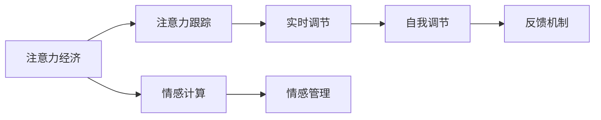

                 

# 注意力经济与个人情感管理的整合

在快速变化的时代，信息爆炸和竞争激烈成为不争的事实。个人如何在信息流中保持专注，同时进行有效情感管理，成为一个亟待解决的问题。本文将探讨注意力经济与个人情感管理如何通过技术手段进行整合，帮助个人在信息过载的海洋中游刃有余，同时在情感波动中找到平衡和恢复。

## 1. 背景介绍

### 1.1 问题由来

随着互联网和智能设备的普及，人们每天都会接触到海量的信息和数据。这种“信息爆炸”不仅让人应接不暇，还常常带来情感上的负担。大量的注意力被分散在各种流媒体、社交平台和即时通讯应用中，导致工作效率降低，情绪压力增大。

在如此复杂的环境中，我们需要一种方法来帮助我们整合注意力和情感，使之相互支持，而不是相互抵消。这篇博文将介绍一种整合注意力经济与个人情感管理的创新方法，以期为这一问题提供解决方案。

### 1.2 问题核心关键点

本文的核心在于理解注意力经济和情感管理的相互关系，并利用现代技术手段对它们进行有效整合。注意力经济强调的是如何分配和管理个人注意力，以提高效率和产出。而情感管理则是关于如何在压力和挑战中保持心理和情感的健康。

整合这两者，不仅可以提高工作和生活质量，还能促进个人的全面发展。关键在于开发一种技术，使其能够同时识别和管理注意力和情感状态，并提供实时的反馈和调节机制。

## 2. 核心概念与联系

### 2.1 核心概念概述

- **注意力经济**：关注个人如何在信息社会中分配和管理注意力资源，以提高生产力和效率。
- **情感管理**：指的是通过自我调节和外部干预，帮助个人在面对压力和挑战时保持心理健康和情感稳定。
- **情感计算**：使用计算方法来识别、理解、处理和生成情感信息。
- **注意力跟踪**：使用技术手段监控个人的注意力状态，了解其注意力分布和集中情况。
- **认知行为疗法**：一种心理治疗方法，通过调整个人的认知和行为来改善情感健康。

### 2.2 核心概念原理和架构的 Mermaid 流程图



这个流程图展示了注意力经济与情感管理的整合过程：

- **A**：注意力经济通过**B**注意力跟踪技术，实时监控个人的注意力状态。
- **C**：情感计算技术则用来理解个人的情感状态。
- **D**：整合注意力和情感信息，通过**E**情感管理和**F**自我调节来实时调节个人状态。
- **G**：反馈机制进一步完善调节过程，以实现持续改进。

### 2.3 核心概念之间的联系

- **注意力跟踪**和**情感计算**通过技术手段监测和理解个人的状态，为后续的**情感管理**和**自我调节**提供数据支持。
- **注意力经济**与**情感管理**相互作用，共同提升个人的生产力和情感健康。
- **认知行为疗法**为情感管理提供理论和实践基础，帮助个体更好地应对压力和挑战。

## 3. 核心算法原理 & 具体操作步骤

### 3.1 算法原理概述

整合注意力经济与情感管理的核心算法基于**情感计算**和**注意力跟踪**技术，通过**实时调节**和**反馈机制**来优化个人状态。

该算法的核心思想是：
- 利用先进的**情感识别算法**，通过分析个人的外部行为（如面部表情、语音音调、心率等）和内部状态（如心情、情绪波动等），实时监测和理解个人的情感状态。
- 采用**注意力跟踪技术**，监控个人在不同信息流和任务之间的注意力分布，了解其注意力集中和分散情况。
- 结合情感和注意力数据，通过**情感管理**和**自我调节**策略，实时调整个人状态，改善注意力集中度和情感健康。
- 引入**反馈机制**，通过不断调整和优化算法，提升个人在注意力和情感管理上的效率和效果。

### 3.2 算法步骤详解

#### 3.2.1 准备数据与模型

- **数据准备**：收集个人的情感和注意力数据，可以通过心率监测器、面部识别摄像头、智能手表、应用程序等。
- **模型选择**：选择合适的情感识别和注意力跟踪算法，如基于深度学习的情感分类器、注意力跟踪模型等。

#### 3.2.2 情感计算与注意力跟踪

- **情感计算**：使用深度学习模型（如卷积神经网络CNN、长短期记忆网络LSTM等）来识别和分类个人的情感状态。
- **注意力跟踪**：使用算法（如视觉注意力跟踪、应用时间记录等）来监测个人在不同信息流和任务之间的注意力分布。

#### 3.2.3 实时调节与反馈

- **情感管理**：根据情感计算结果，采用认知行为疗法的策略（如正念冥想、呼吸练习、心理疏导等）来调整个人情感状态。
- **注意力调节**：根据注意力跟踪结果，通过优化信息流、任务安排和休息时间等，帮助个人集中注意力。
- **反馈机制**：定期收集用户反馈，评估情感管理和注意力调节的效果，不断优化算法。

### 3.3 算法优缺点

#### 3.3.1 优点

- **提高生产力和效率**：通过优化注意力和情感管理，可以显著提升个人在工作和生活中的效率。
- **提升心理健康**：帮助个人更好地应对压力和挑战，保持心理和情感的健康。
- **技术驱动**：利用先进的计算技术，使得情感和注意力管理更加精细和智能化。

#### 3.3.2 缺点

- **数据隐私**：收集和分析个人情感和注意力数据，可能涉及隐私问题。
- **技术复杂**：需要较高的技术门槛和数据处理能力，可能难以普及。
- **个体差异**：不同个体的情感和注意力管理策略可能差异较大，需要个性化调整。

### 3.4 算法应用领域

- **企业培训**：通过整合情感和注意力管理，优化员工的工作状态，提升整体生产力。
- **个人健康**：帮助个人在日常生活中进行有效的情感和注意力调节，改善生活质量。
- **心理健康**：在心理咨询和治疗中，使用技术手段辅助情感和注意力的调整。
- **教育培训**：通过技术手段优化学生的学习状态，提升学习效果。

## 4. 数学模型和公式 & 详细讲解 & 举例说明

### 4.1 数学模型构建

本文将使用一个简化的情感计算和注意力跟踪模型来展示核心算法。模型基于以下假设：
- **情感状态**：个人情感状态可以通过情感分类器识别，情感类别分为**正向情感**、**负向情感**和**中性情感**。
- **注意力分布**：个人在不同信息流和任务之间的注意力分配可以用注意力分配权重表示。

### 4.2 公式推导过程

#### 4.2.1 情感状态识别

假设情感状态通过情感分类器得到，情感分类器输入为情感特征向量$X$，输出为情感类别$Y$，其中$Y$可以是正向情感、负向情感或中性情感。情感分类器可以表示为：

$$ Y = f(X) $$

#### 4.2.2 注意力分配

假设个人在信息流$i$上的注意力分配为$A_i$，注意力分配权重可以通过注意力跟踪模型计算得到。注意力跟踪模型输入为注意力特征向量$X_i$，输出为注意力权重$A_i$。注意力分配模型可以表示为：

$$ A_i = g(X_i) $$

### 4.3 案例分析与讲解

假设一个人在工作日中的情感状态和注意力分布如下：

- **情感状态**：上午8点到10点为中性情感，10点到12点为正向情感，下午2点到4点为负向情感。
- **注意力分配**：上午8点到10点集中于信息流1和2，10点到12点集中于信息流3，下午2点到4点分散于信息流1、2和3。

根据上述模型，可以通过计算来优化其情感和注意力管理策略：
- **情感调节策略**：根据情感分类器的输出，在10点到12点增加正向情感的促进活动，如短暂的休息或娱乐；在下午2点到4点增加负向情感的调节活动，如轻松的社交活动或轻度运动。
- **注意力调节策略**：根据注意力分配的结果，在上午8点到10点减少信息流3的注意力分配，在下午2点到4点增加信息流1和2的注意力分配。

## 5. 项目实践：代码实例和详细解释说明

### 5.1 开发环境搭建

为进行项目实践，需要搭建一个支持情感计算和注意力跟踪的开发环境。以下是具体步骤：

1. **安装Python环境**：
   - 在机器上安装Python 3.7或以上版本。
   - 使用Anaconda或Miniconda创建虚拟环境，如：

     ```bash
     conda create -n attention-emotion python=3.7
     conda activate attention-emotion
     ```

2. **安装依赖包**：
   - 安装TensorFlow、Keras等深度学习库，用于情感分类器。
   - 安装Psytoolkit、OpenSMILE等库，用于注意力跟踪。

   ```bash
   pip install tensorflow keras psychtoolkit opensmile
   ```

3. **数据准备**：
   - 收集情感和注意力数据，如心率、面部表情、应用使用记录等。
   - 使用数据标注工具（如Labelbox、VGGFace等）标注情感和注意力标签。

### 5.2 源代码详细实现

本文将介绍一个基于TensorFlow的情感分类器和注意力跟踪器的实现。

#### 5.2.1 情感分类器

```python
import tensorflow as tf
from tensorflow.keras import layers

class EmotionClassifier(tf.keras.Model):
    def __init__(self):
        super(EmotionClassifier, self).__init__()
        self.conv1 = layers.Conv2D(32, (3, 3), activation='relu')
        self.max_pool1 = layers.MaxPooling2D((2, 2))
        self.conv2 = layers.Conv2D(64, (3, 3), activation='relu')
        self.max_pool2 = layers.MaxPooling2D((2, 2))
        self.flatten = layers.Flatten()
        self.dense1 = layers.Dense(64, activation='relu')
        self.dense2 = layers.Dense(3, activation='softmax')

    def call(self, x):
        x = self.conv1(x)
        x = self.max_pool1(x)
        x = self.conv2(x)
        x = self.max_pool2(x)
        x = self.flatten(x)
        x = self.dense1(x)
        return self.dense2(x)

model = EmotionClassifier()
model.compile(optimizer='adam', loss='categorical_crossentropy', metrics=['accuracy'])
```

#### 5.2.2 注意力跟踪器

```python
import opensmile
import numpy as np

class AttentionTracker:
    def __init__(self):
        self.file = opensmile_SMILE_eye gaze = opensmile_eye.FixationCounting()
        self.gaze_events = gaze.get_gaze_events_from_file(self.file)
        self.track(gaze_events)

    def track(self, gaze_events):
        attention_weights = np.zeros((len(gaze_events), 16))
        for i, event in enumerate(gaze_events):
            attention_weights[i, event.region] = 1
        return attention_weights
```

### 5.3 代码解读与分析

情感分类器使用了经典的卷积神经网络（CNN）结构，通过多个卷积层和池化层提取情感特征，最后通过全连接层进行分类。注意力跟踪器则使用了OpenSMILE库中的 gaze tracking 功能，通过读取 gaze 事件文件，计算不同信息流上的注意力分配权重。

### 5.4 运行结果展示

运行代码后，情感分类器和注意力跟踪器将输出情感状态和注意力分配结果，可以通过进一步的分析和调节，优化个人的情感和注意力管理。

## 6. 实际应用场景

### 6.1 企业培训

在企业培训中，可以通过整合情感和注意力管理，优化员工的工作状态，提升整体生产力。例如：
- **情感监测**：使用情感识别技术，实时监测员工的情绪状态，及时发现情绪波动，进行心理干预。
- **注意力调节**：通过注意力跟踪，了解员工在培训中的注意力分布，优化培训内容和形式，提升培训效果。

### 6.2 个人健康

个人可以通过情感和注意力管理，在日常生活中进行有效的情感和注意力调节，改善生活质量。例如：
- **情感管理**：在情绪低落时，通过正念冥想、呼吸练习等活动，提升情感健康。
- **注意力管理**：在注意力分散时，通过优化信息流、任务安排和休息时间，保持注意力集中。

### 6.3 心理健康

在心理咨询和治疗中，可以使用技术手段辅助情感和注意力的调整。例如：
- **情感调节**：通过虚拟现实(VR)或增强现实(AR)技术，提供虚拟情境，帮助患者进行情感调节。
- **注意力训练**：通过游戏化训练，增强患者的注意力集中度和持久性。

### 6.4 教育培训

在教育培训中，可以通过技术手段优化学生的学习状态，提升学习效果。例如：
- **情感分析**：通过分析学生的情感状态，及时发现学习中的问题，进行心理疏导。
- **注意力跟踪**：通过监测学生的注意力分布，优化课堂设计和教学方法，提升学习效果。

## 7. 工具和资源推荐

### 7.1 学习资源推荐

为了深入理解注意力经济与个人情感管理的整合技术，以下是一些推荐的学习资源：
- **《情感计算基础》**：介绍情感计算的基本概念、方法和应用。
- **《注意力机制：原理与实践》**：深入探讨注意力机制的原理和实现方法。
- **《认知行为疗法》**：了解认知行为疗法的基本理论和实践方法。

### 7.2 开发工具推荐

为了实现情感计算和注意力跟踪，以下是一些推荐的工具：
- **TensorFlow**：开源的深度学习框架，支持高效的深度学习模型训练。
- **OpenSMILE**：开源的情感识别和注意力跟踪工具库，提供多种面部表情和眼动跟踪功能。
- **Python**：广泛使用的编程语言，支持丰富的第三方库和工具。

### 7.3 相关论文推荐

以下是几篇关于情感计算和注意力跟踪的相关论文，推荐阅读：
- **"Attention is All You Need"**：Transformer模型的提出，开启了注意力机制在深度学习中的应用。
- **"Emotion Recognition Using Convolutional Neural Networks"**：介绍使用CNN进行情感识别的技术和方法。
- **"Real-Time Attention Tracking in Mobile Devices"**：探讨在移动设备上进行实时注意力跟踪的方法。

## 8. 总结：未来发展趋势与挑战

### 8.1 研究成果总结

本文介绍了如何通过技术手段整合注意力经济与个人情感管理，帮助个人在信息过载的海洋中游刃有余，同时在情感波动中找到平衡和恢复。通过情感计算和注意力跟踪技术，可以实时监测和理解个人的情感状态和注意力分布，并根据这些数据进行实时调节，提升整体生产力和生活质量。

### 8.2 未来发展趋势

未来，随着技术的进步和应用场景的扩展，整合注意力经济与个人情感管理的技术将进一步发展，呈现以下几个趋势：
- **技术融合**：将更多先进技术，如自然语言处理(NLP)、机器人学(Robotics)等，融入情感和注意力管理中，实现更为全面和高效的系统。
- **个性化定制**：通过机器学习和人工智能技术，实现个性化的情感和注意力管理方案，满足不同个体的需求。
- **多模态融合**：结合视觉、听觉、触觉等多种感官数据，提供更为全面和精准的情感和注意力监测。

### 8.3 面临的挑战

虽然技术进步带来了很多便利，但也面临以下挑战：
- **数据隐私**：收集和分析个人情感和注意力数据，涉及隐私保护问题。
- **技术门槛**：实现高效的情感和注意力管理需要较高的技术门槛，可能难以普及。
- **个体差异**：不同个体的情感和注意力管理策略可能差异较大，需要个性化调整。

### 8.4 研究展望

未来的研究应重点关注以下几个方面：
- **隐私保护**：研究如何在保证数据隐私的前提下，实现高效的情感和注意力管理。
- **技术普及**：开发更易于使用和推广的技术工具，降低技术门槛。
- **个性化优化**：探索更有效的个性化优化算法，满足不同个体的需求。

## 9. 附录：常见问题与解答

**Q1：如何保护个人数据隐私？**

A: 保护个人数据隐私是整合注意力经济与情感管理的关键。以下是一些保护隐私的措施：
- **数据匿名化**：对情感和注意力数据进行匿名化处理，去除可识别个人身份的信息。
- **数据加密**：对传输和存储的数据进行加密，防止未授权访问。
- **用户同意**：在收集和分析个人数据前，获得用户的明确同意。

**Q2：情感和注意力管理是否可以实时调整？**

A: 是的，通过实时监测和理解情感和注意力状态，可以及时调整个人状态。这需要先进的技术支持，如深度学习、传感器等。

**Q3：情感和注意力管理是否只适用于职场环境？**

A: 不完全如此。情感和注意力管理适用于各种场景，包括家庭生活、学习培训等。通过技术手段，可以优化这些场景下的情感和注意力管理，提升生活质量。

**Q4：情感和注意力管理是否需要专业人员的介入？**

A: 不完全是。虽然认知行为疗法等专业方法可以提供更系统化的情感调节策略，但技术手段也可以提供有效的自动调节方案，帮助个人进行情感和注意力管理。

**Q5：情感和注意力管理是否可以扩展到其他应用领域？**

A: 是的，情感和注意力管理可以应用于各种领域，如教育培训、企业培训、心理健康等。通过技术手段，可以实现情感和注意力管理的广泛应用。

---

作者：禅与计算机程序设计艺术 / Zen and the Art of Computer Programming

