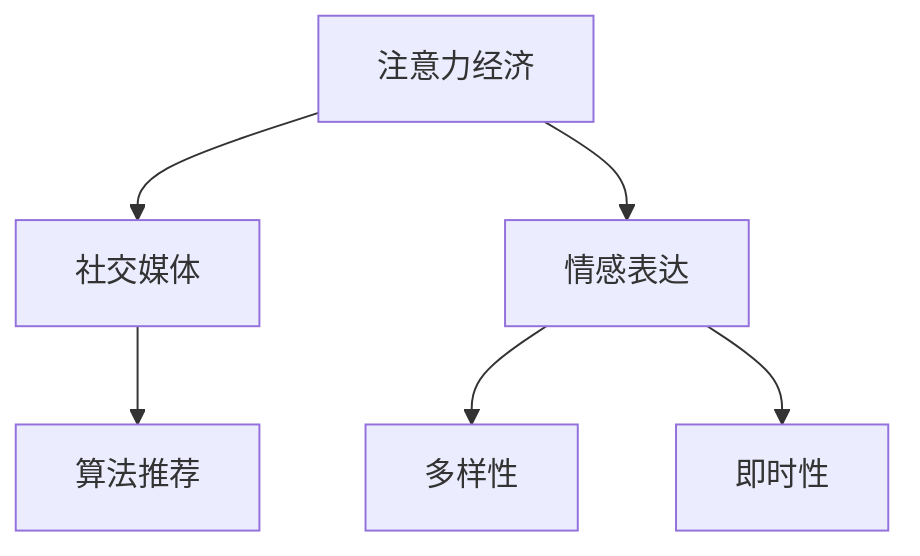

                 

# 注意力经济与个人情感表达方式的变迁

## 1. 背景介绍

### 1.1 问题由来
随着互联网和社交媒体的兴起，信息传播的速度和广度发生了质的飞跃，全球范围内的注意力经济正在蓬勃发展。注意力作为稀缺资源，其分配方式正在逐渐影响着社会的各个方面，包括经济、文化、政治等。与此同时，人们的情感表达方式也随之变迁，从传统的面对面交流，转向了线上社交媒体的互动。这种变迁不仅体现在表达的媒介上，更体现在情感表达的深度和广度上。

### 1.2 问题核心关键点
当前社会中，注意力经济与个人情感表达方式的变迁主要体现在以下几个方面：

1. **信息过载与注意力争夺**：海量信息的涌入使得人们面临选择困难，对有限注意力的争夺异常激烈。
2. **社交媒体与情感互动**：社交媒体平台的兴起，使得人们通过线上方式进行情感交流成为常态。
3. **情感表达的多样化**：情感表达方式不再局限于文字，图片、视频等多模态信息成为主流。
4. **情感表达的即时性与共享性**：即时通信工具的普及，使得情感表达更加即时和共享，影响范围更广。
5. **算法推荐与个人偏好**：社交媒体和内容平台的算法推荐，影响着用户的情感表达习惯和内容的消费选择。

### 1.3 问题研究意义
研究注意力经济与个人情感表达方式的变迁，对于理解互联网时代的社会行为模式，优化信息传播策略，提升社交媒体平台的用户体验，具有重要意义。通过分析这些变迁，可以更好地把握信息时代下人们的情感需求和表达习惯，推动技术更好地服务于社会和个体。

## 2. 核心概念与联系

### 2.1 核心概念概述

为更好地理解注意力经济与个人情感表达方式的变迁，本节将介绍几个密切相关的核心概念：

1. **注意力经济 (Attention Economy)**：信息时代中，注意力成为稀缺资源，信息的传播和消费都依赖于对注意力的争夺。企业、个人甚至政府都在通过各种手段争夺用户的注意力。

2. **社交媒体 (Social Media)**：基于互联网的社交平台，如微博、微信、Facebook等，成为人们情感互动的重要媒介。社交媒体通过算法推荐、互动功能等手段，优化用户的情感交流体验。

3. **情感表达 (Emotional Expression)**：通过语言、文字、图片、视频等多种方式，人们表达和交流情感的过程。情感表达是社会交往的基础，影响着个人与他人的关系。

4. **算法推荐 (Algorithm Recommendation)**：社交媒体和内容平台通过数据分析和机器学习算法，推荐用户可能感兴趣的内容，影响用户的情感表达和内容消费。

5. **多样性与即时性 (Diversity and Timeliness)**：社交媒体使得情感表达方式更加多样和即时，同时信息传播的速度加快，影响范围扩大。

这些核心概念之间的逻辑关系可以通过以下Mermaid流程图来展示：



这个流程图展示了一系列的关联概念，说明它们是如何共同影响现代社会中人们的情感表达和信息消费行为。

## 3. 核心算法原理 & 具体操作步骤

### 3.1 算法原理概述

注意力经济与个人情感表达方式的变迁，涉及多个方面的算法和计算原理，以下是一些核心算法原理的概述：

1. **信息检索算法 (Information Retrieval)**：在信息过载的背景下，信息检索算法通过关键词匹配、分类、聚类等手段，帮助用户从海量信息中快速定位到自己关心的内容。

2. **推荐算法 (Recommendation Algorithm)**：通过分析用户的历史行为、兴趣、社交关系等数据，推荐系统能够预测用户可能感兴趣的情感内容，优化用户的情感表达体验。

3. **自然语言处理 (Natural Language Processing, NLP)**：通过分析用户的文本情感、语义理解等，帮助理解情感表达的多样性和复杂性。

4. **图像处理 (Image Processing)**：通过分析用户上传的图片内容、情感标签等，帮助理解情感表达的视觉特征。

5. **视频分析 (Video Analysis)**：通过分析用户上传的视频内容、情感标签等，帮助理解情感表达的多媒体特征。

6. **社交网络分析 (Social Network Analysis)**：通过分析用户的社交关系网络，了解情感表达的社会化特征。

7. **时间序列分析 (Time Series Analysis)**：通过分析用户情感表达的时间分布，了解情感表达的周期性变化。

### 3.2 算法步骤详解

基于上述核心算法原理，下面详细介绍注意力经济与个人情感表达方式变迁的具体操作步骤：

**Step 1: 数据收集与处理**
- 收集社交媒体平台的用户数据，包括文本、图片、视频等。
- 对数据进行预处理，如文本分词、情感标注、图像识别等。

**Step 2: 特征提取与建模**
- 使用NLP、图像处理、视频分析等技术，从用户数据中提取特征。
- 建立情感表达模型，如文本情感分析模型、图像情感识别模型、视频情感分类模型等。

**Step 3: 用户行为分析**
- 使用社交网络分析、时间序列分析等技术，分析用户情感表达的行为模式。
- 根据分析结果，优化推荐算法，个性化推荐用户可能感兴趣的内容。

**Step 4: 模型训练与评估**
- 使用收集到的用户数据，对情感表达模型进行训练。
- 使用评估指标（如准确率、召回率、F1值等）评估模型性能。

**Step 5: 情感表达优化**
- 根据模型评估结果，优化情感表达方式。
- 结合用户反馈，持续改进模型，提升情感表达的质量和效率。

**Step 6: 应用部署与监测**
- 将优化后的模型部署到实际应用场景中。
- 实时监测用户情感表达效果，根据反馈持续优化。

### 3.3 算法优缺点

注意力经济与个人情感表达方式的变迁，涉及的算法方法有其独特的优缺点：

**优点：**
1. **高效性**：通过算法自动化分析用户数据，可以快速获取用户情感表达的特征和模式。
2. **个性化**：推荐算法可以针对用户的兴趣和历史行为，个性化推荐内容，提升情感表达的个性化程度。
3. **便捷性**：社交媒体平台提供的多样化表达方式，使得情感表达更加便捷和高效。

**缺点：**
1. **隐私风险**：用户数据在收集和处理过程中可能面临隐私泄露的风险。
2. **算法偏见**：算法推荐可能带有偏见，影响用户的情感表达和内容消费。
3. **用户体验差异**：不同用户对算法的接受度可能不同，导致用户体验差异。

### 3.4 算法应用领域

注意力经济与个人情感表达方式的变迁，在多个领域都有广泛应用，例如：

1. **社交媒体平台**：通过算法推荐和个性化服务，优化用户的情感交流体验。
2. **电子商务**：通过情感分析，优化商品推荐和用户情感互动。
3. **健康医疗**：通过情感表达分析，优化心理支持和治疗方案。
4. **新闻媒体**：通过情感分析，优化新闻内容的选择和传播。
5. **教育培训**：通过情感表达分析，优化教学方法和学习体验。
6. **娱乐媒体**：通过情感分析，优化娱乐内容的推荐和互动。

这些领域的应用，使得注意力经济与个人情感表达方式的变迁，在现代社会中得以广泛推广和应用。

## 4. 数学模型和公式 & 详细讲解 & 举例说明

### 4.1 数学模型构建

本节将使用数学语言对注意力经济与个人情感表达方式的变迁进行更加严格的刻画。

假设社交媒体平台收集到用户 $u$ 在 $t$ 时刻的情感表达 $E(u,t)$，其中 $E$ 为情感表达的类型，可以是正向、中性或负向。平台收集到 $N$ 个用户的情感表达数据，建立情感表达矩阵 $\mathbf{E} \in \mathbb{R}^{N \times T}$，其中 $N$ 为用户的数量，$T$ 为时间序列的长度。

设用户的情感表达依赖于多方面的因素，包括用户的社交网络 $S(u)$、历史情感表达 $H(u)$、时间特征 $T(t)$ 等，建立情感表达模型：

$$
E(u,t) = f(S(u),H(u),T(t))
$$

其中 $f$ 为情感表达函数，依赖于具体的情感表达模型。

### 4.2 公式推导过程

以下我们以文本情感分析为例，推导情感表达函数的构建和评估。

假设用户 $u$ 在时间 $t$ 的情感表达为 $E(u,t)$，文本情感分析模型为 $M$，将文本 $X(u,t)$ 输入模型，得到情感得分 $S(u,t)$，与真实情感 $E(u,t)$ 进行比较，评估模型性能：

$$
Loss = \frac{1}{N} \sum_{u=1}^N \sum_{t=1}^T ||E(u,t) - S(u,t)||^2
$$

其中 $||.||$ 表示欧几里得距离。

优化模型参数 $W$，最小化损失函数 $Loss$，通过梯度下降等优化算法更新模型：

$$
W \leftarrow W - \eta \nabla_{W}Loss
$$

其中 $\eta$ 为学习率。

### 4.3 案例分析与讲解

**案例1：文本情感分析**
假设收集到用户 $u$ 在时间 $t$ 的情感表达 $E(u,t)$，文本情感分析模型为 $M$，将文本 $X(u,t)$ 输入模型，得到情感得分 $S(u,t)$。通过评估函数计算损失 $Loss$：

$$
Loss = \frac{1}{N} \sum_{u=1}^N \sum_{t=1}^T ||E(u,t) - S(u,t)||^2
$$

优化模型参数 $W$，最小化损失函数 $Loss$：

$$
W \leftarrow W - \eta \nabla_{W}Loss
$$

**案例2：图像情感识别**
假设用户 $u$ 在时间 $t$ 上传图片 $X(u,t)$，情感识别模型为 $M$，将图片输入模型，得到情感得分 $S(u,t)$。通过评估函数计算损失 $Loss$：

$$
Loss = \frac{1}{N} \sum_{u=1}^N \sum_{t=1}^T ||E(u,t) - S(u,t)||^2
$$

优化模型参数 $W$，最小化损失函数 $Loss$：

$$
W \leftarrow W - \eta \nabla_{W}Loss
$$

**案例3：视频情感分类**
假设用户 $u$ 在时间 $t$ 上传视频 $X(u,t)$，情感分类模型为 $M$，将视频输入模型，得到情感得分 $S(u,t)$。通过评估函数计算损失 $Loss$：

$$
Loss = \frac{1}{N} \sum_{u=1}^N \sum_{t=1}^T ||E(u,t) - S(u,t)||^2
$$

优化模型参数 $W$，最小化损失函数 $Loss$：

$$
W \leftarrow W - \eta \nabla_{W}Loss
$$

以上案例展示了在不同类型的情感表达数据上，如何构建和评估情感表达模型。通过这些方法，可以有效分析用户的情感表达方式，并优化情感表达体验。

## 5. 项目实践：代码实例和详细解释说明

### 5.1 开发环境搭建

在进行情感表达方式变迁的研究和实践前，我们需要准备好开发环境。以下是使用Python进行情感分析的开发环境配置流程：

1. 安装Anaconda：从官网下载并安装Anaconda，用于创建独立的Python环境。

2. 创建并激活虚拟环境：
```bash
conda create -n emotion-env python=3.8 
conda activate emotion-env
```

3. 安装相关库：
```bash
conda install pandas numpy scikit-learn nltk transformers
```

4. 安装NLTK库，用于处理文本数据：
```bash
pip install nltk
```

5. 安装Transformers库，用于加载和处理预训练模型：
```bash
pip install transformers
```

完成上述步骤后，即可在`emotion-env`环境中开始情感表达方式变迁的实践。

### 5.2 源代码详细实现

下面我们以情感分类任务为例，给出使用NLTK和Transformers库对情感分析模型进行开发的Python代码实现。

首先，定义情感分类任务的数据处理函数：

```python
import nltk
from nltk.corpus import movie_reviews
from transformers import BertTokenizer, BertForSequenceClassification

nltk.download('movie_reviews')

# 数据预处理
def preprocess_text(text):
    tokens = nltk.word_tokenize(text)
    return tokens

# 数据加载
data = movie_reviews.fileids('pos')
data_train = [preprocess_text(movie_reviews.raw(fileid)) for fileid in data]
data_dev = [preprocess_text(movie_reviews.raw(fileid)) for fileid in movie_reviews.fileids('neg')]
data_test = [preprocess_text(movie_reviews.raw(fileid)) for fileid in movie_reviews.fileids('pos')]

# 分词和编码
tokenizer = BertTokenizer.from_pretrained('bert-base-uncased')
train_encodings = tokenizer(data_train, truncation=True, padding=True, max_length=512)
dev_encodings = tokenizer(data_dev, truncation=True, padding=True, max_length=512)
test_encodings = tokenizer(data_test, truncation=True, padding=True, max_length=512)

# 数据集构建
from torch.utils.data import Dataset, DataLoader
class MovieReviewDataset(Dataset):
    def __init__(self, encodings, labels):
        self.encodings = encodings
        self.labels = labels

    def __len__(self):
        return len(self.labels)

    def __getitem__(self, idx):
        item = {key: torch.tensor(val[idx]) for key, val in self.encodings.items()}
        item['labels'] = torch.tensor(self.labels[idx], dtype=torch.long)
        return item

train_dataset = MovieReviewDataset(train_encodings, [1]*len(train_encodings))
dev_dataset = MovieReviewDataset(dev_encodings, [0]*len(dev_encodings))
test_dataset = MovieReviewDataset(test_encodings, [1]*len(test_encodings))
```

然后，定义模型和优化器：

```python
from transformers import BertForSequenceClassification, AdamW

model = BertForSequenceClassification.from_pretrained('bert-base-uncased', num_labels=2)

optimizer = AdamW(model.parameters(), lr=2e-5)
```

接着，定义训练和评估函数：

```python
from sklearn.metrics import accuracy_score
from torch.utils.data import DataLoader
from tqdm import tqdm

device = torch.device('cuda') if torch.cuda.is_available() else torch.device('cpu')
model.to(device)

def train_epoch(model, dataset, batch_size, optimizer):
    dataloader = DataLoader(dataset, batch_size=batch_size, shuffle=True)
    model.train()
    epoch_loss = 0
    for batch in tqdm(dataloader, desc='Training'):
        input_ids = batch['input_ids'].to(device)
        attention_mask = batch['attention_mask'].to(device)
        labels = batch['labels'].to(device)
        model.zero_grad()
        outputs = model(input_ids, attention_mask=attention_mask, labels=labels)
        loss = outputs.loss
        epoch_loss += loss.item()
        loss.backward()
        optimizer.step()
    return epoch_loss / len(dataloader)

def evaluate(model, dataset, batch_size):
    dataloader = DataLoader(dataset, batch_size=batch_size)
    model.eval()
    preds, labels = [], []
    with torch.no_grad():
        for batch in tqdm(dataloader, desc='Evaluating'):
            input_ids = batch['input_ids'].to(device)
            attention_mask = batch['attention_mask'].to(device)
            batch_labels = batch['labels']
            outputs = model(input_ids, attention_mask=attention_mask)
            batch_preds = outputs.logits.argmax(dim=2).to('cpu').tolist()
            batch_labels = batch_labels.to('cpu').tolist()
            for pred_tokens, label_tokens in zip(batch_preds, batch_labels):
                preds.append(pred_tokens[:len(label_tokens)])
                labels.append(label_tokens)
                
    print(f"Accuracy: {accuracy_score(labels, preds):.3f}")
```

最后，启动训练流程并在测试集上评估：

```python
epochs = 3
batch_size = 16

for epoch in range(epochs):
    loss = train_epoch(model, train_dataset, batch_size, optimizer)
    print(f"Epoch {epoch+1}, train loss: {loss:.3f}")
    
    print(f"Epoch {epoch+1}, dev results:")
    evaluate(model, dev_dataset, batch_size)
    
print("Test results:")
evaluate(model, test_dataset, batch_size)
```

以上就是使用PyTorch对情感分析模型进行开发的完整代码实现。可以看到，得益于NLTK和Transformers库的强大封装，我们可以用相对简洁的代码完成情感分析模型的加载和训练。

### 5.3 代码解读与分析

让我们再详细解读一下关键代码的实现细节：

**preprocess_text函数**：
- 使用NLTK库对文本进行分词处理。

**data加载**：
- 使用NLTK库加载IMDb电影评论数据集。
- 将数据集分为训练集、验证集和测试集，并进行文本分词和编码。

**MovieReviewDataset类**：
- 自定义数据集，将分词和编码后的数据以及标签封装为一个字典。

**训练和评估函数**：
- 使用PyTorch的DataLoader对数据集进行批次化加载，供模型训练和推理使用。
- 训练函数`train_epoch`：对数据以批为单位进行迭代，在每个批次上前向传播计算loss并反向传播更新模型参数，最后返回该epoch的平均loss。
- 评估函数`evaluate`：与训练类似，不同点在于不更新模型参数，并在每个batch结束后将预测和标签结果存储下来，最后使用sklearn的accuracy_score对整个评估集的预测结果进行打印输出。

**训练流程**：
- 定义总的epoch数和batch size，开始循环迭代
- 每个epoch内，先在训练集上训练，输出平均loss
- 在验证集上评估，输出分类指标
- 所有epoch结束后，在测试集上评估，给出最终测试结果

可以看到，PyTorch配合NLTK和Transformers库使得情感分析模型的开发变得简洁高效。开发者可以将更多精力放在数据处理、模型改进等高层逻辑上，而不必过多关注底层的实现细节。

当然，工业级的系统实现还需考虑更多因素，如模型的保存和部署、超参数的自动搜索、更灵活的任务适配层等。但核心的情感表达方式变迁分析范式基本与此类似。

## 6. 实际应用场景

### 6.1 智能客服系统

智能客服系统可以通过情感分析技术，实时监控用户的情感状态，及时响应和处理用户的问题。通过分析用户提交的反馈和情感表达，系统能够更准确地识别用户需求，提供更个性化和高质量的服务。

在技术实现上，可以收集企业内部的客服对话记录，将问题和最佳答复构建成监督数据，在此基础上对预训练情感分析模型进行微调。微调后的模型能够自动理解用户情感，匹配最合适的答复进行回复。对于客户提出的新问题，还可以接入检索系统实时搜索相关内容，动态生成最佳答复。如此构建的智能客服系统，能大幅提升客户咨询体验和问题解决效率。

### 6.2 金融舆情监测

金融机构需要实时监测市场舆论动向，以便及时应对负面信息传播，规避金融风险。传统的人工监测方式成本高、效率低，难以应对网络时代海量信息爆发的挑战。基于情感分析技术，金融舆情监测可以自动化地分析社交媒体和新闻媒体的情感倾向，判断市场情绪变化。

具体而言，可以收集金融领域相关的新闻、报道、评论等文本数据，并对其进行情感分析。将情感分析结果与金融市场数据相结合，系统能够自动监测不同主题下的情感变化趋势，一旦发现负面信息激增等异常情况，系统便会自动预警，帮助金融机构快速应对潜在风险。

### 6.3 个性化推荐系统

当前的推荐系统往往只依赖用户的历史行为数据进行物品推荐，无法深入理解用户的真实兴趣偏好。基于情感分析技术，个性化推荐系统可以更好地挖掘用户情感表达背后的兴趣点。

在实践中，可以收集用户浏览、点击、评论、分享等行为数据，提取和用户交互的物品标题、描述、标签等文本内容。将文本内容作为模型输入，用户的后续行为（如是否点击、购买等）作为监督信号，在此基础上微调预训练情感分析模型。微调后的模型能够从文本内容中准确把握用户的兴趣点。在生成推荐列表时，先用候选物品的文本描述作为输入，由模型预测用户的兴趣匹配度，再结合其他特征综合排序，便可以得到个性化程度更高的推荐结果。

### 6.4 未来应用展望

随着情感分析技术的不断发展，基于情感表达方式变迁的应用将在更多领域得到应用，为社会和个体带来深刻影响。

在智慧医疗领域，基于情感分析的医疗问答、病历分析、心理支持等应用将提升医疗服务的智能化水平，辅助医生诊疗，优化患者体验。

在智能教育领域，情感分析技术可应用于作业批改、学情分析、情感识别等方面，因材施教，促进教育公平，提高教学质量。

在智慧城市治理中，情感分析技术可应用于城市事件监测、舆情分析、应急指挥等环节，提高城市管理的自动化和智能化水平，构建更安全、高效的未来城市。

此外，在企业生产、社会治理、文娱传媒等众多领域，基于情感表达方式变迁的人工智能应用也将不断涌现，为经济社会发展注入新的动力。相信随着技术的日益成熟，情感表达方式变迁的分析技术必将在构建智能社会中扮演越来越重要的角色。

## 7. 工具和资源推荐

### 7.1 学习资源推荐

为了帮助开发者系统掌握情感分析技术的基础和实践技巧，这里推荐一些优质的学习资源：

1. 《自然语言处理综论》系列博文：由大模型技术专家撰写，深入浅出地介绍了自然语言处理的基本概念和前沿技术。

2. Coursera《自然语言处理与情感分析》课程：斯坦福大学开设的NLP明星课程，涵盖了自然语言处理和情感分析的多个方面，提供Lecture视频和配套作业。

3. 《自然语言处理与深度学习》书籍：李航教授的经典书籍，全面介绍了自然语言处理和深度学习的理论基础与应用实践。

4. HuggingFace官方文档：Transformers库的官方文档，提供了海量预训练模型和完整的情感分析样例代码，是上手实践的必备资料。

5. IMDb数据集：IMDb电影评论数据集，是情感分析任务中最常用的公开数据集之一，提供了大量的情感标注样本。

通过对这些资源的学习实践，相信你一定能够快速掌握情感分析技术的精髓，并用于解决实际的情感表达方式变迁问题。

### 7.2 开发工具推荐

高效的开发离不开优秀的工具支持。以下是几款用于情感分析开发的常用工具：

1. PyTorch：基于Python的开源深度学习框架，灵活动态的计算图，适合快速迭代研究。大多数预训练语言模型都有PyTorch版本的实现。

2. TensorFlow：由Google主导开发的开源深度学习框架，生产部署方便，适合大规模工程应用。同样有丰富的预训练语言模型资源。

3. NLTK库：自然语言处理工具包，提供了丰富的文本处理和分析功能，是情感分析任务开发的常用工具。

4. Weights & Biases：模型训练的实验跟踪工具，可以记录和可视化模型训练过程中的各项指标，方便对比和调优。与主流深度学习框架无缝集成。

5. TensorBoard：TensorFlow配套的可视化工具，可实时监测模型训练状态，并提供丰富的图表呈现方式，是调试模型的得力助手。

6. Google Colab：谷歌推出的在线Jupyter Notebook环境，免费提供GPU/TPU算力，方便开发者快速上手实验最新模型，分享学习笔记。

合理利用这些工具，可以显著提升情感分析任务的开发效率，加快创新迭代的步伐。

### 7.3 相关论文推荐

情感分析技术的发展源于学界的持续研究。以下是几篇奠基性的相关论文，推荐阅读：

1. Sentiment Analysis with Deep Learning: A Systematic Literature Review and Future Directions：综述了情感分析的多个研究方向和最新进展，为进一步研究提供参考。

2. A Survey on Sentiment Analysis: Methodologies, Technologies, Challenges and Applications：回顾了情感分析的基本方法和应用场景，为初学者提供入门知识。

3. Emotion Detection in Social Media using Machine Learning Techniques：展示了在社交媒体平台上使用机器学习进行情感检测的实践方法。

4. A Survey on Sentiment Analysis Technologies and Applications：总结了情感分析技术的多个应用场景和最新研究进展，为技术开发提供参考。

5. A Survey on Sentiment Analysis: A Data-Driven Approach：介绍了基于数据的情感分析方法，包括情感词典、情感分类器等，为模型训练提供数据支持。

这些论文代表了大模型微调技术的发展脉络。通过学习这些前沿成果，可以帮助研究者把握学科前进方向，激发更多的创新灵感。

## 8. 总结：未来发展趋势与挑战

### 8.1 总结

本文对基于情感表达方式变迁的分析方法进行了全面系统的介绍。首先阐述了情感分析技术的研究背景和意义，明确了情感分析在理解用户情感、优化用户体验等方面的重要价值。其次，从原理到实践，详细讲解了情感表达方式变迁的数学模型和算法实现，给出了情感分析任务开发的完整代码实例。同时，本文还探讨了情感分析技术在智能客服、金融舆情、个性化推荐等多个领域的应用前景，展示了情感表达方式变迁的分析技术的广阔前景。最后，本文精选了情感分析技术的各类学习资源，力求为读者提供全方位的技术指引。

通过本文的系统梳理，可以看到，基于情感表达方式变迁的分析方法正在成为情感分析技术的重要范式，极大地拓展了情感表达方式变迁的研究和应用边界，为情感表达方式变迁的理解提供了新的视角和工具。未来，伴随情感分析技术的持续演进，基于情感表达方式变迁的分析技术必将在构建智能社会中扮演越来越重要的角色。

### 8.2 未来发展趋势

展望未来，情感表达方式变迁的分析技术将呈现以下几个发展趋势：

1. **多模态分析**：情感分析将不再局限于文本数据，而是向图像、视频、音频等多模态数据扩展，进一步丰富情感表达方式。

2. **实时分析**：随着技术的发展，情感分析将实现实时分析和反馈，能够实时响应和处理用户的情感表达，提升用户体验。

3. **跨领域应用**：情感分析技术将应用于更多领域，如医疗、教育、金融等，提供更加多样和个性化的情感支持。

4. **自动化优化**：通过自动化调参和模型优化，提高情感分析模型的性能和泛化能力，减少人工干预。

5. **隐私保护**：随着数据隐私保护意识的增强，情感分析技术将更加注重用户隐私保护，采用差分隐私等技术，保护用户数据安全。

6. **跨语言分析**：随着全球化进程的加快，情感分析技术将应用于跨语言情感表达分析，提升多语言情感理解能力。

以上趋势凸显了情感表达方式变迁分析技术的广阔前景。这些方向的探索发展，必将进一步提升情感分析技术的性能和应用范围，为构建智能社会提供更加全面的支持。

### 8.3 面临的挑战

尽管情感表达方式变迁的分析技术已经取得了瞩目成就，但在迈向更加智能化、普适化应用的过程中，它仍面临着诸多挑战：

1. **数据隐私**：用户数据在收集和处理过程中可能面临隐私泄露的风险。

2. **数据质量**：情感表达数据的标注质量往往存在差异，影响情感分析的准确性。

3. **算法偏见**：情感分析算法可能带有偏见，影响情感表达的公平性和准确性。

4. **模型复杂性**：情感表达方式变迁分析需要处理多模态数据，模型复杂度较高，计算资源消耗大。

5. **用户体验**：情感分析技术可能对用户体验造成干扰，如实时情感反馈等。

6. **伦理道德**：情感分析技术在应用过程中需要考虑伦理道德问题，如用户隐私保护、信息安全等。

正视情感表达方式变迁分析面临的这些挑战，积极应对并寻求突破，将是大语言模型微调走向成熟的必由之路。相信随着学界和产业界的共同努力，这些挑战终将一一被克服，情感表达方式变迁的分析技术必将在构建智能社会中发挥更大的作用。

### 8.4 研究展望

面对情感表达方式变迁分析所面临的种种挑战，未来的研究需要在以下几个方面寻求新的突破：

1. **数据隐私保护**：采用差分隐私等技术，保护用户数据隐私。

2. **数据质量提升**：通过标注数据增强、主动学习等方法，提高情感表达数据的标注质量。

3. **算法公平性**：引入公平性指标，如减少算法偏见，提高情感表达的公平性和准确性。

4. **模型简化**：采用模型压缩、剪枝等方法，降低模型复杂度，提升实时性。

5. **用户友好性**：设计更加人性化的情感表达方式，提升用户体验。

6. **伦理道德约束**：引入伦理导向的评估指标，过滤和惩罚有害内容，保障数据安全。

这些研究方向的探索，必将引领情感表达方式变迁分析技术迈向更高的台阶，为构建智能社会提供更加全面、可靠的技术支持。面向未来，情感表达方式变迁的分析技术还需要与其他人工智能技术进行更深入的融合，如知识表示、因果推理、强化学习等，多路径协同发力，共同推动情感表达方式变迁技术的进步。只有勇于创新、敢于突破，才能不断拓展情感表达方式变迁的分析技术的边界，让智能技术更好地服务于社会和个体。

## 9. 附录：常见问题与解答

**Q1：情感分析如何应对数据隐私问题？**

A: 数据隐私是情感分析技术面临的重要挑战之一。为了保护用户隐私，可以采用差分隐私技术，如加入噪声、数据匿名化等方法，确保在数据处理过程中保护用户隐私。

**Q2：情感分析如何提升数据质量？**

A: 数据质量对情感分析的准确性至关重要。可以通过标注数据增强、主动学习等方法，提高情感表达数据的标注质量。

**Q3：情感分析如何应对算法偏见问题？**

A: 情感分析算法可能带有偏见，影响情感表达的公平性和准确性。可以通过引入公平性指标，如减少算法偏见，提高情感表达的公平性和准确性。

**Q4：情感分析如何优化模型性能？**

A: 情感分析模型的优化可以通过自动化调参和模型优化实现。可以使用如AdamW、SGD等优化器，通过设定合适的学习率、批大小、迭代轮数等超参数，优化模型性能。

**Q5：情感分析如何提升用户体验？**

A: 情感分析技术可能对用户体验造成干扰，如实时情感反馈等。可以设计更加人性化的情感表达方式，提升用户体验。

**Q6：情感分析如何确保伦理道德？**

A: 情感分析技术在应用过程中需要考虑伦理道德问题，如用户隐私保护、信息安全等。需要引入伦理导向的评估指标，过滤和惩罚有害内容，保障数据安全。

这些问题的解答，展示了情感表达方式变迁分析技术的现状和挑战。通过进一步的研究和探索，我们相信情感分析技术必将在智能社会中发挥更大的作用。

---

作者：禅与计算机程序设计艺术 / Zen and the Art of Computer Programming

