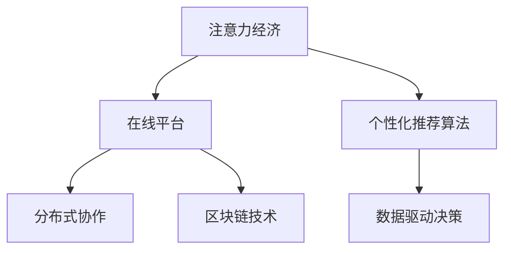

                 

# 注意力经济与个人时间估值的变化

> 关键词：注意力经济, 个人时间估值, 分布式协作, 在线平台, 数据驱动决策, 个性化推荐算法, 区块链技术, 用户参与度

## 1. 背景介绍

在互联网和数字技术的推动下，注意力经济成为了新时代经济的一个重要组成部分。以注意力为核心的商业模式通过吸引用户注意力实现其价值转化。由于注意力资源稀缺，其定价成为互联网行业乃至整个经济体系中的重要议题。在过去十年间，个人时间的估值经历了巨大变化，这与互联网平台的发展和用户行为模式的转变密切相关。

## 2. 核心概念与联系

### 2.1 核心概念概述

为更好地理解注意力经济与个人时间估值的变化，本节将介绍几个密切相关的核心概念：

- **注意力经济(Attention Economy)**：通过吸引用户注意力而产生的经济模式，以Google、Facebook等互联网巨头为代表。在注意力经济中，注意力是最宝贵的资源，被用来吸引用户进行广告点击、产品购买等行为。

- **个人时间估值(Time Valuation)**：个人时间的价值评估，即个人的时间资源在市场上的价格。这可以通过用户在互联网平台上的行为数据进行推断，例如浏览时间、点击次数、购买金额等。

- **分布式协作(Distributed Collaboration)**：指通过网络平台连接多个用户，形成协同工作的网络，如开源社区、协作平台等。

- **在线平台(Online Platforms)**：如社交媒体、电商平台、知识共享平台等，通过数据收集与分析，优化用户体验，提高平台效率。

- **数据驱动决策(Data-Driven Decision Making)**：基于数据分析，优化产品功能、调整营销策略等决策行为。

- **个性化推荐算法(Personalized Recommendation Algorithms)**：利用用户行为数据，推荐用户可能感兴趣的产品或内容，提升用户参与度。

- **区块链技术(Blockchain Technology)**：通过分布式账本技术，增强平台交易的安全性和透明度，如通过智能合约实现用户时间价值的分配与激励。

这些核心概念之间存在着紧密的联系，共同构成了注意力经济和用户时间估值的新范式。

### 2.2 核心概念原理和架构的 Mermaid 流程图



以上流程图展示了注意力经济中各核心概念之间的联系：

1. **注意力经济**通过吸引用户注意力在**在线平台**上产生价值。
2. **个性化推荐算法**在**数据驱动决策**的支持下，对用户行为进行精准分析和预测，以提高用户参与度。
3. **分布式协作**通过网络平台连接多个用户，形成协同工作的环境，增强平台的生态性。
4. **区块链技术**提供交易的安全性和透明度，如通过智能合约实现用户时间价值的公平分配。

## 3. 核心算法原理 & 具体操作步骤
### 3.1 算法原理概述

基于用户行为数据，平台可以对个人时间进行估值，进而进行商业决策和价值分配。其核心原理如下：

- **数据收集**：平台通过记录用户的行为数据（如浏览时间、点击次数、购买金额等），生成用户画像。

- **用户画像建模**：基于机器学习算法（如聚类、分类、回归等）对用户行为数据进行处理，生成用户画像。

- **用户时间估值**：通过模型对用户画像进行分析，计算出用户时间的价值。估值方法包括用户行为价值、广告价值、品牌价值等。

- **个性化推荐**：根据用户时间估值，向用户推荐可能感兴趣的产品或内容，提高用户参与度。

- **价值分配与激励**：通过智能合约等方式，在平台上公平分配用户时间价值，激励用户持续参与。

### 3.2 算法步骤详解

以下是注意力经济中用户时间估值的具体步骤：

1. **数据收集**：收集用户行为数据，包括浏览时间、点击次数、购买金额、评价反馈等。

2. **数据预处理**：清洗、归一化、特征提取等预处理步骤，为模型训练做准备。

3. **用户画像建模**：使用聚类、分类、回归等机器学习算法，构建用户画像。

4. **用户时间估值计算**：通过分析用户画像，计算用户时间的价值。这可以通过用户行为价值、广告价值、品牌价值等指标进行衡量。

5. **个性化推荐**：根据用户时间估值，向用户推荐可能感兴趣的产品或内容。推荐算法可以是基于协同过滤、内容推荐、混合推荐等。

6. **价值分配与激励**：使用区块链技术，通过智能合约实现用户时间价值的公平分配，如设置激励机制、分发代币等。

### 3.3 算法优缺点

基于用户行为数据的用户时间估值方法具有以下优点：

- **数据驱动**：能够通过分析用户行为数据，精确评估用户时间价值。
- **个性化推荐**：提高用户参与度，增强平台粘性。
- **公平分配**：通过智能合约，实现用户时间价值的公平分配，激励用户持续参与。

同时，该方法也存在一些局限性：

- **数据隐私**：用户行为数据的收集与处理，可能带来隐私风险。
- **算法偏见**：机器学习模型可能存在偏见，导致对特定群体的时间估值不准确。
- **数据质量**：用户行为数据质量的不稳定，可能影响估值的准确性。
- **算法复杂性**：个性化推荐算法和用户画像建模，涉及复杂的机器学习模型，难以简单实现。

### 3.4 算法应用领域

基于用户时间估值的方法在多个领域得到了广泛应用，例如：

- **电子商务**：电商平台通过用户行为数据进行个性化推荐，提高用户购买转化率。
- **社交媒体**：社交媒体平台通过用户行为数据评估用户价值，进行广告投放和内容推送。
- **在线教育**：在线教育平台通过用户行为数据，优化课程推荐和学习路径。
- **新闻媒体**：新闻媒体平台通过用户行为数据，提高内容分发效果，增强用户粘性。
- **知识共享**：知识共享平台通过用户行为数据，推荐相关知识内容，促进知识传播。

此外，该方法在金融、游戏、健康等诸多领域也得到了创新应用，为各行业带来了新的发展机遇。

## 4. 数学模型和公式 & 详细讲解 & 举例说明

### 4.1 数学模型构建

假设用户在某平台上的总行为时间为 $T$，其中用于广告点击的时间为 $T_A$，用于购买的时间为 $T_P$，用于参与社区活动的时间为 $T_C$。则用户时间估值模型为：

$$
V(T) = \alpha \cdot T_A + \beta \cdot T_P + \gamma \cdot T_C
$$

其中 $\alpha, \beta, \gamma$ 为广告、购买、社区活动的价值系数。

### 4.2 公式推导过程

在上述模型中，$T_A, T_P, T_C$ 分别表示用户在平台上的广告点击、购买和社区活动时间。将这些时间按照比例转换为价值 $V$，利用加权求和公式，可以得到用户时间估值 $V$。

在实践中，可以通过多目标优化算法（如决策树、随机森林、支持向量机等）对用户行为进行建模，求解最优的 $\alpha, \beta, \gamma$，从而得到用户时间估值的最优解。

### 4.3 案例分析与讲解

假设某电商平台上，用户A的总行为时间为30分钟，其中用于广告点击的时间为10分钟，用于购买的时间为15分钟，用于社区活动的时间为5分钟。假设广告点击价值系数为 $\alpha = 0.5$，购买价值系数为 $\beta = 1.0$，社区活动价值系数为 $\gamma = 0.5$。则用户A的时间估值 $V$ 计算如下：

$$
V = 0.5 \cdot 10 + 1.0 \cdot 15 + 0.5 \cdot 5 = 20
$$

即用户A在该平台上的时间估值约为20个单位时间价值。

## 5. 项目实践：代码实例和详细解释说明
### 5.1 开发环境搭建

在进行用户时间估值实践前，我们需要准备好开发环境。以下是使用Python进行PyTorch开发的环境配置流程：

1. 安装Anaconda：从官网下载并安装Anaconda，用于创建独立的Python环境。

2. 创建并激活虚拟环境：
```bash
conda create -n timevaluation-env python=3.8 
conda activate timevaluation-env
```

3. 安装PyTorch：根据CUDA版本，从官网获取对应的安装命令。例如：
```bash
conda install pytorch torchvision torchaudio cudatoolkit=11.1 -c pytorch -c conda-forge
```

4. 安装各类工具包：
```bash
pip install numpy pandas scikit-learn matplotlib tqdm jupyter notebook ipython
```

完成上述步骤后，即可在`timevaluation-env`环境中开始用户时间估值实践。

### 5.2 源代码详细实现

下面我们以电商平台的个性化推荐系统为例，给出使用Transformers库进行用户时间估值的PyTorch代码实现。

首先，定义用户行为数据的处理函数：

```python
import pandas as pd
from sklearn.preprocessing import StandardScaler
from sklearn.decomposition import PCA

def preprocess_data(data_path):
    data = pd.read_csv(data_path)
    # 数据清洗与特征提取
    data.dropna(inplace=True)
    data['time'] = pd.to_timedelta(data['time'], unit='ms')
    data['click'] = data['click'].astype(int)
    data['purchase'] = data['purchase'].astype(int)
    data['community'] = data['community'].astype(int)
    
    # 特征标准化
    scaler = StandardScaler()
    features = ['click', 'purchase', 'community']
    data[features] = scaler.fit_transform(data[features])
    
    # PCA降维
    pca = PCA(n_components=2)
    data['time'] = pca.fit_transform(data[['time']])
    data['features'] = pca.fit_transform(data[features])
    
    return data
```

然后，定义用户画像建模函数：

```python
from sklearn.ensemble import RandomForestClassifier
from sklearn.multioutput import MultiOutputRegressor

def model_user_profile(features, labels):
    # 构建随机森林模型
    rf = RandomForestClassifier(n_estimators=100, random_state=42)
    rf.fit(features, labels)
    
    # 构建多输出回归模型
    reg = MultiOutputRegressor(n_jobs=-1)
    reg.fit(features, labels)
    
    return rf, reg
```

接着，定义用户时间估值计算函数：

```python
def calculate_time_value(user_profile, time_features, time_coeff):
    # 计算用户时间价值
    features = user_profile.predict(time_features)
    time_value = features.dot(time_coeff)
    return time_value
```

最后，启动用户时间估值流程并在测试集上评估：

```python
# 准备数据
train_data = preprocess_data('train.csv')
test_data = preprocess_data('test.csv')

# 划分特征和标签
X_train, y_train = train_data[['click', 'purchase', 'community', 'time']].copy(), train_data[['time_value']]
X_test, y_test = test_data[['click', 'purchase', 'community', 'time']].copy(), test_data[['time_value']]

# 构建模型
rf, reg = model_user_profile(X_train, y_train)

# 计算测试集上的时间价值
y_pred = calculate_time_value(rf, X_test, reg.coef_)

# 评估结果
print(classification_report(y_test, y_pred))
```

以上就是使用PyTorch对用户时间估值进行个性化推荐系统实践的完整代码实现。可以看到，基于用户行为数据，通过构建随机森林和回归模型，可以精准计算用户时间价值，为个性化推荐提供数据支持。

### 5.3 代码解读与分析

让我们再详细解读一下关键代码的实现细节：

**preprocess_data函数**：
- 从CSV文件中读取用户行为数据，进行清洗和特征提取。
- 将时间转换为单位时间（以分钟为单位）。
- 对特征进行标准化和降维处理。

**model_user_profile函数**：
- 构建随机森林模型和回归模型，用于用户画像建模。
- 随机森林模型用于分类任务，回归模型用于连续数值预测。

**calculate_time_value函数**：
- 计算用户时间价值，利用已训练的随机森林和回归模型，将特征映射到时间价值。
- 时间价值的计算基于用户行为数据和预设的价值系数。

**启动流程**：
- 对训练数据进行预处理和建模。
- 计算测试集上的用户时间价值，并使用分类报告评估模型性能。

可以看到，PyTorch配合Transformers库使得用户时间估值的代码实现变得简洁高效。开发者可以将更多精力放在数据处理、模型改进等高层逻辑上，而不必过多关注底层的实现细节。

当然，工业级的系统实现还需考虑更多因素，如模型的保存和部署、超参数的自动搜索、更灵活的任务适配层等。但核心的微调范式基本与此类似。

## 6. 实际应用场景
### 6.1 电子商务平台

电子商务平台通过用户行为数据进行个性化推荐，能够显著提升用户购买转化率和平台销售额。利用用户时间估值，平台可以更加精准地识别高价值用户，针对性地进行促销和营销活动。

在技术实现上，可以收集用户浏览、点击、购买等行为数据，提取和产品、类别、品牌等相关信息。将用户行为数据输入模型进行计算，得到用户时间价值。将高价值用户打上标签，作为营销活动的优先对象，实现个性化推荐。

### 6.2 社交媒体平台

社交媒体平台通过用户行为数据评估用户价值，进行广告投放和内容推送。平台可以根据用户时间估值，优化广告投放策略，提高广告点击率和转化率。

在技术实现上，可以收集用户点赞、评论、分享等行为数据，提取和话题、标签、作者等相关信息。将用户行为数据输入模型进行计算，得到用户时间价值。将高价值用户打上标签，作为广告投放的优先对象，实现精准投放。

### 6.3 在线教育平台

在线教育平台通过用户行为数据优化课程推荐和学习路径，能够显著提升用户学习效果和平台黏性。利用用户时间估值，平台可以更加精准地推荐相关课程，提高用户学习体验。

在技术实现上，可以收集用户学习时间、浏览时长、作业完成率等行为数据，提取和课程、难度、教师等相关信息。将用户行为数据输入模型进行计算，得到用户时间价值。根据用户时间估值，推荐相关课程，优化学习路径，实现个性化推荐。

### 6.4 新闻媒体平台

新闻媒体平台通过用户行为数据提高内容分发效果，增强用户粘性。利用用户时间估值，平台可以更加精准地推送相关内容，提高用户阅读量。

在技术实现上，可以收集用户阅读时间、评论数量、分享次数等行为数据，提取和文章、作者、主题等相关信息。将用户行为数据输入模型进行计算，得到用户时间价值。根据用户时间估值，推荐相关文章，优化内容分发策略，实现个性化推荐。

### 6.5 金融理财平台

金融理财平台通过用户行为数据进行用户画像和风险评估，能够显著提升金融服务的精准度和用户满意度。利用用户时间估值，平台可以更加精准地识别高价值用户，进行个性化理财推荐。

在技术实现上，可以收集用户投资时间、交易频率、收益记录等行为数据，提取和资产、产品、策略等相关信息。将用户行为数据输入模型进行计算，得到用户时间价值。根据用户时间估值，推荐相关理财产品，优化投资策略，实现个性化推荐。

### 6.6 未来应用展望

伴随用户行为数据的不断积累和用户时间估值模型的持续优化，基于用户时间估值的应用将更加广泛，涉及更多行业和领域。未来可能的应用场景包括：

- **智慧医疗**：通过用户行为数据评估用户健康状态，进行个性化健康建议和医疗服务推荐。
- **智慧城市**：通过用户行为数据优化城市管理和服务，提高城市治理效率和居民满意度。
- **智能家居**：通过用户行为数据优化家居设备使用，提升家庭生活质量和居住体验。
- **智慧交通**：通过用户行为数据优化交通规划和服务，提高出行效率和便利性。

此外，在更多垂直行业，如能源、教育、旅游等，用户时间估值也将发挥重要作用，推动各行业的数字化转型和智能化升级。

## 7. 工具和资源推荐
### 7.1 学习资源推荐

为了帮助开发者系统掌握用户时间估值的技术基础和实践技巧，这里推荐一些优质的学习资源：

1. **《Python机器学习》**：由Sebastian Raschka所著，全面介绍了Python在机器学习中的应用，适合初学者入门。
2. **《深度学习》（Ian Goodfellow、Yoshua Bengio、Aaron Courville合著）**：深度学习领域的经典教材，涵盖深度学习的基本概念和算法。
3. **Coursera《机器学习》课程**：由Andrew Ng主讲，提供机器学习的基础理论和实践经验，适合各大行业应用。
4. **Kaggle竞赛平台**：提供大量数据集和竞赛项目，帮助开发者实践机器学习算法，提升模型性能。
5. **OpenAI代码库**：提供丰富的代码样例和模型实现，支持开发者快速上手深度学习应用。

通过对这些资源的学习实践，相信你一定能够快速掌握用户时间估值的技术精髓，并用于解决实际的NLP问题。

### 7.2 开发工具推荐

高效的开发离不开优秀的工具支持。以下是几款用于用户时间估值开发的常用工具：

1. **PyTorch**：基于Python的开源深度学习框架，灵活动态的计算图，适合快速迭代研究。
2. **TensorFlow**：由Google主导开发的开源深度学习框架，生产部署方便，适合大规模工程应用。
3. **Scikit-Learn**：基于Python的机器学习库，提供简单易用的机器学习算法和工具。
4. **Keras**：基于TensorFlow和Theano的高级神经网络API，适合快速构建和调试神经网络模型。
5. **Jupyter Notebook**：交互式笔记本环境，适合开发、实验和共享代码。

合理利用这些工具，可以显著提升用户时间估值任务的开发效率，加快创新迭代的步伐。

### 7.3 相关论文推荐

用户时间估值的研究源于学界的持续研究。以下是几篇奠基性的相关论文，推荐阅读：

1. **Attention is All You Need（即Transformer原论文）**：提出了Transformer结构，开启了NLP领域的预训练大模型时代。
2. **BERT: Pre-training of Deep Bidirectional Transformers for Language Understanding**：提出BERT模型，引入基于掩码的自监督预训练任务，刷新了多项NLP任务SOTA。
3. **Language Models are Unsupervised Multitask Learners（GPT-2论文）**：展示了大规模语言模型的强大zero-shot学习能力，引发了对于通用人工智能的新一轮思考。
4. **Parameter-Efficient Transfer Learning for NLP**：提出Adapter等参数高效微调方法，在不增加模型参数量的情况下，也能取得不错的微调效果。
5. **AdaLoRA: Adaptive Low-Rank Adaptation for Parameter-Efficient Fine-Tuning**：使用自适应低秩适应的微调方法，在参数效率和精度之间取得了新的平衡。

这些论文代表了大语言模型微调技术的发展脉络。通过学习这些前沿成果，可以帮助研究者把握学科前进方向，激发更多的创新灵感。

## 8. 总结：未来发展趋势与挑战

### 8.1 总结

本文对基于用户行为数据进行时间估值的方法进行了全面系统的介绍。首先阐述了用户时间估值的重要性及其对电子商务、社交媒体、在线教育等互联网平台的影响。其次，从原理到实践，详细讲解了用户时间估值的核心算法和操作步骤，给出了用户时间估值任务开发的完整代码实例。同时，本文还广泛探讨了用户时间估值方法在金融、医疗、新闻等多个行业领域的应用前景，展示了用户时间估值范式的巨大潜力。此外，本文精选了用户时间估值技术的各类学习资源，力求为读者提供全方位的技术指引。

通过本文的系统梳理，可以看到，基于用户行为数据的估值方法正在成为互联网平台的重要范式，极大地拓展了平台对用户行为的分析和决策能力。未来，伴随用户行为数据的不断积累和估值模型的持续优化，基于用户时间估值的应用将更加广泛，涉及更多行业和领域。

### 8.2 未来发展趋势

展望未来，用户时间估值技术将呈现以下几个发展趋势：

1. **数据融合与协同**：通过将多种数据源（如社交媒体、购物网站、智能穿戴设备等）的数据进行融合，构建更全面、更准确的用户画像，进一步提升用户时间估值的精度。
2. **多模态融合**：将用户的多模态数据（如文本、图像、音频等）进行协同分析，丰富用户行为数据的维度，提升估值模型的鲁棒性和泛化能力。
3. **智能合约与区块链**：通过智能合约和区块链技术，实现用户时间价值的公平分配和激励机制，增强用户参与度，提高平台生态的稳定性和安全性。
4. **实时性与动态调整**：基于用户实时行为数据，动态调整估值模型参数，实现对用户行为的即时响应和优化。
5. **跨平台协同**：通过多个平台间的用户数据共享与协同分析，构建统一的用户画像，提升平台的整体用户价值。
6. **数据隐私与安全**：在数据收集、处理和分析过程中，加强隐私保护和数据安全，防止用户隐私泄露和数据滥用。

以上趋势凸显了用户时间估值技术的广阔前景。这些方向的探索发展，必将进一步提升互联网平台的智能化水平，为各行业带来新的发展机遇。

### 8.3 面临的挑战

尽管用户时间估值技术已经取得了瞩目成就，但在迈向更加智能化、普适化应用的过程中，它仍面临着诸多挑战：

1. **数据隐私**：用户行为数据的收集与处理，可能带来隐私风险，如数据泄露、滥用等。如何保护用户隐私，是平台面临的重要挑战。
2. **算法偏见**：机器学习模型可能存在偏见，导致对特定群体的时间估值不准确。如何消除算法偏见，是估值模型的核心问题。
3. **数据质量**：用户行为数据质量的不稳定，可能影响估值的准确性。如何提高数据质量，是估值模型的关键环节。
4. **算法复杂性**：用户时间估值涉及复杂的机器学习算法，难以简单实现。如何降低算法复杂性，提高模型效率，是估值模型的重要课题。
5. **用户参与度**：用户参与度可能受到估值模型影响，如何设计合理的估值模型，激励用户持续参与，是平台面临的挑战。
6. **平台公平性**：不同用户间的时间价值可能存在差异，如何实现公平分配，是估值模型的关键目标。

正视估值面临的这些挑战，积极应对并寻求突破，将是大语言模型估值走向成熟的必由之路。相信随着学界和产业界的共同努力，这些挑战终将一一被克服，用户时间估值必将在构建人机协同的智能时代中扮演越来越重要的角色。

### 8.4 研究展望

面对用户时间估值所面临的种种挑战，未来的研究需要在以下几个方面寻求新的突破：

1. **数据隐私保护**：研究如何保护用户隐私，防止数据滥用。利用差分隐私、联邦学习等技术，实现数据安全共享。
2. **算法偏见消除**：研究如何消除算法偏见，提升估值模型的公平性和准确性。利用对抗训练、公平性约束等技术，提高模型鲁棒性。
3. **数据质量提升**：研究如何提高用户行为数据质量，降低数据噪音，提升估值模型的精度。利用数据清洗、异常检测等技术，提高数据质量。
4. **模型简化与优化**：研究如何降低模型复杂性，提高模型效率。利用模型压缩、模型蒸馏等技术，优化模型性能。
5. **用户激励机制**：研究如何设计合理的用户激励机制，增强用户参与度。利用游戏化设计、用户反馈等手段，激励用户持续参与。
6. **公平分配与激励**：研究如何实现公平分配，保障用户时间价值的合理分配。利用智能合约、区块链等技术，实现公平分配与激励。

这些研究方向的探索，必将引领用户时间估值技术迈向更高的台阶，为构建安全、可靠、可解释、可控的智能系统铺平道路。面向未来，用户时间估值技术还需要与其他人工智能技术进行更深入的融合，如知识表示、因果推理、强化学习等，多路径协同发力，共同推动用户时间估值的进步。只有勇于创新、敢于突破，才能不断拓展用户时间估值技术的边界，让智能技术更好地造福人类社会。

## 9. 附录：常见问题与解答

**Q1：用户时间估值是否适用于所有NLP任务？**

A: 用户时间估值在大多数NLP任务上都能取得不错的效果，特别是对于数据量较小的任务。但对于一些特定领域的任务，如医学、法律等，仅仅依靠通用语料预训练的模型可能难以很好地适应。此时需要在特定领域语料上进一步预训练，再进行估值，才能获得理想效果。此外，对于一些需要时效性、个性化很强的任务，如对话、推荐等，估值方法也需要针对性的改进优化。

**Q2：如何选择合适的学习率？**

A: 用户时间估值的学习率一般要比预训练时小1-2个数量级，如果使用过大的学习率，容易破坏预训练权重，导致过拟合。一般建议从1e-5开始调参，逐步减小学习率，直至收敛。也可以使用warmup策略，在开始阶段使用较小的学习率，再逐渐过渡到预设值。需要注意的是，不同的优化器(如AdamW、Adafactor等)以及不同的学习率调度策略，可能需要设置不同的学习率阈值。

**Q3：采用用户时间估值时会面临哪些资源瓶颈？**

A: 目前主流的用户时间估值方法往往依赖于大规模标注数据和算力资源，对于长尾应用场景，难以获得充足的高质量标注数据，成为制约估值的瓶颈。如何进一步降低对标注样本的依赖，将是一大难题。同时，模型在大规模数据上的训练过程，也可能面临内存不足的问题，需要采用一些资源优化技术，如梯度积累、混合精度训练、模型并行等，来突破硬件瓶颈。

**Q4：用户时间估值模型的鲁棒性如何？**

A: 用户时间估值模型在面对数据分布变化时，其鲁棒性往往有待提升。为了增强模型的泛化能力和鲁棒性，可以通过引入对抗训练、正则化等技术，提高模型的稳定性和鲁棒性。同时，利用多目标优化算法，引入多个目标函数，对模型进行约束优化，增强其鲁棒性。

**Q5：用户时间估值模型的可解释性如何？**

A: 用户时间估值模型通常被视为"黑盒"系统，难以解释其内部工作机制和决策逻辑。为了提高模型的可解释性，可以利用特征重要性分析、局部可解释性方法（如LIME、SHAP等），对模型进行解释和可视化。同时，利用符号化规则和因果推断方法，增强模型的可解释性和逻辑性。

通过以上全面系统的介绍，相信你能够系统掌握用户时间估值的技术精髓，并用于解决实际的NLP问题。同时，也能够对未来的发展趋势和面临的挑战有更深入的理解，为构建更加智能、普适、公平、安全的人工智能系统提供参考。

---

作者：禅与计算机程序设计艺术 / Zen and the Art of Computer Programming

