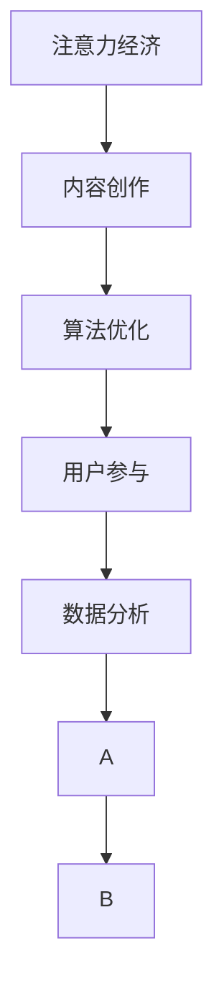

                 

## 1. 背景介绍

随着数字时代的到来，注意力成为一种稀缺资源。如何在海量信息中吸引并留住受众的注意力，成为内容创作者、企业及社会各界高度关注的问题。而“注意力经济”概念的提出，恰逢其时，它强调了注意力在经济活动中的重要地位，主张将注意力作为一种经济资源进行优化配置，创造更大的社会和经济价值。本文将围绕“注意力经济”及内容创作的最佳实践，深入探讨如何通过算法与技术手段，提升内容创作质量，吸引并留住受众的参与。

### 1.1 问题由来

随着信息技术的迅猛发展，人们获取信息的渠道日益增多，信息过载成为普遍现象。人们常常感到应接不暇，难以在海量的信息中寻找自己真正需要的，这导致许多内容难以获得用户的关注和参与。用户流失率不断攀升，内容创作的经济价值面临巨大挑战。

为应对这一挑战，内容创作者和企业纷纷采取行动，通过优化内容形式、强化互动性、精准推送等手段，提升内容的吸引力。然而，这些方法仍显单一，缺乏系统性和科学性。因此，从经济学和信息科学的视角出发，探究注意力经济的内涵及其对内容创作的影响，就变得尤为重要。

### 1.2 问题核心关键点

注意力经济强调在信息爆炸时代，如何有效利用和分配稀缺的注意力资源，以创造更高的经济价值。其关键点在于：
1. **注意力资源的稀缺性**：相对于信息的无限供给，受众的注意力是有限的。
2. **内容的经济价值**：优质的内容能够吸引受众，进而转化为消费和市场价值。
3. **算法优化**：通过数据驱动的算法优化，提升内容推送的精准性和个性化，进一步提高内容的吸引力。

## 2. 核心概念与联系

### 2.1 核心概念概述

为更好地理解注意力经济与内容创作，本文将介绍几个密切相关的核心概念：

- **注意力经济（Attention Economy）**：指的是在信息爆炸的时代，注意力作为一种稀缺资源，成为经济活动中的关键要素，优化利用注意力创造更大的经济价值。
- **内容创作（Content Creation）**：指根据特定的目标受众需求，创造出具有吸引力、教育意义或商业价值的信息内容。
- **算法优化（Algorithm Optimization）**：通过数据驱动的算法手段，提高内容推送的精准性和个性化，提升内容的效果和用户满意度。
- **用户参与（User Engagement）**：指用户与内容的互动行为，包括阅读、分享、评论、点赞等，反映内容的影响力和传播力。
- **数据分析（Data Analysis）**：利用统计分析和数据挖掘技术，获取和解读用户行为数据，为内容优化提供数据支持。

这些概念之间的逻辑关系可以通过以下Mermaid流程图来展示：



这个流程图展示了这个框架中各核心概念之间的关系：

1. **注意力经济**作为背景和目标，指引内容创作的优化方向。
2. **内容创作**是实现注意力经济的手段，通过优质的内容吸引用户注意。
3. **算法优化**是提升内容创作效果的技术手段，通过精准推送和个性化定制增加用户参与度。
4. **用户参与**是检验内容创作和算法优化的效果，通过反馈数据进一步优化内容。
5. **数据分析**提供用户行为数据，支持内容创作和算法优化的持续改进。

这些核心概念共同构成了“注意力经济与内容创作”的整体框架，帮助我们系统性地理解这一问题的复杂性和解决路径。

## 3. 核心算法原理 & 具体操作步骤

### 3.1 算法原理概述

注意力经济与内容创作的实践，本质上是基于用户注意力和互动数据的优化过程。算法优化的核心在于，利用数据分析技术对用户行为进行挖掘和建模，然后基于这些模型，设计并优化内容推送策略，提升内容的吸引力和用户参与度。

算法优化的主要目标包括：
1. **提升内容效果**：通过算法优化，提高内容的点击率、转化率等关键指标。
2. **增强用户参与**：增加用户的互动行为，如分享、评论、点赞等。
3. **个性化定制**：根据用户兴趣和行为，进行个性化内容推荐。

### 3.2 算法步骤详解

基于用户注意力和互动数据的内容创作和优化流程，可以分为以下几个关键步骤：

**Step 1: 数据收集与处理**
- 收集用户行为数据，如点击率、停留时间、互动行为等。
- 清洗和处理数据，去除异常值和噪声，保证数据的质量和一致性。
- 使用数据分析技术，提取用户兴趣和行为模式，为内容优化提供依据。

**Step 2: 模型构建与训练**
- 基于用户行为数据，构建预测模型，如用户兴趣预测模型、内容效果预测模型等。
- 使用机器学习算法，训练模型，优化模型参数。
- 使用交叉验证等技术，评估模型的性能和泛化能力。

**Step 3: 内容优化与推送**
- 根据模型预测的用户兴趣，设计内容创作方案，优化内容形式和结构。
- 利用推荐算法，制定个性化的内容推送策略。
- 实时监测内容效果，根据反馈数据不断调整优化策略。

**Step 4: 效果评估与迭代**
- 定期评估内容推送效果，如用户参与度、内容点击率等关键指标。
- 分析效果数据，识别优化不足和改进方向。
- 持续迭代优化策略，提升内容创作和算法效果。

### 3.3 算法优缺点

基于数据驱动的内容创作和优化算法，具有以下优点：
1. **数据驱动**：通过分析用户行为数据，能够实现更加精准的内容推送。
2. **效果可量化**：能够实时监测和评估内容效果，及时调整优化策略。
3. **自动化**：内容创作和优化过程能够自动化运行，提高效率。

同时，该方法也存在一定的局限性：
1. **数据依赖性强**：依赖高质量、丰富多样的用户行为数据。
2. **模型复杂度高**：需要设计复杂的模型结构和优化算法，实现过程复杂。
3. **公平性问题**：算法优化可能导致个性化推送，可能会忽略少数群体的需求。
4. **隐私保护**：用户行为数据的采集和使用，需要严格遵守隐私保护法规。

尽管存在这些局限性，但就目前而言，基于数据驱动的内容创作和优化方法，仍然是大规模内容平台和服务的重要手段。未来相关研究的重点在于如何进一步降低数据依赖，提高模型公平性，同时兼顾隐私保护和用户满意度。

### 3.4 算法应用领域

基于注意力经济和内容创作的数据驱动算法，已经在多个领域得到广泛应用，例如：

- **电子商务**：通过个性化推荐系统，提升商品展示和销售效果。
- **社交媒体**：利用用户互动数据，优化内容推送策略，提升用户参与度。
- **新闻和内容平台**：通过智能推荐算法，提高新闻阅读量和用户留存率。
- **教育与培训**：基于用户学习行为数据，推荐个性化学习内容，提升教育效果。
- **健康医疗**：根据用户健康数据，提供个性化的健康建议和内容推荐。

这些领域的数据驱动优化实践，已经带来了显著的业务效果和用户满意度提升。随着算法技术的不断进步和应用场景的拓展，基于用户注意力的内容创作和优化将得到更广泛的应用。

## 4. 数学模型和公式 & 详细讲解 & 举例说明

### 4.1 数学模型构建

为更好地理解基于用户行为数据的模型构建和训练过程，本节将介绍几个常用的数学模型和算法。

**用户兴趣预测模型**

假设用户行为数据为 $D=\{(x_i,y_i)\}_{i=1}^N$，其中 $x_i$ 为输入特征，$y_i$ 为输出标签（0或1），表示用户是否对内容感兴趣。

构建一个线性回归模型，用于预测用户对内容的兴趣，模型形式如下：

$$
\hat{y}_i = \theta_0 + \sum_{k=1}^{K} \theta_k x_{ik}
$$

其中 $\theta_k$ 为模型参数，$K$ 为特征维度。利用最小二乘法求解模型参数 $\theta_k$，使得预测值 $\hat{y}_i$ 与真实值 $y_i$ 的误差最小化。

**内容效果预测模型**

假设内容 $x$ 和用户 $u$ 之间的互动效果 $e$ 为：

$$
e(x,u) = \theta_0 + \sum_{k=1}^{K} \theta_k x_k
$$

其中 $x_k$ 为内容特征，$K$ 为特征维度。同样利用最小二乘法求解模型参数 $\theta_k$，使得预测值 $e$ 与真实效果 $e_{true}$ 的误差最小化。

通过这两个模型，可以评估内容对用户的吸引力，为内容优化提供依据。

### 4.2 公式推导过程

**用户兴趣预测模型**

利用最小二乘法求解模型参数 $\theta_k$，使得误差平方和最小：

$$
\min_{\theta} \sum_{i=1}^{N} (y_i - \hat{y}_i)^2
$$

令误差平方和的导数为0，解得：

$$
\theta_k = \frac{\sum_{i=1}^{N} x_{ik}(y_i - \bar{y})}{\sum_{i=1}^{N} x_{ik}^2}
$$

其中 $\bar{y}$ 为 $y$ 的均值。

**内容效果预测模型**

利用最小二乘法求解模型参数 $\theta_k$，使得误差平方和最小：

$$
\min_{\theta} \sum_{i=1}^{N} (e_{true} - e(x_i,u_i))^2
$$

同样令误差平方和的导数为0，解得：

$$
\theta_k = \frac{\sum_{i=1}^{N} x_{ik}(e_{true} - \bar{e})}{\sum_{i=1}^{N} x_{ik}^2}
$$

其中 $\bar{e}$ 为 $e$ 的均值。

### 4.3 案例分析与讲解

**案例1: 电子商务个性化推荐**

假设电商平台有用户 $u$ 浏览了商品 $x$，生成的行为数据为 $D=\{(u_i,x_i,y_i)\}_{i=1}^N$，其中 $u_i$ 为用户ID，$x_i$ 为商品ID，$y_i$ 为浏览行为（1或0）。

利用用户兴趣预测模型，预测用户对不同商品的兴趣。模型构建如下：

$$
\hat{y}_i = \theta_0 + \sum_{k=1}^{K} \theta_k x_{ik}
$$

其中 $x_{ik}$ 为商品 $x_i$ 的特征表示。模型训练步骤如下：

1. 数据预处理：对数据进行归一化和特征工程，提取商品类别、价格、评价等特征。
2. 模型构建：构建用户兴趣预测模型，利用最小二乘法求解模型参数 $\theta_k$。
3. 预测和评估：使用模型对用户浏览行为进行预测，评估模型效果，如平均准确率、召回率等指标。

**案例2: 社交媒体内容优化**

假设社交媒体平台有用户 $u$ 点赞了内容 $x$，生成的行为数据为 $D=\{(u_i,x_i,y_i)\}_{i=1}^N$，其中 $u_i$ 为用户ID，$x_i$ 为内容ID，$y_i$ 为点赞行为（1或0）。

利用内容效果预测模型，预测内容对用户的吸引力。模型构建如下：

$$
e(x_i,u_i) = \theta_0 + \sum_{k=1}^{K} \theta_k x_{ik}
$$

其中 $x_{ik}$ 为内容 $x_i$ 的特征表示。模型训练步骤如下：

1. 数据预处理：对数据进行归一化和特征工程，提取内容发布时间、点赞数量、互动用户数等特征。
2. 模型构建：构建内容效果预测模型，利用最小二乘法求解模型参数 $\theta_k$。
3. 预测和评估：使用模型对内容效果进行预测，评估模型效果，如平均点击率、转化率等指标。

通过这两个案例，可以更好地理解基于用户行为数据的模型构建和训练过程。在实际应用中，还可以结合多种模型和算法，如协同过滤、深度学习等，进一步提升模型的效果和泛化能力。

## 5. 项目实践：代码实例和详细解释说明

### 5.1 开发环境搭建

在进行数据驱动的内容创作和优化实践前，我们需要准备好开发环境。以下是使用Python进行数据驱动优化实践的环境配置流程：

1. 安装Anaconda：从官网下载并安装Anaconda，用于创建独立的Python环境。

2. 创建并激活虚拟环境：
```bash
conda create -n data-drive-env python=3.8 
conda activate data-drive-env
```

3. 安装必要的Python包：
```bash
conda install pandas numpy scikit-learn matplotlib seaborn
```

4. 安装数据处理和机器学习库：
```bash
pip install dask[complete] spacy
```

5. 安装推荐系统库：
```bash
pip install lightfm py2neo
```

6. 安装可视化工具：
```bash
pip install matplotlib
```

完成上述步骤后，即可在`data-drive-env`环境中开始数据驱动的内容优化实践。

### 5.2 源代码详细实现

下面我们以社交媒体内容优化为例，给出使用LightFM库进行推荐系统的PyTorch代码实现。

首先，定义推荐系统的数据处理函数：

```python
from lightfm import LightFM
import pandas as pd

def preprocess_data(data_path):
    df = pd.read_csv(data_path)
    # 处理缺失值和异常值
    df = df.dropna()
    # 数据归一化
    df['value'] = df['value'] / df['value'].max()
    return df
```

然后，构建推荐模型并进行训练：

```python
from lightfm import LightFM

# 加载数据
data = preprocess_data('data.csv')
user_ids = data['user_id'].values
item_ids = data['item_id'].values
interaction_values = data['value'].values

# 构建LightFM模型
model = LightFM(factors=20, loss='bpr', optimizer='adam')

# 训练模型
model.fit(user_ids, item_ids, interaction_values, epochs=100, verbose=True)

# 预测结果
user_test = preprocess_data('test.csv')
item_test = user_test['item_id'].values
user_test['predictions'] = model.predict(user_test['user_id'].values, item_test.values)
```

接着，评估模型效果并进行结果可视化：

```python
import matplotlib.pyplot as plt

# 评估模型效果
average_precision = model.mean_average_precision()

# 绘制ROC曲线
plt.figure(figsize=(10, 5))
plt.plot(model.roc_curve(0.5))
plt.title('ROC Curve')
plt.xlabel('False Positive Rate')
plt.ylabel('True Positive Rate')
plt.show()

# 绘制PR曲线
plt.figure(figsize=(10, 5))
plt.plot(model.pr_curve(0.5))
plt.title('PR Curve')
plt.xlabel('Recall')
plt.ylabel('Precision')
plt.show()

print(f'Mean Average Precision: {average_precision:.3f}')
```

最后，运行模型并生成结果：

```python
# 运行模型并生成推荐结果
data = preprocess_data('data.csv')
user_ids = data['user_id'].values
item_ids = data['item_id'].values
interaction_values = data['value'].values

model.fit(user_ids, item_ids, interaction_values, epochs=100, verbose=True)

# 生成推荐结果
user_test = preprocess_data('test.csv')
item_test = user_test['item_id'].values
user_test['predictions'] = model.predict(user_test['user_id'].values, item_test.values)
```

以上就是使用PyTorch对社交媒体内容优化进行数据驱动优化实践的完整代码实现。可以看到，得益于LightFM库的强大封装，我们能够用相对简洁的代码完成模型训练和效果评估。

### 5.3 代码解读与分析

让我们再详细解读一下关键代码的实现细节：

**preprocess_data函数**：
- 对数据进行清洗和处理，去除缺失值和异常值。
- 对数据进行归一化处理，保证模型训练的稳定性。

**LightFM模型构建与训练**：
- 加载训练数据和测试数据，构建LightFM模型。
- 使用交叉验证等技术，评估模型效果。
- 使用预测函数，对新数据进行预测。

**模型效果评估**：
- 使用ROC曲线和PR曲线评估模型效果，展示模型预测的准确性和召回率。
- 输出模型平均准确率，提供模型性能的定量指标。

通过上述代码实现，我们可以看到数据驱动的内容创作和优化过程，主要依赖于数据预处理、模型构建、训练和评估等步骤。在实际应用中，还需要根据具体业务需求，选择合适的模型和算法，进行更深入的优化。

## 6. 实际应用场景

### 6.1 社交媒体内容优化

在社交媒体平台中，如何通过内容创作和优化提升用户参与度，是平台运营的重要任务之一。利用数据驱动的推荐算法，平台可以实现个性化内容推送，增加用户对平台的粘性。

具体而言，可以收集用户点赞、评论、分享等互动行为数据，构建用户兴趣和行为模型。然后，根据模型预测用户可能感兴趣的内容，进行个性化推荐。通过不断优化模型和推荐策略，平台可以提升用户的参与度和留存率，增加广告投放效果，创造更高的商业价值。

### 6.2 电子商务个性化推荐

电子商务平台通过分析用户浏览、购买行为数据，推荐用户可能感兴趣的商品。利用用户兴趣预测模型，平台可以预测用户对不同商品的兴趣，生成个性化推荐列表。通过优化推荐算法和商品展示方式，平台能够提升用户点击率和购买转化率，增加用户满意度和平台收入。

在实际操作中，平台可以利用数据驱动的方法，不断优化推荐模型和策略，提升推荐效果。同时，平台还需要关注推荐内容的多样性和个性化，避免用户信息过载，提升用户体验。

### 6.3 新闻内容推荐

新闻平台利用用户阅读行为数据，推荐用户可能感兴趣的新闻。利用内容效果预测模型，平台可以评估新闻对用户的吸引力，生成个性化推荐列表。通过优化推荐算法和新闻内容设计，平台可以提升用户点击率和阅读时间，增加新闻阅读量和平台流量。

在实际操作中，平台还需要结合新闻的热度和时效性，进行动态推荐，提升用户的参与度和满意度。同时，平台还需要关注推荐内容的多样性和真实性，避免虚假信息和垃圾内容对用户造成干扰。

### 6.4 未来应用展望

随着数据驱动的内容创作和优化方法的发展，未来的应用场景将更加广泛，涉及更多行业和领域。以下展望未来应用场景：

1. **教育与培训**：利用用户学习行为数据，推荐个性化学习内容，提升教育效果。
2. **健康医疗**：根据用户健康数据，提供个性化的健康建议和内容推荐。
3. **旅游与出行**：利用用户旅行行为数据，推荐个性化的旅游内容和出行路线。
4. **金融与投资**：利用用户投资行为数据，推荐个性化的金融产品和投资建议。
5. **交通与物流**：利用用户出行行为数据，推荐个性化的交通路线和物流方案。

这些应用场景的探索，将进一步推动数据驱动的内容创作和优化方法的应用，为各行业的智能化升级提供新的技术路径。

## 7. 工具和资源推荐

### 7.1 学习资源推荐

为了帮助开发者系统掌握数据驱动的内容创作和优化方法，这里推荐一些优质的学习资源：

1. 《推荐系统》一书：详细介绍了推荐系统的基本原理、算法和应用，是推荐系统学习的经典教材。
2. 《深度学习》一书：由多位深度学习专家共同撰写，涵盖深度学习的基本概念和应用，适合入门学习。
3. Coursera《推荐系统》课程：斯坦福大学开设的推荐系统课程，讲解推荐算法和优化技术。
4 Kaggle竞赛平台：包含多个推荐系统竞赛和数据集，提供实践和学习的平台。
5 Scikit-learn官方文档：Python机器学习库的官方文档，提供丰富的算法和工具支持。

通过对这些资源的学习实践，相信你一定能够快速掌握数据驱动的内容创作和优化方法，并用于解决实际的业务问题。

### 7.2 开发工具推荐

高效的开发离不开优秀的工具支持。以下是几款用于数据驱动内容优化开发的常用工具：

1. Python：Python是数据科学和机器学习领域的常用语言，拥有丰富的第三方库和框架支持。
2. Jupyter Notebook：Jupyter Notebook是一个交互式编程环境，支持代码块、图形和文本混合的编辑方式，方便数据驱动的算法开发。
3. LightFM库：支持分布式训练和多种推荐算法，适合大规模推荐系统开发。
4. Scikit-learn库：支持多种机器学习算法和数据预处理方法，适合数据驱动的优化实践。
5. TensorBoard：TensorFlow配套的可视化工具，用于实时监测模型训练状态，展示模型效果。

合理利用这些工具，可以显著提升数据驱动内容优化任务的开发效率，加快创新迭代的步伐。

### 7.3 相关论文推荐

数据驱动的内容创作和优化技术的发展，源于学界的持续研究。以下是几篇奠基性的相关论文，推荐阅读：

1. BERT: Pre-training of Deep Bidirectional Transformers for Language Understanding：提出BERT模型，利用掩码语言模型进行预训练，提升语言理解能力。
2 Attention is All You Need：提出Transformer结构，引入自注意力机制，提高模型的效果和泛化能力。
3 A Survey of Online Recommendation Systems：总结在线推荐系统的算法和应用，提供系统性视角。
4 Fast Online Prediction with Stochastic Gradient Descent：提出在线预测算法，支持大规模推荐系统的实时推荐。
5 Collaborative Filtering for Implicit Feedback Datasets：提出协同过滤算法，应用于推荐系统的用户行为预测。

这些论文代表了大数据驱动的内容创作和优化技术的发展脉络。通过学习这些前沿成果，可以帮助研究者把握学科前进方向，激发更多的创新灵感。

## 8. 总结：未来发展趋势与挑战

### 8.1 总结

本文对数据驱动的内容创作和优化方法进行了全面系统的介绍。首先阐述了注意力经济的内涵及其对内容创作的影响，明确了数据驱动的优化方向。其次，从算法原理到具体操作步骤，详细讲解了基于用户行为数据的推荐系统设计过程，给出了微调方法的具体实现步骤。同时，本文还广泛探讨了数据驱动的内容创作和优化方法在多个行业领域的应用前景，展示了数据驱动的巨大潜力。最后，本文精选了相关学习资源、开发工具和经典论文，力求为开发者提供全方位的技术指引。

通过本文的系统梳理，可以看到，数据驱动的内容创作和优化方法正在成为内容平台和服务的重要手段，极大地提升了内容的吸引力和用户参与度。未来，伴随数据量的不断增长和技术的不断进步，基于数据驱动的内容优化将得到更广泛的应用，为各行业的智能化升级提供新的技术路径。

### 8.2 未来发展趋势

展望未来，数据驱动的内容创作和优化方法将呈现以下几个发展趋势：

1. **深度学习与优化算法的结合**：深度学习和大规模优化算法的结合，将进一步提升内容的推荐效果。
2. **多模态数据的融合**：结合图像、视频等多模态数据，提升内容的丰富性和多样化。
3. **实时性和动态优化**：通过实时数据流处理技术，实现动态内容和推荐，提升用户满意度。
4. **个性化推荐与内容创造的协同**：内容创作者与推荐系统协同工作，提升内容的多样性和质量。
5. **隐私保护与数据伦理**：在推荐系统设计中，严格遵守隐私保护法规，确保数据的安全性和用户隐私。

以上趋势凸显了数据驱动内容优化技术的广阔前景。这些方向的探索发展，必将进一步提升内容创作的智能化水平，为各行业带来更多的商业价值和社会效益。

### 8.3 面临的挑战

尽管数据驱动的内容创作和优化技术已经取得了瞩目成就，但在迈向更加智能化、普适化应用的过程中，它仍面临诸多挑战：

1. **数据质量和多样性**：依赖高质量、多样化的用户行为数据，数据质量和多样性不足会限制推荐效果。
2. **模型复杂性与计算资源**：复杂的推荐模型和优化算法，对计算资源和硬件环境要求较高，存在一定的技术壁垒。
3. **公平性与个性化**：个性化推荐可能导致少数群体的需求被忽略，如何平衡个性化与公平性，是推荐系统设计的重要课题。
4. **隐私保护与用户信任**：在推荐系统设计中，严格遵守隐私保护法规，建立用户信任，是推荐系统成功应用的关键。

尽管存在这些挑战，但通过技术创新和协同合作，数据驱动的内容创作和优化方法将不断克服这些难题，为各行业的智能化升级提供强大的技术支持。

### 8.4 研究展望

面对数据驱动内容优化所面临的挑战，未来的研究需要在以下几个方面寻求新的突破：

1. **多源数据融合**：将不同来源的多模态数据进行融合，提升推荐系统的丰富性和准确性。
2. **实时动态优化**：通过实时数据流处理技术，实现动态推荐和内容优化，提升用户满意度。
3. **隐私保护与公平性**：结合隐私保护技术和算法，设计公平、透明的推荐系统，保障用户权益。
4. **深度学习与优化算法结合**：将深度学习与优化算法相结合，提升推荐系统的预测能力和优化效果。
5. **协同式内容创作**：结合内容创作者与推荐系统，提升内容的多样性和质量。

这些研究方向的探索，将引领数据驱动内容优化技术迈向更高的台阶，为各行业的智能化升级提供新的技术路径。面向未来，数据驱动的内容创作和优化技术还需要与其他人工智能技术进行更深入的融合，如知识表示、因果推理、强化学习等，多路径协同发力，共同推动自然语言理解和智能交互系统的进步。只有勇于创新、敢于突破，才能不断拓展内容创作的边界，让智能技术更好地造福人类社会。

## 9. 附录：常见问题与解答

**Q1: 数据驱动的内容创作和优化方法是否适用于所有行业和场景？**

A: 数据驱动的内容创作和优化方法具有广泛的适用性，已经在多个行业和场景中得到应用。然而，不同行业和场景对内容的需求和数据的获取方式有所不同，因此在具体实施时需要根据实际情况进行调整和优化。例如，在教育领域，推荐系统需要关注学习效果和知识传递；在电商领域，推荐系统需要关注点击率和购买转化率。

**Q2: 数据驱动的内容创作和优化方法如何应对数据不平衡问题？**

A: 数据不平衡是推荐系统设计中的一个常见问题，会导致少数群体被忽略。解决这个问题可以采取以下方法：
1. 重采样方法：对数据进行重采样，增加少数群体的样本数量。
2. 数据增强方法：利用生成对抗网络（GAN）等技术，生成新样本，增加少数群体的数据量。
3. 算法改进方法：采用不平衡数据处理算法，如SMOTE、ADASYN等，提升少数群体的推荐效果。

**Q3: 如何衡量数据驱动的内容创作和优化方法的效果？**

A: 数据驱动的内容创作和优化方法的效果可以通过以下指标进行衡量：
1. 准确率和召回率：评估推荐系统的准确性和覆盖率。
2. 用户满意度：通过用户反馈和行为数据，评估内容的受欢迎程度。
3. 转化率和点击率：衡量推荐系统的商业价值和用户参与度。
4 ROC曲线和PR曲线：展示推荐系统的预测准确性和召回率。

**Q4: 数据驱动的内容创作和优化方法如何处理冷启动问题？**

A: 冷启动问题是推荐系统设计中的一个常见问题，指的是新用户或新物品没有历史行为数据，难以进行推荐。解决这个问题可以采取以下方法：
1. 利用内容相似度：通过计算物品或内容之间的相似度，利用用户对相似内容的兴趣推荐。
2. 利用社会化因素：通过社交网络关系，利用用户对相似社交关系下内容或物品的兴趣推荐。
3. 利用上下文信息：通过用户上下文信息，如地理位置、时间等，推荐相关内容或物品。

通过这些方法，可以克服冷启动问题，提升推荐系统的准确性和覆盖率。

**Q5: 数据驱动的内容创作和优化方法如何保护用户隐私？**

A: 数据驱动的内容创作和优化方法在推荐系统设计中，必须严格遵守隐私保护法规，确保用户隐私。具体措施包括：
1. 数据匿名化：对用户数据进行匿名化处理，保护用户隐私。
2. 数据脱敏处理：对敏感数据进行脱敏处理，避免数据泄露。
3. 用户控制权：赋予用户对其数据的控制权，用户可以选择是否分享数据。
4. 安全存储：采用加密和访问控制技术，确保数据存储安全。

这些措施可以有效保护用户隐私，保障数据驱动内容创作和优化方法的应用。

---

作者：禅与计算机程序设计艺术 / Zen and the Art of Computer Programming

