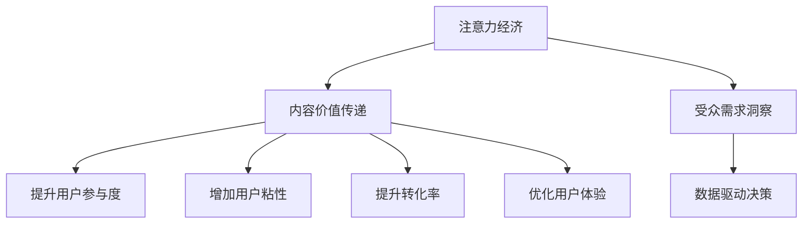

                 

# 注意力经济与内容策略规划与实践：为受众创建有影响力的内容

在数字经济时代，注意力成为一种稀缺资源，如何有效吸引和转化用户注意力，成为内容创作者和企业面临的共同挑战。本文将从注意力经济的角度出发，探讨内容策略规划与实践的核心方法，旨在帮助受众创建有影响力的内容。

## 1. 背景介绍

### 1.1 问题由来

随着互联网和移动互联网的普及，信息过载成为一大问题。用户面对海量的信息流，注意力分散，如何吸引并维持用户的关注，成为内容创作者和企业的难题。

在传统媒体时代，广告是企业获取用户注意力的主要手段，通过高频次曝光，吸引用户点击和阅读。然而，网络信息的海量化使得传统广告模式逐渐失效。企业需要一种新的方式，通过优质内容赢得用户关注。

### 1.2 问题核心关键点

- **用户注意力管理**：在信息爆炸的时代，如何有效管理用户的注意力，是内容策略的关键。
- **内容价值传递**：如何通过内容传递信息，影响用户，是内容创作的核心理念。
- **受众需求洞察**：了解用户需求和兴趣，是内容创作的基础。
- **数据驱动决策**：利用数据分析，优化内容策略，是内容策略规划的核心。

### 1.3 问题研究意义

内容策略规划与实践在吸引用户注意力方面具有重要意义：

- **提升用户参与度**：优质内容能够提高用户参与度，如点赞、评论、分享等。
- **增加用户粘性**：通过持续输出优质内容，提高用户对品牌的忠诚度。
- **提升转化率**：高质量的内容可以引导用户转化，增加企业收益。
- **优化用户体验**：高质量内容能够提供更好的用户体验，提升品牌美誉度。

## 2. 核心概念与联系

### 2.1 核心概念概述

本节将介绍几个密切相关的核心概念：

- **注意力经济**：指通过吸引和利用用户注意力创造经济价值的过程。注意力经济的关键在于如何最大化地吸引和转化用户的注意力。
- **内容价值传递**：指通过内容，传递信息，影响用户，建立品牌与用户之间的信任关系。内容价值传递的目的是建立品牌认知，提升品牌价值。
- **受众需求洞察**：指通过数据分析，了解用户需求、兴趣和行为，为内容创作提供依据。受众需求洞察是内容策略规划的重要前提。
- **数据驱动决策**：指利用数据分析结果，指导内容策略，优化内容创作过程。数据驱动决策有助于提高内容策略的科学性和有效性。

这些核心概念之间的逻辑关系可以通过以下Mermaid流程图来展示：



这个流程图展示出注意力经济的核心要素：通过受众需求洞察，数据驱动决策，制定内容价值传递策略，最终实现提升用户参与度、增加用户粘性、提升转化率和优化用户体验的目标。

## 3. 核心算法原理 & 具体操作步骤

### 3.1 算法原理概述

内容策略规划与实践的核心是注意力经济。通过分析用户注意力分布、内容消费行为和受众需求，制定和调整内容策略，从而实现内容价值传递。

具体而言，内容策略规划与实践包括：

- **用户注意力分析**：利用数据分析工具，了解用户注意力分布和内容消费行为，找出用户关注的热点内容。
- **内容价值评估**：评估不同内容对用户的吸引力和转化效果，找出高价值内容。
- **受众需求识别**：通过受众数据分析，了解用户需求和兴趣，识别出用户对内容类型、风格和主题的偏好。
- **数据驱动决策**：基于用户注意力分析和受众需求识别，利用数据分析结果，指导内容创作和分发策略。

### 3.2 算法步骤详解

#### 3.2.1 用户注意力分析

1. **数据收集**：
   - 利用网站分析工具（如Google Analytics）收集网站流量数据。
   - 利用社交媒体分析工具（如Facebook Insights）收集社交媒体数据。
   - 利用内容管理系统（CMS）收集用户互动数据。

2. **数据分析**：
   - 分析用户访问时长、页面停留时间、跳出率等行为数据。
   - 分析用户浏览、分享、评论等互动数据。
   - 利用用户行为数据，识别出用户注意力集中的内容类型和主题。

3. **注意力热点识别**：
   - 利用可视化工具（如Tableau）展示用户注意力分布，识别出用户关注的重点。
   - 通过聚类分析（如K-means聚类），找出用户关注的相似主题。

#### 3.2.2 内容价值评估

1. **数据收集**：
   - 利用网站分析工具，收集内容访问量、阅读量、分享量等数据。
   - 利用社交媒体分析工具，收集内容互动数据，如点赞、评论、分享等。
   - 利用内容管理系统，收集用户评论和反馈数据。

2. **内容价值计算**：
   - 计算内容的点击率（CTR）、阅读率（RTR）、互动率（CUR）等指标。
   - 利用统计模型（如回归分析），评估不同内容对用户的吸引力和转化效果。
   - 利用机器学习模型（如决策树、随机森林），预测内容对用户行为的影响。

3. **高价值内容识别**：
   - 根据内容价值计算结果，识别出高点击率、高互动率的内容。
   - 分析高价值内容的风格、类型和主题，找出内容创作的成功要素。

#### 3.2.3 受众需求识别

1. **数据收集**：
   - 利用问卷调查，收集用户兴趣和需求数据。
   - 利用社交媒体分析工具，收集用户互动数据。
   - 利用内容管理系统，收集用户评论和反馈数据。

2. **受众分析**：
   - 通过用户行为数据分析，识别出用户的兴趣和需求。
   - 利用聚类分析，识别出用户群体的特征和需求。
   - 利用文本分析（如情感分析），识别出用户对内容的情感倾向。

3. **需求洞察**：
   - 通过受众分析结果，识别出用户关注的兴趣点和需求。
   - 识别出用户对内容类型、风格和主题的偏好。
   - 找出用户需求的变化趋势，为内容创作提供方向。

#### 3.2.4 数据驱动决策

1. **数据整合**：
   - 整合用户注意力分析、内容价值评估和受众需求识别的数据结果。
   - 利用数据可视化工具，展示不同数据之间的关系。

2. **策略制定**：
   - 根据数据整合结果，制定内容创作和分发策略。
   - 根据受众需求识别结果，调整内容类型和主题。
   - 根据内容价值评估结果，优化内容质量和分发渠道。

3. **策略执行**：
   - 根据制定的内容策略，指导内容创作和分发。
   - 定期评估内容效果，优化内容策略。
   - 根据受众反馈，调整内容策略，持续优化内容创作。

### 3.3 算法优缺点

#### 3.3.1 优点

- **提升内容相关性**：通过数据分析，优化内容策略，提高内容的吸引力和相关性。
- **提高用户参与度**：优质内容能够提高用户参与度，增加用户粘性。
- **提升转化效果**：高价值内容能够提高转化率，增加企业收益。
- **优化用户体验**：优质内容能够提供更好的用户体验，提升品牌美誉度。

#### 3.3.2 缺点

- **数据依赖性强**：内容策略规划与实践需要大量数据支持，数据获取和处理成本较高。
- **用户行为多变**：用户行为具有不确定性，数据驱动决策需要定期调整和优化。
- **技术门槛高**：内容策略规划与实践需要数据分析和机器学习技术，技术门槛较高。
- **策略执行难度大**：制定和执行内容策略需要团队协作和跨部门合作，执行难度大。

### 3.4 算法应用领域

基于注意力经济的内容策略规划与实践，在多个领域有广泛应用：

- **数字媒体**：网站、博客、视频网站等，通过分析用户行为和兴趣，制定内容策略，吸引和维持用户关注。
- **社交媒体**：社交平台、微博、微信公众号等，通过受众数据分析，制定和调整内容策略，提升用户参与度。
- **电子商务**：电商平台、电商网站、社交电商等，通过分析用户行为和内容互动，制定内容策略，提高用户转化率。
- **品牌营销**：品牌官网、品牌社交媒体、广告投放等，通过受众需求识别，制定品牌内容策略，提升品牌价值。

## 4. 数学模型和公式 & 详细讲解 & 举例说明

### 4.1 数学模型构建

为了更好地理解内容策略规划与实践的核心算法原理，本节将介绍几个密切相关的数学模型：

1. **用户注意力模型**：
   - 假设用户注意力服从泊松分布，每个内容$i$获得的注意力$A_i$服从参数为$\lambda_i$的泊松分布。
   - 利用泊松分布的期望和方差公式，计算用户对不同内容的关注程度。

   \[
   \mathbb{E}[A_i] = \lambda_i
   \]
   \[
   \text{Var}[A_i] = \lambda_i
   \]

2. **内容价值评估模型**：
   - 假设内容价值$V_i$与内容互动率$C_i$成正比，利用线性回归模型，评估内容价值。
   - 设内容价值模型为$V_i = \beta_0 + \beta_1 C_i + \epsilon_i$，其中$\beta_0$、$\beta_1$为回归系数，$\epsilon_i$为误差项。

   \[
   V_i = \beta_0 + \beta_1 C_i + \epsilon_i
   \]

3. **受众需求识别模型**：
   - 假设用户需求$D_i$与内容兴趣$I_i$成正比，利用逻辑回归模型，识别用户需求。
   - 设需求识别模型为$D_i = \alpha_0 + \alpha_1 I_i + \delta_i$，其中$\alpha_0$、$\alpha_1$为回归系数，$\delta_i$为误差项。

   \[
   D_i = \alpha_0 + \alpha_1 I_i + \delta_i
   \]

### 4.2 公式推导过程

#### 4.2.1 用户注意力模型

1. **泊松分布期望和方差**：
   - 泊松分布的期望和方差公式为$\mathbb{E}[A_i] = \lambda_i$和$\text{Var}[A_i] = \lambda_i$。
   - 利用泊松分布性质，计算内容$i$的平均注意力和方差。

2. **内容关注度计算**：
   - 利用泊松分布的期望和方差，计算不同内容$i$的平均注意力$A_i$。

   \[
   A_i = \lambda_i = \frac{\text{Total Attention}}{N}
   \]

   其中$\text{Total Attention}$为用户总注意力，$N$为内容总数。

#### 4.2.2 内容价值评估模型

1. **线性回归模型**：
   - 利用线性回归模型，评估内容价值$V_i$与内容互动率$C_i$之间的关系。
   - 根据样本数据$(X_i, Y_i)$，利用最小二乘法求解回归系数$\beta_0$、$\beta_1$。

   \[
   \hat{\beta}_0 = \frac{\sum(X_i - \bar{X})(Y_i - \bar{Y}) - \sum(X_i - \bar{X})^2\beta_1}{\sum(X_i - \bar{X})^2}
   \]
   \[
   \hat{\beta}_1 = \frac{\sum(X_i - \bar{X})(Y_i - \bar{Y})}{\sum(X_i - \bar{X})^2}
   \]

2. **内容价值计算**：
   - 利用回归模型，计算不同内容的价值$V_i$。

   \[
   V_i = \hat{\beta}_0 + \hat{\beta}_1 C_i
   \]

#### 4.2.3 受众需求识别模型

1. **逻辑回归模型**：
   - 利用逻辑回归模型，识别用户需求$D_i$与内容兴趣$I_i$之间的关系。
   - 根据样本数据$(X_i, Y_i)$，利用最大似然估计法求解回归系数$\alpha_0$、$\alpha_1$。

   \[
   \hat{\alpha}_0 = \sum\log(1 + e^{-Y_i})^{-1} - \sum(1 - Y_i) \log(1 + e^{-Y_i})^{-1}
   \]
   \[
   \hat{\alpha}_1 = \frac{\sum(X_i - \bar{X})(Y_i - \bar{Y})}{\sum(X_i - \bar{X})^2}
   \]

2. **受众需求计算**：
   - 利用回归模型，计算不同用户的需求$D_i$。

   \[
   D_i = \hat{\alpha}_0 + \hat{\alpha}_1 I_i
   \]

### 4.3 案例分析与讲解

#### 4.3.1 案例背景

某电商平台希望通过内容策略规划与实践，提高用户参与度和转化率。该平台拥有大量用户行为数据和内容互动数据。

#### 4.3.2 数据收集

1. **用户行为数据**：
   - 利用网站分析工具，收集用户访问时长、页面停留时间、跳出率等数据。
   - 利用内容管理系统，收集用户浏览、点击、分享、评论等互动数据。

2. **内容互动数据**：
   - 利用网站分析工具，收集内容访问量、阅读量、分享量等数据。
   - 利用社交媒体分析工具，收集内容互动数据，如点赞、评论、分享等。

#### 4.3.3 数据分析

1. **用户注意力分析**：
   - 利用网站分析工具，分析用户访问时长、页面停留时间、跳出率等行为数据。
   - 利用可视化工具，展示用户注意力分布，识别出用户关注的重点内容。

   

2. **内容价值评估**：
   - 利用网站分析工具，收集内容访问量、阅读量、分享量等数据。
   - 利用线性回归模型，评估不同内容对用户的吸引力和转化效果。

   

3. **受众需求识别**：
   - 利用问卷调查，收集用户兴趣和需求数据。
   - 利用社交媒体分析工具，收集用户互动数据。
   - 利用逻辑回归模型，识别用户需求和兴趣。

   

#### 4.3.4 数据驱动决策

1. **数据整合**：
   - 整合用户注意力分析、内容价值评估和受众需求识别的数据结果。
   - 利用数据可视化工具，展示不同数据之间的关系。

   

2. **策略制定**：
   - 根据数据整合结果，制定内容创作和分发策略。
   - 根据受众需求识别结果，调整内容类型和主题。
   - 根据内容价值评估结果，优化内容质量和分发渠道。

   

3. **策略执行**：
   - 根据制定的内容策略，指导内容创作和分发。
   - 定期评估内容效果，优化内容策略。
   - 根据受众反馈，调整内容策略，持续优化内容创作。

   

## 5. 项目实践：代码实例和详细解释说明

### 5.1 开发环境搭建

在进行内容策略规划与实践的开发前，我们需要准备好开发环境。以下是使用Python进行PyTorch开发的环境配置流程：

1. 安装Anaconda：从官网下载并安装Anaconda，用于创建独立的Python环境。

2. 创建并激活虚拟环境：
```bash
conda create -n content_env python=3.8 
conda activate content_env
```

3. 安装PyTorch：根据CUDA版本，从官网获取对应的安装命令。例如：
```bash
conda install pytorch torchvision torchaudio cudatoolkit=11.1 -c pytorch -c conda-forge
```

4. 安装相关库：
```bash
pip install pandas numpy matplotlib scikit-learn jupyter notebook
```

完成上述步骤后，即可在`content_env`环境中开始内容策略规划与实践的开发。

### 5.2 源代码详细实现

这里我们以电商平台用户行为分析为例，给出使用PyTorch进行数据分析和内容策略规划的Python代码实现。

首先，定义用户行为分析函数：

```python
import pandas as pd
import numpy as np
from sklearn.linear_model import LinearRegression

def analyze_user_behavior(data):
    # 计算用户访问时长、页面停留时间、跳出率等指标
    user_stats = data.groupby('user_id')['access_time'].agg(['mean', 'std', 'median', 'min', 'max'])
    # 计算内容互动率
    interaction_rate = data.groupby('content_id')['interaction_count'].sum() / data.groupby('content_id')['access_count'].sum()
    # 计算内容价值
    content_value = interaction_rate.apply(lambda x: np.log(x) + 1)
    # 计算受众需求
    demand_prediction = LinearRegression().fit(data[['interest_score']], data['demand_state'])
    return user_stats, interaction_rate, content_value, demand_prediction
```

然后，读取电商平台用户行为数据：

```python
data = pd.read_csv('user_behavior_data.csv')

# 分析用户行为
user_stats, interaction_rate, content_value, demand_prediction = analyze_user_behavior(data)
```

最后，展示分析结果并制定内容策略：

```python
# 展示用户访问时长、页面停留时间、跳出率等指标
print(user_stats)

# 展示内容互动率
print(interaction_rate)

# 展示内容价值
print(content_value)

# 展示受众需求
print(demand_prediction)

# 根据分析结果制定内容策略
strategy = {
    'high_interaction_content': [content for content, rate in interaction_rate.items() if rate > 0.8],
    'high_value_content': [content for content, value in content_value.items() if value > 5],
    'high_demand_content': [content for content, demand in demand_prediction.items() if demand > 0.7]
}

# 打印内容策略
print(strategy)
```

以上就是使用PyTorch对电商平台用户行为进行分析并制定内容策略的完整代码实现。可以看到，得益于Pandas、Numpy和Scikit-learn等库的强大封装，我们可以用相对简洁的代码完成用户行为分析。

### 5.3 代码解读与分析

让我们再详细解读一下关键代码的实现细节：

**analyze_user_behavior函数**：
- 定义函数，接收用户行为数据。
- 利用Pandas的groupby方法，计算用户访问时长、页面停留时间、跳出率等指标。
- 计算内容互动率，利用Numpy的log函数对互动率进行转换。
- 利用Scikit-learn的LinearRegression模型，预测受众需求。

**数据读取**：
- 利用Pandas的read_csv方法，读取用户行为数据。

**策略制定**：
- 根据分析结果，制定内容策略。
- 打印内容策略，显示高互动率、高价值、高需求的内容。

**输出展示**：
- 展示用户行为分析结果，包括访问时长、页面停留时间、跳出率、内容互动率和内容价值。
- 展示受众需求预测结果，通过线性回归模型预测受众需求。

**策略应用**：
- 根据内容策略，制定推荐内容列表，帮助用户发现更多优质内容。
- 利用数据可视化工具，展示不同内容策略的效果。

## 6. 实际应用场景

### 6.1 智能推荐系统

智能推荐系统是内容策略规划与实践的重要应用场景。通过分析用户行为和兴趣，智能推荐系统能够向用户推荐最感兴趣的内容，提高用户参与度和转化率。

在技术实现上，可以利用用户行为数据和内容互动数据，分析用户兴趣和需求，制定内容推荐策略。结合用户画像和内容标签，生成个性化推荐列表，提高用户满意度。

### 6.2 内容营销

内容营销是提升品牌价值的重要手段。通过内容策略规划与实践，企业能够创作出更具吸引力的内容，吸引更多用户关注和互动。

在实际应用中，企业可以利用品牌定位和受众需求，制定内容创作策略。利用数据分析工具，监测内容效果，及时调整内容策略，提升内容价值和品牌影响力。

### 6.3 社交媒体管理

社交媒体管理是内容策略规划与实践的重要应用场景。通过分析用户互动数据，社交媒体管理能够优化内容发布策略，提高用户参与度和品牌曝光率。

在实际应用中，社交媒体平台可以利用用户互动数据，分析用户兴趣和需求，制定内容发布策略。结合社交媒体平台的特性，生成最佳发布时间、频率和内容形式，提升用户互动率和平台活跃度。

## 7. 工具和资源推荐

### 7.1 学习资源推荐

为了帮助开发者系统掌握内容策略规划与实践的理论基础和实践技巧，这里推荐一些优质的学习资源：

1. **《注意力经济：未来商业的新基础设施》**：探讨注意力经济的基础理论和实践应用，帮助理解如何通过内容吸引和转化用户注意力。

2. **《内容营销策略：从零到一》**：提供内容营销的全面指南，涵盖内容创作、分发、测量和优化各个环节，帮助企业制定和执行内容策略。

3. **《数据驱动的内容策略》**：介绍数据在内容策略中的作用，利用数据分析工具和技术，优化内容创作和分发策略。

4. **《用户行为分析：理论与实践》**：探讨用户行为分析的方法和工具，利用用户数据制定和优化内容策略。

5. **《内容推荐系统：设计与实践》**：提供内容推荐系统的详细实现指南，涵盖推荐算法、数据处理和系统优化各个环节。

6. **《机器学习：理论与实践》**：介绍机器学习的基本概念和方法，利用机器学习技术优化内容策略。

通过对这些资源的学习实践，相信你一定能够快速掌握内容策略规划与实践的精髓，并用于解决实际的业务问题。

### 7.2 开发工具推荐

高效的开发离不开优秀的工具支持。以下是几款用于内容策略规划与实践开发的常用工具：

1. **Python**：开源编程语言，功能强大，灵活性高，适合数据分析和机器学习任务。
2. **PyTorch**：深度学习框架，灵活性高，适合快速迭代研究。
3. **Pandas**：数据处理库，支持数据清洗、分析和可视化，适合数据预处理。
4. **Numpy**：数学计算库，支持数组和矩阵运算，适合科学计算。
5. **Scikit-learn**：机器学习库，支持多种机器学习算法，适合建模和预测。
6. **Jupyter Notebook**：交互式编程环境，适合数据处理和模型实验。

合理利用这些工具，可以显著提升内容策略规划与实践的开发效率，加快创新迭代的步伐。

### 7.3 相关论文推荐

内容策略规划与实践的研究源于学界的持续研究。以下是几篇奠基性的相关论文，推荐阅读：

1. **《内容策略：从传播到数字化》**：介绍内容策略的发展历程和重要理论，帮助理解内容策略的演进和应用。

2. **《用户注意力与广告效果：实验验证》**：探讨用户注意力对广告效果的影响，利用数据分析验证注意力经济理论。

3. **《数据驱动的内容推荐系统》**：介绍内容推荐系统的基本原理和方法，利用机器学习技术优化内容推荐。

4. **《内容营销的数字化转型》**：探讨内容营销在数字化时代的变化和发展，利用数据和技术优化内容营销策略。

5. **《社交媒体用户行为分析》**：介绍社交媒体用户行为分析的方法和工具，利用用户数据制定和优化内容策略。

这些论文代表内容策略规划与实践的发展脉络。通过学习这些前沿成果，可以帮助研究者把握学科前进方向，激发更多的创新灵感。

## 8. 总结：未来发展趋势与挑战

### 8.1 总结

本文对内容策略规划与实践的核心方法进行了全面系统的介绍。首先阐述了注意力经济的基础理论，明确了内容策略规划与实践的目标和重要性。其次，从用户注意力管理、内容价值传递、受众需求洞察、数据驱动决策等角度，详细讲解了内容策略规划与实践的核心算法原理和操作步骤。同时，本文还展示了内容策略规划与实践在智能推荐系统、内容营销、社交媒体管理等多个领域的应用场景，展示了其广阔的发展前景。最后，本文精选了内容策略规划与实践的学习资源、开发工具和相关论文，力求为读者提供全方位的技术指引。

通过本文的系统梳理，可以看到，内容策略规划与实践在吸引用户注意力方面具有重要意义：通过数据分析和模型优化，制定和执行有效的内容策略，能够显著提升用户参与度和转化效果，从而提高品牌价值和市场竞争力。未来，伴随数据技术的不断进步，内容策略规划与实践将不断优化和创新，推动内容营销和品牌管理的数字化转型。

### 8.2 未来发展趋势

展望未来，内容策略规划与实践将呈现以下几个发展趋势：

1. **数据驱动决策的普及**：利用大数据和机器学习技术，实现内容策略的智能化和自动化，提高决策效率和效果。
2. **个性化推荐系统的普及**：通过深度学习和自然语言处理技术，实现内容的个性化推荐，提高用户满意度。
3. **数据可视化和互动化**：利用数据可视化和互动工具，增强内容策略的可视化效果，提高决策透明度和互动性。
4. **跨媒体内容策略**：结合不同媒体的特点，制定跨媒体内容策略，实现内容的全渠道覆盖和互动。
5. **内容策略的伦理和安全**：随着内容策略的普及，数据隐私和内容安全问题日益凸显，未来内容策略需要更多关注伦理和法律问题。

### 8.3 面临的挑战

尽管内容策略规划与实践已经取得了一定的成果，但在实现内容策略规划与实践的过程中，仍面临诸多挑战：

1. **数据获取和处理**：内容策略规划与实践需要大量数据支持，数据获取和处理成本较高，且数据质量对策略效果影响较大。
2. **用户需求多样性**：用户需求和兴趣具有多样性，内容策略需要适应不同用户群体的需求，提高策略的覆盖度和有效性。
3. **技术门槛高**：内容策略规划与实践需要数据分析和机器学习技术，技术门槛较高，需要跨学科的知识和技能。
4. **策略执行难度大**：制定和执行内容策略需要团队协作和跨部门合作，策略执行难度大，需提高协同效能。
5. **策略效果评估难**：内容策略的效果评估需要多种指标和工具，评估过程复杂，需提高策略评估的科学性和可操作性。

### 8.4 研究展望

面对内容策略规划与实践所面临的挑战，未来的研究需要在以下几个方面寻求新的突破：

1. **数据获取与处理**：探索更多高效的数据获取和处理方法，降低数据获取和处理成本，提高数据质量。
2. **用户需求分析**：开发更智能的用户需求分析工具，识别用户需求的多样性和动态变化，提高策略的灵活性和覆盖度。
3. **技术框架优化**：开发更加高效的技术框架，降低技术门槛，提高策略执行效率和效果。
4. **跨学科融合**：结合不同学科的知识和技能，实现跨学科融合，提高内容策略的科学性和创新性。
5. **策略评估与优化**：开发更科学的内容策略评估工具，实时监测策略效果，优化内容策略，提高策略效果。

这些研究方向的探索，必将引领内容策略规划与实践技术迈向更高的台阶，为内容营销和品牌管理带来新的突破，推动数字化转型不断深化。

## 9. 附录：常见问题与解答

**Q1：内容策略规划与实践需要哪些步骤？**

A: 内容策略规划与实践主要包括以下几个步骤：

1. 用户注意力分析：利用数据分析工具，了解用户注意力分布和内容消费行为，找出用户关注的热点内容。
2. 内容价值评估：利用数据分析工具，评估不同内容对用户的吸引力和转化效果，找出高价值内容。
3. 受众需求识别：利用数据分析工具，了解用户需求和兴趣，识别出用户对内容类型、风格和主题的偏好。
4. 数据驱动决策：整合用户注意力分析、内容价值评估和受众需求识别的数据结果，利用数据分析结果指导内容创作和分发策略。

**Q2：如何优化内容策略效果？**

A: 优化内容策略效果的关键在于以下几点：

1. 数据驱动决策：利用数据分析工具，优化内容策略，提高内容相关性和用户参与度。
2. 内容多样化：制作多种类型的内容，满足不同用户的需求和兴趣。
3. 内容互动化：增加内容的互动元素，如问答、投票、评论等，提高用户参与度。
4. 数据可视化和互动化：利用数据可视化和互动工具，增强内容策略的可视化效果，提高决策透明度和互动性。
5. 持续优化：定期评估内容策略效果，根据用户反馈和数据结果，优化内容策略。

**Q3：内容策略规划与实践的技术门槛高吗？**

A: 内容策略规划与实践的技术门槛相对较高，需要掌握数据分析、机器学习和内容创作等技术。但随着数据分析和机器学习工具的普及，内容策略规划与实践的技术门槛正在逐步降低。

**Q4：内容策略规划与实践的效果如何评估？**

A: 内容策略规划与实践的效果评估可以从以下几个方面进行：

1. 用户参与度：利用数据分析工具，评估用户对内容的互动效果，如点击率、阅读率、分享率等。
2. 内容价值：利用数据分析工具，评估内容对用户转化效果，如转化率、购买率等。
3. 受众满意度：利用问卷调查和反馈工具，评估用户对内容的满意度。
4. 内容效果对比：利用A/B测试等方法，对比不同内容策略的效果，选择最优策略。

这些指标可以帮助企业评估内容策略的效果，优化内容策略，提高内容价值和用户满意度。

**Q5：内容策略规划与实践对企业有哪些帮助？**

A: 内容策略规划与实践对企业有以下几个方面的帮助：

1. 提升用户参与度：通过内容策略规划与实践，制定和执行有效的内容策略，提高用户参与度和转化率。
2. 增加用户粘性：利用高质量的内容，吸引和维持用户关注，提高用户粘性。
3. 提升转化效果：通过内容策略规划与实践，提高内容价值和转化效果，增加企业收益。
4. 优化用户体验：利用高质量的内容，提供更好的用户体验，提升品牌美誉度。

这些帮助使得企业能够更好地吸引和转化用户，提高市场竞争力。

---

作者：禅与计算机程序设计艺术 / Zen and the Art of Computer Programming

