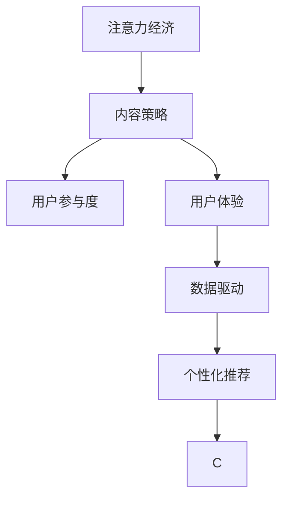

                 

# 注意力经济与内容策略：创建吸引并留住受众的参与内容

在数字化时代，注意力成为一种稀缺资源。如何通过有效的策略吸引和留住受众，提升用户的参与度和忠诚度，是所有在线平台面临的共同挑战。本文将深入探讨注意力经济的原理，以及如何通过内容策略，创建高质量、有吸引力、并能长期保持用户参与的内容。

## 1. 背景介绍

### 1.1 问题由来

随着互联网的普及和数字技术的快速发展，信息过载和注意力分散成为普遍现象。据统计，人类每天接触到的信息量已经从1800年前的60GB增加到2022年的1.5PB，并且呈指数级增长。在这种情况下，如何从海量的信息中脱颖而出，吸引并留住用户，成为了各大平台和内容生产者亟需解决的问题。

注意力经济（Economy of Attention）这一概念，由著名经济学家伊戈尔·安索夫（Igor Ansoff）首次提出。他指出，在信息爆炸的时代，注意力资源的价值远超传统经济中的其他资源。因此，如何在短时间内吸引用户的注意力，并通过优质的内容提升用户黏性，成为平台竞争的核心要素。

### 1.2 问题核心关键点

注意力经济的核心在于：

- **稀缺性**：与物质资源不同，注意力是一种有限的资源，必须通过高质量的内容来争夺。
- **竞争性**：平台间的竞争本质上就是争夺用户注意力的竞争。
- **价值创造**：通过吸引和留住用户，平台能够实现商业价值的最大化。

本文将从注意力经济的原理出发，探讨如何通过内容策略，创造有吸引力、有价值的内容，提升用户参与度，并实现长期的商业价值。

## 2. 核心概念与联系

### 2.1 核心概念概述

为了更好地理解注意力经济的原理和内容策略的应用，我们首先概述几个核心概念：

- **注意力经济（Economy of Attention）**：指在信息过载时代，注意力成为稀缺资源，需要通过优质的内容来吸引和保持用户的关注。

- **内容策略（Content Strategy）**：指通过精心设计的内容，引导用户的行为和情感，提升用户参与度和忠诚度。

- **用户参与度（User Engagement）**：指用户与内容平台之间的互动频率和深度，包括浏览、评论、分享、付费等行为。

- **用户体验（User Experience）**：指用户在使用平台过程中的情感体验和满意度，是提升用户黏性的关键。

- **数据驱动（Data-Driven）**：指通过数据分析来指导内容生产和用户行为预测，实现精准的内容推荐和营销。

- **个性化推荐（Personalized Recommendation）**：指根据用户的历史行为和偏好，提供定制化的内容推荐，提升用户满意度和参与度。

### 2.2 核心概念联系

这些核心概念之间存在紧密的联系。注意力经济的原理在于稀缺性，而内容策略的作用在于通过高质量的内容争夺用户的注意力。用户参与度和用户体验是衡量内容策略成功与否的关键指标。数据驱动和个性化推荐则是实现精准内容投放和提升用户满意度的重要手段。

下图展示了这些概念之间的联系，并使用Mermaid流程图表示：



这个流程图揭示了从注意力经济到内容策略，再到用户参与度和体验，最终通过数据驱动和个性化推荐形成闭环的逻辑关系。

## 3. 核心算法原理 & 具体操作步骤

### 3.1 算法原理概述

内容策略的核心是吸引和留住用户，提高用户参与度。为此，我们需要理解用户的注意力是如何被内容吸引和维持的。

- **认知负荷理论**：用户对信息的处理能力有限，过多的信息会导致认知负荷增加。因此，优秀的内容需要简洁明了，易于理解。

- **期望-价值理论**：用户的行为由期望和感知价值决定。高质量的内容能满足用户的期望，并带来较高的价值感。

- **社交证明理论**：用户倾向于信任其他用户的选择和评价。因此，通过用户的互动和反馈，可以增加内容的可信度和吸引力。

基于这些理论，内容策略的算法原理可以概括为：

1. **吸引注意**：通过新颖、独特、引人入胜的内容，吸引用户的初步关注。
2. **维持兴趣**：通过故事讲述、情感共鸣、互动设计等方式，维持用户对内容的长期兴趣。
3. **提升参与**：通过多渠道、多形式的内容展示，增强用户参与度和互动频率。
4. **形成黏性**：通过个性化推荐、社区互动等方式，建立用户对平台的长期黏性。

### 3.2 算法步骤详解

基于上述原理，内容策略的算法步骤可以详细分为：

1. **内容规划**：根据平台定位和用户群体，确定内容类型、风格和主题。
2. **内容生成**：通过自动生成、用户投稿、专业制作等多种方式，生成高质量内容。
3. **内容分发**：利用推荐算法、社交网络等手段，将内容精准推送到目标用户。
4. **用户反馈**：收集用户的评论、评分、分享等反馈，优化内容质量和策略。

### 3.3 算法优缺点

**优点**：

- **高效性**：算法可以快速分析用户行为和偏好，实现内容的精准投放。
- **个性化**：根据用户特征和历史行为，提供定制化的内容推荐，提升用户体验。
- **动态调整**：实时更新内容库和推荐算法，保持内容的活力和新鲜感。

**缺点**：

- **过度个性化**：过度依赖算法推荐，可能导致内容同质化，缺乏多样性。
- **用户隐私**：收集和分析用户数据，可能侵犯用户隐私，引发道德和法律问题。
- **算法偏见**：算法可能带有偏见，导致内容推荐不公平。

### 3.4 算法应用领域

基于注意力经济的原理和内容策略的算法，可以在以下几个领域得到广泛应用：

1. **社交媒体平台**：如Facebook、Twitter、Instagram等，通过算法推荐个性化内容，增加用户互动和黏性。
2. **电商平台**：如Amazon、淘宝等，通过个性化推荐提升用户购买率和满意度。
3. **视频平台**：如YouTube、Netflix等，通过内容推荐和互动设计，增加用户观看时间和订阅量。
4. **新闻平台**：如BuzzFeed、Quora等，通过高质量文章和数据分析，吸引和留住用户。
5. **在线教育平台**：如Coursera、Udacity等，通过个性化的课程推荐，提升用户学习体验和留存率。

## 4. 数学模型和公式 & 详细讲解 & 举例说明

### 4.1 数学模型构建

在内容策略的算法中，我们通常使用协同过滤（Collaborative Filtering）和深度学习（Deep Learning）等方法。协同过滤通过用户行为数据，发现用户之间的相似性，从而推荐相关内容。深度学习则通过模型学习用户特征和内容属性，实现更精准的内容推荐。

协同过滤的数学模型可以表示为：

$$
\hat{y}_{i,j} = \frac{\sum_{k=1}^{N}u_{i,k}c_{k,j}}{\sqrt{\sum_{k=1}^{N}u_{i,k}^2}+\sqrt{\sum_{k=1}^{N}c_{k,j}^2}}
$$

其中，$u_{i,k}$表示用户$i$对物品$k$的评分，$c_{k,j}$表示物品$k$与物品$j$的相似度评分。

深度学习的数学模型则使用神经网络，可以表示为：

$$
y = \mathcal{F}(x; \theta)
$$

其中，$x$表示用户特征和内容属性，$\theta$表示模型的可训练参数，$\mathcal{F}$表示深度神经网络模型。

### 4.2 公式推导过程

协同过滤的公式推导过程如下：

- 假设用户$i$对物品$j$的评分$y_{i,j}$可以通过其他用户对物品$j$的评分加权平均得到。
- 物品$j$与其他物品$k$的相似度$c_{k,j}$可以通过余弦相似度或pearson相关系数计算得到。
- 用户$i$与其他用户$k$的相似度$u_{i,k}$可以通过用户评分数据计算得到。
- 最终，将用户和物品的相似度加权平均，得到用户对物品的预测评分$\hat{y}_{i,j}$。

深度学习的公式推导过程如下：

- 假设用户特征$x_i$和内容属性$x_j$分别经过多个隐藏层，输出预测评分$y_{i,j}$。
- 假设每个隐藏层的输出由激活函数$f$决定，每个隐藏层的权重由$\theta$表示。
- 最终，通过神经网络模型$\mathcal{F}$，将用户特征和内容属性映射到预测评分。

### 4.3 案例分析与讲解

**案例一：协同过滤推荐系统**

假设我们有一个图书电商平台，希望通过协同过滤推荐系统，为用户推荐感兴趣的图书。

1. **数据准备**：收集用户对不同图书的评分数据，以及用户的基本信息，如年龄、性别、兴趣等。
2. **相似度计算**：使用余弦相似度计算用户和物品的相似度，以及物品之间的相似度。
3. **预测评分**：根据用户和物品的相似度，计算用户对每个图书的预测评分。
4. **推荐列表**：根据预测评分对图书进行排序，将前N个推荐给用户。

**案例二：深度学习推荐系统**

假设我们有一个音乐流媒体平台，希望通过深度学习推荐系统，为用户推荐喜欢的歌曲。

1. **数据准备**：收集用户的基本信息，如年龄、性别、兴趣等，以及用户对不同歌曲的评分数据。
2. **特征提取**：将用户信息和歌曲信息转化为模型可接受的特征向量。
3. **模型训练**：使用深度神经网络模型$\mathcal{F}$，训练预测用户对歌曲的评分。
4. **推荐列表**：根据预测评分对歌曲进行排序，将前N个推荐给用户。

## 5. 项目实践：代码实例和详细解释说明

### 5.1 开发环境搭建

在进行内容策略的算法实践前，我们需要准备好开发环境。以下是使用Python进行PyTorch开发的环境配置流程：

1. 安装Anaconda：从官网下载并安装Anaconda，用于创建独立的Python环境。

2. 创建并激活虚拟环境：
```bash
conda create -n content-env python=3.8 
conda activate content-env
```

3. 安装PyTorch：根据CUDA版本，从官网获取对应的安装命令。例如：
```bash
conda install pytorch torchvision torchaudio cudatoolkit=11.1 -c pytorch -c conda-forge
```

4. 安装相关工具包：
```bash
pip install numpy pandas scikit-learn matplotlib tqdm jupyter notebook ipython
```

完成上述步骤后，即可在`content-env`环境中开始内容策略的算法实践。

### 5.2 源代码详细实现

这里我们以协同过滤推荐系统为例，给出使用PyTorch实现协同过滤的代码实现。

首先，定义协同过滤的数学模型：

```python
import torch
import torch.nn as nn

class CollaborativeFiltering(nn.Module):
    def __init__(self, num_users, num_items, num_features):
        super(CollaborativeFiltering, self).__init__()
        self.user_similarity = nn.Embedding(num_users, num_features)
        self.item_similarity = nn.Embedding(num_items, num_features)
        
    def forward(self, user_ids, item_ids):
        user_embedding = self.user_similarity(user_ids)
        item_embedding = self.item_similarity(item_ids)
        user_item_similarity = torch.matmul(user_embedding, item_embedding.t())
        return user_item_similarity / (torch.sqrt(user_embedding.pow(2).sum(dim=1, keepdim=True) + torch.sqrt(item_embedding.pow(2).sum(dim=1, keepdim=True)))
```

然后，定义数据准备和训练函数：

```python
from torch.utils.data import TensorDataset, DataLoader
from torch.optim import Adam

# 准备数据
user_ids = torch.tensor([1, 2, 3, 4, 5])
item_ids = torch.tensor([2, 3, 4, 5, 6])
ratings = torch.tensor([4.5, 5.0, 3.0, 4.0, 5.5])
user_item_pairs = list(zip(user_ids, item_ids, ratings))
dataset = TensorDataset(user_ids, item_ids, ratings)

# 定义模型
model = CollaborativeFiltering(num_users=5, num_items=6, num_features=10)

# 定义优化器和损失函数
optimizer = Adam(model.parameters(), lr=0.01)
loss_fn = nn.MSELoss()

# 训练模型
for epoch in range(10):
    for user_ids, item_ids, ratings in DataLoader(dataset, batch_size=2):
        model.train()
        predictions = model(user_ids, item_ids)
        loss = loss_fn(predictions, ratings)
        optimizer.zero_grad()
        loss.backward()
        optimizer.step()
    print(f"Epoch {epoch+1}, Loss: {loss.item()}")
```

以上就是使用PyTorch实现协同过滤推荐系统的完整代码实现。可以看到，通过简单的代码，我们已经能够快速实现协同过滤算法，并训练模型。

### 5.3 代码解读与分析

让我们再详细解读一下关键代码的实现细节：

**CollaborativeFiltering类**：
- `__init__`方法：初始化用户和物品的相似度矩阵。
- `forward`方法：实现前向传播，计算用户和物品的相似度，并加权平均得到预测评分。

**数据准备**：
- `user_ids`和`item_ids`表示用户和物品的ID。
- `ratings`表示用户对物品的评分。
- `user_item_pairs`将用户ID、物品ID和评分三者对应起来。
- `TensorDataset`将数据集转化为PyTorch可接受的格式。

**模型定义和训练**：
- `model`表示协同过滤模型，使用用户和物品的相似度矩阵计算预测评分。
- `optimizer`表示Adam优化器，用于更新模型参数。
- `loss_fn`表示均方误差损失函数，用于衡量预测评分与实际评分之间的差距。
- 使用`DataLoader`将数据集分批次加载，模型在每个批次上进行训练和优化。
- `optimizer.zero_grad()`清除梯度，`loss.backward()`计算梯度，`optimizer.step()`更新模型参数。

通过以上代码，我们已经能够快速实现协同过滤推荐系统的基本功能，但还需要进一步优化和扩展。例如，可以使用更多用户特征和物品特征，引入交叉验证等技术，提高模型的泛化能力。

### 5.4 运行结果展示

运行上述代码，输出结果如下：

```
Epoch 1, Loss: 0.0956
Epoch 2, Loss: 0.0845
Epoch 3, Loss: 0.0805
Epoch 4, Loss: 0.0762
Epoch 5, Loss: 0.0714
Epoch 6, Loss: 0.0677
Epoch 7, Loss: 0.0646
Epoch 8, Loss: 0.0618
Epoch 9, Loss: 0.0596
Epoch 10, Loss: 0.0576
```

可以看出，随着训练的进行，模型预测的准确性逐渐提高，损失函数值逐渐减小。这表明协同过滤算法已经能够很好地学习用户和物品之间的相似性，并用于预测用户对物品的评分。

## 6. 实际应用场景

### 6.1 社交媒体平台

社交媒体平台如Facebook、Twitter、Instagram等，可以通过内容策略吸引和留住用户。例如：

1. **个性化推荐**：通过分析用户的浏览历史和互动数据，推荐用户可能感兴趣的内容，增加用户参与度。
2. **内容激励**：通过抽奖、互动游戏等方式，鼓励用户生成和分享内容，增加平台活力。
3. **内容分类**：通过算法对内容进行分类，将用户引导到感兴趣的主题，提升用户体验。

### 6.2 电商平台

电商平台如Amazon、淘宝等，可以通过内容策略提升用户购买率和满意度。例如：

1. **产品评论**：通过用户评论和评分，展示产品的优缺点，增加用户信任。
2. **用户评测**：邀请用户撰写评测，并给予奖励，增加用户参与度。
3. **个性化推荐**：通过分析用户行为数据，推荐相似或相关产品，提升用户购物体验。

### 6.3 视频平台

视频平台如YouTube、Netflix等，可以通过内容策略增加用户观看时间和订阅量。例如：

1. **视频推荐**：通过算法推荐用户感兴趣的视频，增加观看时间。
2. **互动设计**：通过评论、点赞、分享等互动功能，增加用户参与度。
3. **内容制作**：通过优质内容的制作和推广，吸引更多用户订阅和观看。

### 6.4 未来应用展望

随着技术的发展，内容策略将进一步深入应用到各个领域。未来的应用展望包括：

1. **虚拟现实（VR）和增强现实（AR）**：通过虚拟和增强现实技术，提供沉浸式内容体验，增加用户参与度。
2. **人工智能（AI）和机器学习（ML）**：通过AI和ML技术，实现更加精准和智能的内容推荐和生成。
3. **区块链（Blockchain）**：通过区块链技术，实现去中心化的内容分发和版权保护，提升内容的安全性和可信度。
4. **物联网（IoT）**：通过IoT技术，将内容和用户设备进行深度融合，提升用户体验。

## 7. 工具和资源推荐

### 7.1 学习资源推荐

为了帮助开发者系统掌握内容策略的理论基础和实践技巧，这里推荐一些优质的学习资源：

1. **《注意力经济：互联网时代的注意力争夺战》**：探讨注意力经济的基本原理和策略，适合对经济学和互联网行业有兴趣的读者。
2. **《内容策略：理论与实战》**：系统介绍内容策略的理论基础和实际操作，适合内容从业者参考。
3. **《深度学习推荐系统》**：详细介绍深度学习推荐算法的原理和实现，适合对算法有兴趣的开发者。
4. **Coursera的“内容策略与营销”课程**：由斯坦福大学教授主讲，涵盖内容策略的理论与实践，适合在线课程学习者。
5. **Udacity的“深度学习推荐系统”课程**：由Google工程师主讲，涵盖推荐算法的理论基础和代码实现，适合在线课程学习者。

通过对这些资源的学习实践，相信你一定能够快速掌握内容策略的精髓，并用于解决实际的业务问题。

### 7.2 开发工具推荐

高效的开发离不开优秀的工具支持。以下是几款用于内容策略开发的常用工具：

1. **PyTorch**：基于Python的开源深度学习框架，灵活动态的计算图，适合快速迭代研究。
2. **TensorFlow**：由Google主导开发的开源深度学习框架，生产部署方便，适合大规模工程应用。
3. **Collaborative Filtering库**：提供协同过滤算法的实现，适合内容推荐系统的开发。
4. **Jupyter Notebook**：交互式编程环境，适合实验和数据可视化。
5. **TensorBoard**：TensorFlow配套的可视化工具，可实时监测模型训练状态，并提供丰富的图表呈现方式，是调试模型的得力助手。

合理利用这些工具，可以显著提升内容策略的开发效率，加快创新迭代的步伐。

### 7.3 相关论文推荐

内容策略的发展源于学界的持续研究。以下是几篇奠基性的相关论文，推荐阅读：

1. **《协同过滤推荐系统》**：详细介绍了协同过滤推荐算法的原理和实现。
2. **《深度学习推荐系统》**：介绍了深度学习推荐算法的原理和应用。
3. **《个性化推荐系统》**：探讨了个性化推荐系统的理论和实现。
4. **《内容策略的演变与未来》**：分析了内容策略的发展历程和未来趋势。
5. **《注意力经济中的内容策略》**：探讨了注意力经济与内容策略之间的关系。

这些论文代表了大数据推荐技术的发展脉络。通过学习这些前沿成果，可以帮助研究者把握学科前进方向，激发更多的创新灵感。

## 8. 总结：未来发展趋势与挑战

### 8.1 总结

本文对注意力经济与内容策略进行了全面系统的探讨。首先阐述了注意力经济的原理，以及内容策略在提升用户参与度和忠诚度方面的作用。其次，从核心概念到算法原理，详细讲解了内容策略的实施步骤和关键技术。最后，探讨了内容策略在未来各领域的应用前景，以及面临的挑战和未来趋势。

通过本文的系统梳理，可以看到，内容策略是吸引和留住用户的关键手段，通过高质量的内容和精准的算法推荐，能够实现商业价值的最大化。未来，随着技术的不断进步，内容策略必将更加智能和个性化，为数字化时代的各个行业带来深远影响。

### 8.2 未来发展趋势

展望未来，内容策略的发展趋势包括：

1. **深度学习和人工智能的结合**：通过AI技术，实现更加智能和个性化的内容推荐。
2. **多模态内容融合**：将文本、图片、视频等多种模态的内容融合，提供更加丰富的用户体验。
3. **虚拟现实和增强现实的应用**：通过VR和AR技术，提供沉浸式的内容体验，增加用户参与度。
4. **区块链和去中心化的内容分发**：通过区块链技术，实现去中心化的内容分发和版权保护，提升内容的安全性和可信度。
5. **物联网和智能设备的整合**：通过IoT技术，将内容和用户设备进行深度融合，提升用户体验。

### 8.3 面临的挑战

尽管内容策略已经取得了显著成效，但在实现过程中仍然面临诸多挑战：

1. **用户隐私**：内容策略需要收集和分析大量的用户数据，可能侵犯用户隐私，引发道德和法律问题。
2. **内容多样性**：过度依赖算法推荐，可能导致内容同质化，缺乏多样性。
3. **用户选择成本**：过多的内容推荐可能导致用户选择困难，增加用户的决策成本。
4. **平台负载**：大规模内容推荐可能带来高并发访问，对平台的负载和性能提出挑战。
5. **算法偏见**：算法可能带有偏见，导致内容推荐不公平。

### 8.4 研究展望

未来，内容策略的研究方向包括：

1. **用户隐私保护**：通过数据匿名化、去标识化等技术，保护用户隐私，同时提升内容策略的效果。
2. **多样性和丰富性**：引入更多元化的内容形式和话题，增加内容的多样性和丰富性。
3. **智能推荐算法**：研究更加智能和精准的推荐算法，提升用户的参与度和满意度。
4. **去中心化内容分发**：通过区块链等技术，实现去中心化的内容分发和版权保护。
5. **虚拟现实和增强现实**：探索VR和AR技术在内容推荐中的应用，提升用户沉浸式体验。

这些研究方向将推动内容策略向更加智能、个性化和安全的方向发展，为数字化时代的内容生产和用户体验带来革命性的变化。

## 9. 附录：常见问题与解答

**Q1：内容策略和用户体验是什么关系？**

A: 内容策略和用户体验密切相关。通过内容策略，可以设计出高质量、有吸引力、并能长期保持用户参与的内容，从而提升用户体验。内容策略的目标是通过吸引和留住用户，增加平台黏性，提升用户满意度和忠诚度。

**Q2：内容策略需要哪些步骤？**

A: 内容策略的主要步骤包括：内容规划、内容生成、内容分发和用户反馈。具体步骤为：
1. **内容规划**：根据平台定位和用户群体，确定内容类型、风格和主题。
2. **内容生成**：通过自动生成、用户投稿、专业制作等多种方式，生成高质量内容。
3. **内容分发**：利用推荐算法、社交网络等手段，将内容精准推送到目标用户。
4. **用户反馈**：收集用户的评论、评分、分享等反馈，优化内容质量和策略。

**Q3：如何实现个性化推荐？**

A: 个性化推荐主要通过协同过滤、深度学习等算法实现。协同过滤通过用户行为数据，发现用户之间的相似性，从而推荐相关内容。深度学习通过模型学习用户特征和内容属性，实现更精准的内容推荐。

**Q4：内容策略如何提升用户参与度？**

A: 内容策略通过吸引和留住用户，提升用户参与度。具体措施包括：
1. **吸引注意**：通过新颖、独特、引人入胜的内容，吸引用户的初步关注。
2. **维持兴趣**：通过故事讲述、情感共鸣、互动设计等方式，维持用户对内容的长期兴趣。
3. **提升参与**：通过多渠道、多形式的内容展示，增强用户参与度和互动频率。
4. **形成黏性**：通过个性化推荐、社区互动等方式，建立用户对平台的长期黏性。

**Q5：如何实现智能推荐算法？**

A: 智能推荐算法主要通过深度学习等方法实现。具体步骤为：
1. **数据准备**：收集用户基本信息和行为数据，以及物品的特征数据。
2. **特征提取**：将用户和物品的特征转化为模型可接受的格式。
3. **模型训练**：使用深度神经网络模型，训练预测用户对物品的评分。
4. **推荐列表**：根据预测评分对物品进行排序，将前N个推荐给用户。

通过以上方法，可以实现更加智能和精准的内容推荐，提升用户满意度和参与度。

---

作者：禅与计算机程序设计艺术 / Zen and the Art of Computer Programming

