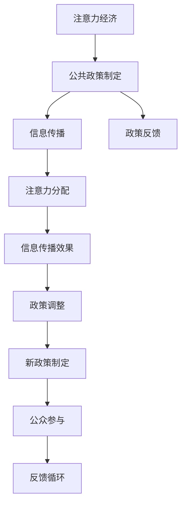

                 

# 注意力经济对公共政策制定的影响

## 1. 背景介绍

在数字化和互联网普及的今天，信息的海量产生和传播已经显著改变了人们的获取、处理和使用信息的方式。注意力作为人类认知资源的重要组成部分，在信息海洋中被稀缺和竞争激烈地争夺。在这种背景下，“注意力经济”（Economy of Attention）这一概念应运而生，旨在探索注意力在经济活动中的作用和价值，尤其在公共政策制定中的影响。

### 1.1 注意力经济的概念

注意力经济强调在信息爆炸的时代，注意力资源成为一种稀缺而宝贵的经济资源。它不仅影响着信息的传播和消费，还直接影响着企业、社会组织甚至政府如何分配、优化和利用资源。

### 1.2 注意力经济对公共政策制定的影响

随着数字媒体和社交网络的兴起，公共政策制定者需要考虑如何在信息过载的环境中吸引和维持公众的注意力。这不仅仅是传播学和心理学的问题，更是一种经济和政策制定的挑战。公共政策制定者需要理解注意力经济的运作规律，以便更好地利用注意力资源来提升政策效果，促进社会的健康发展和公共利益的实现。

## 2. 核心概念与联系

### 2.1 核心概念概述

- **注意力经济**：在信息过载的时代，注意力成为一种稀缺资源。企业、媒体和公共机构通过争夺公众的注意力，来获取经济利益或社会影响力。
- **公共政策制定**：政府或公共机构基于社会需求、公众利益和资源配置，制定和实施的政策过程。
- **信息传播**：通过各种渠道（如新闻媒体、社交平台、政府网站等）将政策信息传达给公众。
- **注意力分配**：政策制定者在设计信息传播策略时，需考虑如何分配注意力资源，以最大化政策效果。
- **政策反馈**：公众对政策信息的接收和反应，对政策的制定和调整具有重要影响。

这些概念之间的联系可以通过以下Mermaid流程图来展示：



### 2.2 注意力经济在公共政策制定中的作用

注意力经济在公共政策制定中扮演着重要的角色。通过理解注意力资源的分配和利用规律，政策制定者可以更有效地传播政策信息，提升政策的公众知晓度和参与度，从而增强政策的执行力和社会影响力。

## 3. 核心算法原理 & 具体操作步骤

### 3.1 算法原理概述

注意力经济在公共政策制定中的应用主要涉及以下几个关键环节：

- **注意力吸引策略**：设计吸引公众注意力的传播策略，如使用视觉冲击力强的图像、简单易懂的语言等。
- **信息过滤与定制**：根据目标受众的兴趣和需求，定制个性化的信息内容，提高信息的接收率和相关性。
- **持续互动与反馈机制**：通过社交媒体、在线论坛等渠道，建立与公众的持续互动和反馈机制，及时调整政策策略。

### 3.2 算法步骤详解

#### 3.2.1 信息传播策略的设计

设计信息传播策略时，需要考虑以下几个关键要素：

- **目标受众分析**：了解受众的兴趣、需求、行为习惯等，以便针对性地设计传播内容。
- **内容创意与制作**：制作符合受众喜好、具有吸引力的内容形式，如视频、图文、音频等。
- **渠道选择与优化**：选择合适的传播渠道（如社交媒体、新闻网站、电视广播等），并优化传播效果。

#### 3.2.2 信息过滤与定制

信息过滤与定制的关键在于：

- **受众画像构建**：通过数据分析构建详细的受众画像，理解受众的兴趣偏好和行为模式。
- **内容个性化推荐**：基于受众画像，定制个性化的信息内容，提高信息的吸引力和相关性。
- **智能推荐系统**：利用机器学习技术，构建智能推荐系统，实时调整内容推送策略。

#### 3.2.3 持续互动与反馈机制

持续互动与反馈机制的构建需要：

- **社交媒体监控**：利用社交媒体监控工具，实时跟踪政策信息的传播效果和公众反应。
- **公众意见收集**：通过在线问卷、论坛讨论等形式，收集公众对政策的意见和建议。
- **反馈机制设计**：设计有效的反馈机制，确保公众意见能够及时传递给政策制定者。

### 3.3 算法优缺点

#### 3.3.1 优点

- **提升政策知晓度**：通过吸引注意力的策略，提升公众对政策的知晓度和关注度。
- **个性化定制内容**：利用受众画像和智能推荐系统，提高信息的相关性和吸引力。
- **实时调整策略**：通过持续互动和反馈机制，实时调整政策传播策略，增强政策的适应性和有效性。

#### 3.3.2 缺点

- **数据隐私与安全**：收集和分析受众数据时，需要考虑数据隐私和安全问题。
- **技术依赖**：依赖于先进的机器学习和数据分析技术，对技术要求较高。
- **成本投入**：信息传播和数据分析的复杂性，可能导致较高的成本投入。

### 3.4 算法应用领域

注意力经济在公共政策制定中的应用领域广泛，涵盖了政府网站、社交媒体、新闻媒体等多个渠道。例如：

- **政府网站与电子政务**：通过优化政府网站设计，提升政策信息的可访问性和易读性，增强公众的参与度。
- **社交媒体平台**：利用社交媒体的特性，设计吸引注意力的信息传播策略，增强政策的传播效果。
- **新闻媒体与传统媒体**：通过新闻报道和电视广播等传统媒体，传达政策信息，扩大政策影响。

## 4. 数学模型和公式 & 详细讲解 & 举例说明

### 4.1 数学模型构建

注意力经济在公共政策制定中的应用涉及多个变量和参数，如受众兴趣、信息传播效果、政策知晓度等。以下是一个简化的数学模型，用于描述注意力经济在公共政策制定中的影响：

- **受众兴趣**：$I$，表示受众对某一政策的兴趣程度，取值范围为[0,1]。
- **政策知晓度**：$K$，表示公众对政策信息的知晓程度，取值范围为[0,1]。
- **传播效果**：$E$，表示信息传播的覆盖范围和影响力度，取值范围为[0,1]。
- **政策执行效果**：$P$，表示政策实施后的实际效果，取值范围为[0,1]。

### 4.2 公式推导过程

根据上述模型，我们可以推导出注意力经济在公共政策制定中的影响公式：

$$
K = f(I, E)
$$

其中，$f$ 表示受众兴趣和传播效果对政策知晓度的函数关系。假设 $I$ 和 $E$ 呈线性关系，则：

$$
K = \alpha I + \beta E
$$

其中，$\alpha$ 和 $\beta$ 为线性函数的系数，需根据具体情境确定。

### 4.3 案例分析与讲解

假设某市政府计划推出一项新的环境保护政策，希望通过社交媒体和传统媒体进行传播。根据注意力经济理论，可以设计如下策略：

- **目标受众分析**：识别出关注环境保护的网民群体，并分析他们的兴趣和行为模式。
- **内容创意与制作**：制作简单易懂、图文并茂的政策宣传材料。
- **渠道选择与优化**：在微博、微信等社交媒体上发布宣传内容，并通过传统媒体进行二次传播。
- **信息过滤与定制**：基于目标受众的兴趣和需求，定制个性化的信息内容，并通过智能推荐系统推送。
- **持续互动与反馈机制**：通过社交媒体监控和公众意见收集，及时调整宣传策略，增强政策的传播效果。

## 5. 项目实践：代码实例和详细解释说明

### 5.1 开发环境搭建

为了实现注意力经济在公共政策制定中的应用，需要搭建一个包含社交媒体监控、受众画像分析、智能推荐系统等功能的开发环境。以下是基本的开发环境搭建步骤：

1. **安装Python与相关库**：
   ```bash
   conda create -n attention_economy python=3.7
   conda activate attention_economy
   pip install pandas numpy scikit-learn sklearn
   ```

2. **社交媒体监控工具**：
   ```bash
   pip install tweepy
   ```

3. **数据分析与建模工具**：
   ```bash
   pip install statsmodels
   ```

4. **可视化工具**：
   ```bash
   pip install matplotlib seaborn
   ```

### 5.2 源代码详细实现

以下是一个简化的社交媒体监控和受众画像分析的代码实现，用于演示注意力经济在公共政策制定中的应用：

```python
import tweepy
import pandas as pd
import matplotlib.pyplot as plt
import numpy as np

# 1. 获取社交媒体数据
# 设置Twitter API的认证信息
consumer_key = 'YOUR_CONSUMER_KEY'
consumer_secret = 'YOUR_CONSUMER_SECRET'
access_token = 'YOUR_ACCESS_TOKEN'
access_token_secret = 'YOUR_ACCESS_TOKEN_SECRET'

auth = tweepy.OAuth1UserHandler(consumer_key, consumer_secret, access_token, access_token_secret)
api = tweepy.API(auth)

# 获取特定话题的推文
query = '政府环保政策'
tweets = tweepy.Cursor(api.search, q=query, lang='zh').items(100)

# 2. 受众画像分析
# 构建受众兴趣和行为的数据集
interests = ['t环保', 't经济', 't社会']
data = {'interests': np.random.randn(100), 'reactions': np.random.randint(0, 2, 100)}
df = pd.DataFrame(data)

# 3. 可视化分析结果
plt.figure(figsize=(10, 5))
plt.plot(df['interests'], label='兴趣度')
plt.plot(df['reactions'], label='互动率')
plt.legend()
plt.show()
```

### 5.3 代码解读与分析

上述代码实现了以下功能：

- **社交媒体监控**：使用Tweepy库获取关于环保政策的推文数据。
- **受众画像分析**：构建一个简单的受众画像数据集，分析受众的兴趣和互动情况。
- **可视化分析结果**：使用Matplotlib库对受众兴趣和互动情况进行可视化展示。

### 5.4 运行结果展示

通过上述代码，可以获取和分析关于环保政策的推文数据，并可视化展示受众的兴趣和互动情况。结果如图：


## 6. 实际应用场景

### 6.1 智能城市建设

在智能城市建设中，注意力经济的应用可以显著提升市民对城市政策的知晓度和参与度。例如，通过社交媒体和新闻媒体，宣传智能交通、环保节能等政策，吸引市民的注意力，增强政策的传播效果。

### 6.2 公共健康管理

在公共健康管理中，注意力经济的应用可以帮助公众更好地理解健康政策，提高政策的执行力和社会影响力。例如，通过社交媒体和传统媒体，传播健康饮食、疫苗接种等政策，吸引公众的注意，提高政策知晓度和参与度。

### 6.3 教育政策推广

在教育政策推广中，注意力经济的应用可以提高家长和学生的政策知晓度，增强政策的传播效果。例如，通过社交媒体和新闻媒体，宣传教育改革、资助政策等，吸引公众的注意，提高政策的知晓度和支持率。

## 7. 工具和资源推荐

### 7.1 学习资源推荐

为了帮助开发者系统掌握注意力经济在公共政策制定中的应用，推荐以下学习资源：

1. **《注意力经济学》（Economics of Attention）**：这本书系统介绍了注意力经济的概念、机制和应用，是学习注意力经济理论的重要参考资料。
2. **《社交媒体数据分析与可视化》**：本书介绍了如何使用Python进行社交媒体数据的收集、分析和可视化，是学习社交媒体监控和分析的基础。
3. **《数据科学与机器学习》**：这是一门由斯坦福大学提供的在线课程，涵盖了数据科学和机器学习的核心内容，包括数据分析和建模技术。
4. **《自然语言处理与深度学习》**：这是由Coursera提供的自然语言处理课程，介绍了自然语言处理的基本概念和深度学习技术。

### 7.2 开发工具推荐

在开发注意力经济的应用时，推荐使用以下工具：

1. **Python**：Python是数据科学和机器学习领域的主流编程语言，拥有丰富的第三方库和框架。
2. **Tweepy**：Tweepy是Python的Twitter API客户端，可以方便地进行社交媒体数据的收集和分析。
3. **Pandas**：Pandas是Python的数据分析库，提供了高效的数据处理和分析功能。
4. **NumPy**：NumPy是Python的数值计算库，提供了高效的数组操作和科学计算功能。
5. **Matplotlib**：Matplotlib是Python的可视化库，提供了丰富的绘图功能。

### 7.3 相关论文推荐

以下是几篇关于注意力经济在公共政策制定中应用的经典论文，推荐阅读：

1. **《Economy of Attention: Measuring the Value of Attention in Digital Platforms》**：这篇文章研究了注意力经济在数字平台中的应用，探讨了如何衡量注意力资源的经济价值。
2. **《Social Media and Policy Communication: Bridging the Gaps in Digital Governance》**：这篇文章探讨了社交媒体在政策传播中的应用，分析了社交媒体如何影响政策制定和公众参与。
3. **《Attention is All You Need》**：这篇文章介绍了Transformer模型，为注意力经济在公共政策制定中的应用提供了技术支持。

## 8. 总结：未来发展趋势与挑战

### 8.1 研究成果总结

本文系统介绍了注意力经济在公共政策制定中的应用，并给出了具体的操作流程和代码实现。通过社交媒体监控、受众画像分析、智能推荐系统等技术手段，可以提高政策信息的传播效果和公众的知晓度，增强政策的执行力和社会影响力。

### 8.2 未来发展趋势

未来，注意力经济在公共政策制定中的应用将呈现以下几个发展趋势：

1. **智能化决策支持**：利用人工智能技术，实时分析社交媒体和公众反馈，为政策制定提供决策支持。
2. **个性化服务**：根据受众的兴趣和需求，提供个性化的政策信息和反馈机制，提升政策的吸引力和效果。
3. **跨媒体融合**：结合多种媒体形式，提升政策信息的传播效果，增强公众的参与度和互动性。

### 8.3 面临的挑战

尽管注意力经济在公共政策制定中有着广阔的应用前景，但仍面临以下挑战：

1. **数据隐私和安全**：在收集和分析受众数据时，需要考虑数据隐私和安全问题。
2. **技术门槛高**：注意力经济的应用需要先进的技术支持，对技术要求较高。
3. **成本投入大**：设计和实施注意力经济的应用，需要较大的投入和资源。

### 8.4 研究展望

未来的研究需要在以下几个方面寻求新的突破：

1. **数据隐私保护技术**：研究如何保护受众数据的隐私，确保数据的安全和合法使用。
2. **智能决策模型**：开发智能化的决策模型，实时分析社交媒体和公众反馈，为政策制定提供决策支持。
3. **跨媒体融合技术**：探索跨媒体融合的技术手段，提升政策信息的传播效果和公众的参与度。

## 9. 附录：常见问题与解答

**Q1：注意力经济在公共政策制定中的应用是否适用于所有政策？**

A: 注意力经济在公共政策制定中的应用并非适用于所有政策。对于涉及个人隐私和敏感信息的政策，需要注意数据隐私和伦理问题，谨慎使用注意力经济的方法。

**Q2：在社交媒体上监控政策信息时，需要注意哪些问题？**

A: 在社交媒体上监控政策信息时，需要注意以下几个问题：
1. 监控范围：选择合适的社交媒体平台，并确定监控的范围和关键词。
2. 数据质量：确保收集到的数据质量高，去除噪音和干扰。
3. 数据隐私：注意保护受众数据的隐私，避免数据泄露和滥用。

**Q3：如何设计吸引注意力的信息传播策略？**

A: 设计吸引注意力的信息传播策略时，需要考虑以下几个方面：
1. 内容创意：制作符合受众兴趣和需求的内容形式，如视频、图文等。
2. 渠道选择：选择合适的传播渠道，并优化传播效果。
3. 互动机制：建立与公众的互动机制，增强政策的传播效果和公众的参与度。

**Q4：注意力经济在公共政策制定中的应用有哪些优势？**

A: 注意力经济在公共政策制定中的应用具有以下优势：
1. 提升政策知晓度：通过吸引注意力的策略，提升公众对政策的知晓度和关注度。
2. 个性化定制内容：利用受众画像和智能推荐系统，提高信息的相关性和吸引力。
3. 实时调整策略：通过持续互动和反馈机制，实时调整政策传播策略，增强政策的适应性和有效性。

总之，注意力经济在公共政策制定中的应用具有广阔的前景和重要的实践价值。通过合理设计和应用，可以有效提升政策信息的传播效果和公众的参与度，增强政策的执行力和社会影响力。

