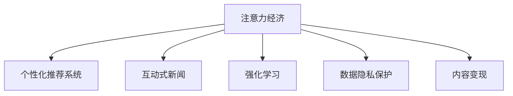

                 

# 注意力经济对新闻传播模式的改变

## 1. 背景介绍

### 1.1 问题由来
在信息化快速发展的时代背景下，注意力作为一种稀缺资源，已成为新闻传播领域极为重要的竞争点。传统的线性传播模式逐渐被注意力经济所替代，新闻传播由单纯的传递信息转变为争夺用户注意力的游戏。用户注意力不仅仅是点击量、浏览量等指标，更是深度互动、情感共鸣、内容变现等全方位的综合体现。

在这一过程中，新闻媒体及内容平台正面临着前所未有的挑战与机遇。如何更有效地吸引并保持用户注意力，进而实现流量变现，成为每一个新闻从业者和技术开发者的重要课题。

### 1.2 问题核心关键点
在注意力经济时代，新闻传播模式的改变主要表现在以下几个方面：

- 内容生产方式的多元化：从传统的单向传播转变为用户生成内容（UGC）、社交分享、互动直播等多种模式并存的传播方式。
- 个性化推荐的广泛应用：利用机器学习算法对用户兴趣进行精准匹配，实现内容推荐的高精准性和用户粘性。
- 交互式新闻的崛起：通过增强现实（AR）、虚拟现实（VR）、互动视频等多媒体形式，提升用户体验和参与感。
- 算法优化与人工干预的平衡：在算法驱动的内容推荐过程中，如何合理引入人工干预，平衡算法与人工的价值判断，是提高内容推荐效果的关键。
- 隐私保护与数据安全：如何在提升用户体验的同时，保障用户数据隐私，防止数据滥用，是技术开发过程中必须考虑的重要因素。

## 2. 核心概念与联系

### 2.1 核心概念概述

为更好地理解注意力经济对新闻传播模式的影响，本节将介绍几个核心概念：

- 注意力经济（Attention Economy）：指的是通过争夺用户的注意力来获取经济利益的一种经济形态。在新闻传播领域，注意力经济即指通过优化新闻内容，提升用户参与度，实现流量变现的商业模式。

- 个性化推荐系统（Personalized Recommendation System, PRS）：根据用户的历史行为和兴趣偏好，推荐符合其需求的相关内容，提升用户满意度，提高内容消费的效率和效果。

- 互动式新闻（Interactive Journalism）：结合多媒体形式和技术手段，允许用户以更互动、沉浸的方式参与到新闻内容生成和传播过程中，增强用户参与感和沉浸感。

- 强化学习（Reinforcement Learning, RL）：一种通过与环境互动，逐步优化决策策略的学习方式。在新闻推荐系统中，强化学习可应用于动态调整推荐策略，提升推荐效果。

- 数据隐私保护（Data Privacy Protection）：在用户数据收集与处理过程中，采取措施保障用户隐私，防止数据泄露和滥用。

- 内容变现（Content Monetization）：通过用户关注与互动，实现内容商业化变现，如广告收入、会员订阅、商品销售等。

这些概念之间的逻辑关系可以通过以下Mermaid流程图来展示：



这个流程图展示了大语言模型的核心概念及其之间的关系：

1. 注意力经济的核心在于争夺用户注意力，通过个性化推荐、互动新闻、强化学习等方式吸引用户参与。
2. 个性化推荐系统帮助精准匹配用户兴趣，提升用户满意度。
3. 互动式新闻增加用户沉浸感，提高用户参与度。
4. 强化学习通过不断优化推荐策略，提升推荐效果。
5. 数据隐私保护保障用户数据安全，防止数据滥用。
6. 内容变现实现流量变现，提升平台商业价值。

这些概念共同构成了注意力经济时代的传播模式，有助于新闻媒体和内容平台更好地争夺用户注意力，实现商业价值。

## 3. 核心算法原理 & 具体操作步骤
### 3.1 算法原理概述

注意力经济时代的新闻传播模式，依赖于一系列核心算法技术的支持。以下详细介绍其中几个关键算法原理：

- 协同过滤（Collaborative Filtering, CF）：通过分析用户行为数据，发现用户之间的相似性，推荐相似用户可能感兴趣的内容。协同过滤分为基于用户的CF和基于物品的CF两种方式。
- 内容推荐算法：根据内容的属性特征，如关键词、主题等，对用户进行精准匹配。内容推荐算法主要分为基于内容的推荐和混合推荐两种方式。
- 深度学习推荐系统（Deep Learning-based Recommendation System, DLRS）：通过构建深度神经网络模型，学习用户和内容的复杂非线性关系，提高推荐精准度。
- 强化学习推荐系统：通过在推荐场景中进行多轮交互，不断优化推荐策略，提升用户满意度。
- 信息过滤技术：如信息检索、降噪等技术，用于从大量信息中筛选出与用户需求相关的内容。

### 3.2 算法步骤详解

基于注意力经济的新闻推荐流程一般包括以下几个关键步骤：

**Step 1: 数据预处理与特征工程**
- 收集用户历史行为数据，包括浏览记录、点击记录、收藏记录等。
- 从用户行为数据中提取特征，如用户ID、物品ID、时间戳、地点等。
- 对数据进行标准化处理，去除噪声和异常值，进行缺失值填补。
- 将用户行为数据转化为数值向量，如用户行为序列向量化、物品特征向量化等。

**Step 2: 协同过滤模型训练**
- 基于用户行为数据，构建用户-物品相似度矩阵，使用基于用户的CF算法或基于物品的CF算法，训练协同过滤模型。
- 在训练过程中，使用交叉验证等方法进行模型参数调优，选择最佳模型参数。

**Step 3: 内容推荐模型训练**
- 根据用户行为数据，提取内容特征，如文章标题、关键词、作者、出版日期等。
- 使用基于内容的推荐算法或混合推荐算法，训练内容推荐模型。
- 在训练过程中，进行超参数调优，选择最优模型参数。

**Step 4: 深度学习模型训练**
- 构建深度神经网络模型，如MLP、RNN、CNN等，对用户行为数据进行建模。
- 使用深度学习推荐系统进行模型训练，优化模型参数。
- 在训练过程中，使用交叉验证等方法进行模型参数调优，选择最佳模型参数。

**Step 5: 强化学习模型训练**
- 在推荐场景中进行多轮交互，收集用户反馈数据。
- 使用强化学习算法，训练推荐策略，如Q-learning、SARSA等。
- 在训练过程中，进行超参数调优，选择最优模型参数。

**Step 6: 推荐结果输出**
- 根据用户行为数据和推荐模型输出结果，进行综合推荐。
- 根据推荐算法策略，选择合适的推荐结果进行展示。
- 对推荐结果进行实时监控和优化，根据用户反馈不断调整推荐策略。

### 3.3 算法优缺点

基于注意力经济的新闻推荐算法具有以下优点：

- 高效精准：通过多种算法结合，实现了高效、精准的推荐效果。
- 用户粘性高：个性化推荐、互动新闻等技术提升了用户参与度和满意度。
- 用户覆盖广：协同过滤和深度学习模型可对大量用户进行覆盖，提升推荐效果。
- 实时性高：通过实时数据分析和算法优化，可以实现高效的推荐结果输出。

同时，这些算法也存在一定的局限性：

- 数据需求高：协同过滤和深度学习模型需要大量用户行为数据，数据收集成本较高。
- 模型复杂度高：深度学习模型和强化学习模型需要较复杂的计算资源，训练成本较高。
- 推荐策略单一：目前多为基于内容的推荐和协同过滤推荐，缺乏对内容的情感分析、主题建模等多维度特征的考虑。
- 算法透明性差：推荐算法模型的决策过程较难解释，缺乏可解释性。
- 隐私保护难度大：用户数据隐私保护是一个复杂问题，需要综合考虑隐私保护和推荐效果之间的平衡。

尽管存在这些局限性，但就目前而言，这些基于注意力经济的新闻推荐算法仍是推动新闻传播模式变革的重要手段。未来相关研究的重点在于如何进一步降低数据需求，提高算法透明性和隐私保护能力，同时兼顾效率和效果。

### 3.4 算法应用领域

基于注意力经济的新闻推荐算法，在新闻传播领域已经得到了广泛的应用，覆盖了几乎所有常见场景，例如：

- 新闻门户网站：如人民日报、新浪新闻等，通过个性化推荐系统提升用户点击率和停留时间。
- 社交媒体平台：如微信、微博、抖音等，通过互动新闻和个性化推荐增强用户粘性，提升内容消费量。
- 视频流媒体平台：如腾讯视频、爱奇艺等，通过内容推荐和互动直播增强用户参与感，提高用户满意度。
- 电商平台：如淘宝、京东等，通过个性化推荐和社交化购物推荐提升用户购买意愿和忠诚度。
- 直播平台：如B站、快手等，通过互动直播和个性化推荐提升用户参与度和粘性。

除了上述这些经典场景外，新闻推荐算法还被创新性地应用到更多场景中，如广告推荐、知识图谱构建、智能客服等，为新闻传播技术带来了全新的突破。随着算法和技术的不断进步，相信新闻推荐算法将在更广阔的应用领域大放异彩。

## 4. 数学模型和公式 & 详细讲解  
### 4.1 数学模型构建

本节将使用数学语言对基于注意力经济的新闻推荐过程进行更加严格的刻画。

记用户行为数据为 $D=\{(x_i,y_i)\}_{i=1}^N$，其中 $x_i$ 为用户行为记录，$y_i$ 为用户行为标签。假设内容特征为 $f(x_i) \in \mathbb{R}^d$，物品特征为 $g(x_i) \in \mathbb{R}^m$。

定义内容推荐模型的损失函数为：

$$
\mathcal{L}(w)=\frac{1}{N}\sum_{i=1}^N \ell(x_i,y_i,w)
$$

其中 $\ell$ 为用户行为数据的损失函数，如交叉熵损失函数。模型参数为 $w \in \mathbb{R}^d \times \mathbb{R}^m$。

定义协同过滤模型的损失函数为：

$$
\mathcal{L}(W)=\frac{1}{N}\sum_{i=1}^N \ell(z_i,y_i,W)
$$

其中 $z_i$ 为用户行为记录转化为向量后的特征，$W \in \mathbb{R}^{K\times K}$ 为相似度矩阵，$K$ 为用户数。

定义深度学习推荐模型的损失函数为：

$$
\mathcal{L}(\theta)=\frac{1}{N}\sum_{i=1}^N \ell(x_i,y_i,\theta)
$$

其中 $\theta$ 为深度神经网络模型的参数，$\ell$ 为用户行为数据的损失函数，如交叉熵损失函数。

定义强化学习推荐模型的损失函数为：

$$
\mathcal{L}(\pi)=\frac{1}{N}\sum_{i=1}^N \ell(\pi(a_i|s_i),y_i)
$$

其中 $\pi(a_i|s_i)$ 为强化学习模型的动作策略，$a_i$ 为推荐策略，$s_i$ 为用户行为记录。

### 4.2 公式推导过程

以下我们以个性化推荐系统为例，推导深度学习模型的损失函数及其梯度计算公式。

假设深度学习推荐模型为 $f(x_i,w) \in [0,1]$，表示用户对物品的偏好程度。真实标签 $y_i \in \{0,1\}$。则个性化推荐系统的交叉熵损失函数定义为：

$$
\ell(f(x_i,y_i),y_i) = -y_i\log f(x_i)+(1-y_i)\log (1-f(x_i))
$$

将其代入经验风险公式，得：

$$
\mathcal{L}(w)=\frac{1}{N}\sum_{i=1}^N [y_i\log f(x_i)+(1-y_i)\log (1-f(x_i))]
$$

根据链式法则，损失函数对模型参数 $w$ 的梯度为：

$$
\frac{\partial \mathcal{L}(w)}{\partial w} = \frac{1}{N}\sum_{i=1}^N [(y_i-f(x_i))\frac{\partial f(x_i)}{\partial w}]
$$

其中 $\frac{\partial f(x_i)}{\partial w}$ 可通过自动微分技术完成计算。

在得到损失函数的梯度后，即可带入模型更新公式，完成模型的迭代优化。重复上述过程直至收敛，最终得到适应用户行为数据的最优模型参数 $w^*$。

## 5. 项目实践：代码实例和详细解释说明
### 5.1 开发环境搭建

在进行新闻推荐系统开发前，我们需要准备好开发环境。以下是使用Python进行TensorFlow开发的环境配置流程：

1. 安装Anaconda：从官网下载并安装Anaconda，用于创建独立的Python环境。

2. 创建并激活虚拟环境：
```bash
conda create -n news-rec sys python=3.8 
conda activate news-rec
```

3. 安装TensorFlow：根据CUDA版本，从官网获取对应的安装命令。例如：
```bash
conda install tensorflow=2.6 -c tensorflow -c conda-forge
```

4. 安装各类工具包：
```bash
pip install numpy pandas scikit-learn matplotlib tqdm jupyter notebook ipython
```

完成上述步骤后，即可在`news-rec`环境中开始新闻推荐系统的开发。

### 5.2 源代码详细实现

这里我们以协同过滤推荐系统为例，给出使用TensorFlow实现用户行为数据建模的代码实现。

首先，定义用户行为数据集：

```python
import tensorflow as tf
import pandas as pd

data = pd.read_csv('user_based_ratings.csv')
```

然后，定义协同过滤模型：

```python
from tensorflow.keras.layers import Embedding, Dot, Dense
from tensorflow.keras.models import Model

def collaborative_filtering_model(input_shape):
    user_embedding = Embedding(input_dim=n_users, output_dim=embedding_dim)(input_shape)
    item_embedding = Embedding(input_dim=n_items, output_dim=embedding_dim)(input_shape)
    similarity = Dot(axes=1)([user_embedding, item_embedding])
    prediction = Dense(1, activation='sigmoid')(similarity)
    return Model(inputs=input_shape, outputs=prediction)

n_users = data['user_id'].max() + 1
n_items = data['item_id'].max() + 1
embedding_dim = 100

model = collaborative_filtering_model((n_users, n_items))
```

接着，定义模型损失函数和优化器：

```python
from tensorflow.keras.losses import BinaryCrossentropy

model.compile(loss=BinaryCrossentropy(), optimizer='adam')
```

然后，定义训练和评估函数：

```python
from tensorflow.keras.preprocessing.sequence import pad_sequences

def train_epoch(model, train_data, batch_size, optimizer):
    dataloader = tf.data.Dataset.from_tensor_slices(train_data).shuffle(buffer_size=10000).batch(batch_size)
    model.train_on_batch(dataloader)
    loss = model.evaluate(dataloader)
    return loss

def evaluate(model, test_data, batch_size):
    dataloader = tf.data.Dataset.from_tensor_slices(test_data).shuffle(buffer_size=10000).batch(batch_size)
    loss = model.evaluate(dataloader)
    return loss
```

最后，启动训练流程并在测试集上评估：

```python
epochs = 10
batch_size = 128

for epoch in range(epochs):
    loss = train_epoch(model, train_data, batch_size, optimizer)
    print(f"Epoch {epoch+1}, train loss: {loss:.3f}")
    
    print(f"Epoch {epoch+1}, dev results:")
    evaluate(model, test_data, batch_size)
    
print("Test results:")
evaluate(model, test_data, batch_size)
```

以上就是使用TensorFlow实现协同过滤推荐系统的完整代码实现。可以看到，利用TensorFlow的高级API，协同过滤模型的构建和训练变得简单易懂。

### 5.3 代码解读与分析

让我们再详细解读一下关键代码的实现细节：

**用户行为数据集**：
- 使用Pandas读取用户行为数据，包括用户ID、物品ID、评分等字段。

**协同过滤模型**：
- 利用TensorFlow的Keras API，构建协同过滤模型，包括用户嵌入层、物品嵌入层和点积层。
- 使用Dense层将点积结果映射到0-1的评分预测值。

**模型训练与评估**：
- 利用TensorFlow的高级API，定义训练和评估函数。
- 在训练函数中，使用TensorFlow的Data API对数据进行批处理和随机抽样，并使用Adam优化器进行模型更新。
- 在评估函数中，同样使用TensorFlow的Data API进行批处理和随机抽样，使用BinaryCrossentropy作为损失函数进行模型评估。

可以看到，TensorFlow提供了强大的工具支持，使得协同过滤推荐系统的实现变得更加便捷和高效。

当然，实际应用中，还需要考虑更多因素，如模型的超参数调优、数据的归一化处理、模型的保存和部署等。但核心的协同过滤推荐逻辑基本与此类似。

## 6. 实际应用场景
### 6.1 智能广告推荐

在智能广告推荐场景中，新闻推荐技术可以充分利用用户的浏览记录、点击记录等行为数据，结合广告内容的多维特征，精准推荐广告位，实现最大化广告效果和用户满意度。例如，基于协同过滤和内容推荐算法，可以构建个性化广告推荐系统，推荐用户可能感兴趣的广告。

具体而言，可以收集用户在新闻网站或广告平台上的浏览和点击行为数据，将广告内容和用户行为数据整合，构建协同过滤模型和内容推荐模型。广告推荐算法根据用户行为数据和广告特征，动态调整推荐策略，优先推荐用户可能感兴趣的广告位，从而实现广告收入的最大化。

### 6.2 智能内容推送

智能内容推送是新闻推荐技术的重要应用场景之一。通过个性化推荐系统，新闻平台可以精准推送用户感兴趣的内容，提升用户粘性，提高用户活跃度和满意度。

例如，基于协同过滤和深度学习推荐算法，可以构建个性化内容推送系统，推荐用户可能感兴趣的新闻文章。在推送过程中，可以结合用户行为数据和文章内容特征，动态调整推荐策略，实现内容推送的高精准性和用户满意度。

### 6.3 智能会议推荐

在智能会议推荐场景中，新闻推荐技术可以帮助会议组织者根据用户的兴趣和偏好，推荐适合的会议议题和嘉宾。例如，基于协同过滤和深度学习推荐算法，可以构建个性化会议推荐系统，推荐用户可能感兴趣的会议议题和嘉宾。

具体而言，可以收集用户在会议平台上的浏览和交互行为数据，将会议议题和嘉宾信息整合，构建协同过滤模型和内容推荐模型。会议推荐算法根据用户行为数据和会议内容特征，动态调整推荐策略，优先推荐用户可能感兴趣的主题和嘉宾，从而提高会议的参与度和效果。

### 6.4 未来应用展望

随着深度学习技术的发展，基于注意力经济的新闻推荐技术将进一步拓展应用场景，带来更多的创新和突破。

1. 多模态新闻推荐：结合文本、图像、音频等多种信息源，构建多模态新闻推荐系统，提升推荐效果和用户体验。例如，利用视觉特征对新闻图片进行内容理解，提升图像新闻的推荐精准度。

2. 交互式新闻推荐：结合增强现实（AR）、虚拟现实（VR）、互动视频等多种技术手段，构建交互式新闻推荐系统，增强用户沉浸感和参与感。例如，利用AR技术对新闻事件进行三维建模，增强用户对新闻内容的理解和记忆。

3. 跨领域新闻推荐：结合不同领域的知识图谱和推荐算法，构建跨领域新闻推荐系统，实现多领域内容的高效推荐。例如，利用知识图谱对新闻事件进行语义分析，实现跨领域的相似新闻推荐。

4. 实时新闻推荐：结合实时数据流和推荐算法，构建实时新闻推荐系统，实现对热点事件的快速响应和精准推荐。例如，利用数据流处理技术对热点事件进行实时分析，快速推荐相关新闻内容。

5. 自动化新闻编辑：结合自然语言处理（NLP）和推荐算法，构建自动化新闻编辑系统，实现新闻内容的自动化生成和优化。例如，利用NLP技术对新闻内容进行自动摘要和优化，提升新闻内容的质量和吸引力。

这些应用场景展示了新闻推荐技术在实际应用中的巨大潜力，相信随着技术的不断进步，新闻推荐技术将进一步推动新闻传播模式的变革，带来更加丰富和个性化的新闻体验。

## 7. 工具和资源推荐
### 7.1 学习资源推荐

为了帮助开发者系统掌握新闻推荐技术，这里推荐一些优质的学习资源：

1. 《推荐系统实战》书籍：详细介绍了推荐系统从基础到高级的各种技术，包括协同过滤、深度学习推荐系统、强化学习推荐系统等。

2. 《新闻推荐系统》课程：由斯坦福大学开设的推荐系统课程，涵盖推荐系统的基础原理和实际应用，包括新闻推荐系统。

3. 《深度学习推荐系统》课程：由清华大学开设的深度学习课程，涵盖了深度学习在推荐系统中的应用，包括新闻推荐系统。

4. 《TensorFlow官方文档》：TensorFlow官方文档提供了详尽的API参考和案例教程，是学习TensorFlow的重要资源。

5. 《Keras官方文档》：Keras官方文档提供了Keras API的详细使用说明和示例代码，是学习深度学习推荐系统的重要资源。

通过对这些资源的学习实践，相信你一定能够快速掌握新闻推荐技术的精髓，并用于解决实际的新闻传播问题。
###  7.2 开发工具推荐

高效的开发离不开优秀的工具支持。以下是几款用于新闻推荐系统开发的常用工具：

1. TensorFlow：基于Python的开源深度学习框架，灵活动态的计算图，适合快速迭代研究。TensorFlow提供了丰富的工具和API，支持多种推荐算法模型的构建。

2. PyTorch：基于Python的开源深度学习框架，灵活易用，适合科研和生产应用。PyTorch提供了强大的GPU加速能力和分布式训练支持，适用于大规模推荐系统的开发。

3. Hadoop/Spark：用于大数据处理的分布式计算框架，可以高效处理海量用户行为数据，支持推荐算法的分布式训练和推理。

4. Kafk：用于实时数据流处理的分布式消息系统，可以实时获取和处理用户行为数据，支持实时推荐系统的开发。

5. Elasticsearch：用于大数据存储和检索的分布式搜索引擎，可以高效存储和检索用户行为数据，支持推荐算法的模型训练和部署。

6. Jupyter Notebook：交互式编程环境，可以方便地进行模型训练和结果展示，适合科研和开发使用。

合理利用这些工具，可以显著提升新闻推荐系统的开发效率，加快创新迭代的步伐。

### 7.3 相关论文推荐

新闻推荐技术的发展源于学界的持续研究。以下是几篇奠基性的相关论文，推荐阅读：

1. "A Probabilistic Model of Active Users: Application to Recommendation"：提出协同过滤推荐算法，奠定了推荐系统研究的基础。

2. "Adaptive Prototype Networks for Recommendations"：提出基于内容的推荐算法，提高了推荐系统的多样性和精准度。

3. "A Distributed Asynchronous Deep Learning Algorithm with Exponential Convergence Rates"：提出深度学习推荐算法，提高了推荐系统的复杂度。

4. "Deep Factorization Machines for Recommender Systems"：提出深度神经网络模型，提高了推荐系统的效果和泛化能力。

5. "Robust Stochastic Dual Coordinate Ascent"：提出强化学习算法，实现了推荐策略的动态优化。

这些论文代表了大语言模型推荐技术的发展脉络。通过学习这些前沿成果，可以帮助研究者把握学科前进方向，激发更多的创新灵感。

## 8. 总结：未来发展趋势与挑战

### 8.1 总结

本文对基于注意力经济的新闻推荐方法进行了全面系统的介绍。首先阐述了注意力经济对新闻传播模式的影响，明确了个性化推荐、互动新闻、深度学习、强化学习等技术在新闻推荐中的应用价值。其次，从原理到实践，详细讲解了新闻推荐系统的数学模型和关键算法，给出了推荐系统开发的完整代码实例。同时，本文还广泛探讨了新闻推荐系统在智能广告、智能内容推送、智能会议推荐等实际应用场景中的具体应用，展示了新闻推荐技术的巨大潜力。最后，本文精选了新闻推荐技术的各类学习资源，力求为开发者提供全方位的技术指引。

通过本文的系统梳理，可以看到，基于注意力经济的新闻推荐技术正在成为新闻传播模式的重要手段，极大地提升了新闻内容的推荐效果和用户满意度。未来，随着预训练模型和推荐算法的不断进步，相信新闻推荐技术将在更多领域得到应用，为新闻媒体和内容平台带来更加智能、高效的服务体验。

### 8.2 未来发展趋势

展望未来，基于注意力经济的新闻推荐技术将呈现以下几个发展趋势：

1. 推荐算法的多样化：推荐算法不再局限于协同过滤、深度学习等单一方法，而是结合多种算法，提升推荐效果和多样性。

2. 实时推荐系统的普及：实时推荐系统能够快速响应用户需求，提高用户满意度和平台互动性，将逐步普及到各大新闻媒体和内容平台。

3. 多模态推荐系统的崛起：多模态推荐系统结合文本、图像、音频等多种信息源，提升推荐效果和用户体验。

4. 跨领域推荐系统的推广：跨领域推荐系统能够实现多领域内容的高效推荐，推动不同领域之间的数据共享和知识融合。

5. 深度学习模型的优化：深度学习模型将更加注重模型的轻量化、实时化、可解释性，提升推荐效果和用户信任度。

6. 推荐系统的个性化定制：推荐系统将更加注重用户个性化需求，提供更加定制化的服务体验，增强用户粘性。

这些趋势凸显了新闻推荐技术的发展方向，相信随着技术的不断进步，新闻推荐技术将在新闻媒体和内容平台中发挥更大的作用，带来更加丰富、个性化的新闻体验。

### 8.3 面临的挑战

尽管基于注意力经济的新闻推荐技术已经取得了瞩目成就，但在迈向更加智能化、普适化应用的过程中，它仍面临着诸多挑战：

1. 数据需求高：推荐算法需要大量用户行为数据，数据收集成本较高。如何高效收集和处理海量用户数据，是推荐系统开发的首要问题。

2. 模型复杂度高：深度学习模型和强化学习模型需要较复杂的计算资源，训练成本较高。如何降低模型复杂度，提高模型训练和推理效率，是推荐系统优化的关键。

3. 算法透明性差：推荐算法模型的决策过程较难解释，缺乏可解释性。如何提高算法的透明性，增强用户信任，是推荐系统开发的重要课题。

4. 隐私保护难度大：用户数据隐私保护是一个复杂问题，需要综合考虑隐私保护和推荐效果之间的平衡。如何保障用户数据隐私，防止数据滥用，是推荐系统开发的重要保障。

5. 推荐效果不稳定：推荐系统面临的多变环境和多维度数据，导致推荐效果不稳定，容易出现偏见和偏差。如何提高推荐系统的鲁棒性，减少偏见和偏差，是推荐系统开发的重要挑战。

6. 推荐系统泛化能力不足：当前推荐系统大多基于静态数据进行训练，对动态数据和突发事件的应对能力不足。如何提升推荐系统的泛化能力，实现动态推荐，是推荐系统开发的重要方向。

这些挑战凸显了新闻推荐技术的实际应用难度，但随着技术的不断进步和优化，相信推荐系统将在新闻媒体和内容平台中发挥更加重要的作用，带来更加智能、高效、个性化的新闻体验。

### 8.4 研究展望

面对新闻推荐技术面临的种种挑战，未来的研究需要在以下几个方面寻求新的突破：

1. 探索无监督和半监督推荐方法。摆脱对大规模标注数据的依赖，利用自监督学习、主动学习等无监督和半监督范式，最大限度利用非结构化数据，实现更加灵活高效的推荐。

2. 研究参数高效和计算高效的推荐范式。开发更加参数高效的推荐方法，在固定大部分预训练参数的同时，只更新极少量的任务相关参数。同时优化推荐模型的计算图，减少前向传播和反向传播的资源消耗，实现更加轻量级、实时性的部署。

3. 融合因果和对比学习范式。通过引入因果推断和对比学习思想，增强推荐模型建立稳定因果关系的能力，学习更加普适、鲁棒的语言表征，从而提升推荐效果。

4. 引入更多先验知识。将符号化的先验知识，如知识图谱、逻辑规则等，与神经网络模型进行巧妙融合，引导推荐过程学习更准确、合理的语言模型。同时加强不同模态数据的整合，实现视觉、语音等多模态信息与文本信息的协同建模。

5. 结合因果分析和博弈论工具。将因果分析方法引入推荐模型，识别出推荐模型的关键特征，增强推荐输出的因果性和逻辑性。借助博弈论工具刻画人机交互过程，主动探索并规避推荐模型的脆弱点，提高系统稳定性。

6. 纳入伦理道德约束。在推荐目标中引入伦理导向的评估指标，过滤和惩罚有偏见、有害的输出倾向。同时加强人工干预和审核，建立推荐行为的监管机制，确保推荐系统的公平性、透明性和可解释性。

这些研究方向将引领新闻推荐技术的不断进步，推动新闻媒体和内容平台的智能化转型，提升新闻传播的效率和效果，为新闻业带来更加丰富、个性化的新闻体验。面向未来，新闻推荐技术需要更多的跨学科合作，综合考虑用户需求、内容特性、技术手段等多方面因素，才能不断创新突破，实现推荐系统的深度优化。

## 9. 附录：常见问题与解答

**Q1：新闻推荐系统如何处理冷启动问题？**

A: 冷启动问题是新闻推荐系统面临的一个重要问题，指在新用户或新物品加入时，由于缺乏足够的历史行为数据，推荐系统无法进行准确推荐。为了解决这个问题，可以采用以下方法：

1. 基于内容的推荐：利用物品的特征信息，进行推荐，如新闻标题、摘要、作者等。

2. 基于协同过滤的推荐：利用用户和物品的相似度矩阵，进行推荐，如用户-物品协同过滤推荐算法。

3. 基于深度学习的推荐：利用用户和物品的特征，进行推荐，如深度神经网络模型。

4. 用户初始化：根据用户兴趣点，进行推荐，如使用基于兴趣标签的推荐算法。

5. 社交网络推荐：利用用户的社交关系，进行推荐，如基于社交网络推荐算法。

通过多种方法结合，可以有效缓解冷启动问题，提升推荐系统的效果。

**Q2：新闻推荐系统如何应对多样性需求？**

A: 新闻推荐系统面临的一个重要问题是，如何应对不同用户的多样性需求。为了解决这个问题，可以采用以下方法：

1. 多样性推荐算法：利用多样性推荐算法，如交替优化算法、马太效应控制算法等，控制推荐结果的多样性。

2. 多目标优化：将推荐目标分解为多个目标，如覆盖度、新颖性、个性化等，进行多目标优化。

3. 上下文感知推荐：利用上下文信息，进行推荐，如基于时间、地点、情境的推荐算法。

4. 个性化推荐：根据用户的历史行为数据，进行个性化推荐，如协同过滤推荐算法。

5. 混合推荐：结合多种推荐算法，提升推荐效果，如混合推荐算法。

通过多种方法结合，可以有效应对用户的多样性需求，提升推荐系统的效果。

**Q3：新闻推荐系统如何应对数据稀疏性问题？**

A: 新闻推荐系统面临的一个重要问题是，如何应对数据稀疏性问题。为了解决这个问题，可以采用以下方法：

1. 矩阵分解推荐算法：利用矩阵分解算法，对用户行为矩阵进行低秩分解，提升推荐效果。

2. 基于模型的推荐算法：利用模型对用户行为数据进行建模，提升推荐效果，如深度神经网络模型。

3. 协同过滤推荐算法：利用协同过滤算法，对用户行为数据进行建模，提升推荐效果。

4. 增强推荐算法：利用增强学习算法，对推荐策略进行动态优化，提升推荐效果。

5. 特征工程：通过特征工程，提升推荐系统的泛化能力，如基于内容的特征工程、上下文感知特征工程等。

通过多种方法结合，可以有效应对数据稀疏性问题，提升推荐系统的效果。

**Q4：新闻推荐系统如何应对推荐结果的稳定性问题？**

A: 新闻推荐系统面临的一个重要问题是，如何应对推荐结果的稳定性问题。为了解决这个问题，可以采用以下方法：

1. 协同过滤推荐算法：利用协同过滤推荐算法，对用户行为数据进行建模，提升推荐效果的稳定性。

2. 深度学习推荐算法：利用深度学习推荐算法，对用户行为数据进行建模，提升推荐效果的稳定性。

3. 混合推荐算法：结合多种推荐算法，提升推荐效果的稳定性。

4. 数据增强：通过数据增强，提升推荐系统的鲁棒性，如对抗样本增强、噪声增强等。

5. 模型优化：通过模型优化，提升推荐系统的鲁棒性，如正则化、dropout等。

通过多种方法结合，可以有效应对推荐结果的稳定性问题，提升推荐系统的效果。

**Q5：新闻推荐系统如何应对推荐结果的可解释性问题？**

A: 新闻推荐系统面临的一个重要问题是，如何应对推荐结果的可解释性问题。为了解决这个问题，可以采用以下方法：

1. 特征可视化：利用特征可视化技术，对推荐结果进行解释，如t-SNE、PCA等。

2. 基于规则的推荐：利用基于规则的推荐算法，进行解释，如基于内容的推荐算法。

3. 增强学习推荐：利用增强学习算法，进行解释，如强化学习推荐算法。

4. 可解释性模型：利用可解释性模型，进行解释，如LIME、SHAP等。

5. 用户反馈机制：通过用户反馈机制，进行解释，如用户反馈评分机制。

通过多种方法结合，可以有效应对推荐结果的可解释性问题，提升推荐系统的透明度和可信度。

---

作者：禅与计算机程序设计艺术 / Zen and the Art of Computer Programming

