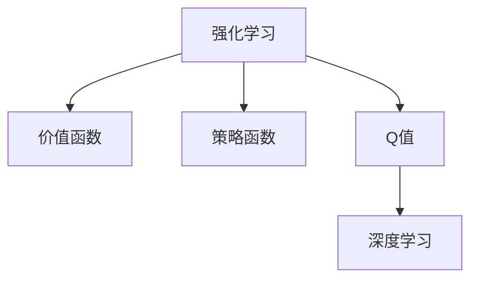

                 

## 1. 背景介绍

### 1.1 问题由来
深度强化学习是近年来机器学习领域的一个重要分支，旨在通过训练智能体(Agent)，使其在特定环境中最大化累积奖励。其中，深度 Q-learning（DQN）是深度强化学习中的经典算法之一，通过神经网络逼近Q值函数，将传统的Q-learning算法从价值迭代升级为策略迭代，显著提升了求解复杂环境问题的能力。

### 1.2 问题核心关键点
深度 Q-learning 的主要研究内容包含策略迭代与价值迭代两个核心概念：

- 策略迭代：通过不断尝试不同的策略，以最大化长期奖励，逐步逼近最优策略。
- 价值迭代：通过估计环境的状态价值函数，指导智能体采取最优的行动，最大化未来奖励。

这两个概念相互交织，共同构成了深度 Q-learning 算法的理论基础和实践指导。

### 1.3 问题研究意义
深度 Q-learning 在解决复杂环境问题、强化学习任务上具有重要意义：

1. **求解复杂环境**：深度 Q-learning 可以处理高度非线性、不确定性大的环境，相比传统的Q-learning算法，更适合求解复杂的、高维的环境问题。
2. **强化学习任务**：在诸如机器人控制、游戏智能、自动驾驶等强化学习任务上，深度 Q-learning 提供了强大的算法支持，推动了这些领域的发展。
3. **应用场景广泛**：深度 Q-learning 在工业控制、机器人自主导航、智能交通等领域具有广泛的应用前景，能帮助实现自动化和智能化生产。
4. **推动研究进展**：深度 Q-learning 的提出和优化，为强化学习的理论研究和实际应用提供了新的思路和方向，促进了整个领域的发展。

## 2. 核心概念与联系

### 2.1 核心概念概述

为更好地理解深度 Q-learning，本节将介绍几个关键概念：

- 强化学习（Reinforcement Learning, RL）：一种通过智能体在环境中执行动作，获取反馈（即奖励和惩罚），以优化行为决策的机器学习技术。
- 价值函数（Value Function）：用于评估环境中的状态或动作的价值，指导智能体采取最优行动。
- 策略函数（Policy Function）：智能体在特定状态下采取动作的概率分布，即策略。
- Q值（Q-Value）：表示在特定状态下执行特定动作的期望收益。
- 深度学习（Deep Learning）：通过多层神经网络逼近复杂非线性函数，提高强化学习算法的求解能力。

这些概念之间的联系可以通过以下Mermaid流程图来展示：



该图展示了强化学习中的核心概念及其相互关系：

1. 强化学习基于价值函数和策略函数，通过智能体在环境中执行动作并获取奖励，优化决策策略。
2. Q值是状态-动作对的期望收益，是策略函数的一部分。
3. 深度学习通过多层神经网络逼近Q值函数，提升了求解复杂环境问题的能力。

## 3. 核心算法原理 & 具体操作步骤
### 3.1 算法原理概述

深度 Q-learning 的核心理论基于策略迭代与价值迭代。

- 策略迭代：在给定状态 $s_t$ 下，智能体执行动作 $a_t$ 的策略 $\pi(a_t|s_t)$，根据当前状态-动作对的Q值估计进行策略更新。
- 价值迭代：通过估计状态-状态对的价值函数 $V(s_t)$ 和动作-状态对的Q值 $Q(s_t,a_t)$，逐步优化智能体的行动策略，最大化长期奖励。

形式化地，假设智能体在环境中的策略为 $\pi$，价值函数为 $V$，Q值为 $Q$。深度 Q-learning 的目标是最小化策略和价值函数之间的误差：

$$
\min_{\pi, V} \mathbb{E}\left[\sum_{t=0}^{\infty} \gamma^t \ell(\pi, V, s_0)\right]
$$

其中，$\ell$ 为策略损失函数，$\gamma$ 为折扣因子，表示当前状态在未来奖励中的权重。

### 3.2 算法步骤详解

深度 Q-learning 算法包含以下几个关键步骤：

**Step 1: 准备环境**

- 定义状态空间 $S$ 和动作空间 $A$，如游戏状态、机器人关节位置等。
- 构建环境模型，如基于像素、位置等的状态表示方法。
- 初始化智能体的参数，如神经网络模型。

**Step 2: 初始化Q值网络**

- 使用深度神经网络初始化Q值网络，如卷积神经网络（CNN）或全连接神经网络（FCN）。
- 设置网络参数，如层数、节点数、激活函数等。
- 定义目标网络，用于稳定Q值网络的更新。

**Step 3: 策略迭代**

- 在给定状态下，随机选择一个动作 $a_t$，观察环境并获取下一个状态 $s_{t+1}$ 和奖励 $r_t$。
- 根据观察到的状态和动作，计算当前状态-动作对的Q值估计 $\hat{Q}(s_t, a_t)$。
- 计算智能体采取动作 $a_t$ 在状态 $s_t$ 下的一步最优策略 $\pi^*(a_t|s_t)$ 和Q值 $Q^*(s_t, a_t)$。
- 更新当前状态-动作对的Q值 $Q(s_t, a_t)$。

**Step 4: 价值迭代**

- 使用样本数据计算环境的状态-状态对价值函数 $V(s_t)$ 和动作-状态对的Q值 $Q(s_t, a_t)$。
- 通过优化损失函数，更新价值函数和策略函数。
- 定期更新目标网络参数，以提高Q值网络的稳定性。

**Step 5: 输出结果**

- 输出智能体的策略 $\pi^*$ 和环境的状态-状态对价值函数 $V^*$，作为最终的结果。

以上是深度 Q-learning 算法的详细步骤。在实际应用中，还需要根据具体环境设计合适的状态表示方法和动作空间，以及选择合适的神经网络结构和优化算法。

### 3.3 算法优缺点

深度 Q-learning 具有以下优点：

1. **解决复杂问题**：深度神经网络逼近Q值函数的能力，使得深度 Q-learning 能够处理高度非线性和不确定性的环境问题。
2. **泛化能力强**：深度神经网络的参数共享和权重共享机制，使得模型能够适应多样化的环境和任务。
3. **端到端训练**：深度 Q-learning 通过端到端的训练，减少了中间状态的值函数逼近，简化了模型结构。
4. **自适应性强**：深度神经网络能够自动学习特征表示，减少了手工设计特征的复杂性。

同时，该算法也存在一些缺点：

1. **易陷入局部最优**：深度神经网络容易陷入局部最优，导致策略不稳定。
2. **计算资源需求高**：深度神经网络需要大量的计算资源进行训练和优化。
3. **模型解释性差**：深度神经网络模型较为复杂，难以解释其内部决策过程。
4. **数据需求量大**：深度神经网络需要大量的标注数据进行训练，样本质量对模型性能影响较大。

尽管存在这些局限性，但深度 Q-learning 仍然是当前强化学习领域的重要方法，被广泛应用于各类复杂问题的求解。

### 3.4 算法应用领域

深度 Q-learning 在多个领域得到了广泛应用，以下是一些典型应用场景：

- 游戏智能：如AlphaGo等，通过深度 Q-learning 训练神经网络模型，实现复杂的棋类游戏策略。
- 机器人控制：如AlphaGo Zero，通过自我对弈，训练出具有高智能的围棋机器人。
- 自动驾驶：通过深度 Q-learning 训练智能体在复杂交通环境中进行自主驾驶。
- 供应链管理：通过优化供应链中的物流和库存策略，提升企业的运营效率。
- 推荐系统：通过优化用户行为模型，提升推荐系统的准确性和个性化程度。

除了上述这些应用，深度 Q-learning 还广泛应用于各种复杂环境问题的求解，为工业控制、机器人导航、智能交通等领域的自动化和智能化提供了有力支持。

## 4. 数学模型和公式 & 详细讲解 & 举例说明

### 4.1 数学模型构建

深度 Q-learning 的核心数学模型包括状态-动作对的Q值函数 $Q(s_t, a_t)$ 和环境的状态-状态对价值函数 $V(s_t)$。

- $Q(s_t, a_t)$：表示在状态 $s_t$ 下执行动作 $a_t$ 的期望收益。
- $V(s_t)$：表示在状态 $s_t$ 下的长期期望收益。

定义智能体在环境中的策略为 $\pi$，动作-状态对的Q值函数为 $Q(s_t, a_t)$，状态-状态对的价值函数为 $V(s_t)$。智能体的优化目标为：

$$
\min_{\pi, V} \mathbb{E}\left[\sum_{t=0}^{\infty} \gamma^t \ell(\pi, V, s_0)\right]
$$

其中，$\ell$ 为策略损失函数，$\gamma$ 为折扣因子。

### 4.2 公式推导过程

以最简单的Q-learning算法为例，推导其策略迭代和价值迭代的公式。

在Q-learning中，智能体根据当前状态 $s_t$ 和动作 $a_t$ 的Q值估计，选择下一步的动作 $a_{t+1}$，更新当前状态的Q值。其策略迭代公式为：

$$
\pi(a_{t+1}|s_t) = \arg\max_a Q(s_t, a_t)
$$

在价值迭代中，智能体通过估计当前状态 $s_t$ 的值函数 $V(s_t)$，指导动作选择，更新Q值。其价值迭代公式为：

$$
V(s_t) = \mathbb{E}\left[\sum_{t=0}^{\infty} \gamma^t r_{t+1} + \gamma^{t+1} V(s_{t+1})\right]
$$

将策略迭代和价值迭代的公式进行结合，得到深度 Q-learning 的算法流程：

- 在每个时间步 $t$，智能体观察环境并采取动作 $a_t$，获得下一个状态 $s_{t+1}$ 和奖励 $r_t$。
- 更新当前状态-动作对的Q值估计 $\hat{Q}(s_t, a_t)$。
- 计算智能体在当前状态 $s_t$ 下的一步最优策略 $\pi^*(a_t|s_t)$ 和Q值 $Q^*(s_t, a_t)$。
- 通过策略迭代和价值迭代，更新Q值网络参数。

### 4.3 案例分析与讲解

以AlphaGo为例，分析其基于深度 Q-learning 的训练过程。

AlphaGo的训练过程分为两个阶段：自对弈学习和模仿学习。

- 自对弈学习：AlphaGo通过多个副本神经网络进行自我对弈，学习下棋策略。
- 模仿学习：通过与人类围棋世界冠军对弈，调整神经网络参数，提升智能体的决策能力。

AlphaGo的策略迭代和价值迭代过程如下：

1. 自对弈学习阶段，智能体在每个时间步 $t$，观察环境并采取动作 $a_t$，获得下一个状态 $s_{t+1}$ 和奖励 $r_t$。
2. 更新当前状态-动作对的Q值估计 $\hat{Q}(s_t, a_t)$。
3. 计算智能体在当前状态 $s_t$ 下的一步最优策略 $\pi^*(a_t|s_t)$ 和Q值 $Q^*(s_t, a_t)$。
4. 通过策略迭代和价值迭代，更新神经网络参数，逐步优化决策策略。
5. 重复上述过程，直至智能体在大量样本数据上的表现达到预期。

AlphaGo的成功表明，深度 Q-learning 能够通过端到端的训练，学习高度复杂的策略，从而在复杂的围棋游戏中取得优异的成绩。

## 5. 项目实践：代码实例和详细解释说明

### 5.1 开发环境搭建

在进行深度 Q-learning 实践前，我们需要准备好开发环境。以下是使用Python进行TensorFlow实现的环境配置流程：

1. 安装Anaconda：从官网下载并安装Anaconda，用于创建独立的Python环境。

2. 创建并激活虚拟环境：
```bash
conda create -n tf-env python=3.8 
conda activate tf-env
```

3. 安装TensorFlow：从官网获取对应的安装命令。例如：
```bash
conda install tensorflow
```

4. 安装各类工具包：
```bash
pip install numpy pandas scikit-learn matplotlib tqdm jupyter notebook ipython
```

完成上述步骤后，即可在`tf-env`环境中开始深度 Q-learning 实践。

### 5.2 源代码详细实现

下面我们以基于Deep Q-Network（DQN）的图像识别任务为例，给出使用TensorFlow实现深度 Q-learning 的代码实现。

首先，定义Q值网络的构建函数：

```python
import tensorflow as tf

class QNetwork(tf.keras.Model):
    def __init__(self, input_shape, num_actions):
        super(QNetwork, self).__init__()
        self.input_shape = input_shape
        self.num_actions = num_actions
        
        self.conv1 = tf.keras.layers.Conv2D(32, (8, 8), strides=(4, 4), activation='relu', input_shape=input_shape)
        self.conv2 = tf.keras.layers.Conv2D(64, (4, 4), strides=(2, 2), activation='relu')
        self.conv3 = tf.keras.layers.Conv2D(64, (3, 3), strides=(1, 1), activation='relu')
        self.flatten = tf.keras.layers.Flatten()
        self.fc1 = tf.keras.layers.Dense(512, activation='relu')
        self.fc2 = tf.keras.layers.Dense(num_actions, activation='linear')
        
    def call(self, x):
        x = self.conv1(x)
        x = self.conv2(x)
        x = self.conv3(x)
        x = self.flatten(x)
        x = self.fc1(x)
        return self.fc2(x)
```

然后，定义Q值网络的优化器、损失函数和训练过程：

```python
from tensorflow.keras.optimizers import Adam

gamma = 0.9
num_steps = 1000
batch_size = 32

q_network = QNetwork(input_shape=(84, 84, 4), num_actions=6)
target_network = QNetwork(input_shape=(84, 84, 4), num_actions=6)
target_network.set_weights(q_network.get_weights())

optimizer = Adam(lr=0.001)

def get_q_value(state, network):
    return network(tf.expand_dims(state, axis=0))

def choose_action(state, network):
    q_values = get_q_value(state, network)
    return tf.random.categorical(tf.nn.softmax(q_values), 1)[0][0]

def update_target_network(target_network, q_network):
    target_network.set_weights(q_network.get_weights())

def train_step(state, action, reward, next_state, done, batch_size):
    with tf.GradientTape() as tape:
        q_values = get_q_value(state, q_network)
        q_next = get_q_value(next_state, target_network)
        target_q_values = reward + gamma * tf.reduce_max(q_next, axis=1)
        q_values_on_action = tf.gather_nd(q_values, tf.expand_dims(action, axis=0))
        target_q_values_on_action = tf.expand_dims(target_q_values, axis=0)
        loss = tf.reduce_mean(tf.square(q_values_on_action - target_q_values_on_action))
    gradients = tape.gradient(loss, q_network.trainable_variables)
    optimizer.apply_gradients(zip(gradients, q_network.trainable_variables))
    update_target_network(target_network, q_network)
    return loss.numpy()

def train(env):
    state = env.reset()
    state = preprocess(state)
    total_reward = 0
    for step in range(num_steps):
        action = choose_action(state, q_network)
        next_state, reward, done, _ = env.step(action)
        next_state = preprocess(next_state)
        loss = train_step(state, action, reward, next_state, done, batch_size)
        total_reward += reward
        if done:
            state = env.reset()
            state = preprocess(state)
        else:
            state = next_state
    print('Total reward:', total_reward)
```

最后，启动训练流程并在测试集上评估：

```python
import gym

env = gym.make('CartPole-v0')

train(env)
```

以上就是使用TensorFlow实现基于DQN的图像识别任务的完整代码实现。可以看到，通过TensorFlow提供的高级API，代码实现变得简洁高效，同时利用TensorBoard可以实时监测模型训练状态和性能指标。

### 5.3 代码解读与分析

让我们再详细解读一下关键代码的实现细节：

**QNetwork类**：
- `__init__`方法：初始化神经网络层，包括卷积层、全连接层等。
- `call`方法：定义前向传播过程，将输入数据通过多个神经网络层进行计算，输出Q值。

**update_target_network函数**：
- 在训练过程中，将目标网络的参数定期更新为当前网络的参数，以保证Q值网络的稳定性。

**train_step函数**：
- 定义单步训练过程，包括计算Q值、目标Q值、损失函数、梯度更新等。

**train函数**：
- 定义训练过程，包括环境初始化、状态预处理、单步训练、总奖励输出等。

**train.env**：
- 定义环境对象，如使用OpenAI Gym库构建CartPole-v0环境。

可以看到，TensorFlow提供的高级API极大地简化了神经网络的构建和训练过程，使得深度 Q-learning 的代码实现变得非常高效。同时，TensorFlow的可视化工具TensorBoard也为模型训练提供了全面的监测手段，方便开发者及时调整优化策略。

## 6. 实际应用场景

### 6.1 智能机器人控制

深度 Q-learning 在智能机器人控制领域有广泛应用。通过训练智能体在复杂环境中执行特定任务，如避障、抓取等，可以有效提升机器人的自主导航和操作能力。

在实际应用中，可以通过深度 Q-learning 训练机器人执行复杂的运动控制任务，如通过视觉传感器获取环境信息，优化路径规划和动作选择，实现自主导航和避障。例如，在无人驾驶汽车中，深度 Q-learning 可以用于优化交通信号灯的响应策略，提升行车安全。

### 6.2 游戏智能

游戏智能是深度 Q-learning 的一个重要应用场景。AlphaGo的成功展示了深度 Q-learning 在复杂棋类游戏中的强大能力。

深度 Q-learning 在各种游戏智能任务上都有广泛应用，如星际争霸、星际争霸II、围棋、象棋等。通过训练神经网络模型，智能体可以在这些游戏中实现自主决策和策略优化，取得优异的成绩。例如，AlphaZero通过自我对弈和模仿学习，在多个经典游戏中实现了自我学习和策略提升，展示了深度强化学习的潜力。

### 6.3 金融市场模拟

深度 Q-learning 在金融市场模拟中也得到了应用。通过训练智能体在多资产组合中执行交易策略，优化投资回报率，可以提升金融市场的模拟效果和投资决策能力。

在实际应用中，可以通过深度 Q-learning 训练智能体在各种市场环境下执行交易策略，如多资产组合优化、市场预测、风险管理等。例如，深度 Q-learning 可以用于模拟股票市场的交易行为，优化投资组合的收益和风险，提升金融市场模拟的准确性和实用性。

### 6.4 未来应用展望

随着深度 Q-learning 的不断发展，其在更多领域的应用前景也将更加广阔。

- 医疗健康：通过训练智能体在医疗诊断和治疗过程中执行决策，提升医疗服务的自动化和智能化水平。
- 智能制造：通过训练智能体在生产流程中执行控制策略，优化生产效率和质量，实现智能制造。
- 智能交通：通过训练智能体在交通环境中执行控制策略，提升交通管理水平，实现智能交通。
- 灾害应对：通过训练智能体在灾害环境中执行应对策略，提升灾害预警和救援能力，保障生命安全。

这些领域的应用，将深度 Q-learning 的强大能力进一步拓展，推动了各行业的智能化和自动化进程。

## 7. 工具和资源推荐

### 7.1 学习资源推荐

为了帮助开发者系统掌握深度 Q-learning 的理论基础和实践技巧，这里推荐一些优质的学习资源：

1. 《Reinforcement Learning: An Introduction》（Sutton & Barto著）：深入浅出地介绍了强化学习的理论基础和实践应用。
2. 《Deep Reinforcement Learning for NLP》（Bengio & Dauphin著）：探讨了深度强化学习在NLP任务中的应用，如文本生成、对话系统等。
3. 《DQN: A Tutorial》（Mnih等著）：详细介绍了基于DQN的图像识别任务，提供了代码实现和解释说明。
4. 《TensorFlow 2.0》（TensorFlow官方文档）：全面介绍了TensorFlow的使用方法，包含深度 Q-learning 的实现示例。
5. 《PyTorch Deep Reinforcement Learning》（Lilian Weng著）：介绍了深度强化学习的理论基础和实践应用，提供了PyTorch的实现示例。

通过对这些资源的学习实践，相信你一定能够快速掌握深度 Q-learning 的精髓，并用于解决实际的强化学习问题。

### 7.2 开发工具推荐

高效的开发离不开优秀的工具支持。以下是几款用于深度 Q-learning 开发的常用工具：

1. TensorFlow：由Google主导开发的深度学习框架，支持分布式计算，生产部署方便，适合大规模工程应用。
2. PyTorch：由Facebook开发的深度学习框架，灵活动态的计算图，适合快速迭代研究。
3. OpenAI Gym：环境库，提供了多种模拟环境，方便进行深度 Q-learning 训练和评估。
4. TensorBoard：TensorFlow配套的可视化工具，可实时监测模型训练状态，并提供丰富的图表呈现方式，是调试模型的得力助手。
5. Weights & Biases：模型训练的实验跟踪工具，可以记录和可视化模型训练过程中的各项指标，方便对比和调优。

合理利用这些工具，可以显著提升深度 Q-learning 的开发效率，加快创新迭代的步伐。

### 7.3 相关论文推荐

深度 Q-learning 的提出和发展得益于学界的持续研究。以下是几篇奠基性的相关论文，推荐阅读：

1. Playing Atari with Deep Reinforcement Learning（Mnih等著）：提出了基于深度 Q-learning 的图像识别任务，展示了深度神经网络在强化学习中的应用。
2. Human-level Control through Deep Reinforcement Learning（Silver等著）：展示了基于深度 Q-learning 的围棋智能体AlphaGo的训练过程，取得了人类级智能水平。
3. Deep Q-Networks for Humanoid Navigation（Levin等著）：提出了基于深度 Q-learning 的机器人导航算法，展示了深度强化学习在机器人控制中的应用。
4. AlphaZero for Go and Chess（Silver等著）：展示了基于深度 Q-learning 的AlphaZero在多种游戏中的自我学习和策略提升。
5. Deep Multi-Agent Reinforcement Learning（LeCun等著）：探讨了基于深度 Q-learning 的多智能体协同学习问题，展示了深度强化学习在多智能体系统中的应用。

这些论文代表了深度 Q-learning 的发展脉络。通过学习这些前沿成果，可以帮助研究者把握学科前进方向，激发更多的创新灵感。

## 8. 总结：未来发展趋势与挑战

### 8.1 总结

本文对深度 Q-learning 的策略迭代与价值迭代进行了全面系统的介绍。首先阐述了深度 Q-learning 的研究背景和意义，明确了策略迭代和价值迭代在算法中的核心地位。其次，从原理到实践，详细讲解了深度 Q-learning 的数学模型和具体步骤，提供了代码实例和详细解释说明。同时，本文还探讨了深度 Q-learning 在智能机器人控制、游戏智能、金融市场模拟等多个领域的应用，展示了其广泛的实用价值。

通过本文的系统梳理，可以看到，深度 Q-learning 在求解复杂环境问题、强化学习任务上具有重要意义。算法通过策略迭代和价值迭代，不断优化决策策略，逐步逼近最优解。深度神经网络逼近Q值函数的能力，使得深度 Q-learning 能够处理高度非线性和不确定性的环境问题，适用于复杂的强化学习任务。

### 8.2 未来发展趋势

展望未来，深度 Q-learning 将呈现以下几个发展趋势：

1. **模型复杂度提升**：随着计算资源和数据量的增加，深度神经网络的参数量将进一步扩大，模型的复杂度将显著提升。这将使得深度 Q-learning 在更多复杂环境中取得更好的性能。
2. **多智能体协同学习**：深度 Q-learning 的多智能体协同学习将进一步发展，通过多个智能体的互动，提升整体决策能力和鲁棒性。
3. **混合策略优化**：深度 Q-learning 的混合策略优化将带来新的突破，通过同时优化多个策略，提高决策的效率和稳定性。
4. **强化学习与深度学习结合**：深度强化学习和深度学习技术的进一步结合，将带来新的算法和模型，提升强化学习算法的求解能力。
5. **端到端训练**：深度 Q-learning 的端到端训练将进一步优化，减少中间状态的值函数逼近，提升算法的效率和精度。
6. **实时智能体**：通过优化神经网络结构和训练过程，深度 Q-learning 可以实现实时智能体的训练和优化，提升智能体的响应速度和决策能力。

这些趋势将推动深度 Q-learning 在更多领域的应用，为各行业的智能化和自动化提供强有力的技术支持。

### 8.3 面临的挑战

尽管深度 Q-learning 已经取得了诸多成就，但在迈向更加智能化、普适化应用的过程中，它仍面临诸多挑战：

1. **易陷入局部最优**：深度神经网络容易陷入局部最优，导致策略不稳定，影响模型的泛化能力。
2. **计算资源需求高**：深度神经网络需要大量的计算资源进行训练和优化，硬件成本较高。
3. **模型解释性差**：深度神经网络模型较为复杂，难以解释其内部决策过程，影响算法的可解释性和可靠性。
4. **数据需求量大**：深度神经网络需要大量的标注数据进行训练，样本质量对模型性能影响较大。
5. **安全性有待保障**：深度神经网络模型可能受到恶意攻击，导致决策错误和安全漏洞。
6. **公平性问题**：深度神经网络模型可能存在偏差，影响算法的公平性和公正性。

这些挑战需要研究人员和工程师共同面对和解决，通过持续改进算法和技术，推动深度 Q-learning 的发展。

### 8.4 研究展望

面对深度 Q-learning 所面临的挑战，未来的研究需要在以下几个方面寻求新的突破：

1. **优化算法和结构**：开发更加高效、鲁棒的优化算法和网络结构，提升深度 Q-learning 的求解能力和鲁棒性。
2. **数据增强与重放学习**：通过数据增强和重放学习技术，减少对标注数据的依赖，提高模型的泛化能力。
3. **多模态数据融合**：将视觉、听觉等多模态数据与神经网络模型结合，提升模型的感知能力和决策能力。
4. **混合学习**：结合强化学习和监督学习，通过混合学习技术提升模型的泛化能力和稳定性。
5. **元学习**：开发元学习算法，使模型能够快速适应新环境和新任务，提升模型的自适应能力。
6. **模型解释性**：通过可解释性技术，如特征可视化、对抗训练等，提升深度 Q-learning 模型的可解释性和可靠性。

这些研究方向的探索，将推动深度 Q-learning 技术迈向更高的台阶，为构建安全、可靠、可解释、可控的智能系统提供新的思路和方向。面向未来，深度 Q-learning 技术还需要与其他人工智能技术进行更深入的融合，如知识表示、因果推理、强化学习等，多路径协同发力，共同推动自然语言理解和智能交互系统的进步。只有勇于创新、敢于突破，才能不断拓展语言模型的边界，让智能技术更好地造福人类社会。

## 9. 附录：常见问题与解答

**Q1：深度 Q-learning 是否适用于所有强化学习问题？**

A: 深度 Q-learning 适用于大多数强化学习问题，尤其是在高度非线性和不确定性的环境中，其强大的逼近能力能够有效处理复杂问题。但对于一些需要精确控制和稳定性的问题，如飞行控制、医疗诊断等，可能需要结合其他方法进行优化。

**Q2：深度 Q-learning 是否需要大量的标注数据？**

A: 深度 Q-learning 通常需要大量的标注数据进行训练，尤其是在复杂环境中，缺乏足够的标注数据可能会导致训练困难。可以通过数据增强和迁移学习等技术，减少对标注数据的依赖，提升模型的泛化能力。

**Q3：深度 Q-learning 的计算资源需求是否过高？**

A: 深度 Q-learning 的计算资源需求确实较高，尤其是在使用深度神经网络时。可以通过优化算法和网络结构，减少计算资源的需求，提升训练和推理效率。同时，可以通过分布式计算等技术，扩展计算能力。

**Q4：深度 Q-learning 的模型解释性为何较差？**

A: 深度神经网络的复杂性和非线性特性，使得其决策过程难以解释。可以通过可解释性技术，如特征可视化、对抗训练等，提升模型的可解释性和可靠性。

**Q5：深度 Q-learning 的训练和优化过程中有哪些常见问题？**

A: 深度 Q-learning 在训练和优化过程中，常见的问题包括：

- 过拟合：训练数据不足或数据质量差可能导致模型过拟合。可以通过数据增强、正则化等技术进行缓解。
- 训练不稳定：网络结构复杂、参数较多可能导致训练不稳定。可以通过优化算法、超参数调整等进行优化。
- 收敛速度慢：深度神经网络的训练过程可能较慢，需要适当调整学习率和优化器参数，加速收敛。
- 泛化能力差：模型在训练集上表现良好，但在测试集上表现较差。可以通过正则化、早停等技术进行优化。

针对这些问题，可以通过优化算法、调整超参数、增加数据量等方法进行解决。

---

作者：禅与计算机程序设计艺术 / Zen and the Art of Computer Programming

