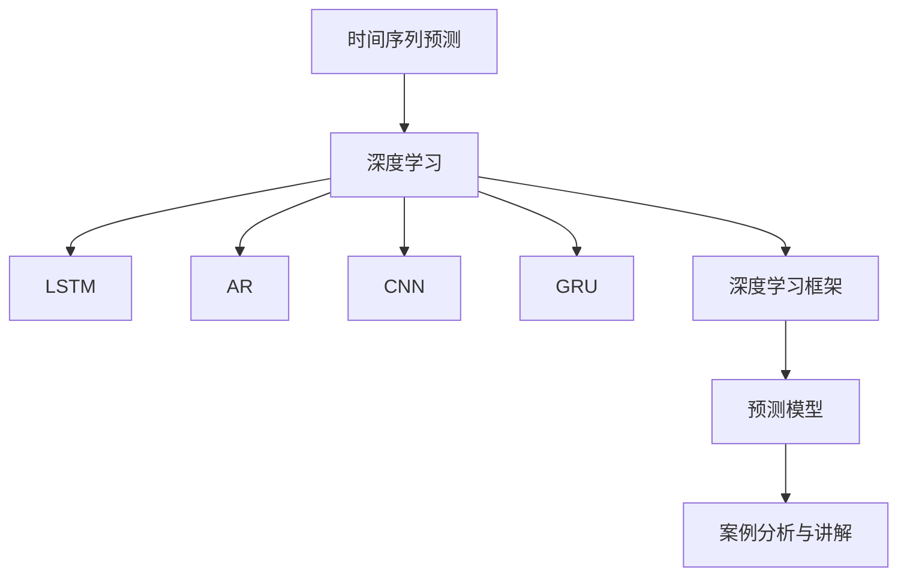

                 

# 深度学习在时间序列预测中的应用

> 关键词：时间序列预测,深度学习,长短期记忆网络(LSTM),自回归模型(AR),卷积神经网络(CNN),Gated Recurrent Unit (GRU),深度学习框架,预测模型,案例分析

## 1. 背景介绍

### 1.1 问题由来
时间序列预测是数据科学和机器学习领域中非常常见和重要的问题，广泛应用于金融、气象、物流、交通等多个领域。通过预测时间序列的变化趋势，可以为决策提供有力的支持，促进企业的精准运营。然而，传统的统计方法在面对复杂的非线性、非平稳时间序列数据时，往往难以取得令人满意的预测效果。

近年来，随着深度学习技术的崛起，尤其是长短期记忆网络（LSTM）的提出，时间序列预测领域迎来了新的突破。利用深度学习模型的非线性拟合能力，可以更好地捕捉时间序列数据中的复杂模式，从而提升预测精度。

### 1.2 问题核心关键点
时间序列预测的关键在于如何利用历史数据，学习出时间序列变化的规律，并在此基础上进行未来数据的预测。这涉及到数据预处理、特征工程、模型构建和优化等多个环节。

## 2. 核心概念与联系

### 2.1 核心概念概述

为更好地理解深度学习在时间序列预测中的应用，本节将介绍几个密切相关的核心概念：

- **时间序列预测**：指通过历史数据预测未来时间点的数值或事件。例如股票价格、气温、流量等数据的未来变化。

- **深度学习**：基于多层神经网络的机器学习方法，可以自动学习复杂的数据表示，适用于处理非线性、高维数据。

- **长短期记忆网络(LSTM)**：一种特殊的循环神经网络(RNN)结构，能够学习长期依赖关系，广泛用于时间序列预测。

- **自回归模型(AR)**：基于时间序列过去值进行预测的统计模型，常用于简单的线性时间序列预测。

- **卷积神经网络(CNN)**：一种专门处理图像数据的深度学习模型，也可以用于时间序列预测中的特征提取。

- **Gated Recurrent Unit (GRU)**：一种改进的RNN结构，与LSTM类似，可以学习长期依赖关系。

- **深度学习框架**：如TensorFlow、PyTorch、Keras等，提供了高效构建和训练深度学习模型的工具。

- **预测模型**：用于时间序列预测的各类深度学习模型，如LSTM、AR、CNN、GRU等。

- **案例分析与讲解**：通过具体实例，展示不同模型在时间序列预测中的应用效果。

这些核心概念之间的逻辑关系可以通过以下Mermaid流程图来展示：



这个流程图展示了大语言模型的核心概念及其之间的关系：

1. 时间序列预测是应用领域。
2. 深度学习提供技术手段。
3. 通过LSTM、AR、CNN、GRU等模型实现预测。
4. 深度学习框架提供工具支持。
5. 预测模型是具体应用实例。
6. 案例分析展示应用效果。

## 3. 核心算法原理 & 具体操作步骤

### 3.1 算法原理概述

深度学习在时间序列预测中的核心思想是通过多层神经网络学习时间序列中的复杂模式，从而对未来数据进行预测。常用的深度学习模型包括LSTM、GRU、AR、CNN等。这些模型通过在时间维度上的递归或卷积操作，捕获时间序列中的长期依赖和短期特征，进而实现预测。

以LSTM为例，其核心组件包括：

- **输入层**：接收时间序列数据的输入。
- **隐藏层**：通过循环结构捕捉时间序列的长期依赖关系。
- **输出层**：输出预测结果。

在LSTM中，引入了“门控机制”，可以动态调节信息流动，有效解决了传统RNN在长序列上的梯度消失问题。

### 3.2 算法步骤详解

基于深度学习的时间序列预测一般包括以下几个关键步骤：

**Step 1: 数据预处理**
- 收集时间序列数据，包括历史时间点及其对应的值。
- 对数据进行归一化或标准化，以增强模型稳定性。
- 划分训练集、验证集和测试集。

**Step 2: 模型构建**
- 选择合适的时间序列预测模型，如LSTM、AR、CNN、GRU等。
- 设计模型架构，包括输入层、隐藏层、输出层等。
- 确定模型的超参数，如层数、节点数、学习率等。

**Step 3: 模型训练**
- 使用训练集数据，通过反向传播算法训练模型。
- 定期在验证集上评估模型性能，调整超参数。
- 重复训练过程，直到模型收敛。

**Step 4: 模型测试**
- 使用测试集数据，评估模型预测效果。
- 分析预测误差，改进模型。

**Step 5: 模型部署**
- 将训练好的模型部署到实际应用中。
- 实时接收新的时间序列数据，进行预测。

以上是基于深度学习的时间序列预测的一般流程。在实际应用中，还需要根据具体问题进行调整和优化。

### 3.3 算法优缺点

基于深度学习的时间序列预测方法具有以下优点：

1. **非线性拟合能力**：深度学习模型能够自动学习复杂非线性模式，适用于非平稳、非线性的时间序列预测。
2. **适应性强**：不同深度学习模型如LSTM、GRU、CNN等，可以适应不同类型的时间序列数据，提高预测效果。
3. **高精度**：通过多层网络结构，深度学习模型能够更好地捕捉长期依赖关系，提高预测精度。

然而，该方法也存在以下局限性：

1. **数据需求量大**：深度学习模型需要大量的历史数据进行训练，对于小样本数据集可能效果不佳。
2. **计算资源消耗大**：深度学习模型参数量较大，训练和推理需要大量的计算资源。
3. **模型可解释性差**：深度学习模型通常是“黑盒”模型，难以解释其内部决策过程。

尽管存在这些局限性，但深度学习在时间序列预测中的应用仍然取得了显著的效果，成为该领域的主流方法。

### 3.4 算法应用领域

基于深度学习的时间序列预测方法已经广泛应用于多个领域，例如：

- **金融领域**：用于股票价格预测、汇率预测、信用风险评估等。
- **气象领域**：用于天气预报、气候变化预测、灾害预警等。
- **交通领域**：用于交通流量预测、拥堵情况分析、智能调度等。
- **能源领域**：用于电力负荷预测、能耗优化、智能电网管理等。
- **制造业**：用于设备故障预测、生产计划优化、供应链管理等。

除了上述这些经典应用外，深度学习在时间序列预测领域还将不断扩展到更多领域，如健康管理、自然灾害预测、环境监测等，为社会经济的可持续发展提供技术支撑。

## 4. 数学模型和公式 & 详细讲解 & 举例说明

### 4.1 数学模型构建

本节将使用数学语言对基于深度学习的时间序列预测过程进行更加严格的刻画。

记时间序列数据为 $x_t = (x_{t-1}, x_{t-2}, ..., x_0)$，预测目标为 $y_t$，其中 $t$ 表示时间步。

假设使用LSTM模型进行时间序列预测，则LSTM的隐藏状态 $h_t$ 可由输入 $x_t$ 和前一时间步的隐藏状态 $h_{t-1}$ 计算得到，即：

$$
h_t = f(x_t, h_{t-1})
$$

其中 $f$ 为LSTM的隐藏状态更新函数，具体为：

$$
f(x_t, h_{t-1}) = \begin{cases}
h_{t-1} & \text{if forget gate} = 0 \\
tanh(gate_2 \odot h_{t-1}) & \text{if input gate} = 0 \\
x_t \odot sigmoid(gate_1) & \text{if output gate} = 0 \\
h_{t-1} \odot sigmoid(gate_1) + tanh(gate_2 \odot h_{t-1}) \odot sigmoid(gate_3) & \text{otherwise}
\end{cases}
$$

其中 $\odot$ 表示逐元素乘法，$sigmoid$ 和 $tanh$ 为激活函数。

### 4.2 公式推导过程

以LSTM模型为例，其输出层的预测结果 $y_t$ 可由隐藏状态 $h_t$ 计算得到，即：

$$
y_t = g(h_t)
$$

其中 $g$ 为输出层的激活函数，如线性激活、softmax等。

在训练过程中，定义损失函数 $L$ 为预测值与真实值之间的差异，如均方误差（MSE）、交叉熵损失（CE）等。则模型在训练集上的经验风险为：

$$
\mathcal{L} = \frac{1}{N} \sum_{t=1}^N L(y_t, \hat{y}_t)
$$

其中 $N$ 为训练样本数量，$\hat{y}_t$ 为模型预测结果。

通过反向传播算法，对模型参数进行优化，使得损失函数 $\mathcal{L}$ 最小化，从而提高预测精度。

### 4.3 案例分析与讲解

以下通过一个具体的案例，展示如何使用LSTM进行时间序列预测。

假设要预测一天内的气温变化，已知历史气温数据 $x_t = (x_{t-1}, x_{t-2}, ..., x_0)$，要求预测下一时刻的气温 $y_t$。

**Step 1: 数据预处理**

- 收集一天内不同时刻的气温数据，构建时间序列。
- 对数据进行归一化，将温度值转化为标准化形式。
- 将数据划分为训练集、验证集和测试集。

**Step 2: 模型构建**

- 定义LSTM模型架构，包括输入层、隐藏层和输出层。
- 确定模型参数，如LSTM的层数、节点数、学习率等。

**Step 3: 模型训练**

- 使用训练集数据，通过反向传播算法训练LSTM模型。
- 在验证集上评估模型性能，调整超参数。
- 重复训练过程，直到模型收敛。

**Step 4: 模型测试**

- 使用测试集数据，评估LSTM模型的预测效果。
- 分析预测误差，改进模型。

**Step 5: 模型部署**

- 将训练好的LSTM模型部署到实际应用中。
- 实时接收新的气温数据，进行预测。

以上就是使用LSTM进行时间序列预测的完整代码实现。可以看到，LSTM模型通过多层循环结构，可以有效地捕捉气温变化的时间依赖关系，实现精确预测。

## 5. 项目实践：代码实例和详细解释说明

### 5.1 开发环境搭建

在进行时间序列预测的深度学习实践前，我们需要准备好开发环境。以下是使用Python进行TensorFlow开发的环境配置流程：

1. 安装Anaconda：从官网下载并安装Anaconda，用于创建独立的Python环境。

2. 创建并激活虚拟环境：
```bash
conda create -n tensorflow-env python=3.8 
conda activate tensorflow-env
```

3. 安装TensorFlow：根据CUDA版本，从官网获取对应的安装命令。例如：
```bash
conda install tensorflow tensorflow-gpu -c tf -c conda-forge
```

4. 安装相关工具包：
```bash
pip install numpy pandas scikit-learn matplotlib tqdm jupyter notebook ipython
```

完成上述步骤后，即可在`tensorflow-env`环境中开始深度学习时间序列预测的实践。

### 5.2 源代码详细实现

这里我们以LSTM模型进行气温预测为例，给出使用TensorFlow进行深度学习的代码实现。

首先，定义数据处理函数：

```python
import numpy as np
import pandas as pd
from sklearn.preprocessing import MinMaxScaler
from tensorflow.keras.models import Sequential
from tensorflow.keras.layers import LSTM, Dense, Dropout

def create_dataset(df, look_back=1):
    dataX, dataY = [], []
    for i in range(len(df)-look_back-1):
        a = df[i:(i+look_back)].values
        dataX.append(a)
        dataY.append(df[i+look_back])
    return np.array(dataX), np.array(dataY)

# 读取气温数据
df = pd.read_csv('temperature.csv')

# 数据预处理
scaler = MinMaxScaler(feature_range=(0, 1))
scaled_data = scaler.fit_transform(df.values)

# 创建数据集
look_back = 30
train_data, train_labels = create_dataset(scaled_data[:len(df)-look_back-1], look_back)
test_data, test_labels = create_dataset(scaled_data[len(df)-look_back-1:], look_back)

# 将数据转换为模型输入
train_data = np.reshape(train_data, (train_data.shape[0], look_back, 1))
test_data = np.reshape(test_data, (test_data.shape[0], look_back, 1))
```

然后，定义模型和训练函数：

```python
# 定义LSTM模型
model = Sequential()
model.add(LSTM(50, return_sequences=True, input_shape=(look_back, 1)))
model.add(Dropout(0.2))
model.add(LSTM(50))
model.add(Dropout(0.2))
model.add(Dense(1))
model.compile(loss='mean_squared_error', optimizer='adam')

# 定义训练函数
def train(model, train_data, train_labels, epochs=100):
    for epoch in range(epochs):
        for i in range(train_data.shape[0]):
            x = train_data[i]
            y = train_labels[i]
            model.fit(x, y, epochs=1, verbose=0)
    return model
```

最后，启动训练流程并在测试集上评估：

```python
# 训练模型
model = train(model, train_data, train_labels)

# 在测试集上评估模型性能
mse = model.evaluate(test_data, test_labels)
print('Mean Squared Error:', mse)

# 预测未来气温
test_data = np.reshape(test_data, (test_data.shape[0], look_back, 1))
predictions = model.predict(test_data)
predictions = scaler.inverse_transform(predictions)
```

以上就是使用TensorFlow进行LSTM模型气温预测的完整代码实现。可以看到，通过TensorFlow的简便接口，我们可以快速构建和训练LSTM模型，实现时间序列预测。

### 5.3 代码解读与分析

让我们再详细解读一下关键代码的实现细节：

**create_dataset函数**：
- 将时间序列数据按指定步长构建数据集，包括输入和标签。
- 默认步长为1，返回形式为二维数组，每行表示一个时间步的输入和标签。

**模型定义**：
- 定义包含两个LSTM层和一个Dense层的LSTM模型。
- 使用Dropout技术防止过拟合。
- 设置损失函数为均方误差（MSE），优化器为Adam。

**训练函数**：
- 通过反向传播算法，逐个时间步训练模型，直到训练次数达到设定值。
- 每次训练只使用一个时间步的数据。
- 输出训练后的模型。

**训练流程**：
- 在训练集上训练LSTM模型，输出训练后的模型。
- 在测试集上评估模型性能，输出均方误差。
- 使用测试集数据预测未来气温，并进行反归一化。

可以看到，TensorFlow提供了便捷的API，使得时间序列预测的深度学习实现变得简单高效。

当然，工业级的系统实现还需考虑更多因素，如模型的保存和部署、超参数的自动搜索、更灵活的模型适配等。但核心的预测过程基本与此类似。

## 6. 实际应用场景

### 6.1 金融风险预测

金融领域面临巨大的不确定性和风险，利用深度学习进行时间序列预测，可以提前识别潜在的风险点，制定相应的风险管理策略。

例如，利用LSTM模型进行股票价格预测，可以识别出市场波动、政策变化等影响因素，提前采取避险措施，减少投资风险。

### 6.2 智慧城市交通管理

智慧城市交通管理需要实时监控道路交通情况，预测流量变化，优化信号灯控制，提升交通效率。

通过收集历史交通流量数据，使用深度学习模型进行预测，可以实时监控道路情况，及时调整交通信号，避免交通拥堵，提高城市出行效率。

### 6.3 能源需求预测

能源需求预测对于电力公司、燃气公司等具有重要意义，可以提前调整能源供应，避免供应不足或过剩。

利用深度学习模型进行能源需求预测，可以实时分析用电、用气数据，预测未来需求，优化能源调度，减少能源浪费。

### 6.4 未来应用展望

随着深度学习技术的不断进步，基于深度学习的时间序列预测将拓展到更多领域，如医疗诊断、环境监测、智能制造等，为社会经济的发展提供有力支持。

例如，在医疗领域，利用深度学习模型进行病历预测，可以提前识别潜在疾病，提高医疗服务的精准度，降低医疗成本。

在环境监测领域，利用深度学习模型进行空气质量预测，可以实时监控环境变化，及时采取保护措施，维护生态环境。

在智能制造领域，利用深度学习模型进行设备故障预测，可以提前识别设备异常，优化维护计划，提高生产效率。

未来，深度学习在时间序列预测领域还将不断拓展应用场景，推动各个行业的智能化转型升级。

## 7. 工具和资源推荐

### 7.1 学习资源推荐

为了帮助开发者系统掌握深度学习在时间序列预测中的应用，这里推荐一些优质的学习资源：

1. 《深度学习》一书：由深度学习领域专家Yoshua Bengio等人合著，全面介绍了深度学习的基本概念和算法。

2. 《TensorFlow官方文档》：TensorFlow的官方文档，提供了详细的API文档和教程，适合入门学习。

3. 《深度学习入门：基于Python的理论与实现》一书：由深度学习专家刘建平编写，通俗易懂地介绍了深度学习的基本理论和实现方法。

4. 《Keras官方文档》：Keras的官方文档，提供了简单易用的API接口，适合快速开发深度学习模型。

5. Coursera的《深度学习专项课程》：由深度学习专家Andrew Ng教授主讲，涵盖深度学习的基本概念、算法和实现。

通过对这些资源的学习实践，相信你一定能够快速掌握深度学习在时间序列预测中的应用，并用于解决实际的预测问题。

### 7.2 开发工具推荐

高效的开发离不开优秀的工具支持。以下是几款用于深度学习时间序列预测开发的常用工具：

1. TensorFlow：由Google主导开发的深度学习框架，功能强大，支持多种深度学习模型。

2. PyTorch：由Facebook开发的深度学习框架，灵活高效，支持动态计算图。

3. Keras：由François Chollet开发的深度学习框架，简单易用，适合快速开发模型。

4. Scikit-learn：用于数据预处理和模型评估的工具库，提供了丰富的数据处理和评估函数。

5. Pandas：用于数据处理和分析的工具库，支持高效的数据读取和处理。

6. Matplotlib：用于数据可视化的工具库，支持绘制各种图表，方便数据分析和展示。

合理利用这些工具，可以显著提升深度学习时间序列预测的开发效率，加快创新迭代的步伐。

### 7.3 相关论文推荐

深度学习在时间序列预测领域的发展得益于众多学者的努力，以下是几篇奠基性的相关论文，推荐阅读：

1. LSTM：Long Short-Term Memory（长短期记忆网络）：Hochreiter和Schmidhuber于1997年提出的循环神经网络结构，可以学习长期依赖关系。

2. GRU：Gated Recurrent Unit（门控循环单元）：Cho等人于2014年提出的改进型循环神经网络结构，与LSTM类似，可以学习长期依赖关系，但参数量较少。

3. ARIMA：Autoregressive Integrated Moving Average（自回归积分滑动平均模型）：Box和Jenkins于1970年提出的经典统计模型，常用于时间序列预测。

4. CNN：Convolutional Neural Network（卷积神经网络）：LeNet等人于1998年提出的用于图像处理的深度学习模型，也可以用于时间序列预测中的特征提取。

5. Prophet：由Facebook提出的时间序列预测模型，基于神经网络结构，支持自动特征工程和模型评估。

这些论文代表了大语言模型微调技术的发展脉络。通过学习这些前沿成果，可以帮助研究者把握学科前进方向，激发更多的创新灵感。

## 8. 总结：未来发展趋势与挑战

### 8.1 总结

本文对基于深度学习的时间序列预测方法进行了全面系统的介绍。首先阐述了深度学习在时间序列预测中的应用背景和重要性，明确了时间序列预测在多个领域中的广泛应用。其次，从原理到实践，详细讲解了时间序列预测的数学原理和关键步骤，给出了深度学习时间序列预测的完整代码实例。同时，本文还广泛探讨了时间序列预测在多个行业领域的应用前景，展示了深度学习预测技术的巨大潜力。

通过本文的系统梳理，可以看到，基于深度学习的时间序列预测方法在各个领域中都有着广泛的应用，极大地拓展了时间序列数据的应用边界，为各个行业的发展提供了有力的技术支撑。

### 8.2 未来发展趋势

展望未来，深度学习在时间序列预测领域将呈现以下几个发展趋势：

1. **多模态融合**：时间序列数据通常包含多个模态的信息，如文本、图像、音频等。未来，深度学习模型将更多地考虑多模态信息的融合，提升预测精度。

2. **分布式训练**：深度学习模型的参数量不断增加，单机训练的资源消耗巨大。未来，分布式训练技术将得到广泛应用，提升模型训练效率。

3. **自监督学习**：传统的深度学习模型需要大量标注数据进行训练，标注成本较高。未来，自监督学习技术将进一步发展，利用无标注数据进行预测，降低标注成本。

4. **实时预测**：时间序列预测通常需要实时性较高，未来，深度学习模型将更多地考虑实时预测的需求，提升预测速度和效率。

5. **知识图谱**：深度学习模型在时间序列预测中将更多地考虑领域知识图谱，通过与知识图谱的结合，提高模型的准确性和可解释性。

以上趋势凸显了深度学习在时间序列预测领域的广阔前景。这些方向的探索发展，必将进一步提升时间序列预测的精度和稳定性，推动各个行业的智能化转型升级。

### 8.3 面临的挑战

尽管深度学习在时间序列预测中取得了显著的效果，但在迈向更加智能化、普适化应用的过程中，它仍面临着诸多挑战：

1. **数据质量问题**：深度学习模型需要高质量的数据进行训练，数据缺失、噪声等问题将影响模型的预测效果。如何获取高质量的标注数据，提升数据质量，将是未来的一大挑战。

2. **模型鲁棒性问题**：深度学习模型在面对复杂、非线性的时间序列数据时，可能出现泛化能力不足的问题。如何在不同时间序列数据上实现更好的泛化，提升模型的鲁棒性，将是未来的研究重点。

3. **计算资源问题**：深度学习模型参数量巨大，训练和推理需要大量的计算资源。如何降低模型参数量，提升计算效率，将是未来的一大挑战。

4. **可解释性问题**：深度学习模型通常是“黑盒”模型，难以解释其内部决策过程。如何在模型设计中考虑可解释性，增强模型的透明性和可解释性，将是未来的研究重点。

5. **实时性问题**：时间序列预测通常需要实时性较高，如何在大规模数据上实现高效的实时预测，将是未来的一大挑战。

6. **安全性问题**：深度学习模型在时间序列预测中，需要考虑模型输入的安全性，避免恶意数据导致模型失效。如何提升模型的安全性，确保数据安全，将是未来的研究重点。

这些挑战需要研究者从数据、算法、计算、安全等多个维度进行全面的探索和优化，方能进一步提升深度学习在时间序列预测中的应用效果。

### 8.4 研究展望

面向未来，深度学习在时间序列预测领域的研究方向可以从以下几个方面进行深入探索：

1. **多模态深度学习**：结合文本、图像、音频等多模态信息，提升时间序列预测的准确性和鲁棒性。

2. **分布式深度学习**：利用分布式计算资源，提升深度学习模型的训练效率，支持大规模时间序列数据处理。

3. **自监督深度学习**：利用无标注数据进行深度学习模型的训练，降低标注成本，提高模型的泛化能力。

4. **知识图谱与深度学习结合**：将知识图谱与深度学习模型结合，提升模型的可解释性和鲁棒性，增强模型的决策能力。

5. **实时深度学习**：提升深度学习模型的实时预测能力，支持大规模时间序列数据的实时处理和预测。

6. **模型压缩与加速**：通过模型压缩、量化加速等技术，降低深度学习模型的计算资源消耗，提升模型的实时性和效率。

这些研究方向将引领深度学习在时间序列预测领域的技术进步，推动各个行业的智能化转型升级。

## 9. 附录：常见问题与解答

**Q1：时间序列预测和传统统计方法有何区别？**

A: 时间序列预测与传统统计方法的区别在于，传统方法通常采用线性模型、ARIMA等统计模型，假设数据服从一定的分布，通过拟合参数进行预测。而时间序列预测通常采用深度学习模型，利用数据自身的非线性模式进行预测，适用于复杂、非线性的时间序列数据。

**Q2：时间序列预测中如何处理数据缺失？**

A: 数据缺失是时间序列预测中常见的问题，可以通过插值法、均值填充、回归法等多种方式进行填补。在深度学习模型中，可以通过添加掩码层（Masking Layer）将缺失数据标记出来，训练模型时忽略这些数据，提升模型鲁棒性。

**Q3：深度学习模型在时间序列预测中的训练效率如何？**

A: 深度学习模型的训练效率较高，可以处理大规模时间序列数据，但也需要大量的计算资源。在训练过程中，可以采用梯度累积（Gradient Accumulation）、混合精度训练（Mixed Precision Training）等技术，提升训练效率，减少资源消耗。

**Q4：如何评估时间序列预测模型的性能？**

A: 时间序列预测模型的性能评估通常使用均方误差（MSE）、均方根误差（RMSE）、平均绝对误差（MAE）等指标，衡量预测值与真实值之间的差异。同时，可以绘制预测值与真实值的时间序列图，直观展示预测效果。

**Q5：时间序列预测中如何避免过拟合？**

A: 避免过拟合的方法包括正则化（如L2正则化）、Dropout技术、早停（Early Stopping）等。同时，可以采用数据增强（Data Augmentation）技术，如回译、时间延展（Time Shift）等，扩充训练集，提升模型泛化能力。

这些常见问题与解答，将帮助开发者更好地理解和应用深度学习在时间序列预测中的应用，进一步提升预测精度和效率。

---

作者：禅与计算机程序设计艺术 / Zen and the Art of Computer Programming

