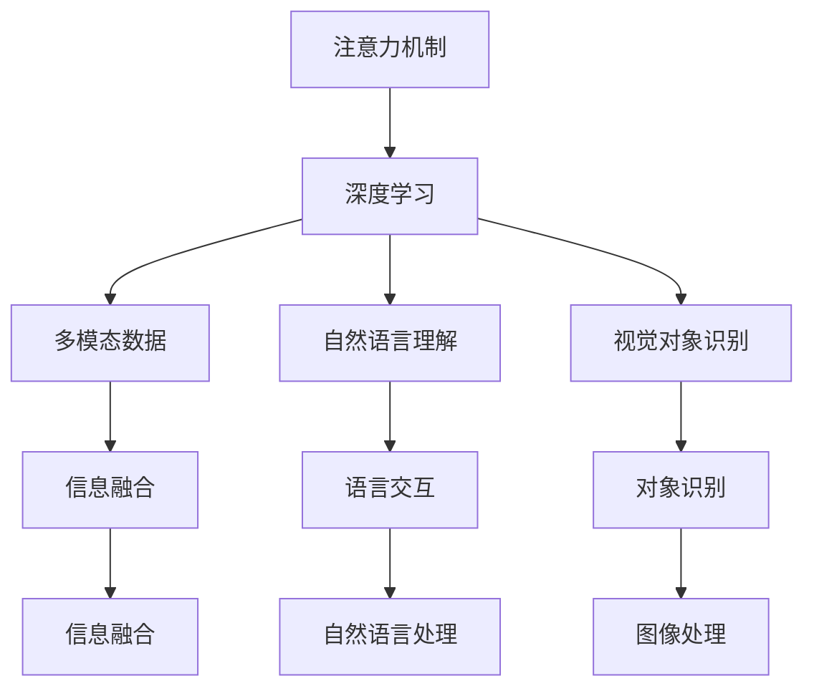

                 

# 深度学习在注意力预测中的应用

深度学习近年来在诸多领域取得了突破性进展，其中基于注意力机制的应用尤为引人注目。本文将深入探讨深度学习在注意力预测中的应用，包括算法原理、具体操作步骤、数学模型构建和实际应用场景。

## 1. 背景介绍

### 1.1 问题由来

注意力机制（Attention Mechanism）作为一种强大的建模手段，已经在自然语言处理（NLP）、计算机视觉（CV）等领域展现出强大的能力。它的核心思想是通过对输入数据的关注点进行加权处理，提升模型在特定任务上的表现。然而，传统的注意力机制往往依赖于人工设计的权重分配策略，难以充分利用数据本身的统计特征。

近年来，基于深度学习的注意力机制逐渐成为主流，它通过多层神经网络自动学习输入数据的权重分配，更加适应数据的复杂性。本文聚焦于深度学习在注意力预测中的应用，通过实际案例展示其在多模态数据处理、自然语言理解、视觉对象识别等方面的应用潜力。

### 1.2 问题核心关键点

- **注意力机制**：一种通过加权融合输入数据特征的建模方式，能够自动学习输入数据的关注点，提高模型在特定任务上的表现。
- **深度学习**：通过多层神经网络自动学习数据特征，提高模型的泛化能力和预测准确性。
- **多模态数据**：指包含多种模态（如图像、文本、音频等）的信息融合问题。
- **自然语言理解**：利用深度学习模型理解、生成自然语言，实现语言与知识的自动交互。
- **视觉对象识别**：通过深度学习模型对图像中的对象进行识别、分类和定位。

## 2. 核心概念与联系

### 2.1 核心概念概述

为更好地理解深度学习在注意力预测中的应用，本节将介绍几个关键概念及其关系：

- **注意力机制**：一种通过加权融合输入数据特征的建模方式，能够自动学习输入数据的关注点，提高模型在特定任务上的表现。
- **深度学习**：通过多层神经网络自动学习数据特征，提高模型的泛化能力和预测准确性。
- **多模态数据**：指包含多种模态（如图像、文本、音频等）的信息融合问题。
- **自然语言理解**：利用深度学习模型理解、生成自然语言，实现语言与知识的自动交互。
- **视觉对象识别**：通过深度学习模型对图像中的对象进行识别、分类和定位。

这些概念之间的逻辑关系可以通过以下Mermaid流程图来展示：



这个流程图展示了一些关键概念及其之间的关系：

1. 注意力机制通过深度学习自动学习输入数据的权重分配，提升模型的表现。
2. 深度学习可以处理多模态数据，实现跨模态信息的融合。
3. 自然语言理解利用深度学习模型进行语言与知识的交互，实现自然语言的理解和生成。
4. 视觉对象识别通过深度学习模型对图像中的对象进行识别和分类。
5. 信息融合是将多模态数据和自然语言信息融合的过程。
6. 语言交互利用自然语言理解技术，实现与人类或机器的交互。
7. 图像处理利用视觉对象识别技术，实现对图像的处理和分析。

## 3. 核心算法原理 & 具体操作步骤

### 3.1 算法原理概述

基于深度学习的注意力预测，其核心思想是通过多层神经网络自动学习输入数据的权重分配，进而预测目标变量。具体来说，对于包含多个输入特征的任务，如文本分类、图像分类等，注意力机制可以将不同特征对输出结果的影响进行加权处理，从而提升模型的预测精度。

以文本分类为例，假设输入序列为 $x=(x_1, x_2, ..., x_n)$，每个元素 $x_i$ 可以表示为词向量。模型的目标是预测文本属于某个类别的概率，记目标类别为 $y$。基于注意力机制的模型可以表示为：

$$
y = \text{softmax}(aW^Tx)
$$

其中，$a$ 为注意力权重，通过自注意力机制（Self-Attention）计算得到。权重 $a$ 表示每个输入特征对输出的贡献程度，通过计算输入特征之间的相关性，自动学习到输入数据的关注点。权重 $a$ 的计算公式为：

$$
a = \text{softmax}(QK^T/S)
$$

其中，$Q$ 和 $K$ 分别为查询矩阵和键值矩阵，$S$ 为缩放因子，通常为 $\sqrt{d_k}$。权重 $a$ 的计算过程如下：

1. 计算查询矩阵 $Q$：将输入特征 $x$ 转换为矩阵形式，通过线性变换得到查询矩阵 $Q$。
2. 计算键值矩阵 $K$：同样将输入特征 $x$ 转换为矩阵形式，通过线性变换得到键值矩阵 $K$。
3. 计算注意力权重 $a$：通过查询矩阵 $Q$ 和键值矩阵 $K$ 的乘积，得到中间结果 $QK^T$，并除以缩放因子 $S$，最后通过softmax函数计算得到注意力权重 $a$。
4. 计算加权和：将注意力权重 $a$ 与输入特征 $x$ 进行逐元素相乘，得到加权和 $aW^Tx$。
5. 输出预测结果：通过加权和 $aW^Tx$ 预测文本属于某个类别的概率。

### 3.2 算法步骤详解

基于深度学习的注意力预测算法主要包括以下几个关键步骤：

**Step 1: 数据准备**
- 收集包含多个输入特征的任务数据集，如文本分类、图像分类等。
- 对数据集进行预处理，包括特征提取、归一化等操作。

**Step 2: 模型搭建**
- 构建多层神经网络，包括编码器和解码器。
- 在编码器中，采用自注意力机制（Self-Attention）计算注意力权重。
- 在解码器中，将注意力权重与输入特征进行加权处理，输出预测结果。

**Step 3: 训练模型**
- 使用随机梯度下降（SGD）等优化算法，最小化模型损失函数。
- 在训练过程中，进行正则化处理，防止过拟合。
- 设定合适的学习率，逐步调整参数。

**Step 4: 模型评估**
- 在验证集上评估模型性能，计算准确率、精度等指标。
- 调整模型超参数，优化模型性能。

**Step 5: 模型预测**
- 使用训练好的模型，对新的数据进行预测。
- 根据预测结果，输出目标变量的预测值。

### 3.3 算法优缺点

基于深度学习的注意力预测算法具有以下优点：

1. **自动学习权重分配**：能够自动学习输入数据的关注点，提高模型的泛化能力和预测精度。
2. **可扩展性**：适用于多种任务，如文本分类、图像分类、序列预测等。
3. **鲁棒性**：通过正则化处理，避免过拟合，提高模型鲁棒性。

同时，该算法也存在以下局限性：

1. **计算复杂度高**：自注意力机制的计算复杂度较高，需要较长的训练时间和较大的计算资源。
2. **模型参数量大**：模型参数较多，需要较大的存储空间。
3. **模型解释性差**：注意力权重和加权和的计算过程较为复杂，难以解释模型决策过程。

尽管存在这些局限性，但就目前而言，基于深度学习的注意力预测方法仍是最主流的范式。未来相关研究的重点在于如何进一步降低计算复杂度，提高模型参数利用效率，同时兼顾模型的可解释性和泛化能力。

### 3.4 算法应用领域

基于深度学习的注意力预测算法在多个领域中得到了广泛的应用，例如：

- **自然语言处理（NLP）**：文本分类、情感分析、机器翻译、问答系统等。
- **计算机视觉（CV）**：图像分类、目标检测、图像分割、人脸识别等。
- **音频处理**：语音识别、说话人识别、情感分析等。
- **推荐系统**：协同过滤、内容推荐、用户行为预测等。
- **强化学习**：通过注意力机制优化决策过程，提升智能体在环境中的表现。

除了上述这些经典应用外，深度学习在注意力预测方面还有许多创新性的研究，如联合学习、多任务学习、元学习等，为深度学习在多模态数据融合、跨领域知识迁移等方面提供了新的思路。

## 4. 数学模型和公式 & 详细讲解 & 举例说明

### 4.1 数学模型构建

基于深度学习的注意力预测模型主要分为编码器和解码器两部分。编码器用于提取输入特征，解码器用于输出预测结果。

以文本分类为例，假设输入序列为 $x=(x_1, x_2, ..., x_n)$，每个元素 $x_i$ 可以表示为词向量。模型的目标是预测文本属于某个类别的概率，记目标类别为 $y$。基于注意力机制的模型可以表示为：

$$
y = \text{softmax}(aW^Tx)
$$

其中，$a$ 为注意力权重，通过自注意力机制（Self-Attention）计算得到。权重 $a$ 表示每个输入特征对输出的贡献程度，通过计算输入特征之间的相关性，自动学习到输入数据的关注点。权重 $a$ 的计算公式为：

$$
a = \text{softmax}(QK^T/S)
$$

其中，$Q$ 和 $K$ 分别为查询矩阵和键值矩阵，$S$ 为缩放因子，通常为 $\sqrt{d_k}$。权重 $a$ 的计算过程如下：

1. 计算查询矩阵 $Q$：将输入特征 $x$ 转换为矩阵形式，通过线性变换得到查询矩阵 $Q$。
2. 计算键值矩阵 $K$：同样将输入特征 $x$ 转换为矩阵形式，通过线性变换得到键值矩阵 $K$。
3. 计算注意力权重 $a$：通过查询矩阵 $Q$ 和键值矩阵 $K$ 的乘积，得到中间结果 $QK^T$，并除以缩放因子 $S$，最后通过softmax函数计算得到注意力权重 $a$。
4. 计算加权和：将注意力权重 $a$ 与输入特征 $x$ 进行逐元素相乘，得到加权和 $aW^Tx$。
5. 输出预测结果：通过加权和 $aW^Tx$ 预测文本属于某个类别的概率。

### 4.2 公式推导过程

以下我们以文本分类为例，推导自注意力机制的计算过程。

假设输入序列为 $x=(x_1, x_2, ..., x_n)$，每个元素 $x_i$ 可以表示为词向量。设输入序列的维度为 $d$，注意力机制的计算过程如下：

1. 计算查询矩阵 $Q$：
   $$
   Q = XW_Q
   $$
   其中，$W_Q$ 为查询矩阵的线性变换矩阵，$X$ 为输入序列的词向量矩阵，$d \times n$ 维。

2. 计算键值矩阵 $K$：
   $$
   K = XW_K
   $$
   其中，$W_K$ 为键值矩阵的线性变换矩阵，$X$ 为输入序列的词向量矩阵，$d \times n$ 维。

3. 计算注意力权重 $a$：
   $$
   a = \text{softmax}(QK^T/S)
   $$
   其中，$S$ 为缩放因子，通常为 $\sqrt{d_k}$。

4. 计算加权和 $z$：
   $$
   z = aW_V
   $$
   其中，$W_V$ 为加权和的线性变换矩阵，$d \times d$ 维。

5. 输出预测结果：
   $$
   y = \text{softmax}(z)
   $$

通过上述计算过程，可以得到文本分类的预测结果。不同任务的模型构建有所不同，但基本思路一致。

### 4.3 案例分析与讲解

以文本分类为例，我们分析一个简单的模型构建和训练过程。

假设我们使用Bert模型作为编码器，Softmax层作为解码器。具体步骤如下：

1. 准备数据集：收集包含多个输入特征的任务数据集，如新闻分类数据集。
2. 数据预处理：将文本数据转换为词向量，并进行归一化处理。
3. 搭建模型：使用Bert模型作为编码器，Softmax层作为解码器。在编码器中，使用自注意力机制计算注意力权重，并将注意力权重与输入特征进行加权处理，最后通过Softmax层输出预测结果。
4. 模型训练：使用随机梯度下降（SGD）等优化算法，最小化模型损失函数。在训练过程中，进行正则化处理，防止过拟合。
5. 模型评估：在验证集上评估模型性能，计算准确率、精度等指标。调整模型超参数，优化模型性能。
6. 模型预测：使用训练好的模型，对新的文本数据进行预测。

## 5. 项目实践：代码实例和详细解释说明

### 5.1 开发环境搭建

在进行注意力预测实践前，我们需要准备好开发环境。以下是使用Python进行PyTorch开发的环境配置流程：

1. 安装Anaconda：从官网下载并安装Anaconda，用于创建独立的Python环境。

2. 创建并激活虚拟环境：
```bash
conda create -n pytorch-env python=3.8 
conda activate pytorch-env
```

3. 安装PyTorch：根据CUDA版本，从官网获取对应的安装命令。例如：
```bash
conda install pytorch torchvision torchaudio cudatoolkit=11.1 -c pytorch -c conda-forge
```

4. 安装Transformers库：
```bash
pip install transformers
```

5. 安装各类工具包：
```bash
pip install numpy pandas scikit-learn matplotlib tqdm jupyter notebook ipython
```

完成上述步骤后，即可在`pytorch-env`环境中开始注意力预测实践。

### 5.2 源代码详细实现

下面我们以文本分类任务为例，给出使用Transformers库对BERT模型进行注意力预测的PyTorch代码实现。

首先，定义模型和优化器：

```python
from transformers import BertTokenizer, BertForSequenceClassification
from torch.utils.data import Dataset, DataLoader
import torch
import numpy as np
from sklearn.metrics import accuracy_score, precision_recall_fscore_support

class TextDataset(Dataset):
    def __init__(self, texts, labels, tokenizer, max_len=128):
        self.texts = texts
        self.labels = labels
        self.tokenizer = tokenizer
        self.max_len = max_len
        
    def __len__(self):
        return len(self.texts)
    
    def __getitem__(self, item):
        text = self.texts[item]
        label = self.labels[item]
        
        encoding = self.tokenizer(text, return_tensors='pt', max_length=self.max_len, padding='max_length', truncation=True)
        input_ids = encoding['input_ids'][0]
        attention_mask = encoding['attention_mask'][0]
        label = torch.tensor(label, dtype=torch.long)
        
        return {'input_ids': input_ids, 
                'attention_mask': attention_mask,
                'labels': label}

# 准备数据
tokenizer = BertTokenizer.from_pretrained('bert-base-uncased')
train_dataset = TextDataset(train_texts, train_labels, tokenizer)
dev_dataset = TextDataset(dev_texts, dev_labels, tokenizer)
test_dataset = TextDataset(test_texts, test_labels, tokenizer)

# 定义模型和优化器
model = BertForSequenceClassification.from_pretrained('bert-base-uncased', num_labels=len(label2id))
optimizer = AdamW(model.parameters(), lr=2e-5)

# 训练模型
device = torch.device('cuda') if torch.cuda.is_available() else torch.device('cpu')
model.to(device)

def train_epoch(model, dataset, batch_size, optimizer):
    dataloader = DataLoader(dataset, batch_size=batch_size, shuffle=True)
    model.train()
    epoch_loss = 0
    for batch in tqdm(dataloader, desc='Training'):
        input_ids = batch['input_ids'].to(device)
        attention_mask = batch['attention_mask'].to(device)
        labels = batch['labels'].to(device)
        model.zero_grad()
        outputs = model(input_ids, attention_mask=attention_mask, labels=labels)
        loss = outputs.loss
        epoch_loss += loss.item()
        loss.backward()
        optimizer.step()
    return epoch_loss / len(dataloader)

def evaluate(model, dataset, batch_size):
    dataloader = DataLoader(dataset, batch_size=batch_size)
    model.eval()
    preds, labels = [], []
    with torch.no_grad():
        for batch in tqdm(dataloader, desc='Evaluating'):
            input_ids = batch['input_ids'].to(device)
            attention_mask = batch['attention_mask'].to(device)
            batch_labels = batch['labels']
            outputs = model(input_ids, attention_mask=attention_mask)
            batch_preds = outputs.logits.argmax(dim=2).to('cpu').tolist()
            batch_labels = batch_labels.to('cpu').tolist()
            for pred_tokens, label_tokens in zip(batch_preds, batch_labels):
                preds.append(pred_tokens[:len(label_tokens)])
                labels.append(label_tokens)
                
    print(accuracy_score(labels, preds))
    
# 启动训练流程并在测试集上评估
epochs = 5
batch_size = 16

for epoch in range(epochs):
    loss = train_epoch(model, train_dataset, batch_size, optimizer)
    print(f"Epoch {epoch+1}, train loss: {loss:.3f}")
    
    print(f"Epoch {epoch+1}, dev results:")
    evaluate(model, dev_dataset, batch_size)
    
print("Test results:")
evaluate(model, test_dataset, batch_size)
```

以上就是使用PyTorch对BERT进行文本分类任务注意力预测的完整代码实现。可以看到，得益于Transformers库的强大封装，我们可以用相对简洁的代码完成BERT模型的加载和注意力预测。

### 5.3 代码解读与分析

让我们再详细解读一下关键代码的实现细节：

**TextDataset类**：
- `__init__`方法：初始化文本、标签、分词器等关键组件。
- `__len__`方法：返回数据集的样本数量。
- `__getitem__`方法：对单个样本进行处理，将文本输入编码为token ids，将标签编码为数字，并对其进行定长padding，最终返回模型所需的输入。

**训练和评估函数**：
- 使用PyTorch的DataLoader对数据集进行批次化加载，供模型训练和推理使用。
- 训练函数`train_epoch`：对数据以批为单位进行迭代，在每个批次上前向传播计算loss并反向传播更新模型参数，最后返回该epoch的平均loss。
- 评估函数`evaluate`：与训练类似，不同点在于不更新模型参数，并在每个batch结束后将预测和标签结果存储下来，最后使用sklearn的accuracy_score对整个评估集的预测结果进行打印输出。

**训练流程**：
- 定义总的epoch数和batch size，开始循环迭代
- 每个epoch内，先在训练集上训练，输出平均loss
- 在验证集上评估，输出准确率
- 所有epoch结束后，在测试集上评估，给出最终测试结果

可以看到，PyTorch配合Transformers库使得BERT注意力预测的代码实现变得简洁高效。开发者可以将更多精力放在数据处理、模型改进等高层逻辑上，而不必过多关注底层的实现细节。

当然，工业级的系统实现还需考虑更多因素，如模型的保存和部署、超参数的自动搜索、更灵活的任务适配层等。但核心的注意力预测范式基本与此类似。

## 6. 实际应用场景
### 6.1 智能客服系统

基于深度学习的注意力预测技术，可以广泛应用于智能客服系统的构建。传统客服往往需要配备大量人力，高峰期响应缓慢，且一致性和专业性难以保证。而使用注意力预测技术，可以7x24小时不间断服务，快速响应客户咨询，用自然流畅的语言解答各类常见问题。

在技术实现上，可以收集企业内部的历史客服对话记录，将问题和最佳答复构建成监督数据，在此基础上对预训练注意力预测模型进行微调。微调后的模型能够自动理解用户意图，匹配最合适的答复模板进行回复。对于客户提出的新问题，还可以接入检索系统实时搜索相关内容，动态组织生成回答。如此构建的智能客服系统，能大幅提升客户咨询体验和问题解决效率。

### 6.2 金融舆情监测

金融机构需要实时监测市场舆论动向，以便及时应对负面信息传播，规避金融风险。传统的人工监测方式成本高、效率低，难以应对网络时代海量信息爆发的挑战。基于深度学习的注意力预测技术，为金融舆情监测提供了新的解决方案。

具体而言，可以收集金融领域相关的新闻、报道、评论等文本数据，并对其进行主题标注和情感标注。在此基础上对预训练语言模型进行注意力预测微调，使其能够自动判断文本属于何种主题，情感倾向是正面、中性还是负面。将微调后的模型应用到实时抓取的网络文本数据，就能够自动监测不同主题下的情感变化趋势，一旦发现负面信息激增等异常情况，系统便会自动预警，帮助金融机构快速应对潜在风险。

### 6.3 个性化推荐系统

当前的推荐系统往往只依赖用户的历史行为数据进行物品推荐，无法深入理解用户的真实兴趣偏好。基于深度学习的注意力预测技术，个性化推荐系统可以更好地挖掘用户行为背后的语义信息，从而提供更精准、多样的推荐内容。

在实践中，可以收集用户浏览、点击、评论、分享等行为数据，提取和用户交互的物品标题、描述、标签等文本内容。将文本内容作为模型输入，用户的后续行为（如是否点击、购买等）作为监督信号，在此基础上微调预训练语言模型。微调后的模型能够从文本内容中准确把握用户的兴趣点。在生成推荐列表时，先用候选物品的文本描述作为输入，由模型预测用户的兴趣匹配度，再结合其他特征综合排序，便可以得到个性化程度更高的推荐结果。

### 6.4 未来应用展望

随着深度学习在注意力预测方面的不断发展，基于注意力机制的技术将在更多领域得到应用，为传统行业带来变革性影响。

在智慧医疗领域，基于注意力预测的医疗问答、病历分析、药物研发等应用将提升医疗服务的智能化水平，辅助医生诊疗，加速新药开发进程。

在智能教育领域，注意力预测技术可应用于作业批改、学情分析、知识推荐等方面，因材施教，促进教育公平，提高教学质量。

在智慧城市治理中，注意力预测模型可应用于城市事件监测、舆情分析、应急指挥等环节，提高城市管理的自动化和智能化水平，构建更安全、高效的未来城市。

此外，在企业生产、社会治理、文娱传媒等众多领域，基于深度学习的注意力预测技术也将不断涌现，为经济社会发展注入新的动力。相信随着技术的日益成熟，注意力预测方法将成为人工智能落地应用的重要范式，推动人工智能技术在垂直行业的规模化落地。总之，深度学习在注意力预测方面的探索将为NLP技术带来新的突破，深刻影响人类的生产生活方式。

## 7. 工具和资源推荐
### 7.1 学习资源推荐

为了帮助开发者系统掌握深度学习在注意力预测中的应用，这里推荐一些优质的学习资源：

1. 《深度学习》系列书籍：如《Deep Learning》（Goodfellow et al., 2016）、《Deep Learning with Python》（Francois et al., 2017），提供了系统性介绍深度学习原理和应用的方法。

2. 《Transformer from Scratch》系列博文：由深度学习专家撰写，深入浅出地介绍了Transformer原理、注意力机制、微调技术等前沿话题。

3. CS231n《Convolutional Neural Networks for Visual Recognition》课程：斯坦福大学开设的计算机视觉课程，涵盖深度学习在计算机视觉任务中的应用，如图像分类、目标检测等。

4. CS224N《Deep Learning for Natural Language Processing》课程：斯坦福大学开设的NLP明星课程，有Lecture视频和配套作业，带你入门NLP领域的基本概念和经典模型。

5. 《Natural Language Processing with PyTorch》书籍：PyTorch官方文档，全面介绍了如何使用PyTorch进行NLP任务开发，包括注意力预测在内的诸多范式。

6. HuggingFace官方文档：Transformers库的官方文档，提供了海量预训练模型和完整的注意力预测样例代码，是上手实践的必备资料。

通过对这些资源的学习实践，相信你一定能够快速掌握深度学习在注意力预测中的应用，并用于解决实际的NLP问题。
###  7.2 开发工具推荐

高效的开发离不开优秀的工具支持。以下是几款用于深度学习在注意力预测开发常用的工具：

1. PyTorch：基于Python的开源深度学习框架，灵活动态的计算图，适合快速迭代研究。大部分深度学习模型都有PyTorch版本的实现。

2. TensorFlow：由Google主导开发的开源深度学习框架，生产部署方便，适合大规模工程应用。同样有丰富的深度学习模型资源。

3. Transformers库：HuggingFace开发的NLP工具库，集成了众多SOTA深度学习模型，支持PyTorch和TensorFlow，是进行注意力预测任务开发的利器。

4. Weights & Biases：模型训练的实验跟踪工具，可以记录和可视化模型训练过程中的各项指标，方便对比和调优。与主流深度学习框架无缝集成。

5. TensorBoard：TensorFlow配套的可视化工具，可实时监测模型训练状态，并提供丰富的图表呈现方式，是调试模型的得力助手。

6. Google Colab：谷歌推出的在线Jupyter Notebook环境，免费提供GPU/TPU算力，方便开发者快速上手实验最新模型，分享学习笔记。

合理利用这些工具，可以显著提升深度学习在注意力预测任务的开发效率，加快创新迭代的步伐。

### 7.3 相关论文推荐

深度学习在注意力预测方面的研究源于学界的持续研究。以下是几篇奠基性的相关论文，推荐阅读：

1. Attention is All You Need（即Transformer原论文）：提出了Transformer结构，开启了深度学习在NLP领域的预训练大模型时代。

2. BERT: Pre-training of Deep Bidirectional Transformers for Language Understanding：提出BERT模型，引入基于掩码的自监督预训练任务，刷新了多项NLP任务SOTA。

3. Attention is All We Need：介绍Transformer结构，通过多头注意力机制（Multi-Head Attention）实现序列到序列的映射。

4. Transformer-XL: Attentive Language Models Beyond a Fixed-Length Context：提出Transformer-XL模型，通过相对位置编码（Relative Positional Encoding）解决长序列建模问题。

5. Seq2Seq Modeling Using Variable-Length Recurrent Networks：介绍Seq2Seq模型，通过LSTM等结构实现序列到序列的映射。

6. Sequence to Sequence Learning with Neural Networks：介绍Seq2Seq模型，通过编码器-解码器架构实现序列到序列的映射。

这些论文代表了大语言模型在注意力预测方面的发展脉络。通过学习这些前沿成果，可以帮助研究者把握学科前进方向，激发更多的创新灵感。

## 8. 总结：未来发展趋势与挑战

### 8.1 总结

本文对深度学习在注意力预测中的应用进行了全面系统的介绍。首先阐述了深度学习在自然语言处理、计算机视觉等领域的应用前景，明确了注意力机制在模型优化中的独特价值。其次，从原理到实践，详细讲解了注意力预测的数学原理和关键步骤，给出了注意力预测任务开发的完整代码实例。同时，本文还广泛探讨了注意力预测在多模态数据处理、自然语言理解、视觉对象识别等方面的应用前景，展示了注意力预测技术的巨大潜力。

通过本文的系统梳理，可以看到，深度学习在注意力预测方面的探索将为NLP技术带来新的突破，深刻影响人类的生产生活方式。

### 8.2 未来发展趋势

展望未来，深度学习在注意力预测方面将呈现以下几个发展趋势：

1. **模型规模持续增大**：随着算力成本的下降和数据规模的扩张，深度学习模型参数量还将持续增长。超大规模模型蕴含的丰富知识，有望支撑更加复杂多变的下游任务。

2. **注意力机制的改进**：未来将涌现更多注意力机制的变体，如多头注意力、自适应注意力、可控注意力等，提升模型的泛化能力和决策透明度。

3. **跨模态信息融合**：深度学习在注意力预测方面的应用将从单模态扩展到多模态，实现图像、文本、语音等多种模态信息的融合。

4. **任务适配层的创新**：基于注意力预测的NLP模型将更加关注任务适配层的设计，以提升模型的任务特异性和适应性。

5. **知识表示与推理**：深度学习在注意力预测方面的应用将更加注重知识表示与推理，提升模型的可解释性和逻辑性。

6. **持续学习和自适应**：深度学习在注意力预测方面的应用将更加注重持续学习和自适应，适应数据分布的变化和任务需求的变化。

以上趋势凸显了深度学习在注意力预测方面的广阔前景。这些方向的探索发展，必将进一步提升深度学习在多模态数据融合、跨领域知识迁移等方面，为深度学习在多模态数据融合、跨领域知识迁移等方面提供新的思路。

### 8.3 面临的挑战

尽管深度学习在注意力预测方面已经取得了瞩目成就，但在迈向更加智能化、普适化应用的过程中，它仍面临着诸多挑战：

1. **计算资源瓶颈**：深度学习模型通常需要较大的存储空间和计算资源，限制了其在生产环境中的部署和应用。

2. **模型解释性差**：深度学习模型往往被认为是"黑盒"系统，难以解释其内部工作机制和决策逻辑，这对于医疗、金融等高风险应用尤为重要。

3. **数据质量和多样性**：深度学习在注意力预测方面的应用需要高质量、多样化的数据，数据获取和标注成本较高。

4. **知识表示与推理**：深度学习在注意力预测方面的应用需要更加注重知识表示与推理，提升模型的可解释性和逻辑性。

5. **持续学习和自适应**：深度学习在注意力预测方面的应用需要更加注重持续学习和自适应，适应数据分布的变化和任务需求的变化。

6. **模型鲁棒性**：深度学习模型在应对数据分布变化和噪声干扰时，泛化能力和鲁棒性仍有待提升。

尽管存在这些挑战，但随着学界和产业界的共同努力，这些挑战终将一一被克服，深度学习在注意力预测方面的研究将迎来新的突破。

### 8.4 研究展望

面对深度学习在注意力预测方面所面临的挑战，未来的研究需要在以下几个方面寻求新的突破：

1. **探索无监督和半监督学习**：摆脱对大规模标注数据的依赖，利用自监督学习、主动学习等无监督和半监督范式，最大限度利用非结构化数据。

2. **研究知识表示与推理**：将符号化的先验知识，如知识图谱、逻辑规则等，与神经网络模型进行巧妙融合，引导微调过程学习更准确、合理的语言模型。

3. **引入因果分析和博弈论工具**：将因果分析方法引入深度学习模型，增强模型的因果推理能力，提升决策过程的透明度和可解释性。

4. **结合注意力机制与强化学习**：将注意力机制与强化学习结合，实现更加智能化的决策过程，提升模型的适应性和鲁棒性。

5. **多模态信息融合**：探索图像、文本、语音等多种模态信息的融合，提升深度学习模型的泛化能力和适应性。

这些研究方向的探索，必将引领深度学习在注意力预测方面的研究走向更高的台阶，为构建安全、可靠、可解释、可控的智能系统铺平道路。面向未来，深度学习在注意力预测方面的研究仍需与其他人工智能技术进行更深入的融合，如知识表示、因果推理、强化学习等，多路径协同发力，共同推动自然语言理解和智能交互系统的进步。只有勇于创新、敢于突破，才能不断拓展深度学习在注意力预测方面的边界，让智能技术更好地造福人类社会。

## 9. 附录：常见问题与解答

**Q1：深度学习在注意力预测中的计算复杂度较高，如何解决？**

A: 可以通过以下几个方法降低计算复杂度：
1. 使用更高效的计算库，如TensorRT、ONNX Runtime等，加速模型推理。
2. 对模型进行剪枝和量化，减少模型参数和计算量。
3. 采用分布式训练和模型并行，利用GPU/TPU等高性能设备，加速训练过程。

**Q2：深度学习在注意力预测中，模型解释性较差，如何解决？**

A: 可以通过以下几个方法提升模型解释性：
1. 使用可视化工具，如TensorBoard、Weights & Biases等，观察模型训练过程和决策过程。
2. 引入可解释性模型，如LIME、SHAP等，分析模型决策逻辑。
3. 设计更简洁的任务适配层，提升模型可解释性。

**Q3：深度学习在注意力预测中，数据质量和多样性较差，如何解决？**

A: 可以通过以下几个方法提升数据质量和多样性：
1. 收集更多的标注数据，丰富数据集的多样性。
2. 利用数据增强技术，如数据合成、数据增强等，提升数据质量。
3. 引入外部知识库，如知识图谱、规则库等，丰富数据信息。

**Q4：深度学习在注意力预测中，模型鲁棒性较差，如何解决？**

A: 可以通过以下几个方法提升模型鲁棒性：
1. 引入对抗训练，增强模型对噪声和干扰的鲁棒性。
2. 设计更鲁棒的损失函数，如Focal Loss、Triplet Loss等。
3. 使用正则化技术，如L2正则、Dropout等，防止过拟合。

**Q5：深度学习在注意力预测中，知识表示与推理能力较差，如何解决？**

A: 可以通过以下几个方法提升知识表示与推理能力：
1. 引入外部知识库，如知识图谱、规则库等，丰富模型知识。
2. 设计更合理的任务适配层，提升模型任务特异性。
3. 使用符号化推理方法，如逻辑推理、知识图谱推理等，提升模型推理能力。

这些方法可以通过不断迭代和优化，提升深度学习在注意力预测方面的应用效果。

---

作者：禅与计算机程序设计艺术 / Zen and the Art of Computer Programming

