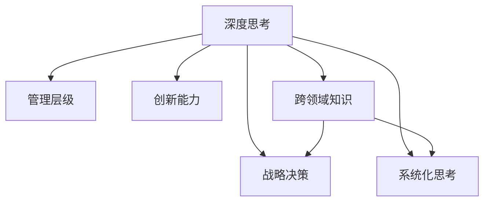

                 

# 深度思考:拉开管理者差距的关键

> 关键词：
深度思考, 管理者差距, 领导力, 战略决策, 创新能力

## 1. 背景介绍

### 1.1 问题由来
在现代社会，企业之间的竞争已经从产品、服务的竞争，逐渐演变成人才和领导力的竞争。管理者的深度思考能力，是他们能够洞察市场动态，引领团队发展的关键。深度思考不仅关乎个人的专业能力，更关乎其决策质量、团队管理、战略规划等多个方面。在日新月异的商业环境中，只有具备深度思考力的管理者，才能在激烈的竞争中脱颖而出，带领企业持续创新，实现长期发展。

### 1.2 问题核心关键点
深度思考作为管理者的一项核心能力，其重要性不言而喻。然而，如何培养和提升深度思考能力，仍然是摆在管理者面前的一大难题。深度思考不仅需要良好的逻辑推理能力，更需要跨领域的知识整合、系统化的思考框架，以及高效的决策工具。本文旨在通过系统的梳理和分析，为管理者提供全面提升深度思考能力的策略和方法。

### 1.3 问题研究意义
研究管理者的深度思考能力，对于提升企业领导力、推动创新发展、实现长期战略目标具有重要意义：

1. **提升决策质量**：深度思考帮助管理者全面分析市场信息，准确把握机遇与风险，做出更科学的决策。
2. **优化团队管理**：深度思考使管理者能更深刻理解员工需求，建立有效沟通机制，提升团队协作效率。
3. **促进战略创新**：深度思考促进管理者从不同角度探索解决方案，驱动企业持续创新，形成核心竞争力。
4. **增强市场洞察**：深度思考帮助管理者洞察行业趋势，预判市场变化，制定灵活的应对策略。
5. **助力企业成长**：深度思考能力是企业跨越发展瓶颈、实现可持续增长的重要推动力。

## 2. 核心概念与联系

### 2.1 核心概念概述

为更好地理解深度思考在企业管理中的应用，本节将介绍几个密切相关的核心概念：

- **深度思考(Deep Thinking)**：指通过系统性、多角度的分析，深入理解问题的本质，提出创新解决方案的思维过程。深度思考需要跨学科的知识融合、逻辑推理和创新思维。
- **管理层级(Management Hierarchy)**：从高层决策者到中层管理者再到基层执行者，每个层级在决策和执行中的作用不同，深度思考能力需求也有所差异。
- **战略决策(Strategic Decision Making)**：基于深度思考，管理者在分析市场、评估资源、制定长远规划时的决策过程。
- **创新能力(Creativity)**：深度思考在突破思维定势、探索新领域、发现新方法、提出新观点方面的应用。
- **系统化思考(Systematic Thinking)**：从整体到局部，从宏观到微观，系统化地分析问题，找到最优解决方案的思维方式。
- **跨领域知识(Cross-domain Knowledge)**：深度思考中，跨领域的知识整合和应用至关重要。管理者需具备跨学科的知识储备和融合能力。

这些核心概念之间的逻辑关系可以通过以下Mermaid流程图来展示：



这个流程图展示出深度思考在企业管理中的关键作用：

1. 深度思考帮助管理者在不同层级上做出科学决策。
2. 在战略决策中，深度思考使管理者能够更全面、深入地分析问题。
3. 在创新能力提升中，深度思考促进管理者突破传统思维定势。
4. 系统化思考使深度思考过程更加科学、系统。
5. 跨领域知识的整合和应用是深度思考的重要基础。

## 3. 核心算法原理 & 具体操作步骤
### 3.1 算法原理概述

深度思考的管理者通常具备以下特点：

1. **系统化的思考框架**：将问题拆解为多个子问题，从多个角度进行分析和验证。
2. **跨学科的知识整合**：在分析问题时，整合不同学科的知识，综合应用各种理论与方法。
3. **数据驱动的决策**：基于数据和信息，科学地评估各种方案的优劣。
4. **创新的解决方案**：从不同角度提出创新的解决方案，敢于突破传统思维模式。
5. **高效的决策工具**：运用各种高效工具和技术，提升决策效率。

### 3.2 算法步骤详解

基于深度思考的管理者应遵循以下步骤：

**Step 1: 问题定义和拆分**
- 明确问题的核心，通过将问题拆解为多个子问题，系统化地分析问题。

**Step 2: 多角度分析**
- 从多个角度、多个学科的知识框架中，全面、深入地分析问题。
- 使用数据和信息作为决策的依据，评估各种方案的可行性。

**Step 3: 创新思考**
- 通过跨学科的整合和不同角度的思考，提出创新的解决方案。
- 敢于打破思维定势，挑战现有的假设和框架。

**Step 4: 系统化决策**
- 利用系统化的思维框架，从整体到局部，从宏观到微观，全面考虑问题的各个方面。
- 制定可行的、最优的解决方案，并确保其落地实施。

**Step 5: 迭代优化**
- 持续优化决策方案，根据执行结果和反馈，不断调整和改进。

### 3.3 算法优缺点

深度思考在企业管理中的应用具有以下优点：

1. **提升决策质量**：通过系统化、多角度的分析，确保决策科学、准确。
2. **促进团队协作**：通过深度思考的框架和方法，管理者能够有效指导团队，提升团队协作效率。
3. **驱动创新发展**：深度思考促进管理者发现新机会，探索新领域，形成创新竞争力。
4. **增强市场洞察**：通过多学科的知识整合和系统化分析，管理者能够预判市场变化，制定灵活应对策略。
5. **支持企业成长**：深度思考能力是企业实现长期战略目标的重要推动力。

同时，深度思考也存在一定的局限性：

1. **时间和精力成本高**：深度思考需要大量时间和精力，在紧迫任务中难以实现。
2. **知识广度要求高**：管理者需要具备跨学科的知识储备和整合能力。
3. **决策风险较高**：过度复杂的分析可能导致决策迟缓，影响企业反应速度。

### 3.4 算法应用领域

深度思考作为企业管理者的核心能力，其应用领域非常广泛，包括但不限于：

- **战略规划与决策**：制定企业长远发展战略，评估市场机会与风险。
- **业务创新与转型**：发现和探索新的业务领域，提出创新解决方案。
- **风险管理与控制**：识别和评估风险，制定有效的风险应对策略。
- **资源配置与优化**：科学地分配和优化企业资源，提高运营效率。
- **组织设计与优化**：优化组织结构，提升团队协作和执行效率。
- **客户体验与满意度**：通过深度思考提升客户需求理解，提高客户满意度。

## 4. 数学模型和公式 & 详细讲解  
### 4.1 数学模型构建

深度思考的管理者在制定决策时，通常会使用以下数学模型：

1. **决策树模型(Decision Tree)**：通过构建决策树，从多个可能方案中选择最优解。
2. **回归分析(Regression Analysis)**：利用回归模型，对影响决策的因素进行量化评估。
3. **蒙特卡罗模拟(Monte Carlo Simulation)**：通过模拟，评估决策方案的风险与收益。
4. **博弈论模型(Game Theory)**：分析各利益相关者之间的互动，制定最优策略。
5. **优化问题(Optimization Problem)**：通过求解优化问题，找到最优决策路径。

### 4.2 公式推导过程

以回归分析为例，假设有一个简单的线性回归模型：

$$ y = \beta_0 + \beta_1 x_1 + \beta_2 x_2 + \epsilon $$

其中 $y$ 为决策结果，$x_1$ 和 $x_2$ 为影响决策的关键因素，$\beta_0$、$\beta_1$、$\beta_2$ 为模型参数，$\epsilon$ 为误差项。

根据最小二乘法，求解 $\beta_0$、$\beta_1$ 和 $\beta_2$，使得预测误差最小：

$$ \hat{\beta} = \mathop{\arg\min}_{\beta} \sum_{i=1}^n (y_i - \hat{y}_i)^2 $$

求解后得到模型参数，即可对新数据进行预测和评估。

### 4.3 案例分析与讲解

以下以一个虚构的科技公司为例，展示深度思考在企业决策中的应用：

**背景**：一家科技公司正在考虑是否推出一款新的智能硬件产品。公司在市场上已有多款产品，但市场份额仍需提升。需要决定是否投资巨额资金进行新产品的研发和市场推广。

**Step 1: 问题定义和拆分**

- 确定问题：是否推出新产品？
- 拆分问题：产品成本、市场潜力、竞争格局、技术可行性等子问题。

**Step 2: 多角度分析**

- 技术可行性：评估新产品的技术难点和研发成本。
- 市场潜力：利用市场调研数据，评估潜在市场规模和增长趋势。
- 竞争格局：分析竞争对手的产品和市场策略。
- 财务影响：预测新产品的销售预期和成本。

**Step 3: 创新思考**

- 提出多种方案：市场推广、产品定制、战略合作等。
- 评估风险和收益：利用蒙特卡罗模拟评估各种方案的风险和预期收益。

**Step 4: 系统化决策**

- 构建决策树：评估各种方案的优劣，制定备选方案。
- 进行博弈分析：考虑竞争对手的可能反应和市场变化。

**Step 5: 迭代优化**

- 根据模拟结果和市场反馈，调整和优化决策方案。
- 制定实施计划，监测执行效果，持续优化。

## 5. 项目实践：代码实例和详细解释说明
### 5.1 开发环境搭建

在进行深度思考的管理决策分析前，我们需要准备好开发环境。以下是使用Python进行决策树模型开发的流程：

1. 安装Anaconda：从官网下载并安装Anaconda，用于创建独立的Python环境。

2. 创建并激活虚拟环境：
```bash
conda create -n pythontest python=3.8 
conda activate pythontest
```

3. 安装必要的Python库：
```bash
conda install scikit-learn pandas numpy matplotlib
```

4. 配置Jupyter Notebook：
```bash
jupyter lab
```

完成上述步骤后，即可在`pythontest`环境中进行深度思考的决策分析实践。

### 5.2 源代码详细实现

下面以线性回归模型为例，展示Python代码的实现。

```python
import numpy as np
from sklearn.linear_model import LinearRegression

# 生成模拟数据
np.random.seed(42)
x1 = np.random.rand(100)
x2 = np.random.rand(100)
y = 1 * x1 + 2 * x2 + np.random.normal(0, 0.5, 100)

# 创建数据集
X = np.column_stack((x1, x2))
Y = y

# 训练模型
model = LinearRegression()
model.fit(X, Y)

# 预测
x_test = np.array([0.5, 0.8])
y_pred = model.predict(x_test)

print("预测结果:", y_pred)
```

### 5.3 代码解读与分析

让我们详细解读一下关键代码的实现细节：

- **生成模拟数据**：使用NumPy生成100个样本的随机数据，模拟实际决策中可能遇到的各种影响因素。
- **创建数据集**：将模拟数据转换为二维矩阵形式，作为模型输入。
- **训练模型**：使用Scikit-learn库的LinearRegression模型对数据进行拟合，求解线性回归方程的系数。
- **预测**：使用训练好的模型对新样本进行预测，输出预测结果。

可以看到，决策树模型通过Python代码的实现，可以非常简单地进行建模和预测。但实际决策过程中，还需要考虑更多的因素和数据，使用更加复杂的模型。

## 6. 实际应用场景
### 6.1 智能制造优化

深度思考在智能制造优化中具有重要应用。通过对生产流程、设备状态、供应链管理等多方面数据的全面分析，深度思考的管理者可以制定最优的生产计划，提升生产效率和产品质量。

在具体实践中，可以使用数据分析、模拟仿真、优化算法等多种技术手段，从系统层面优化整个制造流程。例如，通过构建预测模型，提前识别潜在的设备故障，优化维护计划；通过模拟仿真，评估不同生产方案的效果，选择最优方案；通过优化算法，自动调整生产参数，达到最优生产状态。

### 6.2 人力资源管理

在人力资源管理中，深度思考同样具有重要应用。通过全面分析员工的绩效、技能、需求等多方面数据，深度思考的管理者可以制定更加科学合理的人力资源策略，提高员工满意度和工作效率。

例如，在招聘过程中，通过深度思考，全面评估候选人的背景、技能、潜力等，选择最合适的候选人；在培训过程中，通过深度思考，制定个性化的培训计划，提升员工技能；在绩效管理中，通过深度思考，制定科学的绩效评估体系，激励员工提升业绩。

### 6.3 产品研发创新

在产品研发创新中，深度思考是推动企业不断突破、实现创新的关键。通过深度思考，管理者可以全面分析市场需求、技术趋势、竞争环境等多方面数据，提出创新的产品设计和解决方案。

例如，在市场调研阶段，通过深度思考，全面了解用户需求和市场趋势，设计出符合市场需求的产品；在技术研发阶段，通过深度思考，整合多学科知识，攻克技术难题，实现产品创新；在产品推广阶段，通过深度思考，制定科学的营销策略，推广新产品。

### 6.4 未来应用展望

随着深度思考理论和方法的不断发展，其在企业管理中的应用前景更加广阔。未来，深度思考将进一步融合大数据、人工智能、区块链等前沿技术，提升决策的科学性和效率。

在智能制造、人力资源管理、产品研发等多个领域，深度思考的应用将更加深入，推动企业实现数字化、智能化转型。未来，深度思考将成为企业管理者的必备技能，助力企业持续创新，实现可持续发展。

## 7. 工具和资源推荐
### 7.1 学习资源推荐

为了帮助管理者系统掌握深度思考的理论基础和实践技巧，这里推荐一些优质的学习资源：

1. 《深度思考的艺术》系列书籍：深入探讨深度思考的原理和应用，提供大量案例和实战经验。
2. Coursera《深度学习基础》课程：由斯坦福大学等顶级大学开设的深度学习课程，涵盖深度学习的基本概念和应用。
3. Udacity《人工智能原理》课程：提供人工智能领域的系统学习资源，涵盖深度思考和决策分析等关键内容。
4. Harvard Business Review（哈佛商业评论）：提供大量商业案例和管理经验，帮助管理者提升深度思考能力。
5. TED Talks《How to Improve Your Thinking》：通过视频讲解，帮助管理者从多个角度提升思维能力。

通过对这些资源的学习实践，相信管理者能够掌握深度思考的核心技巧，并在实际管理中取得显著成效。

### 7.2 开发工具推荐

高效的开发离不开优秀的工具支持。以下是几款用于深度思考开发的常用工具：

1. Microsoft Excel：功能强大的数据分析工具，适用于处理各种复杂的数据分析任务。
2. Python环境：使用Python进行深度思考分析，利用丰富的Python库和框架，快速实现各种模型。
3. Jupyter Notebook：用于编写和运行Python代码，支持交互式编程和可视化展示。
4. SPSS：专业的数据分析软件，适用于大规模数据处理和高级统计分析。
5. Tableau：数据可视化工具，支持复杂的数据分析和交互式展示。

合理利用这些工具，可以显著提升深度思考的分析效率，帮助管理者更好地应对复杂的决策场景。

### 7.3 相关论文推荐

深度思考在企业管理中的应用，也得到了学界的广泛关注。以下是几篇奠基性的相关论文，推荐阅读：

1. "Deep Thinking: The Art and Science of Decision-Making" by Roger Martin：深入探讨了深度思考的原理和应用，提供了系统的管理理论支持。
2. "The Analytics of Management" by Winston Smith：详细介绍了数据分析在企业管理中的应用，提供了实用的案例和工具。
3. "Decision-Making and the bounded rational model" by Herbert Simon：提出了决策中的有限理性模型，强调深度思考在复杂决策中的重要性。
4. "Optimization and the Theory of Decision-Making" by Paul A. Samuelson：从经济学的角度探讨了优化问题在决策中的应用，提供了科学的决策框架。
5. "Game Theory and the Social Contract" by John Harsanyi：通过博弈论模型，分析了各利益相关者之间的互动，提供了科学决策的理论基础。

这些论文代表了大规模决策分析理论的发展脉络。通过学习这些前沿成果，可以帮助管理者掌握深度思考的核心方法，提升决策质量和效果。

## 8. 总结：未来发展趋势与挑战
### 8.1 研究成果总结

深度思考在企业管理中的应用已经取得了显著成果，具体体现在：

1. **提升决策质量**：系统化的分析框架和数据驱动的决策方法，使管理者能够做出更科学的决策。
2. **促进团队协作**：跨学科的知识整合和创新的解决方案，增强团队协作效率。
3. **推动创新发展**：深入的市场洞察和全面的数据分析，助力企业不断突破，实现创新。
4. **增强市场洞察**：科学的风险评估和灵活的应对策略，使企业能够灵活应对市场变化。
5. **支持企业成长**：深度思考能力是企业长期发展的推动力，推动企业持续创新，实现可持续发展。

### 8.2 未来发展趋势

展望未来，深度思考在企业管理中的应用将呈现以下几个趋势：

1. **跨领域融合**：深度思考将更多地融合大数据、人工智能、区块链等前沿技术，提升决策的科学性和效率。
2. **数据驱动决策**：随着数据量的不断增长，基于数据的深度思考将成为企业管理决策的重要依据。
3. **个性化定制**：通过深度思考，制定个性化的管理策略和方案，满足不同业务场景的需求。
4. **智能化转型**：深度思考与智能系统的结合，将推动企业实现数字化、智能化转型，提升运营效率和竞争力。
5. **全球化视野**：深度思考帮助企业在全球化背景下进行战略决策，把握全球市场机遇。

### 8.3 面临的挑战

尽管深度思考在企业管理中的应用已经取得显著成果，但未来仍面临诸多挑战：

1. **数据质量**：高质量的数据是深度思考的基础，数据获取、清洗和处理的成本和复杂度较高。
2. **技术复杂度**：深度思考涉及多种技术手段和工具，管理者的技术水平需不断提升。
3. **文化适应**：深度思考的实践需要改变现有的管理文化和决策方式，推广过程中存在较大阻力。
4. **资源投入**：深度思考的实施需要大量的资源投入，如人力、物力、财力等。
5. **决策成本**：深度思考的复杂分析和多方案评估，可能导致决策成本上升。
6. **决策风险**：过于复杂的分析和多角度的考虑，可能导致决策迟缓，影响企业反应速度。

### 8.4 研究展望

面向未来，深度思考在企业管理中的应用还需要从以下几个方面进行探索：

1. **自动化分析**：开发更高效、智能的数据分析工具，自动生成分析报告和建议。
2. **智能决策支持**：结合AI和大数据技术，构建智能决策支持系统，提升决策效率和效果。
3. **跨学科合作**：通过跨学科合作，整合不同领域的知识和技能，提升深度思考的广度和深度。
4. **伦理和社会责任**：在深度思考的实践中，注重伦理和社会责任，确保决策的公正性和可持续性。
5. **创新驱动**：通过深度思考，推动企业不断创新，实现持续发展。

总之，深度思考是企业管理者的必备能力，未来的研究需要在技术、文化、资源等多个维度进行深入探索，推动其更好地应用于实践，实现企业管理的科学化和智能化。

## 9. 附录：常见问题与解答
### 9.1 问题1：深度思考和直觉决策有何区别？

**回答**：深度思考和直觉决策都是决策过程中不可或缺的两种方式。深度思考强调系统化、数据驱动的分析，注重全面、深入地评估各种方案；而直觉决策则更多依赖个人的经验和直觉，注重快速、直接的决策。在实际管理中，两者需结合使用，既要充分发挥深度思考的科学性，也要利用直觉决策的灵活性。

### 9.2 问题2：深度思考是否需要完全依赖数据？

**回答**：深度思考并不完全依赖数据，而是将数据作为决策的重要依据之一。在缺乏数据的情况下，管理者需要依赖经验、知识、情感等多种因素进行综合判断。数据可以帮助管理者更全面地分析问题，但最终决策仍需综合考虑各种因素。

### 9.3 问题3：深度思考的实施是否需要大量时间和资源？

**回答**：深度思考的实施确实需要一定的时间和资源投入，尤其是在复杂决策中。但通过合理规划和资源配置，可以在不影响日常业务的情况下，逐步实施深度思考。同时，利用技术手段和工具，可以提升深度思考的效率，减少时间和资源成本。

### 9.4 问题4：如何提升深度思考能力？

**回答**：提升深度思考能力需要系统化的学习和实践。可以通过阅读相关书籍、参加培训课程、参与实践项目等方式，逐步提升自己的逻辑推理、跨学科整合、数据分析等能力。同时，保持好奇心和开放心态，不断探索新知识、新方法，也是提升深度思考能力的关键。

---

作者：禅与计算机程序设计艺术 / Zen and the Art of Computer Programming

