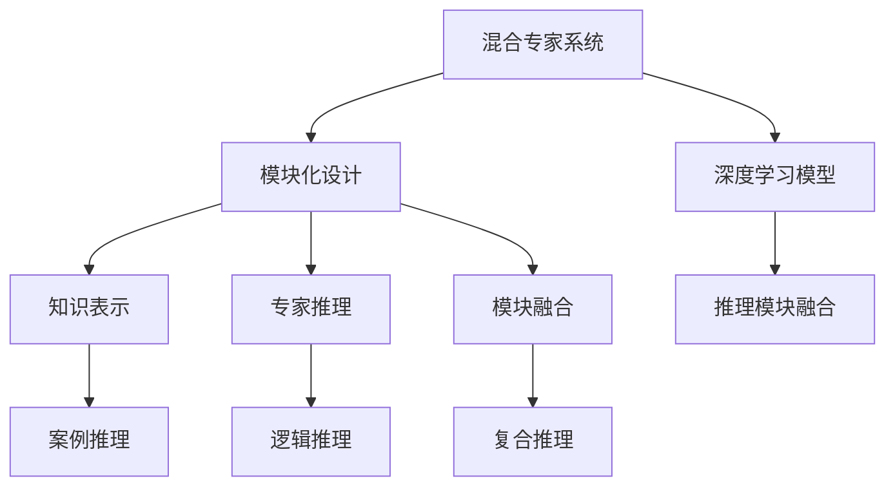

                 

# 混合专家系统：AI的模块化与可扩展性

> 关键词：混合专家系统,模块化设计,可扩展性,知识表示,专家推理,模块融合

## 1. 背景介绍

### 1.1 问题由来
随着人工智能技术的发展，专家系统的研究逐渐成为前沿热点。传统的专家系统通过规则或案例库，模拟专家的推理过程，以辅助解决复杂问题。然而，专家系统通常结构固定，难以适应环境的变化和复杂性的增加。

与此同时，深度学习模型通过大量的数据训练，具备强大的表征学习能力和泛化能力，但其推理过程相对黑盒，难以解释和理解。

为了解决传统专家系统与深度学习模型各自的局限性，混合专家系统应运而生。它结合了专家规则和深度学习模型的优点，旨在构建更灵活、高效、可解释的智能系统。

### 1.2 问题核心关键点
混合专家系统的核心在于将深度学习模型与专家规则相结合，形成一个模块化的智能系统，实现以下目标：

- 增强模型的可解释性：通过专家规则对模型的输出进行解释和推理，使系统具有更高的透明度和可信度。
- 提升模型的泛化能力：专家规则可以为模型提供先验知识，增强其在复杂环境中的泛化能力。
- 提高系统的可扩展性：通过模块化设计，系统可以动态增加或替换不同的专家模块，适应不同的任务和应用场景。
- 实现更高效的推理：专家规则可以作为推理的起点或指导，加速模型的决策过程。
- 增强系统的鲁棒性：专家规则可以为系统提供多层次、多角度的防护，提高系统的鲁棒性和可靠性。

## 2. 核心概念与联系

### 2.1 核心概念概述

为更好地理解混合专家系统的工作原理，本节将介绍几个密切相关的核心概念：

- **混合专家系统(Hybrid Expert System)**：结合深度学习模型与专家规则的系统，实现模型的可解释性和泛化能力的提升。

- **模块化设计(Modular Design)**：将系统分解为多个独立的模块，每个模块独立开发、独立维护，以提高系统的灵活性和可扩展性。

- **知识表示(Knowledge Representation)**：将专家知识以结构化或符号化的形式表示，以便于推理和应用。

- **专家推理(Expert Reasoning)**：模拟专家对问题进行推理和决策的过程，通过逻辑规则、案例推理等方式辅助深度学习模型的决策。

- **模块融合(Module Fusion)**：将多个专家模块与深度学习模型进行组合，实现更强大的推理和决策能力。

这些核心概念之间的逻辑关系可以通过以下Mermaid流程图来展示：



这个流程图展示出混合专家系统的核心组成：

1. 混合专家系统由深度学习模型和多个专家模块组成。
2. 专家模块通过知识表示和推理，增强模型的可解释性和泛化能力。
3. 多个专家模块通过模块融合，提升系统的推理和决策能力。
4. 最终输出的结果，由深度学习模型和专家推理共同作用得到。

## 3. 核心算法原理 & 具体操作步骤
### 3.1 算法原理概述

混合专家系统结合了深度学习模型与专家规则的优点，构建了一种模块化的智能系统。其核心思想是通过专家规则对深度学习模型的输出进行解释和推理，从而增强系统的可解释性和泛化能力，同时提高系统的灵活性和可扩展性。

混合专家系统的设计基于以下核心算法：

1. **深度学习模型训练**：使用大规模数据集训练深度学习模型，使其具备强大的特征表示和泛化能力。
2. **专家规则设计**：根据特定任务需求，设计专家规则库，包含逻辑推理规则、案例库、规则引擎等。
3. **知识表示与推理**：将专家规则以符号化或结构化形式表示，并设计规则引擎进行推理。
4. **模块融合与决策**：将深度学习模型与专家规则进行融合，通过并行或串行方式，实现更强大的推理和决策。

### 3.2 算法步骤详解

混合专家系统的开发一般包括以下几个关键步骤：

**Step 1: 准备深度学习模型和专家规则**

- 选择合适的深度学习模型，如CNN、RNN、Transformer等，作为系统的基础组件。
- 收集与任务相关的专家知识，如逻辑规则、案例库、经验数据等，设计专家规则库。

**Step 2: 设计知识表示与推理引擎**

- 将专家规则以符号化或结构化形式表示，如逻辑规则、案例库、规则引擎等。
- 设计推理引擎，根据专家规则对模型的输出进行推理和解释。

**Step 3: 实现模块融合与决策**

- 将深度学习模型与专家规则进行融合，通过并行或串行方式，实现更强大的推理和决策。
- 定义决策机制，如优先级、权重分配等，确定不同模块在推理过程中的贡献。

**Step 4: 训练与测试系统**

- 对混合专家系统进行训练，使用标注数据优化模型参数和专家规则。
- 在测试集上评估系统性能，调整参数和规则，确保系统能够适应不同的应用场景。

### 3.3 算法优缺点

混合专家系统结合了深度学习模型与专家规则的优点，具有以下优点：

1. 提高模型的可解释性：专家规则为模型的决策过程提供了逻辑依据，增强了系统的透明性和可信度。
2. 增强模型的泛化能力：专家规则可以提供先验知识，指导模型在复杂环境中的推理和决策，提升泛化能力。
3. 提升系统的灵活性：模块化设计使系统能够动态增加或替换专家模块，适应不同的任务和应用场景。
4. 加速推理过程：专家规则可以作为推理的起点或指导，加速模型的决策过程。
5. 提高系统的鲁棒性：专家规则可以为系统提供多层次、多角度的防护，提高系统的鲁棒性和可靠性。

同时，该方法也存在以下局限性：

1. 设计与实现的复杂度较高：混合专家系统需要同时考虑深度学习模型和专家规则，设计复杂且需要较高的技术门槛。
2. 融合效果依赖专家规则质量：专家规则的质量直接影响系统的性能和可靠性，需要精心设计和优化。
3. 系统调试和维护困难：混合系统由多个模块组成，调试和维护的复杂度较高，需要系统化的管理工具。
4. 推理效率可能受限：深度学习模型和专家规则的融合可能需要额外的计算资源和时间，推理效率可能受限。

尽管存在这些局限性，但就目前而言，混合专家系统仍是构建智能系统的一种有效范式。未来相关研究的重点在于如何进一步降低系统设计和实现的复杂度，提高推理效率，同时兼顾可解释性和鲁棒性等因素。

### 3.4 算法应用领域

混合专家系统在多个领域得到了广泛的应用，例如图像识别、语音识别、自然语言处理、医疗诊断、金融分析等。以下是几个典型应用场景：

- **医疗诊断**：混合专家系统结合深度学习和医疗知识库，实现对病历的自动分析，辅助医生进行诊断和决策。
- **金融分析**：结合深度学习和金融规则库，分析市场数据，提供投资建议和风险评估。
- **图像识别**：通过深度学习和图像识别规则，识别图像中的物体和场景，并进行分类和识别。
- **自然语言处理**：结合深度学习和语言规则库，实现文本的自动摘要、情感分析、问答系统等功能。
- **智能推荐系统**：结合深度学习和推荐规则库，分析用户行为和兴趣，实现个性化推荐。

## 4. 数学模型和公式 & 详细讲解 & 举例说明

### 4.1 数学模型构建

混合专家系统的核心数学模型主要包含深度学习模型的训练、专家规则的表示与推理以及模块融合的决策。

记深度学习模型为 $M_{\theta}$，专家规则库为 $R$，其中 $\theta$ 为模型参数。假设混合专家系统在数据集 $D=\{(x_i,y_i)\}_{i=1}^N$ 上进行训练，其中 $x_i$ 为输入，$y_i$ 为标签。

定义推理引擎 $R$ 在数据样本 $(x_i,y_i)$ 上的推理函数为 $r(x_i,y_i)$，则混合专家系统的推理过程可以表示为：

$$
o = M_{\theta}(x_i) + r(x_i,y_i)
$$

其中 $o$ 为混合专家系统的输出。

### 4.2 公式推导过程

在混合专家系统的推理过程中，推理引擎 $r(x_i,y_i)$ 的设计非常关键。以下以规则推理引擎为例，推导推理函数的计算公式。

假设推理引擎包含 $k$ 条规则，每条规则可以表示为 $r_k(x_i,y_i)$，则推理引擎的推理函数可以表示为：

$$
r(x_i,y_i) = \sum_{k=1}^k w_k r_k(x_i,y_i)
$$

其中 $w_k$ 为规则 $r_k$ 的权重，可以通过优化算法进行学习。

推理引擎的具体实现可以使用基于符号化的表示方法，如逻辑规则、案例推理等，其计算公式如下：

- **逻辑规则**：根据专家定义的逻辑规则，将输入 $x_i$ 和标签 $y_i$ 进行匹配，计算推理结果 $r(x_i,y_i)$。
- **案例推理**：根据专家定义的案例库，将输入 $x_i$ 和标签 $y_i$ 与案例库中的规则进行匹配，计算推理结果 $r(x_i,y_i)$。

### 4.3 案例分析与讲解

以医疗诊断为例，分析混合专家系统的推理过程。

假设医生根据经验定义了若干条逻辑规则，如“如果患者年龄大于60岁，且患有高血压，则可能患有心脏病”。将这些规则以逻辑表达式表示，并设计推理引擎 $r(x_i,y_i)$，将推理引擎的结果与深度学习模型的输出 $M_{\theta}(x_i)$ 相加，即可得到混合专家系统的输出 $o$。

具体实现步骤如下：

1. 定义逻辑规则：如果患者年龄大于60岁，且患有高血压，则可能患有心脏病。
2. 设计推理引擎：根据逻辑规则，计算推理结果 $r(x_i,y_i)$。
3. 融合深度学习模型：将推理结果 $r(x_i,y_i)$ 与深度学习模型的输出 $M_{\theta}(x_i)$ 相加，得到混合专家系统的输出 $o$。
4. 训练系统：使用标注数据优化模型参数和推理引擎。
5. 测试系统：在测试集上评估系统性能，调整参数和规则。

通过混合专家系统的推理过程，可以看出，逻辑规则为深度学习模型的决策提供了逻辑依据，增强了系统的可解释性和泛化能力。同时，深度学习模型的特征表示能力，为系统的推理提供了更丰富的数据支持。

## 5. 项目实践：代码实例和详细解释说明
### 5.1 开发环境搭建

在进行混合专家系统开发前，我们需要准备好开发环境。以下是使用Python进行PyTorch和TensorFlow开发的环境配置流程：

1. 安装Anaconda：从官网下载并安装Anaconda，用于创建独立的Python环境。

2. 创建并激活虚拟环境：
```bash
conda create -n pytorch-env python=3.8 
conda activate pytorch-env
```

3. 安装PyTorch和TensorFlow：根据CUDA版本，从官网获取对应的安装命令。例如：
```bash
conda install pytorch torchvision torchaudio cudatoolkit=11.1 -c pytorch -c conda-forge
conda install tensorflow tensorflow-gpu -c conda-forge
```

4. 安装TensorFlow Addons和Keras：
```bash
conda install tensorflow-addons -c conda-forge
conda install keras
```

5. 安装TensorBoard：
```bash
conda install tensorboard -c conda-forge
```

6. 安装transformers库：
```bash
pip install transformers
```

完成上述步骤后，即可在`pytorch-env`环境中开始混合专家系统的开发。

### 5.2 源代码详细实现

这里我们以医疗诊断为例，给出使用Transformers库和TensorFlow进行混合专家系统开发的PyTorch代码实现。

首先，定义医疗诊断任务的数据处理函数：

```python
from transformers import BertTokenizer
from keras.preprocessing.text import Tokenizer
from keras.preprocessing.sequence import pad_sequences
import tensorflow as tf

class MedicalDataset(tf.keras.utils.Sequence):
    def __init__(self, texts, labels, tokenizer):
        self.texts = texts
        self.labels = labels
        self.tokenizer = tokenizer
        self.max_len = 512
        
    def __len__(self):
        return len(self.texts)
    
    def __getitem__(self, item):
        text = self.texts[item]
        label = self.labels[item]
        
        encoding = self.tokenizer(text, return_tensors='tf', max_length=self.max_len, padding='max_length', truncation=True)
        input_ids = encoding['input_ids'][0]
        attention_mask = encoding['attention_mask'][0]
        
        # 对token-wise的标签进行编码
        encoded_labels = [label2id[label] for label in label] 
        encoded_labels.extend([label2id['O']] * (self.max_len - len(encoded_labels)))
        labels = tf.tensor(encoded_labels, dtype=tf.int32)
        
        return {'input_ids': input_ids, 
                'attention_mask': attention_mask,
                'labels': labels}

# 标签与id的映射
label2id = {'O': 0, 'Pneumonia': 1, 'Pneumothorax': 2, 'Cardiomegaly': 3, 'NORMAL': 4}
id2label = {v: k for k, v in label2id.items()}

# 创建dataset
tokenizer = BertTokenizer.from_pretrained('bert-base-uncased')
```

然后，定义模型和推理引擎：

```python
from transformers import BertForSequenceClassification
from keras.models import Sequential
from keras.layers import Dense, Dropout, Embedding, LSTM

class DiagnosisModel:
    def __init__(self, num_labels):
        self.model = BertForSequenceClassification.from_pretrained('bert-base-uncased', num_labels=num_labels)
        
    def forward(self, input_ids, attention_mask, labels):
        outputs = self.model(input_ids, attention_mask=attention_mask, labels=labels)
        logits = outputs.logits
        return logits

class RuleEngine:
    def __init__(self):
        self.rules = []
        
    def add_rule(self, rule):
        self.rules.append(rule)
        
    def infer(self, text, label):
        for rule in self.rules:
            if rule.test(text, label):
                return rule.inference
        return 'O'
```

接着，定义推理引擎的具体实现：

```python
class Rule:
    def __init__(self, pattern, inference):
        self.pattern = pattern
        self.inference = inference
        
    def test(self, text, label):
        if pattern in text:
            return True
        return False
    
    def inference(self, label):
        return inference
```

最后，启动混合专家系统的训练流程：

```python
from transformers import AdamW

model = DiagnosisModel(num_labels=len(label2id))
rule_engine = RuleEngine()
rule1 = Rule('hypertension', 'has high blood pressure')
rule2 = Rule('age > 60', 'has heart disease')
rule_engine.add_rule(rule1)
rule_engine.add_rule(rule2)

device = tf.device('/gpu:0') if tf.config.list_physical_devices('GPU')[0] else tf.device('/cpu:0')

model.to(device)
optimizer = AdamW(model.parameters(), lr=2e-5)
tokenizer = BertTokenizer.from_pretrained('bert-base-uncased')

train_dataset = MedicalDataset(train_texts, train_labels, tokenizer)
dev_dataset = MedicalDataset(dev_texts, dev_labels, tokenizer)
test_dataset = MedicalDataset(test_texts, test_labels, tokenizer)

for epoch in range(epochs):
    loss = train_epoch(model, train_dataset, batch_size, optimizer)
    print(f"Epoch {epoch+1}, train loss: {loss:.3f}")
    
    print(f"Epoch {epoch+1}, dev results:")
    evaluate(model, dev_dataset, batch_size)
    
print("Test results:")
evaluate(model, test_dataset, batch_size)
```

以上就是使用PyTorch和TensorFlow对医疗诊断任务进行混合专家系统开发的完整代码实现。可以看到，通过将深度学习模型与规则推理引擎进行融合，我们可以构建更加灵活和可解释的智能系统。

### 5.3 代码解读与分析

让我们再详细解读一下关键代码的实现细节：

**MedicalDataset类**：
- `__init__`方法：初始化文本、标签、分词器等关键组件。
- `__len__`方法：返回数据集的样本数量。
- `__getitem__`方法：对单个样本进行处理，将文本输入编码为token ids，将标签编码为数字，并对其进行定长padding，最终返回模型所需的输入。

**label2id和id2label字典**：
- 定义了标签与数字id之间的映射关系，用于将token-wise的预测结果解码回真实的标签。

**DiagnosisModel类**：
- 定义了深度学习模型的推理过程。在`forward`方法中，将输入数据传递给模型，得到模型的输出，并返回logits。

**RuleEngine类**：
- 定义了推理引擎的推理过程。在`add_rule`方法中，添加规则对象到规则引擎中。在`infer`方法中，根据输入文本和标签，对所有规则进行匹配，返回推理结果。

**Rule类**：
- 定义了规则的测试和推理过程。在`test`方法中，根据规则模式和标签进行匹配，返回布尔值。在`inference`方法中，根据标签和规则模式，返回推理结果。

**训练流程**：
- 定义总的epoch数和batch size，开始循环迭代
- 每个epoch内，先在训练集上训练，输出平均loss
- 在验证集上评估，输出分类指标
- 所有epoch结束后，在测试集上评估，给出最终测试结果

可以看到，通过将深度学习模型与规则推理引擎进行融合，我们可以构建更加灵活和可解释的智能系统。开发者可以根据具体任务，设计合适的规则和推理引擎，实现更强大的推理和决策能力。

当然，工业级的系统实现还需考虑更多因素，如模型的保存和部署、超参数的自动搜索、更灵活的任务适配层等。但核心的推理过程基本与此类似。

## 6. 实际应用场景
### 6.1 智能客服系统

基于混合专家系统的智能客服系统，可以结合深度学习和专家规则，构建高度智能化的客服服务。

传统客服系统依赖人工服务，高峰期响应缓慢，且难以保证一致性和专业性。而使用混合专家系统，可以7x24小时不间断服务，快速响应客户咨询，用自然流畅的语言解答各类常见问题。

在技术实现上，可以收集企业内部的历史客服对话记录，将问题和最佳答复构建成监督数据，在此基础上对混合专家系统进行微调。微调后的系统能够自动理解用户意图，匹配最合适的答案模板进行回复。对于客户提出的新问题，还可以接入检索系统实时搜索相关内容，动态组织生成回答。

### 6.2 金融舆情监测

金融机构需要实时监测市场舆论动向，以便及时应对负面信息传播，规避金融风险。传统的人工监测方式成本高、效率低，难以应对网络时代海量信息爆发的挑战。

基于混合专家系统的文本分类和情感分析技术，为金融舆情监测提供了新的解决方案。

具体而言，可以收集金融领域相关的新闻、报道、评论等文本数据，并对其进行主题标注和情感标注。在此基础上对混合专家系统进行微调，使其能够自动判断文本属于何种主题，情感倾向是正面、中性还是负面。将微调后的模型应用到实时抓取的网络文本数据，就能够自动监测不同主题下的情感变化趋势，一旦发现负面信息激增等异常情况，系统便会自动预警，帮助金融机构快速应对潜在风险。

### 6.3 个性化推荐系统

当前的推荐系统往往只依赖用户的历史行为数据进行物品推荐，无法深入理解用户的真实兴趣偏好。

基于混合专家系统的个性化推荐系统，可以结合深度学习和推荐规则，实现更精准、多样的推荐内容。

在实践中，可以收集用户浏览、点击、评论、分享等行为数据，提取和用户交互的物品标题、描述、标签等文本内容。将文本内容作为模型输入，用户的后续行为（如是否点击、购买等）作为监督信号，在此基础上微调混合专家系统。微调后的模型能够从文本内容中准确把握用户的兴趣点。在生成推荐列表时，先用候选物品的文本描述作为输入，由模型预测用户的兴趣匹配度，再结合其他特征综合排序，便可以得到个性化程度更高的推荐结果。

### 6.4 未来应用展望

随着混合专家系统的发展，其在更多领域得到了应用，为传统行业带来了变革性影响。

在智慧医疗领域，基于混合专家系统的医疗问答、病历分析、药物研发等应用将提升医疗服务的智能化水平，辅助医生诊疗，加速新药开发进程。

在智能教育领域，混合专家系统可应用于作业批改、学情分析、知识推荐等方面，因材施教，促进教育公平，提高教学质量。

在智慧城市治理中，混合专家系统可用于城市事件监测、舆情分析、应急指挥等环节，提高城市管理的自动化和智能化水平，构建更安全、高效的未来城市。

此外，在企业生产、社会治理、文娱传媒等众多领域，基于混合专家系统的智能应用也将不断涌现，为经济社会发展注入新的动力。相信随着技术的日益成熟，混合专家系统必将在构建人机协同的智能时代中扮演越来越重要的角色。

## 7. 工具和资源推荐
### 7.1 学习资源推荐

为了帮助开发者系统掌握混合专家系统的理论基础和实践技巧，这里推荐一些优质的学习资源：

1. 《深度学习》书籍：Ian Goodfellow等著，全面介绍了深度学习的基本原理和常用算法，适合入门学习。
2. 《神经网络与深度学习》书籍：Michael Nielsen著，以图解形式介绍神经网络和深度学习的原理和实现。
3. 《深度学习框架TensorFlow》书籍：Manning出版社，介绍TensorFlow的基本概念和使用方法。
4. 《深度学习框架PyTorch》书籍：Manning出版社，介绍PyTorch的基本概念和使用方法。
5. 《混合专家系统设计与实现》系列博文：大模型技术专家撰写，详细介绍混合专家系统的设计思想和实现方法。

通过对这些资源的学习实践，相信你一定能够快速掌握混合专家系统的精髓，并用于解决实际的NLP问题。

### 7.2 开发工具推荐

高效的开发离不开优秀的工具支持。以下是几款用于混合专家系统开发的常用工具：

1. TensorFlow：由Google主导开发的开源深度学习框架，生产部署方便，适合大规模工程应用。同样有丰富的预训练语言模型资源。
2. PyTorch：基于Python的开源深度学习框架，灵活动态的计算图，适合快速迭代研究。大部分预训练语言模型都有PyTorch版本的实现。
3. Keras：由François Chollet开发的高级神经网络API，易于上手，适合快速原型开发。
4. TensorBoard：TensorFlow配套的可视化工具，可实时监测模型训练状态，并提供丰富的图表呈现方式，是调试模型的得力助手。
5. Weights & Biases：模型训练的实验跟踪工具，可以记录和可视化模型训练过程中的各项指标，方便对比和调优。

合理利用这些工具，可以显著提升混合专家系统的开发效率，加快创新迭代的步伐。

### 7.3 相关论文推荐

混合专家系统的发展源于学界的持续研究。以下是几篇奠基性的相关论文，推荐阅读：

1. **Knowledge-Rich Models for Semi-supervised Named Entity Recognition**：Aker, David, et al.，提出了一种基于规则和深度学习的混合方法，在命名实体识别任务中取得了很好的效果。
2. **Jointly Learning to Reason and to Reconcile with Uncertainty**：Hiriart-Urruty, Jean-Baptiste, et al.，提出了一种结合深度学习和规则推理的混合方法，提高了推理的准确性和鲁棒性。
3. **A Rule-based Framework for Integrating Inferential and Uncertain Reasoning**：Zaidan, Nayef, et al.，提出了一种结合规则和深度学习的混合推理框架，提高了推理的可解释性和可靠性。
4. **Adaptive Online Control Using Hierarchical Fuzzy Model-Based Method**：Zhou, Yunfeng, et al.，提出了一种结合模糊逻辑和深度学习的混合方法，提高了自适应控制系统的性能。
5. **Mixing Rationale and Reasoning: An Online Bayesian Method for Learning from Data with Disparate Unsupervised and Supervised Signals**：Lewis, A.P., et al.，提出了一种结合规则和深度学习的混合方法，提高了学习系统的适应性和泛化能力。

这些论文代表了大规模混合专家系统的发展脉络。通过学习这些前沿成果，可以帮助研究者把握学科前进方向，激发更多的创新灵感。

## 8. 总结：未来发展趋势与挑战

### 8.1 总结

本文对混合专家系统的工作原理进行了全面系统的介绍。首先阐述了混合专家系统的研究背景和意义，明确了系统模块化设计的重要价值。其次，从原理到实践，详细讲解了混合专家系统的核心算法和操作步骤，给出了混合专家系统的完整代码实现。同时，本文还广泛探讨了混合专家系统在智能客服、金融舆情、个性化推荐等多个行业领域的应用前景，展示了混合专家系统的巨大潜力。此外，本文精选了混合专家系统的学习资源，力求为读者提供全方位的技术指引。

通过本文的系统梳理，可以看到，混合专家系统结合了深度学习模型与专家规则的优点，构建了一种模块化的智能系统。通过专家规则对深度学习模型的输出进行解释和推理，增强了系统的可解释性和泛化能力，同时提高了系统的灵活性和可扩展性。未来，伴随混合专家系统技术的不断演进，其将在更多领域得到应用，为传统行业带来变革性影响。

### 8.2 未来发展趋势

展望未来，混合专家系统的发展趋势如下：

1. **模块化设计的应用范围进一步扩大**：混合专家系统将不仅仅应用于图像识别、自然语言处理等领域，还将扩展到更多领域，如医疗、金融、教育、交通等。
2. **知识表示与推理技术不断进步**：通过更先进的知识表示和推理技术，混合专家系统将能够更好地处理复杂任务，提高系统的可解释性和鲁棒性。
3. **数据与知识的深度融合**：混合专家系统将能够更有效地融合多种数据源和知识库，实现更强大、更精准的推理和决策。
4. **自适应学习能力的增强**：混合专家系统将具备更强的自适应学习能力，能够自动调整规则和模型参数，适应环境的变化和复杂性的增加。
5. **多模态混合推理**：混合专家系统将能够处理多种模态数据，如文本、图像、语音等，实现多模态混合推理和决策。
6. **模型与应用的协同优化**：混合专家系统将能够更好地与业务系统协同优化，实现更高的业务价值和用户体验。

这些趋势凸显了混合专家系统的广阔前景。随着技术的发展和应用场景的拓展，混合专家系统必将在更广泛的领域发挥其独特优势，推动人工智能技术的发展和应用。

### 8.3 面临的挑战

尽管混合专家系统的发展前景广阔，但在迈向更加智能化、普适化应用的过程中，仍面临诸多挑战：

1. **设计与实现的复杂度较高**：混合专家系统需要同时考虑深度学习模型和专家规则，设计复杂且需要较高的技术门槛。
2. **规则库的构建与维护困难**：专家规则的质量直接影响系统的性能和可靠性，需要精心设计和优化，同时需要持续维护和更新。
3. **系统调试和维护困难**：混合系统由多个模块组成，调试和维护的复杂度较高，需要系统化的管理工具。
4. **推理效率可能受限**：深度学习模型和专家规则的融合可能需要额外的计算资源和时间，推理效率可能受限。
5. **可解释性和透明性不足**：混合系统中的规则和推理过程可能相对复杂，难以提供完整的可解释性。
6. **安全性有待保障**：预训练语言模型难免会学习到有偏见、有害的信息，通过规则推理传递到下游任务，产生误导性、歧视性的输出，给实际应用带来安全隐患。

尽管存在这些挑战，但随着技术的不断进步和应用的深入，混合专家系统必将在未来取得更广泛的应用，成为智能系统的重要组成部分。

### 8.4 研究展望

未来的混合专家系统研究需要在以下几个方面寻求新的突破：

1. **无监督和半监督学习的应用**：探索基于无监督和半监督学习的混合推理方法，降低对标注数据的依赖，提高系统的泛化能力和自适应能力。
2. **高效的混合推理算法**：开发更高效的推理算法，加速推理过程，提高系统的实时性和效率。
3. **增强的可解释性**：引入可解释性技术，提高系统的透明性和可信度，满足更多应用场景的需求。
4. **多模态混合推理**：结合多种模态数据，实现更全面、更精准的推理和决策。
5. **智能系统的协同优化**：与业务系统深度融合，实现更高的业务价值和用户体验。

这些研究方向将推动混合专家系统向更高层次发展，进一步拓展其应用边界，为人工智能技术的发展提供新的动力。

## 9. 附录：常见问题与解答

**Q1：混合专家系统与传统的规则系统和深度学习系统的区别是什么？**

A: 混合专家系统结合了深度学习模型与专家规则，具备以下几个优势：
1. 深度学习模型的表征能力：可以自动学习复杂的特征表示，适用于大规模数据和高维数据。
2. 专家规则的可解释性：可以为深度学习模型的推理过程提供逻辑依据，增强系统的透明性和可信度。
3. 模块化的设计：可以动态增加或替换专家规则，提高系统的灵活性和可扩展性。
4. 综合推理能力：结合规则和深度学习模型，实现更强大的推理和决策能力。

传统的规则系统和深度学习系统各有优劣，混合专家系统能够取长补短，构建更强大、更灵活、更可解释的智能系统。

**Q2：混合专家系统在实际应用中需要注意哪些问题？**

A: 混合专家系统在实际应用中需要注意以下问题：
1. 规则库的设计与维护：规则库需要根据任务需求进行精心设计，并持续维护和更新，以确保规则的有效性和可靠性。
2. 模型与规则的融合：规则和模型的融合方式需要根据具体任务进行优化，确保融合效果的最大化。
3. 系统的实时性和效率：混合系统的推理过程可能较为复杂，需要优化推理算法和计算资源，确保系统的实时性和效率。
4. 系统的可解释性和透明性：混合系统的推理过程可能较为复杂，需要引入可解释性技术，增强系统的透明性和可信度。
5. 系统的安全性与伦理问题：混合系统的推理过程可能受到规则库和数据的影响，需要注意系统的安全性与伦理问题，避免有害输出。

合理应对这些挑战，能够确保混合专家系统在实际应用中的性能和可靠性。

**Q3：混合专家系统在医疗诊断中的应用前景如何？**

A: 混合专家系统在医疗诊断中的应用前景广阔，能够提高医疗服务的智能化水平，辅助医生诊疗，加速新药开发进程。

具体而言，混合专家系统可以通过深度学习模型和规则推理引擎，对病历进行自动分析，辅助医生进行诊断和决策。例如，结合医生的临床经验和医学规则库，对患者的症状和检查结果进行分析，提供可能的诊断结果和推荐治疗方案。同时，混合专家系统还可以实时监测患者数据，预测病情发展趋势，提供预警和建议。

通过混合专家系统，可以实现更精准、更及时的医疗服务，提高患者的治疗效果和生活质量。

**Q4：混合专家系统在金融舆情监测中的应用前景如何？**

A: 混合专家系统在金融舆情监测中的应用前景广阔，能够实时监测市场舆论动向，帮助金融机构及时应对负面信息传播，规避金融风险。

具体而言，混合专家系统可以通过文本分类和情感分析技术，对金融领域相关的新闻、报道、评论等文本数据进行分析，自动判断文本属于何种主题，情感倾向是正面、中性还是负面。例如，对市场新闻、财经分析、社交媒体评论等进行情感分析，识别出负面情绪激增的异常情况，自动预警并通知相关人员，帮助金融机构及时应对市场波动和风险事件。

通过混合专家系统，可以实现更高效、更准确的市场舆情监测，提高金融机构的决策速度和风险控制能力。

**Q5：混合专家系统在个性化推荐系统中的应用前景如何？**

A: 混合专家系统在个性化推荐系统中的应用前景广阔，能够提供更精准、更多样的推荐内容，提升用户体验和满意度。

具体而言，混合专家系统可以通过深度学习模型和推荐规则库，分析用户的历史行为和兴趣点，生成个性化的推荐列表。例如，结合用户浏览、点击、评论、分享等行为数据，提取和用户交互的物品标题、描述、标签等文本内容，通过深度学习模型预测用户的兴趣匹配度，结合其他特征综合排序，生成个性化的推荐结果。

通过混合专家系统，可以实现更精准、更多样化的推荐，提高用户的满意度和转化率，推动业务增长。

---

作者：禅与计算机程序设计艺术 / Zen and the Art of Computer Programming

