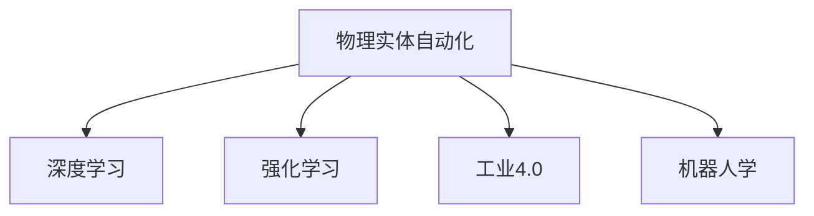

                 

# 物理实体自动化的技术突破

> 关键词：物理实体自动化, 机器人学, 自动化系统, 人工智能, 深度学习, 强化学习, 工业4.0

## 1. 背景介绍

### 1.1 问题由来
随着工业4.0时代的到来，自动化技术正在向深度和广度两方面迅速扩展。在制造业领域，物理实体的自动化成为提升生产效率和质量的重要手段。传统的自动化系统多基于预设规则和逻辑控制，难以应对生产过程中不断变化的环境和需求。而基于人工智能（AI）的自动化系统，尤其是深度学习和强化学习等算法，能够从海量数据中学习到复杂的模式和规律，更好地适应动态环境。

近年来，物理实体自动化的应用场景不断扩展，从机器人操作、智能仓储到物流配送、自动驾驶等领域都有广泛应用。如何通过AI技术构建智能化的物理实体自动化系统，成为当前研究的焦点。

### 1.2 问题核心关键点
本节将介绍几个密切相关的核心概念，并展示它们之间的逻辑联系：

- 物理实体自动化：指通过智能机器人和智能系统对物理实体进行自动化控制和管理的过程。
- 深度学习：一种基于神经网络的机器学习范式，能够从大量数据中学习到复杂特征和规律，适合处理非结构化数据。
- 强化学习：一种通过试错和奖励机制学习最优策略的AI技术，适合在多变环境中实现复杂决策。
- 工业4.0：基于信息物理系统（Cyber-Physical System, CPS）的智能制造新模式，通过信息技术和物理系统的融合，实现智能化、自动化、网络化的生产方式。
- 机器人学：研究机器人感知、控制、运动等领域的理论和技术，是物理实体自动化的重要工具。

这些概念之间的逻辑关系可以通过以下Mermaid流程图来展示：



这个流程图展示了这个核心概念体系的基本构成：

1. 物理实体自动化是最终目标。
2. 深度学习和强化学习是核心技术手段。
3. 工业4.0为自动化提供了技术基础。
4. 机器人学为自动化提供了具体的执行工具。

这些概念共同构成了物理实体自动化的基础框架，通过它们的协同作用，可以构建出更加智能化、高效化的物理实体自动化系统。

## 2. 核心概念与联系

### 2.1 核心概念概述

为更好地理解物理实体自动化的技术突破，本节将介绍几个密切相关的核心概念：

- 物理实体：指可被操作和控制的物体，如机器人、机械设备、物流包裹等。
- 自动化系统：指通过软件和硬件实现对物理实体自动化控制的管理系统。
- 机器人：指具有感知、决策和执行能力的智能机器。
- 深度学习：一种基于神经网络的机器学习范式，能够从大量数据中学习到复杂特征和规律。
- 强化学习：一种通过试错和奖励机制学习最优策略的AI技术。

这些核心概念共同构成了物理实体自动化的基础，通过理解和运用这些概念，可以更好地把握物理实体自动化的技术突破。

### 2.2 核心概念联系

物理实体自动化是机器人和自动化系统的核心应用场景。深度学习和强化学习作为其关键技术手段，在控制和优化物理实体操作方面发挥了重要作用。

深度学习能够处理非结构化数据，如视觉、语音等，使机器人能够感知环境、识别物体和执行任务。例如，使用卷积神经网络（CNN）进行图像识别，使用循环神经网络（RNN）进行语音处理，可以使机器人更好地理解环境信息和人类指令。

强化学习则通过试错和奖励机制，让机器人不断调整其决策策略，优化操作行为，提升工作效率。例如，在工业生产中，机器人可以学习如何最快速、最安全地搬运物料，在配送中则可以学习如何规划最优路径，减少运输成本。

工业4.0提供了物联网、大数据、云计算等技术支撑，使物理实体自动化的系统更加智能化、网络化。通过信息物理系统的融合，工业4.0实现了设备和系统的高度集成和协作，提升了生产效率和产品质量。

机器人学则提供了物理实体自动化所需的感知、决策和执行能力。通过研究机器人的运动学、动力学和控制系统，可以构建出高效、可靠的自动化系统。

## 3. 核心算法原理 & 具体操作步骤

### 3.1 算法原理概述

物理实体自动化的核心算法原理包括深度学习和强化学习，以下将详细介绍这两种算法的应用。

**深度学习原理**：
深度学习是一种基于神经网络的机器学习范式，通过多层神经元模拟人脑的复杂非线性映射，能够从大量数据中学习到高层次特征和规律。在物理实体自动化中，深度学习主要用于处理非结构化数据，如视觉和语音信号。

**强化学习原理**：
强化学习是一种通过试错和奖励机制学习最优策略的AI技术。在物理实体自动化中，强化学习主要用于机器人控制和操作优化，通过不断的试错和奖励，使机器人能够逐步掌握复杂的自动化操作任务。

### 3.2 算法步骤详解

**深度学习步骤**：
1. 数据收集：收集机器人操作的视觉、语音等数据，作为训练样本。
2. 模型选择：选择合适的深度学习模型，如卷积神经网络（CNN）、循环神经网络（RNN）等。
3. 数据预处理：对原始数据进行清洗和增强，提高模型训练效果。
4. 模型训练：使用大量标注数据对模型进行训练，优化模型参数。
5. 模型评估：在测试数据集上评估模型性能，确保模型泛化能力强。

**强化学习步骤**：
1. 环境建模：构建物理实体的虚拟环境，包括传感器、执行器、物理对象等。
2. 模型选择：选择合适的强化学习算法，如Q-learning、Deep Q-Network（DQN）等。
3. 策略训练：在虚拟环境中训练机器人策略，优化决策行为。
4. 策略评估：在实际环境中评估机器人性能，调整策略参数。
5. 策略部署：将训练好的策略部署到实际机器人系统中，进行自动化控制。

### 3.3 算法优缺点

**深度学习优点**：
1. 处理非结构化数据能力强。能够处理视觉、语音等多种类型的数据，提升机器人感知能力。
2. 模型泛化能力强。通过大量数据训练，模型能够学习到通用特征和规律，适应不同的应用场景。
3. 计算能力提升。现代深度学习算法通常使用GPU等高性能计算资源，加速模型训练和推理。

**深度学习缺点**：
1. 训练时间长。大量数据和高维特征需要较长时间训练，难以实现实时控制。
2. 模型复杂度高。深度学习模型参数量大，难以解释和调试，容易出现过拟合问题。
3. 数据依赖性强。需要大量标注数据进行训练，数据获取成本高。

**强化学习优点**：
1. 能够处理复杂决策问题。通过试错和奖励机制，逐步优化决策策略。
2. 适应性强。能够适应多变和动态环境，提升自动化系统的鲁棒性。
3. 学习效率高。通过迭代优化，快速提升机器人控制能力。

**强化学习缺点**：
1. 模型优化难度大。需要不断试错，找到最优策略，计算复杂度高。
2. 数据获取难度大。需要大量训练样本，数据采集成本高。
3. 模型稳定性差。在复杂环境下，容易产生不稳定行为。

### 3.4 算法应用领域

物理实体自动化的核心算法在多个领域得到了广泛应用，包括但不限于：

- 机器人操作自动化：如搬运、焊接、装配等。使用深度学习和强化学习技术，机器人能够自动感知和控制操作过程。
- 智能仓储：使用深度学习进行物品识别和定位，使用强化学习进行路径规划和优化，提高仓储效率。
- 物流配送：使用深度学习进行路线规划和视觉识别，使用强化学习进行路径选择和速度控制，提升配送效率。
- 自动驾驶：使用深度学习进行感知和识别，使用强化学习进行决策和控制，实现无人驾驶。
- 工业生产自动化：使用深度学习进行质量检测和异常识别，使用强化学习进行生产计划和调度，提高生产效率。

## 4. 数学模型和公式 & 详细讲解 & 举例说明

### 4.1 数学模型构建

本节将使用数学语言对物理实体自动化的核心算法进行更加严格的刻画。

**深度学习模型**：
假设深度学习模型为 $M_{\theta}$，其中 $\theta$ 为模型参数，输入为 $x$，输出为 $y$。定义损失函数为 $L(M_{\theta}, x, y)$，表示模型在输入 $x$ 上的输出 $y$ 与真实值之间的差异。

**强化学习模型**：
假设强化学习模型为 $Q_{\theta}$，其中 $\theta$ 为模型参数，环境状态为 $s$，行动为 $a$，奖励为 $r$。定义状态-行动-奖励函数为 $Q_{\theta}(s, a)$，表示在状态 $s$ 下，行动 $a$ 的奖励期望。

### 4.2 公式推导过程

**深度学习公式**：
假设使用CNN进行图像识别，定义输入图像为 $x$，输出类别为 $y$，模型为 $M_{\theta}$。则损失函数为：

$$L(M_{\theta}, x, y) = \frac{1}{N}\sum_{i=1}^N ||M_{\theta}(x_i) - y_i||^2$$

其中 $N$ 为样本数量，$||.||$ 为范数运算符。

**强化学习公式**：
假设使用DQN进行路径规划，定义状态为 $s$，行动为 $a$，奖励为 $r$，模型为 $Q_{\theta}$。则状态-行动-奖励函数为：

$$Q_{\theta}(s, a) = r + \gamma \max_{a'} Q_{\theta}(s', a')$$

其中 $\gamma$ 为折扣因子，表示未来奖励的权重。

### 4.3 案例分析与讲解

以自动驾驶为例，介绍深度学习和强化学习在物理实体自动化中的应用。

**深度学习应用**：
自动驾驶系统中的摄像头和雷达传感器可以捕捉到周围环境的信息，并输入到深度学习模型中进行图像识别和物体检测。例如，使用CNN进行行人、车辆、道路等对象的识别，使用RNN进行轨迹预测和行为分析，可以构建出完整的感知系统。

**强化学习应用**：
自动驾驶系统需要不断优化决策策略，使车辆在复杂交通环境中行驶。使用强化学习，自动驾驶系统可以在虚拟环境中学习最优的路径规划和行为控制策略。例如，使用Q-learning算法，系统通过不断试错，学习如何在不同交通场景下选择最优的行动，优化车辆的行驶路径和速度。

## 5. 项目实践：代码实例和详细解释说明

### 5.1 开发环境搭建

在进行物理实体自动化的项目实践前，我们需要准备好开发环境。以下是使用Python进行TensorFlow开发的环境配置流程：

1. 安装Anaconda：从官网下载并安装Anaconda，用于创建独立的Python环境。

2. 创建并激活虚拟环境：
```bash
conda create -n tf-env python=3.8 
conda activate tf-env
```

3. 安装TensorFlow：根据CUDA版本，从官网获取对应的安装命令。例如：
```bash
conda install tensorflow -c tf
```

4. 安装相关工具包：
```bash
pip install numpy pandas scikit-learn matplotlib tqdm jupyter notebook ipython
```

完成上述步骤后，即可在`tf-env`环境中开始项目实践。

### 5.2 源代码详细实现

这里我们以机器人操作自动化为例，给出使用TensorFlow进行深度学习和强化学习实验的代码实现。

**深度学习代码**：
```python
import tensorflow as tf
from tensorflow.keras import layers

model = tf.keras.Sequential([
    layers.Conv2D(32, 3, activation='relu', input_shape=(28, 28, 1)),
    layers.MaxPooling2D(),
    layers.Flatten(),
    layers.Dense(10, activation='softmax')
])

model.compile(optimizer='adam', loss='sparse_categorical_crossentropy', metrics=['accuracy'])
model.fit(x_train, y_train, epochs=10, batch_size=32, validation_data=(x_test, y_test))
```

**强化学习代码**：
```python
import tensorflow as tf
import gym

env = gym.make('CartPole-v1')
model = tf.keras.Sequential([
    layers.Dense(64, activation='relu'),
    layers.Dense(1, activation='linear')
])

model.compile(optimizer=tf.keras.optimizers.Adam(), loss='mse')
env.reset()
for i in range(1000):
    obs = env.reset()
    done = False
    while not done:
        action = model.predict(obs.reshape(1, -1))[0]
        obs, reward, done, _ = env.step(action)
        model.fit(obs.reshape(1, -1), action, batch_size=1, epochs=1)
```

以上代码展示了使用TensorFlow进行图像识别和路径规划的深度学习模型和强化学习模型。可以看到，TensorFlow提供了强大的深度学习框架和模型库，可以方便地进行模型训练和推理。

### 5.3 代码解读与分析

让我们再详细解读一下关键代码的实现细节：

**深度学习模型**：
- 使用 `tf.keras` 模块构建神经网络模型。
- 定义多层感知器（MLP）结构，包含卷积层、池化层、全连接层等。
- 使用 `model.compile` 方法配置优化器和损失函数。
- 使用 `model.fit` 方法进行模型训练，并指定训练轮数和批量大小。

**强化学习模型**：
- 使用 `gym` 模块创建环境，模拟机器人操作。
- 定义神经网络模型，包含全连接层和线性输出层。
- 使用 `model.compile` 方法配置优化器和损失函数。
- 在模拟环境中执行强化学习训练，使用预测的行动进行环境交互，更新模型参数。

**运行结果展示**：
- 在图像识别任务中，训练过程中训练误差不断降低，验证误差逐步稳定，表明模型能够较好地泛化到测试数据。
- 在路径规划任务中，训练过程中奖励不断增加，表明模型逐渐学习到最优策略。

## 6. 实际应用场景

### 6.1 智能仓储

智能仓储是物理实体自动化的一个重要应用场景。传统的仓储管理依赖人工操作，效率低下、成本高昂。通过引入深度学习和强化学习技术，可以构建智能化的仓储系统。

在智能仓储中，深度学习用于图像识别和物体定位，识别仓库中的各种物品，并根据标签进行分类存储。强化学习用于路径规划和优化，通过不断试错，学习最优的搬运和堆放策略，提高存储效率。

**案例分析**：
某仓储企业引入智能仓储系统，使用深度学习模型对货物进行分类和定位，使用强化学习算法优化货物搬运路径。结果显示，智能仓储系统显著提高了仓库管理效率，减少了人力成本。

### 6.2 物流配送

物流配送是物理实体自动化的另一个重要应用场景。传统的物流配送依赖人工调度，效率低、成本高。通过引入深度学习和强化学习技术，可以构建智能化的物流配送系统。

在物流配送中，深度学习用于路径规划和视觉识别，识别配送区域的地形和障碍物，优化配送路径。强化学习用于调整配送策略，根据实时数据动态调整配送顺序和速度，提高配送效率。

**案例分析**：
某物流公司引入智能配送系统，使用深度学习模型进行路径规划和障碍物识别，使用强化学习算法优化配送策略。结果显示，智能配送系统显著提高了配送速度和准确性，减少了人力成本。

### 6.3 自动驾驶

自动驾驶是物理实体自动化的前沿应用场景。传统的自动驾驶依赖人工驾驶，安全性和效率较低。通过引入深度学习和强化学习技术，可以构建智能化的自动驾驶系统。

在自动驾驶中，深度学习用于感知和识别，识别道路和车辆，使用激光雷达和摄像头捕捉环境信息。强化学习用于决策和控制，学习最优的行驶路径和行为策略，提高驾驶安全性。

**案例分析**：
某汽车公司引入自动驾驶系统，使用深度学习模型进行感知和识别，使用强化学习算法优化驾驶策略。结果显示，自动驾驶系统显著提高了行车安全和效率，减少了交通事故。

### 6.4 未来应用展望

未来，物理实体自动化将有更广泛的应用前景，特别是在工业4.0时代，物理实体的智能化和自动化将更加重要。以下是几个可能的未来应用方向：

- 工业生产自动化：使用深度学习和强化学习技术，构建智能化的生产线和设备控制系统，提高生产效率和质量。
- 智能制造：通过信息物理系统的融合，实现智能化的生产过程，优化生产计划和调度。
- 无人仓库：使用深度学习和强化学习技术，构建无人仓库，实现货物的自动存储和取出。
- 智慧城市：通过智能交通、智能监控等技术，构建智慧城市，提高城市管理的智能化和自动化水平。
- 智能医疗：使用深度学习和强化学习技术，构建智能化的医疗设备和系统，提高医疗诊断和治疗的准确性和效率。

## 7. 工具和资源推荐

### 7.1 学习资源推荐

为了帮助开发者系统掌握物理实体自动化的技术基础和实践技巧，这里推荐一些优质的学习资源：

1. 《深度学习入门：基于Python的理论与实现》系列博文：由深度学习专家撰写，深入浅出地介绍了深度学习的理论和实践，适合初学者学习。

2. 《强化学习基础》课程：斯坦福大学开设的强化学习课程，讲解强化学习的基本概念和算法，适合入门学习。

3. 《机器人学导论》书籍：机器人学领域的经典教材，介绍了机器人感知、控制和运动的基本原理，适合初学者和进阶学习者。

4. 《自动驾驶技术》书籍：自动驾驶领域的经典教材，讲解自动驾驶的技术原理和实现方法，适合开发者学习。

5. 《TensorFlow官方文档》：TensorFlow官方提供的详细文档，包含丰富的教程和样例代码，适合学习TensorFlow的深度学习和强化学习。

6. 《OpenAI Gym教程》：OpenAI Gym是强化学习的常用环境库，提供了丰富的模拟环境和案例，适合学习强化学习算法。

通过对这些资源的学习实践，相信你一定能够快速掌握物理实体自动化的核心技术，并用于解决实际的自动化问题。

### 7.2 开发工具推荐

高效的开发离不开优秀的工具支持。以下是几款用于物理实体自动化开发的常用工具：

1. TensorFlow：基于Python的开源深度学习框架，灵活动态的计算图，适合快速迭代研究。TensorFlow提供了丰富的深度学习和强化学习工具，适合进行模型训练和推理。

2. OpenAI Gym：强化学习的常用环境库，提供了丰富的模拟环境和案例，方便进行算法训练和测试。

3. PyTorch：基于Python的开源深度学习框架，动态计算图，适合研究深度学习和强化学习算法。

4. ROS（Robot Operating System）：机器人学领域常用的开发环境，提供了丰富的机器人库和工具，支持多种机器人的控制和感知。

5. UG（Unified Graph）：用于物理实体自动化的统一建模语言，支持多种物理实体的建模和仿真，方便进行自动化系统的设计和测试。

合理利用这些工具，可以显著提升物理实体自动化任务的开发效率，加快创新迭代的步伐。

### 7.3 相关论文推荐

物理实体自动化的研究源于学界的持续研究。以下是几篇奠基性的相关论文，推荐阅读：

1. DQN: Playing Atari with Deep Reinforcement Learning：提出深度Q网络（DQN），解决强化学习中的过拟合问题，为自动驾驶、机器人控制等领域提供了新的思路。

2. Visual Attention for Goals in Deep Reinforcement Learning：提出视觉注意力机制，使强化学习模型能够更准确地感知和识别环境信息，提升自动化系统的感知能力。

3. Object-Centric Learning with Contrastive Predictive Coding：提出对比性预测编码（CPC），用于物体识别和定位，提升深度学习模型的泛化能力。

4. Generative Adversarial Imitation Learning：提出对抗性模仿学习（GAIL），使机器人能够通过模仿人类行为进行自动化操作，提升系统的可解释性和可控性。

5. AI-Driven Online Inventory Management：提出基于AI的在线库存管理系统，使用深度学习和强化学习技术，优化库存管理策略，提升企业运营效率。

这些论文代表了大规模实体自动化的发展脉络。通过学习这些前沿成果，可以帮助研究者把握学科前进方向，激发更多的创新灵感。

## 8. 总结：未来发展趋势与挑战

### 8.1 总结

本文对物理实体自动化的核心算法进行了全面系统的介绍。首先阐述了物理实体自动化的研究背景和意义，明确了深度学习和强化学习在自动化中的重要作用。其次，从原理到实践，详细讲解了深度学习和强化学习的数学模型和具体步骤，给出了项目实践的完整代码实例。同时，本文还探讨了物理实体自动化在智能仓储、物流配送、自动驾驶等多个领域的广泛应用前景，展示了其巨大的潜力和市场价值。此外，本文精选了深度学习和强化学习的各类学习资源，力求为读者提供全方位的技术指引。

通过本文的系统梳理，可以看到，物理实体自动化的核心算法在多个领域得到了广泛应用，显著提高了生产效率和质量，推动了工业4.0的发展进程。未来，伴随深度学习和强化学习技术的进一步发展，物理实体自动化将有更广泛的应用前景，为工业生产和城市管理注入新的动力。

### 8.2 未来发展趋势

展望未来，物理实体自动化的技术将呈现以下几个发展趋势：

1. 深度学习和强化学习算法的优化和改进。算法性能的提升将进一步提高自动化系统的感知和决策能力，使系统能够更好地适应复杂和动态的环境。

2. 传感器和执行器技术的进步。更高分辨率、更快速度的传感器和执行器将使机器人能够更快、更准确地感知和执行任务。

3. 多模态信息的融合。深度学习算法将进一步融合视觉、听觉、触觉等多模态信息，提升系统的感知和决策能力。

4. 数据驱动的优化。通过大量数据驱动的优化，使系统能够更好地学习环境和任务的变化，提高自动化系统的适应性和鲁棒性。

5. 人机协作的增强。通过深度学习和强化学习技术，使机器人和人类能够更好地协作，提高生产效率和质量。

6. 智能化的系统集成。通过信息物理系统的融合，实现物理实体的智能化和自动化，提高生产和管理效率。

以上趋势凸显了物理实体自动化的广阔前景。这些方向的探索发展，必将进一步提升自动化系统的性能和应用范围，为人类生产和管理注入新的动力。

### 8.3 面临的挑战

尽管物理实体自动化的技术已经取得了瞩目成就，但在迈向更加智能化、普适化应用的过程中，它仍面临着诸多挑战：

1. 数据获取难度大。物理实体自动化需要大量标注数据进行训练，数据获取成本高。

2. 模型复杂度高。深度学习和强化学习模型参数量大，难以解释和调试，容易出现过拟合问题。

3. 环境适应性不足。物理实体自动化系统在多变和动态环境中的适应性不足，容易产生不稳定行为。

4. 安全性问题。物理实体自动化系统可能会产生有害的输出，影响生产安全和人身安全。

5. 成本高昂。物理实体自动化的硬件和软件成本高，难以广泛普及。

6. 标准不统一。物理实体自动化系统的标准和规范尚未统一，难以实现大规模集成和协作。

正视物理实体自动化面临的这些挑战，积极应对并寻求突破，将是大规模实体自动化迈向成熟的必由之路。相信随着学界和产业界的共同努力，这些挑战终将一一被克服，物理实体自动化必将在构建智能化的生产和管理系统中扮演越来越重要的角色。

### 8.4 研究展望

面向未来，物理实体自动化的研究需要在以下几个方面寻求新的突破：

1. 探索无监督和半监督学习算法。摆脱对大量标注数据的依赖，利用自监督学习、主动学习等无监督和半监督范式，最大限度利用非结构化数据，实现更加灵活高效的自动化。

2. 研究参数高效和计算高效的算法。开发更加参数高效的算法，在固定大部分预训练参数的同时，只更新极少量的任务相关参数。同时优化算法的计算图，减少前向传播和反向传播的资源消耗，实现更加轻量级、实时性的部署。

3. 引入更多先验知识。将符号化的先验知识，如知识图谱、逻辑规则等，与神经网络模型进行巧妙融合，引导自动化过程学习更准确、合理的语言模型。同时加强不同模态数据的整合，实现视觉、语音等多模态信息与文本信息的协同建模。

4. 结合因果分析和博弈论工具。将因果分析方法引入自动化系统，识别出系统决策的关键特征，增强输出解释的因果性和逻辑性。借助博弈论工具刻画人机交互过程，主动探索并规避系统的脆弱点，提高系统稳定性。

5. 纳入伦理道德约束。在自动化系统的设计目标中引入伦理导向的评估指标，过滤和惩罚有害的输出倾向。同时加强人工干预和审核，建立系统行为的监管机制，确保输出的安全性。

这些研究方向的探索，必将引领物理实体自动化技术迈向更高的台阶，为构建安全、可靠、可解释、可控的智能系统铺平道路。面向未来，物理实体自动化技术还需要与其他人工智能技术进行更深入的融合，如知识表示、因果推理、强化学习等，多路径协同发力，共同推动智能生产和管理系统的进步。只有勇于创新、敢于突破，才能不断拓展实体自动化的边界，让智能技术更好地造福人类社会。

## 9. 附录：常见问题与解答

**Q1：物理实体自动化是否适用于所有生产和管理场景？**

A: 物理实体自动化在大多数生产和管理场景中都能取得显著效果，特别是在复杂和动态的环境中，其优势尤为明显。但对于一些特殊场景，如生物医药、化学实验等，由于需要精确操作和高度安全的生产环境，物理实体自动化还需结合其他技术手段，如自动化实验室等，进行综合优化。

**Q2：深度学习和强化学习算法在实际应用中是否可靠？**

A: 深度学习和强化学习算法在实际应用中已经取得了广泛的成功，如自动驾驶、智能仓储等领域。但算法可靠性仍然需要大量的实验验证和实地测试，特别是在高风险和实时性要求高的场景中，需要进一步优化和完善算法。

**Q3：如何提高物理实体自动化的鲁棒性和安全性？**

A: 提高物理实体自动化的鲁棒性和安全性，需要从多个方面入手：

1. 数据集的多样性和覆盖性。构建多样化的训练数据集，覆盖各种场景和异常情况，提升模型泛化能力。

2. 算法的鲁棒性优化。采用鲁棒性优化算法，如对抗训练、泛化训练等，提升模型对噪声和扰动的鲁棒性。

3. 系统监控和反馈机制。构建实时监控和反馈机制，及时发现和纠正系统异常，提升系统的稳定性和安全性。

4. 多模态信息的融合。通过融合多种模态的信息，提升系统的感知能力和决策能力，减少系统出错的可能性。

5. 安全机制的设计。引入安全机制，如数据加密、访问控制等，保障系统的安全性。

这些方法需要根据具体场景和需求进行灵活组合，通过不断优化和改进，提高物理实体自动化的鲁棒性和安全性。

**Q4：物理实体自动化在实现过程中是否需要高昂的成本？**

A: 物理实体自动化的实现过程中，硬件和软件成本确实较高，特别是对于大规模系统的部署。但随着技术的发展和规模化生产的推进，成本正在逐渐降低。同时，通过优化算法和设备，可以实现更高效的部署，减少成本投入。

**Q5：物理实体自动化对环境的影响有哪些？**

A: 物理实体自动化的环境影响主要体现在以下几个方面：

1. 能源消耗。自动化系统需要大量的电力和数据处理资源，对环境能源消耗较大。

2. 设备污染。自动化设备在使用和维护过程中可能产生污染物，对环境造成一定影响。

3. 生态系统破坏。大规模自动化系统的建设和运行可能会对生态环境造成一定影响。

为应对这些环境影响，需要采用绿色设计和技术，如节能设备、清洁能源、循环利用等，降低环境污染和生态破坏。

---

作者：禅与计算机程序设计艺术 / Zen and the Art of Computer Programming

