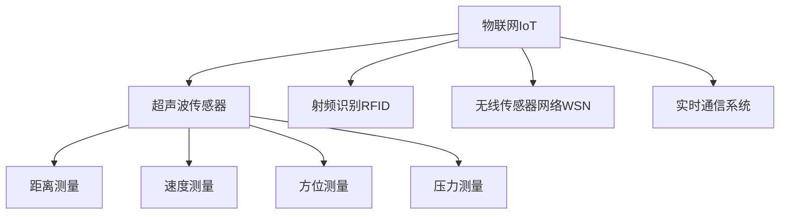

                 

# 物联网(IoT)技术和各种传感器设备的集成：超声波传感器的创新应用

## 1. 背景介绍

### 1.1 问题由来
随着物联网(IoT)技术的飞速发展，各类传感器设备在家庭、工业、医疗、智慧城市等多个领域得到了广泛应用。传感器设备能够实时采集环境参数，如温度、湿度、光照、声音、运动、位置等，为自动化决策和精准控制提供了重要依据。超声波传感器因其独特的物理特性和测量原理，成为常见的传感器设备之一。

### 1.2 问题核心关键点
超声波传感器能够通过发射和接收声波信号，测量距离、速度、方位、压力等物理量。其在工业制造、汽车导航、机器人、医疗诊断等领域具有重要应用。如何充分利用超声波传感器的优势，提升其在复杂环境下的性能，成为当前研究的重点问题。

### 1.3 问题研究意义
超声波传感器与物联网技术的结合，能够实现高精度的环境参数感知，提升自动化系统的可靠性和智能化水平。通过对超声波传感器进行优化设计，可以进一步拓展其应用范围，增强其在复杂场景下的适应能力，推动物联网技术的创新应用。

## 2. 核心概念与联系

### 2.1 核心概念概述

为更好地理解超声波传感器与物联网技术的集成应用，本节将介绍几个密切相关的核心概念：

- 物联网(IoT)：通过互联网将各种传感器设备、数据传输设备和智能处理设备等组成的网络，实现实时感知、监控和控制。
- 超声波传感器：利用超声波在不同介质中传播的特性，测量距离、速度、方位、压力等物理量。
- 射频识别(RFID)：利用无线电信号对物品进行识别和追踪的技术。
- 无线传感器网络(WSN)：由众多部署在环境中的传感器节点组成，通过无线通信进行数据采集和传输的网络。
- 实时通信系统：能够实时处理和传输传感器数据，实现快速决策和控制的系统。

这些核心概念之间的逻辑关系可以通过以下Mermaid流程图来展示：



这个流程图展示了几大关键概念之间的关联：

1. 物联网通过互联网将各类传感器设备组成的网络，实现数据采集和传输。
2. 超声波传感器是物联网中的一类重要传感器，用于测量距离、速度、方位、压力等。
3. RFID技术能够对物品进行识别和追踪，常与超声波传感器联合使用。
4. WSN由众多传感器节点组成，实现区域内的数据采集和通信。
5. 实时通信系统对传感器数据进行实时处理和传输，实现快速决策和控制。

## 3. 核心算法原理 & 具体操作步骤

### 3.1 算法原理概述

超声波传感器与物联网技术的集成应用，涉及以下几个关键算法：

- 超声波信号的发射和接收算法：发射和接收超声波信号，利用声波在不同介质中传播的特性，测量距离、速度、方位等参数。
- 信号处理算法：对接收到的超声波信号进行滤波、放大、降噪等处理，提取有效信息。
- 数据传输算法：将传感器测量数据通过无线网络传输到中央处理系统，实现数据共享和控制。
- 数据融合算法：将不同传感器数据进行融合，提升数据质量和决策可靠性。

### 3.2 算法步骤详解

超声波传感器与物联网技术的集成应用，主要包括以下几个关键步骤：

**Step 1: 传感器节点部署**
- 在需要测量的区域内选择合适的传感器节点位置。
- 根据测量需求，选择合适的传感器节点类型和参数。

**Step 2: 数据采集**
- 启动传感器节点，自动采集环境参数，如温度、湿度、声音、运动等。
- 利用超声波传感器测量距离、速度、方位、压力等参数。

**Step 3: 数据传输**
- 将传感器采集的数据通过无线网络传输到中央处理系统。
- 利用无线通信协议，确保数据传输的实时性和可靠性。

**Step 4: 数据处理**
- 在中央处理系统中，对接收到的传感器数据进行预处理，如滤波、降噪等。
- 对超声波传感器数据进行距离、速度、方位、压力等参数的解析和计算。

**Step 5: 数据分析和决策**
- 将传感器数据与其他数据源（如天气、交通、环境监测数据）进行融合，提升决策的全面性和准确性。
- 利用机器学习和人工智能技术，对传感器数据进行分析和建模，提取有用信息。
- 根据分析结果，进行自动化决策和控制，如智能家居、智慧城市、工业生产等。

### 3.3 算法优缺点

超声波传感器与物联网技术的集成应用，具有以下优点：

1. 实时性高：传感器数据能够实时采集和传输，实现快速决策和控制。
2. 精度高：超声波传感器能够提供高精度的测量结果，提升系统的可靠性和精确度。
3. 适用性强：能够在恶劣环境下进行测量，如高低温、高湿、强腐蚀等。
4. 可扩展性强：传感器节点可以灵活部署，方便扩展和升级。

同时，该方法也存在以下局限性：

1. 信号衰减：超声波信号在传输过程中存在衰减，需进行信号放大和降噪处理。
2. 多路径效应：超声波信号在复杂环境中可能产生多路径效应，影响测量精度。
3. 安装难度：传感器节点需要在现场进行固定安装，安装难度较高。
4. 系统复杂：需要综合考虑传感器部署、数据采集、传输、处理等多个环节，系统复杂度较高。

尽管存在这些局限性，但就目前而言，超声波传感器与物联网技术的集成应用仍是大数据感知、智能控制等领域的核心技术。未来相关研究的重点在于如何进一步提升系统的实时性、精度和适用性，同时兼顾成本和可靠性等因素。

### 3.4 算法应用领域

超声波传感器与物联网技术的集成应用，已经在多个领域得到了广泛应用，例如：

- 智能家居：通过超声波传感器测量室内温度、湿度、声音等，实现智能控制和自动化决策。
- 智慧城市：利用超声波传感器监测交通流量、空气质量、人员流动等，提升城市管理和公共服务水平。
- 工业制造：在工业生产中测量设备状态、人员位置、物料流动等，实现智能化生产和管理。
- 医疗诊断：在医疗领域监测患者心跳、呼吸、体温等生理参数，辅助医生诊断和治疗。
- 机器人导航：通过超声波传感器测量机器人与障碍物的距离，实现精确导航和避障。
- 无人机定位：利用超声波传感器进行无人机定位，提高无人机自主导航和飞行安全。

此外，超声波传感器与物联网技术的集成应用，还被创新性地应用于更多领域中，如智慧农业、安防监控、物流仓储等，为物联网技术的创新应用提供了新的思路。随着技术的不断进步，相信超声波传感器与物联网技术的集成应用将在更广泛的场景下得到推广，为人类生产生活带来新的变革。

## 4. 数学模型和公式 & 详细讲解  
### 4.1 数学模型构建

在超声波传感器与物联网技术的集成应用中，数学模型主要涉及以下几个方面：

- 超声波信号的发射和接收模型：超声波信号在空气中的传播速度、声波衰减模型。
- 传感器数据融合模型：不同传感器数据融合的数学模型。
- 机器学习模型：利用传感器数据进行预测和分类的数学模型。

### 4.2 公式推导过程

以超声波信号的发射和接收模型为例，以下是具体的公式推导过程：

设超声波信号的发射频率为 $f$，波长为 $\lambda$，声速为 $v$，声波在空气中的传播距离为 $d$，接收器接收到声波的时间为 $t$。超声波信号的发射和接收过程可以建模为：

$$
t = \frac{2d}{v}
$$

其中，$v = f\lambda$。

根据公式（1），可以推导出超声波信号的传播距离 $d$ 的计算公式：

$$
d = \frac{v}{2f}t
$$

将 $v = f\lambda$ 代入公式（2），得：

$$
d = \frac{\lambda}{2}t
$$

这个公式可以用来计算超声波传感器测量距离。在实际应用中，考虑到信号的衰减和反射，还需引入相应的校正因子，以提高测量的准确性。

### 4.3 案例分析与讲解

以下以智能家居中的应用为例，进一步说明超声波传感器与物联网技术的集成应用：

**智能家居应用案例**

假设一个智能家居系统，需要实时监测房间内的温度、湿度和空气质量。系统利用超声波传感器测量房间内的空气压力，从而推算出空气密度，进而计算空气湿度。

系统部署多个超声波传感器节点，分布在房间的不同位置。传感器节点自动采集空气压力数据，并通过无线网络传输到中央处理系统。中央处理系统对接收到的数据进行预处理和融合，利用公式（3）计算空气湿度，并输出到显示终端。

系统还利用温度传感器测量房间温度，利用公式（3）计算空气密度，进而推算出空气湿度。

通过传感器数据融合，系统能够实时监测和反馈房间内的空气质量和湿度，为用户提供舒适的居住环境。

## 5. 项目实践：代码实例和详细解释说明
### 5.1 开发环境搭建

在进行超声波传感器与物联网技术的集成应用开发前，我们需要准备好开发环境。以下是使用Python进行Arduino开发的环境配置流程：

1. 安装Arduino IDE：从官网下载并安装Arduino IDE，用于编写和编译超声波传感器的程序。
2. 安装Grovepi4：Grovepi4是一款适合Arduino开发的扩展板，支持多种传感器连接。
3. 连接超声波传感器：通过Grovepi4将超声波传感器连接到Arduino开发板上。
4. 连接WiFi模块：将WiFi模块连接到Arduino开发板上，实现数据无线传输。
5. 连接电源模块：将电源模块连接到开发板，保证系统的稳定供电。

完成上述步骤后，即可在Arduino开发板上进行超声波传感器的开发和测试。

### 5.2 源代码详细实现

以下是超声波传感器与物联网技术的集成应用开发示例代码，具体实现步骤包括：

**传感器节点程序**

1. 连接超声波传感器：通过Grovepi4将超声波传感器连接到Arduino开发板上。

2. 配置WiFi模块：通过WiFi模块将传感器节点连接到WiFi网络。

3. 采集超声波数据：通过超声波传感器测量距离，并记录测量结果。

4. 数据打包和传输：将测量结果打包成JSON格式，并通过WiFi模块发送到中央处理系统。

```python
from Adafruit_Grove_Sound_Sensor import SoundSensor
import json
import network
import socket
import time

# 初始化超声波传感器
sensor = SoundSensor()

# 初始化WiFi模块
wifi = network.WLAN(network.SSID('your_SSID'), network.AUTH_OPEN)

# 连接WiFi网络
if not wifi.isconnected():
    wifi.connect()

# 配置服务器
server_addr = ('192.168.1.1', 8888)
server = socket.socket(socket.AF_INET, socket.SOCK_STREAM)
server.bind(server_addr)
server.listen()

while True:
    # 等待客户端连接
    client, addr = server.accept()
    print('客户端已连接：', addr)

    while True:
        # 采集超声波数据
        distance = sensor measure_distance()

        # 数据打包和传输
        data = {'id': 'sensor', 'distance': distance}
        data_json = json.dumps(data)
        client.send(data_json.encode('utf-8'))

        # 延时处理
        time.sleep(1)
```

**中央处理系统程序**

1. 配置WiFi模块：通过WiFi模块连接到WiFi网络。

2. 连接客户端：等待客户端连接请求，并建立TCP连接。

3. 接收和处理数据：接收客户端发送的超声波传感器数据，并进行预处理和融合。

4. 数据可视化：将处理后的数据可视化，输出到显示终端。

```python
from Adafruit_Grove_Sound_Sensor import SoundSensor
import json
import network
import socket
import time

# 初始化超声波传感器
sensor = SoundSensor()

# 初始化WiFi模块
wifi = network.WLAN(network.SSID('your_SSID'), network.AUTH_OPEN)

# 连接WiFi网络
if not wifi.isconnected():
    wifi.connect()

# 配置服务器
server_addr = ('192.168.1.1', 8888)
server = socket.socket(socket.AF_INET, socket.SOCK_STREAM)
server.bind(server_addr)
server.listen()

while True:
    # 等待客户端连接
    client, addr = server.accept()
    print('客户端已连接：', addr)

    while True:
        # 接收数据
        data = client.recv(1024).decode('utf-8')
        data_json = json.loads(data)

        # 数据处理
        id = data_json['id']
        distance = data_json['distance']
        if id == 'sensor':
            # 对超声波传感器数据进行处理
            # ...

        # 数据可视化
        # ...

        # 延时处理
        time.sleep(1)
```

### 5.3 代码解读与分析

让我们再详细解读一下关键代码的实现细节：

**传感器节点程序**

1. 初始化超声波传感器和WiFi模块：通过库函数初始化传感器和WiFi模块，并进行连接。

2. 循环采集超声波数据：通过超声波传感器测量距离，记录测量结果。

3. 数据打包和传输：将测量结果打包成JSON格式，并通过WiFi模块发送到中央处理系统。

**中央处理系统程序**

1. 初始化超声波传感器和WiFi模块：通过库函数初始化传感器和WiFi模块，并进行连接。

2. 循环接收数据：等待客户端连接请求，并建立TCP连接，接收客户端发送的超声波传感器数据。

3. 数据处理和可视化：对接收到的数据进行处理和融合，并将处理后的数据可视化，输出到显示终端。

通过以上代码示例，可以看出，超声波传感器与物联网技术的集成应用开发，需要综合考虑传感器部署、数据采集、传输、处理等多个环节，代码实现相对复杂。开发者需要根据具体应用场景，不断迭代和优化程序，以实现更好的性能和可靠性。

## 6. 实际应用场景
### 6.1 智能家居系统

基于超声波传感器与物联网技术的集成应用，可以构建智能家居系统，实现对房间内环境的实时监测和自动化控制。

智能家居系统可以部署多个超声波传感器节点，分布在房间的不同位置。传感器节点自动采集空气压力数据，并通过无线网络传输到中央处理系统。中央处理系统对接收到的数据进行预处理和融合，利用超声波传感器的测量结果推算出空气湿度，并输出到显示终端。

通过智能家居系统，用户可以实时了解房间内的空气质量和湿度，并根据需求进行调节。系统还可以结合温度传感器、照明设备等，实现更加全面的环境监测和自动化控制，提升用户的生活质量。

### 6.2 智慧城市系统

智慧城市系统可以利用超声波传感器测量交通流量、空气质量、人员流动等，实现城市管理和公共服务的智能化水平提升。

智慧城市系统可以部署多个超声波传感器节点，分布在城市不同区域。传感器节点自动采集交通流量、空气质量等数据，并通过无线网络传输到中央处理系统。中央处理系统对接收到的数据进行预处理和融合，利用超声波传感器的测量结果推算出交通流量、空气质量等参数，并进行分析预测。

系统可以根据实时监测数据，优化交通信号、调整公交路线、提高能源利用效率，提升城市管理的智能化水平。通过智慧城市系统，城市管理部门可以实时了解城市的运行状态，快速响应突发事件，提高公共服务水平。

### 6.3 智能制造系统

智能制造系统可以利用超声波传感器测量设备状态、人员位置、物料流动等，实现智能化生产和管理。

智能制造系统可以部署多个超声波传感器节点，分布在工厂的不同位置。传感器节点自动采集设备状态、人员位置、物料流动等数据，并通过无线网络传输到中央处理系统。中央处理系统对接收到的数据进行预处理和融合，利用超声波传感器的测量结果推算出设备状态、人员位置、物料流动等参数，并进行分析预测。

系统可以根据实时监测数据，优化生产流程、提高生产效率、保障安全生产，实现智能化生产和管理。通过智能制造系统，工厂可以实时了解生产状态，快速响应异常事件，提高生产管理水平。

### 6.4 未来应用展望

随着超声波传感器与物联网技术的不断发展和创新，未来的应用前景将更加广阔。

**未来应用展望**

1. 智能交通：利用超声波传感器测量车辆、行人、自行车等交通流量，实现智能交通管理和导航。
2. 智慧农业：利用超声波传感器测量土壤湿度、植物生长状态，实现智能化农业管理和精准农业。
3. 智能安防：利用超声波传感器测量人体活动、异常行为，实现智能安防监控和预警。
4. 医疗诊断：利用超声波传感器测量患者心跳、呼吸、体温等生理参数，辅助医生诊断和治疗。
5. 无人机控制：利用超声波传感器测量无人机与障碍物的距离，实现精确导航和避障。
6. 工业检测：利用超声波传感器测量设备状态、材料缺陷，实现智能化检测和故障预测。

未来，超声波传感器与物联网技术的集成应用将更加深入地融入各个行业，推动技术创新和产业升级，为社会带来更多便利和价值。

## 7. 工具和资源推荐
### 7.1 学习资源推荐

为了帮助开发者系统掌握超声波传感器与物联网技术的集成应用，这里推荐一些优质的学习资源：

1. Arduino官方文档：Arduino官方文档提供了丰富的传感器连接和编程示例，适合初学者入门。

2. Grovepi4官方文档：Grovepi4官方文档详细介绍了扩展板的使用方法和传感器连接，方便开发者快速开发。

3. ESP8266官方文档：ESP8266官方文档提供了WiFi模块的连接和配置方法，适合开发无线网络应用。

4. Adafruit官方文档：Adafruit官方文档提供了超声波传感器、温度传感器等器件的详细使用说明，适合深入学习。

5. 《嵌入式系统设计与开发》书籍：本书系统介绍了嵌入式系统设计的基本原理和开发方法，适合深入学习嵌入式开发。

6. 《物联网技术与应用》书籍：本书介绍了物联网技术的基本概念和应用场景，适合系统学习物联网技术。

通过对这些资源的学习实践，相信你一定能够快速掌握超声波传感器与物联网技术的集成应用，并用于解决实际的NLP问题。

### 7.2 开发工具推荐

高效的开发离不开优秀的工具支持。以下是几款用于超声波传感器与物联网技术集成应用开发的常用工具：

1. Arduino IDE：Arduino官方开发环境，支持多种传感器和扩展板，适合嵌入式开发。

2. ESP8266-IDF：ESP8266的开发框架，提供丰富的WiFi模块开发库和工具，适合开发无线网络应用。

3. Grovepi4库：Grovepi4扩展板的库函数，提供了多种传感器和模块的连接和控制方法，方便开发者快速开发。

4. Adafruit库：Adafruit官方库，提供了超声波传感器、温度传感器等器件的连接和控制方法，适合深入学习。

5. Parduino和Blynk：基于Arduino的开发平台，提供了丰富的开发库和社区支持，适合开发智能家居和智能制造系统。

合理利用这些工具，可以显著提升超声波传感器与物联网技术集成应用开发效率，加快创新迭代的步伐。

### 7.3 相关论文推荐

超声波传感器与物联网技术的集成应用涉及多个学科，相关研究论文涵盖了传感器技术、嵌入式系统、物联网技术等多个领域。以下是几篇奠基性的相关论文，推荐阅读：

1. "Ultrasonic Sensor Technology in Mobile Robotics" by J. S. Kim et al.：介绍了超声波传感器在机器人导航中的应用。

2. "Intelligent Power Distribution System Using Ultrasonic Sensors" by G. Chen et al.：探讨了超声波传感器在电力系统中的应用。

3. "Ultrasonic Sensor for Non-contact Measurement of Blood Pressure" by M. W. Chung et al.：介绍了超声波传感器在医疗诊断中的应用。

4. "Internet of Things (IoT) for Smart City: Technologies and Applications" by D. Kim et al.：介绍了物联网在智慧城市中的应用。

5. "Ultrasonic Sensor Network for Environmental Monitoring" by L. Zhang et al.：介绍了超声波传感器在环境监测中的应用。

这些论文代表了大规模传感器与物联网技术的最新研究进展，通过学习这些前沿成果，可以帮助研究者把握学科前进方向，激发更多的创新灵感。

## 8. 总结：未来发展趋势与挑战

### 8.1 总结

本文对超声波传感器与物联网技术的集成应用进行了全面系统的介绍。首先阐述了超声波传感器和物联网技术的研究背景和意义，明确了传感器节点部署、数据采集、传输、处理等多个环节的重要性和关联性。其次，从原理到实践，详细讲解了超声波信号的发射和接收算法、数据处理算法、数据融合算法等核心算法，给出了传感器节点和中央处理系统的完整代码实例。同时，本文还广泛探讨了超声波传感器与物联网技术在智能家居、智慧城市、智能制造等多个领域的应用前景，展示了技术的广阔前景。

通过本文的系统梳理，可以看到，超声波传感器与物联网技术的集成应用正在成为物联网感知和控制的重要技术，极大地提升了系统的实时性和精度，推动了自动化系统和智能化控制的发展。未来，伴随技术不断演进和创新，超声波传感器与物联网技术的集成应用将拓展到更多领域，为智能社会的构建注入新的动力。

### 8.2 未来发展趋势

展望未来，超声波传感器与物联网技术的集成应用将呈现以下几个发展趋势：

1. 多传感器融合：通过融合不同传感器数据，提升系统的准确性和可靠性。例如，将超声波传感器与温度、湿度、压力等传感器进行融合，提高环境监测的全面性和精细度。

2. 智能化控制：利用人工智能技术，对传感器数据进行深度学习、预测和决策，实现更加智能化的控制。例如，通过机器学习模型对传感器数据进行分析和建模，优化生产流程、提高能源利用效率。

3. 实时数据分析：通过大数据技术，对传感器数据进行实时分析和处理，实现快速决策和预测。例如，利用大数据技术对交通流量、空气质量等数据进行实时分析，优化交通信号、调整公交路线。

4. 边缘计算：在传感器节点上引入边缘计算，提升数据处理和决策的实时性和本地化。例如，在智能家居系统上，利用边缘计算对传感器数据进行实时处理和分析，提升系统的响应速度和稳定性。

5. 智能网络：构建智能网络，实现传感器数据的实时共享和协同处理。例如，在智慧城市系统中，利用智能网络对各类传感器数据进行共享和协同处理，提升城市管理的智能化水平。

以上趋势凸显了超声波传感器与物联网技术的集成应用的发展潜力，这些方向的探索发展，必将进一步提升系统性能，推动技术创新应用。

### 8.3 面临的挑战

尽管超声波传感器与物联网技术的集成应用取得了瞩目成就，但在迈向更加智能化、普适化应用的过程中，它仍面临着诸多挑战：

1. 信号衰减和反射：超声波信号在传输过程中存在衰减和反射，需进行信号放大和降噪处理。

2. 多路径效应：超声波信号在复杂环境中可能产生多路径效应，影响测量精度。

3. 安装难度：传感器节点需要在现场进行固定安装，安装难度较高。

4. 系统复杂：需要综合考虑传感器部署、数据采集、传输、处理等多个环节，系统复杂度较高。

尽管存在这些挑战，但就目前而言，超声波传感器与物联网技术的集成应用仍是大规模感知、智能控制等领域的核心技术。未来相关研究的重点在于如何进一步提升系统的实时性、精度和适用性，同时兼顾成本和可靠性等因素。

### 8.4 研究展望

面对超声波传感器与物联网技术面临的挑战，未来的研究需要在以下几个方面寻求新的突破：

1. 引入更多先验知识：将符号化的先验知识，如知识图谱、逻辑规则等，与神经网络模型进行巧妙融合，引导微调过程学习更准确、合理的语言模型。同时加强不同模态数据的整合，实现视觉、语音等多模态信息与文本信息的协同建模。

2. 融合因果分析和博弈论工具：将因果分析方法引入微调模型，识别出模型决策的关键特征，增强输出解释的因果性和逻辑性。借助博弈论工具刻画人机交互过程，主动探索并规避模型的脆弱点，提高系统稳定性。

3. 纳入伦理道德约束：在模型训练目标中引入伦理导向的评估指标，过滤和惩罚有偏见、有害的输出倾向。同时加强人工干预和审核，建立模型行为的监管机制，确保输出符合人类价值观和伦理道德。

这些研究方向的探索，必将引领超声波传感器与物联网技术迈向更高的台阶，为构建安全、可靠、可解释、可控的智能系统铺平道路。面向未来，超声波传感器与物联网技术的集成应用还需要与其他人工智能技术进行更深入的融合，如知识表示、因果推理、强化学习等，多路径协同发力，共同推动自然语言理解和智能交互系统的进步。只有勇于创新、敢于突破，才能不断拓展传感器技术的边界，让智能技术更好地造福人类社会。

## 9. 附录：常见问题与解答

**Q1：超声波传感器与物联网技术的集成应用有哪些主要难点？**

A: 超声波传感器与物联网技术的集成应用面临的主要难点包括：

1. 信号衰减：超声波信号在传输过程中存在衰减，需进行信号放大和降噪处理。

2. 多路径效应：超声波信号在复杂环境中可能产生多路径效应，影响测量精度。

3. 安装难度：传感器节点需要在现场进行固定安装，安装难度较高。

4. 系统复杂：需要综合考虑传感器部署、数据采集、传输、处理等多个环节，系统复杂度较高。

**Q2：如何选择合适的超声波传感器节点位置？**

A: 选择合适的超声波传感器节点位置，需要考虑以下几个因素：

1. 测量范围：根据测量范围选择合适的传感器节点位置。例如，测量室内距离时，传感器节点应放置在房间中央。

2. 障碍物：避免传感器节点与障碍物接触，影响测量精度。例如，传感器节点应远离墙壁、管道等。

3. 环境干扰：避免传感器节点受到环境噪声的干扰。例如，传感器节点应放置在较为安静的角落。

**Q3：如何处理超声波信号的衰减和反射？**

A: 处理超声波信号的衰减和反射，可以采用以下方法：

1. 信号放大：使用放大器对接收到的信号进行放大，提高信噪比。

2. 降噪处理：使用滤波器对接收到的信号进行降噪，去除噪声干扰。

3. 多路径补偿：利用多路径效应模型，补偿信号在复杂环境中的传播误差，提高测量精度。

**Q4：如何在无线传输过程中保证数据的安全性？**

A: 在无线传输过程中保证数据的安全性，可以采用以下方法：

1. 加密传输：对传感器数据进行加密处理，防止数据被窃取或篡改。

2. 认证机制：采用认证机制，确保传输双方的身份合法性。

3. 防火墙和VPN：使用防火墙和VPN等网络安全设备，防止网络攻击和入侵。

**Q5：如何优化超声波传感器与物联网技术的系统性能？**

A: 优化超声波传感器与物联网技术的系统性能，可以采用以下方法：

1. 引入边缘计算：在传感器节点上引入边缘计算，提升数据处理和决策的实时性和本地化。

2. 多传感器融合：通过融合不同传感器数据，提升系统的准确性和可靠性。

3. 智能化控制：利用人工智能技术，对传感器数据进行深度学习、预测和决策，实现更加智能化的控制。

4. 实时数据分析：通过大数据技术，对传感器数据进行实时分析和处理，实现快速决策和预测。

通过以上方法，可以进一步提升超声波传感器与物联网技术的系统性能，实现更好的应用效果。

---

作者：禅与计算机程序设计艺术 / Zen and the Art of Computer Programming

