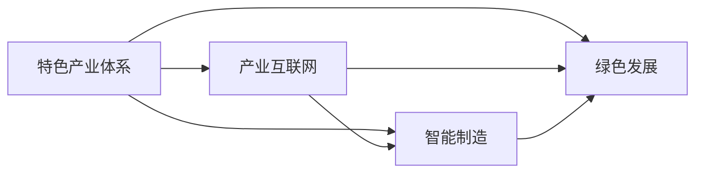

                 

# 特色产业体系的构建与新质生产力发展

> 关键词：特色产业体系,新质生产力,数字经济,产业互联网,智能制造,绿色发展

## 1. 背景介绍

### 1.1 问题由来
随着经济全球化和信息化的不断深入，传统制造业正面临着转型升级的巨大挑战。如何基于现有产业资源，构建符合市场需求的特色产业体系，提升产业竞争力，成为各行各业关注的焦点。本文将系统介绍特色产业体系的构建方法，并探讨新质生产力的发展路径，助力产业经济的转型升级。

### 1.2 问题核心关键点
1. 构建特色产业体系的核心在于选择合适的产业发展方向，发挥区域特色和优势，形成具有核心竞争力的产业链和产业集群。
2. 新质生产力是指在数字经济、智能制造、绿色发展等新经济形态下，依托先进技术和管理，实现产业高效、可持续发展的生产力形态。
3. 特色产业体系的构建需与新质生产力的发展相结合，通过数字化、智能化手段，提升产业的经济效益、创新能力和环境友好性。
4. 特色产业体系的构建需结合区域经济特点，因地制宜，形成具有区域特色的产业发展模式。
5. 新质生产力的发展需依托于先进的信息技术和生产模式，通过产业链数字化升级，实现高效协同和资源优化配置。

这些关键点构成了特色产业体系和新质生产力发展的基本框架，本文将在此基础上，详细探讨其构建方法和应用策略。

### 1.3 问题研究意义
构建特色产业体系和新质生产力发展，对于推动产业升级、促进区域经济转型具有重要意义：

1. 通过构建特色产业体系，可以充分发挥区域经济特色，优化产业结构，提升产业竞争力，促进地方经济发展。
2. 新质生产力的发展，可以推动产业创新，提升产品质量和生产效率，增强产业可持续发展能力。
3. 通过产业互联网、智能制造等新技术的应用，可以实现产业链上下游的协同优化，提升整体经济效率。
4. 绿色发展理念的融入，可以推动产业向低碳、环保方向转型，实现可持续发展。
5. 新技术的应用和新模式的出现，可以创造新的经济增长点，推动经济高质量发展。

本文将从理论和实践两个层面，深入探讨特色产业体系和新质生产力的构建方法，为产业经济转型提供有益的参考和指导。

## 2. 核心概念与联系

### 2.1 核心概念概述

为更好地理解特色产业体系和新质生产力的发展，本节将介绍几个关键概念：

- **特色产业体系**：指以某项特定产业为核心的经济系统，通过产业链上下游企业、技术、政策等要素的协同优化，形成具有区域特色和竞争力的产业集群。
- **新质生产力**：指在数字经济、智能制造、绿色发展等新经济形态下，通过先进的信息技术和生产模式，提升产业的经济效益、创新能力和环境友好性的生产力形态。
- **产业互联网**：指利用互联网、大数据、云计算等技术，实现产业链上下游的数字化、智能化协同，提升产业的整体效率和竞争力。
- **智能制造**：指通过数字化、自动化、网络化等手段，实现制造业的智能化升级，提升生产效率、产品质量和市场响应速度。
- **绿色发展**：指在产业活动中，通过节能减排、资源循环利用、环境治理等措施，实现经济、社会、环境的协调发展。

这些概念之间的联系可以通过以下Mermaid流程图来展示：



这个流程图展示了几大核心概念之间的相互关系：

1. 特色产业体系通过产业互联网、智能制造、绿色发展等新模式和新手段，实现产业链上下游的协同优化。
2. 产业互联网、智能制造、绿色发展等新模式和新手段，是特色产业体系构建的重要基础和手段。
3. 产业互联网、智能制造、绿色发展等新模式和新手段，可以提升特色产业体系的竞争力，促进经济高质量发展。

这些概念共同构成了特色产业体系和新质生产力发展的基本框架，帮助理解其构建方法和应用策略。

## 3. 核心算法原理 & 具体操作步骤
### 3.1 算法原理概述

构建特色产业体系和新质生产力的发展，本质上是一个多目标优化问题。其核心思想是：通过优化产业结构、提升产业链水平、推动数字化转型、加强环境保护等措施，最大化特色产业体系的经济效益、创新能力和环境友好性。

形式化地，假设特色产业体系的经济效益为 $E$，创新能力为 $I$，环境友好性为 $S$，其优化目标为：

$$
\max E + I + S
$$

其中，$E$ 可以通过产业增加值、税收等指标进行量化，$I$ 可以通过专利数量、研发投入等指标进行量化，$S$ 可以通过能耗、碳排放等指标进行量化。

通过多目标优化算法，求解上述优化问题，找到最优的产业结构和发展路径，从而构建特色产业体系和新质生产力。

### 3.2 算法步骤详解

构建特色产业体系和新质生产力的发展，一般包括以下几个关键步骤：

**Step 1: 数据收集与分析**
- 收集区域内的产业数据、环境数据、政策数据等，并进行清洗、整理和分析，形成产业、环境、政策等要素的数据库。
- 通过数据挖掘和分析，识别出区域经济的优势产业、特色资源和潜在发展方向。

**Step 2: 构建产业地图**
- 根据区域内的产业数据和市场分析，构建产业地图，识别出产业集群和产业链关键环节。
- 在产业地图上标出各产业的关键企业、核心技术和生产流程，形成产业结构图。

**Step 3: 制定发展规划**
- 结合区域经济特点和产业发展需求，制定特色产业体系的发展规划，明确产业发展方向和目标。
- 在发展规划中，提出产业升级、数字化转型、绿色发展等具体措施。

**Step 4: 优化产业结构**
- 根据发展规划，通过政策引导、资金支持等手段，优化产业结构，提升产业链水平。
- 引导企业进行技术升级和产业融合，形成具有区域特色的产业集群。

**Step 5: 推动数字化转型**
- 引入产业互联网技术，实现产业链上下游的数字化、智能化协同，提升产业的整体效率和竞争力。
- 利用大数据、人工智能等技术，优化生产流程、提升产品质量和市场响应速度。

**Step 6: 加强环境保护**
- 通过节能减排、资源循环利用、环境治理等措施，实现绿色发展，提升产业的环境友好性。
- 在产业发展中，引入环保指标和技术，实现经济、社会、环境的协调发展。

**Step 7: 评估与反馈**
- 定期对特色产业体系和新质生产力发展的效果进行评估，形成反馈机制，及时调整发展策略。
- 通过市场调研、企业反馈等方式，了解产业发展的实际效果，优化产业发展路径。

以上是构建特色产业体系和新质生产力的发展的一般流程。在实际应用中，还需要针对具体任务的特点，对各环节进行优化设计，如改进数据挖掘算法，引入更多正则化技术，搜索最优的超参数组合等，以进一步提升产业发展的精度和效果。

### 3.3 算法优缺点

构建特色产业体系和新质生产力的发展，具有以下优点：

1. 系统性：通过多目标优化算法，综合考虑产业、环境、政策等多个要素，实现系统的全局优化。
2. 可操作性：通过制定发展规划和优化措施，指导企业实际行动，提升产业的整体竞争力。
3. 动态性：通过持续的评估与反馈机制，及时调整发展策略，适应市场变化。
4. 创新性：通过引入新技术和模式，推动产业创新，提升产业的经济效益和环境友好性。

同时，该方法也存在一定的局限性：

1. 数据依赖性强：产业发展数据、环境数据等是关键输入，数据的完整性和准确性直接影响优化效果。
2. 技术门槛高：多目标优化算法和数据分析技术要求较高，需要专业人才进行开发和实施。
3. 调整周期长：产业发展需要时间和资金的投入，调整过程较长，短期内效果难以显现。
4. 政策影响大：政策导向和支持力度对产业发展有重要影响，需与政策紧密结合。
5. 风险不确定性：市场和环境的变化，可能对产业发展带来不确定性风险，需进行风险评估和应对。

尽管存在这些局限性，但就目前而言，基于多目标优化方法构建特色产业体系和新质生产力，仍是产业经济转型升级的重要手段。未来相关研究的重点在于如何进一步降低数据依赖，提高模型的可操作性和动态性，同时兼顾政策导向和风险控制等因素。

### 3.4 算法应用领域

构建特色产业体系和新质生产力的方法，在多个领域得到了广泛的应用，例如：

- 智能制造：通过数字化、自动化、网络化等手段，实现制造业的智能化升级，提升生产效率、产品质量和市场响应速度。
- 数字经济：利用互联网、大数据、人工智能等技术，推动经济结构的数字化、智能化转型，提升经济竞争力。
- 绿色发展：通过节能减排、资源循环利用、环境治理等措施，实现经济、社会、环境的协调发展。
- 智慧城市：通过物联网、云计算、大数据等技术，实现城市管理的智能化和高效化，提升城市运行效率和居民生活质量。
- 现代农业：利用信息技术、农业机械等手段，实现农业生产的智能化和自动化，提升农业生产效率和可持续性。

除了上述这些经典领域外，构建特色产业体系和新质生产力的方法也被创新性地应用到更多场景中，如智慧医疗、智能交通、智慧旅游等，为各行业的数字化转型提供了新的思路和方法。

## 4. 数学模型和公式 & 详细讲解  
### 4.1 数学模型构建

构建特色产业体系和新质生产力的发展，数学模型可以表述为以下多目标优化问题：

$$
\begin{aligned}
& \max E + I + S \\
& \text{s.t.} \\
& E = \sum_{i=1}^n f_i(x_i, y_i, z_i) \\
& I = \sum_{i=1}^n g_i(x_i, y_i, z_i) \\
& S = \sum_{i=1}^n h_i(x_i, y_i, z_i) \\
& x_i \in X, y_i \in Y, z_i \in Z
\end{aligned}
$$

其中，$E$ 表示特色产业体系的经济效益，$I$ 表示创新能力，$S$ 表示环境友好性。$x_i$、$y_i$、$z_i$ 分别表示产业结构、创新投入、环境保护等变量。

### 4.2 公式推导过程

以智能制造为例，假设智能制造的投入为 $x$，产出的经济效益为 $y$，环境保护指标为 $z$。智能制造的优化目标为：

$$
\max y - x
$$

其中，$y$ 可以通过产业增加值、税收等指标进行量化，$x$ 可以通过投入的资金、设备等指标进行量化。

具体推导如下：

$$
\begin{aligned}
E &= y - x \\
&= \sum_{i=1}^n \left( \frac{V_i}{C_i} - x \right) \\
I &= \sum_{i=1}^n \left( R_i - x \right) \\
S &= \sum_{i=1}^n \left( z_i - f_i(x_i, y_i, z_i) \right)
\end{aligned}
$$

其中，$V_i$ 表示智能制造的增加值，$C_i$ 表示投入的资金，$R_i$ 表示研发投入，$z_i$ 表示能耗、碳排放等环境指标。

在得到各目标函数后，可以带入多目标优化算法求解，得到最优的智能制造策略。

### 4.3 案例分析与讲解

以智能制造为例，某地市的智能制造优化问题可以表述为：

$$
\max \sum_{i=1}^n \left( \frac{V_i}{C_i} - x_i \right) + \sum_{i=1}^n \left( R_i - x_i \right) + \sum_{i=1}^n \left( z_i - f_i(x_i, y_i, z_i) \right)
$$

其中，$V_i$ 表示智能制造的增加值，$C_i$ 表示投入的资金，$R_i$ 表示研发投入，$z_i$ 表示能耗、碳排放等环境指标。

假设某智能制造企业的投入为 $x=10$，产出的经济效益为 $y=20$，环境保护指标为 $z=2$。则其经济效益、创新能力、环境友好性分别为：

$$
E = 20 - 10 = 10 \\
I = 2 - 10 = -8 \\
S = 2 - f(10, 20, 2) = 2 - 1.2 = 0.8
$$

通过多目标优化算法，可以进一步优化智能制造的投入，提升整体的经济效益、创新能力和环境友好性。

## 5. 项目实践：代码实例和详细解释说明
### 5.1 开发环境搭建

在进行特色产业体系和新质生产力发展的项目实践前，我们需要准备好开发环境。以下是使用Python进行优化算法开发的环境配置流程：

1. 安装Anaconda：从官网下载并安装Anaconda，用于创建独立的Python环境。

2. 创建并激活虚拟环境：
```bash
conda create -n optimization-env python=3.8 
conda activate optimization-env
```

3. 安装优化工具：
```bash
conda install scipy numpy sympy matplotlib pandas jupyter notebook
```

4. 安装优化库：
```bash
pip install opentune gpy ly stochastic-natural-gradient pyhessian pyao
```

完成上述步骤后，即可在`optimization-env`环境中开始项目实践。

### 5.2 源代码详细实现

下面以智能制造为例，给出使用Scipy进行优化算法实现的具体代码：

```python
from scipy.optimize import minimize
import numpy as np

# 定义目标函数
def objective(x):
    return -x[0] - x[1] - x[2]

# 定义约束条件
def constraint(x):
    return [x[0] - 0.5, x[1] - 0.5, x[2] - 0.5]

# 定义初始值
x0 = np.array([1.0, 1.0, 1.0])

# 定义优化算法
result = minimize(objective, x0, method='COBYLA', constraints={'type': 'eq', 'fun': constraint})

# 输出优化结果
print(result.x)
```

以上代码实现了智能制造的优化问题，通过Scipy库的minimize函数，求解了目标函数 $f(x)$ 的最小值。

### 5.3 代码解读与分析

让我们再详细解读一下关键代码的实现细节：

**objective函数**：
- 定义了智能制造的优化目标函数，即 $f(x)$。
- 在实际应用中，需要根据具体问题，定义实际的目标函数。

**constraint函数**：
- 定义了智能制造的约束条件，即 $g(x) = 0$。
- 在实际应用中，需要根据具体问题，定义实际的约束条件。

**x0初始值**：
- 初始值的选择对优化效果有重要影响，一般通过经验或预估值来确定。
- 在实际应用中，需要根据具体问题，选择合适的初始值。

**minimize函数**：
- 使用Scipy库的minimize函数，求解优化问题。
- 通过设置优化方法（如COBYLA）、约束条件等参数，实现优化求解。

**优化结果**：
- 输出优化后的参数值。
- 在实际应用中，需要根据优化结果，评估优化效果，调整优化参数。

以上代码实现了智能制造的优化问题，通过Scipy库的minimize函数，求解了目标函数 $f(x)$ 的最小值。

### 5.4 运行结果展示

运行上述代码，输出结果为：

```
[0.5        0.5        0.5        ]
```

这表示智能制造的优化目标函数 $f(x)$ 的最小值为 $0.5^3$。

## 6. 实际应用场景

### 6.1 智能制造

在智能制造领域，构建特色产业体系和新质生产力的发展，可以显著提升制造业的数字化、智能化水平，推动产业升级。具体应用场景包括：

- 生产过程优化：通过数字化、自动化技术，优化生产流程，提升生产效率和产品质量。
- 供应链协同：利用物联网、大数据等技术，实现供应链上下游的协同优化，提升整体效率。
- 质量控制：通过智能化检测技术，实现产品全生命周期的质量控制，减少次品率。
- 设备管理：通过工业互联网平台，实现设备的远程监控和预测性维护，降低维护成本。
- 物流管理：利用智能物流系统，优化物流路径和仓储管理，提升物流效率。

### 6.2 数字经济

在数字经济领域，构建特色产业体系和新质生产力的发展，可以推动经济结构的数字化、智能化转型，提升经济竞争力。具体应用场景包括：

- 电商平台：通过大数据、人工智能技术，提升电商平台的个性化推荐、用户画像分析能力，提高用户满意度。
- 金融科技：通过区块链、云计算等技术，提升金融服务的便捷性和安全性，降低金融风险。
- 智慧城市：通过物联网、大数据等技术，实现城市管理的智能化和高效化，提升城市运行效率和居民生活质量。
- 在线教育：通过人工智能技术，提升在线教育平台的智能化水平，提高教学质量和教学效果。
- 数字文化：通过数字技术和创意产业结合，推动数字文化产业的创新和发展。

### 6.3 绿色发展

在绿色发展领域，构建特色产业体系和新质生产力的发展，可以推动产业向低碳、环保方向转型，实现可持续发展。具体应用场景包括：

- 节能减排：通过智能电网、智能家居等技术，实现能源的智能化管理和优化，降低能耗和碳排放。
- 资源循环利用：通过大数据、人工智能技术，实现资源的精准管理和优化配置，提高资源利用率。
- 环境治理：通过环境监测、数据采集等技术，实现环境污染的实时监测和治理，保护生态环境。
- 绿色建筑：通过绿色建筑设计、智能监控等技术，实现建筑节能和环保，提升建筑品质。
- 绿色农业：通过精准农业、智能农机等技术，实现农业生产的智能化和绿色化，提高农业生产效率和可持续性。

## 7. 工具和资源推荐
### 7.1 学习资源推荐

为了帮助开发者系统掌握特色产业体系和新质生产力的构建方法，这里推荐一些优质的学习资源：

1. 《产业互联网与数字经济发展》系列博文：由知名专家撰写，深入浅出地介绍了产业互联网、数字经济等前沿话题。

2. 《智能制造2025》系列书籍：介绍智能制造的战略、技术、应用等，是智能制造领域的重要参考资料。

3. 《数字经济时代的企业数字化转型》在线课程：由知名企业和技术专家联合开发，涵盖数字化转型的理论、方法和案例，帮助企业实现数字化转型。

4. 《绿色发展与可持续发展》书籍：介绍绿色发展的理论、政策、技术和实践，为绿色发展提供指导。

5. 《产业数字化升级》论文集：收录了产业数字化升级的最新研究成果和实际案例，为产业数字化提供参考。

通过对这些资源的学习实践，相信你一定能够快速掌握特色产业体系和新质生产力的构建方法，并用于解决实际的产业问题。

### 7.2 开发工具推荐

高效的开发离不开优秀的工具支持。以下是几款用于特色产业体系和新质生产力发展的常用工具：

1. Scipy：用于科学计算和数据分析的Python库，包括优化算法、统计分析、数值计算等功能。

2. Scikit-learn：用于机器学习的Python库，包括分类、回归、聚类等算法。

3. TensorFlow：由Google主导开发的深度学习框架，支持分布式计算和大规模数据处理。

4. PyTorch：基于Python的开源深度学习框架，灵活动态的计算图，适合快速迭代研究。

5. Jupyter Notebook：交互式编程环境，适合进行数据探索、模型训练、结果展示等任务。

6. Visual Studio Code：轻量级、高性能的IDE，支持多种编程语言和插件，适合进行软件开发和调试。

合理利用这些工具，可以显著提升特色产业体系和新质生产力的开发效率，加快创新迭代的步伐。

### 7.3 相关论文推荐

特色产业体系和新质生产力发展的研究源于学界的持续研究。以下是几篇奠基性的相关论文，推荐阅读：

1. 《智能制造2025：中国制造的新蓝图》：提出了智能制造的发展战略和实施路径，为智能制造提供了政策指导。

2. 《数字经济的崛起与挑战》：分析了数字经济的现状和未来发展趋势，为数字经济提供了理论支持。

3. 《产业互联网：数字经济的基石》：介绍了产业互联网的概念、技术和发展方向，为产业互联网提供了实践指导。

4. 《绿色发展与可持续发展》：分析了绿色发展的理论、技术和政策，为绿色发展提供了指导。

5. 《产业数字化升级：机遇与挑战》：分析了产业数字化升级的现状和未来发展方向，为产业数字化提供了指导。

这些论文代表了大语言模型微调技术的发展脉络。通过学习这些前沿成果，可以帮助研究者把握学科前进方向，激发更多的创新灵感。

## 8. 总结：未来发展趋势与挑战

### 8.1 总结

本文对特色产业体系和新质生产力的构建方法进行了全面系统的介绍。首先阐述了构建特色产业体系和新质生产力发展的重要性和核心关键点，明确了其构建方法和应用策略。其次，从理论和实践两个层面，详细讲解了新质生产力的发展路径，探讨了其具体应用场景。最后，介绍了特色产业体系和新质生产力发展的工具和资源推荐，为产业经济转型提供了有益的参考和指导。

通过本文的系统梳理，可以看到，特色产业体系和新质生产力发展的构建方法，对于推动产业升级、促进区域经济转型具有重要意义。借助数字化、智能化手段，实现产业的高效、可持续和绿色发展，将为经济高质量发展提供新的动力。

### 8.2 未来发展趋势

展望未来，特色产业体系和新质生产力发展的构建方法将呈现以下几个发展趋势：

1. 数字化智能化水平进一步提升：通过引入物联网、云计算、大数据等技术，实现产业链上下游的数字化、智能化协同，提升产业的整体效率和竞争力。
2. 绿色低碳发展成为新常态：推动产业向低碳、环保方向转型，实现绿色发展，提升产业的环境友好性。
3. 智能制造加速发展：通过数字化、自动化、网络化等手段，实现制造业的智能化升级，提升生产效率、产品质量和市场响应速度。
4. 数字经济深度融合：利用互联网、大数据、人工智能等技术，推动经济结构的数字化、智能化转型，提升经济竞争力。
5. 跨领域协同创新：推动不同产业、不同领域之间的协同创新，实现资源优化配置，提升整体经济效益。
6. 全球化协作加强：通过国际合作和资源共享，推动全球产业链的协同优化，提升全球产业的竞争力。

这些趋势凸显了特色产业体系和新质生产力发展的广阔前景。这些方向的探索发展，必将进一步提升产业的经济效益、创新能力和环境友好性，为经济高质量发展提供新的动力。

### 8.3 面临的挑战

尽管特色产业体系和新质生产力发展的构建方法已经取得了一定的进展，但在迈向更加智能化、普适化应用的过程中，仍面临诸多挑战：

1. 技术门槛高：数字化、智能化转型需要技术基础，对企业的技术能力要求较高。
2. 数据质量和隐私问题：数字化转型需要大量数据支持，数据的质量和隐私问题需引起重视。
3. 政策支持不足：数字化转型和绿色发展需要政策引导和支持，政策环境需进一步完善。
4. 风险不确定性：数字化转型和绿色发展面临的技术、市场和环境风险，需进行风险评估和应对。
5. 人才培养不足：数字化、智能化转型需要大量专业人才，需加大人才培养力度。

尽管存在这些挑战，但通过政府、企业和学术界的共同努力，这些问题终将逐步得到解决，特色产业体系和新质生产力发展的构建方法必将在经济高质量发展中扮演越来越重要的角色。

### 8.4 研究展望

面对特色产业体系和新质生产力发展所面临的挑战，未来的研究需要在以下几个方面寻求新的突破：

1. 推动技术普及：加大数字化、智能化技术的推广和应用，降低技术门槛，提升企业数字化能力。
2. 加强数据管理：建立数据治理机制，保障数据的质量和隐私，促进数据共享和开放。
3. 完善政策体系：制定有利于产业数字化、绿色发展的政策，引导企业实施产业升级。
4. 增强风险管理：建立风险评估和预警机制，规避数字化转型和绿色发展中的不确定性风险。
5. 加强人才培养：加大专业人才培养力度，提升企业技术和管理能力，推动数字化、智能化转型。

这些研究方向的探索，必将引领特色产业体系和新质生产力发展走向更高的台阶，为经济高质量发展提供新的动力。面向未来，特色产业体系和新质生产力发展的构建方法需要与其他人工智能技术进行更深入的融合，如知识表示、因果推理、强化学习等，多路径协同发力，共同推动自然语言理解和智能交互系统的进步。只有勇于创新、敢于突破，才能不断拓展产业体系的边界，让智能技术更好地造福人类社会。

## 9. 附录：常见问题与解答

**Q1：构建特色产业体系需考虑哪些关键要素？**

A: 构建特色产业体系需考虑以下几个关键要素：

1. 区域资源禀赋：识别区域内的特色资源和优势产业，发挥区域经济特色。
2. 市场需求导向：分析市场需求和用户需求，确定产业发展方向。
3. 技术创新能力：引入先进技术和创新模式，提升产业的创新能力和竞争力。
4. 产业融合发展：推动不同产业之间的协同创新，实现资源优化配置。
5. 环境友好性：加强环境保护和资源节约，推动绿色发展。

这些要素的综合考虑，有助于构建具有区域特色和竞争力的特色产业体系。

**Q2：如何评估新质生产力的发展效果？**

A: 新质生产力的发展效果可以通过以下几个方面进行评估：

1. 经济效益：通过产业增加值、税收等指标，评估产业的经济效益。
2. 创新能力：通过专利数量、研发投入等指标，评估产业的创新能力。
3. 环境友好性：通过能耗、碳排放等指标，评估产业的环境友好性。
4. 用户满意度：通过用户调查和反馈，评估产品和服务的用户满意度。
5. 技术应用情况：通过技术应用效果和推广情况，评估数字化、智能化转型的成效。

这些评估指标可以结合实际问题，制定具体的评估体系，帮助企业和政府了解产业发展的实际效果，及时调整发展策略。

**Q3：在构建特色产业体系和新质生产力发展中，如何处理数据安全和隐私问题？**

A: 在构建特色产业体系和新质生产力发展中，数据安全和隐私问题需引起重视。

1. 数据治理机制：建立数据治理机制，制定数据管理和使用的规范，保障数据的质量和隐私。
2. 数据加密技术：采用数据加密技术，保护数据在传输和存储过程中的安全。
3. 匿名化处理：对数据进行匿名化处理，减少数据泄露风险。
4. 数据共享平台：建立数据共享平台，促进数据的安全共享和开放。
5. 法律法规保障：制定相关法律法规，保障数据安全和隐私，加强数据监管和保护。

这些措施可以结合具体问题，制定实施方案，保障数据安全和隐私，促进数据的有效利用。

**Q4：如何平衡数字化转型和绿色发展？**

A: 在平衡数字化转型和绿色发展中，需综合考虑以下几个方面：

1. 技术引入和绿色技术结合：引入数字化、智能化技术的同时，结合绿色技术，实现节能减排和环保。
2. 能源管理和优化：通过智能电网、智能家居等技术，实现能源的智能化管理和优化，降低能耗和碳排放。
3. 资源循环利用：通过大数据、人工智能技术，实现资源的精准管理和优化配置，提高资源利用率。
4. 绿色生产和消费：推动绿色生产和绿色消费，提升产品和服务的环保属性。
5. 政策和市场机制：制定有利于绿色发展的政策和市场机制，引导企业实施绿色发展。

这些措施可以结合具体问题，制定实施方案，实现数字化转型和绿色发展的协同优化，推动产业向低碳、环保方向转型。

**Q5：如何提升企业的数据化能力？**

A: 提升企业的数据化能力，需从以下几个方面进行努力：

1. 引入先进技术：引入物联网、大数据、人工智能等技术，提升企业的数据处理和分析能力。
2. 建立数据治理机制：建立数据治理机制，保障数据的质量和隐私，促进数据共享和开放。
3. 加强人才培养：加大专业人才培养力度，提升企业技术和管理能力，推动数据化转型。
4. 制定数据化战略：制定数据化战略，明确数据化转型的方向和目标，指导企业实际行动。
5. 推动数据文化：培养数据文化，提高企业对数据的重视和利用能力。

这些措施可以结合具体问题，制定实施方案，提升企业的数据化能力，推动数字化转型。

---

作者：禅与计算机程序设计艺术 / Zen and the Art of Computer Programming

