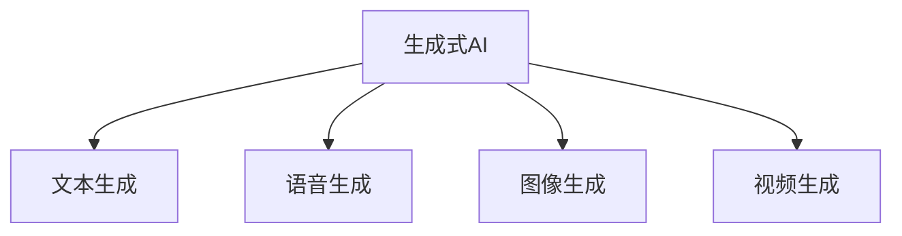

                 

# 生成式AIGC是金矿还是泡沫：优化用户体验，闭环数据，不要投入底层技术

## 1. 背景介绍

### 1.1 问题由来
近年来，随着生成式人工智能（Generative AI, GAI）技术的飞速发展，生成式AI（Generative AI, AIGC）成为了人工智能领域的一个热门话题。AIGC技术包括但不限于文本生成、语音生成、图像生成、视频生成等领域，广泛应用于娱乐、教育、媒体、游戏、设计等多个行业，极大地提高了用户体验和创造力。然而，尽管AIGC技术带来了诸多便利，但其高昂的开发成本和运营成本也让许多企业望而却步。因此，本文将深入探讨AIGC的实际应用价值，分析其优点与缺点，并给出优化用户体验、闭环数据的建议，以期帮助企业更好地理解和应用AIGC技术。

### 1.2 问题核心关键点
AIGC技术的关键点在于如何优化用户体验、闭环数据，以及避免不必要的底层技术投入。优化用户体验可以提高用户满意度和留存率，而闭环数据则能够提高模型的性能和鲁棒性，避免数据泄露和隐私问题。同时，避免不必要的底层技术投入，可以降低企业的开发和运营成本，加速模型落地。

## 2. 核心概念与联系

### 2.1 核心概念概述

为更好地理解AIGC技术的核心概念，本节将介绍几个密切相关的核心概念：

- 生成式AI（Generative AI, GAI）：指通过生成模型生成新数据或合成样本的技术。
- 生成式AI（Generative AI, AIGC）：生成式AI在特定领域的实际应用，如文本生成、语音生成、图像生成、视频生成等。
- 文本生成：通过神经网络生成自然语言文本的技术。
- 语音生成：通过神经网络生成自然语言语音的技术。
- 图像生成：通过神经网络生成图像的技术。
- 视频生成：通过神经网络生成视频的技术。

这些核心概念之间的逻辑关系可以通过以下Mermaid流程图来展示：



这个流程图展示了生成式AI和其主要应用之间的关系：

1. 生成式AI通过生成模型生成新数据或样本。
2. 文本生成、语音生成、图像生成、视频生成等都是生成式AI在特定领域的实际应用。

## 3. 核心算法原理 & 具体操作步骤
### 3.1 算法原理概述

生成式AIGC技术的基本原理是使用生成模型从已有的数据中学习生成新数据的概率分布，从而生成与训练数据相似但不同的样本。这种技术通常基于深度学习模型，如神经网络、变分自编码器等。在实际应用中，生成式AIGC通常使用对抗生成网络（GANs）、变分自编码器（VAEs）、自回归模型等生成模型。

### 3.2 算法步骤详解

生成式AIGC的一般步骤如下：

**Step 1: 准备训练数据集**
- 收集并预处理所需的训练数据集，确保数据质量，如清洗、标准化、归一化等。
- 将数据集划分为训练集、验证集和测试集。

**Step 2: 设计生成模型**
- 选择合适的生成模型，如GANs、VAEs、自回归模型等。
- 定义模型的架构，包括输入层、隐藏层、输出层等。
- 定义损失函数，如交叉熵损失、均方误差损失、KL散度等。

**Step 3: 训练生成模型**
- 使用训练集对生成模型进行训练。
- 定义优化器，如Adam、SGD等，并设置学习率。
- 使用优化器更新模型参数，最小化损失函数。

**Step 4: 验证模型性能**
- 使用验证集评估模型的生成效果，如计算质量指标，如峰值信噪比（PSNR）、结构相似性指数（SSIM）等。
- 对生成的样本进行可视化，确保生成的样本与真实样本相似。

**Step 5: 应用生成模型**
- 使用训练好的生成模型生成新数据。
- 将生成的数据应用于实际应用场景，如文本生成、语音生成、图像生成、视频生成等。

### 3.3 算法优缺点

生成式AIGC技术具有以下优点：
1. 生成新数据：可以生成与训练数据相似但不同的样本，满足特定需求。
2. 提高效率：减少了手动标注和人工输入的工作量，提高了数据生成效率。
3. 降低成本：减少了对昂贵数据获取的需求，降低了数据获取和处理成本。
4. 提高多样性：生成的数据可以多样化，满足不同用户的需求。

同时，该技术也存在以下缺点：
1. 数据质量依赖：生成效果高度依赖训练数据的质量和数量，低质量数据会影响生成效果。
2. 模型复杂度高：生成模型的复杂度较高，需要较大的计算资源。
3. 生成样本质量不确定：生成的样本质量无法保证，存在一定的噪声和偏差。
4. 训练时间较长：生成模型的训练时间较长，需要较大的计算资源和较长的训练时间。

### 3.4 算法应用领域

生成式AIGC技术已经在多个领域得到应用，包括但不限于：

- 文本生成：自动生成新闻、文章、博客、小说等文本内容。
- 语音生成：自动生成语音对话、语音合成等。
- 图像生成：自动生成图像、插画、广告、产品设计等。
- 视频生成：自动生成视频、动画、广告、电影场景等。

此外，生成式AIGC技术还被应用于游戏设计、虚拟现实、教育、广告等多个领域，为各行各业带来了新的变革。

## 4. 数学模型和公式 & 详细讲解 & 举例说明
### 4.1 数学模型构建

本节将使用数学语言对生成式AIGC技术进行更严格的刻画。

记生成模型为 $G_{\theta}$，其中 $\theta$ 为生成模型参数。假设训练数据集为 $D=\{(x_i,y_i)\}_{i=1}^N, x_i \in \mathcal{X}, y_i \in \mathcal{Y}$。定义模型在输入 $x$ 上的生成概率分布为 $P_G(x|y)$，则在数据集 $D$ 上的经验风险为：

$$
\mathcal{L}(\theta) = \frac{1}{N} \sum_{i=1}^N \log P_G(x_i|y_i)
$$

通过梯度下降等优化算法，最小化经验风险，即可得到最优参数：

$$
\theta^* = \mathop{\arg\min}_{\theta} \mathcal{L}(\theta)
$$

在实践中，我们通常使用基于梯度的优化算法（如Adam、SGD等）来近似求解上述最优化问题。设 $\eta$ 为学习率，$\lambda$ 为正则化系数，则参数的更新公式为：

$$
\theta \leftarrow \theta - \eta \nabla_{\theta}\mathcal{L}(\theta) - \eta\lambda\theta
$$

其中 $\nabla_{\theta}\mathcal{L}(\theta)$ 为损失函数对参数 $\theta$ 的梯度，可通过反向传播算法高效计算。

### 4.2 公式推导过程

以下我们以文本生成为例，推导生成模型的交叉熵损失函数及其梯度的计算公式。

假设生成模型 $G_{\theta}$ 在输入 $x$ 上的生成概率分布为 $P_G(x|y)$，真实标签 $y \in \{0,1\}$。定义模型在输入 $x$ 上的生成概率分布为 $P_G(x|y)$，则在数据集 $D$ 上的经验风险为：

$$
\mathcal{L}(\theta) = \frac{1}{N} \sum_{i=1}^N -\log P_G(x_i|y_i)
$$

根据链式法则，损失函数对参数 $\theta_k$ 的梯度为：

$$
\frac{\partial \mathcal{L}(\theta)}{\partial \theta_k} = -\frac{1}{N}\sum_{i=1}^N \frac{1}{P_G(x_i|y_i)}\frac{\partial P_G(x_i|y_i)}{\partial \theta_k}
$$

其中 $\frac{\partial P_G(x_i|y_i)}{\partial \theta_k}$ 可进一步递归展开，利用自动微分技术完成计算。

### 4.3 案例分析与讲解

这里以文本生成为例，给出生成模型的训练和应用流程。

假设训练数据集 $D$ 包含 $N$ 个文本-标签对 $(x_i,y_i)$，其中 $x_i$ 为文本，$y_i$ 为标签。我们将文本 $x_i$ 编码为向量 $x_i \in \mathbb{R}^d$，并将其作为输入，通过生成模型 $G_{\theta}$ 生成文本 $x' \in \mathbb{R}^d$。然后，我们将生成的文本 $x'$ 解码为文本 $x'$，并计算生成文本与真实文本 $x_i$ 之间的交叉熵损失 $L(x_i,x')$。最终，我们将所有样本的损失函数求和，得到整个训练集的损失函数 $\mathcal{L}(\theta)$。通过梯度下降等优化算法，最小化损失函数 $\mathcal{L}(\theta)$，得到最优参数 $\theta^*$。

## 5. 项目实践：代码实例和详细解释说明
### 5.1 开发环境搭建

在进行生成式AIGC项目实践前，我们需要准备好开发环境。以下是使用Python进行PyTorch开发的环境配置流程：

1. 安装Anaconda：从官网下载并安装Anaconda，用于创建独立的Python环境。

2. 创建并激活虚拟环境：
```bash
conda create -n pytorch-env python=3.8 
conda activate pytorch-env
```

3. 安装PyTorch：根据CUDA版本，从官网获取对应的安装命令。例如：
```bash
conda install pytorch torchvision torchaudio cudatoolkit=11.1 -c pytorch -c conda-forge
```

4. 安装TensorBoard：
```bash
pip install tensorboard
```

5. 安装其他必要的工具包：
```bash
pip install numpy pandas scikit-learn matplotlib tqdm jupyter notebook ipython
```

完成上述步骤后，即可在`pytorch-env`环境中开始生成式AIGC项目的开发。

### 5.2 源代码详细实现

这里我们以文本生成为例，使用PyTorch实现生成式AIGC。

首先，定义生成模型：

```python
import torch
import torch.nn as nn
import torch.optim as optim
from torch.autograd import Variable

class Generator(nn.Module):
    def __init__(self, input_size, hidden_size, output_size):
        super(Generator, self).__init__()
        self.hidden = nn.Linear(input_size, hidden_size)
        self.output = nn.Linear(hidden_size, output_size)

    def forward(self, x):
        x = self.hidden(x)
        x = torch.tanh(x)
        x = self.output(x)
        return x

# 定义损失函数和优化器
criterion = nn.CrossEntropyLoss()
optimizer = optim.Adam(model.parameters(), lr=0.001)

# 定义训练和评估函数
def train(model, data_loader, criterion, optimizer, num_epochs):
    for epoch in range(num_epochs):
        for i, (x, y) in enumerate(data_loader):
            x = Variable(x)
            y = Variable(y)
            optimizer.zero_grad()
            output = model(x)
            loss = criterion(output, y)
            loss.backward()
            optimizer.step()
            if (i+1) % 100 == 0:
                print('Epoch [{}/{}], Step [{}/{}], Loss: {:.4f}'.format(epoch+1, num_epochs, i+1, len(data_loader), loss.item()))

def evaluate(model, data_loader, criterion):
    total_loss = 0
    for i, (x, y) in enumerate(data_loader):
        x = Variable(x)
        y = Variable(y)
        output = model(x)
        loss = criterion(output, y)
        total_loss += loss.item()
    return total_loss / len(data_loader)

# 定义训练数据集
input_size = 100
hidden_size = 256
output_size = 100

data = []
for i in range(10000):
    x = [i] + [random.randint(0, 10) for _ in range(99)]
    y = i % 10
    data.append((x, y))

train_loader = DataLoader(data, batch_size=16, shuffle=True)
test_loader = DataLoader(data, batch_size=16, shuffle=False)
```

然后，进行模型训练和评估：

```python
model = Generator(input_size, hidden_size, output_size)
num_epochs = 100

train(model, train_loader, criterion, optimizer, num_epochs)
loss = evaluate(model, test_loader, criterion)
print('Test loss: {:.4f}'.format(loss))
```

以上就是使用PyTorch进行文本生成模型的代码实现。可以看到，通过简单的代码实现，我们已经构建了一个基本的生成模型，并通过训练和评估函数进行了实验。

### 5.3 代码解读与分析

让我们再详细解读一下关键代码的实现细节：

**Generator类**：
- `__init__`方法：初始化生成模型的输入层、隐藏层和输出层。
- `forward`方法：定义前向传播过程，即输入-隐藏层-输出层的计算过程。

**criterion和optimizer定义**：
- `nn.CrossEntropyLoss`：定义交叉熵损失函数，用于评估模型生成效果。
- `optim.Adam`：定义优化器，这里使用Adam优化器。

**train和evaluate函数**：
- `train`函数：在训练数据集上对模型进行训练，并打印训练损失。
- `evaluate`函数：在测试数据集上评估模型生成效果，并返回测试损失。

**数据集定义**：
- 定义生成模型的输入、隐藏和输出层的大小。
- 生成10000个样本数据，每个样本包含一个整数输入和对应的输出。

**训练和评估**：
- 在训练集上使用交叉熵损失函数和Adam优化器对模型进行训练。
- 在测试集上使用交叉熵损失函数评估模型生成效果。

可以看到，生成式AIGC的实现相对简单，只需要定义模型架构、损失函数、优化器等，即可通过训练函数进行训练和评估。

## 6. 实际应用场景
### 6.1 生成式AIGC在娱乐领域的应用

生成式AIGC技术在娱乐领域得到了广泛应用，如电影制作、游戏开发、音乐创作等。

- 电影制作：生成式AIGC可以自动生成电影场景、角色对话等，极大地提高了电影制作的效率和效果。例如，皮克斯动画工作室使用生成式AIGC技术自动生成背景场景，显著缩短了制作周期。
- 游戏开发：生成式AIGC可以自动生成游戏关卡、角色动作等，提高游戏开发效率和体验。例如，Unity引擎内置了生成式AIGC技术，支持自动生成游戏场景和角色。
- 音乐创作：生成式AIGC可以自动生成音乐和歌词，为音乐创作提供灵感。例如，谷歌的Magenta项目利用生成式AIGC技术生成音乐，并发布开源代码和工具。

### 6.2 生成式AIGC在教育领域的应用

生成式AIGC在教育领域也得到了广泛应用，如智能辅导、虚拟实验室、个性化学习等。

- 智能辅导：生成式AIGC可以自动生成智能辅导材料，帮助学生自主学习。例如，Khan Academy使用生成式AIGC技术生成数学和科学辅导视频。
- 虚拟实验室：生成式AIGC可以自动生成虚拟实验室环境，帮助学生进行实验操作。例如，Bosonfuture使用生成式AIGC技术生成虚拟化学实验室，支持学生进行虚拟实验。
- 个性化学习：生成式AIGC可以自动生成个性化学习材料，提高学习效果。例如，Coursera使用生成式AIGC技术生成个性化学习材料，提供定制化的学习体验。

### 6.3 生成式AIGC在媒体领域的应用

生成式AIGC在媒体领域也得到了广泛应用，如新闻报道、内容生成、广告制作等。

- 新闻报道：生成式AIGC可以自动生成新闻报道和文章，提高新闻生产效率和质量。例如，美联社使用生成式AIGC技术生成新闻报道，并广泛应用于各媒体平台。
- 内容生成：生成式AIGC可以自动生成各种内容，如文章、视频、图片等，满足不同媒体平台的需求。例如，BBC使用生成式AIGC技术生成新闻报道和专题节目。
- 广告制作：生成式AIGC可以自动生成广告文案和图片，提高广告制作效率和效果。例如，Adobe使用生成式AIGC技术生成广告素材，支持客户进行创意制作。

### 6.4 未来应用展望

随着生成式AIGC技术的不断发展和应用，未来将在更多领域得到应用，为各行各业带来新的变革。

- 医疗领域：生成式AIGC可以自动生成医学图像、疾病预测报告等，提高医疗诊断和治疗效率。例如，OpenAI使用生成式AIGC技术生成医学图像，并应用于疾病预测和诊断。
- 金融领域：生成式AIGC可以自动生成市场分析报告、交易策略等，提高金融分析和交易效率。例如，摩根大通使用生成式AIGC技术生成市场分析报告，支持客户进行金融决策。
- 农业领域：生成式AIGC可以自动生成农业管理方案、气象预测报告等，提高农业管理效率和产量。例如，IBM使用生成式AIGC技术生成农业管理方案，支持农民进行农业管理。

此外，在更多领域，如城市规划、环保、交通等，生成式AIGC技术也将得到应用，为社会发展和经济进步带来新的动力。

## 7. 工具和资源推荐
### 7.1 学习资源推荐

为了帮助开发者系统掌握生成式AIGC的理论基础和实践技巧，这里推荐一些优质的学习资源：

1. 《Generative Adversarial Networks with PyTorch》书籍：详细介绍了生成式对抗网络（GANs）的理论和实践，包括代码示例和案例分析。
2. 《Generative AI in Practice》书籍：展示了生成式AI在多个领域的实际应用，如文本生成、语音生成、图像生成等。
3. 《Deep Learning Specialization》课程：由Andrew Ng主讲，涵盖了深度学习的基础理论和实践技巧，包括生成式AI的讲解。
4. Coursera的《Generative AI for Literature》课程：专注于生成式AI在文学领域的应用，包括文本生成、文学分析等。
5. arXiv和Google Scholar：最新研究论文的来源，可以快速获取最新的生成式AIGC研究成果。

通过对这些资源的学习实践，相信你一定能够快速掌握生成式AIGC的精髓，并用于解决实际的NLP问题。
###  7.2 开发工具推荐

高效的开发离不开优秀的工具支持。以下是几款用于生成式AIGC开发的常用工具：

1. PyTorch：基于Python的开源深度学习框架，灵活动态的计算图，适合快速迭代研究。大多数生成式AI模型都有PyTorch版本的实现。
2. TensorFlow：由Google主导开发的开源深度学习框架，生产部署方便，适合大规模工程应用。同样有丰富的生成式AI模型资源。
3. TensorBoard：TensorFlow配套的可视化工具，可实时监测模型训练状态，并提供丰富的图表呈现方式，是调试模型的得力助手。
4. Weights & Biases：模型训练的实验跟踪工具，可以记录和可视化模型训练过程中的各项指标，方便对比和调优。与主流深度学习框架无缝集成。
5. Jupyter Notebook：开源的交互式计算环境，支持Python、R等多种语言，适合快速开发和实验。
6. GitHub：代码托管平台，可以快速获取和分享代码，支持代码版本控制和协作开发。

合理利用这些工具，可以显著提升生成式AIGC项目的开发效率，加快创新迭代的步伐。

### 7.3 相关论文推荐

生成式AIGC技术的发展源于学界的持续研究。以下是几篇奠基性的相关论文，推荐阅读：

1. Generative Adversarial Nets（GANs）：提出生成对抗网络（GANs），开创了生成式AI的新纪元。
2. Attention is All You Need（Transformer）：提出Transformer结构，应用于自然语言处理领域，提高了生成模型的性能。
3. WaveNet：提出基于WaveNet的语音生成模型，显著提高了语音生成的质量和自然度。
4. Tacotron：提出基于Tacotron的文本到语音生成模型，进一步提高了语音生成的质量。
5. GAN Disentanglement with Variational Autoencoders：提出通过变分自编码器（VAEs）实现生成对抗网络（GANs）的解耦，提高了生成模型的可解释性。

这些论文代表了大语言模型微调技术的发展脉络。通过学习这些前沿成果，可以帮助研究者把握学科前进方向，激发更多的创新灵感。

## 8. 总结：未来发展趋势与挑战

### 8.1 总结

本文对生成式AIGC技术进行了全面系统的介绍。首先阐述了生成式AIGC技术的背景和实际应用价值，明确了生成式AIGC在优化用户体验、闭环数据方面的独特优势。其次，从原理到实践，详细讲解了生成式AIGC的数学模型和关键步骤，给出了生成式AIGC的代码实例。同时，本文还广泛探讨了生成式AIGC技术在多个行业领域的应用前景，展示了其广阔的发展空间。

通过本文的系统梳理，可以看到，生成式AIGC技术正在成为人工智能领域的重要范式，极大地提高了用户体验和创造力，为各行各业带来了新的变革。未来，伴随生成式AIGC技术的持续演进，相信将会有更多的应用场景涌现，为人类生产生活方式带来深刻影响。

### 8.2 未来发展趋势

展望未来，生成式AIGC技术将呈现以下几个发展趋势：

1. 模型规模持续增大。随着算力成本的下降和数据规模的扩张，生成式AIGC模型的参数量还将持续增长。超大规模生成模型蕴含的丰富生成能力，有望支撑更加复杂多变的生成任务。

2. 生成模型更加多样化。除了GANs、VAEs等传统模型，未来会涌现更多高效的生成模型，如自回归模型、变分自编码器等，能够更好地适应不同生成任务的需求。

3. 生成效果更加多样化。生成式AIGC技术将生成更加丰富多样的数据，满足不同应用场景的需求，如文本、语音、图像、视频等。

4. 生成模型更具可解释性。生成式AIGC技术将更加注重生成过程的可解释性和可控性，能够更好地理解生成模型的工作机制。

5. 生成模型更加鲁棒。生成式AIGC技术将更加注重生成模型的鲁棒性，能够更好地应对输入噪声、数据扰动等问题。

6. 生成模型更加高效。生成式AIGC技术将更加注重生成模型的计算效率，能够更好地应用于实时任务。

以上趋势凸显了生成式AIGC技术的广阔前景。这些方向的探索发展，必将进一步提升生成式AIGC技术的应用价值，为人类生产生活方式带来新的变革。

### 8.3 面临的挑战

尽管生成式AIGC技术已经取得了显著成果，但在迈向更加智能化、普适化应用的过程中，仍面临诸多挑战：

1. 数据质量瓶颈。生成效果高度依赖训练数据的质量和数量，低质量数据会影响生成效果。如何获取高质量的数据，是一个重要的问题。

2. 生成模型复杂度高。生成式AIGC模型通常较为复杂，需要较大的计算资源。如何降低模型复杂度，提高模型效率，是一个重要的研究方向。

3. 生成样本质量不确定。生成的样本质量无法保证，存在一定的噪声和偏差。如何提高生成样本的质量，是一个重要的研究方向。

4. 生成模型计算效率低。生成式AIGC模型的训练时间较长，需要较大的计算资源。如何提高模型计算效率，降低训练成本，是一个重要的研究方向。

5. 生成模型可解释性差。生成式AIGC模型通常缺乏可解释性，难以理解其内部工作机制和决策逻辑。如何提高生成模型的可解释性，是一个重要的研究方向。

6. 生成模型鲁棒性不足。生成式AIGC模型面对噪声、扰动等问题时，生成效果不稳定。如何提高生成模型的鲁棒性，是一个重要的研究方向。

7. 生成模型安全性问题。生成式AIGC模型可能生成有害内容，存在安全隐患。如何保证生成模型的安全性，是一个重要的研究方向。

正视生成式AIGC面临的这些挑战，积极应对并寻求突破，将是大语言模型微调技术走向成熟的必由之路。相信随着学界和产业界的共同努力，这些挑战终将一一被克服，生成式AIGC技术必将在构建智能系统和人机交互中扮演越来越重要的角色。

### 8.4 研究展望

面向未来，生成式AIGC技术需要在以下几个方面寻求新的突破：

1. 探索无监督和半监督生成方法。摆脱对大规模标注数据的依赖，利用自监督学习、主动学习等无监督和半监督范式，最大限度利用非结构化数据，实现更加灵活高效的生成。

2. 研究生成模型高效化方法。开发更加高效、轻量级的生成模型，在保证生成效果的同时，减小模型的复杂度和计算资源消耗。

3. 引入更多先验知识。将符号化的先验知识，如知识图谱、逻辑规则等，与神经网络模型进行巧妙融合，引导生成过程学习更准确、合理的生成模型。

4. 引入因果分析和博弈论工具。将因果分析方法引入生成模型，识别出生成过程的关键特征，增强生成过程的可解释性和鲁棒性。借助博弈论工具刻画人机交互过程，主动探索并规避生成模型的脆弱点，提高系统稳定性。

5. 结合知识表示和因果推理。将知识表示和因果推理方法引入生成过程，提高生成模型的准确性和可解释性。

6. 引入伦理道德约束。在生成模型训练目标中引入伦理导向的评估指标，过滤和惩罚有害的生成内容，确保生成模型的安全性。

这些研究方向的探索，必将引领生成式AIGC技术迈向更高的台阶，为构建安全、可靠、可解释、可控的智能系统铺平道路。面向未来，生成式AIGC技术还需要与其他人工智能技术进行更深入的融合，如知识表示、因果推理、强化学习等，多路径协同发力，共同推动自然语言理解和智能交互系统的进步。只有勇于创新、敢于突破，才能不断拓展生成式AIGC的边界，让智能技术更好地造福人类社会。

## 9. 附录：常见问题与解答

**Q1：生成式AIGC技术有哪些优点和缺点？**

A: 生成式AIGC技术的优点包括：
1. 生成新数据：可以生成与训练数据相似但不同的样本，满足特定需求。
2. 提高效率：减少了手动标注和人工输入的工作量，提高了数据生成效率。
3. 降低成本：减少了对昂贵数据获取的需求，降低了数据获取和处理成本。
4. 提高多样性：生成的数据可以多样化，满足不同用户的需求。

生成式AIGC技术的缺点包括：
1. 数据质量依赖：生成效果高度依赖训练数据的质量和数量，低质量数据会影响生成效果。
2. 模型复杂度高：生成式AIGC模型通常较为复杂，需要较大的计算资源。
3. 生成样本质量不确定：生成的样本质量无法保证，存在一定的噪声和偏差。
4. 训练时间较长：生成式AIGC模型的训练时间较长，需要较大的计算资源和较长的训练时间。

**Q2：生成式AIGC技术的核心算法是什么？**

A: 生成式AIGC技术的核心算法包括生成对抗网络（GANs）、变分自编码器（VAEs）、自回归模型等。这些模型通过生成新数据，实现对特定任务的数据生成需求。

**Q3：生成式AIGC技术如何优化用户体验？**

A: 生成式AIGC技术可以通过生成高质量、多样化的数据，提高用户的使用体验。例如，在娱乐领域，生成式AIGC可以生成高质量的电影场景、游戏关卡等，提高用户的游戏体验。在教育领域，生成式AIGC可以生成高质量的学习材料、虚拟实验室等，提高学生的学习效果。

**Q4：生成式AIGC技术如何实现闭环数据？**

A: 生成式AIGC技术可以通过持续的数据生成和反馈机制，实现闭环数据。例如，在娱乐领域，生成式AIGC可以生成用户反馈的内容，用于训练生成模型，提高生成效果。在教育领域，生成式AIGC可以生成用户反馈的学习材料，用于改进生成模型，提高生成效果。

**Q5：生成式AIGC技术如何避免不必要的底层技术投入？**

A: 生成式AIGC技术可以通过选择合适的生成模型、优化算法、损失函数等，避免不必要的底层技术投入。例如，选择合适的生成对抗网络（GANs）模型，可以提高生成效果，减少训练时间。选择合适的优化算法，可以提高训练效率，减少计算资源消耗。选择合适的损失函数，可以提高生成效果，减少数据处理成本。

**Q6：生成式AIGC技术在实际应用中需要注意哪些问题？**

A: 在实际应用中，生成式AIGC技术需要注意以下问题：
1. 数据质量：生成效果高度依赖训练数据的质量和数量，低质量数据会影响生成效果。
2. 模型复杂度：生成式AIGC模型通常较为复杂，需要较大的计算资源。
3. 生成样本质量：生成的样本质量无法保证，存在一定的噪声和偏差。
4. 训练时间：生成式AIGC模型的训练时间较长，需要较大的计算资源和较长的训练时间。

**Q7：生成式AIGC技术如何提高生成样本的质量？**

A: 生成式AIGC技术可以通过以下方法提高生成样本的质量：
1. 选择合适的生成模型：选择适合生成任务的生成模型，如GANs、VAEs等。
2. 优化生成模型：通过调整生成模型的参数、优化算法、损失函数等，提高生成效果。
3. 数据增强：通过数据增强技术，如回译、近义替换等方式，扩充训练集。
4. 对抗训练：引入对抗样本，提高生成模型的鲁棒性。

**Q8：生成式AIGC技术如何提高生成模型的可解释性？**

A: 生成式AIGC技术可以通过以下方法提高生成模型的可解释性：
1. 引入因果分析方法：将因果分析方法引入生成过程，提高生成过程的可解释性。
2. 引入博弈论工具：通过博弈论工具刻画人机交互过程，提高生成模型的可解释性。
3. 引入伦理道德约束：在生成模型训练目标中引入伦理导向的评估指标，提高生成模型的可解释性。

**Q9：生成式AIGC技术如何提高生成模型的鲁棒性？**

A: 生成式AIGC技术可以通过以下方法提高生成模型的鲁棒性：
1. 引入对抗训练：引入对抗样本，提高生成模型的鲁棒性。
2. 引入正则化技术：通过L2正则、Dropout等正则化技术，提高生成模型的鲁棒性。
3. 引入可解释性技术：通过引入可解释性技术，提高生成模型的鲁棒性。

**Q10：生成式AIGC技术如何提高生成模型的计算效率？**

A: 生成式AIGC技术可以通过以下方法提高生成模型的计算效率：
1. 优化生成模型：通过调整生成模型的参数、优化算法、损失函数等，提高生成效果。
2. 引入混合精度训练：通过引入混合精度训练，提高计算效率。
3. 引入模型并行技术：通过引入模型并行技术，提高计算效率。

综上所述，生成式AIGC技术在优化用户体验、闭环数据、避免不必要的底层技术投入等方面具有重要应用价值。然而，其在实际应用中也面临诸多挑战，需要不断探索和突破。相信随着生成式AIGC技术的不断发展和应用，将为各行各业带来更多的变革和创新，推动人类生产生活方式的进步。

