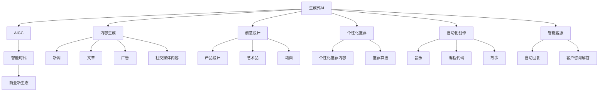

                 

# 生成式AIGC：智能时代的商业新生态

> 关键词：生成式AI, AIGC, 智能时代, 商业新生态, 创造力, 自动化, 个性化, 协同创新

## 1. 背景介绍

### 1.1 问题由来
近年来，人工智能(AI)技术迎来了飞速发展，深度学习、自然语言处理(NLP)、计算机视觉(CV)等领域取得了一系列重大突破。特别是生成式AI技术的兴起，推动了生成对抗网络(GAN)、变分自编码器(VAE)、自回归模型(如GPT系列)的广泛应用。

生成式AI的核心在于模型能够生成逼真的文本、图像、音频等数据，并在此基础上进行语义理解、自然语言处理、图像生成、自动化创作等任务。生成式AI技术的应用，正在迅速改变各个行业的工作方式，推动智能时代到来。

在商业领域，生成式AI技术带来了前所未有的创新机遇。企业可以利用生成式AI技术，自动化生成广告、内容、产品设计、客户服务等，提升效率、降低成本，实现智能化转型。本文将深入探讨生成式AI在商业生态中的作用，及其带来的机遇与挑战。

### 1.2 问题核心关键点
生成式AI技术通过对海量数据的训练，学习到数据分布的统计规律，能够在不需要明确指令的情况下，生成符合特定规则或风格的数据。这一特性使其在内容生成、智能创作、产品设计等场景中具备了独特的优势。

生成式AI的应用领域广泛，包括但不限于以下方面：
1. **内容生成**：生成新闻、文章、广告、社交媒体内容等。
2. **创意设计**：生成产品设计、艺术品、动画等。
3. **个性化推荐**：根据用户行为和偏好生成个性化推荐内容。
4. **自动化创作**：生成音乐、编程代码、故事等。
5. **智能客服**：生成自动回复、客户咨询解答等。

这些应用场景展示了生成式AI在商业生态中的巨大潜力。但与此同时，也带来了一些亟待解决的挑战，如数据隐私保护、模型公平性、知识产权问题等。

## 2. 核心概念与联系

### 2.1 核心概念概述

为了更好地理解生成式AI技术，本节将介绍几个密切相关的核心概念：

- **生成式AI (Generative AI)**：通过模型学习数据分布，生成新的、逼真的样本数据。常见的生成模型包括GAN、VAE、自回归模型等。
- **AIGC (Artificial Intelligence Generated Content)**：基于生成式AI技术生成的人工智能内容，涵盖文本、图像、音频等多个领域。
- **智能时代 (Intelligent Era)**：人工智能技术全面渗透到各个行业，带来自动化、智能化转型的新时代。
- **商业新生态 (Commercial New Ecosystem)**：生成式AI技术在商业应用中催生的新模式、新业态和新产业。

这些核心概念之间存在紧密的联系，共同构成了生成式AI技术在商业生态中的基础框架。

### 2.2 核心概念原理和架构的 Mermaid 流程图(Mermaid 流程节点中不要有括号、逗号等特殊字符)



这个流程图展示了生成式AI技术在各个应用场景中的作用，及其对商业生态的深远影响。

## 3. 核心算法原理 & 具体操作步骤
### 3.1 算法原理概述

生成式AI的核心在于模型能够生成新的、逼真的数据样本。通常，生成式模型分为参数化生成模型和非参数化生成模型两大类。其中，参数化生成模型包括自回归模型、变分自编码器等，非参数化生成模型则以GAN为代表。

自回归模型通过序列生成的方式，逐个生成数据序列中的元素。其核心思想是通过已知数据点的条件概率，预测下一个数据点的分布，并以此递归生成整个序列。自回归模型的典型代表包括GPT系列和RNN等。

变分自编码器通过学习数据的隐含表示，生成新的数据样本。其核心思想是将数据映射到一个低维空间，并在这个空间中进行采样，生成与原始数据相似的新数据。变分自编码器的典型代表包括VAE和I-WAE等。

GAN则通过对抗训练的方式，学习生成器和判别器的优化策略，生成逼真的假数据。其核心思想是将数据生成过程分解为两个对抗的过程：生成器尝试生成逼真的假数据，判别器则尝试区分真实数据和假数据。GAN的典型代表包括DCGAN和CycleGAN等。

### 3.2 算法步骤详解

生成式AI模型的训练步骤一般包括以下几个关键步骤：

1. **数据准备**：收集并清洗数据，划分训练集、验证集和测试集。

2. **模型选择**：根据应用场景选择合适的生成模型，如自回归模型、变分自编码器或GAN等。

3. **模型搭建**：根据选择的生成模型，搭建模型架构，并进行超参数设置。

4. **模型训练**：使用训练集对模型进行优化，通过反向传播算法更新模型参数。

5. **模型评估**：在验证集上评估模型性能，调整超参数和模型架构，以提升模型效果。

6. **模型应用**：在测试集上测试模型效果，将模型应用到实际场景中。

以GAN为例，具体步骤详解如下：

1. **生成器训练**：将噪声向量作为输入，生成逼真的假数据，并优化生成器的损失函数。

2. **判别器训练**：将真实数据和假数据作为输入，分别输出真实标签和假标签，并优化判别器的损失函数。

3. **对抗训练**：交替训练生成器和判别器，使得生成器生成的数据能够欺骗判别器，同时判别器能够准确区分真实数据和假数据。

4. **模型优化**：通过不断迭代训练，优化生成器和判别器，使得生成器能够生成更逼真的数据。

5. **模型应用**：将训练好的生成器模型应用到实际任务中，如生成图像、文本等。

### 3.3 算法优缺点

生成式AI技术具有以下优点：
1. **高效生成**：生成式AI能够快速生成大量高质量的样本数据，降低了数据标注成本。
2. **多样性**：生成式AI能够生成多种风格和形式的数据，满足不同应用场景的需求。
3. **个性化**：生成式AI能够根据用户偏好生成个性化推荐内容，提升用户体验。
4. **自动化**：生成式AI能够自动化生成内容，减少人力投入，提升效率。

但同时，生成式AI技术也存在以下缺点：
1. **数据隐私**：生成式AI需要大量数据进行训练，可能涉及用户隐私保护问题。
2. **模型公平性**：生成式AI模型可能存在偏见和歧视，需要额外的公平性约束。
3. **知识产权**：生成式AI生成的内容可能涉及知识产权问题，需要合理的版权归属。
4. **真实性问题**：生成式AI生成的内容可能缺乏真实性，需要额外验证。

### 3.4 算法应用领域

生成式AI技术在各个领域都有广泛的应用，主要包括以下几个方面：

1. **内容生成**：生成新闻、文章、广告、社交媒体内容等。

2. **创意设计**：生成产品设计、艺术品、动画等。

3. **个性化推荐**：根据用户行为和偏好生成个性化推荐内容。

4. **自动化创作**：生成音乐、编程代码、故事等。

5. **智能客服**：生成自动回复、客户咨询解答等。

6. **虚拟仿真**：生成虚拟场景、角色等，用于游戏、培训等。

7. **自动生成代码**：生成自动化测试用例、编程代码等。

8. **智能设计**：生成建筑设计、服装设计等。

这些应用领域展示了生成式AI技术在商业生态中的广泛应用，推动了各行各业的智能化转型。

## 4. 数学模型和公式 & 详细讲解 & 举例说明

### 4.1 数学模型构建

生成式AI模型的数学模型可以由以下几个部分构成：

- **输入层**：将输入数据转换为模型可以处理的向量形式。
- **隐藏层**：通过神经网络的多层计算，学习数据的特征表示。
- **输出层**：根据隐藏层的特征表示，生成新的数据样本。

以GAN为例，其数学模型可以表示为：

- **生成器**：将噪声向量 $\mathbf{z}$ 映射到数据空间 $\mathbf{x}$，表示为 $G(\mathbf{z})$。
- **判别器**：将数据 $\mathbf{x}$ 分类为真实数据和假数据，表示为 $D(\mathbf{x})$。

生成器生成假数据 $\mathbf{x}$ 的过程可以表示为：

$$
\mathbf{x} = G(\mathbf{z})
$$

判别器对数据 $\mathbf{x}$ 进行分类，输出真实标签 $y$ 的过程可以表示为：

$$
y = D(\mathbf{x})
$$

生成器和判别器的损失函数可以分别表示为：

$$
\mathcal{L}_G = \mathbb{E}_{\mathbf{z}}[\log D(G(\mathbf{z}))]
$$

$$
\mathcal{L}_D = \mathbb{E}_{\mathbf{x}}[\log D(\mathbf{x})] + \mathbb{E}_{\mathbf{z}}[\log (1 - D(G(\mathbf{z})))
$$

其中，$\mathbb{E}$ 表示期望值，$\mathbf{z}$ 表示噪声向量，$\mathbf{x}$ 表示生成器生成的假数据。

### 4.2 公式推导过程

GAN的训练过程可以分成两个步骤：

1. **生成器训练**：将噪声向量 $\mathbf{z}$ 作为输入，通过生成器 $G$ 生成假数据 $\mathbf{x}$。

2. **判别器训练**：将真实数据 $\mathbf{x}$ 和假数据 $\mathbf{x}$ 作为输入，通过判别器 $D$ 进行分类。

生成器训练的过程可以表示为：

$$
\mathbf{x} = G(\mathbf{z})
$$

判别器训练的过程可以表示为：

$$
y = D(\mathbf{x})
$$

生成器和判别器的损失函数可以分别表示为：

$$
\mathcal{L}_G = \mathbb{E}_{\mathbf{z}}[\log D(G(\mathbf{z}))]
$$

$$
\mathcal{L}_D = \mathbb{E}_{\mathbf{x}}[\log D(\mathbf{x})] + \mathbb{E}_{\mathbf{z}}[\log (1 - D(G(\mathbf{z})))
$$

在训练过程中，生成器和判别器交替进行，通过对抗训练的方式，优化生成器和判别器。

### 4.3 案例分析与讲解

以GAN生成图像为例，具体的训练流程如下：

1. **数据准备**：收集并清洗图像数据，划分训练集、验证集和测试集。

2. **模型选择**：选择DCGAN模型，搭建生成器和判别器。

3. **模型搭建**：根据DCGAN模型，搭建生成器和判别器的网络结构，并进行超参数设置。

4. **模型训练**：使用训练集对生成器和判别器进行优化，通过反向传播算法更新模型参数。

5. **模型评估**：在验证集上评估生成器的生成效果，调整超参数和模型架构，以提升模型效果。

6. **模型应用**：在测试集上测试生成器的生成效果，将生成器应用到实际任务中。

## 5. 项目实践：代码实例和详细解释说明

### 5.1 开发环境搭建

在进行生成式AI项目实践前，我们需要准备好开发环境。以下是使用Python进行TensorFlow开发的Python环境配置流程：

1. 安装Anaconda：从官网下载并安装Anaconda，用于创建独立的Python环境。

2. 创建并激活虚拟环境：
```bash
conda create -n tensorflow-env python=3.8 
conda activate tensorflow-env
```

3. 安装TensorFlow：根据CUDA版本，从官网获取对应的安装命令。例如：
```bash
conda install tensorflow -c conda-forge
```

4. 安装TensorFlow addons库：
```bash
pip install tensorflow-addons
```

5. 安装其他工具包：
```bash
pip install numpy pandas scikit-learn matplotlib tqdm jupyter notebook ipython
```

完成上述步骤后，即可在`tensorflow-env`环境中开始生成式AI实践。

### 5.2 源代码详细实现

这里我们以GAN生成图像为例，给出使用TensorFlow实现GAN模型的代码实现。

首先，定义GAN的生成器和判别器：

```python
import tensorflow as tf
from tensorflow.keras import layers

class Generator(tf.keras.Model):
    def __init__(self):
        super(Generator, self).__init__()
        self.dense1 = layers.Dense(256, input_dim=100)
        self.dense2 = layers.Dense(256)
        self.dense3 = layers.Dense(784, activation='tanh')
    
    def call(self, inputs):
        x = tf.keras.layers.Dense(256)(self.dense1(inputs))
        x = tf.keras.layers.BatchNormalization()(x)
        x = tf.keras.layers.LeakyReLU()(x)
        x = tf.keras.layers.Dense(256)(self.dense2(x))
        x = tf.keras.layers.BatchNormalization()(x)
        x = tf.keras.layers.LeakyReLU()(x)
        x = self.dense3(x)
        return x

class Discriminator(tf.keras.Model):
    def __init__(self):
        super(Discriminator, self).__init__()
        self.dense1 = layers.Dense(256, input_dim=784)
        self.dense2 = layers.Dense(256)
        self.dense3 = layers.Dense(1, activation='sigmoid')
    
    def call(self, inputs):
        x = self.dense1(inputs)
        x = tf.keras.layers.BatchNormalization()(x)
        x = tf.keras.layers.LeakyReLU()(x)
        x = self.dense2(x)
        x = tf.keras.layers.BatchNormalization()(x)
        x = tf.keras.layers.LeakyReLU()(x)
        x = self.dense3(x)
        return x
```

接着，定义GAN的损失函数和优化器：

```python
class GAN(tf.keras.Model):
    def __init__(self):
        super(GAN, self).__init__()
        self.gen = Generator()
        self.dis = Discriminator()
    
    def call(self, inputs):
        z = self.gen(inputs)
        real = self.dis(z)
        fake = self.dis(z)
        return real, fake
    
    def generator_loss(self, real, fake):
        real_loss = self.gen.loss(tf.ones_like(real), real)
        fake_loss = self.gen.loss(tf.zeros_like(real), fake)
        return real_loss + fake_loss
    
    def discriminator_loss(self, real, fake):
        real_loss = self.dis.loss(tf.ones_like(real), real)
        fake_loss = self.dis.loss(tf.zeros_like(real), fake)
        return real_loss + fake_loss
    
    def train_step(self, inputs):
        with tf.GradientTape() as gen_tape, tf.GradientTape() as dis_tape:
            real, fake = self.call(inputs)
            gen_loss = self.generator_loss(real, fake)
            dis_loss = self.discriminator_loss(real, fake)
            grads = gen_tape.gradient(gen_loss, self.gen.trainable_variables)
            grads = dis_tape.gradient(dis_loss, self.dis.trainable_variables)
        self.gen.optimizer.apply_gradients(zip(grads, self.gen.trainable_variables))
        self.dis.optimizer.apply_gradients(zip(grads, self.dis.trainable_variables))
```

最后，启动GAN模型的训练流程：

```python
import numpy as np
from tensorflow.keras.datasets import mnist

(x_train, _), (_, _) = mnist.load_data()
x_train = x_train / 255.0
x_train = x_train.reshape(-1, 784)

def make_random_z(batch_size):
    return np.random.normal(0, 1, (batch_size, 100))

batch_size = 128
num_epochs = 100

generator = GAN()
generator.compile(optimizer=tf.keras.optimizers.Adam(0.0002), loss='sparse_categorical_crossentropy')

for epoch in range(num_epochs):
    real = x_train[np.random.randint(0, x_train.shape[0], batch_size)]
    z = make_random_z(batch_size)
    generator.train_step(tf.reshape(real, (batch_size, 784)))
    
    if (epoch + 1) % 10 == 0:
        z = make_random_z(batch_size)
        fake = generator.call(z)
        print(f'Epoch {epoch + 1}, generator loss: {generator.loss(fake, real)}')
```

以上就是使用TensorFlow实现GAN生成图像的完整代码实现。可以看到，TensorFlow提供了丰富的API和工具，可以方便地搭建和训练生成式AI模型。

### 5.3 代码解读与分析

让我们再详细解读一下关键代码的实现细节：

**GAN类**：
- `__init__`方法：初始化生成器和判别器的参数。
- `call`方法：通过生成器和判别器对输入进行前向传播，生成和判别新的数据。
- `generator_loss`方法：计算生成器的损失函数，包括真实数据和假数据的损失。
- `discriminator_loss`方法：计算判别器的损失函数，包括真实数据和假数据的损失。
- `train_step`方法：计算模型损失并反向传播，更新模型参数。

**数据生成**：
- `make_random_z`方法：生成随机噪声向量，用于输入生成器。
- `x_train`：MNIST手写数字数据集，用于训练生成器。

**训练流程**：
- `batch_size`：定义每个批次的样本数。
- `num_epochs`：定义训练的总轮数。
- `real`：从数据集随机抽取真实数据。
- `z`：生成随机噪声向量。
- `generator.train_step(tf.reshape(real, (batch_size, 784)))`：将真实数据和噪声向量输入生成器，计算损失并更新参数。

可以看到，TensorFlow提供的高效API和丰富的工具，使得生成式AI的模型构建和训练变得简单高效。开发者可以根据具体需求，灵活设计模型架构，进行优化和调试。

## 6. 实际应用场景

### 6.1 智能设计

在智能设计领域，生成式AI技术可以显著提高设计效率和创新能力。设计师可以利用生成式AI生成各种设计草图、设计风格等，激发新的设计灵感。同时，生成式AI还可以自动生成设计方案，辅助设计师进行设计决策。

具体应用场景包括：
1. **产品设计**：生成产品草图、设计风格等，辅助设计师进行设计决策。
2. **建筑设计**：生成建筑设计方案，优化设计效果。
3. **服装设计**：生成服装设计草图、面料搭配等，辅助设计师进行设计决策。

生成式AI在智能设计中的应用，正在逐步改变传统设计流程，推动设计行业向智能化、个性化方向发展。

### 6.2 内容创作

内容创作是生成式AI应用的重要领域。通过生成式AI技术，可以自动化生成新闻、文章、广告、社交媒体内容等，极大地提升了内容创作的效率和质量。

具体应用场景包括：
1. **新闻生成**：自动生成新闻稿件，提高新闻生产效率。
2. **文章创作**：自动生成文章、报告等，提高内容创作效率。
3. **广告生成**：自动生成广告文案、广告素材等，提高广告制作效率。
4. **社交媒体内容**：自动生成社交媒体帖子、评论等，提高内容创作效率。

生成式AI在内容创作中的应用，正在逐步改变内容生产模式，推动媒体行业向智能化、自动化方向发展。

### 6.3 个性化推荐

个性化推荐是生成式AI在电商、视频、音乐等领域的典型应用。通过生成式AI技术，可以生成个性化推荐内容，提升用户体验和满意度。

具体应用场景包括：
1. **电商推荐**：自动生成个性化推荐商品、推荐理由等，提高推荐效果。
2. **视频推荐**：自动生成个性化推荐视频、视频摘要等，提高推荐效果。
3. **音乐推荐**：自动生成个性化推荐歌曲、推荐理由等，提高推荐效果。

生成式AI在个性化推荐中的应用，正在逐步改变推荐算法的设计和实现方式，推动推荐系统向智能化、个性化方向发展。

### 6.4 未来应用展望

随着生成式AI技术的不断进步，未来其在商业生态中的应用将更加广泛和深入。以下是一些未来应用展望：

1. **多模态生成**：生成式AI将逐步融合视觉、语音、文本等多种模态的数据，实现跨模态生成。

2. **情感生成**：生成式AI将生成具有特定情感色彩的文本、音频等，推动情感计算技术的发展。

3. **自适应生成**：生成式AI将能够根据用户反馈和数据变化，动态调整生成策略，实现自适应生成。

4. **虚拟仿真**：生成式AI将生成虚拟场景、角色等，用于游戏、培训等，推动虚拟仿真技术的发展。

5. **自动生成代码**：生成式AI将生成自动化测试用例、编程代码等，推动自动化测试和编程技术的发展。

6. **智能设计**：生成式AI将生成建筑设计、服装设计等，推动设计行业向智能化、个性化方向发展。

以上应用展望展示了生成式AI技术在商业生态中的巨大潜力，未来有望在更多领域得到应用，带来更深刻的变革。

## 7. 工具和资源推荐

### 7.1 学习资源推荐

为了帮助开发者系统掌握生成式AI技术的理论基础和实践技巧，这里推荐一些优质的学习资源：

1. **《Generative Adversarial Networks with TensorFlow》书籍**：详细介绍了GAN的基本原理和TensorFlow实现，适合初学者入门。

2. **《Deep Learning with PyTorch》课程**：由斯坦福大学开设的深度学习课程，涵盖了生成式AI的基本原理和实践方法。

3. **Hugging Face博客**：Hugging Face的博客提供了大量生成式AI的最新研究、应用案例和代码实现。

4. **Google AI Blog**：Google AI博客提供了大量生成式AI的最新研究和应用案例，适合前沿跟踪。

5. **Arxiv预印本**：Arxiv是生成式AI研究的重要来源，定期发布最新的研究论文和报告。

通过对这些资源的学习实践，相信你一定能够快速掌握生成式AI技术的精髓，并用于解决实际的商业问题。

### 7.2 开发工具推荐

高效的开发离不开优秀的工具支持。以下是几款用于生成式AI开发的常用工具：

1. **TensorFlow**：由Google主导开发的开源深度学习框架，生产部署方便，适合大规模工程应用。

2. **PyTorch**：基于Python的开源深度学习框架，灵活动态，适合快速迭代研究。

3. **JAX**：Google开发的深度学习框架，支持自动微分和分布式训练，适用于高性能计算环境。

4. **TensorFlow addons**：TensorFlow的附加库，提供了更多深度学习模型和工具，适合高性能计算。

5. **MXNet**：由亚马逊开发的开源深度学习框架，支持分布式训练和多种硬件平台。

6. **PyTorch Lightning**：基于PyTorch的快速原型开发框架，适合快速搭建和测试模型。

7. **ModelScope**：Hugging Face提供的深度学习模型库，包含大量生成式AI模型，方便快速部署。

合理利用这些工具，可以显著提升生成式AI项目的开发效率，加快创新迭代的步伐。

### 7.3 相关论文推荐

生成式AI技术的发展源于学界的持续研究。以下是几篇奠基性的相关论文，推荐阅读：

1. **Generative Adversarial Nets (GANs)**：Goodfellow等人在2014年提出的GAN，奠定了生成式AI的基础。

2. **Variational Autoencoder (VAE)**：Kingma等人在2014年提出的VAE，提供了生成式AI的另一种方法。

3. **Language Modeling with Generative Adversarial Nets (GANs)**：Bengio等人在2017年提出的语言生成模型，展示了GAN在文本生成中的应用。

4. **Causal Language Models**：OpenAI在2020年提出的GPT系列模型，展示了自回归模型在文本生成中的应用。

5. **Adversarial Machine Learning**：Akhmedov等人在2019年提出的生成式对抗训练方法，展示了生成式AI模型的鲁棒性问题。

这些论文代表了大生成式AI技术的发展脉络。通过学习这些前沿成果，可以帮助研究者把握学科前进方向，激发更多的创新灵感。

## 8. 总结：未来发展趋势与挑战

### 8.1 总结

本文对生成式AI技术在商业生态中的应用进行了全面系统的介绍。首先阐述了生成式AI技术的基本原理和应用场景，明确了生成式AI在商业新生态中的独特价值。其次，从原理到实践，详细讲解了生成式AI的数学模型和训练过程，给出了生成式AI项目开发的完整代码实例。同时，本文还广泛探讨了生成式AI在内容创作、智能设计、个性化推荐等各个领域的应用前景，展示了生成式AI技术的巨大潜力。

通过本文的系统梳理，可以看到，生成式AI技术正在推动各行业的智能化转型，带来前所未有的创新机遇。未来，伴随生成式AI技术的持续演进，生成式AI必将在更多领域得到应用，带来更深刻的变革。

### 8.2 未来发展趋势

展望未来，生成式AI技术将呈现以下几个发展趋势：

1. **多模态生成**：生成式AI将逐步融合视觉、语音、文本等多种模态的数据，实现跨模态生成。

2. **情感生成**：生成式AI将生成具有特定情感色彩的文本、音频等，推动情感计算技术的发展。

3. **自适应生成**：生成式AI将根据用户反馈和数据变化，动态调整生成策略，实现自适应生成。

4. **虚拟仿真**：生成式AI将生成虚拟场景、角色等，用于游戏、培训等，推动虚拟仿真技术的发展。

5. **自动生成代码**：生成式AI将生成自动化测试用例、编程代码等，推动自动化测试和编程技术的发展。

6. **智能设计**：生成式AI将生成建筑设计、服装设计等，推动设计行业向智能化、个性化方向发展。

以上趋势展示了生成式AI技术在商业生态中的巨大潜力，未来有望在更多领域得到应用，带来更深刻的变革。

### 8.3 面临的挑战

尽管生成式AI技术已经取得了瞩目成就，但在迈向更加智能化、普适化应用的过程中，它仍面临着诸多挑战：

1. **数据隐私**：生成式AI需要大量数据进行训练，可能涉及用户隐私保护问题。如何合理处理数据隐私，保障用户权益，是一个重要的挑战。

2. **模型公平性**：生成式AI模型可能存在偏见和歧视，需要额外的公平性约束。如何在模型训练和应用中引入公平性，避免偏见，是未来的研究重点。

3. **知识产权**：生成式AI生成的内容可能涉及知识产权问题，需要合理的版权归属。如何在生成式AI应用中处理版权问题，是未来的研究重点。

4. **真实性问题**：生成式AI生成的内容可能缺乏真实性，需要额外验证。如何在生成式AI应用中保证内容的真实性和可靠性，是一个重要的挑战。

5. **计算资源**：生成式AI模型需要大量的计算资源进行训练和推理，如何提高计算效率，降低计算成本，是未来的研究重点。

6. **可解释性**：生成式AI模型的决策过程通常缺乏可解释性，难以对其推理逻辑进行分析和调试。如何赋予生成式AI模型更强的可解释性，是未来的研究重点。

7. **安全性**：生成式AI生成的内容可能包含有害信息，如何确保内容的安全性，避免恶意用途，是未来的研究重点。

以上挑战需要研究者不断探索和创新，寻找有效的解决方案，才能推动生成式AI技术的健康发展。

### 8.4 研究展望

面对生成式AI所面临的挑战，未来的研究需要在以下几个方面寻求新的突破：

1. **无监督和半监督学习**：摆脱对大量标注数据的依赖，利用无监督和半监督学习范式，最大限度利用非结构化数据，实现更加灵活高效的生成。

2. **参数高效和计算高效**：开发更加参数高效和计算高效的生成模型，在固定大部分预训练参数的同时，只更新极少量的任务相关参数。

3. **多模态数据融合**：将视觉、语音、文本等多种模态的数据进行融合，实现跨模态生成，提升生成内容的质量和多样性。

4. **因果推断和对比学习**：引入因果推断和对比学习思想，增强生成式AI模型的稳定性和泛化能力。

5. **知识图谱融合**：将知识图谱与生成式AI模型进行融合，引导模型生成更准确、合理的知识表示。

6. **生成式AI与知识表示的结合**：将知识图谱、逻辑规则等专家知识与生成式AI模型进行结合，提升生成内容的准确性和实用性。

7. **生成式AI与强化学习的结合**：将生成式AI与强化学习结合，提高生成式AI模型的自动化和适应性。

8. **生成式AI与对抗学习的结合**：将生成式AI与对抗学习结合，提高生成式AI模型的鲁棒性和安全性。

这些研究方向展示了生成式AI技术的未来发展方向，有望推动生成式AI技术迈向更高的台阶，为构建安全、可靠、可解释、可控的智能系统铺平道路。

## 9. 附录：常见问题与解答

**Q1: 生成式AI技术对数据隐私有什么影响？**

A: 生成式AI需要大量的数据进行训练，这可能涉及到用户隐私保护问题。为了保护数据隐私，可以采用以下方法：

1. 数据匿名化：对数据进行去标识化处理，保证用户无法通过数据识别出具体个人。

2. 差分隐私：在数据收集和处理过程中，加入噪声，确保数据分布的相似性，保护用户隐私。

3. 联邦学习：将模型训练分散到多个设备或服务器上进行，仅共享模型参数，保护数据隐私。

4. 数据加密：在数据传输和存储过程中，使用加密技术保护数据隐私。

通过合理处理数据隐私问题，可以在利用生成式AI技术进行生成和创作的同时，保护用户的隐私权益。

**Q2: 生成式AI技术如何保证生成内容的真实性？**

A: 生成式AI生成的内容可能缺乏真实性，这需要通过以下方法来保证：

1. 多模态融合：将文本、视觉、音频等多种模态的数据进行融合，提高内容的真实性。

2. 语义验证：通过自然语言处理技术，对生成内容进行语义验证，确保内容符合语言规范和逻辑。

3. 知识图谱融合：将生成内容与知识图谱进行结合，提高内容的准确性和可靠性。

4. 人类干预：在生成内容的关键环节引入人类干预，确保内容的真实性和可信度。

通过这些方法，可以在生成式AI应用中保证生成内容的真实性和可靠性。

**Q3: 生成式AI技术在实际应用中面临哪些挑战？**

A: 生成式AI技术在实际应用中面临以下挑战：

1. 数据隐私问题：生成式AI需要大量数据进行训练，可能涉及用户隐私保护问题。

2. 模型公平性问题：生成式AI模型可能存在偏见和歧视，需要额外的公平性约束。

3. 知识产权问题：生成式AI生成的内容可能涉及版权问题，需要合理的版权归属。

4. 真实性问题：生成式AI生成的内容可能缺乏真实性，需要额外验证。

5. 计算资源问题：生成式AI模型需要大量的计算资源进行训练和推理，如何提高计算效率，降低计算成本，是未来的研究重点。

6. 可解释性问题：生成式AI模型的决策过程通常缺乏可解释性，难以对其推理逻辑进行分析和调试。

7. 安全性问题：生成式AI生成的内容可能包含有害信息，如何确保内容的安全性，避免恶意用途，是未来的研究重点。

这些挑战需要研究者不断探索和创新，寻找有效的解决方案，才能推动生成式AI技术的健康发展。

**Q4: 生成式AI技术在未来有哪些潜在应用场景？**

A: 生成式AI技术在未来有许多潜在的应用场景，包括但不限于以下几个方面：

1. 多模态生成：生成式AI将逐步融合视觉、语音、文本等多种模态的数据，实现跨模态生成。

2. 情感生成：生成式AI将生成具有特定情感色彩的文本、音频等，推动情感计算技术的发展。

3. 自适应生成：生成式AI将根据用户反馈和数据变化，动态调整生成策略，实现自适应生成。

4. 虚拟仿真：生成式AI将生成虚拟场景、角色等，用于游戏、培训等，推动虚拟仿真技术的发展。

5. 自动生成代码：生成式AI将生成自动化测试用例、编程代码等，推动自动化测试和编程技术的发展。

6. 智能设计：生成式AI将生成建筑设计、服装设计等，推动设计行业向智能化、个性化方向发展。

以上应用展望展示了生成式AI技术在商业生态中的巨大潜力，未来有望在更多领域得到应用，带来更深刻的变革。

**Q5: 如何处理生成式AI技术中的偏见和歧视问题？**

A: 生成式AI模型可能存在偏见和歧视，可以通过以下方法进行处理：

1. 数据清洗：在数据收集和处理过程中，去除带有偏见和歧视的数据，确保数据的多样性和公正性。

2. 模型公平性约束：在模型训练过程中，引入公平性约束，确保模型不产生偏见和歧视。

3. 对抗训练：通过对抗训练的方式，提高生成式AI模型的鲁棒性，减少偏见和歧视的影响。

4. 人类干预：在生成内容的关键环节引入人类干预，确保内容的公平性和公正性。

5. 多样性生成：通过多样性生成策略，生成多种风格和形式的内容，避免单一风格的偏见和歧视。

通过这些方法，可以在生成式AI应用中有效处理偏见和歧视问题，确保模型的公平性和公正性。

---

作者：禅与计算机程序设计艺术 / Zen and the Art of Computer Programming

