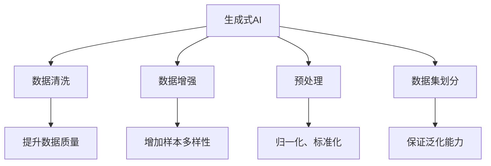

                 

## 1. 背景介绍

生成式AI作为当前人工智能领域的一个热门话题，其潜在价值巨大，同时也引发了关于其是否是“金矿”还是“泡沫”的广泛讨论。本文将从数据的角度出发，探讨生成式AI的潜力与局限，旨在为读者提供一个全面的视角。

### 1.1 数据在生成式AI中的重要性

生成式AI的核心在于模型的训练，而数据则是训练的基础。高质量、多样化的数据集不仅能提升模型的泛化能力，还能确保模型在不同场景下的一致性和可靠性。但现实中，数据往往面临获取难度大、标注成本高、质量参差不齐等问题，这些问题直接影响了生成式AI的实际应用效果。

### 1.2 数据质量与生成式AI的性能

生成式AI模型的性能高度依赖于数据的质量。如果数据存在偏差、噪声或不一致，模型训练出的结果也可能偏离预期。因此，数据清洗、预处理和增强成为提高生成式AI性能的关键环节。本文将详细探讨这些技术如何提升数据质量，从而优化生成式AI的效果。

### 1.3 数据在生成式AI中的应用场景

生成式AI在图像生成、文本生成、音频生成等多个领域展现出卓越的性能。这些应用场景中，数据的作用至关重要。高质量的数据能够使生成式AI模型在这些领域中实现更精准、更自然的生成效果。

## 2. 核心概念与联系

### 2.1 核心概念概述

为了更好地理解生成式AI与数据的关系，本节将介绍几个关键概念：

- 生成式AI（Generative AI）：利用深度学习模型生成新的数据样本，如图片、文本、音频等。生成式AI的核心在于模型的训练和生成过程。
- 数据清洗（Data Cleaning）：通过去除、修正或填充数据中的异常值和缺失值，提升数据质量。
- 数据增强（Data Augmentation）：通过变换、合成等手段增加数据样本的多样性，防止过拟合。
- 预处理（Data Preprocessing）：对原始数据进行归一化、标准化等操作，为模型训练做准备。
- 数据集划分（Data Splitting）：将数据集划分为训练集、验证集和测试集，确保模型在未知数据上的泛化能力。

这些概念之间的逻辑关系可以通过以下Mermaid流程图来展示：



这个流程图展示了生成式AI与数据相关的关键操作：

1. 生成式AI利用数据进行训练和生成。
2. 数据清洗提升数据质量，减少噪声干扰。
3. 数据增强增加样本多样性，防止模型过拟合。
4. 预处理对数据进行归一化、标准化等操作，为模型训练做准备。
5. 数据集划分将数据集分为训练集、验证集和测试集，确保模型的泛化能力。

## 3. 核心算法原理 & 具体操作步骤

### 3.1 算法原理概述

生成式AI的原理基于生成对抗网络（GANs）、变分自编码器（VAEs）等深度学习模型。这些模型通过学习数据分布，生成与真实数据相似的新样本。具体来说，生成式AI的训练过程包括：

1. 模型选择：选择合适的生成模型（如GANs、VAEs等）。
2. 数据准备：收集、清洗和增强数据集。
3. 模型训练：在数据集上训练生成模型，优化模型参数。
4. 结果评估：在测试集上评估生成模型的性能。

### 3.2 算法步骤详解

以下是对生成式AI训练过程的详细步骤描述：

**Step 1: 数据准备**
- 收集原始数据集。
- 清洗数据，去除重复、异常值和缺失值。
- 应用数据增强技术，如旋转、裁剪、翻转等，增加样本多样性。
- 进行数据预处理，如归一化、标准化。

**Step 2: 模型选择**
- 根据生成任务的复杂度和数据特征，选择合适的生成模型。
- 设计生成模型的架构，包括输入层、隐藏层、输出层等。

**Step 3: 模型训练**
- 将处理后的数据集划分为训练集、验证集和测试集。
- 在训练集上训练生成模型，使用优化器（如Adam、SGD等）更新模型参数。
- 在验证集上评估模型性能，调整超参数（如学习率、批量大小等）。
- 在测试集上评估最终模型性能。

**Step 4: 结果评估**
- 使用指标（如Inception Score、FID等）评估生成样本的质量。
- 对比生成样本与真实样本的差异，确保生成样本的逼真度和多样性。

### 3.3 算法优缺点

生成式AI的训练过程具有以下优点：

1. 生成高质量的数据样本。生成式AI能够生成逼真、多样、高质量的数据，弥补现实数据不足的问题。
2. 提高数据利用率。通过数据增强等技术，生成式AI能够充分利用现有数据，提高数据利用率。
3. 降低标注成本。生成式AI训练过程无需大量标注数据，降低了标注成本。

但同时也存在一些缺点：

1. 训练难度大。生成式AI训练过程复杂，需要大量计算资源和时间。
2. 生成样本质量不稳定。生成样本的质量受训练数据和模型超参数的影响较大。
3. 存在模式崩溃（Mode Collapse）问题。在某些情况下，模型倾向于生成少数模式，导致生成样本多样性不足。

### 3.4 算法应用领域

生成式AI技术在多个领域展现出巨大的潜力，包括但不限于：

- 图像生成：通过生成高逼真度的图像，广泛应用于游戏、影视、广告等领域。
- 文本生成：生成自然流畅的文章、对话、翻译等，用于内容创作、机器翻译等。
- 音频生成：生成自然语音、音乐、声效等，用于语音合成、音乐创作等。
- 视频生成：生成逼真、连贯的视频片段，用于影视制作、虚拟现实等领域。
- 风格转换：将一张图片转换为另一风格的图像，广泛应用于艺术创作、美化图片等。

## 4. 数学模型和公式 & 详细讲解 & 举例说明

### 4.1 数学模型构建

生成式AI的训练过程涉及生成模型、损失函数和优化器。以GANs为例，其基本框架如下：

- 生成器（Generator）：将随机噪声转换为生成的样本。
- 判别器（Discriminator）：判断输入样本是真实样本还是生成样本。
- 损失函数：用于衡量生成样本和真实样本的差异。
- 优化器：用于更新生成器和判别器的参数。

### 4.2 公式推导过程

以GANs为例，推导生成器和判别器的损失函数和优化器更新公式：

**生成器的损失函数**：
$$
\mathcal{L}_G = -E_{z \sim p(z)} [\log D(G(z))]
$$

**判别器的损失函数**：
$$
\mathcal{L}_D = E_{x \sim p(x)}[\log D(x)] + E_{z \sim p(z)}[\log (1-D(G(z)))
$$

**生成器和判别器的优化器更新公式**：
$$
G_{\theta_G} \leftarrow G_{\theta_G} - \eta \nabla_{\theta_G}\mathcal{L}_G
$$
$$
D_{\theta_D} \leftarrow D_{\theta_D} - \eta \nabla_{\theta_D}\mathcal{L}_D
$$

其中，$z$为随机噪声，$x$为真实样本，$p(z)$和$p(x)$分别为噪声和真实样本的分布，$\eta$为学习率，$\nabla$为梯度。

### 4.3 案例分析与讲解

以GANs在图像生成中的应用为例，展示生成式AI的实际效果：

- 数据准备：收集高质量的图像数据集。
- 数据清洗：去除重复、异常值和缺失值。
- 数据增强：应用旋转、裁剪、翻转等技术，增加样本多样性。
- 模型选择：选择合适的网络结构，如ResNet、U-Net等。
- 模型训练：在训练集上训练生成器和判别器，优化模型参数。
- 结果评估：在测试集上评估生成样本的质量，使用Inception Score、FID等指标。

## 5. 项目实践：代码实例和详细解释说明

### 5.1 开发环境搭建

在进行生成式AI项目实践前，我们需要准备好开发环境。以下是使用Python进行PyTorch开发的环境配置流程：

1. 安装Anaconda：从官网下载并安装Anaconda，用于创建独立的Python环境。

2. 创建并激活虚拟环境：
```bash
conda create -n generative-ai python=3.8 
conda activate generative-ai
```

3. 安装PyTorch：根据CUDA版本，从官网获取对应的安装命令。例如：
```bash
conda install pytorch torchvision torchaudio cudatoolkit=11.1 -c pytorch -c conda-forge
```

4. 安装TensorFlow：
```bash
conda install tensorflow tensorflow-gpu=2.7
```

5. 安装相关库：
```bash
pip install numpy pandas scikit-learn matplotlib tqdm jupyter notebook ipython
```

完成上述步骤后，即可在`generative-ai`环境中开始生成式AI的实践。

### 5.2 源代码详细实现

以下是一个简单的GANs图像生成代码实现：

```python
import torch
import torch.nn as nn
import torch.optim as optim
import torchvision.transforms as transforms
from torchvision.utils import save_image
from torchvision.datasets import MNIST

# 定义生成器和判别器
class Generator(nn.Module):
    def __init__(self):
        super(Generator, self).__init__()
        self.main = nn.Sequential(
            nn.ConvTranspose2d(100, 256, 4, 1, 0, bias=False),
            nn.BatchNorm2d(256),
            nn.ReLU(True),
            nn.ConvTranspose2d(256, 128, 4, 2, 1, bias=False),
            nn.BatchNorm2d(128),
            nn.ReLU(True),
            nn.ConvTranspose2d(128, 64, 4, 2, 1, bias=False),
            nn.BatchNorm2d(64),
            nn.ReLU(True),
            nn.ConvTranspose2d(64, 1, 4, 2, 1, bias=False),
            nn.Tanh()
        )

    def forward(self, input):
        return self.main(input)

class Discriminator(nn.Module):
    def __init__(self):
        super(Discriminator, self).__init__()
        self.main = nn.Sequential(
            nn.Conv2d(1, 64, 4, 2, 1, bias=False),
            nn.LeakyReLU(0.2, inplace=True),
            nn.Conv2d(64, 128, 4, 2, 1, bias=False),
            nn.BatchNorm2d(128),
            nn.LeakyReLU(0.2, inplace=True),
            nn.Conv2d(128, 256, 4, 2, 1, bias=False),
            nn.BatchNorm2d(256),
            nn.LeakyReLU(0.2, inplace=True),
            nn.Conv2d(256, 1, 4, 1, 0, bias=False),
            nn.Sigmoid()
        )

    def forward(self, input):
        return self.main(input)

# 定义损失函数和优化器
criterion = nn.BCELoss()
optimizer_G = optim.Adam(netG.parameters(), lr=0.0002)
optimizer_D = optim.Adam(netD.parameters(), lr=0.0002)

# 数据准备
transform = transforms.Compose([
    transforms.Resize(64),
    transforms.ToTensor(),
    transforms.Normalize((0.5,), (0.5,))
])
train_loader = torch.utils.data.DataLoader(MNIST(root='./data', train=True, download=True, transform=transform), batch_size=64, shuffle=True)

# 模型训练
for epoch in range(1000):
    for i, (img, _) in enumerate(train_loader):
        img = img.reshape(-1, 1, 28, 28)
        img = img.to(device)

        # 训练判别器
        optimizer_D.zero_grad()
        real_output = netD(img)
        real_loss = criterion(real_output, torch.ones_like(real_output))
        fake_output = netD(netG(torch.randn(batch_size, 100, 1, 1).to(device)))
        fake_loss = criterion(fake_output, torch.zeros_like(fake_output))
        D_loss = (real_loss + fake_loss) / 2
        D_loss.backward()
        optimizer_D.step()

        # 训练生成器
        optimizer_G.zero_grad()
        fake_output = netG(torch.randn(batch_size, 100, 1, 1).to(device))
        fake_loss = criterion(fake_output, torch.ones_like(fake_output))
        G_loss = fake_loss
        G_loss.backward()
        optimizer_G.step()

        # 打印训练结果
        if (i+1) % 100 == 0:
            print("[Epoch %d/%d] [Batch %d/%d] [D loss: %f] [G loss: %f]" %
                  (epoch+1, num_epochs, i+1, len(train_loader), D_loss.item(), G_loss.item()))
            img_list = [img[i].cpu().numpy() for i in range(batch_size)]
            save_image(torchvision.utils.make_grid(torch.stack(img_list)), './images/%d.png' % epoch)

# 生成样本
img_list = [img[i].cpu().numpy() for i in range(batch_size)]
save_image(torchvision.utils.make_grid(torch.stack(img_list)), './images/generated.png')
```

### 5.3 代码解读与分析

让我们再详细解读一下关键代码的实现细节：

**定义生成器和判别器**：
```python
class Generator(nn.Module):
    def __init__(self):
        super(Generator, self).__init__()
        # 生成器的网络结构
        ...

class Discriminator(nn.Module):
    def __init__(self):
        super(Discriminator, self).__init__()
        # 判别器的网络结构
        ...
```

**定义损失函数和优化器**：
```python
criterion = nn.BCELoss()
optimizer_G = optim.Adam(netG.parameters(), lr=0.0002)
optimizer_D = optim.Adam(netD.parameters(), lr=0.0002)
```

**数据准备**：
```python
transform = transforms.Compose([
    transforms.Resize(64),
    transforms.ToTensor(),
    transforms.Normalize((0.5,), (0.5,))
])
train_loader = torch.utils.data.DataLoader(MNIST(root='./data', train=True, download=True, transform=transform), batch_size=64, shuffle=True)
```

**模型训练**：
```python
for epoch in range(1000):
    for i, (img, _) in enumerate(train_loader):
        # 处理数据
        img = img.reshape(-1, 1, 28, 28)
        img = img.to(device)

        # 训练判别器
        ...

        # 训练生成器
        ...
```

**生成样本**：
```python
img_list = [img[i].cpu().numpy() for i in range(batch_size)]
save_image(torchvision.utils.make_grid(torch.stack(img_list)), './images/generated.png')
```

可以看到，使用PyTorch和TensorFlow等工具，可以很方便地实现GANs模型的训练和生成。关键在于理解生成器和判别器的网络结构、损失函数和优化器更新公式，以及数据预处理和增强的原理。

## 6. 实际应用场景

### 6.1 图像生成

图像生成是生成式AI的重要应用场景之一。通过GANs等模型，可以生成逼真的图像，广泛应用于游戏、影视、广告等领域。例如，可以使用GANs生成逼真的人脸图像，用于虚拟试妆、虚拟主播等。

### 6.2 文本生成

文本生成在内容创作、机器翻译、自动摘要等任务上展现出巨大的潜力。通过生成式AI，可以自动生成文章、对话、翻译等文本，减少人工标注和创作成本。例如，可以使用Transformer等模型，生成高质量的对话文本，用于智能客服、聊天机器人等。

### 6.3 音频生成

音频生成在语音合成、音乐创作等领域展现出巨大的潜力。通过生成式AI，可以自动生成自然流畅的语音和音乐，广泛应用于虚拟助理、虚拟歌手等。例如，可以使用Wav2Vec 2.0等模型，生成逼真的语音，用于虚拟助理和语音识别等。

### 6.4 视频生成

视频生成在影视制作、虚拟现实等领域展现出巨大的潜力。通过生成式AI，可以自动生成逼真的视频片段，应用于动画制作、虚拟现实等。例如，可以使用Neural Style等模型，生成逼真的视频，用于电影制作和虚拟现实等。

### 6.5 风格转换

风格转换是生成式AI的另一重要应用场景。通过生成式AI，可以将一张图片转换为另一风格的图像，应用于艺术创作、美化图片等。例如，可以使用CycleGAN等模型，将自然风景照片转换为油画风格的图像，应用于艺术创作和图片美化等。

## 7. 工具和资源推荐

### 7.1 学习资源推荐

为了帮助开发者系统掌握生成式AI的理论基础和实践技巧，这里推荐一些优质的学习资源：

1. 《Generative Adversarial Networks: Training GANs》书籍：TensorFlow的官方教程，详细介绍了GANs模型的原理和训练过程。
2. 《Deep Learning for Generative Models》课程：Coursera上斯坦福大学的课程，涵盖了GANs、VAEs等生成模型的理论和实践。
3. 《Generative Adversarial Nets》论文：GANs的原论文，详细介绍了GANs模型的结构和工作原理。
4. 《Improved Techniques for Training GANs》论文：介绍了GANs模型训练中的技巧和优化方法。

通过对这些资源的学习实践，相信你一定能够快速掌握生成式AI的精髓，并用于解决实际的生成任务。

### 7.2 开发工具推荐

高效的开发离不开优秀的工具支持。以下是几款用于生成式AI开发的常用工具：

1. PyTorch：基于Python的开源深度学习框架，灵活的计算图设计，适合快速迭代研究。
2. TensorFlow：由Google主导开发的开源深度学习框架，生产部署方便，适合大规模工程应用。
3. Keras：高层次的深度学习API，提供简单易用的接口，方便快速开发模型。
4. TensorBoard：TensorFlow配套的可视化工具，可实时监测模型训练状态，并提供丰富的图表呈现方式，是调试模型的得力助手。
5. Weights & Biases：模型训练的实验跟踪工具，可以记录和可视化模型训练过程中的各项指标，方便对比和调优。

合理利用这些工具，可以显著提升生成式AI的开发效率，加快创新迭代的步伐。

### 7.3 相关论文推荐

生成式AI的研究源于学界的持续研究。以下是几篇奠基性的相关论文，推荐阅读：

1. Generative Adversarial Nets（GANs原论文）：Ian Goodfellow等，详细介绍了GANs模型的结构和工作原理。
2. A Tutorial on Generative Adversarial Nets：Ian Goodfellow等，系统介绍了GANs模型的原理和应用。
3. Attention Is All You Need（Transformer原论文）：Ashish Vaswani等，介绍了Transformer模型的原理和应用。
4. Conditional Image Synthesis with Auxiliary Classifier GANs：Takeru Miyato等，提出了Auxiliary Classifier GANs模型，提高了GANs生成图像的质量和多样性。
5. Progressive Growing of GANs for Improved Quality, Stability, and Variation：Takeru Miyato等，提出了Progressive Growing of GANs模型，提高了GANs生成图像的质量和稳定性。

这些论文代表了大语言模型微调技术的发展脉络。通过学习这些前沿成果，可以帮助研究者把握学科前进方向，激发更多的创新灵感。

## 8. 总结：未来发展趋势与挑战

### 8.1 总结

本文对生成式AI与数据的关系进行了全面系统的介绍。首先阐述了生成式AI在数据准备、模型训练、结果评估等环节中对数据质量的依赖，明确了数据清洗、预处理、增强等技术对生成式AI性能提升的重要性。其次，从算法原理、操作步骤、优缺点和应用领域等多个方面，详细讲解了生成式AI的训练过程和实际效果。同时，本文还探讨了生成式AI在图像生成、文本生成、音频生成、视频生成和风格转换等多个领域的应用前景，展示了生成式AI的广阔发展空间。此外，本文精选了生成式AI的学习资源、开发工具和相关论文，力求为读者提供全方位的技术指引。

通过本文的系统梳理，可以看到，生成式AI在数据的驱动下，展现出强大的生成能力，广泛应用于图像生成、文本生成、音频生成、视频生成和风格转换等多个领域。数据的高质量、多样性、公平性、可解释性和安全性是生成式AI成功的关键，未来的研究和应用需要持续关注和改进这些方面。

### 8.2 未来发展趋势

展望未来，生成式AI技术将呈现以下几个发展趋势：

1. 数据质量持续提升。随着数据采集、清洗、增强技术的进步，生成式AI模型的训练数据将更加高质量、多样性。
2. 模型复杂度不断增加。随着模型的规模和复杂度增加，生成式AI将能生成更加真实、复杂的样本。
3. 应用场景日益广泛。生成式AI将在更多的领域展现出广泛的应用，如医疗、教育、金融等。
4. 算法创新层出不穷。生成式AI的训练算法将不断创新，引入更多先验知识和领域专家的智慧。
5. 伦理和社会影响日益重要。生成式AI的应用将带来更多伦理和社会问题，如版权、隐私、公平性等，需要更多的规范和约束。

以上趋势凸显了生成式AI技术的广阔前景。这些方向的探索发展，必将进一步提升生成式AI的效果和应用范围，为人类生产生活方式带来深远影响。

### 8.3 面临的挑战

尽管生成式AI技术已经取得了显著成果，但在迈向更加智能化、普适化应用的过程中，它仍面临诸多挑战：

1. 数据获取成本高。高质量的数据往往需要大量标注和采集成本，这对生成式AI的落地应用构成瓶颈。
2. 模型训练复杂。生成式AI模型的训练过程复杂，需要大量的计算资源和时间。
3. 生成样本质量不稳定。生成样本的质量受训练数据和模型超参数的影响较大，难以保证一致性。
4. 伦理和社会问题。生成式AI的应用可能带来版权、隐私、公平性等问题，需要更多的规范和约束。

这些挑战凸显了生成式AI技术的应用潜力，但也需正视其局限性，并寻找解决方案。只有从数据、模型、伦理等多个维度进行全面优化，才能真正实现生成式AI技术在各个领域的落地应用。

### 8.4 未来突破

面对生成式AI技术所面临的挑战，未来的研究需要在以下几个方面寻求新的突破：

1. 探索无监督和半监督生成方法。摆脱对大量标注数据的依赖，利用自监督学习、主动学习等方法，最大化数据利用率。
2. 研究高效的生成算法。开发更加参数高效的生成算法，在固定参数的情况下，提高生成效果和速度。
3. 引入更多先验知识。将符号化的先验知识，如知识图谱、逻辑规则等，与生成模型进行融合，提升生成样本的逼真度和多样性。
4. 改进数据增强技术。设计更多创新性的数据增强方法，提高生成样本的质量和多样性。
5. 强化伦理和社会约束。引入伦理和法律框架，确保生成式AI的应用符合人类价值观和伦理道德。

这些研究方向的探索，必将引领生成式AI技术迈向更高的台阶，为构建更加智能、普适、可信的系统提供保障。面向未来，生成式AI技术还需要与其他人工智能技术进行更深入的融合，如知识表示、因果推理、强化学习等，协同发力，共同推动生成式AI的发展。只有勇于创新、敢于突破，才能不断拓展生成式AI的边界，让智能技术更好地造福人类社会。

## 9. 附录：常见问题与解答

**Q1：生成式AI如何处理数据不平衡问题？**

A: 生成式AI在处理数据不平衡问题时，可以采用以下策略：
1. 数据重采样：通过欠采样和过采样等方法，平衡训练数据集。
2. 模型调整：通过调整模型架构和参数，使模型更关注少数类样本。
3. 生成样本平衡：在生成式模型训练过程中，通过平衡样本权重，提升少数类样本的生成效果。

**Q2：生成式AI生成的样本质量如何评估？**

A: 生成式AI生成的样本质量可以通过以下指标进行评估：
1. 生成样本的逼真度：使用Inception Score、FID等指标，评估生成样本与真实样本的差异。
2. 生成样本的多样性：使用Entropy、Mean Average Precision等指标，评估生成样本的多样性和覆盖率。
3. 生成样本的连贯性：使用LMDiff、Spearman等指标，评估生成样本之间的连贯性和一致性。

**Q3：生成式AI生成的样本是否具有版权问题？**

A: 生成式AI生成的样本是否具有版权问题，取决于生成方法的具体实现。如果生成过程基于真实数据或存在知识产权侵权行为，生成的样本可能会涉及到版权问题。为了避免版权问题，应确保生成过程使用合法数据，并在生成过程中遵循相关法律法规。

**Q4：生成式AI生成的样本是否具有偏见和歧视？**

A: 生成式AI生成的样本是否具有偏见和歧视，取决于训练数据和生成模型的设计。如果训练数据存在偏见，生成的样本可能会继承这些偏见。为了避免偏见和歧视，应确保训练数据的公平性和多样性，并在生成模型中引入公平性约束。

**Q5：生成式AI生成的样本是否具有可解释性？**

A: 生成式AI生成的样本是否具有可解释性，取决于生成模型的设计和应用场景。如果生成模型具有透明的结构和合理的参数解释，生成的样本可以具有一定程度的可解释性。为了提高生成样本的可解释性，应设计透明、可解释的生成模型，并在生成过程中提供必要的解释和说明。

以上是关于生成式AI的常见问题与解答，希望对你有所帮助。

