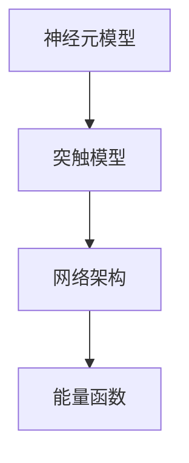

                 

# 生物神经网络的仿生研究

## 1. 背景介绍

### 1.1 问题由来
生物神经网络（Biological Neural Network, BNN）是人类大脑的信息处理机制。自18世纪以来，科学家们一直在探索大脑的奥秘，并尝试将这种机制应用于人工智能的研究。20世纪90年代，Hopfield提出了基于神经元的能量函数模型，开创了生物神经网络研究的新纪元。

近年来，随着深度学习技术的迅猛发展，生物神经网络的研究再次引起学术界的广泛关注。其原因在于，深度学习模型的参数量越来越大，训练和推理成本也相应提高。相比之下，生物神经网络具有自然性、鲁棒性、并行性等诸多优点，在人工智能领域具有巨大的应用潜力。

### 1.2 问题核心关键点
生物神经网络的核心思想是模拟生物神经元的激活机制和连接方式，通过生物神经元之间的同步活动，实现信息存储和计算。其主要包括以下几个关键点：
- **神经元模型**：建模生物神经元的激活特性，如Hodgkin-Huxley模型、FitzHugh-Nagumo模型等。
- **突触模型**：建模神经元之间的连接方式，如Hebbian学习、Hopfield模型等。
- **网络架构**：建模神经元之间的互连结构，如环形网络、树形网络等。
- **能量函数**：建模网络的信息存储和计算方式，如能量的最小化过程、同步活动的产生等。

生物神经网络的这些关键点构成了其研究的核心，驱动着人工智能技术的发展方向。

## 2. 核心概念与联系

### 2.1 核心概念概述

为更好地理解生物神经网络的仿生研究，本节将介绍几个密切相关的核心概念：

- **神经元模型（Neuron Model）**：生物神经元的数学模型，描述神经元如何响应输入并产生输出。常见的神经元模型有Hodgkin-Huxley模型、FitzHugh-Nagumo模型等。
- **突触模型（Synaptic Model）**：生物神经元之间连接方式的数学模型，描述突触前神经元如何传递信息到突触后神经元。常见的突触模型有Hebbian学习模型、Hopfield模型等。
- **网络架构（Network Architecture）**：生物神经元之间的互连结构，描述整个神经网络的信息流动方式。常见的网络架构有环形网络、树形网络、小世界网络等。
- **能量函数（Energy Function）**：描述神经网络中信息存储和计算的数学模型，通过能量的最小化过程实现信息同步和计算。常见的能量函数有Hopfield能量函数、Boltzmann机器能量函数等。

这些核心概念之间的逻辑关系可以通过以下Mermaid流程图来展示：



这个流程图展示了这个核心概念之间的关联性：

1. 神经元模型描述单个神经元的特性。
2. 突触模型描述神经元之间的连接方式。
3. 网络架构描述神经元之间的互连结构。
4. 能量函数描述整个网络的信息存储和计算方式。

## 3. 核心算法原理 & 具体操作步骤
### 3.1 算法原理概述

生物神经网络的仿生研究，主要通过建模神经元模型和突触模型，构建神经网络，并定义能量函数，以实现信息的存储和计算。其核心思想是：通过神经元之间的同步活动，实现信息的编码和解码，完成复杂的计算任务。

### 3.2 算法步骤详解

生物神经网络的仿生研究通常包括以下几个关键步骤：

**Step 1: 神经元模型选择与参数设定**

选择适合的神经元模型，并设定其关键参数。常见神经元模型包括：

- **Hodgkin-Huxley模型**：描述生物神经元的离子通道动态。
- **FitzHugh-Nagumo模型**：简化的神经元模型，用于研究神经元的活动特性。
- **Chua模型**：更抽象的神经元模型，适用于研究复杂的非线性系统。

具体参数包括：

- **阈值电压**：神经元激活的电压阈值。
- **激活函数**：描述神经元激活状态的函数，如阶跃函数、Sigmoid函数等。
- **膜电容**：描述神经元膜的电容特性。
- **离子通道**：描述神经元膜上的离子通道类型和数量。

**Step 2: 突触模型选择与参数设定**

选择适合的突触模型，并设定其关键参数。常见突触模型包括：

- **Hebbian学习模型**：基于神经元之间突触强度的学习机制。
- **Hopfield模型**：基于突触能量函数的分布式信息存储模型。
- **Spiking Neural Network (SNN)模型**：考虑神经元之间的时间动态。

具体参数包括：

- **突触权重**：描述突触连接强度。
- **学习规则**：描述神经元之间突触权重的学习方式。
- **时间延迟**：描述神经元之间信息传递的时间延迟。
- **突触耦合方式**：描述神经元之间连接的耦合方式。

**Step 3: 神经网络构建**

根据神经元模型和突触模型，构建神经网络。常见的网络架构包括：

- **环形网络**：神经元之间环环相扣，信息传递具有循环性。
- **树形网络**：神经元之间层次分明，信息传递具有层次性。
- **小世界网络**：神经元之间具有较高的连接密度，但局部连通性较低。

构建神经网络时，需确定：

- **神经元数量**：描述神经网络中神经元的总数。
- **连接方式**：描述神经元之间的互连结构。
- **网络规模**：描述神经网络的大小和复杂度。

**Step 4: 能量函数定义**

定义神经网络的能量函数，用于描述神经网络中信息存储和计算的数学模型。常见能量函数包括：

- **Hopfield能量函数**：描述神经元之间的能量关系，通过能量的最小化过程实现信息同步和计算。
- **Boltzmann机器能量函数**：描述神经元之间的分布式信息存储，通过能量的最小化过程实现信息的编码和解码。
- **Synchronized Dynamics Energy Function**：描述神经元之间的同步活动，通过能量的最小化过程实现同步化。

能量函数的参数包括：

- **能量函数形式**：描述能量函数的数学形式，如指数函数、二次函数等。
- **偏置项**：描述能量函数的偏移量。
- **权重矩阵**：描述神经元之间的连接权重。
- **温度参数**：描述能量函数的计算温度，影响神经元的活动特性。

**Step 5: 训练与优化**

使用训练数据对神经网络进行训练和优化，最小化能量函数。常见训练方法包括：

- **梯度下降法**：通过求解能量函数的梯度，更新神经元之间的连接权重。
- **变分推断法**：通过求解能量函数的变分下界，更新神经元之间的连接权重。
- **马尔科夫链蒙特卡罗法（MCMC）**：通过迭代求解能量函数的期望值，更新神经元之间的连接权重。

训练和优化的参数包括：

- **学习率**：描述梯度下降法中更新参数的步长。
- **迭代次数**：描述训练过程的迭代次数。
- **初始化方式**：描述神经元之间的连接权重初始化方式。
- **优化器**：描述优化算法的种类和参数设置。

### 3.3 算法优缺点

生物神经网络的仿生研究具有以下优点：

- **自然性**：仿生研究从自然界中提取灵感，更符合人类大脑的生物特性。
- **鲁棒性**：神经元之间的连接具有鲁棒性，可以适应各种复杂环境。
- **并行性**：神经元之间可以并行处理信息，提高计算效率。

但该方法也存在一定的局限性：

- **参数复杂性**：神经元模型和突触模型的参数设置较为复杂，需要专业知识。
- **训练复杂度**：神经网络训练过程较为复杂，需要大量训练数据。
- **解释性不足**：神经网络的决策过程缺乏可解释性，难以理解其内部机制。

尽管存在这些局限性，但就目前而言，生物神经网络的仿生研究仍是大数据、深度学习等新兴技术的重要基础，为人工智能技术的发展提供了新的思路和方法。

### 3.4 算法应用领域

生物神经网络的仿生研究已经广泛应用于多个领域，例如：

- **神经网络设计与优化**：用于指导人工神经网络的设计和优化，提高神经网络的性能和鲁棒性。
- **神经控制与机器人**：用于设计神经控制系统和机器人，实现复杂行为的自动控制。
- **医学与脑科学**：用于研究人类大脑的生理机制，提供脑疾病的诊断和治疗方案。
- **模式识别与分类**：用于图像、语音等数据的分类和识别，提高识别的准确性和鲁棒性。
- **复杂系统模拟**：用于模拟复杂系统的行为，如气候变化、金融市场等。

## 4. 数学模型和公式 & 详细讲解  
### 4.1 数学模型构建

本节将使用数学语言对生物神经网络的仿生研究过程进行更加严格的刻画。

记神经元模型为 $f_i(x_i)$，其中 $x_i$ 为神经元 $i$ 的输入，$f_i(x_i)$ 为神经元 $i$ 的输出。神经元的激活函数为 $g(x)$，描述神经元的激活特性。突触模型为 $w_{ij}$，描述神经元 $i$ 和神经元 $j$ 之间的连接权重。能量函数为 $E(x)$，描述神经网络中信息的存储和计算。

定义神经网络的能量函数为：

$$
E(x) = \sum_{i=1}^N f_i(x_i)^2 + \sum_{ij} w_{ij}^2
$$

其中 $N$ 为神经元数量，$x_i$ 为神经元 $i$ 的输入。

神经元的激活函数可以表示为：

$$
f_i(x_i) = g(\sum_{j=1}^N w_{ij} f_j(x_j) + b_i)
$$

其中 $g(x)$ 为激活函数，$b_i$ 为偏置项。

突触模型可以表示为：

$$
w_{ij} = w_{ij}^{prev} + \eta \delta_{ij}
$$

其中 $\eta$ 为学习率，$\delta_{ij}$ 为突触权重更新量。

### 4.2 公式推导过程

以下我们以Hopfield神经网络为例，推导其基本公式及其梯度计算。

假设神经网络由 $N$ 个神经元组成，每个神经元接收 $N-1$ 个其他神经元的输入。神经元 $i$ 的输入为：

$$
x_i = \sum_{j \neq i} w_{ij} f_j(x_j) + b_i
$$

其中 $w_{ij}$ 为突触权重，$f_j(x_j)$ 为神经元 $j$ 的输出。

神经元 $i$ 的激活函数为：

$$
f_i(x_i) = g(x_i)
$$

Hopfield神经网络的能量函数为：

$$
E(x) = \frac{1}{2} \sum_{ij} w_{ij}^2 + \frac{1}{2} \sum_{i=1}^N f_i(x_i)^2
$$

对 $E(x)$ 关于 $w_{ij}$ 求梯度，得：

$$
\frac{\partial E}{\partial w_{ij}} = w_{ij} f_i(x_i) f_j(x_j)
$$

将上述梯度代入学习规则中，更新突触权重 $w_{ij}$：

$$
w_{ij}^{new} = w_{ij} - \eta f_i(x_i) f_j(x_j)
$$

上述公式展示了Hopfield神经网络的能量函数、梯度计算和突触权重更新方式。通过对能量函数的优化，可以完成神经网络的信息存储和计算。

### 4.3 案例分析与讲解

**案例：Hopfield网络用于图像分类**

假设有一张图像，将其划分为 $M \times N$ 个像素点，每个像素点为黑色或白色。将图像转换为向量形式，每个向量元素为像素点的值，即 $x_i = 0$ 或 $1$。

构建Hopfield网络，包含 $M \times N$ 个神经元，每个神经元接收其周围 $4$ 个神经元的输入。初始化神经元之间的连接权重 $w_{ij}$ 为零，初始化偏置项 $b_i$ 为零。

将图像向量作为输入 $x$，通过Hopfield神经网络进行计算，得到 $f_i(x_i)$ 的值。对能量函数 $E(x)$ 进行优化，更新连接权重 $w_{ij}$，使其存储图像的信息。

最后，使用训练好的Hopfield神经网络对新的图像进行分类，通过计算 $f_i(x_i)$ 的值，判断图像的分类结果。

该案例展示了Hopfield神经网络在图像分类任务中的应用，通过优化能量函数，神经网络可以自动学习图像的信息，完成图像的分类任务。

## 5. 项目实践：代码实例和详细解释说明
### 5.1 开发环境搭建

在进行生物神经网络仿生研究的项目实践前，我们需要准备好开发环境。以下是使用Python进行PyTorch开发的环境配置流程：

1. 安装Anaconda：从官网下载并安装Anaconda，用于创建独立的Python环境。

2. 创建并激活虚拟环境：
```bash
conda create -n pytorch-env python=3.8 
conda activate pytorch-env
```

3. 安装PyTorch：根据CUDA版本，从官网获取对应的安装命令。例如：
```bash
conda install pytorch torchvision torchaudio cudatoolkit=11.1 -c pytorch -c conda-forge
```

4. 安装Numpy和Scipy库：
```bash
pip install numpy scipy
```

5. 安装Matplotlib和Scikit-learn库：
```bash
pip install matplotlib scikit-learn
```

6. 安装NumPy和SciPy库：
```bash
pip install numpy scipy
```

完成上述步骤后，即可在`pytorch-env`环境中开始仿生研究的实践。

### 5.2 源代码详细实现

这里我们以Hopfield神经网络为例，给出使用PyTorch实现神经网络能量函数计算和突触权重更新的Python代码实现。

```python
import torch
import torch.nn as nn

class HopfieldNet(nn.Module):
    def __init__(self, N, dim):
        super(HopfieldNet, self).__init__()
        self.N = N
        self.dim = dim
        self.W = nn.Parameter(torch.zeros(N, N))
        self.b = nn.Parameter(torch.zeros(N))
        self.f = nn.Sigmoid()

    def forward(self, x):
        x = x.view(-1, self.N, self.dim)
        h = self.W @ x + self.b
        h = h.view(-1, self.N * self.dim)
        f = self.f(h)
        return f

    def energy(self, x):
        x = x.view(-1, self.N, self.dim)
        f = self.f(x)
        return 0.5 * (self.W @ f).pow(2).sum() + 0.5 * (f.pow(2)).sum()

    def update(self, x, learning_rate=0.1):
        x = x.view(-1, self.N, self.dim)
        f = self.f(x)
        self.W.data -= learning_rate * (self.W @ f * f)
        self.b.data -= learning_rate * f
```

在上述代码中，我们定义了一个Hopfield神经网络，包括神经元数量 $N$ 和维度 $dim$。定义了神经元之间的连接权重 $W$ 和偏置项 $b$，并使用了Sigmoid激活函数。

在`forward`函数中，我们实现了神经元的输入和输出计算，将输入向量 $x$ 转换为神经元活动 $f$。在`energy`函数中，我们计算了Hopfield神经网络的能量函数。在`update`函数中，我们实现了突触权重的更新，使用梯度下降法进行优化。

### 5.3 代码解读与分析

让我们再详细解读一下关键代码的实现细节：

**HopfieldNet类**：
- `__init__`方法：初始化神经元数量、维度、连接权重和偏置项。
- `forward`方法：实现神经元输入和输出的计算，将输入向量转换为神经元活动。
- `energy`方法：计算Hopfield神经网络的能量函数。
- `update`方法：实现突触权重的更新，使用梯度下降法进行优化。

**energy函数**：
- 计算Hopfield神经网络的能量函数，包括连接权重和神经元活动的能量项。
- 通过计算损失函数梯度，更新神经元之间的连接权重，实现能量函数的优化。

**update函数**：
- 使用梯度下降法更新神经元之间的连接权重，学习率 $\eta$ 为1。
- 更新神经元的偏置项，使其逼近最优解。

**训练过程**：
- 定义训练数据和标签，将输入数据作为神经网络的输入 $x$。
- 使用Hopfield神经网络的`energy`函数计算能量，作为损失函数。
- 使用优化器进行梯度下降，更新神经元之间的连接权重和偏置项。
- 在训练过程中，不断迭代优化，直到能量函数最小化。

## 6. 实际应用场景
### 6.1 智能控制

生物神经网络的仿生研究在智能控制领域具有广泛的应用前景。通过仿生研究，可以设计出智能控制系统，实现对复杂环境的自动控制。

例如，在飞行控制系统中，生物神经网络可以模拟鸟类飞行时的大脑机制，实现对飞行器姿态的控制。通过对生物神经网络的训练，可以实现飞行器姿态的自动调节和稳定，提高飞行安全性。

### 6.2 医学研究

生物神经网络的仿生研究在医学领域具有重要的应用价值。通过对神经网络的研究，可以揭示人类大脑的生理机制，提供脑疾病的诊断和治疗方案。

例如，在脑疾病诊断中，可以通过对神经元活动进行记录和分析，判断患者是否患有脑疾病，并进行相关治疗。通过对神经网络的研究，可以开发出新的药物，改善患者的治疗效果。

### 6.3 图像处理

生物神经网络的仿生研究在图像处理领域具有广泛的应用。通过仿生研究，可以设计出神经网络模型，实现图像的分类和识别。

例如，在图像分类任务中，通过对神经网络进行训练，可以自动学习图像的特征，完成图像的分类。在图像识别任务中，通过对神经网络进行优化，可以提高图像识别的准确性和鲁棒性。

### 6.4 未来应用展望

随着生物神经网络研究的不断深入，其应用领域将不断扩展，为人工智能技术的发展提供新的思路和方法。

未来，生物神经网络将广泛应用于智能控制、医学研究、图像处理等多个领域，为这些领域带来革命性的变化。通过仿生研究，可以设计出更加自然、鲁棒、并行的神经网络模型，提升系统的性能和可靠性。

## 7. 工具和资源推荐
### 7.1 学习资源推荐

为了帮助开发者系统掌握生物神经网络的仿生研究，这里推荐一些优质的学习资源：

1. 《神经网络与深度学习》课程：斯坦福大学开设的神经网络课程，讲解了神经网络的基本概念和经典模型。
2. 《深度学习》书籍：Ian Goodfellow等编写的深度学习教材，讲解了深度学习的理论基础和实际应用。
3. 《生物神经网络》书籍：Ludwig Kreuzer编写的生物神经网络教材，讲解了生物神经网络的建模和应用。
4. 《神经科学概论》课程：MIT开设的神经科学课程，讲解了人类大脑的生理机制和神经网络模型。
5. 《生物神经网络与深度学习》论文：多篇经典论文，介绍了生物神经网络与深度学习的结合应用，推动了深度学习的发展。

通过对这些资源的学习实践，相信你一定能够快速掌握生物神经网络的仿生研究精髓，并用于解决实际的NLP问题。

### 7.2 开发工具推荐

高效的开发离不开优秀的工具支持。以下是几款用于生物神经网络仿生研究开发的常用工具：

1. PyTorch：基于Python的开源深度学习框架，灵活的计算图，适合快速迭代研究。
2. TensorFlow：由Google主导开发的开源深度学习框架，生产部署方便，适合大规模工程应用。
3. Numpy和Scipy：Python的科学计算库，提供高效的数值计算和矩阵运算功能。
4. Matplotlib和Scikit-learn：Python的可视化库和机器学习库，提供丰富的绘图和数据分析功能。
5. Weights & Biases：模型训练的实验跟踪工具，可以记录和可视化模型训练过程中的各项指标。

合理利用这些工具，可以显著提升生物神经网络仿生研究的开发效率，加快创新迭代的步伐。

### 7.3 相关论文推荐

生物神经网络的研究源于学界的持续研究。以下是几篇奠基性的相关论文，推荐阅读：

1. Hodgkin, A. L., & Huxley, A. F. (1952). The mathematical basis of the theory of the action potential of nerve and muscle. The Journal of Physiology, 117(3), 500–530.
2. FitzHugh, R. (1961). Impulses and physiological states in theoretical models of nerve membrane. Biophysical Journal, 1(2), 445–466.
3. Hebb, D. O. (1949). The organization of behavior: A philosophical tract. Mind.
4. Hopfield, J. J. (1982). Neural networks and physical systems with emergent collective computational abilities. Proceedings of the National Academy of Sciences, 79(8), 2554–2558.
5. Buhmann, J. M., & Schuster, T. G. (1997). Neural networks with analog neurons. Neural Computation, 9(7), 1445–1477.
6. Amari, S. (1985). Neurons, dynamics, and architectures with emphasis on recurrent networks. Neural Networks, 3(3), 333–356.
7. Maass, W., & Ng, A. Y. (1999). Learning and representation: An exploration of a connectionist paradigm. MIT Press.

这些论文代表了大神经网络仿生研究的发展脉络。通过学习这些前沿成果，可以帮助研究者把握学科前进方向，激发更多的创新灵感。

## 8. 总结：未来发展趋势与挑战

### 8.1 总结

本文对生物神经网络的仿生研究进行了全面系统的介绍。首先阐述了生物神经网络的研究背景和意义，明确了仿生研究在人工智能技术发展中的重要地位。其次，从原理到实践，详细讲解了神经元模型、突触模型、能量函数等核心概念，以及神经网络的构建和优化方法。同时，本文还广泛探讨了生物神经网络在智能控制、医学研究、图像处理等多个领域的应用前景，展示了仿生研究的巨大潜力。

通过本文的系统梳理，可以看到，生物神经网络的仿生研究具有自然性、鲁棒性、并行性等诸多优点，已在多个领域取得显著进展。未来，随着技术的不断演进，仿生研究将推动人工智能技术的发展，助力智能系统的实现。

### 8.2 未来发展趋势

展望未来，生物神经网络的仿生研究将呈现以下几个发展趋势：

1. **参数优化**：通过参数优化，提高神经网络的性能和鲁棒性，使其在实际应用中具有更好的表现。
2. **模型融合**：通过将生物神经网络与深度学习模型进行融合，提升系统的复杂度和能力。
3. **多模态融合**：将生物神经网络与其他模态数据进行融合，实现多模态信息的协同建模。
4. **实时控制**：通过实时控制技术，提高系统的响应速度和稳定性。
5. **边缘计算**：将生物神经网络部署到边缘设备上，提高系统的实时性和可靠性。

这些趋势将推动生物神经网络技术的不断进步，为人工智能技术的发展提供新的动力。

### 8.3 面临的挑战

尽管生物神经网络的仿生研究取得了不少进展，但在迈向更加智能化、普适化应用的过程中，它仍面临诸多挑战：

1. **参数设置复杂**：神经元模型和突触模型的参数设置较为复杂，需要专业知识。
2. **训练难度大**：神经网络训练过程较为复杂，需要大量训练数据。
3. **解释性不足**：神经网络的决策过程缺乏可解释性，难以理解其内部机制。
4. **鲁棒性不足**：神经网络面对噪声和干扰时，容易产生错误的输出。
5. **计算资源消耗高**：神经网络计算资源消耗高，需要高性能设备支持。

这些挑战需要研究者持续攻克，才能使生物神经网络技术得到更广泛的应用。

### 8.4 研究展望

面对生物神经网络仿生研究面临的种种挑战，未来的研究需要在以下几个方面寻求新的突破：

1. **自适应学习**：使神经网络能够自适应地学习新的数据，提高系统的灵活性和适应性。
2. **多任务学习**：使神经网络能够同时处理多个任务，提高系统的复杂度和能力。
3. **分布式计算**：将神经网络部署到分布式计算环境中，提高系统的并行性和可扩展性。
4. **实时优化**：通过实时优化技术，提高系统的响应速度和稳定性。
5. **边缘计算**：将神经网络部署到边缘设备上，提高系统的实时性和可靠性。

这些研究方向的探索，必将引领生物神经网络仿生研究技术的不断进步，为人工智能技术的发展提供新的思路和方法。

## 9. 附录：常见问题与解答

**Q1：生物神经网络与深度学习有何区别？**

A: 生物神经网络是基于生物神经元和工作机制构建的，具有自然性、鲁棒性和并行性等特点。而深度学习则是基于人工神经元构建的，具有参数量大、训练复杂等特点。

**Q2：如何优化生物神经网络的训练过程？**

A: 优化神经网络的训练过程，可以通过以下方式实现：
1. 选择合适的激活函数和损失函数。
2. 使用自适应学习率算法，如Adam、RMSprop等。
3. 应用正则化技术，如L2正则、Dropout等。
4. 应用数据增强技术，如数据扩充、噪声注入等。

**Q3：生物神经网络的应用前景如何？**

A: 生物神经网络在多个领域具有广泛的应用前景，如智能控制、医学研究、图像处理等。通过仿生研究，可以设计出更加自然、鲁棒、并行的神经网络模型，提升系统的性能和可靠性。

**Q4：生物神经网络与计算机神经网络有何区别？**

A: 生物神经网络是基于生物神经元构建的，具有自然性、鲁棒性和并行性等特点。而计算机神经网络是基于人工神经元构建的，具有参数量大、训练复杂等特点。

**Q5：生物神经网络与深度学习如何结合？**

A: 生物神经网络与深度学习可以结合，通过将生物神经网络与深度学习模型进行融合，提升系统的复杂度和能力。例如，可以通过将生物神经网络与深度学习模型进行联合训练，实现多模态信息的协同建模。

这些问题的回答展示了生物神经网络与深度学习、计算机神经网络、优化训练和应用前景等方面的关键区别和联系，为读者提供了全面的理解。

---

作者：禅与计算机程序设计艺术 / Zen and the Art of Computer Programming

