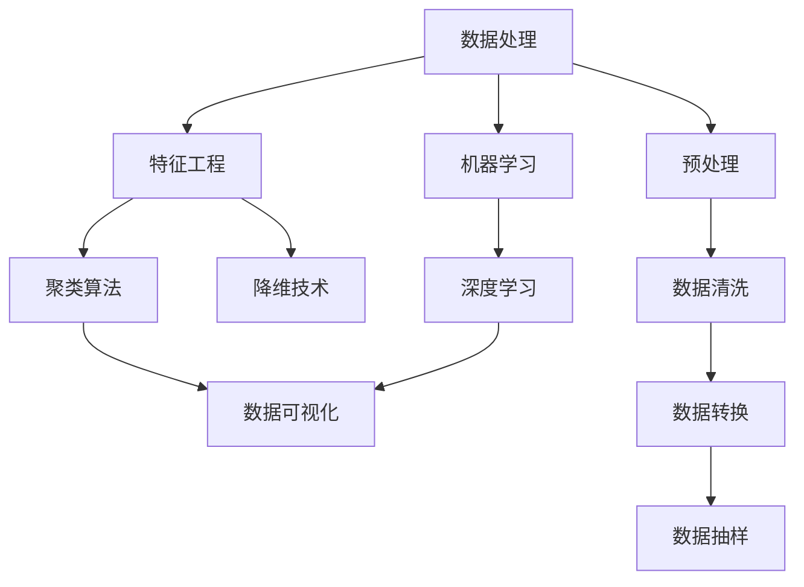

                 

# 用户画像的数据处理与分析

> 关键词：用户画像,数据处理,数据分析,特征工程,聚类算法,降维技术,机器学习,深度学习,可视化工具

## 1. 背景介绍

### 1.1 问题由来

在数字经济时代，数据成为企业竞争力的关键要素。通过深入挖掘数据中的信息，企业能够更好地理解市场动态、优化产品策略、提升用户体验。其中，用户画像（User Persona）是数据分析中一个重要的概念，它能够通过数据汇总、归一化、抽样等方法，帮助企业从海量用户数据中提炼出有价值的洞察，进而指导业务决策。

在实践中，用户画像的构建需要从多个维度收集用户数据，并对其进行数据清洗、特征提取、聚类分析等处理。这些数据可能包括用户的个人信息、行为数据、社交网络数据等，涉及数据处理和分析的多个环节。本文将围绕用户画像的数据处理与分析进行系统介绍，涵盖数据收集、预处理、特征工程、聚类分析、降维技术、模型训练与评估等内容，力求为读者提供全面的技术指引。

## 2. 核心概念与联系

### 2.1 核心概念概述

为更好地理解用户画像的数据处理与分析方法，本节将介绍几个密切相关的核心概念：

- 用户画像（User Persona）：通过数据分析方法，从海量用户数据中提炼出具有代表性和可解释性的用户特征集合，以指导业务决策。用户画像不仅包括用户的静态特征，如基本信息、行为偏好等，还包括动态特征，如时间行为、情感倾向等。

- 数据处理（Data Processing）：指对原始数据进行清洗、转换、抽样等操作，以减少数据噪音、提升数据质量的过程。数据处理是数据分析的前置环节，直接影响数据分析结果的准确性和可靠性。

- 特征工程（Feature Engineering）：从原始数据中提取、构造和选择最有效的特征，以提高模型的预测能力和泛化性能。特征工程是数据分析的核心环节，其效果直接决定最终的分析结果。

- 聚类算法（Clustering Algorithm）：通过将数据点分群，将相似的数据点归为一类，揭示数据内在结构的技术。常见的聚类算法包括K-means、层次聚类、DBSCAN等。

- 降维技术（Dimensionality Reduction）：通过将高维数据映射到低维空间，去除冗余特征，提升数据分析效率和效果。常见的降维技术包括PCA、LDA、t-SNE等。

- 机器学习（Machine Learning）：通过构建模型，从数据中学习和提取规律，并用于预测和决策的技术。常见的机器学习算法包括线性回归、逻辑回归、决策树、随机森林等。

- 深度学习（Deep Learning）：通过构建多层次神经网络，从数据中自动学习高层次特征表示的技术。深度学习在处理复杂数据、提升模型准确性方面表现出色，常见应用包括图像识别、语音识别、自然语言处理等。

这些核心概念之间的逻辑关系可以通过以下Mermaid流程图来展示：



这个流程图展示了大数据分析中的核心概念及其之间的关系：

1. 数据处理作为前置环节，对原始数据进行清洗和转换，为后续特征工程和模型训练做准备。
2. 特征工程从原始数据中提取和构造特征，提升数据表达能力。
3. 聚类算法揭示数据内在结构，帮助理解数据分布。
4. 降维技术减少特征维度，提升数据分析效率。
5. 机器学习通过模型学习和提取规律，用于预测和决策。
6. 深度学习利用多层次神经网络，自动提取高层次特征。
7. 数据可视化帮助理解分析结果，辅助决策。

这些概念共同构成了数据分析的完整流程，使得企业能够从数据中提取有价值的信息，指导业务决策。

## 3. 核心算法原理 & 具体操作步骤

### 3.1 算法原理概述

用户画像的数据处理与分析，本质上是一个从原始数据中提取有价值信息的过程。它包括数据清洗、特征工程、模型训练等多个环节。通过这些步骤，我们能够将复杂的数据转换为易于理解和利用的信息，从而支持业务决策。

以用户画像的数据处理为例，其核心算法流程可以概括为以下几个步骤：

1. 数据收集与预处理：从多个数据源收集用户数据，并进行清洗和转换。
2. 特征工程：从原始数据中提取、构造和选择最有效的特征。
3. 聚类分析：通过聚类算法将数据分为不同的用户群体。
4. 降维技术：使用降维算法将高维数据映射到低维空间。
5. 模型训练与评估：使用机器学习或深度学习模型训练用户画像，并评估其效果。
6. 数据可视化：使用可视化工具展示用户画像的分析结果。

### 3.2 算法步骤详解

下面将详细介绍每个步骤的具体操作方法。

**Step 1: 数据收集与预处理**

数据收集是用户画像构建的第一步。一般来说，数据来源包括企业内部的各种业务系统（如电商平台、社交网络、客服系统等），以及外部数据（如公开数据集、第三方API等）。

在数据收集过程中，需要确保数据的完整性和一致性。例如，通过数据合并、去重等操作，减少数据噪音。同时，需要检查数据的时效性，确保数据是最新的。

数据预处理包括数据清洗、数据转换和数据抽样等步骤。数据清洗通常涉及处理缺失值、异常值等，确保数据的可用性。数据转换包括数据类型转换、归一化等，使其符合模型的输入要求。数据抽样则是从原始数据中抽取一小部分样本，用于模型训练和验证，以减少计算成本。

**Step 2: 特征工程**

特征工程是用户画像构建的核心环节。通过特征工程，我们从原始数据中提取、构造和选择最有效的特征，以提高模型的预测能力和泛化性能。

特征提取通常包括提取时间特征、地理位置特征、行为特征等。例如，从用户的浏览历史中提取页面停留时间、访问深度等指标。特征构造则涉及将多个特征进行组合，如将用户的浏览时间与访问次数相乘，构造一个新的特征。特征选择则是从原始特征中筛选出最相关的特征，减少冗余特征。

**Step 3: 聚类分析**

聚类分析通过将数据点分群，揭示数据的内在结构。聚类算法可以根据数据点之间的相似度进行分组，通常使用K-means、层次聚类、DBSCAN等算法。

K-means算法将数据点分为K个簇，每个簇内的数据点相似度最高。层次聚类则是将数据点按照某种规则逐层分群。DBSCAN则是基于密度的聚类算法，能够发现任意形状的簇。

**Step 4: 降维技术**

降维技术通过将高维数据映射到低维空间，去除冗余特征，提升数据分析效率和效果。常见的降维算法包括PCA（主成分分析）、LDA（线性判别分析）、t-SNE（t分布随机邻域嵌入）等。

PCA通过线性变换将高维数据映射到低维空间，保留最大方差的信息。LDA则是通过线性变换，最大化类别之间的判别性，适用于分类问题。t-SNE则通过非线性变换，将高维数据映射到低维空间，保留局部相似性。

**Step 5: 模型训练与评估**

模型训练与评估是用户画像构建的最终环节。通过构建机器学习或深度学习模型，我们能够从数据中学习和提取规律，并用于预测和决策。

常见的机器学习算法包括线性回归、逻辑回归、决策树、随机森林等。深度学习模型则包括卷积神经网络（CNN）、循环神经网络（RNN）、长短时记忆网络（LSTM）等。在模型训练过程中，需要选择合适的损失函数、优化器等参数，以提升模型性能。在模型评估过程中，通常使用准确率、召回率、F1值等指标，评估模型的效果。

**Step 6: 数据可视化**

数据可视化通过将分析结果以图形化方式展示，帮助理解数据分布和分析结果。常见的可视化工具包括Tableau、Power BI、Plotly等。

在用户画像的数据可视化过程中，通常使用散点图、柱状图、热力图等展示分析结果，如用户群体分布、特征重要性、模型预测结果等。

### 3.3 算法优缺点

用户画像的数据处理与分析方法具有以下优点：

1. 全面性。通过从多个数据源收集和分析用户数据，能够全面理解用户行为和偏好。
2. 可解释性。用户画像的数据处理与分析方法基于统计学和机器学习原理，具有较好的可解释性，能够指导业务决策。
3. 灵活性。用户画像的数据处理与分析方法可以根据具体业务需求，灵活选择不同的算法和技术。
4. 可扩展性。用户画像的数据处理与分析方法可以应用于多种业务场景，具有较高的可扩展性。

同时，该方法也存在一些局限性：

1. 数据依赖。用户画像的数据处理与分析方法高度依赖于数据质量，需要大量的标注数据和高质量数据源。
2. 算法复杂性。用户画像的数据处理与分析方法涉及多种算法和技术，算法实现较为复杂。
3. 模型解释性不足。用户画像的机器学习模型和深度学习模型通常缺乏可解释性，难以理解模型的内部机制。
4. 实时性不足。用户画像的数据处理与分析方法通常需要大量计算资源和时间，难以实时处理大规模数据。

尽管存在这些局限性，但用户画像的数据处理与分析方法仍然是数据分析中不可或缺的重要技术。通过科学的数据处理和分析，企业能够更好地理解用户行为和偏好，制定更有效的业务策略，提升用户满意度和企业竞争力。

### 3.4 算法应用领域

用户画像的数据处理与分析方法在多个领域都有广泛的应用，具体包括：

1. 市场营销：通过用户画像，了解用户的购买行为、偏好、兴趣等，制定更有效的营销策略。
2. 客户服务：通过用户画像，了解用户的反馈和需求，优化客户服务流程，提升用户体验。
3. 产品开发：通过用户画像，了解用户对产品的反馈和建议，指导产品开发和改进。
4. 风险控制：通过用户画像，了解用户的信用记录、行为模式等，评估风险，制定风控策略。
5. 个性化推荐：通过用户画像，了解用户的偏好和行为，推荐个性化产品或服务。

除了以上领域，用户画像的数据处理与分析方法还可以应用于智能客服、智能投顾、金融风控、医疗诊断等多个场景中，为各类业务提供数据支持和技术保障。

## 4. 数学模型和公式 & 详细讲解 & 举例说明

### 4.1 数学模型构建

用户画像的数据处理与分析过程，涉及多个数学模型的构建和应用。以下以聚类分析为例，详细介绍其数学模型的构建。

假设我们有N个用户数据点，每个数据点有M个特征，构建K-means聚类模型的数学模型如下：

1. 随机选择K个初始聚类中心。
2. 对每个数据点，计算其与每个聚类中心的距离，将其分配到距离最近的聚类中心。
3. 对每个聚类的数据点，计算其新聚类中心。
4. 重复步骤2和步骤3，直到聚类中心不再变化或达到预设的迭代次数。

### 4.2 公式推导过程

以K-means聚类算法为例，推导其数学模型。

假设用户数据点表示为 $x_1, x_2, ..., x_N$，每个数据点有M个特征，构建K个聚类中心 $\mu_1, \mu_2, ..., \mu_K$。

1. 随机选择K个初始聚类中心，设 $\mu_1, \mu_2, ..., \mu_K$ 为初始聚类中心。
2. 对每个数据点 $x_i$，计算其与每个聚类中心的距离，设距离矩阵为 $D_{ij} = ||x_i - \mu_j||^2$。
3. 对每个数据点 $x_i$，分配到距离最近的聚类中心，设分配结果为 $z_i \in \{1, 2, ..., K\}$。
4. 对每个聚类，计算新的聚类中心，设新的聚类中心为 $\mu_1', \mu_2', ..., \mu_K'$。
5. 重复步骤2和步骤4，直到聚类中心不再变化或达到预设的迭代次数。

### 4.3 案例分析与讲解

以一个简单的案例说明K-means聚类算法的使用过程。

假设我们有5个用户数据点，每个数据点有2个特征，构建2个聚类中心。

初始聚类中心为 $\mu_1 = (0, 0), \mu_2 = (1, 1)$。

对每个数据点计算其与聚类中心的距离，距离矩阵为：

$$
\begin{bmatrix}
1 & 4 \\
3 & 2 \\
2 & 1 \\
3 & 4 \\
4 & 2
\end{bmatrix}
$$

分配每个数据点到距离最近的聚类中心，得到分配结果为 $z_1 = 1, z_2 = 2, z_3 = 1, z_4 = 2, z_5 = 1$。

计算新的聚类中心，设新的聚类中心为 $\mu_1', \mu_2'$。

$$
\mu_1' = \frac{1}{3}(x_1 + x_3 + x_5) = (0.6667, 0.6667)
$$

$$
\mu_2' = \frac{1}{2}(x_2 + x_4) = (1.5, 2.5)
$$

重复步骤2和步骤4，直到聚类中心不再变化或达到预设的迭代次数。

最终得到的聚类结果为：

- 聚类1：用户1、用户3、用户5
- 聚类2：用户2、用户4

## 5. 项目实践：代码实例和详细解释说明

### 5.1 开发环境搭建

在进行用户画像的数据处理与分析实践前，我们需要准备好开发环境。以下是使用Python进行Pandas和Scikit-learn开发的环境配置流程：

1. 安装Anaconda：从官网下载并安装Anaconda，用于创建独立的Python环境。

2. 创建并激活虚拟环境：
```bash
conda create -n userpersona python=3.8 
conda activate userpersona
```

3. 安装必要的库：
```bash
pip install pandas numpy scikit-learn matplotlib seaborn
```

完成上述步骤后，即可在`userpersona`环境中开始用户画像的数据处理与分析实践。

### 5.2 源代码详细实现

下面我们以用户画像的聚类分析为例，给出使用Pandas和Scikit-learn进行K-means聚类分析的Python代码实现。

首先，导入必要的库和数据：

```python
import pandas as pd
import numpy as np
from sklearn.cluster import KMeans
import matplotlib.pyplot as plt

# 加载数据
data = pd.read_csv('user_data.csv')
```

然后，进行数据预处理和特征工程：

```python
# 数据预处理
# 处理缺失值
data = data.dropna()

# 特征工程
# 构造新特征
data['age'] = data['age'].astype(int)
data['income'] = data['income'].astype(int)
data['behavior'] = data['behavior'].map({'read': 1, 'watch': 2, 'listen': 3})
data['location'] = data['location'].map({'city': 1, 'region': 2, 'country': 3})
```

接着，进行K-means聚类分析：

```python
# 定义聚类模型
kmeans = KMeans(n_clusters=3, random_state=42)

# 训练模型
kmeans.fit(data[['age', 'income', 'behavior', 'location']])

# 获取聚类结果
labels = kmeans.labels_
```

最后，可视化聚类结果：

```python
# 绘制聚类结果
plt.scatter(data['age'], data['income'], c=labels)
plt.xlabel('Age')
plt.ylabel('Income')
plt.show()
```

以上就是使用Pandas和Scikit-learn对用户数据进行K-means聚类分析的完整代码实现。可以看到，得益于Pandas和Scikit-learn的强大封装，我们可以用相对简洁的代码完成聚类分析的实现。

### 5.3 代码解读与分析

让我们再详细解读一下关键代码的实现细节：

**用户数据预处理**

```python
# 处理缺失值
data = data.dropna()
```

这里使用Pandas的`dropna`方法处理缺失值，确保数据完整性。

**特征工程**

```python
# 构造新特征
data['age'] = data['age'].astype(int)
data['income'] = data['income'].astype(int)
data['behavior'] = data['behavior'].map({'read': 1, 'watch': 2, 'listen': 3})
data['location'] = data['location'].map({'city': 1, 'region': 2, 'country': 3})
```

这里将原始数据中的不同类型数据转换为数值型数据，并对文本型特征进行了编码处理。

**K-means聚类分析**

```python
# 定义聚类模型
kmeans = KMeans(n_clusters=3, random_state=42)

# 训练模型
kmeans.fit(data[['age', 'income', 'behavior', 'location']])

# 获取聚类结果
labels = kmeans.labels_
```

这里定义了K-means聚类模型，并使用训练好的模型对数据进行聚类分析，获取每个数据点的聚类标签。

**可视化聚类结果**

```python
# 绘制聚类结果
plt.scatter(data['age'], data['income'], c=labels)
plt.xlabel('Age')
plt.ylabel('Income')
plt.show()
```

这里使用Matplotlib库绘制散点图，可视化聚类结果，方便观察聚类效果。

可以看到，通过Python和相关库，我们可以轻松实现用户画像的数据处理与分析，包括数据预处理、特征工程、聚类分析等环节。

## 6. 实际应用场景

### 6.1 智能推荐系统

用户画像在智能推荐系统中有着广泛应用。通过用户画像，推荐系统可以了解用户的偏好和行为模式，制定个性化推荐策略，提升用户体验。

在推荐系统中，用户画像通常用于构建用户行为模型和用户兴趣模型。用户行为模型通过分析用户的历史行为数据，如浏览记录、购买记录等，识别用户的兴趣偏好。用户兴趣模型通过分析用户的社交网络数据，如好友关系、兴趣标签等，补充用户的兴趣信息。

通过结合用户画像和推荐算法，推荐系统能够为每个用户生成个性化的推荐列表，提升推荐效果和用户满意度。

### 6.2 客户服务

用户画像在客户服务中也有重要应用。通过用户画像，客户服务系统可以了解用户的基本信息、行为模式和情感倾向，提供个性化服务，提升用户体验。

在客户服务系统中，用户画像通常用于构建用户分类模型和情感分析模型。用户分类模型通过分析用户的历史互动数据，如客服记录、投诉记录等，识别用户的分类标签。情感分析模型通过分析用户的情绪表达，如文本评论、语音情感等，评估用户的情感状态。

通过结合用户画像和服务分析算法，客户服务系统能够提供针对不同用户群体的个性化服务，及时回应用户需求，提升用户满意度。

### 6.3 广告投放

用户画像在广告投放中也有广泛应用。通过用户画像，广告投放系统可以了解用户的兴趣和行为模式，制定精准的广告投放策略，提升广告效果和投资回报率。

在广告投放系统中，用户画像通常用于构建用户兴趣模型和行为模型。用户兴趣模型通过分析用户的浏览历史、搜索历史等数据，识别用户的兴趣偏好。行为模型通过分析用户的时空行为数据，如地理位置、访问时间等，识别用户的行为模式。

通过结合用户画像和广告算法，广告投放系统能够为每个用户生成个性化的广告内容，提升广告投放效果和用户体验。

### 6.4 未来应用展望

随着数据科学和人工智能技术的不断发展，用户画像的数据处理与分析方法也将不断演进。未来，用户画像将在更多领域得到应用，为各类业务提供数据支持和技术保障。

在医疗领域，用户画像可以帮助医生了解患者的基本信息、历史病历等，制定个性化诊疗方案，提升诊疗效果和患者满意度。

在金融领域，用户画像可以帮助金融机构了解客户的基本信息、信用记录等，评估客户信用风险，制定精准的贷款策略，提升金融服务的质量和效率。

在教育领域，用户画像可以帮助教育机构了解学生的学习情况、兴趣爱好等，制定个性化教育方案，提升教育质量和学生满意度。

此外，在智能制造、智能交通、智慧城市等多个领域，用户画像的数据处理与分析方法也将得到广泛应用，为各类业务提供数据支持和决策保障。

## 7. 工具和资源推荐

### 7.1 学习资源推荐

为了帮助开发者系统掌握用户画像的数据处理与分析技术，这里推荐一些优质的学习资源：

1. 《数据分析与统计建模》系列课程：由Coursera等在线教育平台提供，涵盖数据分析、统计建模等多个主题，帮助理解数据处理和分析的基本原理和方法。

2. 《Python数据科学手册》书籍：由Jake VanderPlas撰写，全面介绍了Python在数据处理、数据分析中的应用，是数据科学领域的经典入门书籍。

3. 《机器学习实战》书籍：由Peter Harrington撰写，介绍了常用的机器学习算法及其应用，帮助理解机器学习的基本原理和实现方法。

4. 《深度学习入门》课程：由李沐等讲师主讲的深度学习入门课程，涵盖了深度学习的基本概念和实现方法，适合初学者入门。

5. 《TensorFlow实战》书籍：由Google开发者社区提供，介绍了TensorFlow的使用方法和应用场景，帮助理解深度学习模型的构建和训练。

通过对这些资源的学习实践，相信你一定能够快速掌握用户画像的数据处理与分析技术，并用于解决实际的业务问题。

### 7.2 开发工具推荐

高效的开发离不开优秀的工具支持。以下是几款用于用户画像数据分析的常用工具：

1. Python：Python作为数据处理和分析的主流语言，具有丰富的库和工具，如Pandas、NumPy、Scikit-learn等，适合进行数据分析和机器学习任务。

2. R语言：R语言是数据科学领域的另一主流语言，拥有强大的统计分析和数据可视化能力，适合进行数据处理和分析任务。

3. Tableau：Tableau是一款数据可视化工具，能够快速生成丰富的图表和报表，方便数据理解和分析。

4. Power BI：Power BI是微软推出的数据可视化工具，与Excel、SQL Server等工具集成良好，适合进行数据处理和分析任务。

5. Matplotlib：Matplotlib是Python的数据可视化库，支持生成各种类型的图表和报表，适合进行数据处理和分析任务。

6. Seaborn：Seaborn是基于Matplotlib的数据可视化库，支持生成更为美观和复杂的图表，适合进行数据处理和分析任务。

合理利用这些工具，可以显著提升用户画像的数据处理与分析效率，加快创新迭代的步伐。

### 7.3 相关论文推荐

用户画像的数据处理与分析方法涉及多个学科和领域，以下推荐几篇相关的学术论文，供读者参考：

1. "A Systematic Review of Customer Personas in Customer Relationship Management"：该论文综述了客户关系管理中的用户画像研究，介绍了客户画像构建和应用的基本方法和实践经验。

2. "User画像在市场营销中的应用研究"：该论文介绍了用户画像在市场营销中的应用，包括用户分群、市场分析、产品推荐等，帮助理解用户画像在实际应用中的具体应用场景。

3. "基于聚类分析的用户画像构建"：该论文介绍了基于聚类算法构建用户画像的方法，包括K-means、层次聚类、DBSCAN等算法的应用，帮助理解聚类算法在用户画像构建中的作用。

4. "基于深度学习的用户画像构建"：该论文介绍了基于深度学习模型构建用户画像的方法，包括卷积神经网络、循环神经网络、长短时记忆网络等算法的应用，帮助理解深度学习在用户画像构建中的作用。

5. "基于混合聚类的用户画像构建"：该论文介绍了基于混合聚类算法构建用户画像的方法，结合了K-means和层次聚类的优点，帮助理解混合聚类算法在用户画像构建中的作用。

这些论文代表了大数据和人工智能领域的研究进展，通过学习这些前沿成果，可以帮助研究者把握学科前进方向，激发更多的创新灵感。

## 8. 总结：未来发展趋势与挑战

### 8.1 总结

本文对用户画像的数据处理与分析进行了全面系统的介绍。首先阐述了用户画像的定义和重要性，明确了数据处理与分析在大数据分析中的核心作用。其次，从原理到实践，详细讲解了用户画像的数学模型和操作步骤，给出了完整的代码实现。同时，本文还广泛探讨了用户画像在多个业务场景中的应用，展示了其广阔的应用前景。此外，本文精选了用户画像相关的学习资源和开发工具，力求为读者提供全方位的技术指引。

通过本文的系统梳理，可以看到，用户画像的数据处理与分析方法在大数据分析中发挥着至关重要的作用，能够帮助企业从海量数据中提取有价值的信息，指导业务决策。未来，随着大数据和人工智能技术的不断进步，用户画像的方法也将不断演进，为各类业务提供更加智能、高效的数据支持。

### 8.2 未来发展趋势

展望未来，用户画像的数据处理与分析技术将呈现以下几个发展趋势：

1. 实时性提升。随着数据流技术的不断发展，用户画像的数据处理与分析将越来越实时化，能够及时反映用户的最新行为和偏好，提升业务决策的时效性。

2. 跨领域融合。用户画像的数据处理与分析将与其他人工智能技术进行更深入的融合，如知识图谱、因果推理、强化学习等，提升用户画像的全面性和准确性。

3. 数据多样性扩展。用户画像的数据来源将从单一数据源扩展到多模态数据源，如文本、图像、语音等，提升用户画像的多样性和深度。

4. 模型自动化优化。用户画像的数据处理与分析将引入自动化优化技术，如自动化特征工程、自动化模型选择等，提升数据分析的自动化水平和效率。

5. 数据隐私保护。用户画像的数据处理与分析将引入隐私保护技术，如数据匿名化、差分隐私等，保障用户数据的隐私和安全。

6. 数据联邦化。用户画像的数据处理与分析将引入联邦学习技术，在不同数据源之间进行模型共享和优化，提升数据处理的协同性和效率。

这些趋势凸显了用户画像的数据处理与分析技术的广阔前景，为各类业务提供更加全面、智能的数据支持。

### 8.3 面临的挑战

尽管用户画像的数据处理与分析技术已经取得了显著进展，但在其应用过程中仍面临诸多挑战：

1. 数据质量问题。用户画像的数据处理与分析高度依赖于数据质量，数据不完整、不准确等问题将影响分析结果的可靠性。

2. 算法复杂性。用户画像的数据处理与分析涉及多种算法和技术，算法实现较为复杂，需要较高的技术门槛。

3. 隐私保护问题。用户画像的数据处理与分析涉及用户隐私数据，需要合理处理隐私保护与数据利用之间的关系。

4. 实时性不足。用户画像的数据处理与分析通常需要大量计算资源和时间，难以实时处理大规模数据。

5. 模型解释性不足。用户画像的机器学习模型和深度学习模型通常缺乏可解释性，难以理解模型的内部机制。

6. 技术门槛较高。用户画像的数据处理与分析技术需要掌握多种数据处理、统计学和机器学习知识，技术门槛较高。

尽管存在这些挑战，但用户画像的数据处理与分析技术仍然是数据分析中不可或缺的重要技术。通过不断优化数据处理、改进算法、提升模型解释性，用户画像将为各类业务提供更加全面、智能的数据支持，帮助企业从海量数据中提取有价值的信息，指导业务决策。

### 8.4 研究展望

面对用户画像的数据处理与分析技术所面临的诸多挑战，未来的研究需要在以下几个方面寻求新的突破：

1. 数据清洗与预处理技术。研究和开发更高效、更智能的数据清洗与预处理技术，确保数据质量，提升数据分析结果的可靠性。

2. 算法优化与自动化技术。研究和开发更高效、更智能的算法优化与自动化技术，提升数据分析的自动化水平和效率。

3. 隐私保护与数据安全技术。研究和开发更高效、更智能的隐私保护与数据安全技术，保障用户数据的安全和隐私。

4. 模型解释性与可解释技术。研究和开发更高效、更智能的模型解释性与可解释技术，提升模型的解释性和可理解性。

5. 跨领域融合技术。研究和开发跨领域融合技术，将用户画像与其他人工智能技术进行更深入的融合，提升用户画像的全面性和深度。

6. 数据联邦化技术。研究和开发数据联邦化技术，在不同数据源之间进行模型共享和优化，提升数据处理的协同性和效率。

这些研究方向将推动用户画像的数据处理与分析技术不断演进，为各类业务提供更加全面、智能的数据支持，帮助企业从海量数据中提取有价值的信息，指导业务决策。

## 9. 附录：常见问题与解答

**Q1：用户画像的数据处理与分析是否适用于所有业务场景？**

A: 用户画像的数据处理与分析方法在大多数业务场景中都有广泛应用。然而，对于一些特定场景，如高安全要求、高隐私保护的场景，用户画像的应用可能存在一定的局限性。例如，金融行业、医疗行业等对数据隐私保护要求较高的行业，需要采取更严格的隐私保护措施，以确保用户数据的安全。

**Q2：如何确保用户画像的数据质量？**

A: 确保用户画像的数据质量是用户画像构建的基础。可以从以下几个方面入手：
1. 数据清洗：使用Pandas等工具进行数据清洗，去除数据噪音，确保数据完整性和一致性。
2. 数据验证：使用数据验证工具对数据进行验证，确保数据准确性和可靠性。
3. 数据治理：建立数据治理机制，对数据进行定期更新和维护，确保数据的时效性和准确性。

**Q3：用户画像的数据处理与分析在实时性方面有哪些挑战？**

A: 用户画像的数据处理与分析在实时性方面存在一定的挑战：
1. 数据量巨大：用户画像的数据处理与分析涉及海量数据，需要高效的数据处理算法和设备，才能实现实时处理。
2. 计算资源不足：实时处理大规模数据需要大量的计算资源，可能面临计算资源不足的问题。
3. 数据传输延迟：实时数据处理需要在多个数据源之间进行数据传输，可能面临数据传输延迟的问题。

**Q4：如何提升用户画像的数据处理与分析的自动化水平？**

A: 提升用户画像的数据处理与分析的自动化水平可以从以下几个方面入手：
1. 自动化特征工程：使用自动化特征工程工具，自动进行特征选择、构造和优化。
2. 自动化模型选择：使用自动化模型选择工具，自动选择最优的模型和算法。
3. 自动化数据治理：使用自动化数据治理工具，自动进行数据清洗、验证和更新。

**Q5：用户画像的数据处理与分析在隐私保护方面有哪些挑战？**

A: 用户画像的数据处理与分析在隐私保护方面存在一定的挑战：
1. 数据隐私泄露：用户画像涉及大量用户隐私数据，需要采取严格的数据隐私保护措施。
2. 数据匿名化：需要对数据进行匿名化处理，以保护用户隐私。
3. 差分隐私：需要采用差分隐私技术，对数据进行处理，确保数据隐私安全。

通过不断优化数据处理、改进算法、提升模型解释性，用户画像的数据处理与分析技术将不断演进，为各类业务提供更加全面、智能的数据支持，帮助企业从海量数据中提取有价值的信息，指导业务决策。

---

作者：禅与计算机程序设计艺术 / Zen and the Art of Computer Programming

