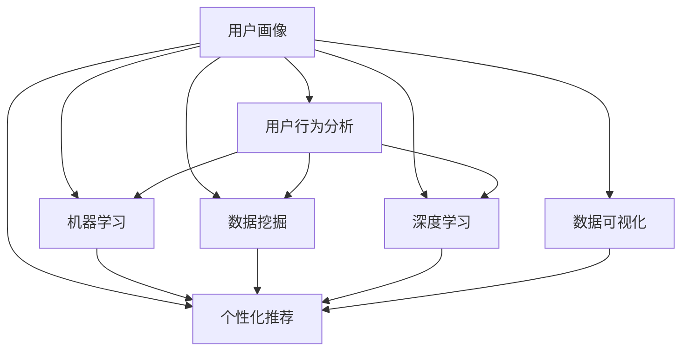

                 

# 用户画像的构建与优化方法

> 关键词：用户画像,用户行为分析,机器学习,数据挖掘,深度学习,数据可视化,个性化推荐

## 1. 背景介绍

### 1.1 问题由来
在数字时代，用户行为数据已成为企业最重要的资产之一。通过深入分析用户行为数据，企业可以更好地理解用户需求，制定更加精准的市场策略，提升用户体验，增加用户粘性。但传统的用户行为分析方法往往依赖人工经验，费时费力且精度有限。如何自动化地从大量数据中提取用户行为特征，构建精细化的用户画像，成为企业数字化转型升级的迫切需求。

### 1.2 问题核心关键点
用户画像的构建与优化方法，本质上是对用户行为数据进行自动化分析和学习，提取出最具代表性的用户特征，从而刻画用户行为模式和需求偏好。其核心在于：

- 数据采集与清洗：收集多样化的用户行为数据，清洗无用或异常数据，保证数据质量。
- 特征提取与选择：利用机器学习与数据挖掘算法，从原始数据中提取和选择最具代表性的特征。
- 用户分类与建模：应用深度学习等技术，将用户划分为不同的细分市场，构建用户画像。
- 画像评估与优化：通过用户画像的评估指标，指导模型的进一步优化，提升画像的准确度和泛化能力。

## 2. 核心概念与联系

### 2.1 核心概念概述

为更好地理解用户画像的构建与优化方法，本节将介绍几个密切相关的核心概念：

- 用户画像(User Profile)：基于用户行为数据，通过自动化分析与学习，提炼出用户的最具代表性的行为特征，形成对用户行为的精确描述。
- 用户行为分析(User Behavior Analysis)：对用户在应用或服务中的行为进行监测和分析，提取其中的有用信息。
- 机器学习(Machine Learning)：通过设计数据驱动的模型，使计算机具备学习能力，能够从数据中挖掘规律，做出预测。
- 数据挖掘(Data Mining)：利用机器学习算法，在数据中发现隐藏的模式和知识。
- 深度学习(Deep Learning)：一种利用多层次神经网络模型进行特征提取和分类的高级机器学习方法。
- 数据可视化(Data Visualization)：通过图表等方式，直观展示数据分析结果，辅助理解与应用。
- 个性化推荐(Personalized Recommendation)：根据用户画像，预测并推荐符合用户兴趣的产品或服务。

这些核心概念之间的逻辑关系可以通过以下Mermaid流程图来展示：



这个流程图展示了大语言模型的核心概念及其之间的关系：

1. 用户画像通过用户行为分析生成，包含用户的基本信息、兴趣偏好、行为模式等。
2. 用户行为分析依赖于机器学习、数据挖掘等技术，自动提取用户行为特征。
3. 机器学习、数据挖掘、深度学习等技术，都是用户画像构建和优化的重要手段。
4. 用户画像与个性化推荐系统紧密结合，用于个性化推荐服务。
5. 数据可视化作为辅助工具，帮助理解和验证用户画像的准确性。

这些概念共同构成了用户画像的构建与优化框架，使其能够在各业务场景中发挥重要作用。通过理解这些核心概念，我们可以更好地把握用户画像的工作原理和优化方向。

## 3. 核心算法原理 & 具体操作步骤
### 3.1 算法原理概述

用户画像的构建与优化方法，通常基于机器学习与数据挖掘技术，从用户行为数据中提取和选择最具代表性的特征，并利用这些特征对用户进行分类与建模。其核心思想是：

- 将用户行为数据转化为数值化的特征向量，表示用户的行为模式和偏好。
- 利用各类算法，从特征向量中学习出与用户行为相关的特征。
- 对用户进行聚类、分类或回归分析，形成不同层次的用户画像。
- 通过评估指标，指导模型进一步优化，提升用户画像的准确性和泛化能力。

### 3.2 算法步骤详解

基于机器学习的用户画像构建与优化方法，通常包括以下几个关键步骤：

**Step 1: 数据采集与清洗**

- 收集用户在应用或服务中的行为数据，如访问时间、浏览路径、点击事件、购买记录等。
- 对原始数据进行去重、去噪、标准化等处理，保证数据质量。

**Step 2: 特征提取与选择**

- 应用机器学习算法，将原始数据转化为数值化的特征向量。常用的特征包括用户ID、访问时间、浏览路径、点击次数、购买金额等。
- 利用特征选择算法，从原始特征中挑选最具代表性的特征，如卡方检验、信息增益、L1正则等。

**Step 3: 用户分类与建模**

- 应用聚类、分类或回归算法，对特征向量进行建模，形成不同层次的用户画像。常见的聚类算法包括K-Means、层次聚类等；分类算法包括决策树、支持向量机等；回归算法包括线性回归、随机森林等。
- 将用户分为不同细分的市场，如高价值用户、忠诚用户、新用户等。

**Step 4: 画像评估与优化**

- 通过预设的评估指标（如准确率、召回率、F1-score等），评估用户画像的准确性和泛化能力。
- 根据评估结果，调整模型参数或引入新的特征，进一步优化用户画像。

**Step 5: 应用与迭代**

- 将用户画像应用于个性化推荐、营销活动、客户细分等业务场景中。
- 持续收集用户新的行为数据，反复迭代优化用户画像。

以上是用户画像构建与优化的通用流程。在实际应用中，还需要根据具体业务需求，对流程的各个环节进行优化设计。

### 3.3 算法优缺点

基于机器学习的用户画像构建与优化方法，具有以下优点：

- 自动化分析：能够自动从大量数据中提取特征，减少人工分析的复杂度。
- 高效准确：利用机器学习算法，能够提高数据分析的准确性和效率。
- 灵活可扩展：可应用于不同业务场景，快速适应业务需求变化。
- 数据驱动：以数据为依据，最大化利用用户行为数据。

同时，该方法也存在一定的局限性：

- 数据依赖性强：对数据质量和完整性的依赖性高，数据缺失或异常可能影响结果。
- 算法复杂度高：不同算法的复杂度和适用场景各异，需要根据具体情况选择合适算法。
- 模型可解释性差：部分机器学习模型的决策过程复杂，难以解释。
- 模型泛化能力受限：对训练数据分布的依赖性强，泛化到未见过的数据可能效果不佳。

尽管存在这些局限性，但就目前而言，基于机器学习的用户画像构建与优化方法仍是业界的主流范式。未来相关研究的重点在于如何进一步提升模型的可解释性和泛化能力，同时兼顾数据质量与模型效率等因素。

### 3.4 算法应用领域

基于机器学习的用户画像构建与优化方法，在各业务领域都有广泛的应用，例如：

- 电子商务：通过用户行为分析，预测用户购买意向，实现个性化推荐和精准营销。
- 金融服务：分析用户交易行为，识别高价值客户，提供个性化的金融产品和服务。
- 社交媒体：分析用户互动数据，构建用户兴趣画像，进行内容推荐和广告投放。
- 游戏行业：分析用户游戏行为，提高用户留存率和消费转化率。
- 移动应用：通过用户行为分析，优化产品设计，提升用户满意度和粘性。

除了这些典型场景外，用户画像还在众多领域被创新性地应用，如智能客服、智慧城市、在线教育等，为业务数字化转型提供强大的数据支撑。

## 4. 数学模型和公式 & 详细讲解  
### 4.1 数学模型构建

本节将使用数学语言对用户画像构建与优化的过程进行更加严格的刻画。

设用户行为数据集为 $D=\{(x_i,y_i)\}_{i=1}^N, x_i \in \mathcal{X}, y_i \in \mathcal{Y}$。其中 $x_i$ 为特征向量，$y_i$ 为标签。常见的标签类型包括二元标签（如是否购买、是否点击等）和多元标签（如用户细分）。

定义用户画像的特征函数 $f(x)$，其中 $x$ 为用户行为数据。用户画像的构建与优化问题，即为在特征空间中寻找最优的函数 $f(x)$，使得 $f(x)$ 能最好地表示用户行为特征。

### 4.2 公式推导过程

以二分类任务为例，推导用户画像的构建过程。

假设用户行为特征为 $x$，目标标签为 $y$，构建的用户画像模型为 $f(x)$。我们的目标是最大化模型在训练数据上的准确率，即：

$$
\max_{f(x)} \frac{1}{N}\sum_{i=1}^N I(f(x_i) = y_i)
$$

其中 $I(\cdot)$ 为示性函数，当 $f(x_i) = y_i$ 时，$I(f(x_i) = y_i) = 1$，否则 $I(f(x_i) = y_i) = 0$。

利用逻辑回归模型，得到用户画像的概率预测函数 $p(y_i|x_i)$：

$$
p(y_i|x_i) = \sigma(f(x_i))
$$

其中 $\sigma(\cdot)$ 为逻辑函数，定义为：

$$
\sigma(x) = \frac{1}{1 + e^{-x}}
$$

由此，得到用户画像的损失函数 $L(f(x),y)$：

$$
L(f(x),y) = -\log p(y_i|x_i)
$$

在训练过程中，利用梯度下降等优化算法，最小化损失函数：

$$
\min_{f(x)} \frac{1}{N}\sum_{i=1}^N L(f(x),y_i)
$$

利用链式法则，求解 $f(x)$ 的梯度：

$$
\frac{\partial L(f(x),y_i)}{\partial f(x)} = -p(y_i|x_i) (1-p(y_i|x_i)) \nabla_{f(x)} p(y_i|x_i)
$$

其中 $\nabla_{f(x)} p(y_i|x_i)$ 为 $p(y_i|x_i)$ 对 $f(x)$ 的梯度，可通过自动微分技术计算。

将梯度带入优化算法中，更新特征函数 $f(x)$ 的参数，完成用户画像的训练。

### 4.3 案例分析与讲解

以电商平台的用户画像构建为例，展示机器学习模型的具体应用。

假设电商平台的用户行为数据集为 $D=\{(x_i,y_i)\}_{i=1}^N, x_i \in \mathbb{R}^n, y_i \in \{0,1\}$，其中 $x_i$ 包含用户浏览历史、浏览时长、购买记录等行为特征，$y_i$ 表示用户是否购买商品。

我们可以构建一个简单的逻辑回归模型，将用户行为特征 $x_i$ 映射为二元标签 $y_i$。具体步骤如下：

1. 数据预处理：对用户行为数据进行标准化处理，去除异常数据，保证数据质量。
2. 特征提取：利用卡方检验等方法，从用户行为特征中提取最具代表性的特征，构建特征向量 $x_i$。
3. 模型训练：利用逻辑回归模型，对用户画像进行训练。
4. 用户分类：根据模型预测结果，将用户分为高价值用户和普通用户。
5. 应用评估：利用准确率和召回率等指标，评估用户画像的准确性和泛化能力。

## 5. 项目实践：代码实例和详细解释说明
### 5.1 开发环境搭建

在进行用户画像构建与优化的实践前，我们需要准备好开发环境。以下是使用Python进行PyTorch开发的环境配置流程：

1. 安装Anaconda：从官网下载并安装Anaconda，用于创建独立的Python环境。

2. 创建并激活虚拟环境：
```bash
conda create -n pytorch-env python=3.8 
conda activate pytorch-env
```

3. 安装PyTorch：根据CUDA版本，从官网获取对应的安装命令。例如：
```bash
conda install pytorch torchvision torchaudio cudatoolkit=11.1 -c pytorch -c conda-forge
```

4. 安装各类工具包：
```bash
pip install numpy pandas scikit-learn matplotlib tqdm jupyter notebook ipython
```

完成上述步骤后，即可在`pytorch-env`环境中开始用户画像的构建与优化实践。

### 5.2 源代码详细实现

下面我们以电商平台用户画像构建为例，给出使用PyTorch构建逻辑回归模型的代码实现。

首先，定义用户画像的特征函数：

```python
from torch import nn, optim
import torch.nn.functional as F

class UserProfile(nn.Module):
    def __init__(self, in_features):
        super(UserProfile, self).__init__()
        self.fc1 = nn.Linear(in_features, 64)
        self.fc2 = nn.Linear(64, 1)
    
    def forward(self, x):
        x = F.relu(self.fc1(x))
        x = F.sigmoid(self.fc2(x))
        return x
```

然后，定义用户画像的损失函数和优化器：

```python
model = UserProfile(in_features=100)
optimizer = optim.SGD(model.parameters(), lr=0.01)
criterion = nn.BCELoss()

for epoch in range(100):
    optimizer.zero_grad()
    predictions = model(inputs)
    loss = criterion(predictions, labels)
    loss.backward()
    optimizer.step()

    if epoch % 10 == 0:
        print('Epoch %d, Loss: %f' % (epoch, loss.item()))
```

最后，展示模型的预测结果：

```python
model.eval()
with torch.no_grad():
    predictions = model(inputs)
    predicted_labels = (predictions > 0.5).float()

print('Predicted Labels:', predicted_labels)
```

以上就是使用PyTorch构建用户画像模型的完整代码实现。可以看到，通过合理的特征选择和模型设计，用户画像的构建可以简单高效地完成。

### 5.3 代码解读与分析

让我们再详细解读一下关键代码的实现细节：

**UserProfile类**：
- `__init__`方法：初始化模型的各层结构，定义了输入、中间和输出的线性层。
- `forward`方法：定义了模型的前向传播过程，通过ReLU和Sigmoid激活函数进行非线性映射。

**训练流程**：
- 定义优化器和损失函数，通过梯度下降算法最小化损失函数。
- 在每个epoch内，先对输入进行前向传播，计算损失函数，再反向传播更新模型参数。
- 每10个epoch输出一次训练损失，观察模型训练过程。

**预测流程**：
- 将模型置为评估模式，关闭梯度计算。
- 对输入进行前向传播，得到模型的预测结果。
- 将预测结果转换为0或1，用于后续的业务应用。

可以看出，基于机器学习的用户画像构建过程相对简单明了，具有较高的灵活性和可扩展性。但需要注意的是，用户画像的质量取决于数据的质量和特征的代表性，因此构建高质量用户画像需要精心设计数据预处理和特征工程环节。

## 6. 实际应用场景
### 6.1 电商平台推荐系统

基于用户画像的推荐系统，是电商领域应用最为广泛的场景之一。通过用户画像分析，电商系统能够识别出用户的购买偏好和行为模式，为用户提供个性化的商品推荐。

具体而言，可以收集用户的浏览、点击、购买等行为数据，利用用户画像构建与优化方法，学习用户的行为特征。然后，根据不同用户的画像特征，推荐相应的商品，从而提高用户的购买意向和满意度。

### 6.2 智能客服系统

在智能客服系统中，用户画像能够帮助客服系统更好地理解用户需求，提供更加精准的服务。通过分析用户的通话记录、历史咨询记录等数据，构建详细的用户画像，并利用画像预测用户的意图和问题，引导客服人员进行高效互动。

例如，通过用户画像分析，可以识别出常见的咨询主题和问题类型，从而快速分配相关领域的客服人员，提升客服系统的响应速度和效率。

### 6.3 金融风险评估

金融领域需要实时评估用户的风险等级，以制定相应的风险控制策略。通过用户画像构建与优化方法，金融机构能够从用户的交易行为、社交媒体信息等数据中提取特征，构建精准的用户画像，用于风险评估和欺诈检测。

具体而言，可以收集用户的交易记录、还款记录、信用评分等信息，利用机器学习算法，学习用户画像的特征。然后，根据用户画像的评分结果，对用户进行风险分级，从而采取相应的风险控制措施。

### 6.4 未来应用展望

随着用户画像构建与优化技术的不断发展，其在更多领域的应用前景将更加广阔。

在智慧医疗领域，基于用户画像的医疗推荐系统能够帮助医生更好地了解患者的健康状况和疾病史，提供个性化的治疗方案和药物推荐。

在智能教育领域，基于用户画像的个性化学习系统能够识别学生的学习偏好和知识盲点，提供针对性的教学资源和辅导建议，提升学生的学习效果。

在智能家居领域，基于用户画像的家庭推荐系统能够根据家庭成员的兴趣和生活习惯，提供个性化的家居设备和内容推荐，提升家庭生活品质。

此外，在广告投放、营销策略、内容创作等众多领域，用户画像构建与优化技术都将发挥重要作用，带来新的业务价值。相信随着技术的不断进步，用户画像必将在更多垂直行业中实现落地应用，带来更加深远的影响。

## 7. 工具和资源推荐
### 7.1 学习资源推荐

为了帮助开发者系统掌握用户画像构建与优化的理论基础和实践技巧，这里推荐一些优质的学习资源：

1. 《机器学习实战》：一本经典的机器学习入门书籍，介绍了多种机器学习算法及其应用。

2. 《深度学习》：由杨振宁、陈云贤等翻译的深度学习经典书籍，深入浅出地介绍了深度学习的基本原理和应用。

3. 《Python机器学习》：一本介绍Python机器学习库scikit-learn的实战指南，适合初学者快速上手。

4. Coursera《机器学习》课程：由斯坦福大学Andrew Ng开设的机器学习课程，有视频讲义和编程作业，是学习机器学习的重要资源。

5. Kaggle：一个数据科学竞赛平台，提供大量公开数据集和竞赛任务，有助于实践和探索用户画像构建与优化技术。

6. GitHub：一个代码托管平台，可以找到大量开源用户画像项目和代码实现，学习借鉴其他开发者的经验。

通过对这些资源的学习实践，相信你一定能够快速掌握用户画像构建与优化的精髓，并用于解决实际的业务问题。

### 7.2 开发工具推荐

高效的开发离不开优秀的工具支持。以下是几款用于用户画像构建与优化的常用工具：

1. PyTorch：基于Python的开源深度学习框架，灵活动态的计算图，适合快速迭代研究。

2. TensorFlow：由Google主导开发的开源深度学习框架，生产部署方便，适合大规模工程应用。

3. scikit-learn：Python机器学习库，提供了大量经典的机器学习算法和数据预处理工具。

4. Jupyter Notebook：一个交互式编程环境，支持代码编写、数据可视化、实验结果展示等功能。

5. Weights & Biases：模型训练的实验跟踪工具，可以记录和可视化模型训练过程中的各项指标，方便对比和调优。

6. Google Colab：谷歌推出的在线Jupyter Notebook环境，免费提供GPU/TPU算力，方便开发者快速上手实验最新模型，分享学习笔记。

合理利用这些工具，可以显著提升用户画像构建与优化的开发效率，加快创新迭代的步伐。

### 7.3 相关论文推荐

用户画像构建与优化技术的研究源于学界的持续研究。以下是几篇奠基性的相关论文，推荐阅读：

1. "The Elements of Statistical Learning"：由Tibshirani、Hastie、Friedman合著的经典机器学习书籍，详细介绍了统计学习的基本理论和方法。

2. "Pattern Recognition and Machine Learning"：由Christopher Bishop所著的经典机器学习书籍，涵盖了机器学习的主要算法和应用。

3. "Deep Learning"：由Goodfellow、Bengio、Courville合著的深度学习经典书籍，系统介绍了深度学习的基本原理和应用。

4. "A Survey of User Behavior Analytics"：一篇综述性论文，系统总结了用户行为分析的各种技术和应用。

5. "Personalized Recommendation Systems"：一篇综述性论文，介绍了推荐系统的主要算法和评价指标。

这些论文代表了大数据用户画像构建与优化技术的发展脉络。通过学习这些前沿成果，可以帮助研究者把握学科前进方向，激发更多的创新灵感。

## 8. 总结：未来发展趋势与挑战
### 8.1 总结

本文对基于机器学习用户画像的构建与优化方法进行了全面系统的介绍。首先阐述了用户画像构建与优化的研究背景和意义，明确了其在各业务场景中的应用价值。其次，从原理到实践，详细讲解了用户画像构建与优化的数学原理和关键步骤，给出了用户画像任务开发的完整代码实例。同时，本文还广泛探讨了用户画像技术在电商平台、智能客服、金融风险评估等多个领域的应用前景，展示了其巨大潜力。此外，本文精选了用户画像构建与优化的各类学习资源，力求为读者提供全方位的技术指引。

通过本文的系统梳理，可以看到，基于机器学习的用户画像构建与优化方法，已成为业务数字化转型升级的重要工具。这些方法不仅能够提升数据驱动的决策能力，还能够帮助企业实现更加精准的用户管理和服务优化。未来，随着技术的不断进步，用户画像构建与优化技术必将进一步深化应用，带来更加广阔的发展空间。

### 8.2 未来发展趋势

展望未来，用户画像构建与优化技术将呈现以下几个发展趋势：

1. 自动化程度提升：自动化特征选择和模型训练，降低人工干预，提高效率。
2. 多模态融合：利用语音、图像、传感器等多模态数据，提升用户画像的全面性。
3. 实时更新：通过在线学习和增量学习，实时更新用户画像，保持最新状态。
4. 跨平台融合：将不同平台的用户画像进行融合，形成统一的用户画像视图。
5. 联邦学习：在用户数据隐私保护的前提下，将多方用户数据进行聚合分析，构建统一的用户画像。
6. 算法复杂性降低：通过简化模型结构，提高算法的可解释性和效率。

以上趋势凸显了用户画像构建与优化技术的广阔前景。这些方向的探索发展，必将进一步提升用户画像的准确性和泛化能力，为业务场景带来更深远的影响。

### 8.3 面临的挑战

尽管基于机器学习的用户画像构建与优化技术已经取得了不少成果，但在迈向更加智能化、普适化应用的过程中，它仍面临诸多挑战：

1. 数据隐私问题：用户画像涉及大量个人数据，数据隐私保护成为一大挑战。如何在保护隐私的前提下，利用数据驱动决策，需要更多技术创新。

2. 算法公平性：用户画像模型可能存在歧视性，导致不同用户群体受到不公平对待。如何消除模型的偏见，保证公平性，是未来的重要课题。

3. 跨平台数据融合：不同平台的用户数据格式和质量各异，如何进行统一融合，形成一致的用户画像视图，是一大难题。

4. 模型可解释性：部分机器学习模型较为复杂，难以解释其决策过程。如何提高模型的可解释性，增强用户的信任感，需要更多技术研究。

5. 实时性要求：在实时场景下，用户画像需要快速更新，以保持最新的用户状态。如何优化算法，提高实时更新效率，是未来重要的研究方向。

6. 跨领域应用：用户画像技术在不同领域的落地应用中，面临的业务需求和数据特点各异，如何适应多样化的场景，进行灵活优化，仍需深入探索。

正视用户画像构建与优化技术面临的这些挑战，积极应对并寻求突破，将是大数据用户画像技术走向成熟的必由之路。相信随着学界和产业界的共同努力，这些挑战终将一一被克服，用户画像必将在构建人机协同的智能时代中扮演越来越重要的角色。

### 8.4 研究展望

面向未来，用户画像构建与优化技术的研究需要在以下几个方面寻求新的突破：

1. 探索多模态融合方法：将不同模态的数据进行有效融合，形成更加全面、准确的用户画像。

2. 引入知识图谱：将符号化的先验知识与用户画像模型结合，提升模型的普适性和鲁棒性。

3. 利用自然语言处理：通过自然语言处理技术，对用户反馈、评论等文本数据进行自动化分析，提升用户画像的动态性。

4. 应用强化学习：利用强化学习算法，优化用户画像模型的训练过程，提高模型在动态环境下的适应能力。

5. 引入元学习：通过元学习技术，构建更加泛化能力强的用户画像模型，使其在不同任务上具有更好的适应性。

6. 融合联邦学习：利用联邦学习技术，在保护用户隐私的前提下，将多方的用户数据进行聚合分析，构建统一的用户画像视图。

这些研究方向的探索，必将引领用户画像技术迈向更高的台阶，为业务场景带来更加深远的影响。面向未来，用户画像构建与优化技术还需要与其他人工智能技术进行更深入的融合，如知识表示、因果推理、强化学习等，多路径协同发力，共同推动自然语言理解和智能交互系统的进步。只有勇于创新、敢于突破，才能不断拓展用户画像的边界，让智能技术更好地造福人类社会。

## 9. 附录：常见问题与解答

**Q1：用户画像的构建与优化方法是否适用于所有用户行为数据？**

A: 用户画像构建与优化方法适用于大部分用户行为数据，但需要注意的是，不同类型的数据（如文本、图像、传感器数据等）可能需要不同的预处理和特征工程方法。对于噪音较大、数据质量较低的数据，需要进行更多的数据清洗和特征选择工作。

**Q2：用户画像的构建与优化过程中，特征选择的方法有哪些？**

A: 用户画像构建与优化过程中，常见的特征选择方法包括卡方检验、信息增益、L1正则、Lasso回归等。这些方法可以从原始数据中挑选最具代表性的特征，构建更加紧凑、高效的用户画像。

**Q3：如何提高用户画像的泛化能力？**

A: 提高用户画像的泛化能力，可以通过以下方法：
1. 增加数据量：收集更多用户的样本数据，提高模型的泛化能力。
2. 引入正则化：使用L2正则、Dropout等技术，防止模型过拟合。
3. 应用集成学习：将多个用户画像模型进行集成，提高模型的鲁棒性和泛化能力。
4. 优化模型结构：简化模型结构，提高算法的可解释性和泛化能力。

这些方法都可以帮助提高用户画像的泛化能力，使其在新的数据分布下也能保持较好的表现。

**Q4：用户画像的应用场景有哪些？**

A: 用户画像的应用场景非常广泛，包括：
1. 电商平台推荐系统：通过用户画像，为用户提供个性化的商品推荐。
2. 智能客服系统：利用用户画像，提升客服系统的响应速度和效率。
3. 金融风险评估：基于用户画像，识别高风险用户，制定相应的风险控制策略。
4. 广告投放：通过用户画像，进行精准的广告投放，提升广告效果。
5. 个性化学习：基于用户画像，提供个性化的学习资源和辅导建议。
6. 智慧医疗：利用用户画像，提供个性化的治疗方案和药物推荐。

用户画像在众多领域都有广泛的应用前景，能够帮助企业更好地理解用户需求，提升用户体验，增加用户粘性。

**Q5：用户画像的构建与优化方法是否需要大量的标注数据？**

A: 用户画像的构建与优化方法通常不需要大量的标注数据，通过自动化的机器学习算法，可以从用户行为数据中提取特征，构建精准的用户画像。但标注数据对于模型的优化和评估仍有一定的参考价值，因此建议在大规模数据集上，结合标注数据进行训练和验证。

---

作者：禅与计算机程序设计艺术 / Zen and the Art of Computer Programming

