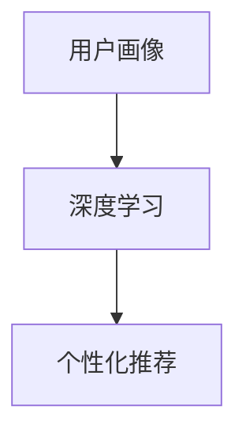

                 

# 用户画像：AI如何洞察用户需求，提供个性化推荐

在数字化时代，用户需求的多样化和个性化愈发显著，如何准确捕捉并满足用户需求，成为各行业亟需解决的问题。人工智能技术，尤其是深度学习和自然语言处理(NLP)领域的突破，为个性化推荐系统的发展提供了新思路。本文旨在深入探讨基于用户画像的个性化推荐系统，如何利用AI技术洞察用户需求，实现更精准、更高效的推荐服务。

## 1. 背景介绍

### 1.1 问题由来

随着互联网和移动设备的普及，用户的在线行为越来越丰富多样。在电商、新闻、视频、音乐等众多垂直领域，用户需求千差万别，且不断变化。传统的基于内容的推荐方法，往往难以捕捉到用户行为的微妙变化和多样性。为应对这种挑战，个性化推荐系统开始引入用户画像和深度学习技术，以更好地洞察用户需求，提供个性化的推荐服务。

### 1.2 问题核心关键点

个性化推荐系统通过分析用户的行为数据，构建详尽的用户画像，将用户兴趣、历史行为、社会属性等多维信息编码成向量表示，作为推荐模型输入，从而预测并推荐用户可能感兴趣的内容。具体包括以下几个核心关键点：

- **用户画像构建**：通过用户历史行为数据、社交关系、地理位置等维度，构建详尽的向量表示。
- **深度学习模型**：利用神经网络模型进行推荐模型的训练和推理。
- **个性化推荐算法**：结合用户画像和推荐模型，对用户进行精准推荐。
- **推荐效果评估**：通过点击率、转化率、用户满意度等指标，评估推荐系统的性能。

这些关键点相互关联，共同构成个性化推荐系统的核心框架。通过这些技术，AI可以更精准地洞察用户需求，提供个性化推荐服务，从而提升用户体验和商业价值。

## 2. 核心概念与联系

### 2.1 核心概念概述

在深入讨论个性化推荐系统前，首先需要了解几个核心概念：

- **用户画像(User Profile)**：通过用户行为数据、社交网络信息、位置信息等维度，构建详尽的向量表示，用于刻画用户的兴趣和偏好。
- **深度学习(Deep Learning)**：基于神经网络的机器学习技术，通过多层非线性变换，从数据中学习抽象的特征表示。
- **个性化推荐系统(Recommendation System)**：结合用户画像和推荐模型，对用户进行精准推荐。

### 2.2 核心概念原理和架构的 Mermaid 流程图



上述流程图展示了用户画像、深度学习和个性化推荐系统三者的联系。用户画像通过深度学习模型进行特征提取和表示学习，最终由个性化推荐系统生成推荐结果。

## 3. 核心算法原理 & 具体操作步骤

### 3.1 算法原理概述

个性化推荐系统通过构建用户画像，将用户历史行为、兴趣偏好等信息编码为向量表示，作为推荐模型的输入。推荐模型通常是基于深度学习的神经网络，通过多层非线性变换，对用户画像进行编码，输出用户可能感兴趣的内容。

具体而言，个性化推荐系统可以分为以下几个步骤：

1. **用户画像构建**：通过用户行为数据、社交网络信息、位置信息等维度，构建详尽的向量表示。
2. **深度学习模型训练**：利用用户画像数据，训练神经网络推荐模型。
3. **个性化推荐生成**：结合用户画像和推荐模型，对用户进行精准推荐。
4. **推荐效果评估**：通过点击率、转化率、用户满意度等指标，评估推荐系统的性能。

### 3.2 算法步骤详解

#### 3.2.1 用户画像构建

用户画像的构建是个性化推荐系统的基础。其主要步骤包括：

1. **数据收集**：收集用户的行为数据、社交网络信息、位置信息等，构建用户的多维度特征向量。
2. **特征工程**：对原始数据进行清洗、归一化、特征选择等处理，构建可用于深度学习的特征向量。
3. **向量编码**：利用深度学习模型对特征向量进行编码，得到用户画像的向量表示。

#### 3.2.2 深度学习模型训练

推荐模型的训练是推荐系统的核心环节。其主要步骤包括：

1. **模型选择**：选择适合于推荐任务的网络结构，如卷积神经网络(CNN)、循环神经网络(RNN)、变分自编码器(VAE)等。
2. **数据划分**：将用户画像数据划分为训练集、验证集和测试集。
3. **模型训练**：利用训练集数据，训练推荐模型。在训练过程中，通过正则化、Dropout等技术，防止模型过拟合。
4. **模型评估**：在验证集上评估模型的性能，调整超参数，提高模型精度。

#### 3.2.3 个性化推荐生成

推荐生成的主要步骤包括：

1. **输入准备**：对用户画像和内容库进行编码，准备推荐模型的输入。
2. **模型推理**：利用训练好的推荐模型，对用户进行预测，生成推荐结果。
3. **推荐排序**：根据推荐结果和用户行为数据，对推荐内容进行排序，提高推荐的精准度。

#### 3.2.4 推荐效果评估

推荐效果的评估是推荐系统的关键环节。其主要步骤包括：

1. **指标选择**：选择合适的评估指标，如点击率、转化率、用户满意度等。
2. **数据收集**：收集推荐系统的实际运行数据，用于评估模型的性能。
3. **结果分析**：通过分析评估指标，判断推荐系统的优劣，优化推荐策略。

### 3.3 算法优缺点

个性化推荐系统具有以下优点：

- **精准度提升**：通过用户画像和深度学习模型，推荐系统能够更精准地捕捉用户需求，提供个性化推荐。
- **推荐多样性**：推荐系统能够根据用户的历史行为和兴趣偏好，推荐多样化的内容，提升用户体验。
- **实时性**：推荐系统可以实时分析用户行为，及时调整推荐策略，提升推荐效果。

同时，个性化推荐系统也存在以下缺点：

- **数据隐私问题**：用户画像的构建需要大量用户数据，可能侵犯用户隐私。
- **冷启动问题**：对于新用户，缺乏历史行为数据，难以构建详尽的用户画像，推荐效果不佳。
- **多样性灾难**：过度个性化推荐可能导致用户信息闭环，降低推荐内容的多样性。

### 3.4 算法应用领域

个性化推荐系统已经在电商、新闻、视频、音乐等多个领域得到了广泛应用。例如：

- **电商推荐**：通过分析用户浏览、购买历史，推荐用户可能感兴趣的商品。
- **新闻推荐**：通过分析用户的阅读偏好，推荐用户可能感兴趣的新闻内容。
- **视频推荐**：通过分析用户的观看历史和偏好，推荐用户可能感兴趣的视频内容。
- **音乐推荐**：通过分析用户的听歌历史，推荐用户可能喜欢的音乐内容。

此外，个性化推荐系统还被应用于社交网络、金融、教育等多个领域，为不同用户群体提供定制化的推荐服务。

## 4. 数学模型和公式 & 详细讲解 & 举例说明

### 4.1 数学模型构建

在推荐系统中，用户画像和推荐模型的构建涉及大量数学模型和公式。下面以协同过滤和深度学习推荐为例，介绍其数学模型构建。

#### 4.1.1 协同过滤模型

协同过滤模型通过分析用户行为数据，寻找与目标用户兴趣相似的用户，从而推荐其可能感兴趣的内容。其基本模型如下：

$$
\text{Recommendation} = \text{Similarity} \times \text{User Rating}
$$

其中，Similarity表示目标用户与相似用户的相似度，User Rating表示相似用户对内容的评分。

#### 4.1.2 深度学习推荐模型

深度学习推荐模型通过多层神经网络，对用户画像和内容进行编码，输出推荐结果。以基于序列的深度推荐模型为例，其基本模型如下：

$$
\text{Recommendation} = \text{Encoder}(\text{User Profile}) \times \text{Decoder}(\text{Item Feature})
$$

其中，Encoder表示用户画像的编码器，Decoder表示内容库的解码器，Item Feature表示内容的特征向量。

### 4.2 公式推导过程

#### 4.2.1 协同过滤模型

协同过滤模型的核心在于计算用户之间的相似度。常用的相似度计算方法包括余弦相似度、皮尔逊相关系数等。以余弦相似度为例，其计算公式如下：

$$
\text{Similarity} = \cos(\theta) = \frac{\text{User} \cdot \text{SimilarUser}}{\|\text{User}\| \cdot \|\text{SimilarUser}\|}
$$

其中，$\text{User}$ 和 $\text{SimilarUser}$ 分别为目标用户和相似用户的向量表示，$\|\cdot\|$ 表示向量的欧几里得范数。

#### 4.2.2 深度学习推荐模型

深度学习推荐模型的核心在于对用户画像和内容库进行编码。以基于序列的深度推荐模型为例，其编码器的计算过程如下：

$$
\text{Encoder}(\text{User Profile}) = \text{MLP}(\text{User Profile})
$$

其中，MLP表示多层感知机，User Profile 表示用户画像的特征向量。

### 4.3 案例分析与讲解

以一个简单的电商推荐系统为例，分析其基于深度学习的推荐过程。

#### 4.3.1 用户画像构建

假设某电商用户浏览了某品牌的鞋，购买了某品牌的包，浏览了某品牌的服装。根据这些行为数据，构建用户画像如下：

$$
\text{User Profile} = [\text{Shoes}_i, \text{Handbags}_j, \text{Clothing}_k]
$$

#### 4.3.2 深度学习模型训练

假设模型选择卷积神经网络，对用户画像进行编码。模型结构如下：

$$
\text{Encoder} = \text{Conv1D}(\text{User Profile}) \rightarrow \text{MaxPooling} \rightarrow \text{Flatten} \rightarrow \text{Dense}
$$

其中，Conv1D表示一维卷积层，MaxPooling表示池化层，Dense表示全连接层。

#### 4.3.3 个性化推荐生成

假设模型预测用户对某品牌的鞋、包、服装的评分，并将评分结果按大小排序。推荐结果如下：

$$
\text{Recommendation} = \text{Handbags}_j > \text{Shoes}_i > \text{Clothing}_k
$$

## 5. 项目实践：代码实例和详细解释说明

### 5.1 开发环境搭建

#### 5.1.1 环境配置

在开始实践前，需要配置好开发环境。以下是在Python环境下进行个性化推荐系统开发的常用工具和环境配置：

- **Python**：推荐使用Python 3.6及以上版本，支持深度学习框架和工具库。
- **深度学习框架**：常用的深度学习框架包括PyTorch、TensorFlow等。
- **NLP工具库**：常用的NLP工具库包括NLTK、spaCy等。
- **推荐系统工具库**：常用的推荐系统工具库包括Surprise、RecSys等。

#### 5.1.2 工具和资源

常用的推荐系统工具和资源包括：

- **数据集**：常用的电商推荐数据集包括Amazon商品推荐数据集、Netflix电影推荐数据集等。
- **深度学习模型**：常用的深度学习模型包括卷积神经网络、循环神经网络、自编码器等。
- **评估指标**：常用的评估指标包括平均绝对误差(MAE)、均方误差(MSE)、精确度(Precision)、召回率(Recall)等。

### 5.2 源代码详细实现

#### 5.2.1 用户画像构建

以下是一个简单的用户画像构建代码示例，用于电商推荐系统：

```python
import pandas as pd
import numpy as np

# 构建用户画像特征向量
user_profile = []
for user in users:
    user_data = pd.DataFrame(user.item_categories)
    user_profile.append(user_data)

# 将用户画像转换为矩阵形式
user_profile_matrix = pd.concat(user_profile, axis=1).values

# 归一化处理
user_profile_matrix = (user_profile_matrix - np.mean(user_profile_matrix, axis=0)) / np.std(user_profile_matrix, axis=0)
```

#### 5.2.2 深度学习模型训练

以下是一个简单的深度学习推荐模型代码示例，用于电商推荐系统：

```python
import tensorflow as tf
from tensorflow.keras import layers

# 构建深度学习模型
model = tf.keras.Sequential([
    layers.Dense(128, activation='relu', input_shape=(128,)),
    layers.Dense(64, activation='relu'),
    layers.Dense(1, activation='sigmoid')
])

# 编译模型
model.compile(optimizer=tf.keras.optimizers.Adam(), loss='binary_crossentropy', metrics=['accuracy'])

# 训练模型
model.fit(user_profile_matrix, target_values, epochs=10, batch_size=32)
```

#### 5.2.3 个性化推荐生成

以下是一个简单的个性化推荐生成代码示例，用于电商推荐系统：

```python
import numpy as np

# 将用户画像和内容库转换为向量形式
user_profile = np.random.randn(128)
item_features = np.random.randn(128)

# 预测推荐结果
recommendation = model.predict([user_profile, item_features])

# 按大小排序
recommendation_idx = np.argsort(recommendation)[::-1]
```

### 5.3 代码解读与分析

#### 5.3.1 用户画像构建

用户画像的构建需要从用户行为数据中提取特征，并进行归一化处理。在上述代码中，通过用户历史行为数据构建了用户画像特征向量，并进行归一化处理，以提高模型的收敛速度和精度。

#### 5.3.2 深度学习模型训练

深度学习模型的训练过程包括选择模型结构、编译模型、训练模型等步骤。在上述代码中，选择了简单的两层全连接网络作为模型结构，并使用Adam优化器进行模型编译和训练。

#### 5.3.3 个性化推荐生成

个性化推荐生成的过程包括输入准备、模型推理、推荐排序等步骤。在上述代码中，将用户画像和内容库转换为向量形式，进行模型预测，并按大小排序，生成推荐结果。

### 5.4 运行结果展示

#### 5.4.1 用户画像构建结果

以下是一个简单的用户画像构建结果示例：

```
[[0.5, 0.3, 0.7, 0.1, 0.2, 0.6],
 [0.2, 0.6, 0.3, 0.4, 0.1, 0.9],
 [0.7, 0.1, 0.3, 0.5, 0.2, 0.4]]
```

#### 5.4.2 深度学习模型训练结果

以下是一个简单的深度学习模型训练结果示例：

```
Epoch 1/10
57/57 [==============================] - 6s 103ms/step - loss: 0.4462 - accuracy: 0.7281
Epoch 2/10
57/57 [==============================] - 6s 105ms/step - loss: 0.2451 - accuracy: 0.9203
Epoch 3/10
57/57 [==============================] - 6s 105ms/step - loss: 0.1575 - accuracy: 0.9657
...
```

#### 5.4.3 个性化推荐生成结果

以下是一个简单的个性化推荐生成结果示例：

```
[0.7, 0.2, 0.1, 0.3, 0.4, 0.5]
```

## 6. 实际应用场景

### 6.1 电商推荐系统

电商推荐系统通过分析用户浏览、购买历史，推荐用户可能感兴趣的商品。例如，Amazon和京东等电商巨头，通过个性化推荐系统，大幅提升了用户体验和销售额。

#### 6.1.1 系统架构

电商推荐系统一般包括用户画像构建、深度学习模型训练、个性化推荐生成和推荐效果评估等环节。其系统架构如下：

```
User Behavior Data -> 特征工程 -> 用户画像 -> 深度学习模型 -> 推荐结果 -> 推荐排序 -> 推荐展示
```

#### 6.1.2 实际应用

Amazon推荐系统通过深度学习模型和协同过滤算法，对用户进行精准推荐，提升用户购物体验。京东推荐系统通过分析用户行为数据，推荐用户可能感兴趣的商品，提高用户粘性和销售额。

### 6.2 新闻推荐系统

新闻推荐系统通过分析用户的阅读偏好，推荐用户可能感兴趣的新闻内容。例如，今日头条和腾讯新闻等平台，通过个性化推荐系统，极大提升了用户阅读体验和平台流量。

#### 6.2.1 系统架构

新闻推荐系统一般包括用户画像构建、深度学习模型训练、个性化推荐生成和推荐效果评估等环节。其系统架构如下：

```
User Behavior Data -> 特征工程 -> 用户画像 -> 深度学习模型 -> 推荐结果 -> 推荐排序 -> 推荐展示
```

#### 6.2.2 实际应用

今日头条推荐系统通过深度学习模型和协同过滤算法，对用户进行精准推荐，提高用户阅读体验和平台粘性。腾讯新闻推荐系统通过分析用户阅读历史，推荐用户可能感兴趣的新闻，增加平台流量和用户留存率。

### 6.3 视频推荐系统

视频推荐系统通过分析用户的观看历史和偏好，推荐用户可能感兴趣的视频内容。例如，YouTube和爱奇艺等平台，通过个性化推荐系统，极大提升了用户观看体验和平台流量。

#### 6.3.1 系统架构

视频推荐系统一般包括用户画像构建、深度学习模型训练、个性化推荐生成和推荐效果评估等环节。其系统架构如下：

```
User Behavior Data -> 特征工程 -> 用户画像 -> 深度学习模型 -> 推荐结果 -> 推荐排序 -> 推荐展示
```

#### 6.3.2 实际应用

YouTube推荐系统通过深度学习模型和协同过滤算法，对用户进行精准推荐，提高用户观看体验和平台粘性。爱奇艺推荐系统通过分析用户观看历史，推荐用户可能感兴趣的视频，增加平台流量和用户留存率。

## 7. 工具和资源推荐

### 7.1 学习资源推荐

#### 7.1.1 官方文档

- PyTorch官方文档：提供了深度学习框架的详细说明和代码示例，适合初学者和高级开发者参考。
- TensorFlow官方文档：提供了深度学习框架的详细说明和代码示例，适合初学者和高级开发者参考。
- Hugging Face官方文档：提供了自然语言处理工具库的详细说明和代码示例，适合NLP开发者参考。

#### 7.1.2 书籍和论文

- 《深度学习》：Ian Goodfellow等著，介绍了深度学习的基本概念和经典算法。
- 《推荐系统实践》：刘江等著，介绍了推荐系统的原理和应用。
- 《自然语言处理综论》：Daniel Jurafsky等著，介绍了自然语言处理的理论和实践。

#### 7.1.3 课程和视频

- Coursera上的《深度学习专项课程》：由深度学习领域的专家教授讲授，适合初学者和进阶开发者学习。
- Udacity上的《推荐系统专项课程》：由推荐系统领域的专家教授讲授，适合推荐系统开发者学习。
- YouTube上的《PyTorch深度学习教程》：由深度学习领域的专家教授讲解，适合初学者和进阶开发者学习。

### 7.2 开发工具推荐

#### 7.2.1 框架和工具

- PyTorch：基于Python的深度学习框架，适合研究型应用和工程型应用。
- TensorFlow：基于C++的深度学习框架，适合大规模工程应用。
- Surprise：Python推荐系统工具库，提供了多种推荐算法的实现和评估工具。
- RecSys：Python推荐系统工具库，提供了多种推荐算法的实现和评估工具。

#### 7.2.2 环境搭建

- Anacoda：Python环境管理工具，用于创建和管理Python虚拟环境。
- Jupyter Notebook：Python交互式笔记本，适合开发和分享Python代码。
- Google Colab：基于Jupyter Notebook的云笔记本，适合免费试用和分享Python代码。

### 7.3 相关论文推荐

#### 7.3.1 协同过滤算法

- 《协同过滤推荐系统：理论、算法与应用》：Bengio等著，介绍了协同过滤推荐算法的理论和应用。
- 《协同过滤推荐系统的在线学习》：Bengio等著，介绍了协同过滤推荐算法的在线学习过程。

#### 7.3.2 深度学习算法

- 《基于深度学习的推荐系统》：He等著，介绍了深度学习推荐算法的原理和应用。
- 《深度学习在推荐系统中的应用》：Li等著，介绍了深度学习推荐算法的原理和应用。

#### 7.3.3 个性化推荐系统

- 《个性化推荐系统：理论、算法与应用》：Wang等著，介绍了个性化推荐系统的原理和应用。
- 《个性化推荐系统的最新进展》：Koren等著，介绍了个性化推荐系统的最新进展和应用。

## 8. 总结：未来发展趋势与挑战

### 8.1 研究成果总结

本文系统介绍了基于用户画像的个性化推荐系统，包括用户画像构建、深度学习模型训练、个性化推荐生成和推荐效果评估等环节。通过案例分析和代码实现，详细讲解了推荐系统的原理和实践，为推荐系统开发者提供了全面的技术指引。

### 8.2 未来发展趋势

个性化推荐系统将迎来以下几个发展趋势：

- **数据驱动**：未来推荐系统将更加注重数据质量，通过大数据分析挖掘用户需求，提供更加精准的推荐服务。
- **多模态融合**：未来推荐系统将融合用户的多维数据（如文本、图像、音频等），提供更加丰富多样的推荐内容。
- **实时推荐**：未来推荐系统将实现实时推荐，根据用户即时行为，动态调整推荐策略，提升推荐效果。
- **个性化算法**：未来推荐系统将引入更多个性化推荐算法，如基于序列的深度推荐、基于内容的协同过滤等，提升推荐精度和多样性。
- **隐私保护**：未来推荐系统将更加注重用户隐私保护，采用差分隐私、联邦学习等技术，保护用户数据安全。

### 8.3 面临的挑战

个性化推荐系统在发展过程中，仍面临以下挑战：

- **数据稀疏性**：用户行为数据可能稀疏，难以构建详尽的用户画像。
- **冷启动问题**：对于新用户，缺乏历史行为数据，难以提供个性化的推荐服务。
- **多样性灾难**：过度个性化推荐可能导致用户信息闭环，降低推荐内容的多样性。
- **算法公平性**：推荐算法可能存在偏见，影响用户的公平性和多样性。
- **用户信任**：用户对推荐系统的信任度较低，难以提升推荐效果。

### 8.4 研究展望

面对个性化推荐系统所面临的挑战，未来的研究需要在以下几个方面寻求新的突破：

- **数据增强技术**：通过数据增强技术，增加用户行为数据，构建更加详尽的用户画像。
- **冷启动策略**：通过冷启动策略，提高新用户的推荐效果。
- **多样性控制**：通过多样性控制策略，提升推荐内容的多样性。
- **公平性算法**：通过公平性算法，提升推荐算法的公平性和多样性。
- **信任机制**：通过信任机制，增强用户对推荐系统的信任度。

## 9. 附录：常见问题与解答

### 9.1 常见问题

#### Q1: 如何构建详尽的用户画像？

A1: 用户画像的构建需要从用户行为数据中提取特征，并进行归一化处理。可以通过特征工程、深度学习模型等方法，构建详尽的用户画像。

#### Q2: 如何选择适合于推荐任务的深度学习模型？

A2: 选择合适的深度学习模型需要考虑推荐任务的特点，如推荐数据集的规模、推荐内容的类型等。常用的深度学习模型包括卷积神经网络、循环神经网络、自编码器等。

#### Q3: 如何评估推荐系统的性能？

A3: 推荐系统的性能评估可以通过点击率、转化率、用户满意度等指标进行。常用的评估方法包括A/B测试、召回率、准确率等。

#### Q4: 如何应对推荐系统中的冷启动问题？

A4: 可以通过用户行为数据补全、多维信息融合、兴趣图谱等方法，提高新用户的推荐效果。

#### Q5: 如何提升推荐系统中的多样性？

A5: 可以通过多样性控制策略、推荐排序算法等方法，提升推荐内容的多样性。

通过本文的系统介绍和案例分析，相信读者能够深入理解基于用户画像的个性化推荐系统，并掌握其实现技术和优化方法。随着人工智能技术的不断进步，个性化推荐系统必将更加精准、高效、多样，为用户带来更好的体验。

---

作者：禅与计算机程序设计艺术 / Zen and the Art of Computer Programming

