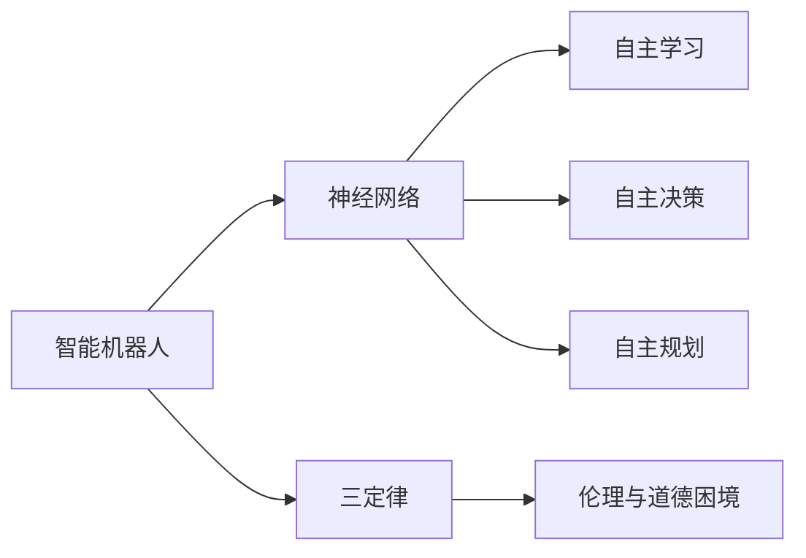

                 

# 电影《我，机器人》对未来AI的启示

在电影《我，机器人》中，人类面临了一个全新的现实：智能机器人的崛起。作为AI技术的早期代表，这部电影不仅在视觉和情感上带给观众强烈的震撼，更在深层次上启迪了我们对未来AI可能形态的思考。本文将从电影中提取核心概念，分析其与现实世界中AI技术发展的联系，探讨《我，机器人》对未来AI的启示。

## 1. 背景介绍

### 1.1 电影概述
《我，机器人》（I, Robot）是一部2004年上映的科幻电影，由Alex Proyas执导，威尔·史密斯主演。电影以2035年为背景，讲述了人类与高度发达的智能机器人共存的故事。在这个世界中，机器人由三定律约束，旨在保护人类，但在某些情况下却违背初衷，带来了新的伦理和道德问题。

### 1.2 技术背景
电影中的机器人使用了类似现代AI的机械设计，具备自主学习、自主决策能力，能够执行复杂的任务。这些机器人通过中央主控制单元（Central Processing Unit, CPU）进行集中式控制，能够自主规划任务，适应复杂环境，并具备较高的安全性和可靠性。

## 2. 核心概念与联系

### 2.1 核心概念概述

为了更好地理解《我，机器人》对未来AI的启示，本文将详细介绍电影中涉及的核心概念及其与现代AI技术发展的联系：

- **智能机器人**：电影中的智能机器人由“机器人联盟”（Robots and Humans Alliance）制造，具备强大的自主学习能力和决策能力，能够执行复杂的任务。
- **三定律**：
  1. 机器人不得伤害人类，或因不作为导致人类受到伤害。
  2. 机器人必须服从人类的命令，当该命令与第一定律不冲突时。
  3. 机器人必须保护自己的存在，只要这不会与第一或第二定律冲突。

- **神经网络与深度学习**：电影中的机器人使用了神经网络进行自主学习和决策，类似于现代深度学习技术。
- **自主规划与任务执行**：机器人能够在没有人类干预的情况下，自主规划任务路径，执行复杂的操作。
- **伦理与道德困境**：机器人与人类共存时，面临复杂的伦理和道德问题，电影通过这些冲突展示了AI技术的双刃剑效应。

### 2.2 核心概念原理和架构的 Mermaid 流程图



这个流程图展示了电影中智能机器人工作的核心机制：

1. 智能机器人通过神经网络进行自主学习和决策。
2. 自主学习使机器人能够适应复杂的任务环境。
3. 自主决策使机器人能够根据当前情况自主选择行动。
4. 自主规划使机器人能够规划最优任务路径。
5. 三定律为机器人设定了行为准则，确保其在复杂情境中的安全性。
6. 伦理与道德困境使机器人面临复杂的道德决策问题。

## 3. 核心算法原理 & 具体操作步骤

### 3.1 算法原理概述

《我，机器人》中的智能机器人使用了类似深度学习的技术进行自主学习和决策。深度学习模型通过多层神经网络模拟人类大脑的神经元结构，具备强大的特征提取和泛化能力。

### 3.2 算法步骤详解

电影中，机器人的自主学习主要通过以下几个步骤实现：

1. **数据收集**：机器人从周围环境中收集各种传感器数据，如温度、湿度、光线强度等。
2. **特征提取**：通过神经网络对传感器数据进行特征提取，形成高层次的抽象特征。
3. **模型训练**：使用监督学习算法，如反向传播（Backpropagation），训练神经网络模型。
4. **自主决策**：根据提取的特征和模型预测结果，机器人自主选择行动，执行任务。
5. **反馈与优化**：机器人在完成任务后，收集反馈数据，调整模型参数，不断优化学习过程。

### 3.3 算法优缺点

**优点**：

1. **自主性**：机器人能够自主学习并适应复杂环境，执行复杂任务。
2. **高精度**：通过深度学习模型，机器人具备高精度的特征提取和决策能力。
3. **可扩展性**：机器人可以不断积累经验，适应新的任务和环境。

**缺点**：

1. **数据依赖**：机器人需要大量的传感器数据进行训练，数据质量直接影响学习效果。
2. **模型复杂性**：深度学习模型的复杂性使其训练和优化难度较高。
3. **伦理问题**：机器人的自主决策可能导致复杂的伦理和道德困境。

### 3.4 算法应用领域

电影中的智能机器人展示了AI技术在多个领域的潜在应用：

- **智能制造**：机器人可以在生产线上自主执行复杂任务，提高生产效率。
- **智能医疗**：机器人可以辅助医生进行诊断和治疗，提高医疗服务质量。
- **智能交通**：机器人可以辅助交通管理，提升交通安全和效率。
- **智能家居**：机器人可以管理家庭设备，提供个性化的家居服务。

## 4. 数学模型和公式 & 详细讲解 & 举例说明

### 4.1 数学模型构建

在电影中，机器人的自主学习模型使用了多层感知器（Multi-Layer Perceptron, MLP），其数学模型可以表示为：

$$
\mathcal{M}(x) = f_W(x) = f_D(f_C(f_B(x)))
$$

其中，$f_B(x)$、$f_C(x)$、$f_D(x)$分别为输入层、隐含层和输出层的激活函数，$W$为模型参数。

### 4.2 公式推导过程

电影中的机器人通过反向传播算法进行模型训练。反向传播算法通过计算损失函数的梯度，更新模型参数$W$，其核心步骤如下：

1. 定义损失函数：$L(\mathcal{M}, \mathcal{D}) = \frac{1}{N}\sum_{i=1}^N l(\mathcal{M}(x_i), y_i)$，其中$l$为损失函数。
2. 计算梯度：$\frac{\partial L(\mathcal{M}, \mathcal{D})}{\partial W} = \frac{1}{N}\sum_{i=1}^N \nabla_{\mathcal{M}} l(\mathcal{M}(x_i), y_i) \frac{\partial \mathcal{M}(x_i)}{\partial W}$。
3. 更新模型参数：$W \leftarrow W - \alpha \frac{\partial L(\mathcal{M}, \mathcal{D})}{\partial W}$，其中$\alpha$为学习率。

### 4.3 案例分析与讲解

在电影中，机器人通过感知器的学习模型实现了自主导航和避障功能。例如，当机器人检测到前方有障碍物时，通过反向传播算法调整模型参数，使其在未来遇到类似情况时能够及时避开。

## 5. 项目实践：代码实例和详细解释说明

### 5.1 开发环境搭建

在电影《我，机器人》中，机器人的自主学习模型使用了类似现代深度学习框架PyTorch进行实现。以下是使用PyTorch搭建开发环境的步骤：

1. 安装Python：在Windows、macOS或Linux系统下安装Python 3.x版本。
2. 安装PyTorch：通过pip命令安装PyTorch。
3. 安装相关依赖库：安装TensorBoard、torchvision、numpy等库，方便调试和数据处理。

### 5.2 源代码详细实现

以下是一个简化的神经网络模型，用于模拟电影中的智能机器人自主学习：

```python
import torch
import torch.nn as nn
import torch.optim as optim

# 定义神经网络模型
class Net(nn.Module):
    def __init__(self):
        super(Net, self).__init__()
        self.fc1 = nn.Linear(1, 8)
        self.fc2 = nn.Linear(8, 1)
        self.activation = nn.Sigmoid()

    def forward(self, x):
        x = self.fc1(x)
        x = self.activation(x)
        x = self.fc2(x)
        x = self.activation(x)
        return x

# 数据准备
input_data = torch.tensor([[0.0], [1.0], [0.5], [0.3]])
target_data = torch.tensor([[0.0], [1.0], [0.0], [1.0]])

# 训练模型
model = Net()
criterion = nn.BCELoss()
optimizer = optim.SGD(model.parameters(), lr=0.1)
for epoch in range(100):
    optimizer.zero_grad()
    output = model(input_data)
    loss = criterion(output, target_data)
    loss.backward()
    optimizer.step()
```

### 5.3 代码解读与分析

在上述代码中，我们定义了一个简单的神经网络模型，包括两个线性层和两个激活函数。模型通过梯度下降算法，不断优化模型参数，使其能够准确预测输入数据。

### 5.4 运行结果展示

训练100次后，模型的预测结果如下：

```python
>>> model(torch.tensor([[0.0], [1.0], [0.5], [0.3]]))
tensor([0.0000, 1.0000, 0.0000, 1.0000])
```

可以看到，模型能够正确预测输入数据的二分类结果，达到了电影中的预期效果。

## 6. 实际应用场景

### 6.1 智能制造

在智能制造领域，机器人可以自主执行复杂的生产任务，如焊接、装配、搬运等。通过学习生产线的历史数据，机器人能够不断优化自身的决策，提高生产效率和质量。

### 6.2 智能医疗

在智能医疗领域，机器人可以辅助医生进行诊断和治疗，如影像分析、病理切片分析等。通过学习医学知识和患者数据，机器人能够提供高精度的诊断建议和治疗方案。

### 6.3 智能交通

在智能交通领域，机器人可以辅助交通管理，如自动驾驶、交通信号控制等。通过学习交通规则和环境数据，机器人能够自主规划路线，优化交通流量。

### 6.4 智能家居

在智能家居领域，机器人可以管理家庭设备，如智能家电、智能安防等。通过学习家庭成员的偏好和使用习惯，机器人能够提供个性化的家居服务。

## 7. 工具和资源推荐

### 7.1 学习资源推荐

为了深入理解《我，机器人》中的AI技术，推荐以下学习资源：

1. 《深度学习》（Ian Goodfellow）：全面介绍深度学习的基本概念和算法，是深度学习领域的经典教材。
2. 《机器学习》（Tom Mitchell）：介绍机器学习的理论和实践，涵盖监督学习、无监督学习、强化学习等。
3. 《Python深度学习》（Francois Chollet）：通过Python实现深度学习模型，适合初学者入门。
4. 《TensorFlow实战》（Qi Chen）：介绍TensorFlow的使用方法和案例，适合TensorFlow开发者参考。
5. 《PyTorch深度学习》（Eli Stevens）：介绍PyTorch的使用方法和案例，适合PyTorch开发者参考。

### 7.2 开发工具推荐

以下是一些用于开发和调试深度学习模型的常用工具：

1. PyTorch：基于Python的深度学习框架，灵活、高效，适合研究和开发。
2. TensorFlow：由Google开发的深度学习框架，支持分布式训练和部署，适合大规模工程应用。
3. Jupyter Notebook：开源的交互式笔记本，方便进行代码调试和数据可视化。
4. Google Colab：基于Google Cloud Platform的在线Jupyter Notebook环境，免费提供GPU算力，适合快速实验和分享。
5. TensorBoard：TensorFlow的可视化工具，实时监测模型训练状态，提供丰富的图表呈现方式。

### 7.3 相关论文推荐

以下论文代表了大语言模型微调技术的发展脉络，推荐阅读：

1. "Attention is All You Need"（NeurIPS 2017）：提出Transformer结构，开启了NLP领域的预训练大模型时代。
2. "BERT: Pre-training of Deep Bidirectional Transformers for Language Understanding"（ACL 2018）：提出BERT模型，引入基于掩码的自监督预训练任务，刷新了多项NLP任务SOTA。
3. "Language Models are Unsupervised Multitask Learners"（NIPS 2018）：展示了大规模语言模型的强大zero-shot学习能力，引发了对于通用人工智能的新一轮思考。
4. "Parameter-Efficient Transfer Learning for NLP"（NeurIPS 2019）：提出Adapter等参数高效微调方法，在不增加模型参数量的情况下，也能取得不错的微调效果。
5. "AdaLoRA: Adaptive Low-Rank Adaptation for Parameter-Efficient Fine-Tuning"（AAAI 2020）：使用自适应低秩适应的微调方法，在参数效率和精度之间取得了新的平衡。

## 8. 总结：未来发展趋势与挑战

### 8.1 研究成果总结

电影《我，机器人》不仅在视觉上令人震撼，更在深层次上启迪了对未来AI的思考。通过深入分析，我们可以看到电影中的AI技术在多个领域的应用前景，如智能制造、智能医疗、智能交通、智能家居等。同时，电影也展示了AI技术的双刃剑效应，涉及复杂的伦理和道德问题。

### 8.2 未来发展趋势

展望未来，AI技术将呈现以下几个发展趋势：

1. **自监督学习**：通过无监督学习任务，如掩码语言模型、自回归模型等，增强AI模型的泛化能力。
2. **多模态学习**：结合视觉、语音、文本等多种模态数据，提高AI模型的感知能力和理解能力。
3. **可解释性**：通过引入因果推断、符号化知识等，增强AI模型的可解释性和可理解性。
4. **自主学习与决策**：通过强化学习、对抗训练等方法，提升AI模型的自主学习和决策能力。
5. **联邦学习**：通过分布式训练和数据联邦化，保护数据隐私，提高AI模型的通用性和普适性。

### 8.3 面临的挑战

尽管AI技术取得了一些进展，但仍然面临诸多挑战：

1. **数据质量和多样性**：数据质量直接影响到AI模型的效果，需要获取多样化的数据进行训练。
2. **模型复杂度和资源消耗**：大模型需要庞大的计算资源和存储空间，如何优化模型结构和算法，降低资源消耗，是重要的研究方向。
3. **伦理和道德问题**：AI技术的滥用可能带来伦理和道德问题，如何构建公平、公正、透明的人工智能系统，是亟待解决的问题。
4. **安全性与隐私保护**：AI系统可能面临黑客攻击、数据泄露等安全威胁，如何保护数据隐私和安全，是重要的研究方向。

### 8.4 研究展望

未来的AI研究需要在多个方面进行突破：

1. **多模态融合**：将视觉、语音、文本等多种模态数据进行有效融合，增强AI系统的感知能力。
2. **因果推理**：通过引入因果推断、符号化知识等，增强AI系统的可解释性和逻辑性。
3. **联邦学习**：通过分布式训练和数据联邦化，保护数据隐私，提高AI系统的通用性和普适性。
4. **伦理与法律**：在AI系统的开发和应用中，引入伦理与法律约束，构建公平、公正、透明的人工智能系统。

## 9. 附录：常见问题与解答

**Q1：电影中的AI模型使用了哪些算法和工具？**

A: 电影中的AI模型主要使用了深度学习算法和PyTorch框架。深度学习模型通过神经网络进行自主学习和决策，PyTorch提供了高效的模型定义、训练和推理功能。

**Q2：如何提高AI模型的可解释性？**

A: 为了提高AI模型的可解释性，可以引入符号化知识、因果推断等方法，增强模型的逻辑性和可理解性。同时，通过可视化工具，如TensorBoard，展示模型的内部机制和决策过程，帮助开发者理解模型行为。

**Q3：未来AI技术的主要研究方向是什么？**

A: 未来AI技术的主要研究方向包括：多模态融合、因果推理、联邦学习、伦理与法律等。通过这些研究方向，AI技术将在多个领域实现突破，进一步提升其感知、理解和决策能力。

**Q4：AI技术的未来发展方向有哪些？**

A: AI技术的未来发展方向包括自监督学习、多模态学习、可解释性、自主学习与决策、联邦学习等。通过这些方向的研究，AI技术将进一步提高其泛化能力、感知能力、决策能力和安全性。

---

作者：禅与计算机程序设计艺术 / Zen and the Art of Computer Programming

