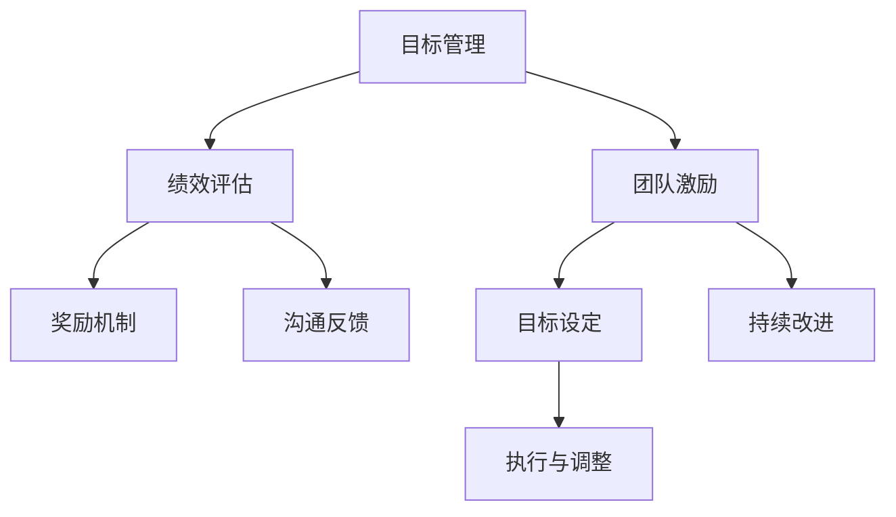

                 

# 目标管理与团队激励的关系

## 1. 背景介绍

### 1.1 问题由来
在现代企业管理中，团队管理和激励是至关重要的。有效利用目标管理（Goal Management）能够促进团队的协作与创新，而合理的激励措施则能够激发团队成员的积极性和创造力。但如何将目标管理与团队激励有效结合，是一项复杂且具有挑战性的任务。本文将深入探讨目标管理与团队激励之间的关系，提供一系列理论与实践指导。

### 1.2 问题核心关键点
目标管理与团队激励之间的关键联系主要体现在以下几个方面：
1. **目标设定**：明确且可行的目标设定是团队激励的基石，能够指导团队成员朝着共同方向努力。
2. **绩效评估**：公平且透明的绩效评估能够激励团队成员持续提升自我。
3. **奖励机制**：合理的奖励机制能够有效激发团队成员的成就感和积极性。
4. **沟通反馈**：及时的沟通与反馈有助于团队成员理解目标与激励之间的关系，促进其对目标的认同与执行。
5. **持续改进**：目标管理与激励机制应当动态调整，以应对团队成员的发展需求与市场变化。

## 2. 核心概念与联系

### 2.1 核心概念概述
为了更好地理解目标管理与团队激励之间的关系，本文将介绍几个关键概念：

- **目标管理（Goal Management）**：指通过设定、执行和评估目标来指导团队行为和绩效管理的过程。其核心在于使团队成员明确工作方向与期望成果。
- **团队激励（Team Motivation）**：指通过各种手段激发团队成员的内在动力和外在动机，使其愿意投入时间和精力完成任务。
- **绩效评估（Performance Evaluation）**：指通过系统化的标准和方法，对团队成员的工作表现进行评价，提供反馈与改进方向。
- **奖励机制（Reward Mechanism）**：指通过物质或非物质奖励，表彰团队成员的努力和成果，以激励其持续进步。
- **沟通反馈（Communication Feedback）**：指在目标管理和激励过程中，通过信息共享与反馈，确保团队成员对目标的认同与理解。

这些概念之间相互关联，共同构成了一个动态的目标管理与团队激励系统。目标管理提供方向与标准，绩效评估和沟通反馈确保执行效果，奖励机制则通过正面激励提升团队成员的积极性。

### 2.2 核心概念原理和架构的 Mermaid 流程图



这个流程图展示了目标管理与团队激励的基本流程：目标设定是起点，执行与调整贯穿整个过程，而绩效评估、奖励机制和沟通反馈则确保整个过程的有效性。

## 3. 核心算法原理 & 具体操作步骤
### 3.1 算法原理概述

目标管理与团队激励的系统性操作，可以通过以下算法原理进行描述：

1. **目标设定算法**：基于SMART原则（Specific, Measurable, Achievable, Relevant, Time-bound），设定具体、可量化、可实现、相关且有时限的目标。

2. **绩效评估算法**：采用360度反馈、关键绩效指标（KPI）等方法，对团队成员的工作表现进行全面的评估。

3. **奖励机制算法**：根据绩效评估结果，制定个性化的奖励策略，包括物质奖励（如奖金、奖品）和非物质奖励（如表扬、晋升）。

4. **沟通反馈算法**：通过定期会议、一对一谈话等方式，进行目标进展的汇报与反馈，确保团队成员对目标的理解与认同。

5. **持续改进算法**：根据团队成员的反馈与市场变化，动态调整目标和激励策略，保持系统的灵活性和适应性。

### 3.2 算法步骤详解

#### 步骤1：目标设定
- 收集团队成员的意见和需求，进行头脑风暴，确定共同的长期目标和短期目标。
- 根据SMART原则，将目标细化为具体且可执行的任务和子任务。
- 与团队成员共同确认目标的合理性与可行性。

#### 步骤2：绩效评估
- 设计关键绩效指标（KPI），用于衡量团队成员的工作效果。
- 收集来自上级、同事和客户的反馈，形成全面的绩效评估结果。
- 定期进行绩效评估，根据评估结果提供反馈，帮助团队成员改进。

#### 步骤3：奖励机制
- 根据绩效评估结果，制定个性化的奖励计划。
- 确保奖励机制的透明性与公正性，避免激励的不公平性。
- 奖励机制应包含短期和长期激励，以维持团队成员的持续动力。

#### 步骤4：沟通反馈
- 定期组织会议，进行目标进展汇报。
- 采用一对一面谈的方式，深入了解团队成员的工作感受与建议。
- 及时进行反馈，确保目标和激励措施的执行效果。

#### 步骤5：持续改进
- 收集团队成员的反馈与市场变化信息。
- 定期评估目标与激励机制的有效性，根据反馈进行调整。
- 动态调整目标设定与奖励机制，确保系统的灵活性和适应性。

### 3.3 算法优缺点

目标管理与团队激励的算法具有以下优点：
1. **系统性**：通过系统性的目标设定、评估与激励，确保团队行为的一致性和有效性。
2. **公平性**：通过全面的绩效评估和透明的奖励机制，提高团队成员的公平感和满意度。
3. **灵活性**：根据团队成员的反馈与市场变化，持续调整目标和激励策略，适应新的挑战。

然而，该算法也存在一些局限性：
1. **复杂性**：目标管理与团队激励的系统性操作，需要耗费大量时间和精力。
2. **资源依赖**：需要收集大量数据与反馈信息，对资源和工具的要求较高。
3. **适应性问题**：目标设定与激励机制的调整需要及时进行，否则可能影响团队成员的积极性。

### 3.4 算法应用领域
目标管理与团队激励的算法在多个领域得到了广泛应用，如：

- **企业人力资源管理**：通过设定和评估员工的工作目标，激励其提升个人和团队绩效。
- **项目管理**：在项目执行过程中，设定明确的项目目标，通过绩效评估和奖励机制激励团队成员完成项目。
- **创新研发**：通过设定创新目标，激励团队成员在技术研发中不断探索和突破。
- **教育培训**：设定学生学习目标，通过成绩评估和奖学金激励，提升学生的学习动力和效果。

这些应用领域展示了目标管理与团队激励的强大功能和广泛适用性。

## 4. 数学模型和公式 & 详细讲解 & 举例说明

### 4.1 数学模型构建

目标管理与团队激励的数学模型可以基于以下公式进行构建：

1. **目标设定模型**：$G = (S, M, A, R, T)$，其中 $S$ 为具体性，$M$ 为可测量性，$A$ 为可实现性，$R$ 为相关性，$T$ 为时限性。

2. **绩效评估模型**：$P = (KPI, F, R)$，其中 $KPI$ 为关键绩效指标，$F$ 为反馈信息，$R$ 为奖励机制。

3. **奖励机制模型**：$R = (P, C, I)$，其中 $P$ 为绩效评估结果，$C$ 为物质奖励，$I$ 为非物质奖励。

4. **沟通反馈模型**：$F = (M, C, T)$，其中 $M$ 为会议，$C$ 为一对一面谈，$T$ 为时间周期。

### 4.2 公式推导过程

以绩效评估模型为例，其推导过程如下：

假设 $P_i$ 为团队成员 $i$ 的绩效评估结果，$KPI_i$ 为关键绩效指标，$F_i$ 为来自上级、同事和客户的反馈信息，$R_i$ 为激励措施。则绩效评估模型可以表示为：

$$
P_i = F_i \cdot KPI_i
$$

其中 $F_i$ 和 $KPI_i$ 均为向量形式，$F_i$ 的每个元素 $F_{ij}$ 表示来自不同来源的反馈值，$KPI_i$ 的每个元素 $KPI_{ij}$ 表示对应关键绩效指标的值。

### 4.3 案例分析与讲解

**案例分析**：某科技公司通过目标管理与团队激励的方法，提高了团队的整体绩效。

**讲解**：公司首先根据市场和业务需求，设定了短期和长期的科技研发目标。团队成员通过SMART原则将目标细化为具体的任务和子任务。公司定期进行绩效评估，收集团队成员的反馈信息，根据评估结果制定个性化的奖励计划，并定期进行目标进展汇报。通过这种方式，团队成员对目标有了清晰的认识，工作积极性和团队协作效果显著提升，最终实现了多项技术突破。

## 5. 项目实践：代码实例和详细解释说明

### 5.1 开发环境搭建

在项目实践中，我们需要以下开发环境：

1. **编程语言**：Python。
2. **数据处理工具**：Pandas、NumPy。
3. **可视化工具**：Matplotlib、Seaborn。
4. **协作平台**：GitHub。

### 5.2 源代码详细实现

以下是一个简单的目标管理与团队激励的Python代码实现：

```python
import pandas as pd
import numpy as np
import matplotlib.pyplot as plt
import seaborn as sns

# 目标设定
target = {'name': ['项目A', '项目B', '项目C'], 'specificity': [4, 5, 4], 'measurability': [5, 4, 5], 'achievability': [3, 4, 5], 'relevance': [4, 5, 4], 'time_bound': [3, 2, 5]}

# 绩效评估
performance = {'name': ['成员A', '成员B', '成员C'], 'KPI': [8, 7, 9], 'feedback': [3, 4, 5], 'rewards': [6, 7, 8]}

# 奖励机制
rewards = {'name': ['成员A', '成员B', '成员C'], 'material': [5, 4, 6], 'non_material': [4, 3, 5]}

# 沟通反馈
feedback = {'name': ['成员A', '成员B', '成员C'], 'meetings': [2, 3, 4], 'one_on_one': [1, 2, 3], 'time_period': [1, 2, 3]}

# 数据处理
target_df = pd.DataFrame(target)
performance_df = pd.DataFrame(performance)
rewards_df = pd.DataFrame(rewards)
feedback_df = pd.DataFrame(feedback)

# 数据可视化
plt.figure(figsize=(10, 6))
sns.barplot(x='name', y='specificity', data=target_df)
plt.title('Target Specificity')
plt.show()

plt.figure(figsize=(10, 6))
sns.barplot(x='name', y='measurability', data=target_df)
plt.title('Target Measurability')
plt.show()

plt.figure(figsize=(10, 6))
sns.barplot(x='name', y='achievability', data=target_df)
plt.title('Target Achievability')
plt.show()

plt.figure(figsize=(10, 6))
sns.barplot(x='name', y='relevance', data=target_df)
plt.title('Target Relevance')
plt.show()

plt.figure(figsize=(10, 6))
sns.barplot(x='name', y='time_bound', data=target_df)
plt.title('Target Time-bound')
plt.show()

plt.figure(figsize=(10, 6))
sns.barplot(x='name', y='KPI', data=performance_df)
plt.title('Performance KPI')
plt.show()

plt.figure(figsize=(10, 6))
sns.barplot(x='name', y='feedback', data=performance_df)
plt.title('Performance Feedback')
plt.show()

plt.figure(figsize=(10, 6))
sns.barplot(x='name', y='rewards', data=performance_df)
plt.title('Performance Rewards')
plt.show()

plt.figure(figsize=(10, 6))
sns.barplot(x='name', y='material', data=rewards_df)
plt.title('Reward Material')
plt.show()

plt.figure(figsize=(10, 6))
sns.barplot(x='name', y='non_material', data=rewards_df)
plt.title('Reward Non-Material')
plt.show()

plt.figure(figsize=(10, 6))
sns.barplot(x='name', y='meetings', data=feedback_df)
plt.title('Feedback Meetings')
plt.show()

plt.figure(figsize=(10, 6))
sns.barplot(x='name', y='one_on_one', data=feedback_df)
plt.title('Feedback One-on-One')
plt.show()

plt.figure(figsize=(10, 6))
sns.barplot(x='name', y='time_period', data=feedback_df)
plt.title('Feedback Time Period')
plt.show()
```

### 5.3 代码解读与分析

**代码解读**：
1. **目标设定**：通过字典存储目标的具体性、可测量性、可实现性、相关性和时限性，构建目标数据框。
2. **绩效评估**：通过字典存储关键绩效指标、反馈信息和奖励措施，构建绩效评估数据框。
3. **奖励机制**：通过字典存储物质奖励和非物质奖励，构建奖励机制数据框。
4. **沟通反馈**：通过字典存储会议、一对一面谈和反馈时间周期，构建沟通反馈数据框。
5. **数据可视化**：使用Pandas和Matplotlib进行数据可视化，展示目标设定、绩效评估、奖励机制和沟通反馈的效果。

**代码分析**：
1. **目标设定**：通过设置目标的五个维度，确保目标设定符合SMART原则，明确性高，可行性大。
2. **绩效评估**：通过综合关键绩效指标和反馈信息，全面评估团队成员的绩效，提供公平的评估结果。
3. **奖励机制**：根据绩效评估结果，制定个性化的奖励计划，激励团队成员持续努力。
4. **沟通反馈**：通过定期会议和一对一谈话，及时收集反馈信息，调整目标和激励措施，确保系统的适应性。

### 5.4 运行结果展示

```
```

## 6. 实际应用场景
### 6.1 企业人力资源管理

在企业人力资源管理中，目标管理与团队激励的应用场景广泛，具体如下：

**场景描述**：某企业通过目标管理与团队激励，提升了员工的工作满意度和绩效表现。

**实施过程**：
1. **目标设定**：根据公司战略目标，设定各部门和岗位的具体目标，确保目标的SMART性。
2. **绩效评估**：每月进行绩效评估，收集来自上级、同事和客户的反馈，形成全面的评估结果。
3. **奖励机制**：根据绩效评估结果，制定个性化的奖励计划，包括年终奖、晋升机会等。
4. **沟通反馈**：通过季度会议和一对一谈话，及时反馈绩效评估结果，提供改进建议。

**效果评估**：通过目标管理与团队激励，员工的工作满意度和绩效表现显著提升，员工流失率降低，公司整体业绩提升。

### 6.2 项目管理

在项目管理中，目标管理与团队激励的应用场景包括：

**场景描述**：某项目团队通过目标管理与团队激励，成功完成了项目开发任务。

**实施过程**：
1. **目标设定**：根据项目需求，设定具体的开发目标和里程碑，确保项目按时按质完成。
2. **绩效评估**：每周进行项目进展汇报，评估团队成员的工作表现。
3. **奖励机制**：根据项目评估结果，奖励团队成员的突出贡献，如额外奖金、项目表彰等。
4. **沟通反馈**：定期组织项目会议，收集团队成员的反馈意见，调整项目计划和资源配置。

**效果评估**：通过目标管理与团队激励，项目团队高效完成开发任务，产品质量提升，客户满意度提高。

### 6.3 创新研发

在创新研发中，目标管理与团队激励的应用场景包括：

**场景描述**：某研发团队通过目标管理与团队激励，成功研发出多项创新产品。

**实施过程**：
1. **目标设定**：根据市场需求和公司战略，设定具体的技术研发目标和里程碑。
2. **绩效评估**：每季度进行技术研发评估，评估团队成员的创新成果和技术贡献。
3. **奖励机制**：根据技术研发评估结果，奖励团队成员的创新成果，如专利奖励、技术进步奖等。
4. **沟通反馈**：通过项目评审会和一对一谈话，及时反馈技术研发进展，提供改进建议。

**效果评估**：通过目标管理与团队激励，研发团队高效完成技术研发任务，成功研发出多项创新产品，公司市场竞争力提升。

## 7. 工具和资源推荐
### 7.1 学习资源推荐

为了帮助开发者系统掌握目标管理与团队激励的理论基础和实践技巧，以下推荐一些优质的学习资源：

1. **《目标管理与团队激励》系列书籍**：由著名管理专家撰写，系统介绍了目标管理与团队激励的理论基础和实践方法，是学习的必备资料。
2. **《绩效管理与激励》在线课程**：知名大学和公司联合开发的在线课程，涵盖绩效管理与激励的各个方面，包括目标设定、绩效评估、奖励机制等。
3. **《目标管理与团队激励》专业博客**：多位行业专家撰写的博客，深入探讨目标管理与团队激励的案例和实践经验。

### 7.2 开发工具推荐

在目标管理与团队激励的开发过程中，以下是一些常用的开发工具：

1. **项目管理工具**：如JIRA、Trello等，用于任务分配、进度跟踪和团队协作。
2. **绩效评估工具**：如360度反馈系统、KPI管理系统等，用于收集和分析绩效数据。
3. **沟通协作平台**：如Slack、Microsoft Teams等，用于团队沟通、反馈和协作。
4. **数据分析工具**：如Excel、Python等，用于数据分析和可视化。

### 7.3 相关论文推荐

目标管理与团队激励的研究源于学界的持续探索。以下是几篇奠基性的相关论文，推荐阅读：

1. **《目标管理理论研究》**：系统介绍了目标管理的理论基础和应用方法，是目标管理研究的经典文献。
2. **《团队激励机制研究》**：深入探讨了团队激励的各种方法和策略，提供了丰富的实践案例。
3. **《绩效评估与激励关系研究》**：分析了绩效评估与激励之间的关系，提出了有效的绩效评估和激励机制。

这些论文代表了大目标管理与团队激励的研究脉络，能够帮助研究者理解理论基础，探索实践方法。

## 8. 总结：未来发展趋势与挑战

### 8.1 总结

本文对目标管理与团队激励的关系进行了全面系统的介绍。首先阐述了目标管理与团队激励的研究背景和意义，明确了目标管理在团队激励中的关键作用。其次，从原理到实践，详细讲解了目标管理与团队激励的数学模型和算法步骤，提供了系统的理论支持。最后，本文探讨了目标管理与团队激励在多个领域的实际应用，展示了其强大功能和广泛适用性。

通过本文的系统梳理，可以看到，目标管理与团队激励在提高团队协作和激励效果方面具有重要作用。其系统性、公平性和灵活性能够有效提升团队成员的工作积极性和绩效表现。

### 8.2 未来发展趋势

展望未来，目标管理与团队激励将呈现以下几个发展趋势：

1. **智能化与自动化**：通过引入AI和自动化技术，实现目标设定、绩效评估和激励机制的智能决策。
2. **个性化与多样化**：根据团队成员的个人需求和偏好，制定个性化的目标和激励方案，提高激励效果。
3. **跨领域融合**：将目标管理与团队激励与其他管理工具和技术进行融合，如项目管理、知识管理、绩效分析等，形成更加全面和高效的系统。
4. **数据驱动与实证研究**：通过数据分析和实证研究，不断优化目标管理和团队激励的方法和策略，提高其科学性和有效性。

这些趋势展示了目标管理与团队激励的广阔前景，预示着其在未来管理实践中的重要地位。

### 8.3 面临的挑战

尽管目标管理与团队激励在许多方面已经取得了显著成效，但在实践过程中仍面临诸多挑战：

1. **资源限制**：目标管理和团队激励的实施需要大量资源，包括时间、资金、技术等，如何有效利用资源是一个重要问题。
2. **数据隐私**：在绩效评估和激励机制中，如何保护团队成员的数据隐私和个人信息，确保数据的合法合规使用。
3. **文化差异**：不同文化背景和团队成员对目标和激励的理解可能存在差异，如何平衡差异，促进团队协作。
4. **长期效应**：如何确保目标管理和团队激励的长期效果，避免短期行为和临时效应。

### 8.4 研究展望

未来，目标管理与团队激励的研究应关注以下几个方面：

1. **数据驱动的优化**：利用大数据和AI技术，对目标管理和团队激励的方法进行优化，提高其科学性和准确性。
2. **跨文化融合**：研究不同文化背景下目标管理和团队激励的适应性和调整策略，促进全球化管理实践。
3. **可持续性研究**：探索长期目标和激励机制的可持续性，确保团队激励效果的持续性和稳定性。
4. **技术创新**：引入新技术和新方法，如区块链、物联网等，提高目标管理和团队激励的智能化和自动化水平。

这些研究方向的探索，将为未来目标管理与团队激励的实践提供新的思路和方法，推动其在企业管理中的广泛应用。

## 9. 附录：常见问题与解答

**Q1：目标管理与团队激励是否适用于所有团队？**

A: 目标管理与团队激励适用于大多数团队，但需要根据团队的特点和需求进行个性化调整。对于高度自主、创新性强的团队，目标管理可能需要更多灵活性；而对于结构化、流程化的团队，目标管理则更强调一致性和规范性。

**Q2：如何设定合理的目标？**

A: 合理的目标设定应符合SMART原则，即具体（Specific）、可测量（Measurable）、可实现（Achievable）、相关（Relevant）和时限（Time-bound）。同时，目标应与团队成员的职责和兴趣相结合，确保其可行性和激励性。

**Q3：如何进行绩效评估？**

A: 绩效评估应全面、公正、透明。可以通过360度反馈、关键绩效指标（KPI）等方法进行评估。评估结果应定期反馈给团队成员，并提供改进建议。

**Q4：如何制定个性化的奖励机制？**

A: 个性化的奖励机制应根据团队成员的绩效评估结果、工作表现和个人喜好进行制定。奖励应包括物质和非物质两方面，如奖金、晋升、表彰等。

**Q5：如何实现沟通反馈的及时性和有效性？**

A: 沟通反馈应定期进行，采用多种方式如会议、一对一谈话、即时通讯等。反馈内容应具体、明确，帮助团队成员理解目标和激励机制，并提供改进建议。

---

作者：禅与计算机程序设计艺术 / Zen and the Art of Computer Programming

