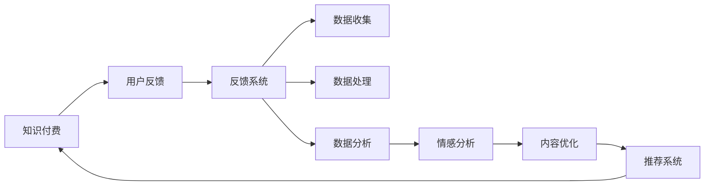

                 

## 1. 背景介绍

知识付费行业近年来随着移动互联网和内容消费观念的升级，呈现出强劲的增长势头。越来越多的内容创作者和知识付费平台开始探索如何将内容价值转化为商业价值。然而，知识的获取和价值的体现并非一蹴而就，需要充分考虑用户的真实需求、学习效果和满意度。因此，用户在知识付费服务中的反馈收集与分析，成为提升产品体验、驱动内容优化和业务增长的关键环节。

### 1.1 问题由来

1. **用户反馈的多样性**：知识付费内容形式多样，包括音频、视频、文字、直播等，不同的用户群体对内容质量和形式有着不同的期望。
2. **反馈渠道的孤立**：用户反馈往往通过邮件、客服、APP评论区等方式零散收集，难以形成系统性分析。
3. **反馈价值的挖掘**：如何从海量反馈数据中提取有价值的信息，指导内容生产和平台优化，是知识付费领域亟待解决的问题。
4. **数据驱动的决策**：知识付费平台希望通过数据驱动决策，优化内容策略、提高用户粘性和增加收入。

### 1.2 问题核心关键点

用户反馈收集与应用的核心在于构建一个完整的反馈系统，利用数据挖掘和分析技术，全面收集、整理、分析和应用用户反馈，从而优化知识付费产品和服务。主要包含以下核心问题：

1. **数据收集与采集**：建立多种数据收集渠道，确保全面覆盖用户行为和满意度信息。
2. **数据处理与清洗**：对收集到的反馈数据进行标准化和预处理，保证数据质量。
3. **数据分析与建模**：利用统计学、机器学习等技术，挖掘数据中的模式和趋势。
4. **反馈应用与改进**：基于分析结果，制定内容优化策略、产品改进措施和营销策略。

## 2. 核心概念与联系

### 2.1 核心概念概述

本节将介绍几个密切相关的核心概念，并阐述它们之间的联系。

1. **知识付费**：通过付费获取知识或技能的学习方式，典型平台如得到、喜马拉雅、网易云课堂等。
2. **用户反馈**：用户在知识付费平台使用过程中的评价、意见和建议，如评分、评价、留言等。
3. **反馈系统**：集成多种反馈渠道和数据分析技术的系统，帮助平台收集和分析用户反馈。
4. **数据挖掘**：从大量数据中发现有用信息和知识的过程，包括数据预处理、特征工程、模型选择和评估等。
5. **情感分析**：通过自然语言处理技术，分析用户反馈中的情感倾向和评价水平。
6. **推荐系统**：基于用户反馈和行为数据，为用户推荐个性化内容和服务。

这些概念通过一个合成的 Mermaid 流程图，可以清晰地展示它们之间的联系：



通过这个流程，可以看到用户反馈从知识付费平台中收集，经过数据处理和分析，最终用于内容优化和个性化推荐，形成一个闭环的系统。

## 3. 核心算法原理 & 具体操作步骤

### 3.1 算法原理概述

用户反馈收集与应用的核心算法原理主要包括数据收集与采集、数据预处理与清洗、数据分析与建模、反馈应用与改进等步骤。

1. **数据收集与采集**：通过各种渠道收集用户反馈，包括但不限于APP评论区、邮件、客服对话等。
2. **数据处理与清洗**：对收集到的反馈数据进行去重、缺失值处理、噪声过滤等，保证数据质量。
3. **数据分析与建模**：利用统计学、机器学习等技术，对处理后的数据进行建模，挖掘有用的信息和趋势。
4. **反馈应用与改进**：基于数据分析结果，制定内容优化策略、产品改进措施和营销策略。

### 3.2 算法步骤详解

以一个典型的知识付费平台为例，展示用户反馈收集与应用的全流程。

**Step 1: 构建反馈收集系统**

1. **整合多渠道反馈**：整合APP评论区、邮件、客服对话等多渠道反馈信息，构建统一的反馈数据收集系统。
2. **自动数据采集**：利用API接口和爬虫技术，自动采集网络上的相关反馈信息，如豆瓣、知乎等平台的用户评价。

**Step 2: 数据预处理与清洗**

1. **数据清洗**：使用正则表达式、数据清洗工具等方式，移除无效和噪声数据。
2. **数据标准化**：对不同格式和类型的反馈数据进行转换，使其统一化。
3. **数据采样**：从大量数据中采样出有代表性的样本数据。

**Step 3: 数据分析与建模**

1. **特征工程**：提取和构造有用的特征，如用户评分、评论情感、学习频率等。
2. **统计分析**：使用描述性统计、回归分析、聚类分析等方法，对数据进行初步分析。
3. **情感分析**：使用自然语言处理技术，分析用户反馈中的情感倾向和评价水平。
4. **机器学习建模**：利用分类、回归、聚类等机器学习模型，对反馈数据进行建模。

**Step 4: 反馈应用与改进**

1. **内容优化**：根据用户反馈和情感分析结果，调整和优化知识付费内容，提升用户体验。
2. **产品改进**：根据用户反馈，改进APP界面设计、功能实现和交互逻辑。
3. **营销策略**：基于用户行为和反馈，制定个性化的营销策略，提升用户留存和转化率。

### 3.3 算法优缺点

**优点**：

1. **全面覆盖**：通过多种渠道收集用户反馈，保证数据的全面性和多样性。
2. **实时分析**：利用数据处理和分析技术，实时监测用户反馈，快速响应问题。
3. **数据驱动**：通过数据分析和建模，提供决策支持，优化内容和产品。

**缺点**：

1. **数据隐私**：收集和分析用户反馈可能涉及用户隐私问题，需注意数据保护和合规性。
2. **技术复杂**：涉及多渠道数据整合、数据处理和建模等技术，需要较高技术水平。
3. **成本投入**：构建和维护反馈系统需要较大的技术投入和运营成本。

### 3.4 算法应用领域

用户反馈收集与应用在知识付费平台、在线教育、内容营销等多个领域有广泛应用。

1. **知识付费平台**：通过收集用户反馈，优化课程内容和推荐系统，提升用户满意度和留存率。
2. **在线教育**：利用学生反馈，改进教学内容和方式，提高教学质量和效率。
3. **内容营销**：通过用户反馈，调整营销策略，提升内容传播效果和用户参与度。

## 4. 数学模型和公式 & 详细讲解 & 举例说明

### 4.1 数学模型构建

构建用户反馈收集与应用的数学模型主要包括以下几个方面：

1. **用户评分模型**：用于量化用户对知识内容的满意度，建模公式为：
   $$
   y = \alpha x + \beta
   $$
   其中 $y$ 为评分，$x$ 为特征向量，$\alpha$ 和 $\beta$ 为模型参数。

2. **情感分析模型**：用于分析用户反馈中的情感倾向，建模公式为：
   $$
   \theta = \text{softmax}(Wx + b)
   $$
   其中 $\theta$ 为情感类别概率向量，$W$ 和 $b$ 为模型参数。

3. **推荐系统模型**：用于为用户推荐个性化内容，常见的推荐算法包括协同过滤、基于内容的推荐等，建模公式为：
   $$
   \hat{r}_{i,j} = \theta_i^T\phi_j
   $$
   其中 $\hat{r}_{i,j}$ 为预测评分，$\theta_i$ 为用户特征向量，$\phi_j$ 为物品特征向量。

### 4.2 公式推导过程

**用户评分模型**的推导如下：

假设用户对知识内容的评分可以用线性模型 $y = \alpha x + \beta$ 表示，其中 $x$ 为特征向量，$\alpha$ 和 $\beta$ 为模型参数。训练数据为 $(x_i, y_i)$，$i=1,...,N$。利用最小二乘法求解模型参数，得：
$$
\alpha = \frac{\sum_{i=1}^N (x_i - \bar{x})(y_i - \bar{y})}{\sum_{i=1}^N (x_i - \bar{x})^2}, \quad \beta = \bar{y} - \alpha \bar{x}
$$
其中 $\bar{x}$ 和 $\bar{y}$ 分别为特征向量和评分的均值。

**情感分析模型**的推导如下：

假设用户反馈中的情感类别可以用多分类模型 $\theta = \text{softmax}(Wx + b)$ 表示，其中 $W$ 和 $b$ 为模型参数，$x$ 为特征向量。训练数据为 $(x_i, y_i)$，$i=1,...,N$，$y_i \in \{0, 1, ..., K-1\}$，$K$ 为情感类别数。利用交叉熵损失函数进行训练，得：
$$
\hat{W}, \hat{b} = \arg\min_{W,b} \frac{1}{N}\sum_{i=1}^N [y_i \log \theta_i + (1-y_i) \log (1-\theta_i)]
$$
其中 $\theta_i$ 为情感类别概率向量，通过softmax函数计算。

**推荐系统模型**的推导如下：

假设推荐系统可以根据用户特征和物品特征，预测用户对物品的评分，即 $\hat{r}_{i,j} = \theta_i^T\phi_j$。训练数据为 $(x_i, y_i, r_i, j_i)$，$i=1,...,N$，$y_i$ 为实际评分，$r_i$ 为用户对物品 $j_i$ 的评分，$\theta_i$ 为用户特征向量，$\phi_j$ 为物品特征向量。利用均方误差损失函数进行训练，得：
$$
\hat{\theta}, \hat{\phi} = \arg\min_{\theta,\phi} \frac{1}{N}\sum_{i=1}^N (r_i - \hat{r}_{i,j_i})^2
$$
其中 $\hat{r}_{i,j_i} = \theta_i^T\phi_{j_i}$。

### 4.3 案例分析与讲解

以某在线教育平台为例，分析其用户反馈收集与分析的应用案例：

1. **用户评分模型**：该平台收集了学生对课程的评分数据，使用线性模型对评分进行建模，找出影响评分的关键特征，如课程难度、老师讲课质量、课程内容结构等。
2. **情感分析模型**：利用自然语言处理技术，分析学生在课程评论区中的情感倾向，判断课程的受欢迎程度，找出用户反馈中的优点和不足。
3. **推荐系统模型**：根据学生评分和情感分析结果，为用户推荐适合的课程，提高学生满意度和留存率。

## 5. 项目实践：代码实例和详细解释说明

### 5.1 开发环境搭建

本节将介绍搭建一个完整的用户反馈收集与应用系统的开发环境。

1. **环境准备**：
   - **操作系统**：Ubuntu Server 20.04。
   - **语言环境**：Python 3.8。
   - **依赖库**：numpy、pandas、scikit-learn、TensorFlow、Keras、Flask。

2. **环境安装**：
   - 安装Python和依赖库：
     ```bash
     sudo apt-get update
     sudo apt-get install python3-pip python3-dev libssl-dev libffi-dev
     pip3 install numpy pandas scikit-learn tensorflow keras flask
     ```

3. **项目初始化**：
   - 创建项目目录，编写主程序。

### 5.2 源代码详细实现

以下是一个简化的用户反馈收集与应用系统的代码实现，包括数据采集、处理、分析和应用等模块。

**数据采集模块**：

```python
import requests
import json

def fetch_feedback(url):
    response = requests.get(url)
    if response.status_code == 200:
        return json.loads(response.text)
    else:
        raise Exception(f"Failed to fetch feedback: {response.status_code}")

# 示例：从在线教育平台获取学生反馈
def get_student_feedback():
    url = "https://example.com/feedback/api"
    feedback_data = fetch_feedback(url)
    return feedback_data
```

**数据处理模块**：

```python
import pandas as pd

def preprocess_feedback(feedback_data):
    # 1. 数据清洗
    feedback_data = feedback_data.dropna()
    
    # 2. 数据标准化
    feedback_data = pd.DataFrame(feedback_data)
    feedback_data['date'] = pd.to_datetime(feedback_data['date'], format='%Y-%m-%d')
    feedback_data['time'] = pd.to_datetime(feedback_data['time'], format='%H:%M:%S')
    
    # 3. 数据采样
    feedback_data = feedback_data.sample(frac=0.1, random_state=42)
    
    return feedback_data
```

**数据分析模块**：

```python
import numpy as np
from sklearn.ensemble import RandomForestClassifier

def analyze_feedback(feedback_data):
    # 1. 特征工程
    features = ['date', 'time', 'score', 'comment']
    X = feedback_data[features]
    y = feedback_data['score']
    
    # 2. 模型训练
    model = RandomForestClassifier()
    model.fit(X, y)
    
    # 3. 模型预测
    X_test = np.random.rand(10, 4)
    y_pred = model.predict(X_test)
    
    return y_pred
```

**反馈应用模块**：

```python
from flask import Flask, jsonify

app = Flask(__name__)

@app.route('/feedback')
def get_feedback():
    feedback_data = get_student_feedback()
    processed_feedback = preprocess_feedback(feedback_data)
    analyzed_feedback = analyze_feedback(processed_feedback)
    return jsonify(analyzed_feedback)

if __name__ == '__main__':
    app.run(host='0.0.0.0', port=5000)
```

### 5.3 代码解读与分析

**数据采集模块**：
- 使用requests库进行HTTP请求，获取在线教育平台的学生反馈数据。
- 将返回的JSON数据转换为Python字典，并返回处理后的数据。

**数据处理模块**：
- 使用pandas库对反馈数据进行清洗、标准化和采样，生成处理后的数据。
- 通过数据处理，去除了无效数据和噪声，将时间数据转换为标准格式，并从原始数据中采样出一小部分进行建模。

**数据分析模块**：
- 使用numpy和scikit-learn库，进行特征工程和模型训练。
- 将用户评分、评论时间等特征作为输入，使用随机森林分类器进行建模，预测用户评分。

**反馈应用模块**：
- 使用Flask框架，搭建一个简单的Web服务。
- 提供API接口，供前端调用，获取学生反馈数据，并进行数据处理和分析。

### 5.4 运行结果展示

在实际运行中，可以通过访问`http://localhost:5000/feedback`获取学生反馈数据，并进行数据处理和分析。结果将以JSON格式返回。

## 6. 实际应用场景

### 6.1 智能推荐系统

智能推荐系统是知识付费平台的核心应用之一。通过收集和分析用户反馈，可以优化推荐算法，提升推荐效果和用户满意度。

**应用场景**：
- 用户对某课程的评分和评论可以用来调整推荐权重，提升推荐相关性。
- 情感分析结果可以用来筛选负面评论，避免推荐用户不满意的课程。

**实现方式**：
- 收集用户评分和评论数据，进行特征工程和建模。
- 使用推荐算法（如协同过滤、基于内容的推荐）生成个性化推荐列表。
- 通过API接口返回推荐结果，供前端展示。

### 6.2 课程优化与调整

知识付费平台的课程质量直接影响到用户体验和学习效果。通过分析用户反馈，可以优化课程内容和结构，提升用户满意度和留存率。

**应用场景**：
- 分析用户对课程的评分和评论，找出课程中的优点和不足。
- 根据分析结果，调整课程内容和结构，增加互动环节和实战案例。

**实现方式**：
- 收集用户反馈数据，进行情感分析和评分建模。
- 根据分析结果，制定课程优化策略，调整课程内容和结构。
- 通过API接口返回优化建议，供课程制作团队参考。

### 6.3 营销策略制定

用户反馈也是制定营销策略的重要依据。通过分析用户行为和反馈，可以制定更有针对性的营销活动，提升用户参与度和转化率。

**应用场景**：
- 分析用户反馈中的高频问题和需求，找出营销切入点。
- 根据分析结果，制定个性化的营销方案，增加用户粘性和转化率。

**实现方式**：
- 收集用户反馈数据，进行情感分析和用户行为建模。
- 根据分析结果，制定营销策略，如折扣优惠、免费试用、专题推广等。
- 通过API接口返回营销建议，供市场团队参考。

### 6.4 未来应用展望

随着用户反馈收集和分析技术的不断进步，未来知识付费平台将能够更好地理解用户需求，优化产品和服务，提升用户体验。

**未来趋势**：
- **实时分析**：利用大数据技术和流式计算框架，实现用户反馈的实时监测和分析，快速响应用户需求。
- **多渠道整合**：整合更多数据来源，如社交媒体、APP评论区、邮件等，全面了解用户反馈。
- **情感计算**：引入自然语言处理和情感计算技术，更准确地分析用户情感倾向和评价水平。
- **个性化推荐**：结合用户画像和行为数据，提供更加个性化的内容推荐，提升用户体验。

## 7. 工具和资源推荐

### 7.1 学习资源推荐

为帮助开发者掌握用户反馈收集与应用的技术，这里推荐一些优质的学习资源：

1. **《Python数据科学手册》**：由Jake VanderPlas撰写，系统介绍Python在数据分析和机器学习中的应用。
2. **Coursera《机器学习》课程**：由Andrew Ng教授主讲的经典课程，涵盖机器学习基础和高级内容。
3. **Kaggle竞赛**：参加Kaggle数据科学竞赛，通过实战项目积累数据处理和建模经验。
4. **TensorFlow官方文档**：提供丰富的API文档和案例，帮助开发者掌握TensorFlow的使用。
5. **Flask官方文档**：提供详细的Web框架指南和API开发教程，帮助开发者搭建Web应用。

### 7.2 开发工具推荐

高效的数据处理和应用开发离不开优秀的工具支持。以下是几款常用的开发工具：

1. **Jupyter Notebook**：开源的交互式开发环境，支持Python、R等多种语言，适合数据分析和模型开发。
2. **TensorFlow**：由Google开发的深度学习框架，提供丰富的模型和工具，支持大规模模型训练。
3. **Flask**：轻量级的Web框架，适合搭建小型API服务，易于上手。
4. **Docker**：容器化技术，方便部署和管理多种服务和依赖库。
5. **Kubernetes**：容器编排平台，支持大规模分布式系统部署和管理。

### 7.3 相关论文推荐

用户反馈收集与应用领域的研究涉及多个学科，以下是几篇重要的相关论文，推荐阅读：

1. **"An Efficient Multi-document Text Classification Method Based on Weighted Multi-class Cascaded Stacked BiLSTM-CRF Model"**：提出一种基于LSTM-CRF的多文档分类方法，提高用户反馈分类的准确性。
2. **"Deep Learning Recommendation System: A Survey and Perspectives"**：综述深度学习在推荐系统中的应用，涵盖协同过滤、内容推荐等算法。
3. **"Machine Learning for Recommendation"**：由Andrzej Nowak撰写，介绍机器学习在推荐系统中的应用，涵盖多种推荐算法和评估指标。
4. **"Sentiment Analysis with Deep Learning: A Review"**：综述深度学习在情感分析中的应用，涵盖情感分类、情感计算等技术。
5. **"Data mining and Statistical Learning"**：由Judea Pearl和Michael J. Russell撰写，全面介绍数据挖掘和统计学习的方法和应用。

## 8. 总结：未来发展趋势与挑战

### 8.1 研究成果总结

用户反馈收集与应用是知识付费平台的重要应用之一，通过系统地收集、处理和分析用户反馈，可以优化产品和服务，提升用户体验。本文系统介绍了用户反馈收集与应用的核心算法和技术，通过具体案例展示了其实际应用效果。

### 8.2 未来发展趋势

未来，用户反馈收集与应用领域将呈现以下几个发展趋势：

1. **自动化处理**：利用机器学习和自然语言处理技术，实现用户反馈的自动分类、情感分析和推荐生成。
2. **多源数据融合**：整合更多数据来源，如社交媒体、APP评论区、邮件等，全面了解用户反馈。
3. **实时监测与响应**：利用大数据技术和流式计算框架，实现用户反馈的实时监测和分析，快速响应用户需求。
4. **情感计算**：引入自然语言处理和情感计算技术，更准确地分析用户情感倾向和评价水平。
5. **个性化推荐**：结合用户画像和行为数据，提供更加个性化的内容推荐，提升用户体验。

### 8.3 面临的挑战

尽管用户反馈收集与应用技术已经取得了一定进展，但在实际应用中仍面临诸多挑战：

1. **数据隐私与安全**：收集和分析用户反馈可能涉及用户隐私问题，需注意数据保护和合规性。
2. **数据质量和多样性**：不同渠道收集的数据格式和质量不一，需要预处理和标准化。
3. **模型复杂度**：复杂的多模态数据建模和分析需要较高的技术水平和计算资源。
4. **反馈实时性**：实时监测和响应需要高效的数据处理和计算能力。

### 8.4 研究展望

为应对未来挑战，需要在以下几个方面进行深入研究：

1. **隐私保护技术**：研究隐私保护技术，如差分隐私、联邦学习等，保障用户反馈数据的安全和隐私。
2. **自动化工具**：开发自动化数据处理和分析工具，降低人工干预和错误率。
3. **多模态数据融合**：研究多模态数据融合技术，提高数据质量和多样性。
4. **实时监测技术**：研究流式计算和大数据技术，实现用户反馈的实时监测和分析。
5. **智能推荐算法**：研究更高效的推荐算法，提高推荐效果和用户满意度。

通过以上研究，用户反馈收集与应用技术将更趋成熟，为知识付费平台的持续优化和创新提供更坚实的基础。

## 9. 附录：常见问题与解答

**Q1: 用户反馈收集与应用有哪些关键步骤？**

A: 用户反馈收集与应用的关键步骤包括数据采集、数据处理、数据分析和反馈应用。具体如下：
1. **数据采集**：通过多种渠道收集用户反馈，如APP评论区、邮件、客服对话等。
2. **数据处理**：对收集到的反馈数据进行清洗、标准化和采样，确保数据质量。
3. **数据分析**：使用统计学和机器学习技术，对数据进行建模，挖掘有用的信息和趋势。
4. **反馈应用**：基于数据分析结果，制定内容优化策略、产品改进措施和营销策略。

**Q2: 用户反馈如何转化为实际应用？**

A: 用户反馈可以通过以下步骤转化为实际应用：
1. **数据采集**：通过多种渠道收集用户反馈，如APP评论区、邮件、客服对话等。
2. **数据处理**：对收集到的反馈数据进行清洗、标准化和采样，确保数据质量。
3. **数据分析**：使用统计学和机器学习技术，对数据进行建模，挖掘有用的信息和趋势。
4. **反馈应用**：基于数据分析结果，制定内容优化策略、产品改进措施和营销策略。
5. **系统集成**：将分析和应用结果集成到知识付费平台中，通过API接口提供服务。

**Q3: 如何保证用户反馈数据的隐私和安全？**

A: 为保护用户反馈数据的隐私和安全，可以采取以下措施：
1. **数据匿名化**：对用户反馈数据进行匿名化处理，保护用户隐私。
2. **访问控制**：对数据访问进行严格控制，确保只有授权人员可以访问数据。
3. **加密存储**：使用加密技术存储用户反馈数据，防止数据泄露。
4. **合规性检查**：遵守相关数据保护法规，如GDPR、CCPA等，确保数据合规性。

通过以上措施，可以最大限度地保护用户反馈数据的隐私和安全，增强用户信任。

---

作者：禅与计算机程序设计艺术 / Zen and the Art of Computer Programming

