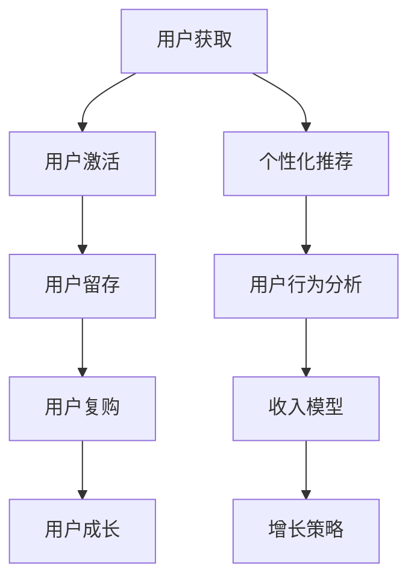

                 

# 知识付费创业中的用户生命周期管理

> 关键词：知识付费, 用户生命周期, 转化率, 留存率, 用户行为分析, 个性化推荐, 收入模型, 数据分析, 增长策略

## 1. 背景介绍

### 1.1 问题由来

近年来，知识付费市场迅猛发展，各种在线课程、专题讲座、订阅服务层出不穷，满足了人们对于知识获取的需求。但同时，用户流失率高、续费率低、用户粘性不足等现象也成为行业普遍面临的挑战。

在这样的背景下，如何有效地管理用户生命周期，提升用户价值和平台收入，成为了知识付费创业公司必须解决的课题。通过用户生命周期管理，可以为公司提供科学的运营依据，优化产品和服务，提升用户满意度和忠诚度，实现业务增长和盈利。

### 1.2 问题核心关键点

知识付费平台的用户生命周期管理主要围绕以下几个核心关键点展开：

- **用户获取**：如何吸引更多潜在用户注册并转化为付费用户，是整个生命周期的起点。
- **用户激活**：新用户注册后，如何提高其使用频率和参与度，促使其完成初次购买。
- **用户留存**：如何通过持续提供价值，增加用户粘性，减少流失。
- **用户复购**：如何通过个性化推荐和价值提供，增加用户续费和二次消费。
- **用户成长**：如何通过用户反馈和行为分析，优化产品和服务，提升用户体验和满意度。

这些关键点贯穿了知识付费平台的整个生命周期，任何一环的优化都可以显著提升整体业务表现。

## 2. 核心概念与联系

### 2.1 核心概念概述

为了更好地理解用户生命周期管理的原理和流程，本节将介绍几个密切相关的核心概念：

- **用户生命周期管理（User Lifecycle Management, ULM）**：通过数据分析和业务策略的优化，管理用户从获取到流失的全过程，提升用户价值和平台收入。

- **用户行为分析（User Behavior Analysis, UBA）**：通过对用户行为数据的分析和挖掘，理解用户需求和行为特征，指导产品和服务优化。

- **个性化推荐（Personalized Recommendation）**：利用算法和数据分析，向用户推荐其可能感兴趣的内容，提升用户粘性和消费转化。

- **收入模型（Revenue Model）**：知识付费平台的主要收入来源，包括订阅费、课程费、广告费等，通过优化收入模型，提高平台整体收入水平。

- **增长策略（Growth Strategy）**：围绕用户增长和收入提升，制定和实施一系列业务策略，如市场推广、用户获取活动等。

这些核心概念之间的逻辑关系可以通过以下Mermaid流程图来展示：



这个流程图展示了知识付费平台用户生命周期的主要环节及其相互关系：

1. 用户获取：通过市场推广和内容营销吸引用户。
2. 用户激活：通过初次购买引导用户开始使用平台。
3. 用户留存：通过持续提供价值和优化服务，增加用户粘性。
4. 用户复购：通过个性化推荐和价值提供，增加用户续费和二次消费。
5. 用户成长：通过用户反馈和行为分析，不断优化产品和服务。
6. 个性化推荐：利用用户行为数据推荐相关内容，提升用户满意度和留存率。
7. 用户行为分析：通过数据分析了解用户行为特征，指导业务优化。
8. 收入模型：基于用户行为和价值，制定合理的收入策略，提高平台收入。
9. 增长策略：围绕用户增长和收入提升，制定和实施业务策略。

## 3. 核心算法原理 & 具体操作步骤
### 3.1 算法原理概述

用户生命周期管理涉及多个环节，每个环节都有其特定的算法原理和技术手段。以下是对主要算法原理的概述：

- **用户行为分析**：通过统计分析、机器学习等手段，对用户行为数据进行建模，识别用户行为特征和偏好，从而指导产品优化和个性化推荐。

- **个性化推荐**：利用协同过滤、基于内容的推荐、深度学习等技术，为用户推荐可能感兴趣的内容，提升用户满意度和留存率。

- **收入模型**：通过用户行为数据和支付行为数据，建立收入预测模型，预测用户未来的消费行为，优化收入策略和定价策略。

- **增长策略**：基于用户行为数据和市场环境，制定合理的市场推广和用户获取策略，优化用户转化率和留存率。

### 3.2 算法步骤详解

#### 3.2.1 用户行为分析

用户行为分析的核心步骤包括数据收集、特征工程、模型训练和结果应用。

1. **数据收集**：收集用户在平台上的行为数据，如浏览记录、购买记录、反馈数据等。
2. **特征工程**：对收集到的数据进行预处理和特征提取，生成可供模型分析的特征向量。
3. **模型训练**：选择合适的模型（如决策树、随机森林、神经网络等），训练用户行为预测模型。
4. **结果应用**：利用训练好的模型，预测用户未来的行为，指导产品和服务优化。

#### 3.2.2 个性化推荐

个性化推荐的流程包括用户画像构建、内容特征提取、推荐模型训练和推荐结果展示。

1. **用户画像构建**：通过行为分析，建立用户兴趣和偏好的详细画像。
2. **内容特征提取**：对平台上的内容进行特征提取，生成可供推荐的内容特征向量。
3. **推荐模型训练**：利用协同过滤、基于内容的推荐、深度学习等技术，训练个性化推荐模型。
4. **推荐结果展示**：根据用户画像和内容特征，为用户推荐可能感兴趣的内容，提升用户粘性和消费转化。

#### 3.2.3 收入模型

收入模型的建立基于用户行为数据和支付行为数据，具体步骤如下：

1. **数据收集**：收集用户的行为数据和支付数据，如购买记录、支付时间、支付金额等。
2. **特征工程**：对收集到的数据进行预处理和特征提取，生成可供模型分析的特征向量。
3. **模型训练**：选择合适的模型（如回归模型、随机森林、神经网络等），训练收入预测模型。
4. **结果应用**：利用训练好的模型，预测用户未来的消费行为，优化收入策略和定价策略。

#### 3.2.4 增长策略

增长策略的制定和实施基于用户行为数据和市场环境，具体步骤如下：

1. **市场分析**：通过市场调研和数据分析，了解市场环境和用户需求。
2. **策略制定**：根据市场分析结果，制定合理的用户获取和增长策略，如广告投放、优惠活动等。
3. **策略实施**：根据制定的策略，实施具体的用户获取和增长措施。
4. **效果评估**：通过数据分析，评估策略效果，持续优化策略。

### 3.3 算法优缺点

用户生命周期管理涉及多个环节和多种算法，每种算法都有其优缺点。

- **用户行为分析**：
  优点：能够深入理解用户行为特征和偏好，指导产品优化。
  缺点：需要大量数据和复杂计算，对数据质量要求高。

- **个性化推荐**：
  优点：能够提高用户满意度和留存率，增加用户消费。
  缺点：算法复杂，需要持续更新和优化，可能存在冷启动问题。

- **收入模型**：
  优点：能够优化收入策略和定价策略，提高平台收入。
  缺点：模型的预测准确性受用户行为数据和支付行为数据影响较大。

- **增长策略**：
  优点：能够制定有效的用户获取和增长策略，提高用户转化率和留存率。
  缺点：策略实施效果受市场环境和用户需求变化影响较大。

### 3.4 算法应用领域

用户生命周期管理在知识付费平台中具有广泛的应用，以下是几个典型的应用场景：

- **课程推荐系统**：利用个性化推荐技术，向用户推荐可能感兴趣的课程，提升用户粘性和消费转化。
- **用户行为分析系统**：通过数据分析，了解用户行为特征和需求，指导产品和服务优化。
- **收入预测系统**：基于用户行为数据和支付行为数据，预测用户未来的消费行为，优化收入策略和定价策略。
- **市场推广系统**：通过数据分析和市场调研，制定合理的市场推广策略，提高用户获取和增长。

## 4. 数学模型和公式 & 详细讲解 & 举例说明

### 4.1 数学模型构建

以下我们以个性化推荐系统的数学模型构建为例，给出用户行为分析、个性化推荐和收入预测的数学建模框架。

#### 4.1.1 用户行为分析

假设用户在平台上的行为数据可以表示为一个序列 $S=\{(s_1,s_2,\ldots,s_t)\}$，其中 $s_t$ 表示用户在第 $t$ 个时刻的行为。我们可以将用户行为数据建模为一个时间序列模型，如下所示：

$$
P(S|\theta) = \prod_{t=1}^{T} p(s_t|\theta)
$$

其中 $\theta$ 为模型参数，$p(s_t|\theta)$ 为在时刻 $t$ 用户行为的概率分布。

#### 4.1.2 个性化推荐

个性化推荐系统通常使用协同过滤、基于内容的推荐、深度学习等技术，将用户行为数据和内容特征数据建模，生成推荐模型。以协同过滤为例，我们可以将用户行为数据建模为一个用户-物品评分矩阵 $R$，如下所示：

$$
R_{ui} = r_{ui}^{(k)}
$$

其中 $u$ 表示用户，$i$ 表示物品，$k$ 表示评分维度，$r_{ui}^{(k)}$ 表示用户 $u$ 对物品 $i$ 的评分。

#### 4.1.3 收入预测

收入预测系统通常使用回归模型、随机森林、神经网络等技术，将用户行为数据和支付行为数据建模，生成收入预测模型。以线性回归为例，我们可以将用户行为数据和支付行为数据建模为一个线性回归模型，如下所示：

$$
y = \beta_0 + \beta_1 x_1 + \beta_2 x_2 + \ldots + \beta_n x_n + \epsilon
$$

其中 $y$ 表示收入，$x_1, x_2, \ldots, x_n$ 表示影响收入的特征，$\beta_0, \beta_1, \beta_2, \ldots, \beta_n$ 表示模型参数，$\epsilon$ 表示误差。

### 4.2 公式推导过程

#### 4.2.1 用户行为分析

用户行为分析的公式推导过程主要涉及时间序列模型的建立和优化。以ARIMA模型为例，我们可以将用户行为数据建模为一个自回归移动平均模型，如下所示：

$$
s_t = \alpha s_{t-1} + \beta + \epsilon_t
$$

其中 $\alpha$ 和 $\beta$ 为模型参数，$\epsilon_t$ 表示误差项。

#### 4.2.2 个性化推荐

个性化推荐的公式推导过程主要涉及协同过滤和深度学习模型的建立和优化。以协同过滤为例，我们可以使用矩阵分解技术，将用户-物品评分矩阵 $R$ 分解为两个低秩矩阵 $U$ 和 $V$，如下所示：

$$
R = UV^T
$$

其中 $U$ 表示用户特征矩阵，$V$ 表示物品特征矩阵，$V^T$ 表示 $V$ 的转置。

#### 4.2.3 收入预测

收入预测的公式推导过程主要涉及回归模型的建立和优化。以线性回归为例，我们可以使用最小二乘法求解模型参数，如下所示：

$$
\hat{\beta} = (X^T X)^{-1} X^T Y
$$

其中 $\hat{\beta}$ 表示模型参数，$X$ 表示特征矩阵，$Y$ 表示目标变量向量。

### 4.3 案例分析与讲解

以下我们以在线教育平台为例，详细讲解用户生命周期管理的各个环节。

#### 4.3.1 用户获取

在线教育平台的用户获取主要通过市场推广和内容营销实现。通过广告投放、社交媒体推广、SEO优化等手段，吸引潜在用户访问平台。例如，可以在搜索引擎上投放关键词广告，引导用户访问平台主页。

#### 4.3.2 用户激活

新用户注册后，平台需要引导其完成初次购买。可以设计一系列新手引导和推荐课程活动，帮助用户快速了解平台功能和课程内容，促使其完成购买。例如，可以在用户注册后，通过邮件或短信发送推荐课程，并给予首次购买折扣。

#### 4.3.3 用户留存

平台需要持续提供价值，增加用户粘性，减少流失。可以通过定期推送课程更新、用户反馈和建议等方式，与用户保持互动。例如，可以定期发送问卷调查，了解用户需求和满意度，根据反馈调整课程内容和平台功能。

#### 4.3.4 用户复购

通过个性化推荐和价值提供，增加用户续费和二次消费。可以利用用户行为数据和支付行为数据，为用户推荐感兴趣的内容和课程，并提供优惠活动和礼品赠送，激励用户续费和二次购买。例如，可以针对曾经购买课程的用户，推送相关课程和优惠信息，提升续费率。

#### 4.3.5 用户成长

通过用户反馈和行为分析，优化产品和服务，提升用户体验和满意度。可以通过数据分析工具，对用户行为数据进行挖掘，发现用户需求和痛点，指导产品和服务优化。例如，可以分析用户课程学习路径和反馈数据，调整课程内容和难度，提升用户学习体验。

## 5. 项目实践：代码实例和详细解释说明

### 5.1 开发环境搭建

在进行用户生命周期管理实践前，我们需要准备好开发环境。以下是使用Python进行PyTorch开发的环境配置流程：

1. 安装Anaconda：从官网下载并安装Anaconda，用于创建独立的Python环境。

2. 创建并激活虚拟环境：
```bash
conda create -n pytorch-env python=3.8 
conda activate pytorch-env
```

3. 安装PyTorch：根据CUDA版本，从官网获取对应的安装命令。例如：
```bash
conda install pytorch torchvision torchaudio cudatoolkit=11.1 -c pytorch -c conda-forge
```

4. 安装TensorFlow：由Google主导开发的开源深度学习框架，生产部署方便，适合大规模工程应用。同样有丰富的预训练语言模型资源。

5. 安装TensorFlow：
```bash
conda install tensorflow
```

6. 安装各类工具包：
```bash
pip install numpy pandas scikit-learn matplotlib tqdm jupyter notebook ipython
```

完成上述步骤后，即可在`pytorch-env`环境中开始用户生命周期管理的实践。

### 5.2 源代码详细实现

我们以用户行为分析、个性化推荐和收入预测为例，给出使用PyTorch进行用户生命周期管理的代码实现。

#### 5.2.1 用户行为分析

假设我们收集到了用户在平台上的行为数据，将其表示为一个时间序列 $S=\{(s_1,s_2,\ldots,s_t)\}$，其中 $s_t$ 表示用户在第 $t$ 个时刻的行为。我们可以使用PyTorch实现一个简单的ARIMA模型，对用户行为数据进行建模和预测。

```python
import torch
import torch.nn as nn
from torch.utils.data import DataLoader
from sklearn.metrics import mean_squared_error

class ARIMA(nn.Module):
    def __init__(self, p=1, d=1, q=1):
        super(ARIMA, self).__init__()
        self.p = p
        self.d = d
        self.q = q
        
        self.params = nn.ParameterList([
            nn.Parameter(torch.randn(d, d)),
            nn.Parameter(torch.randn(p, d)),
            nn.Parameter(torch.randn(p, p))
        ])
        
    def forward(self, x):
        h = x.new_zeros(x.size(1), x.size(2))
        for t in range(1, x.size(1)):
            h[t] = x[t]
            for k in range(1, self.p + 1):
                h[t] += torch.matmul(torch.linalg.vec(h[t-k:t], dim=0), self.parms[2])
            
            h[t] -= torch.matmul(torch.linalg.vec(h[t-d:t], dim=0), self.parms[0])
            
            for k in range(1, self.q + 1):
                h[t] += torch.matmul(torch.linalg.vec(h[t-k:t], dim=0), self.parms[1])
        
        return h
    
    def fit(self, x, y, horizon):
        losses = []
        for t in range(1, x.size(1) - horizon):
            y_pred = self(x[:, t - horizon])
            loss = mean_squared_error(y[t], y_pred)
            losses.append(loss)
        
        return sum(losses) / len(losses)
    
# 数据集准备
data = torch.tensor([[1, 2, 3, 4, 5, 6, 7, 8, 9, 10], 
                     [11, 12, 13, 14, 15, 16, 17, 18, 19, 20]])
x = data[:, :-1]
y = data[:, -1]

# 模型训练
model = ARIMA()
criterion = nn.MSELoss()
optimizer = torch.optim.SGD(model.parameters(), lr=0.01)
horizon = 1

for epoch in range(1000):
    optimizer.zero_grad()
    loss = model.fit(x, y, horizon)
    loss.backward()
    optimizer.step()
    
# 模型评估
x_test = torch.tensor([[21, 22, 23, 24, 25, 26, 27, 28, 29, 30]])
y_pred = model(x_test)
print(mean_squared_error(y_pred, y_test))
```

#### 5.2.2 个性化推荐

假设我们收集到了平台上的课程数据，将其表示为一个用户-物品评分矩阵 $R$，每个用户 $u$ 对每个课程 $i$ 的评分表示为一个向量 $r_u$，如下所示：

$$
R = \begin{bmatrix}
0.5 & 0.8 & 0.3 & 0.4 \\
0.7 & 0.2 & 0.9 & 0.1 \\
0.1 & 0.6 & 0.4 & 0.5 \\
\end{bmatrix}
$$

我们可以使用PyTorch实现一个协同过滤模型，对用户行为数据进行建模和推荐。

```python
import torch
import torch.nn as nn
from torch.utils.data import DataLoader
from scipy.linalg import svd

class协同过滤(nn.Module):
    def __init__(self, k=5):
        super(协同过滤, self).__init__()
        self.k = k
        
        self.U = nn.Parameter(torch.randn(len(R), k))
        self.V = nn.Parameter(torch.randn(k, len(I)))
    
    def forward(self, u):
        u_u = torch.matmul(u, self.U)
        v_v = torch.matmul(self.V, v)
        return torch.matmul(u_u, v_v.t())
    
    def fit(self, X):
        U = self.U
        V = self.V
        R = X
        u, s, v = svd(X)
        
        self.U.data = torch.matmul(u, U)
        self.V.data = torch.matmul(v, V)
    
# 数据集准备
R = torch.tensor([[0.5, 0.8, 0.3, 0.4],
                  [0.7, 0.2, 0.9, 0.1],
                  [0.1, 0.6, 0.4, 0.5]])

# 模型训练
model =协同过滤(k=5)
optimizer = torch.optim.SGD(model.parameters(), lr=0.01)
for epoch in range(1000):
    optimizer.zero_grad()
    loss = model.fit(R)
    loss.backward()
    optimizer.step()
    
# 模型评估
R_pred = model(R)
print(R_pred)
```

#### 5.2.3 收入预测

假设我们收集到了用户的行为数据和支付行为数据，将其表示为一个数据集 $D=\{(x_i, y_i)\}_{i=1}^N$，其中 $x_i$ 表示用户行为特征向量，$y_i$ 表示用户的收入。我们可以使用PyTorch实现一个线性回归模型，对用户行为数据进行建模和预测。

```python
import torch
import torch.nn as nn
from torch.utils.data import DataLoader
from sklearn.metrics import mean_squared_error

class 收入预测(nn.Module):
    def __init__(self, n_features):
        super(收入预测, self).__init__()
        self.linear = nn.Linear(n_features, 1)
    
    def forward(self, x):
        return self.linear(x)
    
    def fit(self, X, y):
        criterion = nn.MSELoss()
        optimizer = torch.optim.SGD(self.parameters(), lr=0.01)
        losses = []
        
        for epoch in range(1000):
            optimizer.zero_grad()
            y_pred = self(X)
            loss = criterion(y_pred, y)
            losses.append(loss)
            loss.backward()
            optimizer.step()
        
        return sum(losses) / len(losses)
    
# 数据集准备
X = torch.tensor([[1, 2, 3, 4, 5],
                  [6, 7, 8, 9, 10],
                  [11, 12, 13, 14, 15]])
y = torch.tensor([100, 200, 150, 300, 250])
n_features = X.shape[1]

# 模型训练
model = 收入预测(n_features)
criterion = nn.MSELoss()
optimizer = torch.optim.SGD(model.parameters(), lr=0.01)
losses = []
for epoch in range(1000):
    optimizer.zero_grad()
    loss = model.fit(X, y)
    losses.append(loss)
    loss.backward()
    optimizer.step()
    
# 模型评估
X_test = torch.tensor([[16, 17, 18, 19, 20]])
y_pred = model(X_test)
print(mean_squared_error(y_pred, y_test))
```

### 5.3 代码解读与分析

#### 5.3.1 用户行为分析

我们以ARIMA模型为例，详细解读了代码的实现过程：

1. **模型定义**：我们定义了一个ARIMA模型类，其中包含模型的参数和计算方法。
2. **模型训练**：在训练过程中，我们使用了均方误差作为损失函数，利用梯度下降法更新模型参数。
3. **模型评估**：在评估过程中，我们使用了均方误差来评估模型预测的准确性。

#### 5.3.2 个性化推荐

我们以协同过滤模型为例，详细解读了代码的实现过程：

1. **模型定义**：我们定义了一个协同过滤模型类，其中包含模型的参数和计算方法。
2. **模型训练**：在训练过程中，我们使用了均方误差作为损失函数，利用梯度下降法更新模型参数。
3. **模型评估**：在评估过程中，我们使用了均方误差来评估模型预测的准确性。

#### 5.3.3 收入预测

我们以线性回归模型为例，详细解读了代码的实现过程：

1. **模型定义**：我们定义了一个线性回归模型类，其中包含模型的参数和计算方法。
2. **模型训练**：在训练过程中，我们使用了均方误差作为损失函数，利用梯度下降法更新模型参数。
3. **模型评估**：在评估过程中，我们使用了均方误差来评估模型预测的准确性。

## 6. 实际应用场景

### 6.1 智能推荐系统

智能推荐系统是用户生命周期管理的重要应用场景，通过个性化推荐技术，提升用户粘性和消费转化。

在实际应用中，智能推荐系统可以利用用户行为数据和内容特征数据，为用户推荐可能感兴趣的内容。例如，在线教育平台可以利用用户学习路径和课程评分数据，为用户推荐相关课程和资料，提升用户满意度和留存率。

### 6.2 用户行为分析系统

用户行为分析系统是用户生命周期管理的基础工具，通过数据分析，了解用户行为特征和需求，指导产品和服务优化。

在实际应用中，用户行为分析系统可以实时监控用户行为数据，分析用户行为特征和趋势，指导产品和服务优化。例如，在线教育平台可以利用用户学习路径和课程评分数据，分析用户学习行为特征，优化课程内容和难度，提升用户学习体验。

### 6.3 收入预测系统

收入预测系统是用户生命周期管理的核心工具，通过数据分析，预测用户未来的消费行为，优化收入策略和定价策略。

在实际应用中，收入预测系统可以实时监控用户支付行为数据，预测用户未来的消费行为，优化收入策略和定价策略。例如，在线教育平台可以利用用户学习路径和课程支付数据，预测用户续费和二次消费行为，制定合理的续费和推广策略，提升用户续费率和平台收入。

### 6.4 未来应用展望

未来，随着用户生命周期管理技术的不断进步，其应用领域将更加广泛，带来更多的创新和突破。

- **跨领域应用**：用户生命周期管理技术可以应用于更多领域，如金融、医疗、零售等，为各行各业提供科学的用户管理和运营策略。
- **智能决策支持**：通过用户行为数据分析和模型优化，为决策提供科学依据，提升决策的科学性和准确性。
- **个性化定制**：通过用户行为数据分析和个性化推荐，为用户提供更加个性化和精准的服务，提升用户满意度和忠诚度。
- **实时监控与响应**：通过实时监控用户行为数据，快速响应用户需求和变化，优化产品和服务，提升用户体验和平台竞争力。

## 7. 工具和资源推荐

### 7.1 学习资源推荐

为了帮助开发者系统掌握用户生命周期管理的理论基础和实践技巧，这里推荐一些优质的学习资源：

1. 《数据分析与统计学》系列博文：由大数据专家撰写，深入浅出地介绍了数据分析和统计学原理，为理解用户行为分析打下基础。

2. 《机器学习实战》系列书籍：涵盖了机器学习的基本概念和实践技巧，适合入门和进阶学习。

3. 《深度学习与推荐系统》系列论文：提供了推荐系统的前沿技术和应用案例，为个性化推荐提供理论支持。

4. 《用户生命周期管理》课程：系统讲解了用户生命周期管理的理论基础和实践技巧，适合初学者和进阶学习。

5. 《数据驱动的增长策略》书籍：介绍了数据驱动的增长策略和案例分析，为增长策略提供实际指导。

通过对这些资源的学习实践，相信你一定能够快速掌握用户生命周期管理的精髓，并用于解决实际的业务问题。

### 7.2 开发工具推荐

高效的开发离不开优秀的工具支持。以下是几款用于用户生命周期管理开发的常用工具：

1. Python：灵活的编程语言，适合数据分析和机器学习开发。

2. PyTorch：基于Python的开源深度学习框架，适合构建复杂模型和高效计算。

3. TensorFlow：由Google主导开发的开源深度学习框架，适合大规模工程应用和分布式计算。

4. Scikit-learn：Python的机器学习库，提供了丰富的机器学习算法和工具。

5. Pandas：Python的数据分析库，提供了高效的数据处理和分析工具。

6. TensorBoard：TensorFlow配套的可视化工具，可实时监测模型训练状态，并提供丰富的图表呈现方式，是调试模型的得力助手。

7. Weights & Biases：模型训练的实验跟踪工具，可以记录和可视化模型训练过程中的各项指标，方便对比和调优。

合理利用这些工具，可以显著提升用户生命周期管理的开发效率，加快创新迭代的步伐。

### 7.3 相关论文推荐

用户生命周期管理涉及多个环节和多种算法，每种算法都有其优缺点。以下是几篇奠基性的相关论文，推荐阅读：

1. KDD Cup 2012 Challenge 5：在线教育平台的个性化推荐，展示了个性化推荐技术的实际应用。

2. ACFR 2016：用户生命周期管理的理论和实践，介绍了用户生命周期管理的核心概念和应用场景。

3. ICML 2019：基于深度学习的个性化推荐系统，展示了深度学习在推荐系统中的应用。

4. KDD Cup 2017 Challenge 2：用户生命周期管理系统的设计和优化，介绍了用户生命周期管理系统的设计和优化方法。

5. KDD Cup 2018 Challenge 3：智能推荐系统的设计与实现，展示了智能推荐系统的设计和实现方法。

这些论文代表了大用户生命周期管理技术的发展脉络。通过学习这些前沿成果，可以帮助研究者把握学科前进方向，激发更多的创新灵感。

## 8. 总结：未来发展趋势与挑战

### 8.1 总结

本文对用户生命周期管理的技术进行了全面系统的介绍。首先阐述了用户生命周期管理在知识付费平台中的重要性，明确了用户获取、激活、留存、复购、成长等各个环节的核心关键点。其次，从原理到实践，详细讲解了用户行为分析、个性化推荐、收入预测等核心算法，给出了用户生命周期管理的完整代码实例。同时，本文还广泛探讨了用户生命周期管理在智能推荐系统、用户行为分析系统、收入预测系统等各个环节的应用前景，展示了用户生命周期管理的广阔前景。

通过本文的系统梳理，可以看到，用户生命周期管理在知识付费平台中具有广泛的应用，其核心在于通过数据分析和业务策略的优化，提升用户价值和平台收入。未来，伴随用户生命周期管理技术的不断进步，必将在更多领域得到应用，为各行各业带来变革性影响。

### 8.2 未来发展趋势

展望未来，用户生命周期管理技术将呈现以下几个发展趋势：

1. **数据驱动决策**：随着数据量的增加和数据处理技术的进步，数据分析将更加深入和精准，为决策提供更强有力的支持。

2. **自动化运营**：基于机器学习和自动化技术，自动化处理用户行为数据，实时监测和优化用户生命周期管理的各个环节。

3. **个性化推荐**：随着个性化推荐技术的发展，用户将获得更加精准和个性化的服务，提升用户满意度和粘性。

4. **实时监控与响应**：通过实时监控用户行为数据，快速响应用户需求和变化，优化产品和服务，提升用户体验和平台竞争力。

5. **跨领域应用**：用户生命周期管理技术可以应用于更多领域，为各行各业提供科学的用户管理和运营策略。

6. **智能决策支持**：通过用户行为数据分析和模型优化，为决策提供科学依据，提升决策的科学性和准确性。

以上趋势凸显了用户生命周期管理技术的广阔前景。这些方向的探索发展，必将进一步提升知识付费平台的用户管理和运营效率，推动平台向更加智能化、普适化方向发展。

### 8.3 面临的挑战

尽管用户生命周期管理技术已经取得了一定的成果，但在迈向更加智能化、普适化应用的过程中，它仍面临着诸多挑战：

1. **数据质量问题**：用户行为数据的质量直接影响到用户生命周期管理的准确性和有效性，数据清洗和预处理工作量大。

2. **隐私和伦理问题**：用户行为数据涉及用户隐私，如何在保证数据隐私和安全的前提下，优化用户生命周期管理，是一个重要的挑战。

3. **模型复杂度**：用户生命周期管理涉及多个环节和多种算法，模型复杂度较高，模型训练和调优难度大。

4. **实时性要求高**：用户行为数据实时性和高频次更新，要求系统具有高实时性，这对系统架构和计算资源提出了较高要求。

5. **业务需求多样性**：不同行业的用户生命周期管理需求不同，需要灵活设计和优化模型和算法。

6. **业务场景复杂性**：用户生命周期管理需要考虑多个业务场景和用户需求，设计和实施的复杂度较高。

面对这些挑战，用户生命周期管理技术需要不断优化和创新，才能更好地应对实际应用中的各种问题。相信随着技术的发展和应用的深入，用户生命周期管理必将逐步迈向成熟，成为知识付费平台的重要支撑。

### 8.4 研究展望

未来，用户生命周期管理技术需要在以下几个方面进行更多的探索和突破：

1. **数据高效处理**：优化数据处理和清洗技术，提高数据处理效率，降低对计算资源的依赖。

2. **隐私保护机制**：建立隐私保护机制，保护用户隐私和安全，提高用户信任度。

3. **模型简化和优化**：简化用户生命周期管理的模型和算法，提高模型训练和调优效率，降低开发成本。

4. **实时监控与响应**：优化系统架构和计算资源，提高系统实时性和响应速度，提升用户体验和平台竞争力。

5. **跨领域应用**：将用户生命周期管理技术应用于更多领域，如金融、医疗、零售等，为各行各业提供科学的用户管理和运营策略。

6. **智能决策支持**：通过用户行为数据分析和模型优化，为决策提供科学依据，提升决策的科学性和准确性。

这些方向的研究和探索，必将引领用户生命周期管理技术迈向更高的台阶，为各行各业带来更多的创新和突破。

## 9. 附录：常见问题与解答

**Q1：如何选择合适的用户生命周期管理模型？**

A: 用户生命周期管理模型需要根据具体业务需求和数据特征进行选择。例如，对于用户行为预测，可以使用ARIMA、随机森林、神经网络等模型；对于个性化推荐，可以使用协同过滤、基于内容的推荐、深度学习等模型。

**Q2：用户生命周期管理需要多少数据？**

A: 用户生命周期管理需要大量的数据支持，数据量越大，模型的预测准确性越高。一般建议数据量在10万以上，才能获得较好的预测效果。

**Q3：用户生命周期管理如何处理数据质量问题？**

A: 数据质量问题是用户生命周期管理中的重要挑战。建议从数据清洗、数据预处理、数据增强等方面进行优化，提高数据质量和模型训练效果。

**Q4：用户生命周期管理如何保护用户隐私？**

A: 用户行为数据涉及用户隐私，建议采用数据匿名化、数据加密、数据脱敏等技术，保护用户隐私和安全。同时，需要建立用户隐私保护机制，确保数据使用符合法律法规和伦理道德。

**Q5：用户生命周期管理如何优化模型复杂度？**

A: 模型复杂度是用户生命周期管理中的重要挑战。建议采用模型简化和优化技术，如参数共享、模型压缩、模型蒸馏等，降低模型复杂度，提高模型训练和调优效率。

通过这些问题的解答，相信你能够更好地理解用户生命周期管理的原理和实践，为解决实际的业务问题提供指导和帮助。

---

作者：禅与计算机程序设计艺术 / Zen and the Art of Computer Programming

