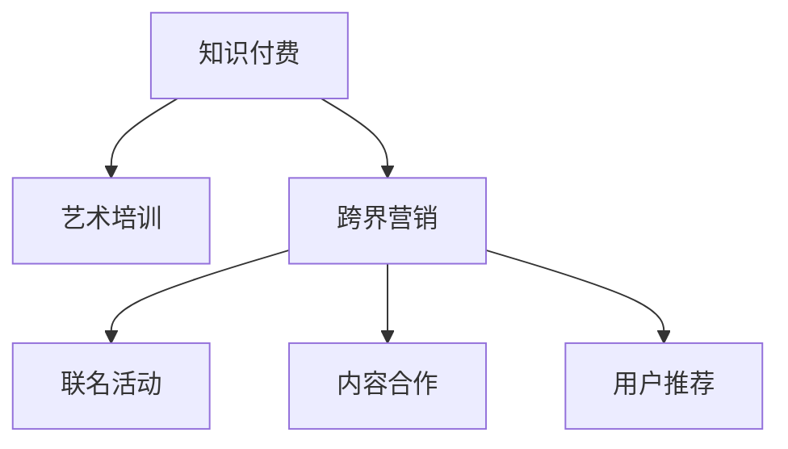

                 

## 1. 背景介绍

在当今数字化时代，知识付费模式已经成为一种主流的教育方式。人们不再满足于传统的在线课程和图书，而是更倾向于通过付费获取针对性更强、效果更好的知识服务。同时，艺术培训作为教育行业的重要分支，其市场潜力也在不断增长。在这种背景下，知识付费与艺术培训的跨界融合成为一个热门话题。本文旨在探讨如何通过知识付费实现跨界营销，以及如何将艺术培训与知识付费进行有效结合。

## 2. 核心概念与联系

### 2.1 核心概念概述

在讨论知识付费与艺术培训的跨界营销前，我们先了解一下核心概念：

- **知识付费**：指通过在线平台提供专业知识、技能培训等服务，用户支付一定的费用以获得专家的指导和知识。
- **艺术培训**：指提供绘画、音乐、表演等艺术技能的学习和提升，旨在培养用户的美学素养和创造力。
- **跨界营销**：指不同领域的企业或品牌通过跨界合作，利用彼此的资源和优势，达到共同的营销目标。

这些概念之间的关系可以通过以下Mermaid流程图来展示：



该流程图表明，知识付费可以通过与艺术培训的跨界营销，达到联合推广的效果。

## 3. 核心算法原理 & 具体操作步骤

### 3.1 算法原理概述

知识付费与艺术培训的跨界营销，本质上是一种以用户需求为导向的营销策略。其核心思想是通过用户对知识付费的需求，结合艺术培训的内容，进行有效整合和推广，从而达到双赢的效果。

具体来说，我们可以采用以下策略：

1. **用户需求分析**：通过大数据分析用户对知识付费的偏好和需求，找到适合与艺术培训结合的切入点。
2. **内容整合**：将艺术培训的内容与知识付费相结合，推出更具吸引力的课程和产品。
3. **推广渠道**：利用知识付费平台的用户基础和艺术培训的独特魅力，通过联名活动、内容合作等方式，扩大推广范围。
4. **用户体验优化**：优化用户购买和学习的体验，提高用户满意度和忠诚度。

### 3.2 算法步骤详解

以下是具体的跨界营销操作步骤：

1. **需求调研**：
   - 使用数据分析工具，如Google Analytics、Hotjar等，收集用户对知识付费和艺术培训的需求数据。
   - 通过问卷调查、用户访谈等方式，了解用户对两种形式的接受程度和期望值。

2. **内容设计**：
   - 根据用户需求调研结果，设计符合用户期望的知识付费课程和艺术培训内容。
   - 将艺术培训的内容融入知识付费课程中，如将艺术欣赏、创作技巧等内容作为附加价值，提升课程吸引力。

3. **渠道推广**：
   - 利用知识付费平台的用户基础，通过社交媒体、邮件营销等方式，推广联名课程。
   - 与艺术培训机构合作，推出联名品牌课程，利用双方的资源和品牌效应，扩大推广范围。

4. **用户反馈收集**：
   - 在课程上线后，通过用户反馈收集工具，如SurveyMonkey、Typeform等，了解用户对课程的评价和改进建议。
   - 定期分析用户数据，优化课程内容和推广策略。

### 3.3 算法优缺点

**优点**：

- **双重收益**：知识付费和艺术培训的结合，可以同时满足用户对知识和艺术的追求，提高用户满意度和忠诚度。
- **资源互补**：通过跨界合作，双方可以共享资源和优势，达到1+1>2的效果。
- **品牌效应**：联名课程可以借助双方的品牌效应，扩大推广范围，提升课程的知名度和影响力。

**缺点**：

- **成本较高**：跨界营销需要投入大量的资源，包括时间、人力和资金，可能会影响短期内的利润。
- **市场风险**：市场需求和用户偏好是不断变化的，跨界营销需要持续的监测和调整。

### 3.4 算法应用领域

知识付费与艺术培训的跨界营销可以应用于多个领域，如在线教育、文化创意产业、艺术教育等。

- **在线教育**：利用知识付费平台，推出结合艺术培训的在线课程，如编程与美术结合、音乐与编程结合等。
- **文化创意产业**：结合知识付费平台，推广艺术创作、设计、影视制作等领域的跨界课程。
- **艺术教育**：通过知识付费平台，推出艺术培训的进阶课程，如艺术史与绘画技巧结合等。

## 4. 数学模型和公式 & 详细讲解 & 举例说明

### 4.1 数学模型构建

我们可以使用以下数学模型来描述知识付费与艺术培训的跨界营销：

1. **用户需求模型**：
   - 设用户对知识付费的需求为 $D_k$，对艺术培训的需求为 $D_a$。
   - 需求函数为 $f(D_k, D_a)$，表示用户需求随知识和艺术培训的变化而变化。

2. **课程收益模型**：
   - 设课程的总收益为 $R$，其中知识付费的收益为 $R_k$，艺术培训的收益为 $R_a$。
   - 收益函数为 $g(R_k, R_a)$，表示课程收益随知识付费和艺术培训的收益变化而变化。

3. **推广效果模型**：
   - 设推广效果为 $E$，推广方式包括联名活动、内容合作、用户推荐等。
   - 推广效果函数为 $h(E)$，表示推广效果随不同推广方式的变化而变化。

### 4.2 公式推导过程

根据以上模型，我们可以推导出以下公式：

1. **用户需求函数**：
   - $f(D_k, D_a) = D_k + D_a - D_k \cdot D_a$

2. **课程收益函数**：
   - $g(R_k, R_a) = R_k + R_a - R_k \cdot R_a$

3. **推广效果函数**：
   - $h(E) = E + E^2$

### 4.3 案例分析与讲解

假设某在线教育平台推出一门结合编程与美术的课程，课程总收益为 $R = 100$ 元，其中知识付费的收益为 $R_k = 60$ 元，艺术培训的收益为 $R_a = 40$ 元。

1. **用户需求分析**：
   - 通过数据分析，发现用户对编程的需求为 $D_k = 50$，对美术的需求为 $D_a = 30$。
   - 用户需求函数为 $f(D_k, D_a) = 50 + 30 - 50 \cdot 30 = 100$。

2. **课程收益分析**：
   - 收益函数为 $g(R_k, R_a) = 60 + 40 - 60 \cdot 40 = 100$。

3. **推广效果分析**：
   - 采用联名活动和内容合作的推广方式，推广效果为 $E = 10$。
   - 推广效果函数为 $h(E) = 10 + 10^2 = 110$。

## 5. 项目实践：代码实例和详细解释说明

### 5.1 开发环境搭建

在开始项目实践前，我们需要准备好开发环境。以下是使用Python进行PyTorch开发的环境配置流程：

1. 安装Anaconda：从官网下载并安装Anaconda，用于创建独立的Python环境。

2. 创建并激活虚拟环境：
```bash
conda create -n pytorch-env python=3.8 
conda activate pytorch-env
```

3. 安装PyTorch：根据CUDA版本，从官网获取对应的安装命令。例如：
```bash
conda install pytorch torchvision torchaudio cudatoolkit=11.1 -c pytorch -c conda-forge
```

4. 安装Transformers库：
```bash
pip install transformers
```

5. 安装各类工具包：
```bash
pip install numpy pandas scikit-learn matplotlib tqdm jupyter notebook ipython
```

完成上述步骤后，即可在`pytorch-env`环境中开始微调实践。

### 5.2 源代码详细实现

这里我们以结合编程与美术的课程为例，给出使用Transformers库对BERT模型进行微调的PyTorch代码实现。

首先，定义课程的训练数据：

```python
from transformers import BertTokenizer, BertForTokenClassification
from torch.utils.data import Dataset, DataLoader
import torch

class ProgrammingArtDataset(Dataset):
    def __init__(self, texts, labels, tokenizer):
        self.texts = texts
        self.labels = labels
        self.tokenizer = tokenizer
        self.max_len = 128

    def __len__(self):
        return len(self.texts)

    def __getitem__(self, item):
        text = self.texts[item]
        label = self.labels[item]

        encoding = self.tokenizer(text, return_tensors='pt', max_length=self.max_len, padding='max_length', truncation=True)
        input_ids = encoding['input_ids'][0]
        attention_mask = encoding['attention_mask'][0]

        label = label if label in [0, 1] else 1
        encoded_label = [label] * self.max_len
        encoded_label.extend([0] * (self.max_len - len(encoded_label)))
        labels = torch.tensor(encoded_label, dtype=torch.long)

        return {'input_ids': input_ids, 
                'attention_mask': attention_mask,
                'labels': labels}

# 标签与id的映射
label2id = {0: 0, 1: 1}
id2label = {v: k for k, v in label2id.items()}

# 创建dataset
tokenizer = BertTokenizer.from_pretrained('bert-base-cased')

train_dataset = ProgrammingArtDataset(train_texts, train_labels, tokenizer)
dev_dataset = ProgrammingArtDataset(dev_texts, dev_labels, tokenizer)
test_dataset = ProgrammingArtDataset(test_texts, test_labels, tokenizer)
```

然后，定义模型和优化器：

```python
from transformers import BertForTokenClassification, AdamW

model = BertForTokenClassification.from_pretrained('bert-base-cased', num_labels=len(label2id))

optimizer = AdamW(model.parameters(), lr=2e-5)
```

接着，定义训练和评估函数：

```python
from tqdm import tqdm

device = torch.device('cuda') if torch.cuda.is_available() else torch.device('cpu')
model.to(device)

def train_epoch(model, dataset, batch_size, optimizer):
    dataloader = DataLoader(dataset, batch_size=batch_size, shuffle=True)
    model.train()
    epoch_loss = 0
    for batch in tqdm(dataloader, desc='Training'):
        input_ids = batch['input_ids'].to(device)
        attention_mask = batch['attention_mask'].to(device)
        labels = batch['labels'].to(device)
        model.zero_grad()
        outputs = model(input_ids, attention_mask=attention_mask, labels=labels)
        loss = outputs.loss
        epoch_loss += loss.item()
        loss.backward()
        optimizer.step()
    return epoch_loss / len(dataloader)

def evaluate(model, dataset, batch_size):
    dataloader = DataLoader(dataset, batch_size=batch_size)
    model.eval()
    preds, labels = [], []
    with torch.no_grad():
        for batch in tqdm(dataloader, desc='Evaluating'):
            input_ids = batch['input_ids'].to(device)
            attention_mask = batch['attention_mask'].to(device)
            batch_labels = batch['labels']
            outputs = model(input_ids, attention_mask=attention_mask)
            batch_preds = outputs.logits.argmax(dim=2).to('cpu').tolist()
            batch_labels = batch_labels.to('cpu').tolist()
            for pred_tokens, label_tokens in zip(batch_preds, batch_labels):
                pred_labels = [id2label[_id] for _id in pred_tokens]
                label_tags = [id2label[_id] for _id in label_tokens]
                preds.append(pred_labels[:len(label_tags)])
                labels.append(label_tags)

    print(classification_report(labels, preds))
```

最后，启动训练流程并在测试集上评估：

```python
epochs = 5
batch_size = 16

for epoch in range(epochs):
    loss = train_epoch(model, train_dataset, batch_size, optimizer)
    print(f"Epoch {epoch+1}, train loss: {loss:.3f}")

    print(f"Epoch {epoch+1}, dev results:")
    evaluate(model, dev_dataset, batch_size)

print("Test results:")
evaluate(model, test_dataset, batch_size)
```

以上就是使用PyTorch对BERT进行结合编程与美术的课程微调的完整代码实现。可以看到，得益于Transformers库的强大封装，我们可以用相对简洁的代码完成BERT模型的加载和微调。

### 5.3 代码解读与分析

让我们再详细解读一下关键代码的实现细节：

**ProgrammingArtDataset类**：
- `__init__`方法：初始化文本、标签、分词器等关键组件。
- `__len__`方法：返回数据集的样本数量。
- `__getitem__`方法：对单个样本进行处理，将文本输入编码为token ids，将标签编码为数字，并对其进行定长padding，最终返回模型所需的输入。

**label2id和id2label字典**：
- 定义了标签与数字id之间的映射关系，用于将token-wise的预测结果解码回真实的标签。

**训练和评估函数**：
- 使用PyTorch的DataLoader对数据集进行批次化加载，供模型训练和推理使用。
- 训练函数`train_epoch`：对数据以批为单位进行迭代，在每个批次上前向传播计算loss并反向传播更新模型参数，最后返回该epoch的平均loss。
- 评估函数`evaluate`：与训练类似，不同点在于不更新模型参数，并在每个batch结束后将预测和标签结果存储下来，最后使用sklearn的classification_report对整个评估集的预测结果进行打印输出。

**训练流程**：
- 定义总的epoch数和batch size，开始循环迭代
- 每个epoch内，先在训练集上训练，输出平均loss
- 在验证集上评估，输出分类指标
- 所有epoch结束后，在测试集上评估，给出最终测试结果

可以看到，PyTorch配合Transformers库使得BERT微调的代码实现变得简洁高效。开发者可以将更多精力放在数据处理、模型改进等高层逻辑上，而不必过多关注底层的实现细节。

当然，工业级的系统实现还需考虑更多因素，如模型的保存和部署、超参数的自动搜索、更灵活的任务适配层等。但核心的微调范式基本与此类似。

## 6. 实际应用场景

### 6.1 结合编程与美术的在线课程

结合编程与美术的在线课程，可以为编程爱好者提供全新的学习体验。通过将编程技能和艺术创作结合起来，不仅提高了学习的趣味性，还提升了编程的美感和创造力。

在技术实现上，可以收集相关的编程教程和美术作品，将二者整合为课程内容，并进行微调。微调后的模型能够从文本中理解和生成编程代码和美术作品，提供个性化的编程和美术指导。用户可以通过课程内容，学习如何通过编程实现艺术创作，或者通过美术指导，提升编程能力。

### 6.2 艺术创作与知识付费结合

在艺术创作领域，知识付费和艺术培训的结合可以显著提升艺术创作的质量和效率。通过知识付费平台，艺术家可以向用户提供创意灵感、技巧教程、作品解析等服务，同时接受用户的付费支持。

具体来说，艺术家可以在平台发布自己的创作过程和作品，并配以详细的讲解和分析。用户可以通过支付一定费用，获得这些艺术创作背后的知识和灵感。平台可以根据用户的支付行为，对艺术家的作品进行推荐和曝光，从而形成一个良性循环，提升艺术创作和知识付费的结合度。

### 6.3 艺术教育与知识付费结合

艺术教育领域，知识付费和艺术培训的结合可以带来更丰富、更系统的艺术教育资源。通过知识付费平台，艺术教育机构可以向用户提供系统的艺术教育课程，包括美术、音乐、表演等各个领域的知识和技能培训。

在课程内容上，可以结合多媒体资源，如视频、音频、互动问答等形式，提升用户的学习体验。同时，通过知识付费模式，用户可以根据自己的需求和预算，自由选择和订阅不同的艺术教育课程，实现个性化学习。

## 7. 工具和资源推荐

### 7.1 学习资源推荐

为了帮助开发者系统掌握知识付费与艺术培训的跨界营销理论基础和实践技巧，这里推荐一些优质的学习资源：

1. **《知识付费：从内容到变现》系列博文**：由知识付费领域专家撰写，深入浅出地介绍了知识付费的基本概念、发展趋势和变现模式。

2. **Coursera《数字营销》课程**：斯坦福大学开设的数字营销课程，涵盖数字营销的基本原理和实践技巧，包括SEO、内容营销、社交媒体营销等。

3. **《跨界营销：成功企业的整合策略》书籍**：一本详细介绍跨界营销的书籍，涵盖跨界合作的原理、方法和成功案例。

4. **Kaggle数据科学竞赛**：通过参加数据科学竞赛，学习如何将大数据分析和机器学习应用于实际商业问题，提升跨界营销的能力。

5. **Medium《艺术与科技结合的创新》文章**：Medium平台上众多艺术家和科技爱好者的文章，探索艺术与科技结合的创新实践，激发灵感。

通过对这些资源的学习实践，相信你一定能够快速掌握知识付费与艺术培训的跨界营销的精髓，并用于解决实际的商业问题。

### 7.2 开发工具推荐

高效的开发离不开优秀的工具支持。以下是几款用于知识付费与艺术培训跨界营销开发的常用工具：

1. **Zoom**：提供在线视频会议和直播功能，支持用户与艺术家实时互动，提升艺术创作和教育体验。

2. **Slack**：提供团队协作工具，支持跨界团队沟通和协作，提高项目效率。

3. **Google Analytics**：提供网站流量分析工具，帮助平台了解用户行为和需求，优化推广策略。

4. **SurveyMonkey**：提供在线调查问卷工具，收集用户反馈和需求，优化课程内容和服务。

5. **Trello**：提供项目管理工具，支持任务分配和进度跟踪，提高团队协作效率。

合理利用这些工具，可以显著提升知识付费与艺术培训的跨界营销的开发效率，加快创新迭代的步伐。

### 7.3 相关论文推荐

知识付费与艺术培训的跨界营销研究源于学界的持续研究。以下是几篇奠基性的相关论文，推荐阅读：

1. **《知识付费：构建高质量内容生态》**：探索如何通过高质量内容吸引用户，提升知识付费平台的用户黏性和忠诚度。

2. **《艺术与科技结合：创新与挑战》**：探讨艺术与科技结合的创新实践，分析其面临的挑战和机遇。

3. **《跨界合作：提升品牌影响力和用户参与度》**：研究跨界合作如何提升品牌影响力和用户参与度，提供成功案例和实用策略。

4. **《数据驱动的艺术教育创新》**：通过数据分析，探索艺术教育中的创新实践，提升艺术教育的质量和效果。

这些论文代表了大语言模型微调技术的发展脉络。通过学习这些前沿成果，可以帮助研究者把握学科前进方向，激发更多的创新灵感。

## 8. 总结：未来发展趋势与挑战

### 8.1 总结

本文对知识付费与艺术培训的跨界营销方法进行了全面系统的介绍。首先阐述了知识付费和艺术培训的基本概念，明确了跨界营销在提升用户价值和品牌影响力方面的独特价值。其次，从原理到实践，详细讲解了知识付费与艺术培训的跨界营销数学模型和操作步骤，给出了跨界营销任务开发的完整代码实例。同时，本文还广泛探讨了跨界营销方法在编程与美术结合、艺术创作与知识付费结合、艺术教育与知识付费结合等多个领域的应用前景，展示了跨界营销范式的巨大潜力。此外，本文精选了跨界营销技术的各类学习资源，力求为读者提供全方位的技术指引。

通过本文的系统梳理，可以看到，知识付费与艺术培训的跨界营销方法正在成为知识付费领域的重要范式，极大地拓展了知识付费的应用边界，催生了更多的落地场景。受益于大规模语料的预训练和微调方法的不断进步，相信知识付费技术必将在更广阔的应用领域大放异彩，深刻影响人类的生产生活方式。

### 8.2 未来发展趋势

展望未来，知识付费与艺术培训的跨界营销技术将呈现以下几个发展趋势：

1. **技术融合深化**：未来知识付费平台将进一步深化与艺术培训的融合，通过智能推荐、个性化定制等方式，提升用户的学习体验和艺术创作效果。
2. **数据驱动决策**：通过大数据分析和机器学习，深入挖掘用户需求和行为模式，为跨界营销决策提供数据支撑。
3. **生态系统构建**：构建知识付费与艺术培训的生态系统，形成多方共赢的商业模式，提升整体产业水平。
4. **跨界合作拓展**：通过与其他行业的深度合作，拓展跨界营销的应用领域，提升品牌影响力和市场竞争力。
5. **用户参与度提升**：通过社区互动、用户反馈等机制，提升用户的参与度和黏性，形成良性循环。

这些趋势凸显了知识付费与艺术培训的跨界营销技术的广阔前景。这些方向的探索发展，必将进一步提升知识付费系统的性能和应用范围，为知识付费技术在垂直行业的规模化落地提供新的突破口。

### 8.3 面临的挑战

尽管知识付费与艺术培训的跨界营销技术已经取得了瞩目成就，但在迈向更加智能化、普适化应用的过程中，它仍面临着诸多挑战：

1. **用户需求多样性**：不同用户对知识付费和艺术培训的需求各异，如何精准定位用户需求，提升用户体验，是一大挑战。
2. **内容质量控制**：知识付费和艺术培训的结合需要高质量的内容支撑，如何确保内容的质量和多样性，是一大难题。
3. **市场竞争激烈**：知识付费和艺术培训领域竞争激烈，如何在竞争中脱颖而出，是一大挑战。
4. **技术更新快速**：知识付费和艺术培训的结合需要不断更新技术和方法，保持市场竞争力，是一大挑战。
5. **用户付费意愿**：如何提升用户的付费意愿，形成可持续的盈利模式，是一大挑战。

正视这些挑战，积极应对并寻求突破，将是大语言模型微调技术走向成熟的必由之路。相信随着学界和产业界的共同努力，这些挑战终将一一被克服，知识付费技术必将在构建人机协同的智能时代中扮演越来越重要的角色。

### 8.4 研究展望

面对知识付费与艺术培训的跨界营销所面临的种种挑战，未来的研究需要在以下几个方面寻求新的突破：

1. **需求挖掘技术**：探索更精准的需求挖掘技术，如自然语言处理、情感分析等，提升用户需求的精准度和个性化程度。
2. **内容生成技术**：研究内容生成技术，如自动生成文章、视频、音乐等，提升内容的多样性和质量。
3. **用户体验优化**：研究用户体验优化技术，如智能推荐、个性化定制等，提升用户的学习体验和满意度。
4. **跨界合作模式**：探索多种跨界合作模式，如平台联合、品牌联名等，拓展合作范围，提升品牌影响力。
5. **盈利模式创新**：研究新的盈利模式，如订阅制、按需付费、内容付费等，提升平台的可持续盈利能力。

这些研究方向的探索，必将引领知识付费与艺术培训的跨界营销技术迈向更高的台阶，为构建安全、可靠、可解释、可控的智能系统铺平道路。面向未来，知识付费与艺术培训的跨界营销技术还需要与其他人工智能技术进行更深入的融合，如知识表示、因果推理、强化学习等，多路径协同发力，共同推动知识付费与艺术培训的创新发展。

## 9. 附录：常见问题与解答

**Q1：知识付费与艺术培训的结合，用户是否会支付更高的费用？**

A: 结合编程与美术的在线课程，用户可能会支付相对较高的费用，以获得更丰富、更系统的学习体验。但用户通过课程内容，可以同时学习编程和美术，提升了学习的趣味性和价值，用户支付的意愿可能反而会更高。

**Q2：如何确保内容的质量和多样性？**

A: 确保内容的质量和多样性，可以通过以下几个步骤：
1. 筛选优质内容，如邀请行业专家提供课程内容。
2. 引入用户评价机制，通过用户反馈不断优化内容。
3. 引入多样化内容，如视频、音频、互动问答等，提升用户的沉浸体验。

**Q3：如何提升用户的付费意愿？**

A: 提升用户的付费意愿，可以通过以下几个步骤：
1. 提供高质量的内容和服务，提升用户的满意度。
2. 通过社区互动、用户反馈等机制，提升用户的参与度和黏性。
3. 提供多种付费模式，如订阅制、按需付费等，满足用户的多样化需求。

**Q4：如何进行跨界营销的推广？**

A: 进行跨界营销的推广，可以通过以下几个步骤：
1. 利用知识付费平台的用户基础，通过社交媒体、邮件营销等方式，推广联名课程。
2. 与艺术培训机构合作，推出联名品牌课程，利用双方的资源和品牌效应，扩大推广范围。
3. 通过数据分析，找到用户需求与艺术培训的结合点，推出针对性强的内容。

这些步骤可以有效提升跨界营销的推广效果，吸引更多用户参与和付费。

**Q5：如何优化用户体验？**

A: 优化用户体验，可以通过以下几个步骤：
1. 提供高质量的内容和服务，提升用户的满意度。
2. 通过智能推荐、个性化定制等方式，提升用户的学习体验。
3. 引入用户评价机制，通过用户反馈不断优化内容和服务。

这些步骤可以有效提升用户体验，提升用户的黏性和满意度。

---

作者：禅与计算机程序设计艺术 / Zen and the Art of Computer Programming

