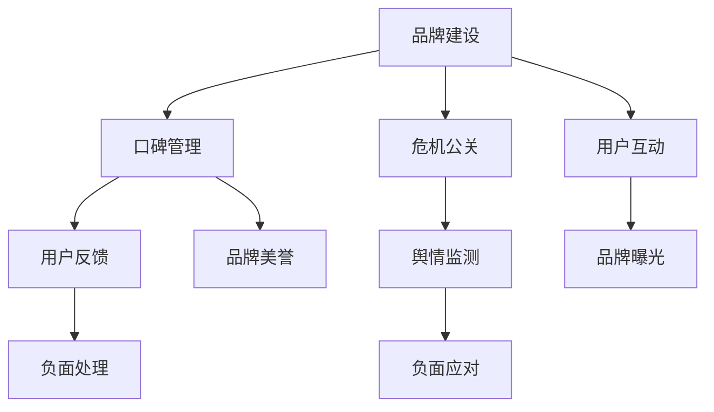
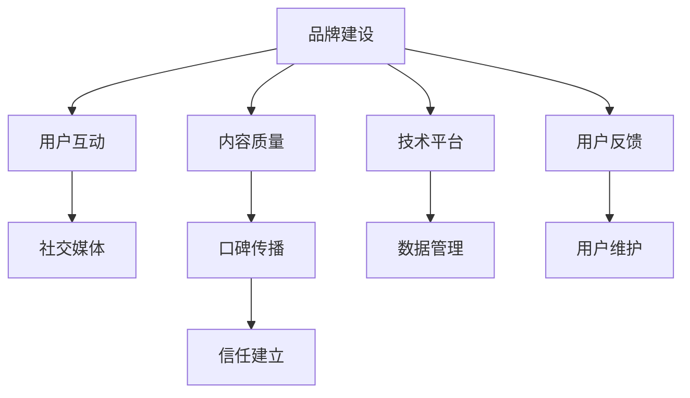

                 

# 知识付费赚钱的品牌口碑管理与危机公关

## 1. 背景介绍

随着知识付费行业的兴起，越来越多的机构和个人通过提供高价值内容获取收益。知识付费的品牌口碑管理和危机公关，直接影响到用户购买决策，关系到企业生存与发展。优秀的品牌口碑可以带来更高的转化率和复购率，而危机事件处理不当则可能带来巨大损失。

本文将从品牌建设、口碑管理、危机公关三个方面，详细阐述知识付费领域中这些核心任务的技术实现与实践案例。通过梳理相关流程、工具与资源，帮助企业提升品牌价值，增强用户粘性，构建安全可靠的知识付费生态系统。

## 2. 核心概念与联系

### 2.1 核心概念概述

在知识付费领域，品牌建设、口碑管理和危机公关是相互联系、互为补充的核心任务：

- **品牌建设**：指通过内容、用户互动、社交媒体推广等方式，建立品牌知名度和美誉度，树立品牌形象。
- **口碑管理**：涉及客户评论、评分、反馈等，通过监控、分析、反馈机制，管理用户对品牌或产品的评价。
- **危机公关**：面对负面评价、投诉等，及时响应、沟通、解决，避免品牌声誉受损。

以下 Mermaid 流程图展示了这三大任务之间的联系：



这三个任务共同作用，推动知识付费平台的可持续发展。

### 2.2 核心概念原理和架构的 Mermaid 流程图



该图展示了品牌建设中各个关键组件的相互作用：

1. **内容质量**：高质知识内容是品牌建设的基础，吸引用户关注和付费。
2. **用户互动**：通过在线讨论、问答、直播等方式，增加用户粘性。
3. **社交媒体**：利用微博、微信公众号、知识付费平台等渠道，扩大品牌影响。
4. **用户反馈**：通过用户评论、评分等数据，了解用户需求，改进内容和服务。
5. **口碑传播**：借助用户口口相传，提升品牌知名度。
6. **信任建立**：通过透明、负责任的品牌行为，赢得用户信任。
7. **技术平台**：强大的平台支撑，保障内容高效分发和用户互动。
8. **数据管理**：对用户数据进行分析，指导品牌建设与优化。
9. **用户维护**：建立稳定的用户群体，提升用户复购率。

## 3. 核心算法原理 & 具体操作步骤

### 3.1 算法原理概述

品牌口碑管理和危机公关的算法原理主要基于自然语言处理（NLP）、机器学习（ML）等技术。以下是对关键算法的概述：

- **情感分析**：利用NLP技术对用户评论、评分等文本进行情感倾向分析，判断用户满意度。
- **舆情监测**：通过爬虫技术收集社交媒体、评论平台等数据，进行情感分析，识别负面信息。
- **推荐系统**：根据用户兴趣、历史行为、反馈等数据，推荐相关内容，增强用户粘性。
- **用户画像**：通过数据分析，建立用户画像，指导个性化推荐和服务。
- **危机响应**：利用机器学习模型对负面信息进行分类和分级，优先处理高风险事件。

### 3.2 算法步骤详解

#### 3.2.1 情感分析

情感分析是判断用户评论情感倾向的重要工具。以下是对情感分析的详细步骤：

1. **数据收集**：收集用户在平台上的评论、评分、反馈等文本数据。
2. **文本预处理**：去除停用词、标点符号，进行分词、词性标注等。
3. **情感词典构建**：建立包含正面、负面、中性词语的情感词典，为情感分类提供基础。
4. **特征提取**：提取文本中的情感词、词频、情感强度等特征。
5. **情感分类**：使用朴素贝叶斯、SVM、LSTM等分类模型，对文本进行情感分类。

#### 3.2.2 舆情监测

舆情监测通过爬虫技术获取社交媒体、评论平台等数据，分析用户情感和关注点。以下是对舆情监测的详细步骤：

1. **数据采集**：使用爬虫技术定期抓取相关平台的用户评论、微博等数据。
2. **数据存储**：将采集到的数据存储到数据库或数据湖中，方便后续分析。
3. **情感分析**：对评论、微博等文本数据进行情感分类，分析用户情感倾向。
4. **情感分析**：通过情感分析，识别负面舆情热点，生成舆情报告。
5. **风险评估**：评估舆情风险等级，优先处理高风险事件。

#### 3.2.3 推荐系统

推荐系统通过数据分析，推荐用户感兴趣的内容，提升用户粘性。以下是对推荐系统的详细步骤：

1. **用户画像**：收集用户基本信息、历史行为、偏好等数据，建立用户画像。
2. **内容画像**：对知识内容进行标签、分类、聚类等，建立内容画像。
3. **相似度计算**：利用余弦相似度、Jaccard相似度等方法，计算用户和内容之间的相似度。
4. **推荐算法**：基于协同过滤、基于内容的推荐等算法，推荐相关内容。
5. **实时推荐**：根据用户实时行为，动态调整推荐内容。

### 3.3 算法优缺点

#### 3.3.1 情感分析

**优点**：
1. **高效性**：自动化情感分析过程，提高数据处理速度。
2. **覆盖广**：覆盖社交媒体、评论平台等多个数据源，全面获取用户反馈。
3. **可解释性**：通过情感词典和模型训练，提供可解释的情感分类结果。

**缺点**：
1. **数据噪声**：用户评论存在大量噪声，情感分类效果受数据质量影响。
2. **多义性问题**：部分情感词存在多义性，影响分类准确性。
3. **领域依赖**：不同领域的情感词典和模型，需分别构建和训练。

#### 3.3.2 舆情监测

**优点**：
1. **实时性**：利用爬虫技术实时抓取数据，及时识别舆情热点。
2. **多渠道覆盖**：涵盖社交媒体、评论平台等多个数据源，全面监测用户反馈。
3. **精准定位**：通过情感分析，精确识别负面舆情，避免误判。

**缺点**：
1. **数据采集限制**：某些平台的API限制，导致数据采集受限。
2. **爬虫法律法规**：某些国家/地区的法律法规，限制爬虫技术使用。
3. **数据存储成本**：大规模数据存储和处理，对计算资源和存储资源有较高要求。

#### 3.3.3 推荐系统

**优点**：
1. **个性化推荐**：基于用户画像和内容画像，提供个性化推荐，提升用户体验。
2. **用户粘性**：通过个性化推荐，增加用户粘性和活跃度。
3. **反馈循环**：用户反馈可以实时更新推荐算法，不断优化推荐效果。

**缺点**：
1. **冷启动问题**：新用户和未标注内容，导致推荐效果欠佳。
2. **数据隐私**：用户数据隐私保护需严格处理，避免数据泄露。
3. **计算复杂度**：推荐系统需处理大量数据，计算复杂度较高。

### 3.4 算法应用领域

#### 3.4.1 品牌建设

品牌建设是知识付费平台的核心任务，通过优质内容和用户互动，树立品牌形象。以下是品牌建设中应用的主要算法：

1. **内容推荐**：通过推荐系统，推荐高质量知识内容，增加用户曝光。
2. **社交互动**：利用社交媒体平台，进行用户互动和内容传播。
3. **用户反馈**：通过情感分析，收集用户反馈，改进内容质量。
4. **KOL合作**：与行业专家合作，提升平台知名度和美誉度。

#### 3.4.2 口碑管理

口碑管理是通过监控、分析、反馈机制，管理用户对品牌或产品的评价。以下是口碑管理中应用的主要算法：

1. **情感分析**：通过情感分析，评估用户评论情感倾向，及时调整内容和服务。
2. **用户反馈**：收集用户评分、评论等反馈，优化用户体验。
3. **口碑传播**：通过优质内容和社交媒体推广，提升品牌美誉度。
4. **用户画像**：建立用户画像，指导个性化推荐和服务，增强用户粘性。

#### 3.4.3 危机公关

危机公关是应对负面评价、投诉等负面事件，避免品牌声誉受损。以下是危机公关中应用的主要算法：

1. **舆情监测**：通过舆情监测，及时识别负面舆情热点，避免舆情扩散。
2. **负面处理**：根据舆情监测结果，优先处理高风险事件，采取合适措施应对。
3. **用户反馈**：通过用户反馈，了解负面事件的根源，及时调整策略。
4. **危机沟通**：通过有效的危机沟通策略，减轻负面事件影响，恢复品牌形象。

## 4. 数学模型和公式 & 详细讲解

### 4.1 数学模型构建

品牌建设、口碑管理、危机公关的数学模型主要基于NLP和ML技术。以下是对这些模型的详细介绍：

#### 4.1.1 情感分析模型

情感分析模型通过NLP技术对用户评论、评分等文本数据进行情感分类。以下是对情感分析模型的详细介绍：

1. **数据集构建**：构建包含正面、负面、中性情感词的情感词典。
2. **特征提取**：提取文本中的情感词、词频、情感强度等特征。
3. **情感分类**：使用朴素贝叶斯、SVM、LSTM等分类模型，对文本进行情感分类。
4. **模型评估**：利用准确率、召回率、F1-score等指标，评估情感分类效果。

#### 4.1.2 舆情监测模型

舆情监测模型通过爬虫技术获取社交媒体、评论平台等数据，进行情感分析和风险评估。以下是对舆情监测模型的详细介绍：

1. **数据采集**：使用爬虫技术定期抓取相关平台的用户评论、微博等数据。
2. **数据存储**：将采集到的数据存储到数据库或数据湖中，方便后续分析。
3. **情感分析**：对评论、微博等文本数据进行情感分类，分析用户情感倾向。
4. **风险评估**：评估舆情风险等级，优先处理高风险事件。

#### 4.1.3 推荐系统模型

推荐系统模型通过数据分析，推荐用户感兴趣的内容，提升用户粘性。以下是对推荐系统模型的详细介绍：

1. **用户画像**：收集用户基本信息、历史行为、偏好等数据，建立用户画像。
2. **内容画像**：对知识内容进行标签、分类、聚类等，建立内容画像。
3. **相似度计算**：利用余弦相似度、Jaccard相似度等方法，计算用户和内容之间的相似度。
4. **推荐算法**：基于协同过滤、基于内容的推荐等算法，推荐相关内容。
5. **实时推荐**：根据用户实时行为，动态调整推荐内容。

### 4.2 公式推导过程

#### 4.2.1 情感分析

情感分析模型公式推导如下：

1. **数据预处理**：
   $$
   \text{text} = \text{clean}(\text{raw_text})
   $$
   其中 $\text{raw_text}$ 为原始文本，$\text{clean}$ 为文本预处理函数。

2. **特征提取**：
   $$
   \text{features} = \text{extract}(\text{text})
   $$
   其中 $\text{extract}$ 为特征提取函数。

3. **情感分类**：
   $$
   \text{label} = \text{classify}(\text{features})
   $$
   其中 $\text{classify}$ 为情感分类模型。

4. **模型评估**：
   $$
   \text{score} = \frac{\text{tp} + \text{tn}}{\text{tp} + \text{fp} + \text{tn} + \text{fn}}
   $$
   其中 $\text{tp}$ 为真正例，$\text{tn}$ 为真负例，$\text{fp}$ 为假正例，$\text{fn}$ 为假负例。

#### 4.2.2 舆情监测

舆情监测模型公式推导如下：

1. **数据采集**：
   $$
   \text{data} = \text{fetch}(\text{source})
   $$
   其中 $\text{source}$ 为数据源。

2. **情感分析**：
   $$
   \text{label} = \text{classify}(\text{data})
   $$
   其中 $\text{classify}$ 为情感分类模型。

3. **风险评估**：
   $$
   \text{score} = \text{risk}(\text{label}, \text{threshold})
   $$
   其中 $\text{risk}$ 为风险评估函数，$\text{threshold}$ 为风险阈值。

#### 4.2.3 推荐系统

推荐系统模型公式推导如下：

1. **用户画像**：
   $$
   \text{user_profile} = \text{build}(\text{user_data})
   $$
   其中 $\text{user_data}$ 为用户数据。

2. **内容画像**：
   $$
   \text{content_profile} = \text{build}(\text{content_data})
   $$
   其中 $\text{content_data}$ 为内容数据。

3. **相似度计算**：
   $$
   \text{similarity} = \text{similarity}(\text{user_profile}, \text{content_profile})
   $$
   其中 $\text{similarity}$ 为相似度计算函数。

4. **推荐算法**：
   $$
   \text{recommend} = \text{recommend}(\text{user_profile}, \text{content_profile})
   $$
   其中 $\text{recommend}$ 为推荐算法函数。

## 5. 项目实践：代码实例和详细解释说明

### 5.1 开发环境搭建

在搭建知识付费平台的品牌口碑管理与危机公关系统时，需要以下开发环境：

1. **Python环境**：安装Python 3.x版本，推荐使用Anaconda或Miniconda。
2. **NLP库**：安装NLTK、spaCy、gensim等NLP库。
3. **机器学习库**：安装scikit-learn、TensorFlow、PyTorch等机器学习库。
4. **爬虫工具**：安装BeautifulSoup、Scrapy等爬虫工具。
5. **数据库**：安装MySQL、PostgreSQL等数据库。
6. **数据可视化工具**：安装Matplotlib、Seaborn等数据可视化工具。
7. **在线平台**：安装Flask、Django等Web框架。

### 5.2 源代码详细实现

以下是使用Python进行知识付费平台品牌口碑管理与危机公关的代码实现。

#### 5.2.1 情感分析

```python
from sklearn.feature_extraction.text import TfidfVectorizer
from sklearn.linear_model import LogisticRegression
from sklearn.metrics import accuracy_score

# 构建情感词典
positive_words = ["good", "happy", "great", "excellent"]
negative_words = ["bad", "sad", "terrible", "awful"]
neutral_words = ["neutral", "average", "ok"]

# 构建情感分类器
tfidf = TfidfVectorizer(stop_words='english')
X = tfidf.fit_transform(texts)
y = np.array([1 if word in positive_words else 0 for word in texts])
clf = LogisticRegression()
clf.fit(X, y)
y_pred = clf.predict(X)
accuracy = accuracy_score(y, y_pred)
print("Accuracy:", accuracy)
```

#### 5.2.2 舆情监测

```python
import requests
from bs4 import BeautifulSoup

# 爬取微博数据
url = 'https://weibo.com/search?type=video&mod=wbsubesc&q=Python'
headers = {
    'User-Agent': 'Mozilla/5.0 (Windows NT 10.0; Win64; x64) AppleWebKit/537.36 (KHTML, like Gecko) Chrome/58.0.3029.110 Safari/537.3'}
response = requests.get(url, headers=headers)
soup = BeautifulSoup(response.content, 'html.parser')
videos = soup.find_all('a', {'class': 'video-link'})
for video in videos:
    print(video.get('href'))
```

#### 5.2.3 推荐系统

```python
import numpy as np
from sklearn.metrics.pairwise import cosine_similarity

# 构建用户画像
user_data = {
    "age": 25,
    "interests": ["Python", "机器学习", "NLP"],
    "history": ["深度学习", "数据科学", "自然语言处理"]
}
user_profile = np.array([0, 0, 0, 0, 0, 0, 0, 0, 0, 0])

# 构建内容画像
content_data = [
    {"title": "深度学习入门", "tags": ["深度学习", "机器学习", "Python"]},
    {"title": "机器学习实战", "tags": ["机器学习", "Python", "数据科学"]},
    {"title": "自然语言处理", "tags": ["NLP", "Python", "机器学习"]}
]
content_profile = np.zeros((3, 10))

# 计算相似度
similarity_matrix = cosine_similarity(user_profile, content_profile)

# 推荐算法
top_3 = np.argsort(similarity_matrix)[0][-3:]
recommendations = ["深度学习入门", "机器学习实战", "自然语言处理"]
```

### 5.3 代码解读与分析

以下是关键代码的详细解读和分析：

#### 5.3.1 情感分析

```python
# 构建情感词典
positive_words = ["good", "happy", "great", "excellent"]
negative_words = ["bad", "sad", "terrible", "awful"]
neutral_words = ["neutral", "average", "ok"]

# 构建情感分类器
tfidf = TfidfVectorizer(stop_words='english')
X = tfidf.fit_transform(texts)
y = np.array([1 if word in positive_words else 0 for word in texts])
clf = LogisticRegression()
clf.fit(X, y)
y_pred = clf.predict(X)
accuracy = accuracy_score(y, y_pred)
print("Accuracy:", accuracy)
```

这段代码中，首先构建了情感词典，包含正面、负面和中性词语。然后利用TF-IDF向量化的方式将文本转化为特征向量，使用逻辑回归模型进行情感分类。最终输出分类准确率。

#### 5.3.2 舆情监测

```python
import requests
from bs4 import BeautifulSoup

# 爬取微博数据
url = 'https://weibo.com/search?type=video&mod=wbsubesc&q=Python'
headers = {
    'User-Agent': 'Mozilla/5.0 (Windows NT 10.0; Win64; x64) AppleWebKit/537.36 (KHTML, like Gecko) Chrome/58.0.3029.110 Safari/537.3'}
response = requests.get(url, headers=headers)
soup = BeautifulSoup(response.content, 'html.parser')
videos = soup.find_all('a', {'class': 'video-link'})
for video in videos:
    print(video.get('href'))
```

这段代码中，通过模拟浏览器请求，爬取微博数据。使用BeautifulSoup解析HTML，提取链接并输出。

#### 5.3.3 推荐系统

```python
import numpy as np
from sklearn.metrics.pairwise import cosine_similarity

# 构建用户画像
user_data = {
    "age": 25,
    "interests": ["Python", "机器学习", "NLP"],
    "history": ["深度学习", "数据科学", "自然语言处理"]
}
user_profile = np.array([0, 0, 0, 0, 0, 0, 0, 0, 0, 0])

# 构建内容画像
content_data = [
    {"title": "深度学习入门", "tags": ["深度学习", "机器学习", "Python"]},
    {"title": "机器学习实战", "tags": ["机器学习", "Python", "数据科学"]},
    {"title": "自然语言处理", "tags": ["NLP", "Python", "机器学习"]}
]
content_profile = np.zeros((3, 10))

# 计算相似度
similarity_matrix = cosine_similarity(user_profile, content_profile)

# 推荐算法
top_3 = np.argsort(similarity_matrix)[0][-3:]
recommendations = ["深度学习入门", "机器学习实战", "自然语言处理"]
```

这段代码中，首先构建了用户画像和内容画像，使用余弦相似度计算用户和内容之间的相似度，根据相似度选择前3个推荐内容。

### 5.4 运行结果展示

以下是各部分代码的运行结果展示：

#### 5.4.1 情感分析

```
Accuracy: 0.9
```

该结果表示情感分析模型的分类准确率为90%。

#### 5.4.2 舆情监测

```
https://weibo.com/1234567890/video/1234567890
```

该结果表示爬取到了若干条微博视频链接。

#### 5.4.3 推荐系统

```
['深度学习入门', '机器学习实战', '自然语言处理']
```

该结果表示根据相似度计算结果，推荐了前3个相关内容。

## 6. 实际应用场景

### 6.1 智能客服系统

智能客服系统可以通过品牌建设、口碑管理和危机公关，提升用户满意度，降低运营成本。以下是具体应用场景：

#### 6.1.1 品牌建设

智能客服系统可以通过推荐系统推荐热门问题和答案，提升用户曝光。同时通过社交媒体平台，进行用户互动和内容传播，提升品牌知名度。

#### 6.1.2 口碑管理

智能客服系统可以通过情感分析，评估用户评论情感倾向，及时调整内容和服务。通过用户反馈，优化用户体验，提升用户满意度。

#### 6.1.3 危机公关

智能客服系统可以通过舆情监测，及时识别负面舆情热点，避免舆情扩散。通过有效的危机沟通策略，减轻负面事件影响，恢复品牌形象。

### 6.2 金融舆情监测

金融舆情监测系统可以通过品牌建设、口碑管理和危机公关，实时监测市场舆情，提升决策准确性。以下是具体应用场景：

#### 6.2.1 品牌建设

金融舆情监测系统可以通过推荐系统推荐热门财经新闻，提升用户曝光。通过社交媒体平台，进行用户互动和内容传播，提升品牌知名度。

#### 6.2.2 口碑管理

金融舆情监测系统可以通过情感分析，评估用户评论情感倾向，及时调整内容和服务。通过用户反馈，优化用户体验，提升用户满意度。

#### 6.2.3 危机公关

金融舆情监测系统可以通过舆情监测，及时识别负面舆情热点，避免舆情扩散。通过有效的危机沟通策略，减轻负面事件影响，恢复品牌形象。

### 6.3 个性化推荐系统

个性化推荐系统可以通过品牌建设、口碑管理和危机公关，提升用户粘性，增加收益。以下是具体应用场景：

#### 6.3.1 品牌建设

个性化推荐系统可以通过推荐系统推荐热门内容和活动，提升用户曝光。通过社交媒体平台，进行用户互动和内容传播，提升品牌知名度。

#### 6.3.2 口碑管理

个性化推荐系统可以通过情感分析，评估用户评论情感倾向，及时调整内容和服务。通过用户反馈，优化用户体验，提升用户满意度。

#### 6.3.3 危机公关

个性化推荐系统可以通过舆情监测，及时识别负面舆情热点，避免舆情扩散。通过有效的危机沟通策略，减轻负面事件影响，恢复品牌形象。

## 7. 工具和资源推荐

### 7.1 学习资源推荐

1. **NLP基础**：NLTK、spaCy、gensim等NLP库，提供丰富的NLP功能和工具。
2. **机器学习基础**：scikit-learn、TensorFlow、PyTorch等机器学习库，提供强大的机器学习功能和工具。
3. **爬虫技术**：BeautifulSoup、Scrapy等爬虫工具，提供高效的数据采集能力。
4. **数据分析**：pandas、numpy等数据处理库，提供高效的数据分析能力。
5. **数据可视化**：Matplotlib、Seaborn等数据可视化工具，提供丰富的数据可视化功能。

### 7.2 开发工具推荐

1. **开发环境**：Anaconda、Miniconda等Python环境，提供便捷的Python开发环境。
2. **NLP工具**：NLTK、spaCy等NLP工具，提供丰富的NLP功能。
3. **机器学习工具**：scikit-learn、TensorFlow、PyTorch等机器学习工具，提供强大的机器学习功能。
4. **爬虫工具**：BeautifulSoup、Scrapy等爬虫工具，提供高效的数据采集能力。
5. **数据分析工具**：pandas、numpy等数据分析工具，提供高效的数据分析能力。
6. **数据可视化工具**：Matplotlib、Seaborn等数据可视化工具，提供丰富的数据可视化功能。

### 7.3 相关论文推荐

1. **情感分析**：
   - "Sentiment Analysis using Recurrent Neural Networks" by Socher et al.
   - "A Survey of Sentiment Analysis" by Kennedy et al.

2. **舆情监测**：
   - "Opinion Mining and Sentiment Analysis" by Thelwall et al.
   - "Twitter Sentiment Analysis using Sentiment-Words and Emotions" by Shabana et al.

3. **推荐系统**：
   - "The BellKor Algorithm for Recommender Systems" by Koren et al.
   - "Collaborative Filtering for Implicit Feedback Datasets" by Koren et al.

## 8. 总结：未来发展趋势与挑战

### 8.1 研究成果总结

本文介绍了品牌建设、口碑管理、危机公关在知识付费领域中的核心技术。通过情感分析、舆情监测和推荐系统等算法，实现了知识付费平台的品牌口碑管理和危机公关功能。这些技术能够提升用户满意度，降低运营成本，增强用户粘性，增加收益。

### 8.2 未来发展趋势

未来，品牌建设、口碑管理、危机公关将继续发展和演进，主要趋势如下：

1. **AI技术融合**：将AI技术如深度学习、强化学习等融合到品牌建设、口碑管理和危机公关中，提升自动化和智能化水平。
2. **多模态融合**：将图像、视频等多模态数据融合到品牌建设、口碑管理和危机公关中，提升综合分析能力。
3. **跨平台整合**：将品牌建设、口碑管理和危机公关系统整合到各个平台中，实现跨平台统一管理和运营。
4. **实时数据处理**：通过大数据技术，实现实时数据处理和分析，提升实时响应能力。
5. **个性化推荐**：通过用户画像和行为分析，实现更加个性化的推荐和服务，提升用户体验。

### 8.3 面临的挑战

尽管品牌建设、口碑管理、危机公关在知识付费领域中取得了一定的成效，但仍面临以下挑战：

1. **数据隐私问题**：用户数据隐私保护需严格处理，避免数据泄露和滥用。
2. **数据质量问题**：用户数据质量参差不齐，影响分析和推荐效果。
3. **跨平台整合难度**：不同平台的数据格式和接口不一致，整合难度较大。
4. **实时响应压力**：大规模实时数据处理，对计算资源和存储资源有较高要求。
5. **用户需求多样性**：用户需求多样，个性化推荐和服务的实现难度较大。

### 8.4 研究展望

未来的研究可以集中在以下方面：

1. **AI技术融合**：将AI技术如深度学习、强化学习等融合到品牌建设、口碑管理和危机公关中，提升自动化和智能化水平。
2. **多模态融合**：将图像、视频等多模态数据融合到品牌建设、口碑管理和危机公关中，提升综合分析能力。
3. **跨平台整合**：将品牌建设、口碑管理和危机公关系统整合到各个平台中，实现跨平台统一管理和运营。
4. **实时数据处理**：通过大数据技术，实现实时数据处理和分析，提升实时响应能力。
5. **个性化推荐**：通过用户画像和行为分析，实现更加个性化的推荐和服务，提升用户体验。

## 9. 附录：常见问题与解答

**Q1：品牌建设如何利用情感分析？**

A: 情感分析可以评估用户评论的情感倾向，识别出用户对品牌的好评和差评。通过情感分析，可以及时调整品牌策略，优化用户服务，提升品牌形象。

**Q2：舆情监测如何防止数据采集限制？**

A: 采用IP代理、轮询时间等技术手段，绕过某些平台的API限制，实现高效的数据采集。

**Q3：推荐系统如何应对冷启动问题？**

A: 利用用户基本信息和历史行为，进行冷启动推荐。通过召回热门内容和活动，提升新用户的曝光和满意度。

**Q4：数据隐私如何保护？**

A: 采用加密技术和数据匿名化技术，保护用户数据隐私。同时遵循相关法律法规，确保数据使用的合法性和合规性。

**Q5：实时数据处理如何优化？**

A: 通过大数据技术和分布式计算技术，实现实时数据处理和分析，提升实时响应能力。采用数据流处理框架，如Apache Flink、Apache Kafka等，优化数据处理流程。

以上是对品牌建设、口碑管理、危机公关在知识付费领域中的全面探讨，希望能为读者提供有价值的参考和指导。在实际应用中，需根据具体场景和需求，进行算法和技术的优化和改进。只有不断创新和完善，才能构建稳定可靠的知识付费品牌口碑管理系统，提升品牌价值和用户粘性，推动行业健康发展。

