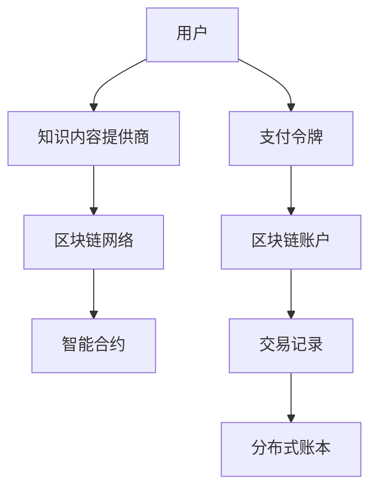

                 

# 知识经济下知识付费的区块链支付与结算方案

> 关键词：区块链,知识付费,数字货币,去中心化支付,智能合约,信任机制,数字资产管理

## 1. 背景介绍

随着信息技术的不断发展和互联网应用的普及，知识付费正在成为知识经济时代的重要消费形式。用户在学习和成长过程中，越来越重视知识的获取和应用，愿意为优质的内容和服务付费。但是，传统支付和结算系统存在诸多问题：交易速度慢、成本高、安全性低、透明度不足等。这些问题不仅限制了知识付费的发展，也增加了用户的交易风险。

为解决上述问题，区块链技术应运而生。区块链作为一种去中心化、分布式账本技术，具有不可篡改、透明公开、去中介等特点，为知识付费提供了全新的支付与结算方案。本文章将全面探讨如何利用区块链技术，构建高效、安全、透明的知识付费支付与结算系统。

## 2. 核心概念与联系

### 2.1 核心概念概述

本节将介绍几个与知识付费和区块链支付相关的核心概念：

- **知识付费**：用户为获取知识和内容而支付费用，包括订阅、单次付费、定制化服务等多种形式。
- **区块链**：一种分布式、去中心化的账本技术，基于密码学原理保证数据的安全和透明。
- **去中心化支付**：去除传统支付中介，用户通过区块链直接进行价值交换。
- **智能合约**：运行在区块链上的程序，可以自动执行和验证交易条款。
- **数字货币**：使用区块链技术实现的电子货币，如比特币、以太坊等。
- **数字资产管理**：基于区块链技术的资产管理方式，包括版权、知识产权等。

这些概念之间相互关联，构成了知识付费和区块链支付与结算系统的基础。通过理解这些核心概念，可以更好地把握区块链在知识付费中的应用。

### 2.2 核心概念原理和架构的 Mermaid 流程图



这个Mermaid流程图展示了知识付费和区块链支付的简化架构：

1. 用户向知识内容提供商支付费用。
2. 知识内容提供商将交易信息记录到区块链网络中。
3. 区块链网络中的智能合约自动验证交易条款，保证交易安全。
4. 用户通过区块链账户进行支付，获得对应的支付令牌。
5. 交易记录被写入分布式账本，保证数据的不可篡改和透明公开。

通过理解上述流程，可以更好地理解区块链在知识付费支付与结算系统中的作用。

## 3. 核心算法原理 & 具体操作步骤

### 3.1 算法原理概述

知识付费的区块链支付与结算系统，主要依赖于区块链技术的去中心化、透明性和智能合约的自动执行能力。核心算法原理如下：

1. **去中心化支付**：用户直接向知识内容提供商支付，无需经过传统金融机构中介。区块链网络中的每个节点都参与记录交易信息，确保数据的透明和不可篡改。

2. **智能合约**：在区块链上部署智能合约，自动执行和验证交易条款。智能合约可以定义支付条件、结算规则、退款流程等，确保交易的公正性和效率。

3. **数字货币**：使用数字货币作为支付手段，如比特币、以太坊等。数字货币具有不可篡改、去中介的特点，适合知识付费的支付场景。

4. **数字资产管理**：利用区块链技术管理数字版权、知识产权等资产。确保资产的归属和使用权，防止侵权和盗版。

5. **去中介信任机制**：通过区块链的分布式账本技术，去除传统支付中介，增强交易双方的信任。

### 3.2 算法步骤详解

构建知识付费的区块链支付与结算系统，需要以下关键步骤：

**Step 1: 用户注册与账户创建**
- 用户通过区块链网络注册账户，获取区块链地址和私钥。
- 用户将支付令牌（如以太坊的以太币）存入区块链账户。

**Step 2: 知识内容订阅**
- 用户订阅知识内容，选择支付方式（单次支付、定期支付）。
- 用户通过智能合约定义支付条款，如支付金额、周期、退款规则等。

**Step 3: 支付与确认**
- 用户向知识内容提供商发起支付请求，通过智能合约自动验证交易条款。
- 智能合约根据支付条款执行交易，将支付令牌从用户账户转移到知识内容提供商账户。
- 交易记录被写入分布式账本，并广播到区块链网络，确保交易的透明和不可篡改。

**Step 4: 支付确认与结算**
- 知识内容提供商确认交易后，向用户提供相应的知识内容或服务。
- 智能合约自动记录交易结算信息，生成支付记录。
- 支付记录被写入分布式账本，供用户和知识内容提供商查阅。

**Step 5: 争议解决与退款**
- 如果交易过程中出现争议，用户可以通过智能合约申请退款。
- 智能合约自动执行退款流程，将支付令牌从知识内容提供商账户转移回用户账户。
- 交易记录和退款记录都被记录在分布式账本中，供各方查阅和审计。

通过上述步骤，区块链支付与结算系统可以高效、安全、透明地完成知识付费交易，保护用户和知识内容提供商的利益。

### 3.3 算法优缺点

基于区块链的知识付费支付与结算系统，具有以下优点：

1. **高效透明**：去中心化支付和智能合约自动执行，减少了传统中介环节，提高了交易效率和透明度。
2. **安全性高**：区块链网络的不可篡改和分布式账本特性，保证了交易记录的安全性和可信度。
3. **信任机制强**：去除传统中介，增强了用户和知识内容提供商之间的信任。
4. **智能合约**：自动执行和验证交易条款，减少人为错误和欺诈风险。
5. **数字货币**：具有去中介、不可篡改的特点，适合知识付费的支付场景。

同时，该系统也存在以下缺点：

1. **技术门槛高**：用户和知识内容提供商需要具备一定的区块链技术知识，才能顺利使用该系统。
2. **交易费用高**：区块链网络的交易费用（如以太坊的gas费用）可能会影响小额交易的可行性。
3. **扩展性有限**：目前区块链网络的处理能力有限，无法支持大规模的实时交易。
4. **隐私保护不足**：区块链的透明性可能导致部分隐私信息的泄露。
5. **法律合规性问题**：区块链支付与结算系统需要符合各国的法律法规，增加了合规成本。

### 3.4 算法应用领域

基于区块链的知识付费支付与结算系统，可以广泛应用于以下几个领域：

1. **在线教育平台**：用户可以通过区块链支付订阅课程、购买单次内容。智能合约自动执行支付条款，确保交易的公正性和效率。
2. **知识市场**：知识内容提供商通过区块链平台发布内容，用户通过智能合约购买、订阅内容，确保版权和知识产权的保护。
3. **专业培训**：企业可以通过区块链平台提供培训课程，用户通过智能合约支付，减少中间环节，提高交易效率。
4. **数字图书馆**：用户可以通过区块链支付订阅电子书、期刊等数字内容，智能合约自动执行支付条款，保护版权。
5. **在线咨询**：用户通过区块链支付咨询费用，知识专家通过智能合约接收支付，确保交易的公正性和透明性。
6. **编程社区**：开发者可以通过区块链平台发布教程、技术文章，用户通过智能合约支付，确保知识版权的保护。

## 4. 数学模型和公式 & 详细讲解 & 举例说明

### 4.1 数学模型构建

区块链支付与结算系统的数学模型构建，需要考虑以下要素：

1. **用户账户**：每个用户拥有一个区块链账户，存储私钥和支付令牌。
2. **知识内容提供商账户**：每个知识内容提供商也拥有一个区块链账户，用于存储和接收支付令牌。
3. **智能合约**：定义支付条款、交易规则、退款流程等，确保交易的公正性和透明度。
4. **交易记录**：记录每个交易的细节，包括交易时间、金额、支付令牌等。

### 4.2 公式推导过程

以以太坊为例，支付令牌为以太币（ETH），智能合约中的支付条款可以表示为：

$$
\text{支付条款} = \{ \text{用户地址}, \text{提供商地址}, \text{支付金额}, \text{周期}, \text{退款规则} \}
$$

其中，用户地址和提供商地址通过区块链地址表示，支付金额为以太币的整数单位，周期和退款规则可以通过智能合约定义。

支付交易的执行过程如下：

1. 用户通过智能合约向知识内容提供商发起支付请求，智能合约验证支付条款。
2. 如果支付条款满足，智能合约自动将支付令牌（以太币）从用户账户转移到知识内容提供商账户。
3. 交易记录被写入分布式账本，记录交易时间、金额、地址等信息。

### 4.3 案例分析与讲解

假设用户Alice通过区块链支付订阅了Bert老师的一门编程课程，每月费用为5ETH。智能合约中的支付条款为：

$$
\text{支付条款} = \{ \text{Alice地址}, \text{Bert地址}, 5 \text{ ETH}, 1个月, \text{立即退款} \}
$$

支付交易的执行过程如下：

1. Alice通过智能合约向Bert发起支付请求，智能合约验证支付条款。
2. 智能合约自动将5ETH从Alice的账户转移到Bert的账户。
3. 交易记录被写入分布式账本，记录交易时间、金额、地址等信息。

如果Alice在第一个月结束前要求退款，智能合约将自动执行退款流程，将5ETH从Bert的账户转移回Alice的账户，并更新交易记录。

## 5. 项目实践：代码实例和详细解释说明

### 5.1 开发环境搭建

进行区块链支付与结算系统的开发，需要搭建基于以太坊的区块链网络。以下是搭建环境的步骤：

1. 安装Node.js和npm。
2. 安装以太坊钱包（如MetaMask）。
3. 安装Truffle框架，配置智能合约开发环境。
4. 编写智能合约代码，通过Truffle编译和部署到区块链网络。
5. 测试智能合约的功能，并进行支付和结算测试。

### 5.2 源代码详细实现

以下是使用Truffle框架编写一个简单的知识付费智能合约的示例代码：

```javascript
// 智能合约代码
pragma solidity ^0.8.0;

contract KnowledgePayment {
    address payable public provider;
    uint256 public price;
    uint256 public period;
    bool public refundable;

    constructor(address payable _provider, uint256 _price, uint256 _period, bool _refundable) {
        provider = _provider;
        price = _price;
        period = _period;
        refundable = _refundable;
    }

    function pay() public payable returns (bool) {
        uint256 now = block.timestamp;
        uint256 payPeriod = now / 86400; // 每日计算周期
        uint256 paydays = payPeriod / period;

        if (paydays * period == payPeriod) {
            uint256 payAmount = paydays * price;
            uint256 payBalance = address(this).balance;
            uint256 refundAmount = address(this).balance - payBalance;

            // 将支付令牌（以太币）从用户账户转移到知识内容提供商账户
            uint256 payResult = provider.send(address(this).address, payAmount);

            if (payResult == payAmount) {
                return true;
            } else {
                return false;
            }
        } else {
            // 未到支付周期，返回false
            return false;
        }
    }

    function refund() public {
        if (refundable) {
            uint256 refundAmount = address(this).balance;
            uint256 refundResult = provider.send(address(this).address, refundAmount);

            if (refundResult == refundAmount) {
                return true;
            } else {
                return false;
            }
        } else {
            // 不支持退款，返回false
            return false;
        }
    }
}
```

上述代码实现了一个简单的知识付费智能合约，用户可以通过pay()函数支付，系统自动计算支付周期和金额，并将支付令牌（以太币）从用户账户转移到知识内容提供商账户。用户也可以在到期前调用refund()函数申请退款。

### 5.3 代码解读与分析

上述代码的关键点是：

1. **构造函数**：初始化智能合约的参数，包括支付金额、周期、退款规则等。
2. **pay()函数**：用户调用pay()函数支付，系统自动计算支付周期和金额，并将支付令牌从用户账户转移到知识内容提供商账户。
3. **refund()函数**：用户可以在到期前调用refund()函数申请退款，系统将支付令牌从知识内容提供商账户转移回用户账户。
4. **智能合约存储状态**：智能合约中存储了知识内容提供商的地址、支付金额、周期、退款规则等关键信息，确保交易的公正性和透明度。

## 6. 实际应用场景

### 6.1 在线教育平台

在线教育平台是知识付费的重要应用场景之一。用户可以通过区块链支付订阅课程、购买单次内容。智能合约自动执行支付条款，确保交易的公正性和效率。

具体而言，在线教育平台可以采用以下方案：

1. **用户注册与账户创建**：用户通过区块链网络注册账户，获取区块链地址和私钥。
2. **课程订阅与支付**：用户订阅课程，选择支付方式（单次支付、定期支付）。智能合约自动执行支付条款，确保交易的公正性和效率。
3. **课程内容提供**：知识内容提供商通过区块链平台发布课程内容，用户通过智能合约支付。
4. **支付确认与结算**：智能合约自动记录交易结算信息，生成支付记录。支付记录被记录在分布式账本中，供用户和知识内容提供商查阅。
5. **退款与争议解决**：如果交易过程中出现争议，用户可以通过智能合约申请退款。智能合约自动执行退款流程，确保交易的公正性和透明性。

### 6.2 知识市场

知识市场是另一个重要的知识付费应用场景。知识内容提供商通过区块链平台发布内容，用户通过智能合约购买、订阅内容，确保版权和知识产权的保护。

具体而言，知识市场可以采用以下方案：

1. **内容发布**：知识内容提供商在区块链平台上发布内容，设置支付条款。
2. **用户订阅与支付**：用户通过智能合约购买、订阅内容，确保交易的公正性和效率。
3. **内容访问**：用户通过区块链平台访问内容，智能合约自动记录访问记录。
4. **支付确认与结算**：智能合约自动记录交易结算信息，生成支付记录。支付记录被记录在分布式账本中，供用户和知识内容提供商查阅。
5. **退款与争议解决**：如果交易过程中出现争议，用户可以通过智能合约申请退款。智能合约自动执行退款流程，确保交易的公正性和透明性。

### 6.3 数字图书馆

数字图书馆是知识付费的另一个重要应用场景。用户可以通过区块链支付订阅电子书、期刊等数字内容，智能合约自动执行支付条款，保护版权。

具体而言，数字图书馆可以采用以下方案：

1. **内容发布**：数字内容提供商在区块链平台上发布内容，设置支付条款。
2. **用户订阅与支付**：用户通过智能合约购买、订阅内容，确保交易的公正性和效率。
3. **内容访问**：用户通过区块链平台访问内容，智能合约自动记录访问记录。
4. **支付确认与结算**：智能合约自动记录交易结算信息，生成支付记录。支付记录被记录在分布式账本中，供用户和数字内容提供商查阅。
5. **退款与争议解决**：如果交易过程中出现争议，用户可以通过智能合约申请退款。智能合约自动执行退款流程，确保交易的公正性和透明性。

## 7. 工具和资源推荐

### 7.1 学习资源推荐

为了帮助开发者系统掌握区块链支付与结算技术的理论基础和实践技巧，以下是一些优质的学习资源：

1. **《区块链原理与实践》**：由区块链技术专家撰写，深入浅出地介绍了区块链的基本原理和应用场景。
2. **CS50: Introduction to Blockchain**：哈佛大学开设的区块链课程，介绍了区块链的基本概念和技术实现。
3. **《以太坊智能合约实战》**：详细讲解了以太坊智能合约的开发和应用，是智能合约开发的必备指南。
4. **Etherscan**：以太坊官方提供的区块链数据查询工具，方便开发者进行交易分析和合约审计。
5. **Truffle Framework**：由Consensys开发的智能合约开发框架，提供了丰富的工具和示例，是智能合约开发的理想选择。

通过对这些资源的学习实践，相信你一定能够快速掌握区块链支付与结算技术的精髓，并用于解决实际的NLP问题。

### 7.2 开发工具推荐

高效的开发离不开优秀的工具支持。以下是几款用于区块链支付与结算开发的常用工具：

1. **Node.js**：基于JavaScript的服务器端运行环境，是区块链开发的重要基础。
2. **Truffle Framework**：由Consensys开发的智能合约开发框架，提供了丰富的工具和示例，是智能合约开发的理想选择。
3. **MetaMask**：以太坊钱包，支持智能合约的调用和交易记录的记录。
4. **MyEtherWallet**：支持多币种的以太坊钱包，支持离线使用。
5. **Etherscan**：以太坊官方提供的区块链数据查询工具，方便开发者进行交易分析和合约审计。
6. **Web3.js**：基于JavaScript的区块链API，方便开发者进行区块链网络的操作。

合理利用这些工具，可以显著提升区块链支付与结算任务的开发效率，加快创新迭代的步伐。

### 7.3 相关论文推荐

区块链支付与结算技术的发展源于学界的持续研究。以下是几篇奠基性的相关论文，推荐阅读：

1. **Bitcoin: A Peer-to-Peer Electronic Cash System**：中本聪发表的比特币白皮书，介绍了比特币的去中心化支付系统。
2. **Ethereum Whitepaper**：以太坊的创始人发表的以太坊白皮书，介绍了以太坊智能合约的技术架构。
3. **Smart Contracts and Consensus in Blockchain**：研究智能合约和共识机制的论文，探讨了智能合约在区块链中的应用。
4. **Blockchain Technology and Its Potential Application in the Financial Industry**：探讨区块链技术在金融行业应用的论文，介绍了区块链在支付与结算领域的应用。

这些论文代表了大语言模型微调技术的发展脉络。通过学习这些前沿成果，可以帮助研究者把握学科前进方向，激发更多的创新灵感。

## 8. 总结：未来发展趋势与挑战

### 8.1 总结

本文对知识付费的区块链支付与结算方案进行了全面系统的介绍。首先阐述了知识付费和区块链支付与结算技术的研究背景和意义，明确了区块链支付与结算技术在知识付费中的独特价值。其次，从原理到实践，详细讲解了区块链支付与结算的数学模型和关键步骤，给出了智能合约的代码实例。同时，本文还广泛探讨了区块链支付与结算技术在在线教育平台、知识市场、数字图书馆等行业的实际应用，展示了区块链支付与结算技术的巨大潜力。此外，本文精选了区块链技术的各类学习资源，力求为读者提供全方位的技术指引。

通过本文的系统梳理，可以看到，区块链支付与结算技术正在成为知识付费的重要支付与结算手段，极大地拓展了知识付费的发展空间，提升了用户的交易体验和安全性。未来，伴随区块链技术的持续演进，知识付费系统必将迎来新的突破，为知识经济的发展注入新的动力。

### 8.2 未来发展趋势

展望未来，区块链支付与结算技术将呈现以下几个发展趋势：

1. **跨链支付**：不同区块链平台之间的互联互通，实现跨链支付和资产管理，提升支付效率和交易流动性。
2. **智能合约自动化**：智能合约自动化执行将进一步简化交易流程，减少人为错误和欺诈风险。
3. **去中心化交易所**：去中心化交易所将取代传统中心化交易所，提供更安全、高效的交易体验。
4. **隐私保护增强**：区块链技术将进一步增强交易隐私保护，防止数据泄露和滥用。
5. **合规性提升**：区块链支付与结算技术将符合各国的法律法规，降低合规成本。

### 8.3 面临的挑战

尽管区块链支付与结算技术已经取得了瞩目成就，但在迈向更加智能化、普适化应用的过程中，它仍面临着诸多挑战：

1. **技术复杂性高**：区块链技术和智能合约开发具有较高的技术门槛，需要开发者具备相应的知识。
2. **交易费用高**：区块链网络的交易费用（如以太坊的gas费用）可能会影响小额交易的可行性。
3. **扩展性有限**：目前区块链网络的处理能力有限，无法支持大规模的实时交易。
4. **隐私保护不足**：区块链的透明性可能导致部分隐私信息的泄露。
5. **法律合规性问题**：区块链支付与结算系统需要符合各国的法律法规，增加了合规成本。

### 8.4 研究展望

为了应对上述挑战，未来的研究需要在以下几个方面寻求新的突破：

1. **跨链技术**：研究和开发跨链技术，实现不同区块链平台之间的互联互通，提升支付效率和交易流动性。
2. **隐私保护技术**：开发隐私保护技术，增强区块链交易的隐私性，防止数据泄露和滥用。
3. **智能合约优化**：研究和开发更高效、安全的智能合约，提升交易的公正性和透明度。
4. **去中心化交易所**：研究和开发去中心化交易所，提供更安全、高效的交易体验。
5. **合规性保障**：研究和开发合规性保障技术，确保区块链支付与结算系统符合各国的法律法规。

这些研究方向的探索，必将引领区块链支付与结算技术迈向更高的台阶，为知识经济的发展提供新的动力。面向未来，区块链支付与结算技术还需要与其他人工智能技术进行更深入的融合，如知识表示、因果推理、强化学习等，多路径协同发力，共同推动知识经济的发展。

## 9. 附录：常见问题与解答

**Q1：区块链支付与结算系统是否适用于所有知识付费场景？**

A: 区块链支付与结算系统在大多数知识付费场景中都能取得不错的效果，特别是对于小额支付和需要去中心化交易的场景。但对于一些需要高并发和大规模交易的场景，如大规模在线教育平台，可能需要进一步优化。

**Q2：区块链支付与结算系统如何保障用户的隐私？**

A: 区块链支付与结算系统通过智能合约和分布式账本技术，去除传统中介环节，增强了交易双方的信任。同时，智能合约可以根据用户需求设计隐私保护机制，如零知识证明、匿名交易等，保障用户的隐私。

**Q3：区块链支付与结算系统的扩展性问题如何解决？**

A: 目前区块链网络的处理能力有限，需要进一步研究和开发更高效、更灵活的共识机制和交易协议，如PoS、DPoS、Layer 2等，提升区块链支付与结算系统的扩展性。

**Q4：区块链支付与结算系统如何确保合规性？**

A: 区块链支付与结算系统需要符合各国的法律法规，涉及金融监管、税务、知识产权等多个领域。开发者需要关注相关法律法规，确保智能合约和交易流程符合合规要求。

**Q5：区块链支付与结算系统的成本问题如何解决？**

A: 区块链支付与结算系统需要考虑交易费用和维护成本，可以通过优化智能合约和交易协议，减少交易费用，同时选择合适的共识机制和层级扩展方案，降低维护成本。

通过本文的系统梳理，可以看到，区块链支付与结算技术正在成为知识付费的重要支付与结算手段，极大地拓展了知识付费的发展空间，提升了用户的交易体验和安全性。未来，伴随区块链技术的持续演进，知识付费系统必将迎来新的突破，为知识经济的发展注入新的动力。总之，区块链支付与结算技术需要在技术、隐私、扩展性、合规性等方面进行全面优化，才能真正发挥其潜力，推动知识付费的广泛应用和发展。

---

作者：禅与计算机程序设计艺术 / Zen and the Art of Computer Programming

