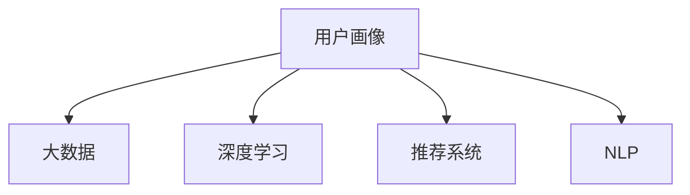

                 

# 知识经济下知识付费的大数据用户画像分析模型

> 关键词：知识经济, 知识付费, 大数据, 用户画像, 机器学习, 深度学习, 自然语言处理, 推荐系统

## 1. 背景介绍

### 1.1 问题由来
随着互联网和智能技术的迅猛发展，知识付费市场逐渐成为互联网经济的重要组成部分。知识付费平台通过向用户提供优质、精准的知识内容，满足用户的信息需求，并从中获取收益。面对日趋激烈的市场竞争，如何精细化运营，精准定位用户需求，提升用户粘性，是知识付费平台亟需解决的难题。

### 1.2 问题核心关键点
用户画像（User Profile）是指通过大数据技术对用户行为、兴趣、需求等信息进行深入分析，构建的用户特征模型。用户画像分析在知识付费平台中具有重要的应用价值，可以帮助平台理解用户需求，进行个性化推荐，提升用户体验和满意度。

## 2. 核心概念与联系

### 2.1 核心概念概述

为了更好地理解用户画像分析的原理和应用，本节将介绍几个关键的概念：

- **用户画像（User Profile）**：通过对用户行为数据、社交网络数据、搜索历史等进行综合分析，构建出用户的兴趣、需求、行为特征，形成一个多维度的用户特征模型。
- **大数据（Big Data）**：指数据量巨大、数据类型复杂、数据处理速度要求高的数据集合。大数据技术通过对海量数据进行存储、分析和挖掘，提取有价值的信息，为决策提供支持。
- **深度学习（Deep Learning）**：基于人工神经网络（Artificial Neural Network, ANN）的机器学习范式，通过多层次的非线性映射，自动学习数据的特征表示。深度学习广泛应用于图像识别、自然语言处理等领域，取得了突出的成果。
- **推荐系统（Recommendation System）**：根据用户的历史行为、兴趣和偏好，为用户推荐感兴趣的商品或内容。推荐系统可以有效提升用户体验，增加用户粘性。
- **自然语言处理（Natural Language Processing, NLP）**：研究如何让计算机理解和生成人类语言的技术，涉及语言模型、情感分析、文本分类等。

这些核心概念之间的逻辑关系可以通过以下Mermaid流程图来展示：



这个流程图展示了大数据、深度学习、用户画像、推荐系统和NLP之间的相互关系：

1. 大数据为深度学习提供了训练数据源，深度学习从大数据中学习用户行为和兴趣特征。
2. 用户画像通过深度学习模型，结合NLP技术，挖掘用户特征。
3. 推荐系统利用用户画像信息，为用户推荐个性化内容，提升用户体验。

## 3. 核心算法原理 & 具体操作步骤
### 3.1 算法原理概述

用户画像分析的算法核心是深度学习模型，通过多层次的特征学习，构建出用户的多维特征表示。常用的深度学习模型包括循环神经网络（Recurrent Neural Network, RNN）、卷积神经网络（Convolutional Neural Network, CNN）、自编码器（Autoencoder）、深度信念网络（Deep Belief Network, DBN）等。

### 3.2 算法步骤详解

用户画像分析的主要步骤包括数据收集、特征提取、模型训练、特征筛选和用户画像构建：

1. **数据收集**：从知识付费平台中收集用户的行为数据，包括购买记录、浏览历史、搜索记录等。同时，可以利用用户社交网络信息，如好友关系、关注对象等，作为辅助信息。

2. **特征提取**：对收集的数据进行预处理，包括清洗、归一化等操作。然后使用深度学习模型，如LSTM、CNN等，提取用户的行为特征、兴趣特征等，得到高维特征表示。

3. **模型训练**：选择合适的深度学习模型，如LSTM、Autoencoder等，利用标注数据进行训练。在训练过程中，可以通过交叉验证等方法进行调参，优化模型性能。

4. **特征筛选**：在所有提取的特征中，选择最具代表性的特征，去除噪音或冗余特征，减少计算量和模型复杂度。

5. **用户画像构建**：将筛选后的特征组合，构建用户的特征向量，形成多维度的用户画像。

### 3.3 算法优缺点

用户画像分析的深度学习模型具有以下优点：

1. **自动特征学习**：深度学习模型能够自动从数据中学习出高层次的特征表示，无需人工干预。
2. **高效性**：深度学习模型可以利用并行计算，在大数据环境下高效地进行特征提取。
3. **泛化能力强**：深度学习模型具有较强的泛化能力，能够适应不同领域和不同规模的数据。

然而，这些模型也存在一些缺点：

1. **模型复杂度高**：深度学习模型的参数量通常较大，训练和推理复杂度较高。
2. **过拟合风险**：在数据量不足的情况下，深度学习模型容易发生过拟合，需要结合正则化等技术进行控制。
3. **解释性差**：深度学习模型是"黑箱"模型，其内部工作机制难以解释，难以进行故障排查。

### 3.4 算法应用领域

用户画像分析技术在大数据背景下，有着广泛的应用场景：

1. **个性化推荐**：在知识付费平台上，通过用户画像分析，可以为用户推荐其感兴趣的内容，提升用户体验。
2. **用户行为预测**：分析用户行为特征，预测其未来的购买意愿，进行精准营销和内容推荐。
3. **广告投放优化**：通过用户画像分析，针对不同用户群体进行定向广告投放，提升广告效果和转化率。
4. **客户关系管理（CRM）**：分析用户画像信息，提升客户满意度和忠诚度，增强品牌影响力。
5. **社交网络分析**：分析用户社交网络信息，识别关键意见领袖，优化社区运营策略。

## 4. 数学模型和公式 & 详细讲解 & 举例说明

### 4.1 数学模型构建

假设用户画像分析的数据集合为 $D = \{(x_i, y_i)\}_{i=1}^N$，其中 $x_i \in \mathcal{X}$，$y_i \in \mathcal{Y}$ 分别表示输入特征和输出标签。模型的目标是通过训练，学习一个映射函数 $f: \mathcal{X} \rightarrow \mathcal{Y}$，使得在测试集上的均方误差最小。

$$
\min_{f} \frac{1}{N} \sum_{i=1}^N (f(x_i) - y_i)^2
$$

在深度学习模型中，通常使用神经网络来进行特征学习和映射。神经网络的输出层与用户画像构建目标一致，常使用softmax函数来得到用户画像的概率分布。

### 4.2 公式推导过程

以LSTM为例，推导用户画像分析的数学模型。LSTM是递归神经网络的一种，可以处理序列数据，具有记忆能力。假设输入特征为 $x = [x_1, x_2, ..., x_T]$，其中 $x_t$ 表示时间步 $t$ 的输入。LSTM模型通过多层LSTM单元，对序列数据进行处理，最终输出用户画像的概率分布 $p$。

LSTM单元的结构如下：

$$
\begin{aligned}
i_t &= \sigma(W_i \cdot [x_t, h_{t-1}] + b_i) \\
f_t &= \sigma(W_f \cdot [x_t, h_{t-1}] + b_f) \\
o_t &= \sigma(W_o \cdot [x_t, h_{t-1}] + b_o) \\
g_t &= \tanh(W_g \cdot [x_t, h_{t-1}] + b_g) \\
c_t &= f_t \odot c_{t-1} + i_t \odot g_t \\
h_t &= o_t \odot \tanh(c_t)
\end{aligned}
$$

其中 $\sigma$ 为sigmoid函数，$\tanh$ 为双曲正切函数，$\odot$ 为点乘操作。$W$ 和 $b$ 为模型参数，$i_t, f_t, o_t, g_t, c_t, h_t$ 分别表示遗忘门、输入门、输出门、候选单元、单元状态和输出状态。

LSTM的输出层通常使用softmax函数，得到用户画像的概率分布：

$$
p(y|x) = \frac{\exp(y \cdot W_{out} \cdot h_T + b_{out})}{\sum_{y'} \exp(y' \cdot W_{out} \cdot h_T + b_{out})}
$$

其中 $y$ 表示用户画像类别，$W_{out}$ 和 $b_{out}$ 为输出层参数，$h_T$ 为LSTM最终输出状态。

### 4.3 案例分析与讲解

以一个简单的案例来说明用户画像分析的流程：

1. **数据收集**：假设知识付费平台收集了用户的历史购买记录、浏览历史、搜索记录等数据。同时，利用用户的社交网络信息，如好友关系、关注对象等，作为辅助信息。

2. **特征提取**：对收集的数据进行预处理，去除噪音或重复数据。然后利用LSTM模型，对用户行为数据进行序列化处理，提取用户的行为特征、兴趣特征等。

3. **模型训练**：利用标注数据（如购买行为对应的标签），对LSTM模型进行训练。在训练过程中，使用交叉验证等方法进行调参，优化模型性能。

4. **特征筛选**：在所有提取的特征中，选择最具代表性的特征，去除冗余特征。

5. **用户画像构建**：将筛选后的特征组合，构建用户的特征向量，形成多维度的用户画像。

## 5. 项目实践：代码实例和详细解释说明

### 5.1 开发环境搭建

在进行用户画像分析的项目实践前，我们需要准备好开发环境。以下是使用Python进行PyTorch开发的环境配置流程：

1. 安装Anaconda：从官网下载并安装Anaconda，用于创建独立的Python环境。

2. 创建并激活虚拟环境：
```bash
conda create -n pytorch-env python=3.8 
conda activate pytorch-env
```

3. 安装PyTorch：根据CUDA版本，从官网获取对应的安装命令。例如：
```bash
conda install pytorch torchvision torchaudio cudatoolkit=11.1 -c pytorch -c conda-forge
```

4. 安装TensorFlow：
```bash
conda install tensorflow
```

5. 安装各类工具包：
```bash
pip install numpy pandas scikit-learn matplotlib tqdm jupyter notebook ipython
```

完成上述步骤后，即可在`pytorch-env`环境中开始用户画像分析实践。

### 5.2 源代码详细实现

下面我们以LSTM模型为例，给出用户画像分析的PyTorch代码实现。

首先，定义LSTM模型：

```python
import torch
import torch.nn as nn
import torch.optim as optim

class LSTMModel(nn.Module):
    def __init__(self, input_size, hidden_size, output_size):
        super(LSTMModel, self).__init__()
        self.hidden_size = hidden_size
        self.lstm = nn.LSTM(input_size, hidden_size, batch_first=True)
        self.fc = nn.Linear(hidden_size, output_size)
        
    def forward(self, x):
        h0 = torch.zeros(1, x.size(0), self.hidden_size).to(x.device)
        c0 = torch.zeros(1, x.size(0), self.hidden_size).to(x.device)
        
        out, _ = self.lstm(x, (h0, c0))
        out = self.fc(out[:, -1, :])
        return out
```

然后，定义训练函数：

```python
def train(model, train_loader, optimizer, criterion, device):
    model.train()
    total_loss = 0
    for batch in train_loader:
        input, label = batch
        input, label = input.to(device), label.to(device)
        
        optimizer.zero_grad()
        output = model(input)
        loss = criterion(output, label)
        loss.backward()
        optimizer.step()
        
        total_loss += loss.item()
    
    return total_loss / len(train_loader)
```

接着，定义评估函数：

```python
def evaluate(model, test_loader, criterion, device):
    model.eval()
    total_loss = 0
    total_correct = 0
    with torch.no_grad():
        for batch in test_loader:
            input, label = batch
            input, label = input.to(device), label.to(device)
            
            output = model(input)
            loss = criterion(output, label)
            _, preds = torch.max(output, 1)
            total_correct += (preds == label).sum().item()
            total_loss += loss.item()
    
    return total_loss / len(test_loader), total_correct / len(test_loader.dataset)
```

最后，启动训练流程并在测试集上评估：

```python
epochs = 10
batch_size = 64
learning_rate = 0.001

device = torch.device('cuda') if torch.cuda.is_available() else torch.device('cpu')

model = LSTMModel(input_size, hidden_size, output_size)
optimizer = optim.Adam(model.parameters(), lr=learning_rate)
criterion = nn.CrossEntropyLoss()

for epoch in range(epochs):
    train_loss = train(model, train_loader, optimizer, criterion, device)
    test_loss, accuracy = evaluate(model, test_loader, criterion, device)
    
    print(f'Epoch {epoch+1}, Train Loss: {train_loss:.4f}, Test Loss: {test_loss:.4f}, Accuracy: {accuracy:.4f}')
    
print('Training complete.')
```

以上就是使用PyTorch进行用户画像分析的完整代码实现。可以看到，利用深度学习模型对用户行为数据进行序列化处理，并提取高维特征表示，可以有效地进行用户画像分析。

### 5.3 代码解读与分析

让我们再详细解读一下关键代码的实现细节：

**LSTMModel类**：
- `__init__`方法：初始化LSTM模型参数。
- `forward`方法：定义模型的前向传播过程。

**train函数**：
- 将模型置为训练模式。
- 遍历训练数据集。
- 对输入数据进行预处理，并传递给模型。
- 计算损失函数，反向传播更新模型参数。
- 累加损失值。

**evaluate函数**：
- 将模型置为评估模式。
- 遍历测试数据集。
- 对输入数据进行预处理，并传递给模型。
- 计算损失函数和准确率。
- 返回测试集上的损失和准确率。

**训练流程**：
- 定义总的epoch数和batch size，开始循环迭代。
- 每个epoch内，先进行训练，输出训练集上的损失。
- 在测试集上评估，输出测试集上的损失和准确率。
- 所有epoch结束后，输出训练完成信息。

可以看到，利用深度学习模型对用户行为数据进行序列化处理，并提取高维特征表示，可以有效地进行用户画像分析。

## 6. 实际应用场景

### 6.1 智能推荐系统

用户画像分析在智能推荐系统中的应用非常广泛。通过分析用户的历史行为数据，可以构建出用户的兴趣偏好、行为特征等，用于个性化推荐。

在知识付费平台上，利用用户画像分析，可以为用户推荐其感兴趣的内容，提升用户体验和满意度。例如，根据用户的浏览历史、购买记录，推荐相关课程或文章，甚至可以推荐给用户相关领域的专家文章，增加用户粘性。

### 6.2 用户行为预测

用户画像分析可以用于预测用户未来的购买意愿，进行精准营销和内容推荐。例如，利用用户的浏览记录、搜索关键词等，预测用户可能感兴趣的课程或书籍，提前进行推荐，提升转化率。

在智能客服系统中，利用用户画像分析，可以预测用户可能提出的问题，提前准备答案，提升客服响应速度和质量。

### 6.3 广告投放优化

通过用户画像分析，可以识别不同用户群体的特征，进行定向广告投放，提升广告效果和转化率。例如，针对知识付费平台的用户，可以推送与课程、书籍相关的广告，增加用户购买意愿。

在社交媒体平台上，利用用户画像分析，可以识别潜在的用户群体，进行精准投放，提升广告点击率和转化率。

### 6.4 客户关系管理（CRM）

利用用户画像分析，可以提升客户满意度和忠诚度，增强品牌影响力。例如，在电商平台上，根据用户的购买历史、浏览记录等，提供个性化的售后服务，提升用户体验。

在金融服务中，利用用户画像分析，可以识别高价值的客户群体，进行针对性的营销和服务，提升客户满意度和忠诚度。

### 6.5 社交网络分析

通过用户画像分析，可以识别关键意见领袖（KOL），优化社区运营策略。例如，在知识付费平台上，利用用户画像分析，识别具有影响力的用户，进行内容推广和社区运营，提升用户参与度和互动率。

在社交媒体平台上，利用用户画像分析，识别具有影响力的用户，进行内容推广和社区运营，提升用户参与度和互动率。

## 7. 工具和资源推荐

### 7.1 学习资源推荐

为了帮助开发者系统掌握用户画像分析的理论基础和实践技巧，这里推荐一些优质的学习资源：

1. 《深度学习》系列书籍：由斯坦福大学李飞飞教授主笔，深入浅出地介绍了深度学习的基本概念和应用，是学习深度学习的绝佳入门书籍。
2. 《Python数据科学手册》：介绍了Python在数据科学领域的应用，包括数据处理、机器学习、深度学习等，是学习Python数据科学的必备参考。
3. 《机器学习实战》：介绍了机器学习的基本概念和算法，包括监督学习、无监督学习、半监督学习等，是学习机器学习的入门书籍。
4. 《自然语言处理综述》：由哥伦比亚大学周志华教授主笔，全面介绍了自然语言处理的基本概念和前沿技术，是学习NLP技术的权威参考。
5. 《推荐系统》系列课程：由斯坦福大学主笔，涵盖了推荐系统的基本概念、算法和应用，是学习推荐系统的权威资源。

通过对这些资源的学习实践，相信你一定能够快速掌握用户画像分析的精髓，并用于解决实际的业务问题。

### 7.2 开发工具推荐

高效的开发离不开优秀的工具支持。以下是几款用于用户画像分析开发的常用工具：

1. PyTorch：基于Python的开源深度学习框架，灵活动态的计算图，适合快速迭代研究。大部分深度学习模型都有PyTorch版本的实现。
2. TensorFlow：由Google主导开发的开源深度学习框架，生产部署方便，适合大规模工程应用。同样有丰富的深度学习模型资源。
3. Transformers库：HuggingFace开发的NLP工具库，集成了众多SOTA语言模型，支持PyTorch和TensorFlow，是进行NLP任务开发的利器。
4. Weights & Biases：模型训练的实验跟踪工具，可以记录和可视化模型训练过程中的各项指标，方便对比和调优。与主流深度学习框架无缝集成。
5. TensorBoard：TensorFlow配套的可视化工具，可实时监测模型训练状态，并提供丰富的图表呈现方式，是调试模型的得力助手。

合理利用这些工具，可以显著提升用户画像分析的开发效率，加快创新迭代的步伐。

### 7.3 相关论文推荐

用户画像分析技术的发展源于学界的持续研究。以下是几篇奠基性的相关论文，推荐阅读：

1. RNNs and Deep Learning for Large-Scale Sentiment Analysis（RNNs在情感分析中的应用）：提出的RNN模型，能够有效地处理大规模文本数据，识别情感倾向。
2. Dive into Deep Learning（深度学习入门）：由Andrew Ng主笔，全面介绍了深度学习的基本概念和应用，是学习深度学习的权威入门书籍。
3. Attention and Transformer Architectures for NLP（NLP中的注意力和Transformer架构）：介绍了Transformer架构在NLP中的应用，推动了预训练语言模型的发展。
4. Parameter-Efficient Transfer Learning for NLP（参数高效迁移学习）：提出Adapter等参数高效微调方法，在固定大部分预训练参数的情况下，只更新极少量的任务相关参数，实现高效的迁移学习。
5. Multi-Task Learning for Information Extraction（多任务学习在信息抽取中的应用）：提出了多任务学习的方法，能够同时解决多个NLP任务，提升信息抽取的效果。

这些论文代表了大数据和深度学习技术的发展脉络。通过学习这些前沿成果，可以帮助研究者把握学科前进方向，激发更多的创新灵感。

## 8. 总结：未来发展趋势与挑战

### 8.1 总结

本文对用户画像分析在大数据背景下的实现方法进行了全面系统的介绍。首先阐述了用户画像分析在知识付费平台中的重要应用，明确了通过深度学习模型自动学习用户特征的原理和优势。其次，从原理到实践，详细讲解了用户画像分析的数学模型和关键步骤，给出了用户画像分析的完整代码实现。同时，本文还广泛探讨了用户画像分析在推荐系统、用户行为预测、广告投放优化等实际场景中的应用，展示了用户画像分析的广阔前景。此外，本文精选了用户画像分析的学习资源，力求为读者提供全方位的技术指引。

通过本文的系统梳理，可以看到，用户画像分析技术在大数据背景下，为知识付费平台提供了精准的用户画像分析，提升了个性化推荐和用户体验。深度学习模型的应用，使得用户画像分析具有自动特征学习、高效性等优点，但也面临模型复杂度高、过拟合风险等挑战。未来，用户画像分析技术需要在数据多样性、特征选择、模型结构优化等方面进一步发展，以更好地适应复杂多样的用户行为和需求。

### 8.2 未来发展趋势

展望未来，用户画像分析技术将呈现以下几个发展趋势：

1. **数据融合与协同**：未来的用户画像分析将更多地融合多源异构数据，如社交网络数据、物联网数据等，进行协同建模，提升模型的准确性和泛化能力。
2. **个性化与定制化**：用户画像分析将更加注重个性化和定制化，根据用户的行为、兴趣、需求等，提供更为精准的推荐和服务。
3. **跨模态学习**：未来的用户画像分析将更多地融合多种数据模态，如文本、图像、语音等，进行跨模态学习，提升模型的综合能力。
4. **智能决策与辅助**：用户画像分析将更多地应用于智能决策与辅助，如智能客服、智能投顾、智能风控等，提升决策的智能化和自动化水平。
5. **联邦学习与隐私保护**：未来的用户画像分析将更多地采用联邦学习等隐私保护技术，保护用户隐私，提升数据安全。

以上趋势凸显了用户画像分析技术的广阔前景。这些方向的探索发展，必将进一步提升用户画像分析的准确性和实用性，为知识付费平台提供更精准、全面的用户画像支持。

### 8.3 面临的挑战

尽管用户画像分析技术已经取得了一定的进展，但在迈向更加智能化、普适化应用的过程中，仍面临诸多挑战：

1. **数据获取与隐私保护**：用户画像分析依赖大量的数据，如何高效获取并保护用户隐私，是一个重要的挑战。需要采取多方数据融合、差分隐私等技术手段，保护用户隐私。
2. **数据质量与噪声处理**：数据质量不高、存在噪声等问题，会导致模型性能下降。如何提高数据质量、去除噪声，是用户画像分析的重要挑战。
3. **模型复杂度与可解释性**：深度学习模型参数量较大，模型复杂度高，难以解释其内部工作机制。如何提高模型的可解释性，是一个亟待解决的问题。
4. **模型泛化能力**：用户画像分析在不同领域、不同场景下的泛化能力有限。如何提升模型的泛化能力，是一个重要的研究方向。
5. **模型优化与调参**：深度学习模型训练复杂度高，如何优化模型结构和参数，是一个重要的挑战。需要结合模型压缩、超参数优化等技术手段，提升模型的训练效率和性能。

### 8.4 研究展望

面对用户画像分析面临的挑战，未来的研究需要在以下几个方面寻求新的突破：

1. **跨模态学习与融合**：通过多源异构数据的融合与协同建模，提升用户画像分析的准确性和泛化能力。
2. **隐私保护与数据安全**：利用联邦学习等隐私保护技术，保护用户隐私，提升数据安全。
3. **模型压缩与优化**：通过模型压缩、模型蒸馏等技术手段，减少模型参数量和计算量，提升模型训练效率和推理速度。
4. **可解释性与透明性**：引入可解释性模型、透明性技术，提升模型的可解释性和透明性，便于进行故障排查和调优。
5. **跨领域与跨场景应用**：探索用户画像分析在不同领域、不同场景下的应用，提升模型的应用范围和性能。

这些研究方向将引领用户画像分析技术迈向更高的台阶，为知识付费平台提供更精准、全面的用户画像支持，促进知识的传播和利用。面向未来，用户画像分析技术还需要与其他人工智能技术进行更深入的融合，如知识表示、因果推理、强化学习等，多路径协同发力，共同推动用户画像分析技术的进步。只有勇于创新、敢于突破，才能不断拓展用户画像分析的边界，让知识付费平台更好地服务于知识经济的发展。

## 9. 附录：常见问题与解答

**Q1：用户画像分析的深度学习模型是否适用于所有场景？**

A: 用户画像分析的深度学习模型具有自动特征学习、高效性等优点，适用于大多数场景。但对于一些特殊场景，如低资源设备、嵌入式系统等，可能需要采用轻量级模型，如MobileNet、SqueezeNet等，以适应低资源环境。

**Q2：用户画像分析的数据获取和隐私保护如何处理？**

A: 用户画像分析的数据获取和隐私保护是重要挑战。常用的方法包括：
1. 数据匿名化：对数据进行匿名化处理，去除可识别用户身份的信息。
2. 差分隐私：采用差分隐私技术，确保用户隐私不被泄露。
3. 数据联邦：采用联邦学习技术，在用户端进行模型训练，保护用户隐私。

**Q3：用户画像分析的深度学习模型如何处理高维度数据？**

A: 高维度数据会带来计算量大的问题。常用的方法包括：
1. 数据降维：使用PCA、LDA等降维技术，减少数据的维度。
2. 特征选择：利用特征选择技术，去除冗余和噪音特征，减少计算量。
3. 模型压缩：使用模型压缩技术，如知识蒸馏、模型剪枝等，减少模型参数量。

**Q4：用户画像分析的深度学习模型如何提升模型的可解释性？**

A: 深度学习模型通常是"黑箱"模型，难以解释其内部工作机制。提升模型的可解释性的方法包括：
1. 可视化技术：使用可视化技术，如特征可视化、梯度可视化等，帮助理解模型内部的工作机制。
2. 可解释性模型：使用可解释性模型，如LIME、SHAP等，帮助解释模型的决策过程。
3. 模型蒸馏：使用模型蒸馏技术，将复杂模型转换为可解释性模型，提升模型的可解释性。

**Q5：用户画像分析的深度学习模型如何优化模型结构和参数？**

A: 优化模型结构和参数的方法包括：
1. 超参数优化：使用网格搜索、随机搜索、贝叶斯优化等方法，优化模型的超参数。
2. 模型压缩：使用模型压缩技术，如知识蒸馏、模型剪枝等，减少模型参数量。
3. 正则化：使用L1、L2正则化等技术，防止过拟合。

这些方法需要在实际项目中灵活应用，结合具体场景进行优化。通过不断迭代和优化，可以提升用户画像分析的性能和实用性。

**Q6：用户画像分析的深度学习模型如何处理动态数据？**

A: 动态数据会带来模型的鲁棒性和泛化能力下降的问题。常用的方法包括：
1. 在线学习：使用在线学习技术，根据新数据不断更新模型。
2. 模型更新：定期重新训练模型，适应数据分布的变化。
3. 迁移学习：利用已训练好的模型，在新数据上进行微调，提升模型的泛化能力。

这些方法需要在实际项目中灵活应用，结合具体场景进行优化。通过不断迭代和优化，可以提升用户画像分析的性能和实用性。

