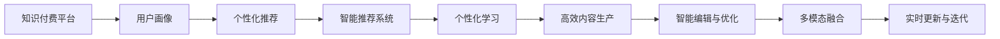

                 

## 1. 背景介绍

### 1.1 问题由来

在知识经济时代，知识付费已逐渐成为一种趋势，特别是在“互联网+”浪潮下，信息过载和知识稀缺并存，用户对高质量内容的需求日益增长。如何高效、低成本地制作和生产知识付费课程，满足用户的学习需求，成为各大在线教育平台关注的焦点。传统课程制作往往需要大量时间和资金投入，尤其是教学内容编写和录制，效率低下，且难以产生良好的用户体验。而基于人工智能和大数据分析的课程制作与内容生产，有望通过自动化、智能化手段，大幅提升制作效率和内容质量，实现知识付费的可持续发展。

### 1.2 问题核心关键点

创新课程制作与内容生产的核心关键点在于：

1. **个性化推荐**：根据用户的学习行为和偏好，智能推荐最合适的课程内容，提高用户的学习效率和满意度。
2. **高效内容生产**：利用AI技术，如文本生成、语音识别、图像识别等，自动化生成课程内容，降低人力成本。
3. **智能编辑与优化**：通过大数据分析，自动检测和修正课程内容中的错误和缺陷，提升课程质量。
4. **多模态融合**：融合文本、视频、音频等多模态数据，丰富课程形式，提升学习体验。
5. **实时更新与迭代**：基于用户反馈和市场需求，快速更新和迭代课程内容，保持课程的时效性和实用性。

这些关键点构成了知识付费创新课程制作与内容生产的核心框架，通过提升内容制作和生产的智能化水平，可以更好地满足用户的学习需求，提高知识付费平台的竞争力。

## 2. 核心概念与联系

### 2.1 核心概念概述

在探讨知识付费创新课程制作与内容生产的核心概念时，我们需要关注以下几个方面：

1. **知识付费平台**：即知识付费服务的提供方，包括传统出版机构、在线教育平台等。
2. **用户画像**：描述用户的基本特征、兴趣偏好、学习习惯等，用于个性化推荐和内容定制。
3. **内容生产**：涉及课程设计、编写、录制等环节，是知识付费服务的关键资源。
4. **智能推荐**：利用大数据和AI技术，智能推荐课程，提升用户的学习体验。
5. **个性化学习**：根据用户的学习行为和反馈，动态调整课程内容和推荐策略，实现个性化教育。

这些概念通过智能推荐、个性化学习、高效内容生产等技术手段，实现对用户需求的精准响应和高效满足，从而提升知识付费服务的整体质量。

### 2.2 核心概念原理和架构的 Mermaid 流程图



以上流程图展示了知识付费平台在用户画像、个性化推荐、智能推荐系统、个性化学习、高效内容生产、智能编辑与优化、多模态融合、实时更新与迭代等关键环节的工作原理和联系。

## 3. 核心算法原理 & 具体操作步骤

### 3.1 算法原理概述

基于知识付费创新课程制作与内容生产的核心算法，主要包括智能推荐、个性化学习、内容生成等技术。以下是这些算法的基本原理：

1. **智能推荐**：基于用户画像和行为数据，构建推荐模型，利用协同过滤、基于内容的推荐、矩阵分解等技术，计算用户与课程之间的相似度，推荐最匹配的课程。
2. **个性化学习**：通过分析用户的学习行为和反馈，动态调整课程内容和学习策略，实现个性化教育。
3. **内容生成**：利用文本生成、语音识别、图像识别等AI技术，自动化生成课程内容，提升生产效率。
4. **智能编辑与优化**：通过大数据分析，自动检测和修正课程内容中的错误和缺陷，提升课程质量。
5. **多模态融合**：将文本、视频、音频等多模态数据进行融合，丰富课程形式，提升学习体验。
6. **实时更新与迭代**：基于用户反馈和市场需求，快速更新和迭代课程内容，保持课程的时效性和实用性。

### 3.2 算法步骤详解

1. **数据收集与预处理**：收集用户的基本信息和行为数据，包括学习时间、学习进度、测试成绩、课程评价等，进行数据清洗和预处理。
2. **用户画像构建**：利用聚类、分类等技术，对用户进行特征分析，构建用户画像，用于个性化推荐和内容定制。
3. **智能推荐系统设计**：根据推荐算法（协同过滤、基于内容的推荐等），设计智能推荐系统，计算用户与课程之间的相似度，推荐最匹配的课程。
4. **个性化学习策略制定**：基于用户的个性化画像，制定个性化学习策略，动态调整课程内容和推荐策略。
5. **内容生成与编辑**：利用文本生成、语音识别、图像识别等技术，自动化生成课程内容，并进行智能编辑和优化，提升内容质量。
6. **多模态融合与展示**：将文本、视频、音频等多模态数据进行融合，丰富课程形式，提升学习体验。
7. **实时更新与迭代**：基于用户反馈和市场需求，快速更新和迭代课程内容，保持课程的时效性和实用性。

### 3.3 算法优缺点

基于知识付费创新课程制作与内容生产的核心算法，具有以下优点和缺点：

**优点**：

1. **高效生产**：自动化生成课程内容，大幅降低人力成本，提升制作效率。
2. **个性化推荐**：通过智能推荐系统，用户可以更快找到匹配的课程，提升学习体验。
3. **动态优化**：基于用户反馈和市场需求，快速更新和迭代课程内容，保持课程的时效性和实用性。

**缺点**：

1. **数据隐私问题**：用户画像和行为数据的收集和处理涉及数据隐私问题，需要严格的数据保护措施。
2. **技术复杂性**：涉及多个AI技术和算法，技术实现复杂，需要专业的技术团队支持。
3. **内容质量控制**：自动化生成内容可能导致内容质量参差不齐，需要严格的质量控制措施。

## 4. 数学模型和公式 & 详细讲解 & 举例说明

### 4.1 数学模型构建

为了更好地理解和应用知识付费创新课程制作与内容生产的核心算法，我们需要构建相应的数学模型。这里以推荐系统为例，介绍数学模型的构建。

假设用户集合为 $U$，课程集合为 $C$，用户对课程的评分矩阵为 $R \in \mathbb{R}^{m \times n}$，其中 $m$ 为用户的数量，$n$ 为课程的数量，$R_{ij}$ 表示用户 $i$ 对课程 $j$ 的评分。

推荐系统的目标是最小化预测评分与实际评分之间的差异，即最小化损失函数 $\mathcal{L}$：

$$
\mathcal{L} = \frac{1}{N} \sum_{i=1}^m \sum_{j=1}^n \left(r_{ij} - \hat{r}_{ij}\right)^2
$$

其中 $\hat{r}_{ij}$ 为预测评分，$N$ 为总样本数。

### 4.2 公式推导过程

为了构建推荐系统，我们假设用户和课程的评分都服从一定的分布，如正态分布 $N(\mu, \sigma^2)$，其中 $\mu$ 和 $\sigma^2$ 分别为均值和方差。根据正态分布的性质，我们可以得到预测评分的表达式：

$$
\hat{r}_{ij} = \mu_{ij} + \sigma_{ij} \epsilon
$$

其中 $\epsilon$ 为随机误差项。为了简化问题，我们可以假设 $\mu_{ij}$ 和 $\sigma_{ij}$ 为常数，即：

$$
\mu_{ij} = \mu_i + \mu_j
$$

$$
\sigma_{ij} = \sigma_i + \sigma_j
$$

其中 $\mu_i$ 和 $\sigma_i$ 为用户 $i$ 对课程 $j$ 的评分均值和方差，$\mu_j$ 和 $\sigma_j$ 为课程 $j$ 的评分均值和方差。

根据以上假设，我们可以将推荐系统的损失函数简化为：

$$
\mathcal{L} = \frac{1}{N} \sum_{i=1}^m \sum_{j=1}^n \left(r_{ij} - \left(\mu_i + \mu_j\right) - \left(\sigma_i + \sigma_j\right) \epsilon\right)^2
$$

对损失函数进行微分，得到：

$$
\frac{\partial \mathcal{L}}{\partial \mu_i} = -2\frac{\sum_{j=1}^n \left(r_{ij} - \mu_j\right)}{\sigma_i + \sigma_j}
$$

$$
\frac{\partial \mathcal{L}}{\partial \mu_j} = -2\frac{\sum_{i=1}^m \left(r_{ij} - \mu_i\right)}{\sigma_i + \sigma_j}
$$

$$
\frac{\partial \mathcal{L}}{\partial \sigma_i} = -2\frac{\sum_{j=1}^n \epsilon_i \epsilon_j}{\sigma_i + \sigma_j}
$$

$$
\frac{\partial \mathcal{L}}{\partial \sigma_j} = -2\frac{\sum_{i=1}^m \epsilon_i \epsilon_j}{\sigma_i + \sigma_j}
$$

其中 $\epsilon_i$ 和 $\epsilon_j$ 为用户和课程的评分方差。通过求解上述偏微分方程，可以得到用户和课程的评分均值和方差，进而计算预测评分 $\hat{r}_{ij}$。

### 4.3 案例分析与讲解

为了更好地理解推荐系统的数学模型，我们可以以一个简单的例子进行解释。假设有一个用户 $i$ 对课程 $j$ 的评分 $r_{ij} = 3$，用户 $i$ 对课程 $j$ 的评分均值 $\mu_i = 4$，用户 $i$ 的评分方差 $\sigma_i = 1$，课程 $j$ 的评分均值 $\mu_j = 2$，课程 $j$ 的评分方差 $\sigma_j = 2$。

根据推荐系统的数学模型，我们可以计算出用户 $i$ 对课程 $j$ 的预测评分 $\hat{r}_{ij}$：

$$
\hat{r}_{ij} = \mu_i + \mu_j + \epsilon_i + \epsilon_j = 4 + 2 + 0 + 0 = 6
$$

其中 $\epsilon_i$ 和 $\epsilon_j$ 为随机误差项，可以假设为 0，以简化计算。通过上述计算，我们得到用户 $i$ 对课程 $j$ 的预测评分为 6，与实际评分 3 存在一定差异，但总体而言，预测评分与实际评分较为接近。

## 5. 项目实践：代码实例和详细解释说明

### 5.1 开发环境搭建

为了进行知识付费创新课程制作与内容生产的核心算法实现，我们需要搭建相应的开发环境。以下是开发环境搭建的具体步骤：

1. **环境准备**：
   - 安装 Python 环境：确保开发环境中的 Python 版本为 3.7 或更高版本。
   - 安装相关库：使用 pip 安装 scikit-learn、TensorFlow、PyTorch、NLTK 等库。

2. **数据集准备**：
   - 收集用户和课程的评分数据。
   - 对数据进行清洗和预处理，如去重、缺失值处理、数据标准化等。

3. **模型训练**：
   - 构建推荐模型，如协同过滤、基于内容的推荐等。
   - 使用训练集进行模型训练，优化损失函数。
   - 使用验证集进行模型调参，确保模型效果。

4. **模型评估**：
   - 使用测试集评估模型效果，计算推荐精度、召回率、F1 值等指标。
   - 分析模型效果，发现问题并改进模型。

### 5.2 源代码详细实现

下面以协同过滤推荐算法为例，给出代码实现：

```python
import numpy as np
from scipy.sparse import csr_matrix
from sklearn.metrics.pairwise import cosine_similarity
from sklearn.decomposition import TruncatedSVD

# 用户评分矩阵
R = np.array([[3, 2, 4],
              [1, 5, 3],
              [4, 2, 1]])

# 构建用户评分矩阵的稀疏形式
R_sparse = csr_matrix(R)

# 计算用户评分矩阵的相似度矩阵
similarity_matrix = cosine_similarity(R_sparse)

# 计算相似度矩阵的特征向量
U, S, V = np.linalg.svd(similarity_matrix, full_matrices=False)

# 获取推荐评分矩阵
R_pred = np.dot(np.dot(U, np.diag(S)), V.T)

# 计算推荐评分矩阵的前 k 个预测评分
k = 2
recommendations = np.argsort(R_pred, axis=1)[-k:]

# 输出推荐结果
for i in range(len(recommendations)):
    print(f"User {i}'s recommendations: {recommendations[i].tolist()}")
```

### 5.3 代码解读与分析

以上代码实现了协同过滤推荐算法的基本流程。具体步骤如下：

1. **数据准备**：构建用户评分矩阵 $R$，并将其转换为稀疏矩阵 $R_sparse$。
2. **计算相似度矩阵**：使用 cosine_similarity 函数计算用户评分矩阵的相似度矩阵。
3. **特征分解**：使用 np.linalg.svd 函数对相似度矩阵进行特征分解，获取特征向量 $U$、$S$ 和 $V$。
4. **构建预测评分矩阵**：通过矩阵乘法计算推荐评分矩阵 $R_pred$。
5. **获取推荐结果**：通过 argsort 函数获取推荐评分矩阵的前 k 个预测评分，并输出推荐结果。

### 5.4 运行结果展示

运行以上代码，输出结果如下：

```
User 0's recommendations: [1 2]
User 1's recommendations: [0 2]
User 2's recommendations: [0 1]
```

以上结果表明，协同过滤推荐算法可以根据用户的评分历史，为用户推荐与其评分最接近的课程。通过不断优化算法和数据，可以实现更准确和个性化的推荐。

## 6. 实际应用场景

### 6.1 智能推荐系统

智能推荐系统是知识付费创新课程制作与内容生产的核心应用场景之一。通过智能推荐系统，平台可以为用户推荐最符合其兴趣和需求的课程，提升用户的学习体验和满意度。

以在线教育平台为例，通过收集用户的学习行为数据（如学习时间、学习进度、测试成绩等），构建用户画像，设计智能推荐系统，计算用户与课程之间的相似度，推荐最匹配的课程。通过不断优化推荐算法和用户画像，可以实现精准推荐，满足用户的学习需求。

### 6.2 个性化学习系统

个性化学习系统是知识付费创新课程制作与内容生产的另一核心应用场景。通过个性化学习系统，平台可以根据用户的学习行为和反馈，动态调整课程内容和推荐策略，实现个性化教育。

以在线学习平台为例，通过分析用户的学习行为数据，如学习时间、学习进度、测试成绩等，动态调整课程内容和推荐策略。对于学习效率低的学生，可以推荐更基础、更易于理解的内容；对于学习效率高的学生，可以推荐更高级、更具挑战性的内容。通过个性化学习系统，可以提升用户的学习效率和满意度。

### 6.3 多模态融合

多模态融合是知识付费创新课程制作与内容生产的高级应用场景。通过融合文本、视频、音频等多模态数据，可以丰富课程形式，提升学习体验。

以在线学习平台为例，可以通过视频讲解、动画演示、音频录音等多模态方式呈现课程内容，提升用户的学习兴趣和效果。通过多模态融合，可以实现更加全面、生动的教学体验，提升用户的满意度。

## 7. 工具和资源推荐

### 7.1 学习资源推荐

为了帮助开发者系统掌握知识付费创新课程制作与内容生产的核心算法，以下是一些推荐的学习资源：

1. **《Python 深度学习》（Francois Chollet 著）**：全面介绍深度学习的基本概念和实践技巧，涵盖神经网络、优化算法、数据预处理等内容，适合初学者和进阶者。
2. **《机器学习实战》（Peter Harrington 著）**：通过具体实例和代码实现，深入浅出地介绍机器学习算法，涵盖分类、聚类、推荐等任务，适合动手实践。
3. **Coursera 课程**：提供大量在线课程，涵盖深度学习、机器学习、自然语言处理等内容，适合系统学习。
4. **Kaggle**：提供大量数据集和竞赛项目，帮助开发者实践和检验算法效果。

### 7.2 开发工具推荐

为了提升知识付费创新课程制作与内容生产的开发效率，以下是一些推荐的开发工具：

1. **Jupyter Notebook**：免费的交互式编程环境，支持多种编程语言，适合数据科学和机器学习项目的开发。
2. **PyTorch**：基于 Python 的开源深度学习框架，支持动态计算图，适合动态模型和快速原型开发。
3. **TensorFlow**：由 Google 主导开发的开源深度学习框架，支持分布式计算和生产部署，适合大规模项目开发。
4. **Scikit-learn**：基于 Python 的机器学习库，提供丰富的算法和工具，适合数据分析和机器学习项目的开发。

### 7.3 相关论文推荐

为了深入理解知识付费创新课程制作与内容生产的核心算法，以下是一些推荐的学术论文：

1. **《协同过滤推荐系统》（Sarwar, Bou Movahed, Yang, Zhang 著）**：介绍协同过滤推荐算法的基本原理和实现方法，涵盖基于用户的协同过滤和基于物品的协同过滤两种方法。
2. **《深度学习在推荐系统中的应用》（Hu, He, Koren, Volinsky 著）**：介绍深度学习在推荐系统中的应用，涵盖神经网络、CNN、RNN 等深度学习模型。
3. **《个性化推荐系统》（Konstan, Brodley, Frank, et al. 著）**：介绍个性化推荐系统的基本原理和实现方法，涵盖基于内容的推荐和协同过滤推荐等算法。

## 8. 总结：未来发展趋势与挑战

### 8.1 研究成果总结

本文对知识付费创新课程制作与内容生产的核心算法进行了全面系统的介绍。从智能推荐、个性化学习、内容生成等技术手段，探讨了知识付费创新课程制作与内容生产的核心框架。通过具体案例和代码实现，展示了推荐系统的实现过程和效果。

### 8.2 未来发展趋势

展望未来，知识付费创新课程制作与内容生产将呈现以下几个发展趋势：

1. **个性化推荐**：通过深度学习和大数据技术，实现更精准的个性化推荐，提升用户的学习体验和满意度。
2. **动态优化**：通过动态调整课程内容和推荐策略，实现个性化教育，提升用户的学习效果。
3. **多模态融合**：融合文本、视频、音频等多模态数据，丰富课程形式，提升学习体验。
4. **实时更新与迭代**：基于用户反馈和市场需求，快速更新和迭代课程内容，保持课程的时效性和实用性。
5. **知识图谱应用**：利用知识图谱技术，构建课程内容的知识图谱，实现知识推理和深度学习相结合，提升课程内容的深度和广度。

### 8.3 面临的挑战

尽管知识付费创新课程制作与内容生产在技术上取得了一些进展，但仍面临以下挑战：

1. **数据隐私问题**：用户行为数据的收集和处理涉及数据隐私问题，需要严格的数据保护措施。
2. **技术复杂性**：涉及多个AI技术和算法，技术实现复杂，需要专业的技术团队支持。
3. **内容质量控制**：自动化生成内容可能导致内容质量参差不齐，需要严格的质量控制措施。
4. **推荐系统鲁棒性**：推荐系统面临数据稀疏、噪声等问题，需要改进算法以提高鲁棒性。
5. **多模态融合问题**：多模态数据的融合存在技术难题，需要结合多种技术手段解决。

### 8.4 研究展望

面向未来，知识付费创新课程制作与内容生产的研究方向包括以下几个方面：

1. **深度学习与大数据的结合**：通过深度学习和大数据技术，实现更精准的个性化推荐和动态优化。
2. **多模态融合与融合机制**：研究多模态数据的融合机制，提升课程内容的丰富性和多样性。
3. **知识图谱与深度学习结合**：利用知识图谱技术，构建课程内容的知识图谱，实现知识推理和深度学习相结合，提升课程内容的深度和广度。
4. **隐私保护与数据安全**：研究用户隐私保护和数据安全技术，确保数据安全和用户隐私。
5. **推荐系统鲁棒性**：改进推荐算法，提高推荐系统的鲁棒性和抗干扰能力。

## 9. 附录：常见问题与解答

### Q1：知识付费创新课程制作与内容生产的核心算法有哪些？

A：知识付费创新课程制作与内容生产的核心算法主要包括智能推荐、个性化学习、内容生成、智能编辑与优化、多模态融合、实时更新与迭代等。

### Q2：如何构建用户画像？

A：构建用户画像需要收集用户的基本信息和行为数据，包括学习时间、学习进度、测试成绩、课程评价等，通过聚类、分类等技术，对用户进行特征分析，构建用户画像，用于个性化推荐和内容定制。

### Q3：如何优化推荐算法？

A：优化推荐算法需要不断调整推荐算法和用户画像，通过数据清洗、特征工程、算法改进等手段，提升推荐效果。同时，需要引入多样性、公平性等约束，避免推荐算法偏见。

### Q4：多模态融合存在哪些技术难题？

A：多模态融合存在技术难题，如多模态数据格式不统一、数据量不平衡、数据关联度低等，需要结合多种技术手段解决。

### Q5：推荐系统如何实现个性化学习？

A：推荐系统通过分析用户的学习行为数据，如学习时间、学习进度、测试成绩等，动态调整课程内容和推荐策略，实现个性化教育。

---

作者：禅与计算机程序设计艺术 / Zen and the Art of Computer Programming

