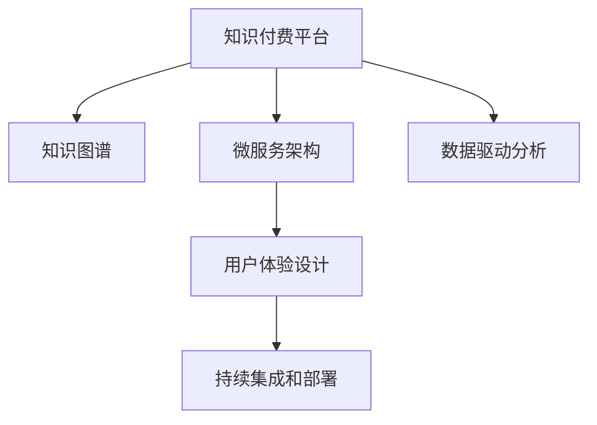

                 

# 知识经济时代下的知识付费创新课程开发流程

## 1. 背景介绍

### 1.1 问题由来
知识付费的兴起，标志着知识经济时代的到来。用户对个性化、高质量的知识内容需求不断增长，市场对于创新、高效的教育产品的需求日益迫切。在这一背景下，传统的讲授式、单向式教学方式已难以满足用户的个性化需求。

为了更好地满足用户需求，知识付费平台纷纷引入创新课程开发流程，以提升课程质量和用户满意度。这些创新课程开发流程，通常包括知识获取、内容制作、用户体验优化、运营数据分析等环节，旨在构建优质、系统、互动的学习体验，提升教育产品的市场竞争力。

### 1.2 问题核心关键点
创新课程开发流程的核心在于，如何将优质、易于传播的知识内容，通过课程形式系统性地传递给用户。这需要设计一套高效、灵活、可扩展的开发流程，涵盖知识提炼、内容制作、用户体验设计、数据分析等多个方面。

目前，知识付费平台通常采用敏捷开发、持续集成、数据驱动等先进方法，结合用户反馈和技术迭代，不断提升课程质量。以下将详细介绍知识付费创新课程开发的关键流程和实践经验，以期对从业者提供系统的指导。

## 2. 核心概念与联系

### 2.1 核心概念概述

为更好地理解知识付费创新课程开发流程，本节将介绍几个关键概念：

- **知识付费平台(Knowledge Paywall Platform)**：提供知识内容的在线平台，用户需支付费用才能获取课程资源。常见的知识付费平台包括网易有道、喜马拉雅、知乎live等。

- **知识图谱(Knowledge Graph)**：以结构化的形式描述知识实体及其关系，便于高效存储和检索知识。知识图谱的构建是知识提取和推荐的重要基础。

- **微服务架构(Microservices Architecture)**：将课程开发流程拆分为多个独立微服务模块，通过API接口协同工作，实现高效、灵活的课程开发。

- **用户体验设计(User Experience Design)**：通过用户行为分析、问卷调查、A/B测试等手段，不断优化课程界面和功能，提升用户学习体验。

- **持续集成和部署(CI/CD)**：通过自动化工具，实现代码版本控制、自动构建、测试、部署，提升开发效率和代码质量。

- **数据驱动分析(Data-Driven Analysis)**：利用数据挖掘和机器学习算法，对用户行为、课程反馈进行全面分析，指导课程优化和迭代。

这些核心概念通过以下Mermaid流程图来展示：



这个流程图展示了知识付费创新课程开发流程的核心概念及其之间的关系：

1. 知识付费平台通过知识图谱获取和组织知识内容，并通过微服务架构实现课程模块化开发。
2. 用户体验设计优化课程的界面和交互，提高用户使用体验。
3. 持续集成和部署提升开发效率和代码质量。
4. 数据驱动分析指导课程优化和迭代，提升课程质量。

## 3. 核心算法原理 & 具体操作步骤
### 3.1 算法原理概述

知识付费创新课程开发流程，本质上是一个系统化的知识编排、内容制作、用户体验优化和数据分析的过程。其核心思想是：通过数据驱动和技术手段，构建个性化、高质量的知识课程，提升用户学习效率和满意度。

形式化地，假设知识付费平台为一个智能教育系统 $S$，其目标函数为最大化用户满意度和课程销售收入。平台通过收集用户反馈和课程数据，不断优化算法模型和课程内容，以逼近这一目标。具体来说，可以通过以下算法实现：

1. **知识提取算法**：从大量文本、图片、视频等知识源中，提取出有价值的知识实体和关系，构建知识图谱。

2. **课程编排算法**：基于知识图谱和用户偏好，动态编排课程内容和结构，设计课程大纲。

3. **内容制作算法**：将课程内容模块化，制作高质量的课程讲义、视频、练习等，确保内容的逻辑性和连贯性。

4. **用户体验优化算法**：通过用户行为分析，设计互动式、沉浸式的课程界面，提高用户学习兴趣和参与度。

5. **运营数据分析算法**：利用机器学习算法，分析课程销售、用户行为等数据，指导课程优化和迭代。

### 3.2 算法步骤详解

知识付费创新课程开发流程一般包括以下几个关键步骤：

**Step 1: 知识获取**
- 采集并清洗来自不同渠道的知识数据，包括学术文献、行业报告、专家讲座等。
- 利用自然语言处理(NLP)、图像识别、视频分析等技术，提取有价值的知识实体和关系。
- 构建结构化的知识图谱，方便后续课程编排和内容制作。

**Step 2: 课程编排**
- 基于知识图谱和用户行为数据，设计课程大纲和章节结构。
- 根据用户反馈和学习效果，动态调整课程内容，确保课程的实用性和系统性。
- 引入课程推荐算法，根据用户兴趣和历史行为，推荐适合的课程。

**Step 3: 内容制作**
- 将课程内容拆分为多个模块，设计课程讲义、视频、习题等形式。
- 引入多媒体制作工具和技术，如视频编辑、PPT设计、在线课程录制等，制作高质量内容。
- 进行内容审核和校对，确保内容的准确性和逻辑性。

**Step 4: 用户体验优化**
- 设计互动式、沉浸式的课程界面，支持在线提问、讨论、作业提交等功能。
- 引入A/B测试等手段，不断优化课程界面和交互，提升用户使用体验。
- 引入实时数据分析，监控用户行为和课程反馈，及时调整和改进课程设计。

**Step 5: 持续集成和部署**
- 采用版本控制工具，如Git，进行代码版本管理和控制。
- 引入CI/CD工具，如Jenkins、GitLab CI，自动化构建、测试、部署课程内容。
- 建立自动化测试和部署流程，确保课程内容质量，减少人为错误。

**Step 6: 运营数据分析**
- 收集和分析课程销售、用户行为、课程反馈等数据。
- 利用机器学习算法，如协同过滤、推荐系统等，优化课程推荐和销售策略。
- 进行用户行为分析和预测，指导课程优化和迭代。

以上是知识付费创新课程开发的一般流程。在实际应用中，还需要根据具体平台的特点和用户需求，对各环节进行优化设计，如改进知识图谱构建算法、提升内容制作效率、增强用户体验互动等，以进一步提升课程质量。

### 3.3 算法优缺点

知识付费创新课程开发流程具有以下优点：
1. 系统化流程：通过标准化流程和工具，确保课程开发的规范性和效率。
2. 用户驱动：通过数据驱动和用户反馈，不断优化课程内容和用户体验。
3. 快速迭代：采用敏捷开发和持续集成，可以快速响应市场变化和用户需求。
4. 资源整合：通过微服务架构，实现知识资源的整合和共享，提升课程质量。

同时，该流程也存在一定的局限性：
1. 依赖技术实现：对技术团队和工具的依赖较大，开发成本较高。
2. 数据质量要求高：课程推荐和优化效果依赖高质量的数据，数据清洗和预处理难度较大。
3. 用户体验设计复杂：用户个性化需求多样，课程设计复杂且难以统一。
4. 模型训练成本高：算法模型训练需要大量计算资源，成本较高。
5. 内容制作复杂：课程内容制作涉及多媒体技术，技术门槛较高。

尽管存在这些局限性，但就目前而言，知识付费创新课程开发流程仍然是大规模知识传播的有效手段。未来相关研究的重点在于如何进一步降低开发成本，提高内容制作效率，提升用户体验，同时兼顾算法模型的解释性和可解释性等因素。

### 3.4 算法应用领域

知识付费创新课程开发流程在教育、培训、企业内训等多个领域均有广泛应用，具体包括：

- 在线教育平台：如Khan Academy、Coursera等，通过系统化的课程开发流程，提供高质量的在线教育资源。
- 企业培训：如Udemy、LinkedIn Learning，通过课程开发流程，为企业员工提供系统化的技能培训。
- 行业认证：如PMP、CFA等，通过课程开发流程，构建行业认证考试体系，提升行业从业者的专业能力。
- 在线咨询：如Alison、FutureLearn，通过课程开发流程，提供多样化的在线咨询服务。

除了这些常见应用外，知识付费创新课程开发流程还被创新性地应用到更多场景中，如知识短视频、微课制作、知识社区等，为知识传播和应用提供了新的技术手段。

## 4. 数学模型和公式 & 详细讲解 & 举例说明

### 4.1 数学模型构建

知识付费创新课程开发流程中的算法模型，通常包括知识提取、课程编排、内容制作、用户体验优化、运营数据分析等部分。以下以知识图谱的构建和推荐算法为例，进行详细讲解。

假设知识图谱中的节点为知识实体，边表示实体间的关系。定义知识图谱的邻接矩阵 $A$，其中 $A_{ij}=1$ 表示节点 $i$ 和 $j$ 之间有直接关系，$A_{ij}=0$ 表示无直接关系。节点度数 $D_i$ 和节点间关系数 $E_i$ 分别定义为：

$$
D_i = \sum_{j=1}^n A_{ij}
$$

$$
E_i = \sum_{j=1}^n A_{ij}A_{ji}
$$

其中 $n$ 为节点数，$A_{ij}A_{ji}$ 表示节点 $i$ 和 $j$ 间的双向关系数。

### 4.2 公式推导过程

知识图谱的构建和推荐算法基于图神经网络(Graph Neural Network, GNN)和图嵌入(Graph Embedding)技术。以下推导知识图谱推荐算法的公式：

假设知识图谱中有 $m$ 个用户节点 $U$ 和 $n$ 个知识节点 $K$，用户的隐向量表示为 $u_i$，知识的隐向量表示为 $k_j$。知识推荐模型的目标是最小化用户和知识间的相似度损失函数：

$$
\mathcal{L} = -\sum_{u \in U}\sum_{k \in K}u_i \cdot k_j
$$

其中 $\cdot$ 表示点积运算，$u_i \cdot k_j$ 表示用户 $u$ 对知识 $k$ 的兴趣程度。利用图嵌入技术，将用户和知识节点映射到低维空间，得到节点嵌入向量 $u_i'$ 和 $k_j'$。通过卷积神经网络(CNN)或图卷积网络(GCN)，对节点嵌入进行卷积操作，得到新的节点嵌入向量 $u_i''$ 和 $k_j''$。根据节点嵌入向量计算兴趣度：

$$
\hat{y}_{uk} = u_i'' \cdot k_j''
$$

其中 $\hat{y}_{uk}$ 表示用户 $u$ 对知识 $k$ 的兴趣预测值。

### 4.3 案例分析与讲解

假设某在线教育平台想要为用户推荐一门适合的编程课程。平台首先通过API接口，从知识图谱中获取用户和课程的隐向量表示。然后，利用图嵌入算法，将用户和课程节点映射到低维空间，得到新的节点嵌入向量。最后，通过图卷积网络对节点嵌入向量进行卷积操作，得到兴趣度预测值。

该预测值越高，表示用户对课程的兴趣越大。通过设定阈值，平台可以将兴趣度预测值排序，为用户推荐评分最高的几门课程。用户还可以查看其他用户对课程的评价和反馈，进一步优化课程选择。

## 5. 项目实践：代码实例和详细解释说明
### 5.1 开发环境搭建

在进行知识付费创新课程开发前，我们需要准备好开发环境。以下是使用Python进行Flask开发的环境配置流程：

1. 安装Anaconda：从官网下载并安装Anaconda，用于创建独立的Python环境。

2. 创建并激活虚拟环境：
```bash
conda create -n flask-env python=3.8 
conda activate flask-env
```

3. 安装Flask：
```bash
pip install flask
```

4. 安装SQLAlchemy：
```bash
pip install sqlalchemy
```

5. 安装Flask-SQLAlchemy：
```bash
pip install flask-sqlalchemy
```

6. 安装Flask-WTF：
```bash
pip install flask-wtf
```

完成上述步骤后，即可在`flask-env`环境中开始知识付费创新课程开发实践。

### 5.2 源代码详细实现

这里我们以知识图谱推荐系统为例，给出使用Flask框架进行课程推荐系统开发的PyTorch代码实现。

首先，定义课程推荐模型：

```python
from transformers import GNNModel, GCNModel
from flask import Flask, request, jsonify
from flask_sqlalchemy import SQLAlchemy
from flask_wtf import FlaskForm
from wtforms import StringField, SubmitField, IntegerField
from wtforms.validators import DataRequired

app = Flask(__name__)
app.config['SQLALCHEMY_DATABASE_URI'] = 'sqlite:////tmp/test.db'
db = SQLAlchemy(app)

# 定义知识图谱模型
class GraphModel(db.Model):
    id = db.Column(db.Integer, primary_key=True)
    node = db.Column(db.String(255), nullable=False)
    degree = db.Column(db.Integer, nullable=False)
    relation = db.Column(db.String(255), nullable=False)

    def __init__(self, node, degree, relation):
        self.node = node
        self.degree = degree
        self.relation = relation

# 定义课程推荐模型
class RecommendationModel:
    def __init__(self, graph_model, num_users, num_courses):
        self.graph_model = graph_model
        self.num_users = num_users
        self.num_courses = num_courses
        self.user_embeddings = None
        self.course_embeddings = None
        self.user_degrees = None
        self.course_degrees = None

    def load_embeddings(self):
        # 加载用户和课程嵌入向量
        user_embeddings = graph_model.user_embeddings.numpy()
        course_embeddings = graph_model.course_embeddings.numpy()
        return user_embeddings, course_embeddings

    def recommend_courses(self, user_id):
        # 根据用户嵌入向量计算兴趣度
        user_degree = graph_model.user_degrees.numpy()[user_id]
        user_embedding = user_embeddings[user_id]
        course_degrees = graph_model.course_degrees.numpy()
        course_embeddings = course_embeddings
        scores = np.dot(user_embedding, course_embeddings.T) * course_degrees
        return scores
```

然后，定义SQLAlchemy模型：

```python
# 定义SQLAlchemy模型
class GraphModel(db.Model):
    id = db.Column(db.Integer, primary_key=True)
    node = db.Column(db.String(255), nullable=False)
    degree = db.Column(db.Integer, nullable=False)
    relation = db.Column(db.String(255), nullable=False)

    def __init__(self, node, degree, relation):
        self.node = node
        self.degree = degree
        self.relation = relation
```

接着，定义Flask应用：

```python
@app.route('/recommend', methods=['POST'])
def recommend():
    user_id = request.json['user_id']
    recommendation_model = RecommendationModel(graph_model, num_users, num_courses)
    user_degree = graph_model.user_degrees.numpy()[user_id]
    user_embedding = user_embeddings[user_id]
    course_degrees = graph_model.course_degrees.numpy()
    course_embeddings = course_embeddings
    scores = np.dot(user_embedding, course_embeddings.T) * course_degrees
    return jsonify({'recommendations': scores.tolist()})
```

最后，启动Flask应用：

```python
if __name__ == '__main__':
    app.run(debug=True)
```

以上就是使用Flask框架进行知识图谱推荐系统的完整代码实现。可以看到，借助Flask的强大Web开发能力，知识图谱推荐系统的实现相对简洁高效。

### 5.3 代码解读与分析

让我们再详细解读一下关键代码的实现细节：

**GraphModel类**：
- `__init__`方法：初始化知识图谱的节点、度数和关系。
- `id`、`node`、`degree`、`relation`属性：分别表示知识图谱中的节点ID、节点名、度数和关系类型。

**RecommendationModel类**：
- `__init__`方法：初始化课程推荐模型的知识图谱、用户数、课程数等关键参数。
- `load_embeddings`方法：从知识图谱中加载用户和课程的嵌入向量。
- `recommend_courses`方法：根据用户嵌入向量计算课程兴趣度，返回推荐列表。

**Flask应用**：
- `/recommend`路由：接收用户ID，调用推荐模型计算课程兴趣度，并返回推荐列表。

**SQLAlchemy模型**：
- 定义知识图谱的节点表和属性。

可以看出，Flask框架和SQLAlchemy模型提供了简洁高效的手段，使得知识图谱推荐系统的开发变得相对简单。开发者可以将更多精力放在算法模型和数据处理上，而不必过多关注底层的实现细节。

当然，工业级的系统实现还需考虑更多因素，如课程推荐算法的优化、前后端数据的同步、用户数据的隐私保护等。但核心的知识图谱推荐流程基本与此类似。

## 6. 实际应用场景
### 6.1 在线教育平台

在线教育平台是知识付费创新课程开发的重要场景。平台通过系统化的课程开发流程，为用户提供高质量、系统化的课程资源。平台通常采用微服务架构，实现课程编排、内容制作、用户体验优化和数据分析等模块的独立开发和协同工作。

在课程编排阶段，平台通过知识图谱获取和组织知识内容，设计系统化的课程大纲和章节结构。在内容制作阶段，平台利用多媒体制作工具和技术，制作高质量的课程讲义、视频、习题等。在用户体验优化阶段，平台设计互动式、沉浸式的课程界面，提高用户学习兴趣和参与度。在运营数据分析阶段，平台利用机器学习算法，优化课程推荐和销售策略，提升用户满意度和课程销售收入。

### 6.2 企业培训

企业培训也是知识付费创新课程开发的重要应用场景。企业通过系统化的课程开发流程，为员工提供系统化的技能培训。企业通常采用敏捷开发和持续集成的方法，快速响应市场变化和用户需求，提升课程质量和开发效率。

在课程编排阶段，企业通过知识图谱获取和组织知识内容，设计系统化的课程大纲和章节结构。在内容制作阶段，企业利用多媒体制作工具和技术，制作高质量的课程讲义、视频、习题等。在用户体验优化阶段，企业设计互动式、沉浸式的课程界面，提高员工学习兴趣和参与度。在运营数据分析阶段，企业利用机器学习算法，优化课程推荐和培训效果，提升员工满意度和培训效果。

### 6.3 行业认证

行业认证也是知识付费创新课程开发的重要应用场景。行业通过系统化的课程开发流程，构建行业认证考试体系，提升从业者的专业能力。行业通常采用微服务架构，实现课程编排、内容制作、用户体验优化和数据分析等模块的独立开发和协同工作。

在课程编排阶段，行业通过知识图谱获取和组织知识内容，设计系统化的课程大纲和章节结构。在内容制作阶段，行业利用多媒体制作工具和技术，制作高质量的课程讲义、视频、习题等。在用户体验优化阶段，行业设计互动式、沉浸式的课程界面，提高从业者的学习兴趣和参与度。在运营数据分析阶段，行业利用机器学习算法，优化课程推荐和考试策略，提升从业者的专业能力和行业认证效果。

### 6.4 未来应用展望

随着知识付费平台的发展，基于知识图谱的课程推荐算法将在更多场景下得到应用。未来，知识图谱推荐系统将在以下领域发挥重要作用：

1. 个性化推荐系统：通过知识图谱和推荐算法，为每个用户推荐最感兴趣的课程。
2. 课程内容优化：利用知识图谱获取最新知识，优化课程内容和结构。
3. 用户行为分析：通过数据分析，了解用户的学习习惯和需求，指导课程设计。
4. 跨平台整合：将知识图谱和推荐算法整合到多个平台，实现统一的用户管理和服务。
5. 多模态融合：将知识图谱和推荐算法与其他模态数据（如视频、语音等）融合，提升课程质量和用户体验。

这些应用将极大地提升知识付费平台的竞争力和用户满意度，推动知识经济的进一步发展。

## 7. 工具和资源推荐
### 7.1 学习资源推荐

为了帮助开发者系统掌握知识付费创新课程开发流程的理论基础和实践技巧，这里推荐一些优质的学习资源：

1. **《深度学习与人工智能》课程**：斯坦福大学开设的深度学习课程，涵盖深度学习基础和应用，适合入门和进阶学习。
2. **《自然语言处理》课程**：Coursera上的自然语言处理课程，涵盖NLP的基本概念和实践技巧，适合NLP初学者。
3. **《机器学习实战》书籍**：一本系统介绍机器学习算法的实用书籍，适合编程实践。
4. **《Python深度学习》书籍**：一本介绍深度学习基础知识和实践技巧的实用书籍，适合入门和进阶学习。
5. **《知识图谱导论》书籍**：介绍知识图谱基本概念、构建方法和应用场景的书籍，适合深入了解知识图谱技术。

通过对这些资源的学习实践，相信你一定能够快速掌握知识付费创新课程开发流程的精髓，并用于解决实际的NLP问题。

### 7.2 开发工具推荐

高效的开发离不开优秀的工具支持。以下是几款用于知识付费创新课程开发开发的常用工具：

1. **Flask框架**：Python开发的Web框架，易于上手，适合快速搭建Web应用。
2. **SQLAlchemy**：Python的ORM框架，支持关系型数据库的操作和数据模型定义。
3. **Jupyter Notebook**：支持Python和其他编程语言，适合数据科学和机器学习的应用开发。
4. **TensorFlow**：Google开发的深度学习框架，支持GPU加速和分布式训练。
5. **PyTorch**：Facebook开发的深度学习框架，支持动态图和GPU加速，适合研究和实验。
6. **Keras**：高层次的神经网络API，支持TensorFlow和PyTorch，适合快速搭建模型。

合理利用这些工具，可以显著提升知识付费创新课程开发任务的开发效率，加快创新迭代的步伐。

### 7.3 相关论文推荐

知识付费创新课程开发流程的发展源于学界的持续研究。以下是几篇奠基性的相关论文，推荐阅读：

1. **《深度学习在推荐系统中的应用》**：介绍深度学习算法在推荐系统中的广泛应用，涵盖协同过滤、基于内容的推荐等方法。
2. **《知识图谱的构建与推荐》**：介绍知识图谱的基本概念和构建方法，及其在推荐系统中的应用。
3. **《基于图神经网络的推荐系统》**：介绍图神经网络在推荐系统中的基本原理和实现方法，及其在知识图谱推荐中的应用。
4. **《个性化推荐系统的设计》**：介绍个性化推荐系统的设计流程和关键技术，及其在知识付费平台中的应用。
5. **《课程内容优化与推荐系统》**：介绍课程内容优化和推荐系统的基本原理和实现方法，及其在在线教育平台中的应用。

这些论文代表了大规模知识传播技术的发展脉络。通过学习这些前沿成果，可以帮助研究者把握学科前进方向，激发更多的创新灵感。

## 8. 总结：未来发展趋势与挑战
### 8.1 总结

本文对知识付费创新课程开发流程进行了全面系统的介绍。首先阐述了知识付费平台的发展背景和应用意义，明确了知识图谱、微服务架构、用户体验设计、持续集成和部署、数据驱动分析等核心概念及其相互联系。其次，从原理到实践，详细讲解了知识图谱的构建和推荐算法的数学模型和公式推导过程，并给出了知识付费平台推荐系统的代码实现和详细解释。

通过本文的系统梳理，可以看到，知识付费创新课程开发流程是一个系统化的知识编排、内容制作、用户体验优化和数据分析的过程，具有高效、灵活、可扩展等优点。这种流程的引入，极大地提升了知识传播的效率和效果，推动了知识经济的进一步发展。

### 8.2 未来发展趋势

展望未来，知识付费创新课程开发流程将呈现以下几个发展趋势：

1. **知识图谱技术的发展**：知识图谱的构建和应用将更加精细化和智能化，能够更全面地描述知识实体和关系，为课程推荐提供更精准的数据支持。
2. **深度学习模型的应用**：深度学习算法将在课程编排、内容制作和用户体验优化中得到更广泛的应用，提升课程质量和用户满意度。
3. **用户行为分析的深入**：用户行为分析将更加细致和全面，能够更好地了解用户的学习习惯和需求，指导课程设计和优化。
4. **多模态数据融合**：知识付费平台将更多地融合视觉、语音、文本等模态数据，提供更加丰富和沉浸式的学习体验。
5. **个性化推荐的提升**：个性化推荐系统将更加智能和高效，能够根据用户的多样化需求，推荐最感兴趣的课程。
6. **跨平台整合**：知识付费平台将更多地整合到其他平台，实现统一的用户管理和服务。

这些趋势将推动知识付费平台向更高水平发展，为用户提供更加个性化、系统化、高质量的知识服务。

### 8.3 面临的挑战

尽管知识付费创新课程开发流程已经取得了显著成果，但在迈向更加智能化、普适化应用的过程中，它仍面临诸多挑战：

1. **数据质量问题**：课程推荐和优化效果依赖高质量的数据，数据清洗和预处理难度较大。
2. **技术复杂度**：知识图谱、深度学习、用户行为分析等技术难度较大，对技术团队的要求较高。
3. **用户体验设计**：用户个性化需求多样，课程设计复杂且难以统一，用户体验优化难度较大。
4. **模型训练成本高**：算法模型训练需要大量计算资源，成本较高。
5. **课程质量控制**：课程质量控制和内容审核难度较大，需要专业团队进行管理。
6. **平台整合复杂**：不同平台的整合和协同工作复杂，需要统一标准和规范。

尽管存在这些挑战，但知识付费创新课程开发流程仍具有广阔的应用前景。未来相关研究的重点在于如何进一步降低开发成本，提高内容制作效率，提升用户体验，同时兼顾算法模型的解释性和可解释性等因素。

### 8.4 研究展望

面对知识付费创新课程开发流程所面临的挑战，未来的研究需要在以下几个方面寻求新的突破：

1. **自动化课程编排**：引入自动化算法，根据知识图谱和用户反馈，自动编排课程大纲和章节结构。
2. **知识图谱的构建和优化**：引入更多先进的知识图谱构建方法，提升知识图谱的质量和完备性。
3. **多模态知识整合**：引入多媒体技术和知识融合方法，提升课程内容的丰富性和沉浸式体验。
4. **用户行为分析的优化**：引入更多先进的机器学习算法，提升用户行为分析和预测的准确性。
5. **个性化推荐的提升**：引入更多先进的推荐算法，提升个性化推荐的精度和效率。
6. **跨平台整合的优化**：引入更多标准化和规范化的技术手段，优化跨平台整合和协同工作。

这些研究方向的探索，必将引领知识付费平台迈向更高的台阶，为用户提供更加个性化、系统化、高质量的知识服务。面向未来，知识付费创新课程开发流程需要与其他人工智能技术进行更深入的融合，如知识表示、因果推理、强化学习等，多路径协同发力，共同推动自然语言理解和智能交互系统的进步。只有勇于创新、敢于突破，才能不断拓展知识传播的边界，让知识付费平台更好地服务于社会和用户。

## 9. 附录：常见问题与解答

**Q1: 知识付费平台如何进行知识图谱的构建？**

A: 知识图谱的构建主要包括以下几个步骤：
1. 数据采集：从开放数据源、百科全书、行业报告等渠道获取知识数据。
2. 数据清洗：去除噪声、重复和错误数据，构建高质量的数据集。
3. 数据标注：对知识数据进行标注，包括实体识别、关系抽取等。
4. 图谱构建：将标注后的知识数据构建成图谱，包括节点和边。
5. 图谱优化：通过数据融合、关系推理等方法，优化图谱结构和内容。

知识图谱的构建需要丰富的领域知识和数据资源，以及先进的技术手段。一般来说，知识付费平台可以与第三方数据提供商合作，获取高质量的数据资源，或者采用开源数据集进行构建。

**Q2: 课程推荐系统的评价指标有哪些？**

A: 课程推荐系统的评价指标包括以下几个方面：
1. 准确率：推荐系统推荐的课程与用户实际选择的课程之间的匹配度。
2. 覆盖率：推荐系统推荐的课程覆盖用户兴趣范围的广度。
3. 多样性：推荐系统推荐的课程多样性，避免过度集中。
4. 新颖性：推荐系统推荐的新课程数与旧课程数之比。
5. 用户体验：用户对推荐系统界面的满意度、操作便捷性等。

通过这些指标的评估，可以全面了解推荐系统的性能，指导课程推荐算法的优化。

**Q3: 知识付费平台如何进行用户行为分析？**

A: 知识付费平台的用户行为分析主要包括以下几个步骤：
1. 数据采集：采集用户在平台上的行为数据，包括浏览、点击、购买、评价等。
2. 数据清洗：去除噪声、重复和错误数据，构建高质量的数据集。
3. 特征提取：提取用户行为的关键特征，包括浏览时长、点击次数、购买金额等。
4. 模型训练：使用机器学习算法，如协同过滤、推荐系统等，对用户行为数据进行建模和预测。
5. 结果评估：评估推荐系统的性能指标，指导课程推荐和优化。

通过用户行为分析，平台可以更好地了解用户的学习习惯和需求，指导课程设计和优化，提升用户体验和课程质量。

**Q4: 知识付费平台如何进行课程优化？**

A: 知识付费平台的课程优化主要包括以下几个方面：
1. 内容制作：提升课程内容的丰富性和可理解性，通过多媒体制作工具和技术，制作高质量的课程讲义、视频、习题等。
2. 用户体验设计：设计互动式、沉浸式的课程界面，提高用户学习兴趣和参与度。
3. 学习路径设计：根据用户的学习进度和兴趣，设计合理的课程学习路径，提升学习效率。
4. 课程反馈收集：通过问卷调查、在线评价等手段，收集用户对课程的反馈，指导课程优化和迭代。

通过课程优化，平台可以提升课程质量和用户满意度，增强用户黏性和平台竞争力。

**Q5: 知识付费平台如何进行跨平台整合？**

A: 知识付费平台的跨平台整合主要包括以下几个步骤：
1. 数据标准化：将不同平台的数据进行标准化和统一，建立统一的数据模型和格式。
2. 系统集成：将不同平台的技术架构和功能模块进行集成，实现统一的用户管理和服务。
3. 统一接口：设计统一的API接口，实现平台间的数据交换和协同工作。
4. 用户身份认证：实现不同平台之间的用户身份认证和授权，保障用户数据安全和隐私。
5. 统一推荐系统：引入统一的推荐算法和数据模型，实现跨平台的课程推荐和优化。

通过跨平台整合，知识付费平台可以实现统一的用户管理和服务，提升用户体验和平台竞争力。

---

作者：禅与计算机程序设计艺术 / Zen and the Art of Computer Programming

