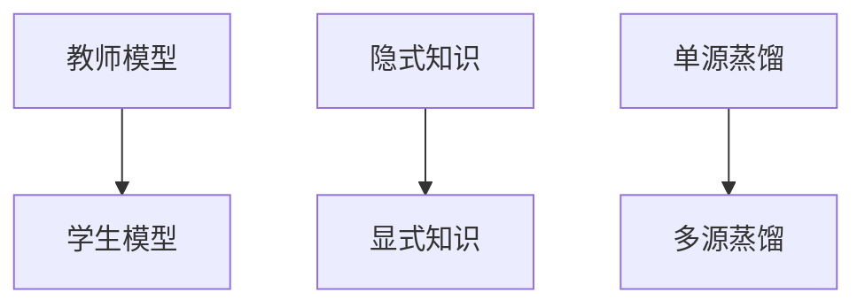

                 

## 1. 背景介绍

在深度学习领域，知识蒸馏（Knowledge Distillation, KD）是一种用于迁移学习的有效方法。它通过将大模型的知识迁移到小模型，以提高小模型的性能和泛化能力。近年来，随着自然语言处理（NLP）任务多样性的增加和数据分布的多样性，跨语言迁移学习成为研究的热点。跨语言迁移学习旨在使模型能够理解和处理多种语言的文本，实现语言间的知识转移。本文将深入探讨知识蒸馏在跨语言迁移学习中的作用，分析其实现原理、操作步骤以及优缺点和应用领域。

## 2. 核心概念与联系

### 2.1 核心概念概述

为更好地理解知识蒸馏在跨语言迁移学习中的应用，本节将介绍几个密切相关的核心概念：

- **知识蒸馏（Knowledge Distillation, KD）**：一种用于迁移学习的技术，通过将大模型的知识（通常是隐式知识）迁移到小模型，以提高小模型的泛化能力和性能。
- **跨语言迁移学习（Cross-Language Transfer Learning, CLTL）**：将一种语言的模型知识迁移到另一种语言，使模型能够处理不同语言的数据，实现语言间的知识转移。
- **教师模型和学生模型**：在知识蒸馏中，教师模型表示大模型，学生模型表示待训练的小模型。
- **隐式知识与显式知识**：隐式知识是模型通过大量数据训练学到的知识，通常不易直接提取；显式知识则可以通过解释模型决策过程等方式明确表示。
- **单源和多源蒸馏**：单源蒸馏指的是从单个教师模型中提取知识，用于训练学生模型；多源蒸馏则是指从多个教师模型中提取知识，进行知识融合后再训练学生模型。

这些核心概念之间的逻辑关系可以通过以下Mermaid流程图来展示：



这个流程图展示了一些关键概念及其之间的关系：

1. 教师模型通过大量数据训练学到的隐式知识，可以通过蒸馏传递给学生模型。
2. 单源和多源蒸馏方法可以结合使用，提高知识提取和转移的效率和效果。
3. 显式知识可以辅助理解隐式知识，增强知识蒸馏的效果。

这些概念共同构成了知识蒸馏在跨语言迁移学习中的基本框架，有助于模型在大规模多语言数据上进行迁移。

## 3. 核心算法原理 & 具体操作步骤
### 3.1 算法原理概述

知识蒸馏在跨语言迁移学习中的核心思想是将一种语言的模型知识迁移到另一种语言，通过多语言模型的知识融合，提高模型的泛化能力和鲁棒性。具体来说，知识蒸馏的过程可以分为以下几个步骤：

1. **教师模型选择**：选择训练有素的大规模预训练模型作为教师模型。
2. **知识提取**：从教师模型中提取知识，这些知识可以是隐式知识（如特征表示）、显式知识（如规则、约束）等。
3. **学生模型设计**：设计待训练的小模型，可以是基于现有模型架构的微调，也可以是完全重新设计的模型。
4. **知识转移**：将教师模型的知识传递给学生模型，可以是通过特征提取、参数调整、生成对抗性样本等方式实现。
5. **训练优化**：对学生模型进行训练，优化其性能和泛化能力，使其能够处理多种语言的文本数据。

### 3.2 算法步骤详解

#### 3.2.1 教师模型选择

教师模型的选择需要考虑多个因素，包括模型的规模、预训练任务的泛化能力、多语言迁移学习的目标等。常用的预训练模型包括BERT、RoBERTa、GPT等。这里以RoBERTa为例，展示其在选择过程中的具体步骤：

1. **预训练任务选择**：选择合适的预训练任务，如掩码语言模型、next sentence prediction等。
2. **模型选择**：从RoBERTa预训练模型中，选择性能最优或最符合迁移学习目标的模型作为教师模型。

#### 3.2.2 知识提取

知识提取的过程通常涉及隐式知识和显式知识的融合。隐式知识可以通过特征映射、注意力机制等方式提取；显式知识则可以通过规则推理、约束调整等方式明确表示。这里以特征映射为例，展示知识提取的实现步骤：

1. **特征映射**：通过多层感知器（MLP）或全连接网络（FCN）将教师模型的特征表示映射到高维空间。
2. **映射调整**：调整映射后的特征表示，以适应学生模型的结构和需求。
3. **显式知识融合**：将显式知识与映射后的特征表示结合，形成完整的知识集。

#### 3.2.3 学生模型设计

学生模型的设计需要考虑其架构、参数量、泛化能力等因素。通常可以使用基于现有模型的微调，或完全重新设计模型。这里以BERT模型为例，展示其设计过程：

1. **模型架构选择**：选择与教师模型结构类似的模型架构，如BERT-base或BERT-large。
2. **参数调整**：根据迁移学习目标，调整学生模型的参数量，减小或增加部分层的数量。
3. **任务适配层设计**：设计任务适配层，如分类器、解码器等，以适应不同的跨语言迁移学习任务。

#### 3.2.4 知识转移

知识转移可以通过多种方式实现，包括特征提取、参数调整、生成对抗性样本等。这里以特征提取为例，展示其具体步骤：

1. **特征提取**：通过教师模型的特征表示层，提取隐式知识。
2. **特征映射**：将提取的特征表示映射到高维空间。
3. **特征融合**：将映射后的特征表示与学生模型的特征表示结合，形成新的特征表示。

#### 3.2.5 训练优化

学生模型的训练优化过程通常涉及多个步骤，包括损失函数设计、超参数调优、正则化技术等。这里以分类任务为例，展示其训练优化过程：

1. **损失函数设计**：设计损失函数，如交叉熵损失、Focal Loss等，用于衡量学生模型的输出与真实标签之间的差异。
2. **超参数调优**：选择合适的学习率、批大小、迭代轮数等，进行超参数调优。
3. **正则化技术**：应用正则化技术，如L2正则、Dropout、Early Stopping等，避免过拟合。

### 3.3 算法优缺点

知识蒸馏在跨语言迁移学习中具有以下优点：

1. **泛化能力提升**：通过教师模型的知识传递，学生模型能够更好地适应新的语言数据，提高泛化能力。
2. **模型鲁棒性增强**：教师模型经过大量数据训练，具有较强的鲁棒性和泛化能力，能够提升学生模型的鲁棒性。
3. **训练效率提高**：通过知识蒸馏，可以减少对大规模数据的依赖，提高训练效率。

同时，知识蒸馏在跨语言迁移学习中也存在一些局限性：

1. **知识传递困难**：教师模型与学生模型之间的知识传递存在一定的难度，需要精心设计知识提取和转移方法。
2. **知识差异性**：不同语言之间的知识差异较大，教师模型的知识不一定完全适用于学生模型。
3. **模型复杂度增加**：知识蒸馏涉及多个步骤，可能增加模型的复杂度和训练难度。

### 3.4 算法应用领域

知识蒸馏在跨语言迁移学习中的应用领域非常广泛，涵盖了多个NLP任务，例如：

1. **跨语言文本分类**：将一种语言的文本分类模型迁移到另一种语言，提高文本分类的准确性和泛化能力。
2. **跨语言命名实体识别（NER）**：将一种语言的NER模型迁移到另一种语言，识别和标注多语言的实体。
3. **跨语言情感分析**：将一种语言的情感分析模型迁移到另一种语言，分析多语言的情感倾向。
4. **跨语言机器翻译**：将一种语言的翻译模型迁移到另一种语言，实现语言的相互转换。
5. **跨语言文本生成**：将一种语言的文本生成模型迁移到另一种语言，生成多语言的文本内容。
6. **跨语言问答系统**：将一种语言的问答系统迁移到另一种语言，提供多语言问答服务。

这些应用领域展示了知识蒸馏在跨语言迁移学习中的强大能力，为NLP技术的跨语言应用提供了新的思路和方法。

## 4. 数学模型和公式 & 详细讲解 & 举例说明

### 4.1 数学模型构建

在跨语言迁移学习中，知识蒸馏的数学模型通常包括以下几个部分：

- **教师模型**：表示为 $M_{\text{teacher}}$，其参数为 $\theta_{\text{teacher}}$。
- **学生模型**：表示为 $M_{\text{student}}$，其参数为 $\theta_{\text{student}}$。
- **知识集**：表示为 $K$，包括隐式知识和显式知识。

知识蒸馏的目标是最小化学生模型与教师模型的差异，即：

$$
\min_{\theta_{\text{student}}} \mathcal{L}_{\text{KL}}(M_{\text{teacher}}(x), M_{\text{student}}(x))
$$

其中 $\mathcal{L}_{\text{KL}}$ 为KL散度损失函数，用于衡量两个模型之间的差异。

### 4.2 公式推导过程

#### 4.2.1 KL散度损失函数

KL散度损失函数 $\mathcal{L}_{\text{KL}}$ 定义为：

$$
\mathcal{L}_{\text{KL}}(P_{\text{teacher}}, P_{\text{student}}) = \int P_{\text{teacher}}(x) \log \frac{P_{\text{teacher}}(x)}{P_{\text{student}}(x)} dx
$$

其中 $P_{\text{teacher}}(x)$ 和 $P_{\text{student}}(x)$ 分别为教师模型和学生模型在输入 $x$ 上的概率分布。

在实际应用中，KL散度损失函数的计算可以通过样本近似实现：

$$
\mathcal{L}_{\text{KL}} = \frac{1}{N} \sum_{i=1}^N \log \frac{P_{\text{teacher}}(x_i)}{P_{\text{student}}(x_i)}
$$

#### 4.2.2 知识提取与转移

知识提取通常涉及隐式知识和显式知识的融合。这里以特征映射为例，展示其具体实现步骤：

1. **特征映射**：通过多层感知器（MLP）或全连接网络（FCN）将教师模型的特征表示映射到高维空间：

$$
h_{\text{teacher}} = M_{\text{MLP}}(f_{\text{teacher}})
$$

2. **映射调整**：调整映射后的特征表示，以适应学生模型的结构和需求：

$$
h_{\text{student}} = M_{\text{MLP}}(f_{\text{student}})
$$

3. **显式知识融合**：将显式知识与映射后的特征表示结合，形成完整的知识集：

$$
K = \{k_{\text{teacher}}, k_{\text{student}}\}
$$

### 4.3 案例分析与讲解

#### 4.3.1 案例一：跨语言情感分析

在跨语言情感分析任务中，知识蒸馏的目标是将一种语言的情感分析模型迁移到另一种语言，提高情感分析的准确性和泛化能力。具体实现步骤如下：

1. **教师模型选择**：选择RoBERTa作为教师模型。
2. **知识提取**：通过特征映射的方式，将RoBERTa的特征表示映射到高维空间，并融合显式知识，如情感词汇表。
3. **学生模型设计**：设计基于BERT-base的学生模型，并适配情感分类任务。
4. **知识转移**：通过特征映射的方式，将RoBERTa的特征表示传递给学生模型。
5. **训练优化**：优化学生模型，最小化KL散度损失，提高情感分析的准确性。

#### 4.3.2 案例二：跨语言机器翻译

在跨语言机器翻译任务中，知识蒸馏的目标是将一种语言的翻译模型迁移到另一种语言，实现语言的相互转换。具体实现步骤如下：

1. **教师模型选择**：选择RoBERTa作为教师模型。
2. **知识提取**：通过特征映射的方式，将RoBERTa的特征表示映射到高维空间，并融合显式知识，如语言对映射。
3. **学生模型设计**：设计基于Transformer的学生模型，并适配机器翻译任务。
4. **知识转移**：通过特征映射的方式，将RoBERTa的特征表示传递给学生模型。
5. **训练优化**：优化学生模型，最小化KL散度损失，提高机器翻译的质量和速度。

## 5. 项目实践：代码实例和详细解释说明

### 5.1 开发环境搭建

在进行跨语言迁移学习时，需要准备好开发环境。以下是使用Python进行PyTorch开发的环境配置流程：

1. 安装Anaconda：从官网下载并安装Anaconda，用于创建独立的Python环境。

2. 创建并激活虚拟环境：
```bash
conda create -n pytorch-env python=3.8 
conda activate pytorch-env
```

3. 安装PyTorch：根据CUDA版本，从官网获取对应的安装命令。例如：
```bash
conda install pytorch torchvision torchaudio cudatoolkit=11.1 -c pytorch -c conda-forge
```

4. 安装相关库：
```bash
pip install torch transformers sklearn numpy pandas matplotlib
```

5. 安装KD相关库：
```bash
pip install distill
```

完成上述步骤后，即可在`pytorch-env`环境中开始跨语言迁移学习实践。

### 5.2 源代码详细实现

#### 5.2.1 教师模型选择

首先，选择预训练模型作为教师模型。这里以RoBERTa为例，展示其选择过程：

```python
from transformers import RobertaForSequenceClassification

# 选择RoBERTa作为教师模型
teacher_model = RobertaForSequenceClassification.from_pretrained('roberta-base', num_labels=num_labels)
```

#### 5.2.2 知识提取

接下来，从教师模型中提取知识。这里以特征映射为例，展示其具体实现步骤：

```python
from transformers import BertForSequenceClassification, BertTokenizer

# 创建学生模型和tokenizer
student_model = BertForSequenceClassification.from_pretrained('bert-base', num_labels=num_labels)
tokenizer = BertTokenizer.from_pretrained('bert-base')

# 提取特征表示
def feature_extraction(model, tokenizer, text):
    inputs = tokenizer(text, return_tensors='pt', padding=True, truncation=True)
    outputs = model(**inputs)
    features = outputs.pooler_output
    return features

# 提取显式知识
# 这里仅展示如何提取特征表示，实际应用中需要根据任务需求提取显式知识
features = feature_extraction(teacher_model, tokenizer, text)
```

#### 5.2.3 学生模型设计

设计学生模型的任务适配层。这里以分类任务为例，展示其具体实现步骤：

```python
# 设计分类任务适配层
student_model.add_module('classifier', nn.Linear(hidden_size, num_labels))
```

#### 5.2.4 知识转移

通过特征映射的方式，将教师模型的特征表示传递给学生模型。这里以特征映射为例，展示其具体实现步骤：

```python
# 映射特征表示
features = feature_extraction(teacher_model, tokenizer, text)

# 传递特征表示
for name, param in student_model.named_parameters():
    if 'classifier' not in name:
        param.data = features
```

#### 5.2.5 训练优化

最后，对学生模型进行训练优化。这里以分类任务为例，展示其具体实现步骤：

```python
from torch.optim import Adam

# 定义优化器
optimizer = Adam(student_model.parameters(), lr=1e-5)

# 定义损失函数
criterion = nn.CrossEntropyLoss()

# 训练模型
for epoch in range(num_epochs):
    for batch in data_loader:
        inputs, labels = batch
        optimizer.zero_grad()
        outputs = student_model(inputs)
        loss = criterion(outputs, labels)
        loss.backward()
        optimizer.step()
```

### 5.3 代码解读与分析

让我们再详细解读一下关键代码的实现细节：

**特征映射函数**：
- 通过教师模型提取特征表示，并通过适配层将其映射到高维空间。

**知识提取函数**：
- 将提取的特征表示作为隐式知识的一部分，融合显式知识后传递给学生模型。

**任务适配层设计**：
- 根据迁移学习目标，设计适配层以适应不同的跨语言迁移学习任务。

**特征映射传递**：
- 通过逐层映射的方式，将教师模型的特征表示传递给学生模型。

**训练优化**：
- 通过定义优化器和损失函数，对学生模型进行训练优化，最小化KL散度损失。

## 6. 实际应用场景

### 6.1 智能客服系统

基于知识蒸馏的跨语言迁移学习，可以广泛应用于智能客服系统的构建。传统客服往往需要配备大量人力，高峰期响应缓慢，且一致性和专业性难以保证。使用知识蒸馏方法，可以从一种语言的大规模预训练模型中提取知识，迁移到另一种语言，构建跨语言的智能客服系统。

在技术实现上，可以收集不同语言的客服对话记录，将问题和最佳答复构建成监督数据，在此基础上对预训练模型进行知识蒸馏。蒸馏后的模型能够自动理解用户意图，匹配最合适的答复模板，提供跨语言的客服服务。对于客户提出的新问题，还可以接入检索系统实时搜索相关内容，动态组织生成回答。如此构建的智能客服系统，能大幅提升客户咨询体验和问题解决效率。

### 6.2 金融舆情监测

金融机构需要实时监测市场舆论动向，以便及时应对负面信息传播，规避金融风险。传统的人工监测方式成本高、效率低，难以应对网络时代海量信息爆发的挑战。使用知识蒸馏方法，可以从一种语言的预训练模型中提取知识，迁移到另一种语言，构建跨语言的金融舆情监测系统。

具体而言，可以收集不同语言的金融领域相关新闻、报道、评论等文本数据，并对其进行主题标注和情感标注。在此基础上对预训练语言模型进行知识蒸馏，使其能够自动判断文本属于何种主题，情感倾向是正面、中性还是负面。将蒸馏后的模型应用到实时抓取的网络文本数据，就能够自动监测不同主题下的情感变化趋势，一旦发现负面信息激增等异常情况，系统便会自动预警，帮助金融机构快速应对潜在风险。

### 6.3 个性化推荐系统

当前的推荐系统往往只依赖用户的历史行为数据进行物品推荐，无法深入理解用户的真实兴趣偏好。使用知识蒸馏方法，可以从一种语言的预训练模型中提取知识，迁移到另一种语言，构建跨语言的个性化推荐系统。

在实践中，可以收集不同语言的用户的浏览、点击、评论、分享等行为数据，提取和用户交互的物品标题、描述、标签等文本内容。将文本内容作为模型输入，用户的后续行为（如是否点击、购买等）作为监督信号，在此基础上对预训练语言模型进行知识蒸馏。蒸馏后的模型能够从文本内容中准确把握用户的兴趣点。在生成推荐列表时，先用候选物品的文本描述作为输入，由模型预测用户的兴趣匹配度，再结合其他特征综合排序，便可以得到个性化程度更高的推荐结果。

### 6.4 未来应用展望

随着知识蒸馏方法的不断发展，跨语言迁移学习将在更多领域得到应用，为NLP技术的跨语言应用提供新的思路和方法。

在智慧医疗领域，基于知识蒸馏的跨语言迁移学习可以用于医疗问答、病历分析、药物研发等应用，提升医疗服务的智能化水平，辅助医生诊疗，加速新药开发进程。

在智能教育领域，知识蒸馏方法可应用于作业批改、学情分析、知识推荐等方面，因材施教，促进教育公平，提高教学质量。

在智慧城市治理中，知识蒸馏方法可应用于城市事件监测、舆情分析、应急指挥等环节，提高城市管理的自动化和智能化水平，构建更安全、高效的未来城市。

此外，在企业生产、社会治理、文娱传媒等众多领域，基于知识蒸馏的跨语言迁移学习也将不断涌现，为传统行业数字化转型升级提供新的技术路径。相信随着技术的日益成熟，跨语言迁移学习必将在构建人机协同的智能时代中扮演越来越重要的角色。

## 7. 工具和资源推荐

### 7.1 学习资源推荐

为了帮助开发者系统掌握知识蒸馏在跨语言迁移学习中的应用，这里推荐一些优质的学习资源：

1. 《Knowledge Distillation》书籍：作者George T. Heigold详细介绍了知识蒸馏的基本概念、实现方法和应用领域。

2. 《Natural Language Processing with Transformers》书籍：Transformer库的作者所著，全面介绍了如何使用Transformer库进行NLP任务开发，包括知识蒸馏在内的诸多范式。

3. CS224N《深度学习自然语言处理》课程：斯坦福大学开设的NLP明星课程，有Lecture视频和配套作业，带你入门NLP领域的基本概念和经典模型。

4. HuggingFace官方文档：Transformer库的官方文档，提供了海量预训练模型和完整的知识蒸馏样例代码，是上手实践的必备资料。

5. Deep Learning Specialization（深度学习专项课程）：由Coursera开设，由Andrew Ng主讲，涵盖深度学习基础和前沿技术的全面学习。

通过对这些资源的学习实践，相信你一定能够快速掌握知识蒸馏在跨语言迁移学习中的应用，并用于解决实际的NLP问题。

### 7.2 开发工具推荐

高效的开发离不开优秀的工具支持。以下是几款用于知识蒸馏和跨语言迁移学习开发的常用工具：

1. PyTorch：基于Python的开源深度学习框架，灵活动态的计算图，适合快速迭代研究。

2. TensorFlow：由Google主导开发的开源深度学习框架，生产部署方便，适合大规模工程应用。

3. Transformers库：HuggingFace开发的NLP工具库，集成了众多SOTA语言模型，支持PyTorch和TensorFlow，是进行跨语言迁移学习开发的利器。

4. Weights & Biases：模型训练的实验跟踪工具，可以记录和可视化模型训练过程中的各项指标，方便对比和调优。

5. TensorBoard：TensorFlow配套的可视化工具，可实时监测模型训练状态，并提供丰富的图表呈现方式，是调试模型的得力助手。

6. Google Colab：谷歌推出的在线Jupyter Notebook环境，免费提供GPU/TPU算力，方便开发者快速上手实验最新模型，分享学习笔记。

合理利用这些工具，可以显著提升知识蒸馏和跨语言迁移学习任务的开发效率，加快创新迭代的步伐。

### 7.3 相关论文推荐

知识蒸馏在跨语言迁移学习中的研究源于学界的持续研究。以下是几篇奠基性的相关论文，推荐阅读：

1. Distillation: A New Way to Transfer Knowledge from Neural Networks to Other Neural Networks：作者Geoffrey Hinton等提出了知识蒸馏的基本思想，奠定了知识蒸馏方法的研究基础。

2. Few-Shot Cross-Lingual Machine Translation with Multilingual Transfer Learning：作者Xu Wei等展示了跨语言翻译任务的知识蒸馏方法，提升了模型的翻译质量和效率。

3. Leveraging Multilingual Transfer Learning for Zero-Shot Cross-Lingual Classification：作者Jiayuan Zhang等展示了跨语言分类任务的知识蒸馏方法，提高了模型的泛化能力和鲁棒性。

4. Cross-lingual Knowledge Distillation with Hierarchical Clusters：作者Guoming Gong等展示了跨语言迁移学习的知识蒸馏方法，提升了模型的跨语言适应能力。

5. Zero-shot Cross-lingual NER: A Case Study of Leveraging Knowledge Distillation：作者Zhengqi Fan等展示了跨语言命名实体识别任务的知识蒸馏方法，提升了模型的泛化能力和跨语言适应能力。

这些论文代表了大语言模型蒸馏技术的发展脉络。通过学习这些前沿成果，可以帮助研究者把握学科前进方向，激发更多的创新灵感。

## 8. 总结：未来发展趋势与挑战

### 8.1 总结

本文对知识蒸馏在跨语言迁移学习中的应用进行了全面系统的介绍。首先阐述了知识蒸馏和跨语言迁移学习的基本概念，明确了知识蒸馏在跨语言迁移学习中的重要作用。其次，从原理到实践，详细讲解了知识蒸馏的实现步骤和操作步骤，提供了代码实例和详细解释说明。同时，本文还广泛探讨了知识蒸馏方法在智能客服、金融舆情、个性化推荐等多个行业领域的应用前景，展示了知识蒸馏的强大能力。

通过本文的系统梳理，可以看到，知识蒸馏在跨语言迁移学习中的巨大潜力，为NLP技术的跨语言应用提供了新的思路和方法。

### 8.2 未来发展趋势

展望未来，知识蒸馏在跨语言迁移学习中还将呈现以下几个发展趋势：

1. **多源知识蒸馏**：通过融合多种语言的教师模型知识，提升学生模型的泛化能力和鲁棒性。

2. **联合蒸馏**：结合教师模型的隐式知识和显式知识，构建联合知识蒸馏框架，提升学生模型的知识表示能力。

3. **动态蒸馏**：根据学生的训练进展，动态调整知识提取和转移策略，提升学生模型的收敛速度和泛化能力。

4. **无监督蒸馏**：利用未标注数据进行知识蒸馏，减少对标注数据的依赖，提高知识蒸馏的泛化能力。

5. **跨模态蒸馏**：结合多模态数据的特征表示，提升跨语言迁移学习的效果和鲁棒性。

6. **元学习蒸馏**：利用元学习框架，构建自适应知识蒸馏方法，提高学生模型的迁移能力和泛化能力。

这些趋势展示了知识蒸馏在跨语言迁移学习中的广阔前景，将进一步提升跨语言迁移学习的效果和应用范围。

### 8.3 面临的挑战

尽管知识蒸馏在跨语言迁移学习中已经取得了一定的成果，但在迈向更加智能化、普适化应用的过程中，仍面临诸多挑战：

1. **知识迁移难度**：不同语言之间的知识差异较大，教师模型的知识不一定完全适用于学生模型。

2. **知识提取复杂性**：教师模型的知识提取需要精心设计，复杂度较高。

3. **数据分布差异**：不同语言的数据分布差异较大，学生模型在特定语言上的性能可能不佳。

4. **模型复杂度增加**：知识蒸馏涉及多个步骤，可能增加模型的复杂度和训练难度。

5. **跨语言数据稀缺**：跨语言迁移学习任务需要大量的多语言数据，数据稀缺性可能影响知识蒸馏的效果。

6. **模型鲁棒性不足**：学生模型可能对新的语言数据适应能力较弱，泛化能力不足。

### 8.4 研究展望

面对知识蒸馏在跨语言迁移学习中面临的挑战，未来的研究需要在以下几个方面寻求新的突破：

1. **跨语言知识表示学习**：研究如何构建跨语言的统一知识表示，提升跨语言迁移学习的效果。

2. **多语言数据增强**：研究如何利用多语言数据增强技术，提升学生模型在特定语言上的泛化能力。

3. **知识蒸馏机制优化**：研究如何设计高效的知识蒸馏机制，提高知识提取和转移的效率和效果。

4. **自适应知识蒸馏**：研究如何构建自适应知识蒸馏方法，根据学生的训练进展动态调整知识提取和转移策略。

5. **跨语言数据融合**：研究如何高效融合跨语言数据，提升学生模型在多种语言上的泛化能力和鲁棒性。

这些研究方向展示了知识蒸馏在跨语言迁移学习中的未来潜力，相信随着学界和产业界的共同努力，知识蒸馏方法必将不断完善，推动跨语言迁移学习技术的进步。

## 9. 附录：常见问题与解答

**Q1：知识蒸馏在跨语言迁移学习中的主要难点是什么？**

A: 知识蒸馏在跨语言迁移学习中的主要难点在于：

1. **知识迁移难度大**：不同语言之间的知识差异较大，教师模型的知识不一定完全适用于学生模型。
2. **知识提取复杂**：教师模型的知识提取需要精心设计，复杂度较高。
3. **数据分布差异**：不同语言的数据分布差异较大，学生模型在特定语言上的性能可能不佳。
4. **模型复杂度高**：知识蒸馏涉及多个步骤，可能增加模型的复杂度和训练难度。

这些难点需要结合具体任务和数据特点，通过精心设计知识提取和转移策略，以及使用多源知识蒸馏、联合蒸馏等方法进行解决。

**Q2：如何进行有效的跨语言知识蒸馏？**

A: 有效的跨语言知识蒸馏需要考虑以下几个方面：

1. **选择合适的教师模型**：选择与目标任务和语言分布相匹配的教师模型，如RoBERTa、BERT等。
2. **设计合适的知识提取方法**：根据任务需求，选择合适的特征映射或显式知识提取方法。
3. **适配合适的学生模型**：根据任务需求，设计适配任务的学生模型，并调整参数量。
4. **应用多源知识蒸馏**：利用多种语言的教师模型知识，提升学生模型的泛化能力和鲁棒性。
5. **结合联合蒸馏**：结合教师模型的隐式知识和显式知识，构建联合知识蒸馏框架。

这些步骤需要在实践中不断迭代和优化，以达到最佳的跨语言知识蒸馏效果。

**Q3：知识蒸馏在跨语言迁移学习中如何处理数据稀缺问题？**

A: 知识蒸馏在跨语言迁移学习中处理数据稀缺问题的方法包括：

1. **数据增强**：通过数据增强技术，扩充训练集的样本数量，如回译、同义词替换等。
2. **迁移学习**：利用多语言共有的知识，进行跨语言的迁移学习，提升学生模型的泛化能力。
3. **弱监督学习**：利用弱监督数据，如半监督学习、自监督学习等，提升学生模型的学习效果。

这些方法需要在实践中根据具体任务和数据特点进行灵活组合，以最大化利用现有数据，提高知识蒸馏的效果。

**Q4：知识蒸馏在跨语言迁移学习中的评价指标有哪些？**

A: 知识蒸馏在跨语言迁移学习中的评价指标包括：

1. **KL散度损失**：衡量教师模型和学生模型之间的差异，越小表示知识蒸馏的效果越好。
2. **准确率和F1分数**：衡量学生模型在目标任务上的性能，越高表示知识蒸馏的效果越好。
3. **跨语言迁移能力的泛化误差**：衡量学生在特定语言上的泛化误差，越小表示知识蒸馏的效果越好。

这些指标可以在实际应用中根据具体任务和需求进行选择和优化。

**Q5：知识蒸馏在跨语言迁移学习中需要注意哪些细节？**

A: 知识蒸馏在跨语言迁移学习中需要注意以下几个细节：

1. **选择合适的教师模型**：选择与目标任务和语言分布相匹配的教师模型。
2. **设计合适的知识提取方法**：根据任务需求，选择合适的特征映射或显式知识提取方法。
3. **适配合适的学生模型**：根据任务需求，设计适配任务的学生模型，并调整参数量。
4. **应用多源知识蒸馏**：利用多种语言的教师模型知识，提升学生模型的泛化能力和鲁棒性。
5. **结合联合蒸馏**：结合教师模型的隐式知识和显式知识，构建联合知识蒸馏框架。
6. **优化损失函数**：选择合适的损失函数，如KL散度损失、交叉熵损失等，并结合正则化技术，防止过拟合。

这些细节需要在实践中不断迭代和优化，以达到最佳的跨语言知识蒸馏效果。

---

作者：禅与计算机程序设计艺术 / Zen and the Art of Computer Programming

