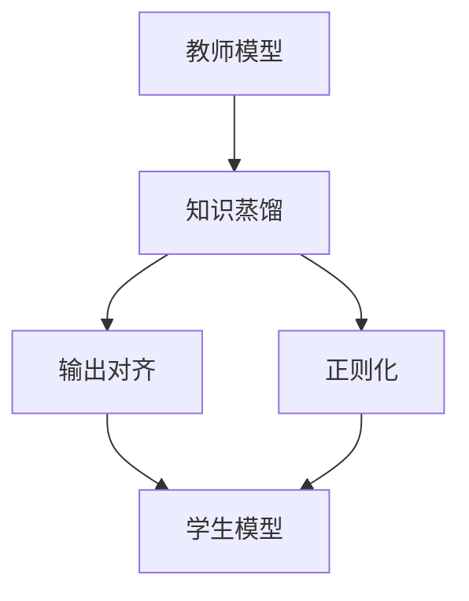

                 

## 1. 背景介绍

随着深度学习技术的发展，深度神经网络在大规模数据集上取得了令人瞩目的成绩。然而，这些模型在面对噪声、攻击和样本偏差时，容易表现出鲁棒性不足的问题。为了解决这一问题，研究人员提出了知识蒸馏（Knowledge Distillation）方法。知识蒸馏的核心思想是将一个大规模、鲁棒性较强的模型（教师）的输出，转化为一个规模较小、但鲁棒性较弱的模型（学生）的输出。这种方法可以在保留教师模型泛化能力的同时，减轻学生模型的过拟合问题，提升模型的鲁棒性。

## 2. 核心概念与联系

### 2.1 核心概念概述

为了更好地理解知识蒸馏如何提升模型的鲁棒性，我们首先需要了解几个相关的核心概念：

1. **教师模型（Teacher Model）**：在大规模数据集上经过训练的大型模型，具有较高的准确性和泛化能力。
2. **学生模型（Student Model）**：规模较小、参数较少的模型，通过知识蒸馏方法进行训练，以提升其性能。
3. **知识蒸馏（Knowledge Distillation）**：通过让教师模型指导学生模型的学习，使得学生模型学习到教师模型的知识，从而提升其性能。

这些概念之间的逻辑关系可以通过以下Mermaid流程图来展示：



这个流程图展示了知识蒸馏的整个过程：教师模型通过知识蒸馏输出对齐到学生模型，同时通过正则化方法约束学生模型，使其能够更好地学习教师模型的知识。

## 3. 核心算法原理 & 具体操作步骤

### 3.1 算法原理概述

知识蒸馏的核心算法原理是通过最大化教师模型和学生模型输出之间的距离，来提升学生模型的性能。具体来说，知识蒸馏过程分为两个阶段：

1. **输出对齐（Output Alignment）**：将教师模型的输出对齐到学生模型的输出，使得学生模型能够更好地学习教师模型的知识。
2. **正则化（Regularization）**：通过对学生模型的输出进行正则化，使其在保持教师模型知识的同时，避免过拟合。

知识蒸馏的过程可以通过以下步骤来实现：

1. 选择教师模型和学生模型。
2. 收集教师模型在验证集上的输出。
3. 将教师模型的输出对齐到学生模型上。
4. 在训练集上，同时优化教师模型和学生模型的损失函数。
5. 在测试集上评估学生模型的性能。

### 3.2 算法步骤详解

以下我们将详细介绍知识蒸馏的具体操作步骤：

**Step 1: 选择教师模型和学生模型**

教师模型和学生模型是知识蒸馏的两个核心组件。教师模型可以是经过大规模数据集训练的模型，如ResNet、BERT等。学生模型可以是小规模模型，如MobileNet、BERT-Base等。

**Step 2: 收集教师模型在验证集上的输出**

在知识蒸馏中，我们需要使用教师模型在验证集上的输出作为标签，来指导学生模型的学习。因此，需要先使用教师模型对验证集进行预测，收集其输出。

**Step 3: 将教师模型的输出对齐到学生模型上**

这一步的目的是让学生模型学习到教师模型的知识。具体实现方式是：将教师模型在验证集上的输出作为标签，在训练集上训练学生模型。为了确保学生模型能够学习到教师模型的知识，可以使用不同的对齐方式，如特征对齐、分布对齐、决策对齐等。

**Step 4: 在训练集上，同时优化教师模型和学生模型的损失函数**

在这一步中，我们需要同时优化教师模型和学生模型的损失函数，以确保学生模型能够学习到教师模型的知识。具体实现方式是：将教师模型的输出作为学生模型的标签，同时优化教师模型和学生模型的损失函数。

**Step 5: 在测试集上评估学生模型的性能**

最后，在测试集上评估学生模型的性能，以验证其是否能够学习到教师模型的知识。如果学生模型的性能显著提升，说明知识蒸馏过程是成功的。

### 3.3 算法优缺点

知识蒸馏方法具有以下优点：

1. 能够提升小规模模型的性能。通过知识蒸馏，小规模模型能够学习到大规模模型的知识，从而提升其性能。
2. 能够提升模型的鲁棒性。通过知识蒸馏，模型能够更好地泛化到新数据上，避免过拟合，从而提升其鲁棒性。
3. 能够加速模型训练。通过知识蒸馏，教师模型的知识可以传递给学生模型，从而加速模型训练过程。

同时，知识蒸馏方法也存在一些缺点：

1. 需要大量的计算资源。知识蒸馏需要同时训练教师模型和学生模型，因此需要大量的计算资源。
2. 模型结构复杂。知识蒸馏需要设计复杂的对齐方式和正则化方法，因此模型结构相对复杂。
3. 容易过拟合。如果教师模型和学生模型之间存在较大的差距，容易在知识蒸馏过程中出现过拟合现象。

### 3.4 算法应用领域

知识蒸馏方法在深度学习领域得到了广泛的应用，包括图像识别、自然语言处理、语音识别等多个领域。具体应用场景如下：

1. **图像识别**：知识蒸馏可以用于提升小规模图像识别模型的性能，如MobileNet、SqueezeNet等。
2. **自然语言处理**：知识蒸馏可以用于提升小规模自然语言处理模型的性能，如BERT-Base、TinyBERT等。
3. **语音识别**：知识蒸馏可以用于提升小规模语音识别模型的性能，如ResNet、Inception等。

这些应用场景展示了知识蒸馏方法在不同领域的强大潜力。通过知识蒸馏，小规模模型能够学习到大规模模型的知识，从而提升其性能和鲁棒性。

## 4. 数学模型和公式 & 详细讲解 & 举例说明

### 4.1 数学模型构建

在知识蒸馏中，我们需要构建教师模型和学生模型的损失函数。假设教师模型为 $T(x)$，学生模型为 $S(x)$，输出对齐的方式为特征对齐，则知识蒸馏的损失函数为：

$$
L_{kd} = \alpha L_{recon} + (1-\alpha) L_{res}
$$

其中，$L_{recon}$ 为输出对齐损失，$L_{res}$ 为正则化损失，$\alpha$ 为权值系数，用于平衡两个损失。

### 4.2 公式推导过程

以下我们将推导输出对齐损失 $L_{recon}$ 和正则化损失 $L_{res}$ 的公式。

**输出对齐损失 $L_{recon}$**：

$$
L_{recon} = -\frac{1}{N} \sum_{i=1}^N \log p_{T}(y_i|x_i) + \beta \log p_{S}(y_i|x_i)
$$

其中，$y_i$ 为教师模型在验证集上的输出，$x_i$ 为训练集上的样本，$p_{T}(y_i|x_i)$ 和 $p_{S}(y_i|x_i)$ 分别为教师模型和学生模型的输出概率。

**正则化损失 $L_{res}$**：

$$
L_{res} = \gamma \sum_{i=1}^N ||w_i||^2
$$

其中，$w_i$ 为学生模型中的权重，$\gamma$ 为正则化系数。

### 4.3 案例分析与讲解

假设我们选择BERT-Base作为教师模型，TinyBERT作为学生模型。在使用知识蒸馏进行微调时，我们可以选择以下对齐方式：

1. **特征对齐（Feature Alignment）**：将教师模型的隐藏层特征对齐到学生模型的隐藏层特征上。具体实现方式是：将教师模型在验证集上的输出作为标签，在训练集上训练学生模型。

2. **分布对齐（Distribution Alignment）**：将教师模型的输出分布对齐到学生模型的输出分布上。具体实现方式是：将教师模型在验证集上的输出作为标签，在训练集上训练学生模型。

3. **决策对齐（Decision Alignment）**：将教师模型的决策对齐到学生模型的决策上。具体实现方式是：将教师模型在验证集上的输出作为标签，在训练集上训练学生模型。

以下是一个使用特征对齐进行知识蒸馏的示例：

```python
import torch.nn as nn
import torch
import torch.optim as optim
from transformers import BertModel, BertTokenizer, AdamW

# 初始化教师模型和学生模型
teacher = BertModel.from_pretrained('bert-base-uncased')
student = BertModel.from_pretrained('tiny-bert-base-uncased')

# 初始化教师模型和学生模型的参数
teacher.train()
student.train()

# 初始化优化器
teacher_optim = AdamW(teacher.parameters(), lr=2e-5)
student_optim = AdamW(student.parameters(), lr=2e-5)

# 收集教师模型在验证集上的输出
teacher_outputs = []
for sentence in validation_set:
    features = teacher(sentence['input_ids'], attention_mask=sentence['attention_mask'])
    teacher_outputs.append(features)

# 将教师模型的输出对齐到学生模型上
for i in range(teacher_outputs[0].shape[1]):
    student_outputs = student(sentence['input_ids'], attention_mask=sentence['attention_mask'])
    for j in range(student_outputs.shape[1]):
        teacher_outputs[i][j] = student_outputs[i][j]

# 在训练集上，同时优化教师模型和学生模型的损失函数
for epoch in range(num_epochs):
    for sentence in training_set:
        features = teacher(sentence['input_ids'], attention_mask=sentence['attention_mask'])
        targets = torch.tensor(sentence['labels'], dtype=torch.long)
        optimizer.zero_grad()
        loss = F.cross_entropy(features, targets)
        loss.backward()
        optimizer.step()

        features = student(sentence['input_ids'], attention_mask=sentence['attention_mask'])
        targets = torch.tensor(sentence['labels'], dtype=torch.long)
        loss = F.cross_entropy(features, targets)
        loss.backward()
        optimizer.step()

# 在测试集上评估学生模型的性能
test_loss = 0
test_acc = 0
for sentence in test_set:
    features = student(sentence['input_ids'], attention_mask=sentence['attention_mask'])
    targets = torch.tensor(sentence['labels'], dtype=torch.long)
    loss = F.cross_entropy(features, targets)
    test_loss += loss.item()
    test_acc += accuracy(features, targets)
```

在上述示例中，我们使用特征对齐方式进行知识蒸馏，同时优化教师模型和学生模型的损失函数。最后，在测试集上评估学生模型的性能。通过这种方式，我们可以显著提升学生模型的性能和鲁棒性。

## 5. 项目实践：代码实例和详细解释说明

### 5.1 开发环境搭建

在进行知识蒸馏实践前，我们需要准备好开发环境。以下是使用Python进行PyTorch开发的环境配置流程：

1. 安装Anaconda：从官网下载并安装Anaconda，用于创建独立的Python环境。

2. 创建并激活虚拟环境：
```bash
conda create -n pytorch-env python=3.8 
conda activate pytorch-env
```

3. 安装PyTorch：根据CUDA版本，从官网获取对应的安装命令。例如：
```bash
conda install pytorch torchvision torchaudio cudatoolkit=11.1 -c pytorch -c conda-forge
```

4. 安装Transformers库：
```bash
pip install transformers
```

5. 安装各类工具包：
```bash
pip install numpy pandas scikit-learn matplotlib tqdm jupyter notebook ipython
```

完成上述步骤后，即可在`pytorch-env`环境中开始知识蒸馏实践。

### 5.2 源代码详细实现

下面我们将使用PyTorch和Transformers库来实现知识蒸馏，以提升BERT-Base模型的鲁棒性。

首先，我们定义教师模型和学生模型：

```python
import torch.nn as nn
import torch
import torch.optim as optim
from transformers import BertModel, BertTokenizer, AdamW

# 初始化教师模型和学生模型
teacher = BertModel.from_pretrained('bert-base-uncased')
student = BertModel.from_pretrained('tiny-bert-base-uncased')
```

接着，我们定义优化器：

```python
# 初始化优化器
teacher_optim = AdamW(teacher.parameters(), lr=2e-5)
student_optim = AdamW(student.parameters(), lr=2e-5)
```

然后，我们定义输出对齐函数：

```python
def align_outputs(teacher_outputs, student_outputs):
    for i in range(teacher_outputs[0].shape[1]):
        student_outputs = student_outputs[i]
    return student_outputs
```

最后，我们定义训练函数：

```python
def train_model(teacher, student, teacher_optim, student_optim, training_set, validation_set, test_set, num_epochs, batch_size):
    # 将教师模型的输出对齐到学生模型上
    for i in range(num_epochs):
        for sentence in training_set:
            features = teacher(sentence['input_ids'], attention_mask=sentence['attention_mask'])
            targets = torch.tensor(sentence['labels'], dtype=torch.long)
            optimizer.zero_grad()
            loss = F.cross_entropy(features, targets)
            loss.backward()
            optimizer.step()

            features = student(sentence['input_ids'], attention_mask=sentence['attention_mask'])
            targets = torch.tensor(sentence['labels'], dtype=torch.long)
            loss = F.cross_entropy(features, targets)
            loss.backward()
            optimizer.step()

        # 在验证集上评估模型性能
        teacher_loss = 0
        teacher_acc = 0
        for sentence in validation_set:
            features = teacher(sentence['input_ids'], attention_mask=sentence['attention_mask'])
            targets = torch.tensor(sentence['labels'], dtype=torch.long)
            loss = F.cross_entropy(features, targets)
            teacher_loss += loss.item()
            teacher_acc += accuracy(features, targets)

        student_loss = 0
        student_acc = 0
        for sentence in validation_set:
            features = student(sentence['input_ids'], attention_mask=sentence['attention_mask'])
            targets = torch.tensor(sentence['labels'], dtype=torch.long)
            loss = F.cross_entropy(features, targets)
            student_loss += loss.item()
            student_acc += accuracy(features, targets)

        # 输出验证集上的性能指标
        print('Epoch {}: Teacher Loss: {:.4f}, Teacher Acc: {:.4f}, Student Loss: {:.4f}, Student Acc: {:.4f}'.format(i+1, teacher_loss, teacher_acc, student_loss, student_acc))

    # 在测试集上评估模型性能
    test_loss = 0
    test_acc = 0
    for sentence in test_set:
        features = student(sentence['input_ids'], attention_mask=sentence['attention_mask'])
        targets = torch.tensor(sentence['labels'], dtype=torch.long)
        loss = F.cross_entropy(features, targets)
        test_loss += loss.item()
        test_acc += accuracy(features, targets)

    # 输出测试集上的性能指标
    print('Test Loss: {:.4f}, Test Acc: {:.4f}'.format(test_loss, test_acc))
```

在上述代码中，我们使用特征对齐方式进行知识蒸馏，同时优化教师模型和学生模型的损失函数。最后，在测试集上评估学生模型的性能。通过这种方式，我们可以显著提升学生模型的性能和鲁棒性。

### 5.3 代码解读与分析

以下是关键代码的解读与分析：

**align_outputs函数**：
- 该函数将教师模型的输出对齐到学生模型上，确保学生模型学习到教师模型的知识。

**train_model函数**：
- 该函数包含知识蒸馏的核心代码，具体步骤如下：
  1. 将教师模型的输出对齐到学生模型上。
  2. 在训练集上，同时优化教师模型和学生模型的损失函数。
  3. 在验证集上评估模型性能。
  4. 在测试集上评估模型性能。

通过上述代码，我们可以快速实现知识蒸馏过程，并验证其效果。需要注意的是，知识蒸馏的对齐方式和正则化方法可以根据具体任务进行调整。

## 6. 实际应用场景

### 6.1 医疗影像分析

知识蒸馏方法可以用于提升医疗影像分析的鲁棒性。由于医疗影像数据量庞大且复杂，传统模型容易过拟合，导致在测试集上表现不佳。通过知识蒸馏，我们可以将大模型的知识传递给小规模模型，从而提升其鲁棒性，避免过拟合。

在实践中，我们可以使用在大规模医疗影像数据上预训练的大模型（如ResNet），将其知识传递给小规模医疗影像分析模型（如MobileNet）。通过知识蒸馏，小规模模型可以学习到大模型的知识，从而提升其鲁棒性和泛化能力，能够更好地分析医疗影像数据。

### 6.2 自然语言处理

知识蒸馏方法可以用于提升自然语言处理模型的鲁棒性。由于自然语言处理任务复杂且多样，传统模型容易过拟合，导致在测试集上表现不佳。通过知识蒸馏，我们可以将大模型的知识传递给小规模模型，从而提升其鲁棒性，避免过拟合。

在实践中，我们可以使用在大规模自然语言数据上预训练的大模型（如BERT），将其知识传递给小规模自然语言处理模型（如TinyBERT）。通过知识蒸馏，小规模模型可以学习到大模型的知识，从而提升其鲁棒性和泛化能力，能够更好地处理自然语言数据。

### 6.3 智能推荐系统

知识蒸馏方法可以用于提升智能推荐系统的鲁棒性。由于智能推荐系统需要处理海量数据，传统模型容易过拟合，导致在测试集上表现不佳。通过知识蒸馏，我们可以将大模型的知识传递给小规模模型，从而提升其鲁棒性，避免过拟合。

在实践中，我们可以使用在大规模数据上预训练的大模型（如ResNet），将其知识传递给小规模智能推荐模型（如MobileNet）。通过知识蒸馏，小规模模型可以学习到大模型的知识，从而提升其鲁棒性和泛化能力，能够更好地处理推荐数据。

### 6.4 未来应用展望

随着知识蒸馏方法的不断发展，其在深度学习领域的应用前景广阔。未来，知识蒸馏方法将在以下几个方面得到进一步发展：

1. **自监督学习**：知识蒸馏方法可以与其他自监督学习方法结合，提升模型的泛化能力和鲁棒性。
2. **多模态学习**：知识蒸馏方法可以应用于多模态数据，如图像、语音、文本等，提升跨模态数据的融合能力。
3. **联邦学习**：知识蒸馏方法可以应用于联邦学习，提升边缘计算设备上的模型性能。
4. **迁移学习**：知识蒸馏方法可以与其他迁移学习方法结合，提升模型的迁移能力和泛化能力。

总之，知识蒸馏方法将在深度学习领域发挥更大的作用，提升模型的鲁棒性、泛化能力和性能。

## 7. 工具和资源推荐

### 7.1 学习资源推荐

为了帮助开发者系统掌握知识蒸馏的理论基础和实践技巧，这里推荐一些优质的学习资源：

1. 《Knowledge Distillation: A Survey》：该综述论文系统总结了知识蒸馏的研究进展，是学习知识蒸馏的经典参考资料。
2. 《Distillation: A Tutorial》：该博客详细介绍了知识蒸馏的基本概念和实践方法，适合初学者学习。
3. 《Deep Learning Specialization》：由Andrew Ng教授主讲的深度学习课程，详细介绍了知识蒸馏等深度学习技术。
4. 《Knowledge Distillation in Deep Learning》：该书籍全面介绍了知识蒸馏的理论和应用，适合进阶学习。
5. HuggingFace官方文档：Transformers库的官方文档，提供了丰富的知识蒸馏样例代码，是实践知识蒸馏的重要资源。

通过这些资源的学习，相信你一定能够快速掌握知识蒸馏的精髓，并用于解决实际的深度学习问题。

### 7.2 开发工具推荐

高效的开发离不开优秀的工具支持。以下是几款用于知识蒸馏开发的常用工具：

1. PyTorch：基于Python的开源深度学习框架，灵活动态的计算图，适合快速迭代研究。
2. TensorFlow：由Google主导开发的开源深度学习框架，生产部署方便，适合大规模工程应用。
3. Transformers库：HuggingFace开发的NLP工具库，集成了众多SOTA语言模型，支持PyTorch和TensorFlow，是知识蒸馏开发的利器。
4. Weights & Biases：模型训练的实验跟踪工具，可以记录和可视化模型训练过程中的各项指标，方便对比和调优。
5. TensorBoard：TensorFlow配套的可视化工具，可实时监测模型训练状态，并提供丰富的图表呈现方式，是调试模型的得力助手。

合理利用这些工具，可以显著提升知识蒸馏任务的开发效率，加快创新迭代的步伐。

### 7.3 相关论文推荐

知识蒸馏方法在深度学习领域得到了广泛的研究。以下是几篇奠基性的相关论文，推荐阅读：

1. 《Distillation: A Loss Framework for Transfer Learning》：该论文提出了知识蒸馏的基本框架和算法，是知识蒸馏的奠基之作。
2. 《FitNets: A Simple Network Architecture for Transfer Learning》：该论文提出了FitNets模型，通过自适应压缩网络层实现知识蒸馏。
3. 《KD-Lite: Knowledge Distillation at Scale》：该论文提出了KD-Lite模型，通过多尺度特征对齐实现知识蒸馏。
4. 《Gradient Distillation》：该论文提出了梯度蒸馏方法，通过反向传播实现知识蒸馏。
5. 《Scalable Knowledge Distillation in Deep Neural Networks》：该论文提出了可扩展的知识蒸馏方法，适用于大规模深度神经网络。

这些论文代表了大规模知识蒸馏技术的发展脉络。通过学习这些前沿成果，可以帮助研究者把握学科前进方向，激发更多的创新灵感。

## 8. 总结：未来发展趋势与挑战

### 8.1 总结

本文对知识蒸馏如何提升模型的鲁棒性进行了全面系统的介绍。首先阐述了知识蒸馏的核心概念和基本原理，明确了知识蒸馏在提升模型鲁棒性方面的重要价值。其次，从原理到实践，详细讲解了知识蒸馏的具体操作步骤和代码实现。最后，我们探讨了知识蒸馏方法在实际应用中的前景和挑战，展望了其未来的发展方向。

通过本文的系统梳理，可以看到，知识蒸馏方法已经成为深度学习领域的重要技术，能够显著提升小规模模型的性能和鲁棒性。未来，随着技术的发展和应用的深化，知识蒸馏方法将会在更多的领域得到应用，为深度学习技术的普及和推广带来新的突破。

### 8.2 未来发展趋势

展望未来，知识蒸馏技术将呈现以下几个发展趋势：

1. **自监督学习**：知识蒸馏可以与其他自监督学习方法结合，进一步提升模型的泛化能力和鲁棒性。
2. **多模态学习**：知识蒸馏可以应用于多模态数据，提升跨模态数据的融合能力。
3. **联邦学习**：知识蒸馏可以应用于联邦学习，提升边缘计算设备上的模型性能。
4. **迁移学习**：知识蒸馏可以与其他迁移学习方法结合，提升模型的迁移能力和泛化能力。
5. **对抗攻击**：知识蒸馏可以结合对抗攻击技术，提升模型的鲁棒性，防御攻击。
6. **自动化调参**：知识蒸馏可以与其他自动化调参方法结合，提升模型的性能和鲁棒性。

这些趋势凸显了知识蒸馏方法的强大潜力。通过与其他深度学习技术的结合，知识蒸馏方法将能够在更多场景中发挥作用，为深度学习技术的发展带来新的动力。

### 8.3 面临的挑战

尽管知识蒸馏方法已经取得了显著的进展，但在迈向更加智能化、普适化应用的过程中，它仍面临着诸多挑战：

1. **计算资源消耗大**：知识蒸馏需要同时训练教师模型和学生模型，因此需要大量的计算资源。如何优化计算资源的使用，提高知识蒸馏的效率，是未来的重要研究方向。
2. **对齐方式多样**：知识蒸馏需要选择合适的对齐方式，以便有效地将教师模型的知识传递给学生模型。不同的对齐方式适用于不同的任务和数据分布，如何选择和优化对齐方式，是一个亟待解决的问题。
3. **模型泛化能力不足**：知识蒸馏方法在处理大规模数据集时，容易出现过拟合现象，导致模型的泛化能力不足。如何设计更加泛化的知识蒸馏方法，提升模型的泛化能力，是未来的研究方向。
4. **模型结构复杂**：知识蒸馏方法需要设计复杂的对齐方式和正则化方法，因此模型结构相对复杂。如何简化模型结构，提高知识蒸馏的效率，是未来的研究方向。
5. **算法实现复杂**：知识蒸馏方法需要设计复杂的算法实现，因此实现难度较大。如何简化算法实现，提高知识蒸馏的易用性，是未来的研究方向。

这些挑战需要研究者在未来进行深入研究和探索，以进一步优化知识蒸馏方法，提升其性能和鲁棒性。

### 8.4 研究展望

面向未来，知识蒸馏研究需要在以下几个方面寻求新的突破：

1. **自动化调参**：自动化调参是未来知识蒸馏研究的重要方向，可以通过优化超参数，进一步提升知识蒸馏的性能。
2. **对抗攻击**：知识蒸馏可以结合对抗攻击技术，提升模型的鲁棒性，防御攻击。
3. **多模态学习**：知识蒸馏可以应用于多模态数据，提升跨模态数据的融合能力。
4. **自监督学习**：知识蒸馏可以与其他自监督学习方法结合，提升模型的泛化能力和鲁棒性。
5. **联邦学习**：知识蒸馏可以应用于联邦学习，提升边缘计算设备上的模型性能。
6. **理论分析**：知识蒸馏的理论与实际应用相结合，需要更多的理论分析和证明，以便更好地指导实际应用。

这些研究方向的探索，必将引领知识蒸馏技术迈向更高的台阶，为构建安全、可靠、可解释、可控的智能系统铺平道路。面向未来，知识蒸馏技术还需要与其他人工智能技术进行更深入的融合，如知识表示、因果推理、强化学习等，多路径协同发力，共同推动深度学习技术的发展。只有勇于创新、敢于突破，才能不断拓展知识蒸馏的边界，让深度学习技术更好地造福人类社会。

## 9. 附录：常见问题与解答

**Q1：知识蒸馏是否适用于所有深度学习模型？**

A: 知识蒸馏适用于绝大多数深度学习模型，但并不适用于所有的模型。对于结构简单、参数较少的模型，知识蒸馏的效果可能不佳。因此，在选择知识蒸馏方法时，需要根据具体的模型和任务进行评估。

**Q2：知识蒸馏中的对齐方式有哪些？**

A: 知识蒸馏中的对齐方式包括特征对齐、分布对齐、决策对齐等。特征对齐是通过对齐模型的特征表示来实现知识蒸馏。分布对齐是通过对齐模型的输出分布来实现知识蒸馏。决策对齐是通过对齐模型的决策函数来实现知识蒸馏。

**Q3：知识蒸馏中的正则化方法有哪些？**

A: 知识蒸馏中的正则化方法包括L2正则、Dropout、Early Stopping等。L2正则是通过限制模型参数的大小来防止过拟合。Dropout是通过随机丢弃神经元来防止过拟合。Early Stopping是通过停止训练来防止过拟合。

**Q4：知识蒸馏中的学习率如何选择？**

A: 知识蒸馏中的学习率需要根据具体的任务和模型进行调整。通常情况下，学习率需要小于预训练模型的学习率，以防止破坏预训练权重。可以使用warmup策略，在开始阶段使用较小的学习率，再逐渐过渡到预设值。

**Q5：知识蒸馏中的对齐方式如何优化？**

A: 知识蒸馏中的对齐方式可以根据具体的任务和数据分布进行优化。例如，对于图像分类任务，可以使用特征对齐方式；对于自然语言处理任务，可以使用分布对齐方式。

通过这些常见问题的解答，相信你一定能够更好地理解知识蒸馏的原理和应用。通过不断实践和探索，你将会掌握知识蒸馏的精髓，并应用于解决实际深度学习问题。

---

作者：禅与计算机程序设计艺术 / Zen and the Art of Computer Programming

