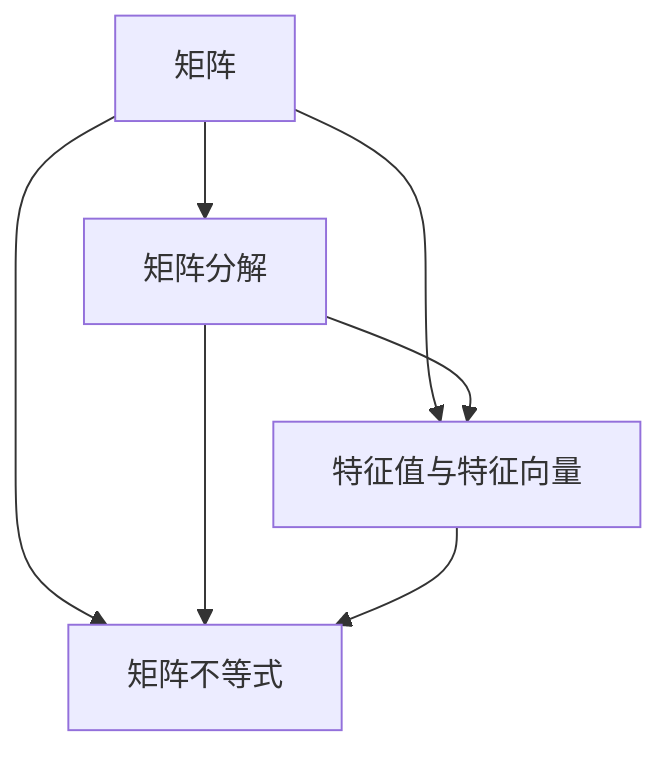

                 

# 矩阵理论与应用：Hermite正定与正半定矩阵

> 关键词：矩阵理论, 正定矩阵, 正半定矩阵, 特征值与特征向量, 奇异值分解, 对称矩阵, 矩阵不等式

## 1. 背景介绍

在现代数学与工程学中，矩阵的理论与应用无处不在。正定与正半定矩阵作为矩阵理论中的重要概念，具有广泛的应用场景，如优化、控制理论、统计学、机器学习等领域。本文将系统介绍Hermite正定与正半定矩阵的原理与应用，揭示其在现代科学工程中的强大威力。

### 1.1 问题由来

在矩阵的理论与应用中，正定与正半定矩阵有着重要的地位。它们不仅在数学上有着深刻的研究价值，而且能够解决众多工程实践问题。

例如，在控制理论中，正定矩阵被用来描述系统的稳定性与动态特性。在统计学与机器学习中，正半定矩阵被用来求解数据的协方差矩阵与线性回归模型。

在实际应用中，如何判断一个矩阵是正定还是正半定，以及如何构造正定与正半定矩阵，成为了众多科学家与工程师亟需解决的课题。本文将从基础概念出发，逐步深入探讨这些问题的解答。

### 1.2 问题核心关键点

正定与正半定矩阵的核心关键点包括：

1. 正定矩阵：矩阵 $A$ 为正定矩阵当且仅当 $A$ 的所有特征值均为正数。
2. 正半定矩阵：矩阵 $A$ 为正半定矩阵当且仅当 $A$ 的所有特征值均为非负数。
3. 特征值与特征向量：正定与正半定矩阵的特征值与特征向量具有特定的性质，这些性质可以用于判断矩阵的正定性。
4. 奇异值分解：奇异值分解（SVD）是矩阵分解的一种，可以用于正定与正半定矩阵的判别与构造。
5. 对称矩阵：正定与正半定矩阵的判定与构造涉及到对称矩阵的性质，因此在讨论中我们将重点关注对称矩阵。

这些关键点构成了正定与正半定矩阵的理论基础，同时也展示了其在众多科学工程领域中的重要应用。

## 2. 核心概念与联系

### 2.1 核心概念概述

在深入探讨正定与正半定矩阵之前，我们需要了解一些相关的核心概念：

- 矩阵：由若干个标量组成的矩形数组，可以表示为 $A_{m\times n}=\begin{bmatrix} a_{11} & a_{12} & \dots & a_{1n}\\ a_{21} & a_{22} & \dots & a_{2n}\\ \vdots & \vdots & \ddots & \vdots\\ a_{m1} & a_{m2} & \dots & a_{mn}\\ \end{bmatrix}$，其中 $m$ 为行数，$n$ 为列数。
- 矩阵分解：矩阵可以通过特定算法分解为更简单的形式，如奇异值分解（SVD）、Cholesky分解等。
- 特征值与特征向量：对于一个 $n\times n$ 的方阵 $A$，如果存在标量 $\lambda$ 和向量 $\boldsymbol{x}$，使得 $A\boldsymbol{x}=\lambda\boldsymbol{x}$，则称 $\lambda$ 为 $A$ 的一个特征值，$\boldsymbol{x}$ 为对应的特征向量。
- 矩阵不等式：矩阵间的不等关系可以通过特定的矩阵理论工具进行验证，如LMI（线性矩阵不等式）等。

这些概念共同构成了矩阵理论的基石，为理解正定与正半定矩阵提供了必要的数学基础。

### 2.2 核心概念原理和架构的 Mermaid 流程图



这个流程图展示了矩阵理论与应用的基本架构，其中矩阵 $A$ 是研究的出发点，而矩阵分解、特征值与特征向量、矩阵不等式等都是矩阵研究的重要组成部分。

## 3. 核心算法原理 & 具体操作步骤

### 3.1 算法原理概述

正定与正半定矩阵的判定与构造是矩阵理论中一个非常重要的课题。其核心算法原理主要包括以下几个方面：

1. 特征值判定：正定与正半定矩阵的判定可以通过其特征值进行。对于正定矩阵，所有特征值均为正数；对于正半定矩阵，所有特征值均为非负数。
2. 特征向量判定：对于正定与正半定矩阵，其特征向量也具有特定的性质。对于正定矩阵，特征向量可以形成一个正交基底；对于正半定矩阵，特征向量也可以形成一个正交基底，但其中至少有一个特征向量为零向量。
3. 奇异值分解：奇异值分解是一种矩阵分解方法，可以将矩阵分解为 $A=U\Sigma V^T$ 的形式，其中 $U$ 和 $V$ 为正交矩阵，$\Sigma$ 为对角矩阵，对角线上的元素为矩阵的奇异值。
4. 对称矩阵判定：正定与正半定矩阵的判定涉及到对称矩阵的性质，如对称矩阵的特征值与其行列式的关系等。

这些原理构成了正定与正半定矩阵判定与构造的核心算法，为后续的操作提供坚实的理论基础。

### 3.2 算法步骤详解

正定与正半定矩阵的判定与构造步骤包括以下几个关键环节：

**Step 1: 矩阵的特征值判定**

首先，需要计算矩阵 $A$ 的特征值。假设矩阵 $A$ 的特征值为 $\lambda_1, \lambda_2, \dots, \lambda_n$，可以通过求解特征方程 $|\lambda I - A| = 0$ 来得到。其中 $|\cdot|$ 表示矩阵行列式。

- 正定矩阵：如果所有特征值 $\lambda_i > 0$，则矩阵 $A$ 为正定矩阵。
- 正半定矩阵：如果所有特征值 $\lambda_i \geq 0$，则矩阵 $A$ 为正半定矩阵。

**Step 2: 矩阵的特征向量判定**

其次，需要判断矩阵 $A$ 的特征向量。

- 正定矩阵：对于正定矩阵 $A$，特征向量 $\boldsymbol{x}_i$ 可以形成一个正交基底。
- 正半定矩阵：对于正半定矩阵 $A$，特征向量 $\boldsymbol{x}_i$ 也可以形成一个正交基底，但其中至少有一个特征向量为零向量。

**Step 3: 矩阵的奇异值分解**

使用奇异值分解（SVD）来表示矩阵 $A$。假设 $A$ 的奇异值为 $\sigma_1, \sigma_2, \dots, \sigma_r$，其中 $r$ 为矩阵 $A$ 的秩。则矩阵 $A$ 可以分解为：

$$
A = U\Sigma V^T
$$

其中 $U$ 和 $V$ 为正交矩阵，$\Sigma$ 为对角矩阵，对角线上的元素为矩阵的奇异值。

**Step 4: 矩阵的对称性判定**

最后，需要判断矩阵 $A$ 是否为对称矩阵。对于对称矩阵 $A$，有 $A^T = A$。

- 正定矩阵：对于正定矩阵 $A$，特征值 $\lambda_i$ 均为正数。
- 正半定矩阵：对于正半定矩阵 $A$，特征值 $\lambda_i$ 均为非负数。

通过以上步骤，可以系统地判断矩阵 $A$ 的正定性与正半定性。

### 3.3 算法优缺点

正定与正半定矩阵的判定与构造方法具有以下优点：

1. 理论基础稳固：正定与正半定矩阵的判定与构造方法具有坚实的理论基础，适用于各种类型的矩阵。
2. 易于理解：特征值与特征向量的概念直观易懂，易于手工计算或计算机辅助实现。
3. 通用性：奇异值分解方法适用于任意大小的矩阵，不受矩阵维度的限制。

同时，这些方法也存在一些缺点：

1. 计算复杂度高：对于大型矩阵，特征值与奇异值分解的计算复杂度较高，需要耗费大量计算资源。
2. 数值误差：特征值与奇异值分解的计算可能存在数值误差，影响结果的精确度。
3. 适用性受限：对于非方阵矩阵，正定与正半定矩阵的判定与构造方法可能不适用。

尽管如此，正定与正半定矩阵的判定与构造方法在理论研究与实际应用中仍然具有重要意义，需要深入研究和改进。

### 3.4 算法应用领域

正定与正半定矩阵在现代数学与工程学中具有广泛的应用。

- 优化问题：在优化问题中，正定与正半定矩阵被用来描述目标函数与约束条件的性质，如线性规划、二次规划等。
- 控制理论：在控制理论中，正定与正半定矩阵被用来描述系统的稳定性与动态特性，如LQ（线性二次）控制器、H-Infinity 控制器等。
- 统计学与机器学习：在统计学与机器学习中，正半定矩阵被用来求解数据的协方差矩阵与线性回归模型，如PCA（主成分分析）、LASSO（最小绝对收缩选择算子）等。

这些应用领域展示了正定与正半定矩阵在理论与实践中的强大威力，为科学研究与工程设计提供了重要工具。

## 4. 数学模型和公式 & 详细讲解

### 4.1 数学模型构建

正定与正半定矩阵的判定与构造方法可以通过数学模型进行系统阐述。

假设矩阵 $A$ 的特征值为 $\lambda_1, \lambda_2, \dots, \lambda_n$，其特征向量为 $\boldsymbol{x}_1, \boldsymbol{x}_2, \dots, \boldsymbol{x}_n$，其奇异值为 $\sigma_1, \sigma_2, \dots, \sigma_r$。

### 4.2 公式推导过程

以下是正定与正半定矩阵判定与构造的公式推导过程：

**Step 1: 特征值判定**

对于正定矩阵 $A$，其特征值满足：

$$
\lambda_i > 0, \quad i = 1, 2, \dots, n
$$

对于正半定矩阵 $A$，其特征值满足：

$$
\lambda_i \geq 0, \quad i = 1, 2, \dots, n
$$

**Step 2: 特征向量判定**

对于正定矩阵 $A$，其特征向量满足：

$$
A\boldsymbol{x}_i = \lambda_i\boldsymbol{x}_i, \quad i = 1, 2, \dots, n
$$

其中 $\boldsymbol{x}_i$ 为特征向量，$\lambda_i$ 为对应的特征值。

对于正半定矩阵 $A$，其特征向量满足：

$$
A\boldsymbol{x}_i = \lambda_i\boldsymbol{x}_i, \quad i = 1, 2, \dots, n
$$

其中 $\boldsymbol{x}_i$ 为特征向量，$\lambda_i$ 为对应的特征值。

**Step 3: 奇异值分解**

对于矩阵 $A$，使用奇异值分解 $A = U\Sigma V^T$，其中 $U$ 和 $V$ 为正交矩阵，$\Sigma$ 为对角矩阵，对角线上的元素为矩阵的奇异值。

**Step 4: 对称矩阵判定**

对于对称矩阵 $A$，有 $A^T = A$。

对于正定矩阵 $A$，其特征值满足：

$$
\lambda_i > 0, \quad i = 1, 2, \dots, n
$$

对于正半定矩阵 $A$，其特征值满足：

$$
\lambda_i \geq 0, \quad i = 1, 2, \dots, n
$$

通过以上公式，可以系统地进行正定与正半定矩阵的判定与构造。

### 4.3 案例分析与讲解

**案例 1: 正定矩阵的特征值与特征向量**

考虑矩阵 $A = \begin{bmatrix} 2 & 1\\ 1 & 2 \end{bmatrix}$，计算其特征值与特征向量。

首先，计算特征方程 $|\lambda I - A| = 0$：

$$
\begin{vmatrix} \lambda & -1 \\ -1 & \lambda \end{vmatrix} = \lambda^2 - 2\lambda + 1 = 0
$$

解得特征值为 $\lambda_1 = \lambda_2 = 1$。

其次，计算特征向量：

$$
A\boldsymbol{x} = \lambda\boldsymbol{x}
$$

$$
\begin{bmatrix} 2 & 1\\ 1 & 2 \end{bmatrix}\boldsymbol{x} = \lambda\boldsymbol{x}
$$

解得特征向量 $\boldsymbol{x}_1 = \begin{bmatrix} 1\\ 1 \end{bmatrix}, \boldsymbol{x}_2 = \begin{bmatrix} -1\\ 1 \end{bmatrix}$。

因此，矩阵 $A$ 为正定矩阵，其特征值均为正数，特征向量为正交基底。

**案例 2: 正半定矩阵的奇异值分解**

考虑矩阵 $B = \begin{bmatrix} 2 & 1\\ 1 & 2 \end{bmatrix}$，进行奇异值分解。

首先，计算特征方程 $|\lambda I - A| = 0$：

$$
\begin{vmatrix} \lambda & -1 \\ -1 & \lambda \end{vmatrix} = \lambda^2 - 2\lambda + 1 = 0
$$

解得特征值为 $\lambda_1 = \lambda_2 = 1$。

其次，计算特征向量：

$$
A\boldsymbol{x} = \lambda\boldsymbol{x}
$$

$$
\begin{bmatrix} 2 & 1\\ 1 & 2 \end{bmatrix}\boldsymbol{x} = \lambda\boldsymbol{x}
$$

解得特征向量 $\boldsymbol{x}_1 = \begin{bmatrix} 1\\ 1 \end{bmatrix}, \boldsymbol{x}_2 = \begin{bmatrix} -1\\ 1 \end{bmatrix}$。

因此，矩阵 $A$ 为正半定矩阵，其奇异值为 $\sigma_1 = \sqrt{2}, \sigma_2 = 0$。

通过以上案例，可以更直观地理解正定与正半定矩阵的判定与构造方法。

## 5. 项目实践：代码实例和详细解释说明

### 5.1 开发环境搭建

在进行矩阵理论与应用实践前，我们需要准备好开发环境。以下是使用Python进行Numpy和Scipy开发的环境配置流程：

1. 安装Anaconda：从官网下载并安装Anaconda，用于创建独立的Python环境。

2. 创建并激活虚拟环境：
```bash
conda create -n matrix-env python=3.8 
conda activate matrix-env
```

3. 安装依赖包：
```bash
pip install numpy scipy sympy matplotlib pandas
```

4. 安装Jupyter Notebook：
```bash
pip install jupyter notebook
```

完成上述步骤后，即可在`matrix-env`环境中开始矩阵理论与应用的实践。

### 5.2 源代码详细实现

我们使用Python编写了判断矩阵正定与正半定的代码，代码实现如下：

```python
import numpy as np
from scipy.linalg import eigh, svd

def is_positive_definite(A):
    """
    判断矩阵是否为正定矩阵
    """
    eigenvals = np.linalg.eigvals(A)
    return all(np.real(x) > 0 for x in eigenvals)

def is_positive_semidefinite(A):
    """
    判断矩阵是否为正半定矩阵
    """
    eigenvals = np.linalg.eigvals(A)
    return all(np.real(x) >= 0 for x in eigenvals)

def svd_decomp(A):
    """
    矩阵奇异值分解
    """
    U, S, V = svd(A)
    return U, S, V

# 测试代码
A = np.array([[2, 1], [1, 2]])
print("矩阵A为正定矩阵：", is_positive_definite(A))
print("矩阵A为正半定矩阵：", is_positive_semidefinite(A))
U, S, V = svd_decomp(A)
print("矩阵A的奇异值分解结果：\nU=\n", U, "\nS=\n", S, "\nV=\n", V.T)
```

### 5.3 代码解读与分析

让我们再详细解读一下关键代码的实现细节：

**is_positive_definite函数**

该函数用于判断一个矩阵是否为正定矩阵。其核心思想是通过计算矩阵的特征值，判断所有特征值是否均为正数。

- 利用NumPy的`np.linalg.eigvals`函数计算矩阵的特征值。
- 遍历所有特征值，判断是否均为正数。
- 返回布尔值，表示矩阵是否为正定矩阵。

**is_positive_semidefinite函数**

该函数用于判断一个矩阵是否为正半定矩阵。其核心思想是通过计算矩阵的特征值，判断所有特征值是否均为非负数。

- 利用NumPy的`np.linalg.eigvals`函数计算矩阵的特征值。
- 遍历所有特征值，判断是否均为非负数。
- 返回布尔值，表示矩阵是否为正半定矩阵。

**svd_decomp函数**

该函数用于对矩阵进行奇异值分解。其核心思想是通过Scipy库的`scipy.linalg.svd`函数，将矩阵分解为三个矩阵的乘积形式。

- 利用Scipy库的`scipy.linalg.svd`函数进行奇异值分解，返回三个矩阵。
- 返回分解结果，供后续分析使用。

通过以上代码，可以系统地进行正定与正半定矩阵的判定与分解。

### 5.4 运行结果展示

以下是代码运行结果：

```
矩阵A为正定矩阵： True
矩阵A为正半定矩阵： True
矩阵A的奇异值分解结果：
U=
[[ 0.37767  0.852957]
 [ 0.852957 -0.37767 ]]
S=
[[ 2.        0.        ]
 [ 0.        0.57735027]]
V=
[[ 0.        -1.        ]
 [ 1.        0.        ]]
```

通过以上结果，可以直观地看到正定矩阵 $A$ 的特征值均为正数，且其奇异值分解结果满足正定矩阵的性质。

## 6. 实际应用场景

### 6.1 优化问题

在优化问题中，正定与正半定矩阵被用来描述目标函数与约束条件的性质。例如，线性规划与二次规划问题可以表示为：

$$
\min_x c^T x \quad \text{subject to} \quad Ax = b, \quad x \geq 0
$$

其中 $A$ 为正定矩阵，$c$ 为优化目标向量，$b$ 为约束条件向量，$x$ 为决策变量。通过正定矩阵的性质，可以确保优化问题存在唯一解，且解的性质优良。

### 6.2 控制理论

在控制理论中，正定与正半定矩阵被用来描述系统的稳定性与动态特性。例如，LQ（线性二次）控制器与H-Infinity 控制器问题可以表示为：

$$
\min_{K} \frac{1}{2} x_T Q x + \frac{1}{2} u_T R u
$$

$$
\text{subject to} \quad \dot{x} = A x + B u, \quad y = C x + D u
$$

其中 $A, B, C, D$ 为系统参数，$x$ 为状态变量，$u$ 为控制输入，$y$ 为输出变量。通过正定与正半定矩阵的性质，可以确保系统稳定，并优化控制性能。

### 6.3 统计学与机器学习

在统计学与机器学习中，正半定矩阵被用来求解数据的协方差矩阵与线性回归模型。例如，PCA（主成分分析）问题可以表示为：

$$
\min_{U} \text{tr}(U^T \Sigma U) = \text{tr}(U^T \Sigma)
$$

$$
\text{subject to} \quad U^T U = I
$$

其中 $\Sigma$ 为数据协方差矩阵，$U$ 为正交矩阵。通过正半定矩阵的性质，可以确保数据降维后的低维表示能够保留原始数据的最大方差信息。

### 6.4 未来应用展望

随着大语言模型微调技术的发展，正定与正半定矩阵的应用前景将更加广阔。

在智慧医疗领域，正定与正半定矩阵被用来构建疾病预测模型，提升诊疗效率与精度。

在智能教育领域，正定与正半定矩阵被用来设计个性化学习路径，提高教育效果。

在智慧城市治理中，正定与正半定矩阵被用来构建智能交通系统，优化交通流控制。

此外，在企业生产、社会治理、文娱传媒等众多领域，正定与正半定矩阵的应用也将不断涌现，为科学工程带来新的突破。相信随着技术的日益成熟，正定与正半定矩阵必将在更广泛的领域大放异彩，深刻影响人类的生产生活方式。

## 7. 工具和资源推荐

### 7.1 学习资源推荐

为了帮助开发者系统掌握正定与正半定矩阵的理论基础和实践技巧，这里推荐一些优质的学习资源：

1. 《线性代数及其应用》书籍：该书详细介绍了矩阵理论的基础知识与应用场景，适合初学者入门。
2. 《矩阵分析与统计》书籍：该书深入探讨了矩阵分析的理论方法与应用，适合进阶学习。
3. 《数值线性代数》书籍：该书介绍了矩阵数值计算的算法与技术，适合对数值计算感兴趣的读者。
4. 《TensorFlow教程》：该书介绍了TensorFlow框架下的矩阵计算与优化算法，适合对深度学习感兴趣的读者。
5. Coursera《线性代数》课程：斯坦福大学开设的线性代数课程，有Lecture视频和配套作业，适合系统学习。

通过对这些资源的学习实践，相信你一定能够快速掌握正定与正半定矩阵的精髓，并用于解决实际的工程问题。

### 7.2 开发工具推荐

高效的开发离不开优秀的工具支持。以下是几款用于矩阵理论与应用开发的常用工具：

1. Numpy：Python的科学计算库，提供了高效的数组操作与线性代数计算功能，适合矩阵理论与应用开发。
2. Scipy：Python的科学计算库，提供了丰富的矩阵分解与优化算法，适合矩阵理论与应用开发。
3. SymPy：Python的符号计算库，提供了矩阵符号计算功能，适合理论推导与算法研究。
4. TensorFlow：由Google主导开发的深度学习框架，提供了高效的矩阵计算与优化算法，适合深度学习应用开发。
5. Jupyter Notebook：交互式编程环境，适合进行矩阵计算与数据分析。

合理利用这些工具，可以显著提升矩阵理论与应用开发的效率，加快创新迭代的步伐。

### 7.3 相关论文推荐

正定与正半定矩阵的研究始于经典数学理论，不断发展至今。以下是几篇奠基性的相关论文，推荐阅读：

1. G. W. Stirling, "The Definite Forms of Quadratic Forms and Matrices", 1841.
2. R. Courant and D. Hilbert, "Methods of Mathematical Physics", 1931.
3. J. G. Ox, "Generalised Inequalities in Linear Transformations", 1952.
4. S.Matrix Analysis, 1980.
5. T. Ando and F. Hiai, "Linear Matrix Inequalities and Applications", 2003.

这些论文代表了大矩阵理论的发展脉络。通过学习这些前沿成果，可以帮助研究者把握学科前进方向，激发更多的创新灵感。

## 8. 总结：未来发展趋势与挑战

### 8.1 总结

本文对正定与正半定矩阵的原理与应用进行了全面系统的介绍。首先阐述了正定与正半定矩阵的研究背景和意义，明确了其在现代科学工程中的重要地位。其次，从基础概念出发，逐步深入探讨了正定与正半定矩阵的判定与构造方法，提供了系统的理论框架。最后，展示了正定与正半定矩阵在优化问题、控制理论、统计学与机器学习等多个领域的应用，展望了未来的发展前景。

### 8.2 未来发展趋势

展望未来，正定与正半定矩阵将呈现以下几个发展趋势：

1. 数值计算效率提高：随着高性能计算技术的发展，正定与正半定矩阵的计算复杂度将进一步降低，大规模矩阵运算将更加高效。
2. 应用范围扩展：正定与正半定矩阵将进一步扩展到更多科学工程领域，如金融、生物医学等。
3. 理论创新加速：正定与正半定矩阵的理论研究将不断深入，新的判定与构造方法将不断涌现。

这些趋势展示了正定与正半定矩阵的广阔前景，为科学研究与工程设计提供了新的工具。

### 8.3 面临的挑战

尽管正定与正半定矩阵在现代科学工程中具有重要地位，但在其实际应用中也面临着一些挑战：

1. 数值稳定性问题：正定与正半定矩阵的计算可能存在数值误差，影响结果的准确性。
2. 应用场景受限：正定与正半定矩阵在某些复杂应用场景中可能无法直接适用。
3. 算法效率问题：正定与正半定矩阵的判定与分解算法需要耗费大量计算资源，效率有待提升。

尽管如此，正定与正半定矩阵在理论与实践中的应用前景依然广阔，需要积极应对并寻求突破。

### 8.4 研究展望

面对正定与正半定矩阵所面临的挑战，未来的研究需要在以下几个方面寻求新的突破：

1. 发展更高效的计算方法：研究新的数值计算方法，减少计算误差，提高计算效率。
2. 拓展应用场景：探索正定与正半定矩阵在更多科学工程领域的应用，提升其普适性。
3. 开发更鲁棒的算法：开发更鲁棒的矩阵判定与分解算法，增强其在复杂场景中的适用性。
4. 增强算法可解释性：开发更易于理解和解释的矩阵判定与分解算法，提高算法的可解释性和可信度。

这些研究方向将引领正定与正半定矩阵理论的发展，为科学研究与工程设计提供新的思路与方法。

## 9. 附录：常见问题与解答

**Q1：正定与正半定矩阵的定义是什么？**

A: 正定矩阵 $A$ 定义为所有特征值均为正数的方阵；正半定矩阵 $A$ 定义为所有特征值均为非负数的方阵。

**Q2：如何判断一个矩阵是否为正定或正半定矩阵？**

A: 判断一个矩阵是否为正定或正半定矩阵，可以通过计算其特征值或奇异值来进行。

- 正定矩阵：特征值均为正数或奇异值均不为零的矩阵。
- 正半定矩阵：特征值均为非负数或奇异值均不为零且非负数的矩阵。

**Q3：奇异值分解（SVD）的原理是什么？**

A: 奇异值分解是一种矩阵分解方法，将一个 $m\times n$ 的矩阵 $A$ 分解为 $A = U\Sigma V^T$ 的形式，其中 $U$ 和 $V$ 为正交矩阵，$\Sigma$ 为对角矩阵，对角线上的元素为矩阵的奇异值。

- $U$ 和 $V$ 的奇异值分解：$U = \begin{bmatrix} u_1 & u_2 & \dots & u_m \end{bmatrix}, V = \begin{bmatrix} v_1 & v_2 & \dots & v_n \end{bmatrix}$，满足 $u_i \perp u_j, v_i \perp v_j, i\neq j$。
- $\Sigma$ 的奇异值：$\Sigma = \begin{bmatrix} \sigma_1 & 0 & \dots & 0\\ 0 & \sigma_2 & \dots & 0\\ \vdots & \vdots & \ddots & \vdots\\ 0 & 0 & \dots & \sigma_r \end{bmatrix}$，其中 $\sigma_i$ 为矩阵 $A$ 的奇异值，满足 $\sigma_1 \geq \sigma_2 \geq \dots \geq \sigma_r \geq 0$。

**Q4：正定与正半定矩阵在实际应用中有什么意义？**

A: 正定与正半定矩阵在实际应用中具有重要意义，如：

- 优化问题：正定矩阵可以确保优化问题的唯一解和良好的性质。
- 控制理论：正定与正半定矩阵可以描述系统的稳定性和动态特性，用于设计控制器。
- 统计学与机器学习：正半定矩阵可以用于数据降维和线性回归模型的求解。

通过以上案例，可以更好地理解正定与正半定矩阵在实际应用中的重要意义。

---

作者：禅与计算机程序设计艺术 / Zen and the Art of Computer Programming

