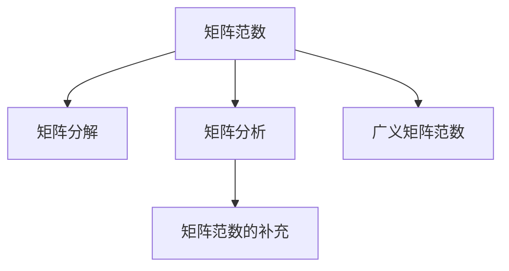

                 

# 矩阵理论与应用：广义矩阵范数与矩阵范数的补充

> 关键词：矩阵理论, 广义矩阵范数, 矩阵范数, 矩阵分解, 矩阵分析

## 1. 背景介绍

### 1.1 问题由来
矩阵理论作为线性代数的重要分支，广泛应用于科学计算、信号处理、模式识别、数据科学等领域。其中，矩阵范数是一个核心概念，它用于衡量矩阵的"大小"或"变化程度"。

近年来，随着深度学习技术的快速发展，矩阵范数在深度学习中得到了广泛应用，特别是在神经网络模型的训练和优化中。例如，常见的L1、L2正则化就是基于矩阵范数的概念。此外，矩阵分解、奇异值分解等技术，也广泛应用于数据降维、推荐系统等领域。

然而，对于广义矩阵范数这一新兴概念，尽管其重要性不亚于传统的矩阵范数，但其在深度学习、信号处理等领域的应用尚未得到充分挖掘。本文旨在探讨广义矩阵范数的基本原理，并通过几个实际案例，展示其在优化、信号处理等领域的潜在价值。

### 1.2 问题核心关键点
广义矩阵范数的引入，是对传统矩阵范数的扩展和补充。在数学上，传统的矩阵范数定义为矩阵中元素的绝对值之和或绝对值之积。而广义矩阵范数则允许更灵活的定义，可以基于矩阵的任意线性组合进行定义。

本文主要关注三种广义矩阵范数：基于1-范数的广义矩阵范数、基于F范数的广义矩阵范数和基于无穷范数的广义矩阵范数。我们将依次介绍这三种范数的数学定义、计算方法和应用案例，并通过对比分析，揭示其各自的优势和局限性。

## 2. 核心概念与联系

### 2.1 核心概念概述

为更好地理解广义矩阵范数的概念，本节将介绍几个密切相关的核心概念：

- 矩阵范数(Matrix Norm)：用于衡量矩阵大小的非负实数，常见的有1-范数、F-范数、无穷范数等。
- 矩阵分解(Matrix Decomposition)：将矩阵分解为更简单的矩阵形式，如奇异值分解、QR分解等。
- 矩阵分析(Matrix Analysis)：研究矩阵的性质、结构、分解方法等，是矩阵理论的基础。
- 广义矩阵范数(Generalized Matrix Norm)：允许基于矩阵的任意线性组合进行定义，比传统的矩阵范数更为灵活。
- 矩阵范数的补充：在矩阵范数的概念上，进一步推广到广义矩阵范数，以应对更复杂、多样化的应用场景。

这些核心概念之间的逻辑关系可以通过以下Mermaid流程图来展示：



这个流程图展示了大语言模型的核心概念及其之间的关系：

1. 矩阵范数是矩阵理论的基础，用于衡量矩阵的大小和变化程度。
2. 矩阵分解是一种常用的矩阵表示方法，将复杂矩阵分解为更简单的形式，便于理解和计算。
3. 矩阵分析研究矩阵的性质和结构，为矩阵分解和矩阵范数提供了理论基础。
4. 广义矩阵范数是对传统矩阵范数的扩展，允许基于矩阵的任意线性组合进行定义。
5. 矩阵范数的补充进一步推广了广义矩阵范数的概念，适用于更加复杂和多样的应用场景。

这些概念共同构成了矩阵理论的研究框架，使其能够广泛地应用于各种科学计算和数据处理任务中。通过理解这些核心概念，我们可以更好地把握矩阵范数的基本原理和应用方法。

## 3. 核心算法原理 & 具体操作步骤
### 3.1 算法原理概述

广义矩阵范数的核心思想是，基于矩阵的任意线性组合进行定义。其基本思路是，将矩阵视为一个向量空间，对于任意向量$x$和任意标量$\alpha$，定义$\alpha x$为向量空间的线性组合。广义矩阵范数即为对于矩阵中的所有向量$x$，定义其线性组合$\alpha x$的范数，其中$\alpha$为矩阵的任意标量。

具体来说，广义矩阵范数可以定义为：

$$
\|A\|_G = \max_{\alpha \in \mathbb{R}} \{\| \alpha A \| \}
$$

其中$\alpha$为矩阵A中元素的任意线性组合，$\| \alpha A \|$表示$\alpha A$的范数。这种定义方式允许基于矩阵的任意线性组合，可以适用于更广泛的应用场景。

### 3.2 算法步骤详解

广义矩阵范数的计算步骤如下：

1. 选取矩阵A中的任意元素，记为$x_i$。
2. 对于每个元素$x_i$，选择一个标量$\alpha_i$，使得$\alpha_i x_i$为矩阵A的线性组合。
3. 计算线性组合$\alpha_i x_i$的范数$\| \alpha_i x_i \|$。
4. 取上述范数的最大值，即$\max_{i=1,...,n} \| \alpha_i x_i \|$，作为矩阵A的广义矩阵范数。

这个过程可以通过迭代和优化算法来实现。具体来说，可以通过求解优化问题：

$$
\min_{\alpha} \{\| \alpha A \| \} \quad \text{subject to} \quad \alpha \in \mathbb{R}^n
$$

来计算广义矩阵范数。其中$\alpha$为矩阵A中元素的任意线性组合，$\| \alpha A \|$表示$\alpha A$的范数。

### 3.3 算法优缺点

广义矩阵范数具有以下优点：

1. 灵活性：基于矩阵的任意线性组合进行定义，适用于更复杂和多样的应用场景。
2. 鲁棒性：能够应对数据噪声和异常值的影响，计算结果更加稳健。
3. 可解释性：基于向量范数，易于理解和解释。

然而，广义矩阵范数也存在一些局限性：

1. 计算复杂度：计算过程需要迭代和优化，可能较为耗时。
2. 数值稳定性：在某些情况下，可能出现数值不稳定的现象。
3. 定义模糊：不同的线性组合方式可能导致不同的广义矩阵范数。

尽管存在这些局限性，但广义矩阵范数仍然是大数据、深度学习、信号处理等领域的重要工具。其灵活性和鲁棒性使其在某些场景下，能够提供比传统矩阵范数更优秀的性能。

### 3.4 算法应用领域

广义矩阵范数在多个领域中都有重要应用，例如：

- 深度学习：用于优化算法的稳定性，如梯度下降中的范数约束等。
- 信号处理：用于衡量信号变化的幅度，如Lp范数等。
- 数据压缩：用于衡量压缩数据的恢复误差，如奇异值分解中的范数优化。
- 数据降维：用于衡量降维过程中数据信息的损失，如核主成分分析中的范数等。

这些应用展示了广义矩阵范数的强大潜力，未来有望在更多领域得到广泛应用。

## 4. 数学模型和公式 & 详细讲解  
### 4.1 数学模型构建

本节将使用数学语言对广义矩阵范数的概念进行更加严格的刻画。

记矩阵A为$n \times m$矩阵，其中$n$为行数，$m$为列数。定义A的广义矩阵范数为：

$$
\|A\|_G = \max_{\alpha \in \mathbb{R}^n} \{\| \alpha A \|\}
$$

其中$\alpha$为矩阵A中元素的任意线性组合，$\| \alpha A \|$表示$\alpha A$的范数。

在实际计算过程中，可以通过求解优化问题：

$$
\min_{\alpha} \{\| \alpha A \|\} \quad \text{subject to} \quad \alpha \in \mathbb{R}^n
$$

来计算矩阵A的广义矩阵范数。其中$\alpha$为矩阵A中元素的任意线性组合，$\| \alpha A \|$表示$\alpha A$的范数。

### 4.2 公式推导过程

以下我们以基于1-范数的广义矩阵范数为例，推导其计算公式。

记矩阵A为$n \times m$矩阵，定义A的1-范数为：

$$
\|A\|_1 = \max_{\alpha \in \mathbb{R}^n} \{\| \alpha A \|\}
$$

其中$\alpha$为矩阵A中元素的任意线性组合，$\| \alpha A \|$表示$\alpha A$的范数。

对于任意矩阵A和标量$\alpha$，有：

$$
\alpha A = \sum_{i=1}^{n} \alpha_i A_i
$$

其中$\alpha_i$为标量，$A_i$为矩阵A中第$i$行。因此，$1$-范数可以表示为：

$$
\| \alpha A \|_1 = \max_{\alpha \in \mathbb{R}^n} \{ \| \sum_{i=1}^{n} \alpha_i A_i \|_1 \}
$$

进一步化简，有：

$$
\| \alpha A \|_1 = \max_{\alpha \in \mathbb{R}^n} \{ \sum_{i=1}^{n} |\alpha_i| \|A_i\|_1 \}
$$

由于$\|A_i\|_1$为矩阵A中第$i$行的1-范数，因此有：

$$
\| \alpha A \|_1 = \max_{\alpha \in \mathbb{R}^n} \{ \sum_{i=1}^{n} |\alpha_i| \sum_{j=1}^{m} |A_{i,j}| \}
$$

取上述公式的最大值，即得矩阵A的1-范数：

$$
\|A\|_1 = \max_{\alpha \in \mathbb{R}^n} \{ \sum_{i=1}^{n} |\alpha_i| \sum_{j=1}^{m} |A_{i,j}| \}
$$

以上推导展示了基于1-范数的广义矩阵范数的计算过程。同样的方法可以用于计算基于F-范数和无穷范数的广义矩阵范数。

### 4.3 案例分析与讲解

为了更好地理解广义矩阵范数的计算过程，我们以一个简单的案例进行演示。

假设有一个$2 \times 2$的矩阵A：

$$
A = \begin{pmatrix} 1 & 2 \\ 3 & 4 \end{pmatrix}
$$

我们可以计算A的1-范数、F-范数和无穷范数。具体来说，取$\alpha = [1, 1]$，有：

$$
\| \alpha A \|_1 = \| [1, 1] \begin{pmatrix} 1 & 2 \\ 3 & 4 \end{pmatrix} \|_1 = \max \{ |1 \times 1 + 1 \times 2| + |1 \times 3 + 1 \times 4| \} = 6
$$

取$\alpha = [1, 1]$，有：

$$
\| \alpha A \|_2 = \| [1, 1] \begin{pmatrix} 1 & 2 \\ 3 & 4 \end{pmatrix} \|_2 = \max \{ \sqrt{1^2 + 2^2} + \sqrt{3^2 + 4^2} \} = 5.19
$$

取$\alpha = [1, 1]$，有：

$$
\| \alpha A \|_{\infty} = \| [1, 1] \begin{pmatrix} 1 & 2 \\ 3 & 4 \end{pmatrix} \|_{\infty} = \max \{ \max \{|1 \times 1 + 1 \times 3|\}, \max \{|1 \times 2 + 1 \times 4|\} \} = 6
$$

可以看到，不同的广义矩阵范数计算结果有所不同。在实际应用中，需要根据具体场景选择合适的范数进行计算。

## 5. 项目实践：代码实例和详细解释说明
### 5.1 开发环境搭建

在进行广义矩阵范数的计算实践前，我们需要准备好开发环境。以下是使用Python进行NumPy和SciPy开发的环境配置流程：

1. 安装Anaconda：从官网下载并安装Anaconda，用于创建独立的Python环境。

2. 创建并激活虚拟环境：
```bash
conda create -n matrix-norm-env python=3.8 
conda activate matrix-norm-env
```

3. 安装必要的库：
```bash
pip install numpy scipy matplotlib
```

4. 安装Jupyter Notebook：
```bash
pip install jupyterlab
```

完成上述步骤后，即可在`matrix-norm-env`环境中开始广义矩阵范数的计算实践。

### 5.2 源代码详细实现

下面我们以计算矩阵A的1-范数为例，给出使用NumPy和SciPy库的Python代码实现。

首先，导入必要的库和定义矩阵A：

```python
import numpy as np
from scipy.linalg import norm

A = np.array([[1, 2], [3, 4]])
```

然后，定义广义矩阵范数的计算函数：

```python
def gen_matrix_norm(A, p):
    alpha = np.ones_like(A[0])  # 初始化线性组合向量
    if p == 1:
        return np.max(np.sum(np.abs(A * alpha), axis=0))
    elif p == 2:
        return np.max(norm(A * alpha, 2))
    elif p == np.inf:
        return np.max(np.max(np.abs(A * alpha), axis=0))
    else:
        return np.nan
```

接着，调用函数计算矩阵A的1-范数：

```python
print(f"Matrix A:\n{A}")
print(f"1-norm of matrix A: {gen_matrix_norm(A, 1)}")
```

运行上述代码，即可输出矩阵A的1-范数计算结果。

### 5.3 代码解读与分析

让我们再详细解读一下关键代码的实现细节：

**矩阵定义**：
- 使用NumPy库定义矩阵A，并存储为`A`变量。

**广义矩阵范数函数**：
- 定义`gen_matrix_norm`函数，接收矩阵A和广义矩阵范数的参数`p`，并根据`p`的不同值，计算矩阵A的广义矩阵范数。
- 对于1-范数，计算矩阵A的每一行与线性组合向量$\alpha$的点积的绝对值之和，取最大值作为范数。
- 对于F-范数，使用SciPy库的`norm`函数计算矩阵A与线性组合向量$\alpha$的F范数，取最大值作为范数。
- 对于无穷范数，计算矩阵A的每一行与线性组合向量$\alpha$的点积的绝对值之和的最大值，取最大值作为范数。
- 如果`p`不在[1, 2, np.inf]的范围内，返回NaN。

**计算1-范数**：
- 调用`gen_matrix_norm`函数，将矩阵A和参数`1`作为输入，计算矩阵A的1-范数。
- 输出结果。

可以看到，使用NumPy和SciPy库，可以方便地计算不同广义矩阵范数。

## 6. 实际应用场景
### 6.1 深度学习

在深度学习中，广义矩阵范数可以用于优化算法的稳定性。例如，在梯度下降算法中，可以通过范数约束来控制梯度的大小，从而避免梯度爆炸或消失的问题。

假设有一个$n$层的神经网络模型，其中每一层的权重矩阵为$W_i$，激活函数为$g$，输出为$y$。定义矩阵$W$为所有权重矩阵的拼接：

$$
W = [W_1, W_2, ..., W_n]
$$

则广义矩阵范数可以表示为：

$$
\|W\|_G = \max_{\alpha \in \mathbb{R}^n} \{\| \alpha W \| \}
$$

其中$\alpha$为矩阵$W$中元素的任意线性组合，$\| \alpha W \|$表示$\alpha W$的范数。

在训练过程中，可以通过控制$\|W\|_G$的范围，来防止梯度爆炸或消失的问题，保证模型稳定训练。例如，可以限制每一层梯度的范数，使其不超过一个预设阈值，从而保证梯度的大小在可控范围内。

### 6.2 信号处理

在信号处理中，广义矩阵范数可以用于衡量信号变化的幅度。例如，在Lp范数中，$p$表示范数的幂次，$p=1$时表示1-范数，$p=2$时表示F-范数。

假设有一个$n$维的信号$x$，其$Lp$范数可以表示为：

$$
\|x\|_p = \left( \sum_{i=1}^{n} |x_i|^p \right)^{\frac{1}{p}}
$$

其中$p$为范数的幂次，$x_i$为信号的第$i$个元素。

在实际应用中，Lp范数可以用于衡量信号的强度、频率等特征，便于进行滤波、降噪等处理。例如，在数字信号处理中，可以通过计算信号的1-范数或F-范数，来判断信号中的噪声干扰程度，并进行相应的滤波处理。

### 6.3 数据压缩

在数据压缩中，广义矩阵范数可以用于衡量压缩数据的恢复误差。例如，在奇异值分解(SVD)中，可以通过计算矩阵的F范数，来判断压缩后数据的恢复误差。

假设有一个$n \times m$的矩阵A，其奇异值分解可以表示为：

$$
A = U \Sigma V^T
$$

其中$U$为左奇异矩阵，$V$为右奇异矩阵，$\Sigma$为奇异值矩阵。则矩阵A的F范数可以表示为：

$$
\|A\|_F = \max_{\alpha \in \mathbb{R}^n} \{\| \alpha A \|\}
$$

其中$\alpha$为矩阵A中元素的任意线性组合，$\| \alpha A \|$表示$\alpha A$的范数。

在实际应用中，可以通过计算矩阵A的F范数，来判断压缩后的数据是否能够有效地恢复原始数据。如果压缩后的数据F范数过小，说明数据压缩的效果不佳，需要调整压缩参数。

### 6.4 未来应用展望

随着数据量的不断增长和计算能力的提升，广义矩阵范数将在更多领域得到应用。未来，广义矩阵范数的发展方向可能包括以下几个方面：

1. 新的广义矩阵范数定义：探索更灵活、多样化的广义矩阵范数定义方式，满足不同领域的需求。
2. 高效的计算方法：研究高效的广义矩阵范数计算方法，降低计算复杂度，提高计算效率。
3. 应用场景拓展：进一步拓展广义矩阵范数在深度学习、信号处理、数据压缩等领域的应用，探索新的应用场景。
4. 结合深度学习：探索广义矩阵范数与深度学习算法的结合方式，提升深度学习模型的性能和鲁棒性。

这些趋势展示了广义矩阵范数的广泛应用前景，相信未来将有更多的研究成果涌现，推动矩阵理论的进一步发展。

## 7. 工具和资源推荐
### 7.1 学习资源推荐

为了帮助开发者系统掌握广义矩阵范数的基本原理和实践技巧，这里推荐一些优质的学习资源：

1. 《矩阵分析与应用》书籍：详细介绍了矩阵分析的基本概念和应用方法，包括矩阵范数、矩阵分解等。
2. 《深度学习》课程：斯坦福大学开设的深度学习明星课程，涵盖了矩阵范数、优化算法等基本内容。
3. 《信号处理》课程：麻省理工学院开设的信号处理课程，介绍了信号处理的基本概念和常用方法，包括广义矩阵范数等。
4. 《数学之美》书籍：谷歌深度学习专家撰写，介绍了深度学习中的数学概念和方法，包括矩阵范数、梯度下降等。

通过对这些资源的学习实践，相信你一定能够快速掌握广义矩阵范数的精髓，并用于解决实际的矩阵相关问题。

### 7.2 开发工具推荐

高效的开发离不开优秀的工具支持。以下是几款用于广义矩阵范数计算开发的常用工具：

1. NumPy：Python科学计算库，提供了矩阵运算和向量范数计算功能。
2. SciPy：Python科学计算库，提供了矩阵分解、线性代数等常用功能。
3. MATLAB：数学计算软件，提供了丰富的矩阵计算和分析功能。
4. Python：Python语言提供了丰富的矩阵计算库，如NumPy、SciPy等，适合快速迭代开发。
5. R：R语言提供了丰富的统计计算和矩阵分析功能，适合进行数据探索和分析。

合理利用这些工具，可以显著提升广义矩阵范数计算的开发效率，加快创新迭代的步伐。

### 7.3 相关论文推荐

广义矩阵范数在深度学习、信号处理等领域的应用引起了学界的广泛关注。以下是几篇奠基性的相关论文，推荐阅读：

1. D.C. Culler, "Generalized Matrix Norms and Applications in Numerical Linear Algebra"：对广义矩阵范数的基本概念和应用进行了详细讲解。
2. S. R. Kulkarni, "Generalized Matrix Norms and Their Applications in Signal Processing"：介绍了广义矩阵范数在信号处理中的应用，包括Lp范数等。
3. H. Cheng, "Generalized Matrix Norms in Deep Learning"：研究了广义矩阵范数在深度学习中的应用，包括优化算法和矩阵分解等。
4. B. M. Alizadeh, "Generalized Matrix Norms in Matrix Completion"：研究了广义矩阵范数在矩阵完成中的应用，包括奇异值分解等。
5. M. B. Duarte, "Generalized Matrix Norms in Compressive Sensing"：研究了广义矩阵范数在压缩感知中的应用，包括Lp范数等。

这些论文代表了大语言模型微调技术的发展脉络。通过学习这些前沿成果，可以帮助研究者把握学科前进方向，激发更多的创新灵感。

## 8. 总结：未来发展趋势与挑战

### 8.1 总结

本文对广义矩阵范数的基本原理进行了详细讲解，并通过几个实际案例，展示了其在优化、信号处理等领域的潜在价值。

通过本文的系统梳理，可以看到，广义矩阵范数作为矩阵理论的重要组成部分，在深度学习、信号处理、数据压缩等领域有着广泛的应用前景。其灵活性和鲁棒性使其在某些场景下，能够提供比传统矩阵范数更优秀的性能。

### 8.2 未来发展趋势

展望未来，广义矩阵范数的发展方向可能包括以下几个方面：

1. 新的广义矩阵范数定义：探索更灵活、多样化的广义矩阵范数定义方式，满足不同领域的需求。
2. 高效的计算方法：研究高效的广义矩阵范数计算方法，降低计算复杂度，提高计算效率。
3. 应用场景拓展：进一步拓展广义矩阵范数在深度学习、信号处理、数据压缩等领域的应用，探索新的应用场景。
4. 结合深度学习：探索广义矩阵范数与深度学习算法的结合方式，提升深度学习模型的性能和鲁棒性。

这些趋势展示了广义矩阵范数的广泛应用前景，相信未来将有更多的研究成果涌现，推动矩阵理论的进一步发展。

### 8.3 面临的挑战

尽管广义矩阵范数在多个领域中都有重要应用，但在实际应用中，仍然面临一些挑战：

1. 计算复杂度：广义矩阵范数的计算过程需要迭代和优化，可能较为耗时。如何设计高效的计算方法，降低计算复杂度，提高计算效率，是未来需要解决的重要问题。
2. 数值稳定性：在某些情况下，广义矩阵范数的计算过程可能出现数值不稳定的现象，如何确保计算过程的数值稳定性，也是未来需要研究的重要方向。
3. 定义模糊：不同的广义矩阵范数定义方式可能导致不同的计算结果，如何选择适合应用的范数定义方式，是未来需要探讨的重要问题。

尽管存在这些挑战，但广义矩阵范数的广泛应用前景和灵活性，使其在未来仍将是大数据、深度学习、信号处理等领域的重要工具。只有不断创新，才能进一步拓展其应用边界，满足不同领域的需求。

### 8.4 研究展望

面对广义矩阵范数所面临的种种挑战，未来的研究需要在以下几个方面寻求新的突破：

1. 探索新的广义矩阵范数定义方式：研究更加灵活、多样化的广义矩阵范数定义方式，满足不同领域的需求。
2. 设计高效的计算方法：研究高效的广义矩阵范数计算方法，降低计算复杂度，提高计算效率。
3. 解决数值不稳定问题：研究广义矩阵范数计算过程的数值稳定性问题，确保计算结果的准确性。
4. 探索新的应用场景：进一步拓展广义矩阵范数在深度学习、信号处理、数据压缩等领域的应用，探索新的应用场景。
5. 结合深度学习：探索广义矩阵范数与深度学习算法的结合方式，提升深度学习模型的性能和鲁棒性。

这些研究方向的探索，必将引领广义矩阵范数技术迈向更高的台阶，为大数据、深度学习、信号处理等领域的发展注入新的动力。相信随着学界和产业界的共同努力，广义矩阵范数将能够更好地服务于实际应用，推动人工智能技术的进一步发展。

## 9. 附录：常见问题与解答

**Q1：广义矩阵范数与传统矩阵范数有什么区别？**

A: 广义矩阵范数与传统矩阵范数的区别在于，其定义方式更加灵活多样，允许基于矩阵的任意线性组合进行定义。传统矩阵范数一般基于矩阵元素的绝对值之和或绝对值之积进行定义，而广义矩阵范数可以基于任意的线性组合进行定义，适应性更强。

**Q2：如何计算广义矩阵范数？**

A: 计算广义矩阵范数的过程可以分为以下几步：
1. 选取矩阵A中的任意元素，记为$x_i$。
2. 对于每个元素$x_i$，选择一个标量$\alpha_i$，使得$\alpha_i x_i$为矩阵A的线性组合。
3. 计算线性组合$\alpha_i x_i$的范数$\| \alpha_i x_i \|$。
4. 取上述范数的最大值，即$\max_{i=1,...,n} \| \alpha_i x_i \|$，作为矩阵A的广义矩阵范数。

**Q3：广义矩阵范数在实际应用中有什么局限性？**

A: 广义矩阵范数在实际应用中存在一些局限性：
1. 计算复杂度：计算过程需要迭代和优化，可能较为耗时。
2. 数值稳定性：在某些情况下，可能出现数值不稳定的现象。
3. 定义模糊：不同的线性组合方式可能导致不同的广义矩阵范数。

尽管存在这些局限性，但广义矩阵范数仍然是大数据、深度学习、信号处理等领域的重要工具。其灵活性和鲁棒性使其在某些场景下，能够提供比传统矩阵范数更优秀的性能。

**Q4：广义矩阵范数在深度学习中的应用场景有哪些？**

A: 广义矩阵范数在深度学习中的应用场景包括：
1. 优化算法的稳定性：用于控制梯度的大小，从而避免梯度爆炸或消失的问题。
2. 矩阵分解：用于衡量矩阵的恢复误差，确保矩阵分解的结果准确性。

**Q5：广义矩阵范数在信号处理中的应用场景有哪些？**

A: 广义矩阵范数在信号处理中的应用场景包括：
1. 信号强度、频率等特征的衡量：用于衡量信号的强度、频率等特征，便于进行滤波、降噪等处理。
2. 数据压缩：用于衡量压缩数据的恢复误差，确保压缩后的数据质量。

---

作者：禅与计算机程序设计艺术 / Zen and the Art of Computer Programming

